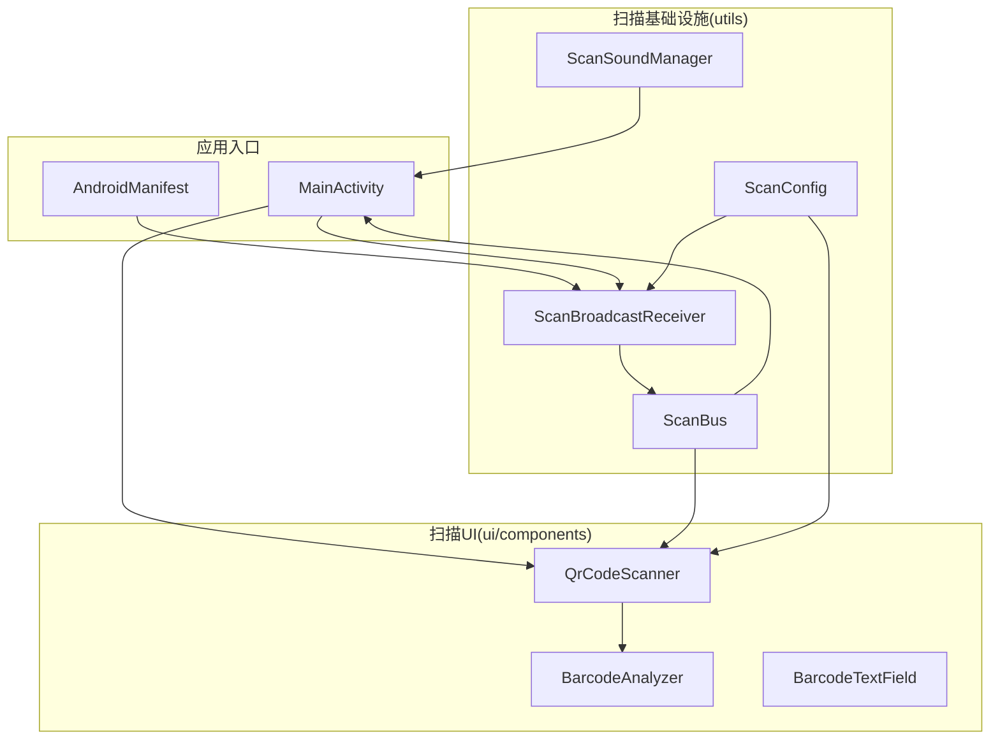
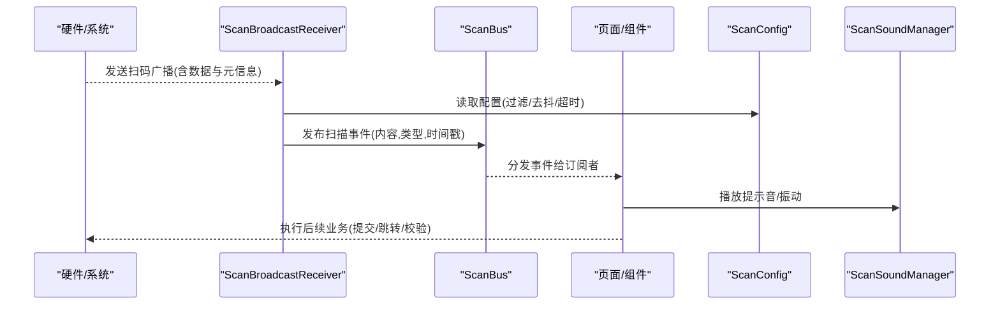
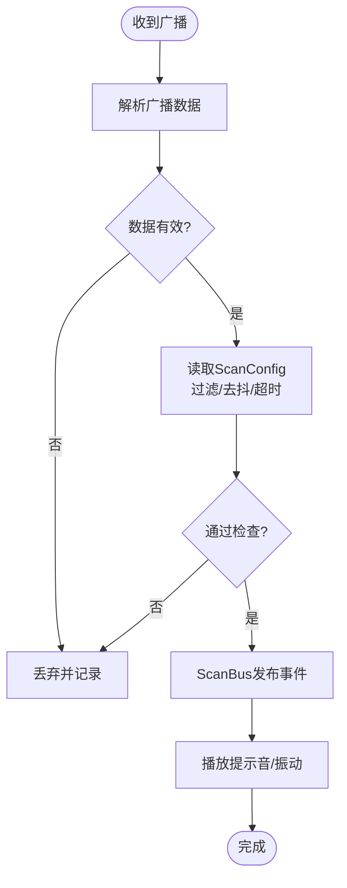
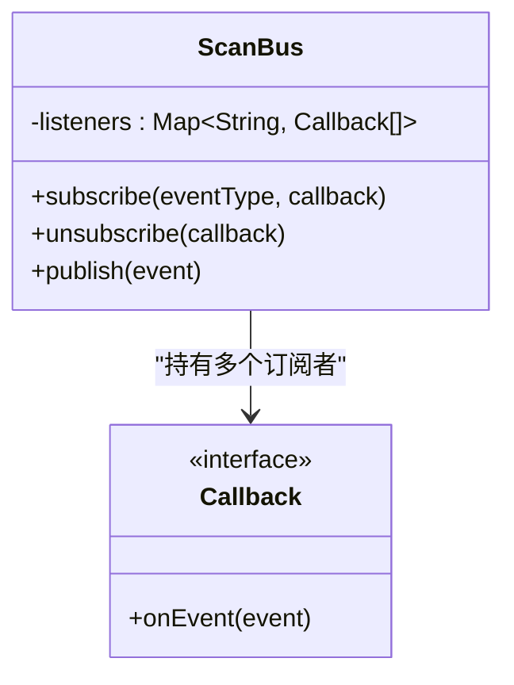
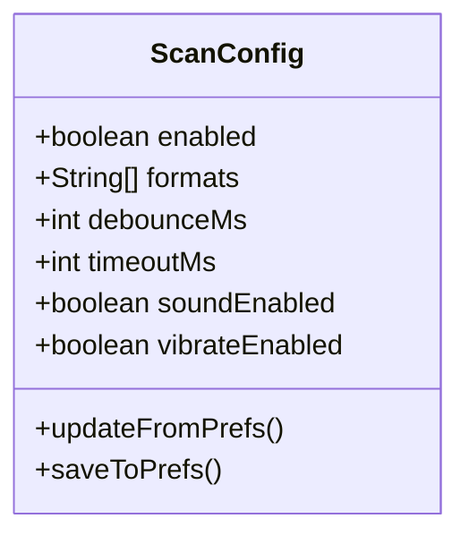
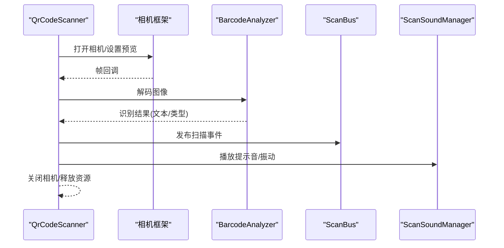
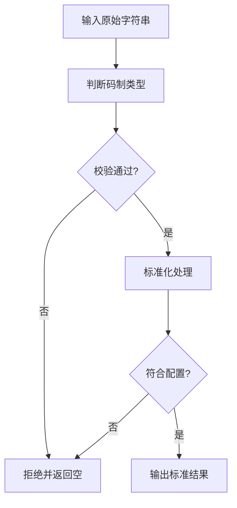
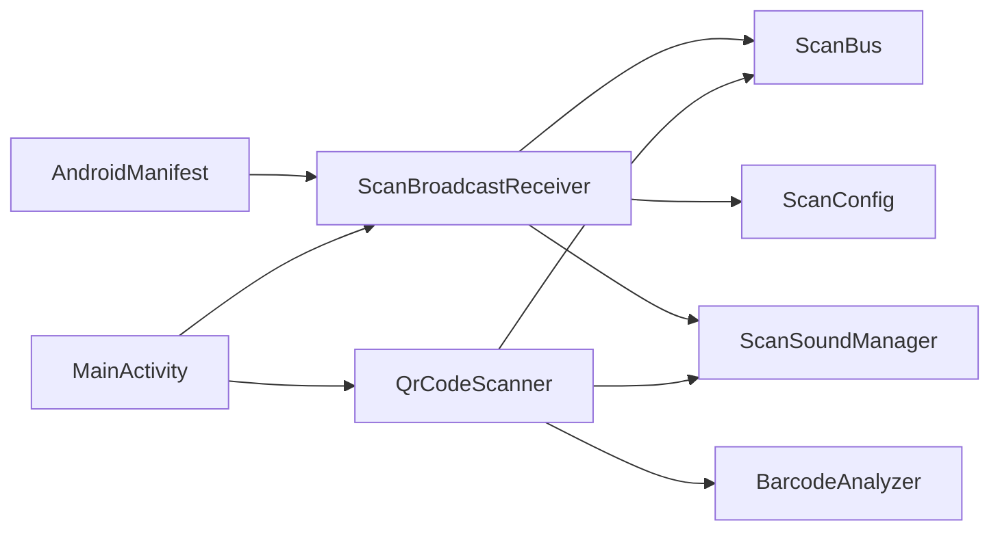

# 硬件设备集成

<cite>
**本文引用的文件**   
- [ScanBroadcastReceiver.kt](file://mobile-android/app/src/main/java/com/dip/material/utils/ScanBroadcastReceiver.kt)
- [ScanBus.kt](file://mobile-android/app/src/main/java/com/dip/material/utils/ScanBus.kt)
- [ScanConfig.kt](file://mobile-android/app/src/main/java/com/dip/material/utils/ScanConfig.kt)
- [ScanSoundManager.kt](file://mobile-android/app/src/main/java/com/dip/material/utils/ScanSoundManager.kt)
- [QrCodeScanner.kt](file://mobile-android/app/src/main/java/com/dip/material/ui/components/QrCodeScanner.kt)
- [BarcodeAnalyzer.kt](file://mobile-android/app/src/main/java/com/dip/material/ui/components/BarcodeAnalyzer.kt)
- [BarcodeTextField.kt](file://mobile-android/app/src/main/java/com/dip/material/ui/components/BarcodeTextField.kt)
- [MainActivity.kt](file://mobile-android/app/src/main/java/com/dip/material/MainActivity.kt)
- [AndroidManifest.xml](file://mobile-android/app/src/main/AndroidManifest.xml)
</cite>

## 目录
1. [简介](#简介)
2. [项目结构](#项目结构)
3. [核心组件](#核心组件)
4. [架构总览](#架构总览)
5. [详细组件分析](#详细组件分析)
6. [依赖关系分析](#依赖关系分析)
7. [性能考虑](#性能考虑)
8. [故障排查指南](#故障排查指南)
9. [结论](#结论)
10. [附录](#附录)

## 简介
本文件面向DIP系统Android应用的硬件设备集成，聚焦扫码枪广播接收器、扫描事件总线、设备配置管理、摄像头扫描与条码识别、权限与兼容性处理、扫描性能优化、音频与振动反馈以及调试与适配方法。文档以代码级为依据，提供架构图、时序图与流程图，帮助开发者快速理解并扩展硬件集成能力。

## 项目结构
Android端关键源码位于 mobile-android/app/src/main/java/com/dip/material 下，与硬件集成相关的模块分布如下：
- utils: 扫描相关工具与基础设施（广播接收器、事件总线、配置、声音）
- ui/components: 扫描UI组件（二维码扫描、条码分析、输入框）
- MainActivity: 应用入口，负责生命周期与全局状态协调
- AndroidManifest: 声明权限与广播接收器注册

图表来源
- [MainActivity.kt](file://mobile-android/app/src/main/java/com/dip/material/MainActivity.kt)
- [AndroidManifest.xml](file://mobile-android/app/src/main/AndroidManifest.xml)
- [ScanBroadcastReceiver.kt](file://mobile-android/app/src/main/java/com/dip/material/utils/ScanBroadcastReceiver.kt)
- [ScanBus.kt](file://mobile-android/app/src/main/java/com/dip/material/utils/ScanBus.kt)
- [ScanConfig.kt](file://mobile-android/app/src/main/java/com/dip/material/utils/ScanConfig.kt)
- [ScanSoundManager.kt](file://mobile-android/app/src/main/java/com/dip/material/utils/ScanSoundManager.kt)
- [QrCodeScanner.kt](file://mobile-android/app/src/main/java/com/dip/material/ui/components/QrCodeScanner.kt)
- [BarcodeAnalyzer.kt](file://mobile-android/app/src/main/java/com/dip/material/ui/components/BarcodeAnalyzer.kt)
- [BarcodeTextField.kt](file://mobile-android/app/src/main/java/com/dip/material/ui/components/BarcodeTextField.kt)

章节来源
- [MainActivity.kt](file://mobile-android/app/src/main/java/com/dip/material/MainActivity.kt)
- [AndroidManifest.xml](file://mobile-android/app/src/main/AndroidManifest.xml)

## 核心组件
- 扫码枪广播接收器(ScanBroadcastReceiver): 监听系统或厂商提供的扫码广播，解析扫描数据并转发至事件总线。
- 扫描事件总线(ScanBus): 基于内存的轻量发布/订阅通道，解耦硬件层与UI层，支持多订阅者。
- 设备配置管理(ScanConfig): 集中管理扫描行为开关、格式过滤、超时、去抖等参数。
- 音频反馈(ScanSoundManager): 播放成功/失败提示音，支持音量与静音模式兼容。
- 摄像头扫描(QrCodeScanner): 基于相机预览的实时二维码/条码识别界面。
- 条码分析(BarcodeAnalyzer): 对识别结果进行格式判断、校验与标准化。
- 条码输入框(BarcodeTextField): 支持键盘输入与扫描枪输入融合，自动触发提交。

章节来源
- [ScanBroadcastReceiver.kt](file://mobile-android/app/src/main/java/com/dip/material/utils/ScanBroadcastReceiver.kt)
- [ScanBus.kt](file://mobile-android/app/src/main/java/com/dip/material/utils/ScanBus.kt)
- [ScanConfig.kt](file://mobile-android/app/src/main/java/com/dip/material/utils/ScanConfig.kt)
- [ScanSoundManager.kt](file://mobile-android/app/src/main/java/com/dip/material/utils/ScanSoundManager.kt)
- [QrCodeScanner.kt](file://mobile-android/app/src/main/java/com/dip/material/ui/components/QrCodeScanner.kt)
- [BarcodeAnalyzer.kt](file://mobile-android/app/src/main/java/com/dip/material/ui/components/BarcodeAnalyzer.kt)
- [BarcodeTextField.kt](file://mobile-android/app/src/main/java/com/dip/material/ui/components/BarcodeTextField.kt)

## 架构总览
整体采用“硬件广播 -> 接收器 -> 事件总线 -> UI/业务”的分层架构，确保硬件差异被屏蔽，UI与业务仅依赖统一事件模型。

图表来源
- [ScanBroadcastReceiver.kt](file://mobile-android/app/src/main/java/com/dip/material/utils/ScanBroadcastReceiver.kt)
- [ScanBus.kt](file://mobile-android/app/src/main/java/com/dip/material/utils/ScanBus.kt)
- [ScanConfig.kt](file://mobile-android/app/src/main/java/com/dip/material/utils/ScanConfig.kt)
- [ScanSoundManager.kt](file://mobile-android/app/src/main/java/com/dip/material/utils/ScanSoundManager.kt)

## 详细组件分析

### 扫码枪广播接收器(ScanBroadcastReceiver)
职责
- 注册/注销系统或厂商扫码广播
- 解析广播中的扫描数据与附加字段
- 根据ScanConfig进行过滤、去抖与超时控制
- 通过ScanBus发布标准扫描事件
- 触发音频/振动反馈

关键点
- 广播动作名与数据键需与设备厂商协议对齐
- 重复扫描去抖策略：时间窗口内忽略相同内容
- 异常捕获与日志上报，避免崩溃影响主流程

图表来源
- [ScanBroadcastReceiver.kt](file://mobile-android/app/src/main/java/com/dip/material/utils/ScanBroadcastReceiver.kt)
- [ScanConfig.kt](file://mobile-android/app/src/main/java/com/dip/material/utils/ScanConfig.kt)
- [ScanBus.kt](file://mobile-android/app/src/main/java/com/dip/material/utils/ScanBus.kt)
- [ScanSoundManager.kt](file://mobile-android/app/src/main/java/com/dip/material/utils/ScanSoundManager.kt)

章节来源
- [ScanBroadcastReceiver.kt](file://mobile-android/app/src/main/java/com/dip/material/utils/ScanBroadcastReceiver.kt)
- [ScanConfig.kt](file://mobile-android/app/src/main/java/com/dip/material/utils/ScanConfig.kt)
- [ScanBus.kt](file://mobile-android/app/src/main/java/com/dip/material/utils/ScanBus.kt)
- [ScanSoundManager.kt](file://mobile-android/app/src/main/java/com/dip/material/utils/ScanSoundManager.kt)

### 扫描事件总线(ScanBus)
职责
- 提供线程安全的发布/订阅机制
- 支持按事件类型路由与优先级
- 保证在UI线程回调，避免ANR
- 提供生命周期感知订阅（可选）

设计要点
- 使用并发容器存储订阅者
- 发布时做浅拷贝，防止并发修改
- 订阅者在onDestroy中主动取消订阅

图表来源
- [ScanBus.kt](file://mobile-android/app/src/main/java/com/dip/material/utils/ScanBus.kt)

章节来源
- [ScanBus.kt](file://mobile-android/app/src/main/java/com/dip/material/utils/ScanBus.kt)

### 设备配置管理(ScanConfig)
职责
- 集中管理扫描行为参数：格式白名单、去抖时间、超时阈值、是否启用音频/振动
- 提供运行时更新与持久化能力（如SharedPreferences）
- 为广播接收器与摄像头扫描提供统一配置源

典型字段
- enabled: 是否启用扫描
- formats: 支持的码制列表
- debounceMs: 去抖时间(ms)
- timeoutMs: 单次扫描超时(ms)
- soundEnabled: 是否播放提示音
- vibrateEnabled: 是否振动

图表来源
- [ScanConfig.kt](file://mobile-android/app/src/main/java/com/dip/material/utils/ScanConfig.kt)

章节来源
- [ScanConfig.kt](file://mobile-android/app/src/main/java/com/dip/material/utils/ScanConfig.kt)

### 音频反馈(ScanSoundManager)
职责
- 播放成功/失败提示音
- 兼容静音模式与媒体音量
- 支持短促振动提示

实现要点
- 使用系统媒体播放器或AudioManager
- 资源预加载减少首帧延迟
- 错误降级：无音效时静默处理

章节来源
- [ScanSoundManager.kt](file://mobile-android/app/src/main/java/com/dip/material/utils/ScanSoundManager.kt)

### 摄像头扫描(QrCodeScanner)
职责
- 相机预览与对焦控制
- 实时解码二维码/条形码
- 叠加扫描框与引导提示
- 将识别结果经BarcodeAnalyzer处理后发布到ScanBus

交互流程
- 启动相机 -> 预览帧回调 -> 解码 -> 校验 -> 发布事件 -> 播放提示音/振动

图表来源
- [QrCodeScanner.kt](file://mobile-android/app/src/main/java/com/dip/material/ui/components/QrCodeScanner.kt)
- [BarcodeAnalyzer.kt](file://mobile-android/app/src/main/java/com/dip/material/ui/components/BarcodeAnalyzer.kt)
- [ScanBus.kt](file://mobile-android/app/src/main/java/com/dip/material/utils/ScanBus.kt)
- [ScanSoundManager.kt](file://mobile-android/app/src/main/java/com/dip/material/utils/ScanSoundManager.kt)

章节来源
- [QrCodeScanner.kt](file://mobile-android/app/src/main/java/com/dip/material/ui/components/QrCodeScanner.kt)
- [BarcodeAnalyzer.kt](file://mobile-android/app/src/main/java/com/dip/material/ui/components/BarcodeAnalyzer.kt)
- [ScanBus.kt](file://mobile-android/app/src/main/java/com/dip/material/utils/ScanBus.kt)
- [ScanSoundManager.kt](file://mobile-android/app/src/main/java/com/dip/material/utils/ScanSoundManager.kt)

### 条码分析(BarcodeAnalyzer)
职责
- 识别码制类型(二维码/一维码)
- 基础校验(长度、字符集、校验位)
- 标准化输出(去除前后空白、转大写/小写)
- 规则过滤(依据ScanConfig白名单)

图表来源
- [BarcodeAnalyzer.kt](file://mobile-android/app/src/main/java/com/dip/material/ui/components/BarcodeAnalyzer.kt)
- [ScanConfig.kt](file://mobile-android/app/src/main/java/com/dip/material/utils/ScanConfig.kt)

章节来源
- [BarcodeAnalyzer.kt](file://mobile-android/app/src/main/java/com/dip/material/ui/components/BarcodeAnalyzer.kt)
- [ScanConfig.kt](file://mobile-android/app/src/main/java/com/dip/material/utils/ScanConfig.kt)

### 条码输入框(BarcodeTextField)
职责
- 同时支持键盘输入与扫描枪输入
- 自动区分输入来源，避免重复提交
- 输入完成后自动触发业务逻辑（如搜索/提交）

章节来源
- [BarcodeTextField.kt](file://mobile-android/app/src/main/java/com/dip/material/ui/components/BarcodeTextField.kt)

### 应用入口(MainActivity)
职责
- 初始化ScanBus、ScanConfig、ScanSoundManager
- 注册/注销ScanBroadcastReceiver
- 管理页面生命周期与扫描状态
- 作为ScanBus订阅者，统一处理扫描结果并导航

章节来源
- [MainActivity.kt](file://mobile-android/app/src/main/java/com/dip/material/MainActivity.kt)
- [AndroidManifest.xml](file://mobile-android/app/src/main/AndroidManifest.xml)

## 依赖关系分析
- ScanBroadcastReceiver 依赖 ScanConfig、ScanBus、ScanSoundManager
- QrCodeScanner 依赖 BarcodeAnalyzer、ScanBus、ScanSoundManager
- MainActivity 依赖所有上述组件，承担装配与生命周期管理
- AndroidManifest 声明权限与广播接收器

图表来源
- [AndroidManifest.xml](file://mobile-android/app/src/main/AndroidManifest.xml)
- [MainActivity.kt](file://mobile-android/app/src/main/java/com/dip/material/MainActivity.kt)
- [ScanBroadcastReceiver.kt](file://mobile-android/app/src/main/java/com/dip/material/utils/ScanBroadcastReceiver.kt)
- [ScanBus.kt](file://mobile-android/app/src/main/java/com/dip/material/utils/ScanBus.kt)
- [ScanConfig.kt](file://mobile-android/app/src/main/java/com/dip/material/utils/ScanConfig.kt)
- [ScanSoundManager.kt](file://mobile-android/app/src/main/java/com/dip/material/utils/ScanSoundManager.kt)
- [QrCodeScanner.kt](file://mobile-android/app/src/main/java/com/dip/material/ui/components/QrCodeScanner.kt)
- [BarcodeAnalyzer.kt](file://mobile-android/app/src/main/java/com/dip/material/ui/components/BarcodeAnalyzer.kt)

章节来源
- [AndroidManifest.xml](file://mobile-android/app/src/main/AndroidManifest.xml)
- [MainActivity.kt](file://mobile-android/app/src/main/java/com/dip/material/MainActivity.kt)
- [ScanBroadcastReceiver.kt](file://mobile-android/app/src/main/java/com/dip/material/utils/ScanBroadcastReceiver.kt)
- [ScanBus.kt](file://mobile-android/app/src/main/java/com/dip/material/utils/ScanBus.kt)
- [ScanConfig.kt](file://mobile-android/app/src/main/java/com/dip/material/utils/ScanConfig.kt)
- [ScanSoundManager.kt](file://mobile-android/app/src/main/java/com/dip/material/utils/ScanSoundManager.kt)
- [QrCodeScanner.kt](file://mobile-android/app/src/main/java/com/dip/material/ui/components/QrCodeScanner.kt)
- [BarcodeAnalyzer.kt](file://mobile-android/app/src/main/java/com/dip/material/ui/components/BarcodeAnalyzer.kt)

## 性能考虑
- 去抖与节流：合理设置ScanConfig.debounceMs，避免高频重复扫描导致UI卡顿
- 解码优化：限制预览分辨率与帧率，按需解码；优先使用硬件加速解码库
- 线程模型：解码在后台线程执行，结果回调到主线程；避免在主线程阻塞I/O
- 资源管理：及时释放相机、音频资源；在onPause/onStop中停止预览与订阅
- 内存占用：避免在回调中创建大对象；复用Bitmap或流式处理
- 音频/振动：批量合并提示，避免频繁唤醒CPU

[本节为通用指导，不直接分析具体文件]

## 故障排查指南
常见问题与定位步骤
- 无法接收广播
  - 检查AndroidManifest中广播动作与权限声明
  - 确认ScanBroadcastReceiver已正确注册并在前台运行
  - 查看设备厂商广播动作是否与实现一致
- 扫描结果重复
  - 调整ScanConfig.debounceMs
  - 检查ScanBus订阅是否重复注册
- 摄像头无法打开
  - 检查相机权限与运行时申请流程
  - 确认设备相机API级别与预览尺寸兼容性
- 识别率低
  - 调整光照与对焦；增加扫描框引导
  - 检查BarcodeAnalyzer过滤规则是否过严
- 无声/无振动
  - 检查系统音量与静音模式
  - 确认ScanSoundManager初始化与权限

章节来源
- [AndroidManifest.xml](file://mobile-android/app/src/main/AndroidManifest.xml)
- [ScanBroadcastReceiver.kt](file://mobile-android/app/src/main/java/com/dip/material/utils/ScanBroadcastReceiver.kt)
- [ScanBus.kt](file://mobile-android/app/src/main/java/com/dip/material/utils/ScanBus.kt)
- [ScanConfig.kt](file://mobile-android/app/src/main/java/com/dip/material/utils/ScanConfig.kt)
- [ScanSoundManager.kt](file://mobile-android/app/src/main/java/com/dip/material/utils/ScanSoundManager.kt)
- [QrCodeScanner.kt](file://mobile-android/app/src/main/java/com/dip/material/ui/components/QrCodeScanner.kt)
- [BarcodeAnalyzer.kt](file://mobile-android/app/src/main/java/com/dip/material/ui/components/BarcodeAnalyzer.kt)

## 结论
本方案通过广播接收器与事件总线解耦硬件与UI，结合统一的配置管理与音频反馈，形成可扩展、易维护的硬件集成体系。在实际落地中，应重点关注设备兼容性、权限申请、解码性能与用户体验反馈。

[本节为总结性内容，不直接分析具体文件]

## 附录
- 权限清单建议
  - 相机权限：用于摄像头扫描
  - 麦克风/音频权限：如需录制或语音提示
  - 振动权限：用于触觉反馈
  - 网络权限：如需上传扫描结果
- 设备适配要点
  - 不同厂商广播动作差异：建立映射表与回退策略
  - 相机API差异：优先使用CameraX，兼容旧设备
  - 屏幕密度与预览比例：动态计算扫描框尺寸
- 调试技巧
  - 打印ScanBus事件日志，确认消息流转
  - 使用设备模拟器模拟广播，验证接收逻辑
  - 抓包与日志聚合，定位解码与网络问题

[本节为补充信息，不直接分析具体文件]