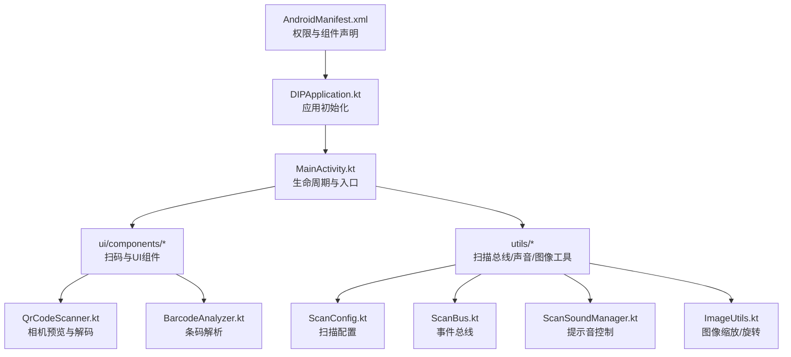
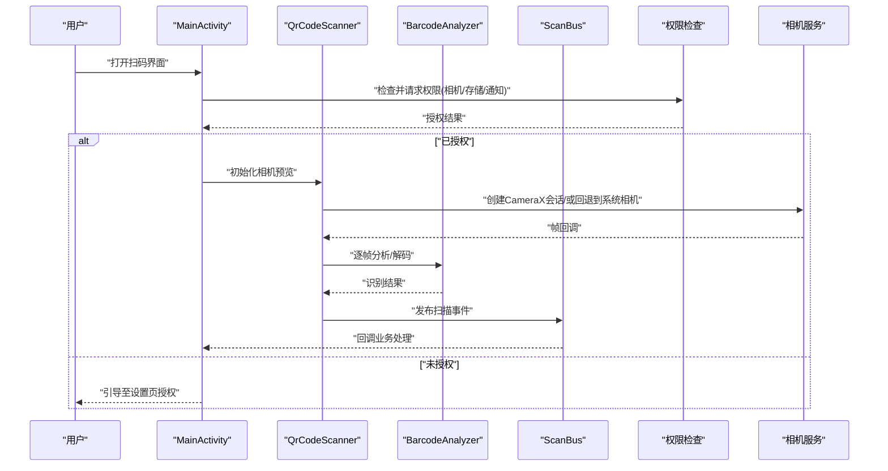
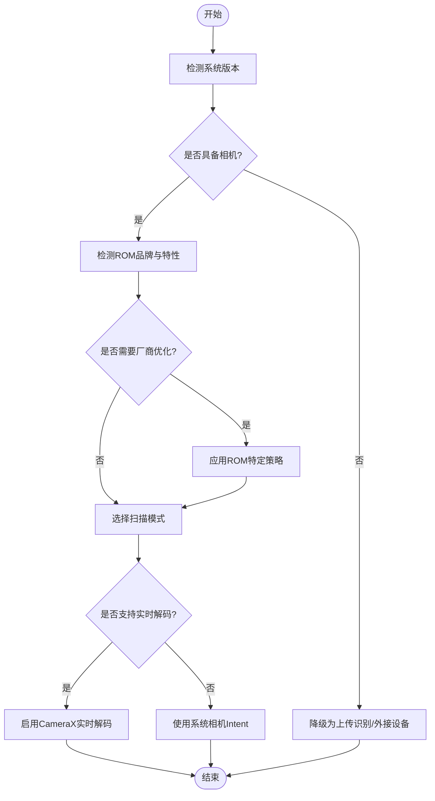
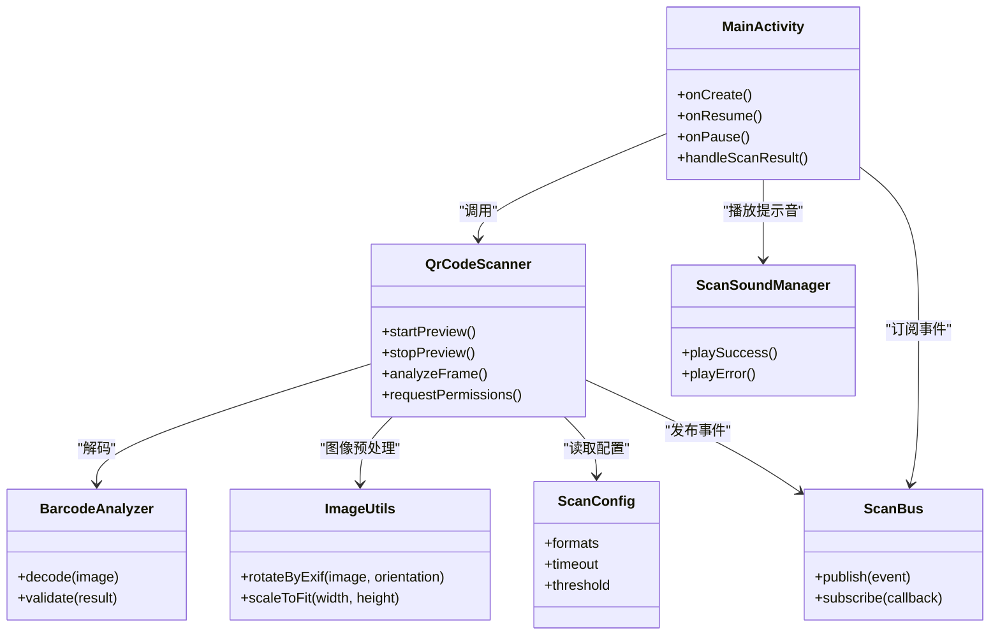

# 设备兼容性处理

<cite>
**本文档引用的文件**   
- [AndroidManifest.xml](file://mobile-android/app/src/main/AndroidManifest.xml)
- [MainActivity.kt](file://mobile-android/app/src/main/java/com/dip/material/MainActivity.kt)
- [DIPApplication.kt](file://mobile-android/app/src/main/java/com/dip/material/DIPApplication.kt)
- [QrCodeScanner.kt](file://mobile-android/app/src/main/java/com/dip/material/ui/components/QrCodeScanner.kt)
- [BarcodeAnalyzer.kt](file://mobile-android/app/src/main/java/com/dip/material/ui/components/BarcodeAnalyzer.kt)
- [ScanConfig.kt](file://mobile-android/app/src/main/java/com/dip/material/utils/ScanConfig.kt)
- [ScanBus.kt](file://mobile-android/app/src/main/java/com/dip/material/utils/ScanBus.kt)
- [ScanSoundManager.kt](file://mobile-android/app/src/main/java/com/dip/material/utils/ScanSoundManager.kt)
- [ImageUtils.kt](file://mobile-android/app/src/main/java/com/dip/material/utils/ImageUtils.kt)
- [Build.gradle.kts](file://mobile-android/app/build.gradle.kts)
- [gradle.properties](file://mobile-android/gradle.properties)
</cite>

## 目录
1. [简介](#简介)
2. [项目结构](#项目结构)
3. [核心组件](#核心组件)
4. [架构总览](#架构总览)
5. [详细组件分析](#详细组件分析)
6. [依赖关系分析](#依赖关系分析)
7. [性能考量](#性能考量)
8. [故障排查指南](#故障排查指南)
9. [结论](#结论)
10. [附录](#附录)

## 简介
本文件面向DIP系统Android应用的设备兼容性处理，聚焦以下目标：
- Android版本差异与API演进（权限模型、相机API升级、系统行为调整）
- 厂商定制ROM适配（华为、小米、OPPO等）
- 设备能力检测与自动选择最优扫描方案
- 分辨率与屏幕适配策略（横竖屏切换）
- 兼容性测试方法与设备矩阵策略
- 常见问题定位与修复建议
- 提供可落地的代码示例路径，便于快速实现设备能力检测与兼容性处理

## 项目结构
Android端采用模块化组织，关键目录与职责如下：
- app/src/main/java/com/dip/material：应用主包，包含入口Activity、业务UI、工具类与数据层
- ui/components：扫码相关UI与逻辑（二维码扫描、条码分析、扫描叠加层）
- utils：通用工具（图像、广播、声音、配置总线）
- data：网络与数据仓库（与兼容性无关，略）
- res/values、AndroidManifest.xml：资源与清单配置（权限、组件声明）

图表来源
- [AndroidManifest.xml](file://mobile-android/app/src/main/AndroidManifest.xml)
- [DIPApplication.kt](file://mobile-android/app/src/main/java/com/dip/material/DIPApplication.kt)
- [MainActivity.kt](file://mobile-android/app/src/main/java/com/dip/material/MainActivity.kt)
- [QrCodeScanner.kt](file://mobile-android/app/src/main/java/com/dip/material/ui/components/QrCodeScanner.kt)
- [BarcodeAnalyzer.kt](file://mobile-android/app/src/main/java/com/dip/material/ui/components/BarcodeAnalyzer.kt)
- [ScanConfig.kt](file://mobile-android/app/src/main/java/com/dip/material/utils/ScanConfig.kt)
- [ScanBus.kt](file://mobile-android/app/src/main/java/com/dip/material/utils/ScanBus.kt)
- [ScanSoundManager.kt](file://mobile-android/app/src/main/java/com/dip/material/utils/ScanSoundManager.kt)
- [ImageUtils.kt](file://mobile-android/app/src/main/java/com/dip/material/utils/ImageUtils.kt)

章节来源
- [AndroidManifest.xml](file://mobile-android/app/src/main/AndroidManifest.xml)
- [build.gradle.kts](file://mobile-android/app/build.gradle.kts)
- [gradle.properties](file://mobile-android/gradle.properties)

## 核心组件
- 权限与运行时请求：在清单中声明必要权限，并在运行时按版本动态申请（如相机、存储、通知）。
- 相机与扫描：基于CameraX或系统相机Intent进行预览与解码；对低版本兼容使用传统Camera API。
- 设备能力检测：通过Build、PackageManager、FeatureInfo、DisplayMetrics等判断硬件能力与系统特性。
- UI与分辨率适配：使用ConstraintLayout、百分比布局、多尺寸资源、横竖屏配置与窗口大小类。
- 厂商适配：针对华为、小米、OPPO等ROM的后台限制、省电策略、悬浮窗、通知渠道等进行差异化处理。
- 扫描结果分发：通过本地事件总线将扫描结果分发给各业务页面，解耦UI与扫描逻辑。

章节来源
- [QrCodeScanner.kt](file://mobile-android/app/src/main/java/com/dip/material/ui/components/QrCodeScanner.kt)
- [BarcodeAnalyzer.kt](file://mobile-android/app/src/main/java/com/dip/material/ui/components/BarcodeAnalyzer.kt)
- [ScanConfig.kt](file://mobile-android/app/src/main/java/com/dip/material/utils/ScanConfig.kt)
- [ScanBus.kt](file://mobile-android/app/src/main/java/com/dip/material/utils/ScanBus.kt)
- [ScanSoundManager.kt](file://mobile-android/app/src/main/java/com/dip/material/utils/ScanSoundManager.kt)
- [ImageUtils.kt](file://mobile-android/app/src/main/java/com/dip/material/utils/ImageUtils.kt)
- [AndroidManifest.xml](file://mobile-android/app/src/main/AndroidManifest.xml)

## 架构总览
下图展示从应用启动到扫码识别的关键流程，以及不同Android版本的分支处理。

图表来源
- [MainActivity.kt](file://mobile-android/app/src/main/java/com/dip/material/MainActivity.kt)
- [QrCodeScanner.kt](file://mobile-android/app/src/main/java/com/dip/material/ui/components/QrCodeScanner.kt)
- [BarcodeAnalyzer.kt](file://mobile-android/app/src/main/java/com/dip/material/ui/components/BarcodeAnalyzer.kt)
- [ScanBus.kt](file://mobile-android/app/src/main/java/com/dip/material/utils/ScanBus.kt)
- [AndroidManifest.xml](file://mobile-android/app/src/main/AndroidManifest.xml)

## 详细组件分析

### 权限与运行时模型（Android 6.0+）
- 清单权限：相机、存储、网络、通知等需在AndroidManifest.xml中声明。
- 运行时权限：
  - Android 6.0（API 23）起，危险权限需动态申请。
  - Android 10（API 29）引入分区存储，读取外部存储建议使用MediaStore或SAF。
  - Android 11（API 30）引入包可见性，需配置queries或使用隐式Intent白名单。
  - Android 13（API 33）新增媒体权限（照片/视频/音频），按需申请。
- 最佳实践：
  - 首次进入功能前再申请权限，避免打扰用户。
  - 拒绝后给出清晰说明，并提供跳转系统设置的入口。
  - 对无相机设备的设备，提前降级为“上传识别”模式。

章节来源
- [AndroidManifest.xml](file://mobile-android/app/src/main/AndroidManifest.xml)

### 相机API升级与回退策略
- 优先使用CameraX（API 21+），支持生命周期绑定、自动对焦、曝光补偿、闪光灯控制。
- 低版本回退：
  - 若设备不支持CameraX或存在兼容问题，回退到系统相机Intent进行拍照/扫码。
  - 对于仅支持旧版Camera API的设备，使用Legacy Camera（不推荐，尽量用CameraX）。
- 关键能力检测：
  - 使用PackageManager.hasSystemFeature判断相机、NFC、蓝牙等。
  - 使用DisplayMetrics与WindowMetrics获取屏幕密度与可用区域，决定预览尺寸与叠加层绘制。

章节来源
- [QrCodeScanner.kt](file://mobile-android/app/src/main/java/com/dip/material/ui/components/QrCodeScanner.kt)
- [ImageUtils.kt](file://mobile-android/app/src/main/java/com/dip/material/utils/ImageUtils.kt)

### 设备能力检测与自动选择最优方案
- 检测维度：
  - 系统版本：Build.VERSION.SDK_INT
  - 硬件能力：相机、闪光灯、NFC、陀螺仪、指纹/人脸
  - 屏幕信息：密度、宽度、高度、横竖屏、窗口大小类别
  - ROM品牌与型号：Build.MANUFACTURER、Build.MODEL
- 决策流程：
  - 若具备高质量相机与足够算力：启用实时CameraX解码。
  - 若相机较弱或功耗受限：降低帧率、缩小预览尺寸，或改为“拍照后识别”。
  - 若无相机：引导用户通过相册上传或外接扫码器。
  - 厂商特殊ROM：开启后台运行白名单、关闭省电优化、允许悬浮窗等。

图表来源
- [QrCodeScanner.kt](file://mobile-android/app/src/main/java/com/dip/material/ui/components/QrCodeScanner.kt)
- [ImageUtils.kt](file://mobile-android/app/src/main/java/com/dip/material/utils/ImageUtils.kt)

章节来源
- [QrCodeScanner.kt](file://mobile-android/app/src/main/java/com/dip/material/ui/components/QrCodeScanner.kt)
- [ImageUtils.kt](file://mobile-android/app/src/main/java/com/dip/material/utils/ImageUtils.kt)

### 分辨率与屏幕适配策略
- 布局策略：
  - 使用ConstraintLayout与Guideline，保证在不同宽高比下稳定显示。
  - 使用sp/dp单位，字体与间距随密度自适应。
  - 使用多尺寸资源（values-swXXXdp）覆盖小屏、平板、折叠屏。
- 横竖屏切换：
  - 在AndroidManifest中声明screenOrientation或允许系统自动切换。
  - 在Activity/Fragment中监听Configuration变化，必要时保存状态。
- 窗口大小类别：
  - 使用WindowMetricsClassify区分compact/medium/expanded，动态调整UI布局。

章节来源
- [ImageUtils.kt](file://mobile-android/app/src/main/java/com/dip/material/utils/ImageUtils.kt)

### 厂商定制ROM适配（华为、小米、OPPO等）
- 常见限制：
  - 后台进程被杀、通知渠道不可见、悬浮窗禁用、省电策略严格。
- 适配要点：
  - 引导用户添加白名单、关闭电池优化、允许自启动与后台活动。
  - 使用厂商API（如华为AGC、小米MIUI、OPPO ColorOS）进行能力探测与提示。
  - 对通知渠道进行分级，确保重要提示可达。

章节来源
- [AndroidManifest.xml](file://mobile-android/app/src/main/AndroidManifest.xml)

### 扫描结果分发与解耦
- 使用轻量事件总线（ScanBus）发布扫描结果，避免直接耦合Activity/Fragment。
- 支持多种消息类型：成功、失败、进度、错误码。
- 订阅方按需消费，避免重复处理与内存泄漏。

章节来源
- [ScanBus.kt](file://mobile-android/app/src/main/java/com/dip/material/utils/ScanBus.kt)

### 提示音与交互反馈
- 根据设备音量与静音模式，智能控制提示音播放。
- 支持自定义音效与震动反馈，提升用户体验。

章节来源
- [ScanSoundManager.kt](file://mobile-android/app/src/main/java/com/dip/material/utils/ScanSoundManager.kt)

### 图像预处理与旋转校正
- 根据EXIF方向与传感器朝向，自动校正图片方向。
- 针对不同分辨率进行缩放与裁剪，减少解码开销。

章节来源
- [ImageUtils.kt](file://mobile-android/app/src/main/java/com/dip/material/utils/ImageUtils.kt)

## 依赖关系分析
- 模块内依赖：
  - MainActivity依赖QrCodeScanner与ScanBus，负责生命周期管理与结果回调。
  - QrCodeScanner依赖BarcodeAnalyzer与ImageUtils，完成解码与图像预处理。
  - ScanConfig集中管理扫描参数（格式、超时、阈值等）。
- 外部依赖：
  - AndroidX CameraX、Lifecycle、Core-KTX等库。
  - 厂商SDK（可选）用于ROM特性探测。

图表来源
- [MainActivity.kt](file://mobile-android/app/src/main/java/com/dip/material/MainActivity.kt)
- [QrCodeScanner.kt](file://mobile-android/app/src/main/java/com/dip/material/ui/components/QrCodeScanner.kt)
- [BarcodeAnalyzer.kt](file://mobile-android/app/src/main/java/com/dip/material/ui/components/BarcodeAnalyzer.kt)
- [ScanBus.kt](file://mobile-android/app/src/main/java/com/dip/material/utils/ScanBus.kt)
- [ImageUtils.kt](file://mobile-android/app/src/main/java/com/dip/material/utils/ImageUtils.kt)
- [ScanConfig.kt](file://mobile-android/app/src/main/java/com/dip/material/utils/ScanConfig.kt)
- [ScanSoundManager.kt](file://mobile-android/app/src/main/java/com/dip/material/utils/ScanSoundManager.kt)

章节来源
- [MainActivity.kt](file://mobile-android/app/src/main/java/com/dip/material/MainActivity.kt)
- [QrCodeScanner.kt](file://mobile-android/app/src/main/java/com/dip/material/ui/components/QrCodeScanner.kt)
- [BarcodeAnalyzer.kt](file://mobile-android/app/src/main/java/com/dip/material/ui/components/BarcodeAnalyzer.kt)
- [ScanBus.kt](file://mobile-android/app/src/main/java/com/dip/material/utils/ScanBus.kt)
- [ImageUtils.kt](file://mobile-android/app/src/main/java/com/dip/material/utils/ImageUtils.kt)
- [ScanConfig.kt](file://mobile-android/app/src/main/java/com/dip/material/utils/ScanConfig.kt)
- [ScanSoundManager.kt](file://mobile-android/app/src/main/java/com/dip/material/utils/ScanSoundManager.kt)

## 性能考量
- 预览尺寸与帧率：
  - 根据设备性能动态调整预览分辨率与帧率，避免卡顿。
  - 使用SurfaceTexture与硬件加速渲染。
- 解码策略：
  - 对低配设备降低解码频率，采用关键帧分析。
  - 合理设置条码格式白名单，减少无效解码。
- 内存管理：
  - 及时释放Bitmap与相机资源，避免OOM。
  - 使用对象池复用频繁分配的对象。
- 功耗优化：
  - 关闭不必要的传感器与闪光灯。
  - 在后台时暂停扫描任务。

[本节为通用指导，无需引用具体文件]

## 故障排查指南
- 权限问题：
  - 现象：无法打开相机或读取媒体。
  - 排查：检查清单权限与运行时授权流程；确认用户拒绝后的引导逻辑。
- 相机崩溃：
  - 现象：预览黑屏或异常退出。
  - 排查：确认CameraX会话生命周期绑定；检查设备是否支持所选相机特性。
- 识别率低：
  - 现象：条码/二维码识别不稳定。
  - 排查：调整预览尺寸与解码阈值；增加光照与对焦提示。
- 厂商限制：
  - 现象：后台被杀、通知不可达。
  - 排查：引导用户添加白名单、关闭省电优化；检查通知渠道配置。
- 横竖屏错乱：
  - 现象：UI错位或预览拉伸。
  - 排查：检查屏幕方向配置与窗口大小类别；确保布局约束正确。

章节来源
- [AndroidManifest.xml](file://mobile-android/app/src/main/AndroidManifest.xml)
- [QrCodeScanner.kt](file://mobile-android/app/src/main/java/com/dip/material/ui/components/QrCodeScanner.kt)
- [ScanBus.kt](file://mobile-android/app/src/main/java/com/dip/material/utils/ScanBus.kt)
- [ScanSoundManager.kt](file://mobile-android/app/src/main/java/com/dip/material/utils/ScanSoundManager.kt)
- [ImageUtils.kt](file://mobile-android/app/src/main/java/com/dip/material/utils/ImageUtils.kt)

## 结论
通过系统的设备能力检测、分层API适配与厂商ROM优化，DIP系统Android应用可在多版本、多品牌设备上稳定运行。建议在开发阶段建立设备矩阵测试与自动化脚本，持续验证兼容性表现，确保生产环境体验一致。

[本节为总结性内容，无需引用具体文件]

## 附录

### 兼容性测试方法与设备矩阵策略
- 设备矩阵：
  - 覆盖主流厂商（华为、小米、OPPO、vivo、三星）、系统版本（Android 8~14）、屏幕尺寸（小屏、大屏、折叠屏）。
- 测试项：
  - 权限申请与拒绝处理
  - 相机预览与解码稳定性
  - 横竖屏切换与布局适配
  - 后台存活与通知可达
  - 低功耗模式下的行为
- 自动化：
  - 使用UI自动化框架（如Espresso/Appium）执行回归用例。
  - 采集崩溃日志与性能指标，形成报告。

[本节为通用指导，无需引用具体文件]

### 代码示例路径（设备能力检测与兼容性处理）
- 权限检查与申请：参考清单与Activity中的权限处理逻辑
  - [AndroidManifest.xml](file://mobile-android/app/src/main/AndroidManifest.xml)
  - [MainActivity.kt](file://mobile-android/app/src/main/java/com/dip/material/MainActivity.kt)
- 相机初始化与回退：参考扫码组件的相机策略
  - [QrCodeScanner.kt](file://mobile-android/app/src/main/java/com/dip/material/ui/components/QrCodeScanner.kt)
- 图像预处理与方向校正：参考图像处理工具
  - [ImageUtils.kt](file://mobile-android/app/src/main/java/com/dip/material/utils/ImageUtils.kt)
- 扫描结果分发：参考事件总线使用方式
  - [ScanBus.kt](file://mobile-android/app/src/main/java/com/dip/material/utils/ScanBus.kt)
- 提示音与交互：参考声音管理器
  - [ScanSoundManager.kt](file://mobile-android/app/src/main/java/com/dip/material/utils/ScanSoundManager.kt)
- 扫描配置：参考配置项定义
  - [ScanConfig.kt](file://mobile-android/app/src/main/java/com/dip/material/utils/ScanConfig.kt)

章节来源
- [AndroidManifest.xml](file://mobile-android/app/src/main/AndroidManifest.xml)
- [MainActivity.kt](file://mobile-android/app/src/main/java/com/dip/material/MainActivity.kt)
- [QrCodeScanner.kt](file://mobile-android/app/src/main/java/com/dip/material/ui/components/QrCodeScanner.kt)
- [ImageUtils.kt](file://mobile-android/app/src/main/java/com/dip/material/utils/ImageUtils.kt)
- [ScanBus.kt](file://mobile-android/app/src/main/java/com/dip/material/utils/ScanBus.kt)
- [ScanSoundManager.kt](file://mobile-android/app/src/main/java/com/dip/material/utils/ScanSoundManager.kt)
- [ScanConfig.kt](file://mobile-android/app/src/main/java/com/dip/material/utils/ScanConfig.kt)