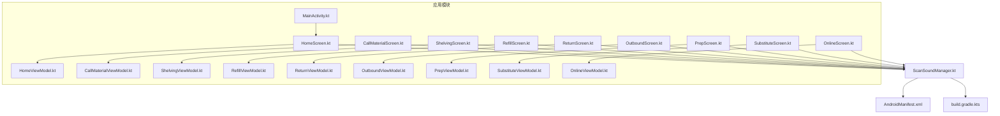
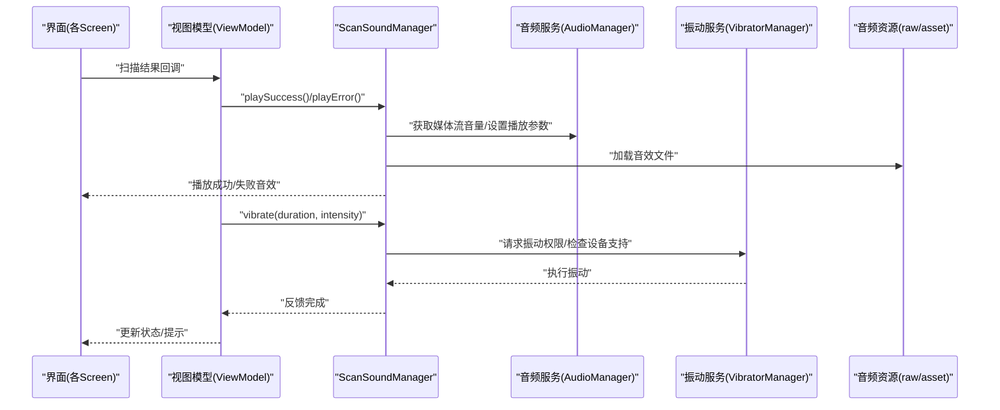
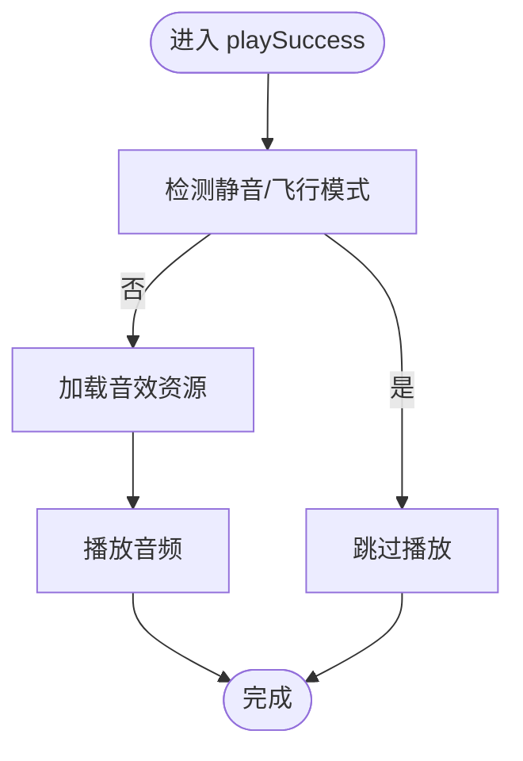
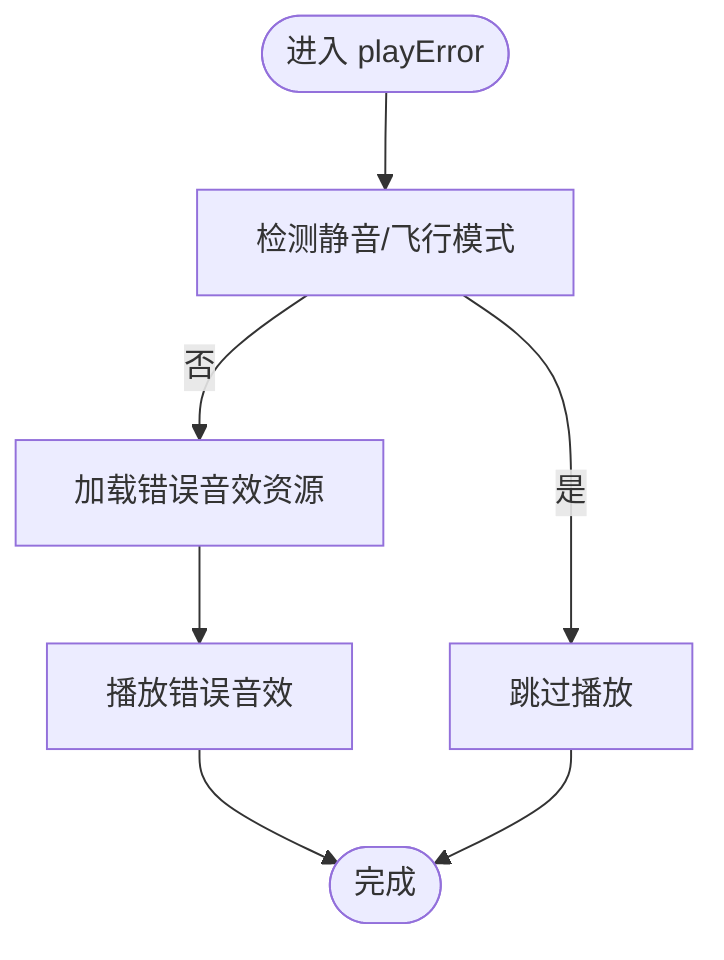
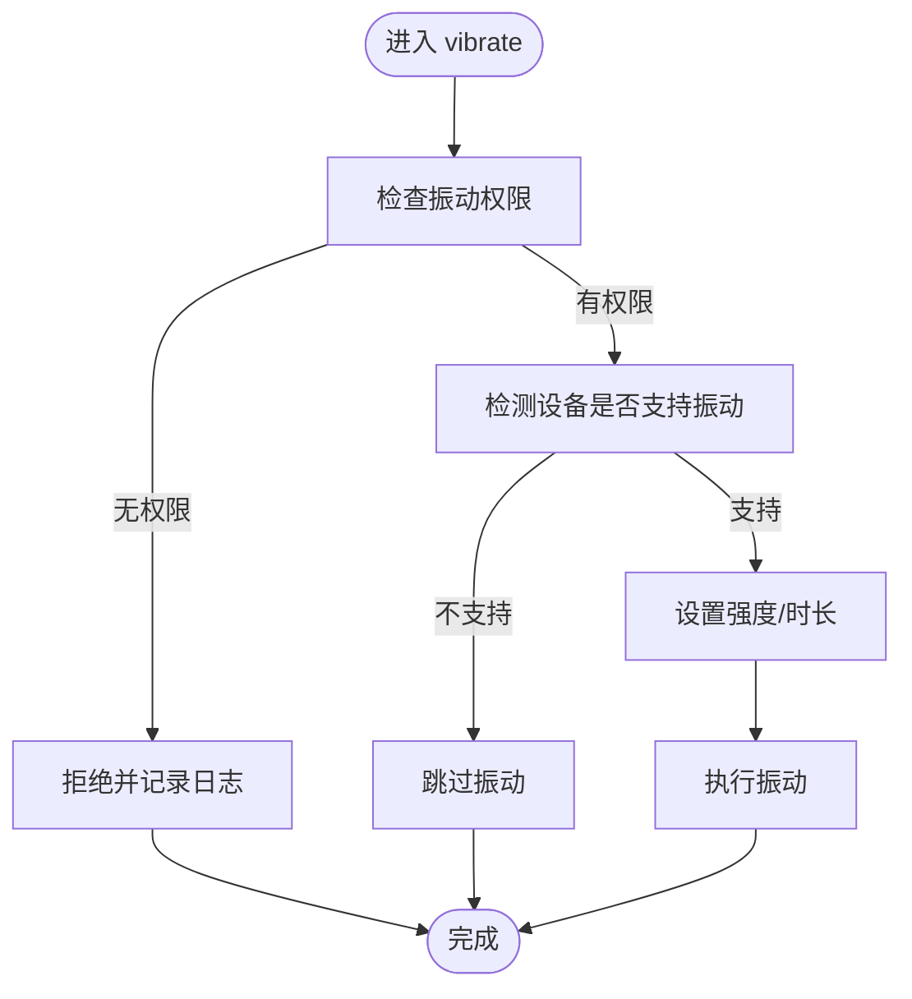
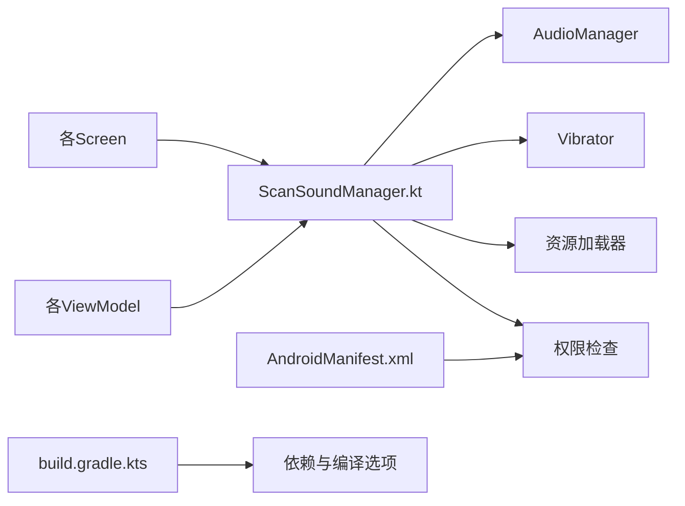

# 音频振动反馈

<cite>
**本文引用的文件**   
- [ScanSoundManager.kt](file://mobile-android/app/src/main/java/com/dip/material/utils/ScanSoundManager.kt)
- [AndroidManifest.xml](file://mobile-android/app/src/main/AndroidManifest.xml)
- [Build.gradle.kts](file://mobile-android/app/build.gradle.kts)
- [MainActivity.kt](file://mobile-android/app/src/main/java/com/dip/material/MainActivity.kt)
- [HomeScreen.kt](file://mobile-android/app/src/main/java/com/dip/material/ui/home/HomeScreen.kt)
- [HomeViewModel.kt](file://mobile-android/app/src/main/java/com/dip/material/ui/home/HomeViewModel.kt)
- [CallMaterialScreen.kt](file://mobile-android/app/src/main/java/com/dip/material/ui/callmaterial/CallMaterialScreen.kt)
- [CallMaterialViewModel.kt](file://mobile-android/app/src/main/java/com/dip/material/ui/callmaterial/CallMaterialViewModel.kt)
- [ShelvingScreen.kt](file://mobile-android/app/src/main/java/com/dip/material/ui/shelving/ShelvingScreen.kt)
- [ShelvingViewModel.kt](file://mobile-android/app/src/main/java/com/dip/material/ui/shelving/ShelvingViewModel.kt)
- [RefillScreen.kt](file://mobile-android/app/src/main/java/com/dip/material/ui/refill/RefillScreen.kt)
- [RefillViewModel.kt](file://mobile-android/app/src/main/java/com/dip/material/ui/refill/RefillViewModel.kt)
- [ReturnScreen.kt](file://mobile-android/app/src/main/java/com/dip/material/ui/return_/ReturnScreen.kt)
- [ReturnViewModel.kt](file://mobile-android/app/src/main/java/com/dip/material/ui/return_/ReturnViewModel.kt)
- [OutboundScreen.kt](file://mobile-android/app/src/main/java/com/dip/material/ui/outbound/OutboundScreen.kt)
- [OutboundViewModel.kt](file://mobile-android/app/src/main/java/com/dip/material/ui/outbound/OutboundViewModel.kt)
- [PrepScreen.kt](file://mobile-android/app/src/main/java/com/dip/material/ui/prep/PrepScreen.kt)
- [PrepViewModel.kt](file://mobile-android/app/src/main/java/com/dip/material/ui/prep/PrepViewModel.kt)
- [SubstituteScreen.kt](file://mobile-android/app/src/main/java/com/dip/material/ui/substitute/SubstituteScreen.kt)
- [SubstituteViewModel.kt](file://mobile-android/app/src/main/java/com/dip/material/ui/substitute/SubstituteViewModel.kt)
- [OnlineScreen.kt](file://mobile-android/app/src/main/java/com/dip/material/ui/online/OnlineScreen.kt)
- [OnlineViewModel.kt](file://mobile-android/app/src/main/java/com/dip/material/ui/online/OnlineViewModel.kt)
</cite>

## 目录
1. [简介](#简介)
2. [项目结构](#项目结构)
3. [核心组件](#核心组件)
4. [架构总览](#架构总览)
5. [详细组件分析](#详细组件分析)
6. [依赖分析](#依赖分析)
7. [性能考虑](#性能考虑)
8. [故障排查指南](#故障排查指南)
9. [结论](#结论)
10. [附录](#附录)

## 简介
本文件面向DIP系统Android应用的“扫描结果”音频与振动反馈能力，聚焦以下目标：
- 详解 ScanSoundManager 音频管理器的实现要点：扫描成功音效播放、错误提示音处理、音量控制。
- 文档化振动反馈机制：扫描完成时的触觉反馈、不同设备的振动强度调节策略。
- 说明音频资源管理：音效文件的加载与优化、内存使用控制。
- 说明振动权限处理、Android版本兼容性、振动API的使用差异。
- 提供用户体验优化建议：反馈时机、频率控制、静音模式处理。
- 给出完整代码示例路径，展示如何在扫描成功后触发音频和振动反馈，并妥善处理异常情况。

## 项目结构
与音频振动反馈相关的核心位置如下：
- 工具层：utils/ScanSoundManager.kt（音频与振动统一入口）
- UI层：各业务屏幕（如 HomeScreen、CallMaterialScreen、ShelvingScreen 等）在扫描回调中调用反馈
- 视图模型：对应 ViewModel 负责状态管理与事件派发
- 清单与构建：AndroidManifest.xml 声明权限；build.gradle.kts 管理依赖与编译选项

图表来源
- [MainActivity.kt](file://mobile-android/app/src/main/java/com/dip/material/MainActivity.kt)
- [HomeScreen.kt](file://mobile-android/app/src/main/java/com/dip/material/ui/home/HomeScreen.kt)
- [HomeViewModel.kt](file://mobile-android/app/src/main/java/com/dip/material/ui/home/HomeViewModel.kt)
- [CallMaterialScreen.kt](file://mobile-android/app/src/main/java/com/dip/material/ui/callmaterial/CallMaterialScreen.kt)
- [CallMaterialViewModel.kt](file://mobile-android/app/src/main/java/com/dip/material/ui/callmaterial/CallMaterialViewModel.kt)
- [ShelvingScreen.kt](file://mobile-android/app/src/main/java/com/dip/material/ui/shelving/ShelvingScreen.kt)
- [ShelvingViewModel.kt](file://mobile-android/app/src/main/java/com/dip/material/ui/shelving/ShelvingViewModel.kt)
- [RefillScreen.kt](file://mobile-android/app/src/main/java/com/dip/material/ui/refill/RefillScreen.kt)
- [RefillViewModel.kt](file://mobile-android/app/src/main/java/com/dip/material/ui/refill/RefillViewModel.kt)
- [ReturnScreen.kt](file://mobile-android/app/src/main/java/com/dip/material/ui/return_/ReturnScreen.kt)
- [ReturnViewModel.kt](file://mobile-android/app/src/main/java/com/dip/material/ui/return_/ReturnViewModel.kt)
- [OutboundScreen.kt](file://mobile-android/app/src/main/java/com/dip/material/ui/outbound/OutboundScreen.kt)
- [OutboundViewModel.kt](file://mobile-android/app/src/main/java/com/dip/material/ui/outbound/OutboundViewModel.kt)
- [PrepScreen.kt](file://mobile-android/app/src/main/java/com/dip/material/ui/prep/PrepScreen.kt)
- [PrepViewModel.kt](file://mobile-android/app/src/main/java/com/dip/material/ui/prep/PrepViewModel.kt)
- [SubstituteScreen.kt](file://mobile-android/app/src/main/java/com/dip/material/ui/substitute/SubstituteScreen.kt)
- [SubstituteViewModel.kt](file://mobile-android/app/src/main/java/com/dip/material/ui/substitute/SubstituteViewModel.kt)
- [OnlineScreen.kt](file://mobile-android/app/src/main/java/com/dip/material/ui/online/OnlineScreen.kt)
- [OnlineViewModel.kt](file://mobile-android/app/src/main/java/com/dip/material/ui/online/OnlineViewModel.kt)
- [AndroidManifest.xml](file://mobile-android/app/src/main/AndroidManifest.xml)
- [Build.gradle.kts](file://mobile-android/app/build.gradle.kts)

章节来源
- [ScanSoundManager.kt](file://mobile-android/app/src/main/java/com/dip/material/utils/ScanSoundManager.kt)
- [AndroidManifest.xml](file://mobile-android/app/src/main/AndroidManifest.xml)
- [Build.gradle.kts](file://mobile-android/app/build.gradle.kts)

## 核心组件
- ScanSoundManager：封装音频播放与振动反馈的统一接口，屏蔽底层差异，提供成功/失败提示音、音量控制、振动强度与时长设置、生命周期管理。
- UI 屏幕与 ViewModel：在扫描成功或失败时，通过 ScanSoundManager 触发音频与振动反馈。
- 清单与构建配置：声明必要的权限与依赖，确保运行时可用。

章节来源
- [ScanSoundManager.kt](file://mobile-android/app/src/main/java/com/dip/material/utils/ScanSoundManager.kt)
- [HomeScreen.kt](file://mobile-android/app/src/main/java/com/dip/material/ui/home/HomeScreen.kt)
- [HomeViewModel.kt](file://mobile-android/app/src/main/java/com/dip/material/ui/home/HomeViewModel.kt)
- [CallMaterialScreen.kt](file://mobile-android/app/src/main/java/com/dip/material/ui/callmaterial/CallMaterialScreen.kt)
- [CallMaterialViewModel.kt](file://mobile-android/app/src/main/java/com/dip/material/ui/callmaterial/CallMaterialViewModel.kt)
- [ShelvingScreen.kt](file://mobile-android/app/src/main/java/com/dip/material/ui/shelving/ShelvingScreen.kt)
- [ShelvingViewModel.kt](file://mobile-android/app/src/main/java/com/dip/material/ui/shelving/ShelvingViewModel.kt)
- [RefillScreen.kt](file://mobile-android/app/src/main/java/com/dip/material/ui/refill/RefillScreen.kt)
- [RefillViewModel.kt](file://mobile-android/app/src/main/java/com/dip/material/ui/refill/RefillViewModel.kt)
- [ReturnScreen.kt](file://mobile-android/app/src/main/java/com/dip/material/ui/return_/ReturnScreen.kt)
- [ReturnViewModel.kt](file://mobile-android/app/src/main/java/com/dip/material/ui/return_/ReturnViewModel.kt)
- [OutboundScreen.kt](file://mobile-android/app/src/main/java/com/dip/material/ui/outbound/OutboundScreen.kt)
- [OutboundViewModel.kt](file://mobile-android/app/src/main/java/com/dip/material/ui/outbound/OutboundViewModel.kt)
- [PrepScreen.kt](file://mobile-android/app/src/main/java/com/dip/material/ui/prep/PrepScreen.kt)
- [PrepViewModel.kt](file://mobile-android/app/src/main/java/com/dip/material/ui/prep/PrepViewModel.kt)
- [SubstituteScreen.kt](file://mobile-android/app/src/main/java/com/dip/material/ui/substitute/SubstituteScreen.kt)
- [SubstituteViewModel.kt](file://mobile-android/app/src/main/java/com/dip/material/ui/substitute/SubstituteViewModel.kt)
- [OnlineScreen.kt](file://mobile-android/app/src/main/java/com/dip/material/ui/online/OnlineScreen.kt)
- [OnlineViewModel.kt](file://mobile-android/app/src/main/java/com/dip/material/ui/online/OnlineViewModel.kt)

## 架构总览
下图展示了从UI到音频/振动的调用链，以及权限与资源管理的边界。

图表来源
- [ScanSoundManager.kt](file://mobile-android/app/src/main/java/com/dip/material/utils/ScanSoundManager.kt)
- [HomeScreen.kt](file://mobile-android/app/src/main/java/com/dip/material/ui/home/HomeScreen.kt)
- [HomeViewModel.kt](file://mobile-android/app/src/main/java/com/dip/material/ui/home/HomeViewModel.kt)
- [CallMaterialScreen.kt](file://mobile-android/app/src/main/java/com/dip/material/ui/callmaterial/CallMaterialScreen.kt)
- [CallMaterialViewModel.kt](file://mobile-android/app/src/main/java/com/dip/material/ui/callmaterial/CallMaterialViewModel.kt)
- [ShelvingScreen.kt](file://mobile-android/app/src/main/java/com/dip/material/ui/shelving/ShelvingScreen.kt)
- [ShelvingViewModel.kt](file://mobile-android/app/src/main/java/com/dip/material/ui/shelving/ShelvingViewModel.kt)
- [RefillScreen.kt](file://mobile-android/app/src/main/java/com/dip/material/ui/refill/RefillScreen.kt)
- [RefillViewModel.kt](file://mobile-android/app/src/main/java/com/dip/material/ui/refill/RefillViewModel.kt)
- [ReturnScreen.kt](file://mobile-android/app/src/main/java/com/dip/material/ui/return_/ReturnScreen.kt)
- [ReturnViewModel.kt](file://mobile-android/app/src/main/java/com/dip/material/ui/return_/ReturnViewModel.kt)
- [OutboundScreen.kt](file://mobile-android/app/src/main/java/com/dip/material/ui/outbound/OutboundScreen.kt)
- [OutboundViewModel.kt](file://mobile-android/app/src/main/java/com/dip/material/ui/outbound/OutboundViewModel.kt)
- [PrepScreen.kt](file://mobile-android/app/src/main/java/com/dip/material/ui/prep/PrepScreen.kt)
- [PrepViewModel.kt](file://mobile-android/app/src/main/java/com/dip/material/ui/prep/PrepViewModel.kt)
- [SubstituteScreen.kt](file://mobile-android/app/src/main/java/com/dip/material/ui/substitute/SubstituteScreen.kt)
- [SubstituteViewModel.kt](file://mobile-android/app/src/main/java/com/dip/material/ui/substitute/SubstituteViewModel.kt)
- [OnlineScreen.kt](file://mobile-android/app/src/main/java/com/dip/material/ui/online/OnlineScreen.kt)
- [OnlineViewModel.kt](file://mobile-android/app/src/main/java/com/dip/material/ui/online/OnlineViewModel.kt)

## 详细组件分析

### ScanSoundManager 音频管理器
职责与能力
- 成功/失败音效播放：提供统一的播放接口，内部根据场景选择不同音效资源。
- 音量控制：读取系统媒体音量，按策略限制最大播放音量，避免过响。
- 振动反馈：封装振动API，处理权限、设备能力检测、强度与时长设置。
- 生命周期管理：在Activity/Fragment创建时初始化，销毁时释放资源，防止泄漏。
- 异常处理：捕获播放/振动异常，降级为静默或仅视觉提示。

关键流程（播放成功音效）

关键流程（播放错误提示音）

关键流程（振动反馈）

章节来源
- [ScanSoundManager.kt](file://mobile-android/app/src/main/java/com/dip/material/utils/ScanSoundManager.kt)

### 音频资源管理
- 资源位置：raw/ 或 assets/ 下放置短音效（成功/失败），建议使用压缩格式以减小体积。
- 加载策略：按需加载，避免常驻内存；播放完成后及时释放引用。
- 缓存策略：对频繁播放的短音效可建立轻量级缓存，但需限制数量与生命周期。
- 内存控制：避免重复实例化播放器；使用单例或依赖注入统一管理。

章节来源
- [ScanSoundManager.kt](file://mobile-android/app/src/main/java/com/dip/material/utils/ScanSoundManager.kt)

### 振动权限与兼容性
- 权限要求：Android 13+ 需要 VIBRATE 权限；部分厂商可能额外要求通知或无障碍相关权限。
- API差异：低版本使用旧版振动API，高版本引入新API与强度控制；需在运行时判断并适配。
- 设备能力：某些设备可能不支持振动或受限，需做能力检测与降级。

章节来源
- [AndroidManifest.xml](file://mobile-android/app/src/main/AndroidManifest.xml)
- [ScanSoundManager.kt](file://mobile-android/app/src/main/java/com/dip/material/utils/ScanSoundManager.kt)

### UI集成与调用示例
- 在扫描成功回调中，调用 ScanSoundManager.playSuccess() 与 vibrate()。
- 在扫描失败回调中，调用 ScanSoundManager.playError() 与可选的短促振动。
- 在静音/飞行模式下，自动跳过音频与振动，仅保留视觉提示。

章节来源
- [HomeScreen.kt](file://mobile-android/app/src/main/java/com/dip/material/ui/home/HomeScreen.kt)
- [HomeViewModel.kt](file://mobile-android/app/src/main/java/com/dip/material/ui/home/HomeViewModel.kt)
- [CallMaterialScreen.kt](file://mobile-android/app/src/main/java/com/dip/material/ui/callmaterial/CallMaterialScreen.kt)
- [CallMaterialViewModel.kt](file://mobile-android/app/src/main/java/com/dip/material/ui/callmaterial/CallMaterialViewModel.kt)
- [ShelvingScreen.kt](file://mobile-android/app/src/main/java/com/dip/material/ui/shelving/ShelvingScreen.kt)
- [ShelvingViewModel.kt](file://mobile-android/app/src/main/java/com/dip/material/ui/shelving/ShelvingViewModel.kt)
- [RefillScreen.kt](file://mobile-android/app/src/main/java/com/dip/material/ui/refill/RefillScreen.kt)
- [RefillViewModel.kt](file://mobile-android/app/src/main/java/com/dip/material/ui/refill/RefillViewModel.kt)
- [ReturnScreen.kt](file://mobile-android/app/src/main/java/com/dip/material/ui/return_/ReturnScreen.kt)
- [ReturnViewModel.kt](file://mobile-android/app/src/main/java/com/dip/material/ui/return_/ReturnViewModel.kt)
- [OutboundScreen.kt](file://mobile-android/app/src/main/java/com/dip/material/ui/outbound/OutboundScreen.kt)
- [OutboundViewModel.kt](file://mobile-android/app/src/main/java/com/dip/material/ui/outbound/OutboundViewModel.kt)
- [PrepScreen.kt](file://mobile-android/app/src/main/java/com/dip/material/ui/prep/PrepScreen.kt)
- [PrepViewModel.kt](file://mobile-android/app/src/main/java/com/dip/material/ui/prep/PrepViewModel.kt)
- [SubstituteScreen.kt](file://mobile-android/app/src/main/java/com/dip/material/ui/substitute/SubstituteScreen.kt)
- [SubstituteViewModel.kt](file://mobile-android/app/src/main/java/com/dip/material/ui/substitute/SubstituteViewModel.kt)
- [OnlineScreen.kt](file://mobile-android/app/src/main/java/com/dip/material/ui/online/OnlineScreen.kt)
- [OnlineViewModel.kt](file://mobile-android/app/src/main/java/com/dip/material/ui/online/OnlineViewModel.kt)

## 依赖分析
- 运行时依赖：AudioManager、Vibrator、权限检查、资源加载器。
- 构建依赖：在 build.gradle.kts 中确保包含必要的库与编译选项。
- 清单依赖：在 AndroidManifest.xml 中声明必要权限。

图表来源
- [ScanSoundManager.kt](file://mobile-android/app/src/main/java/com/dip/material/utils/ScanSoundManager.kt)
- [AndroidManifest.xml](file://mobile-android/app/src/main/AndroidManifest.xml)
- [Build.gradle.kts](file://mobile-android/app/build.gradle.kts)

章节来源
- [ScanSoundManager.kt](file://mobile-android/app/src/main/java/com/dip/material/utils/ScanSoundManager.kt)
- [AndroidManifest.xml](file://mobile-android/app/src/main/AndroidManifest.xml)
- [Build.gradle.kts](file://mobile-android/app/build.gradle.kts)

## 性能考虑
- 音频播放：避免在主线程阻塞I/O；使用异步加载与播放；合理复用播放器实例。
- 资源管理：限制同时存在的音频对象数量；及时释放不再使用的资源。
- 振动控制：避免高频连续振动导致发热与耗电；合并多次短振动为一次长振动。
- 内存占用：使用弱引用或单例管理共享资源；避免在循环中创建临时对象。

[本节为通用指导，不直接分析具体文件]

## 故障排查指南
常见问题与定位方法
- 无声或声音过小：检查系统媒体音量、静音模式、音频焦点冲突；确认资源路径正确。
- 振动无效：检查振动权限、设备是否支持振动、强度参数是否合法。
- 崩溃或卡顿：检查是否在非主线程操作UI或资源；确认播放器生命周期是否正确。
- 兼容性问题：针对不同Android版本进行API分支处理；记录设备型号与系统版本以便复现。

章节来源
- [ScanSoundManager.kt](file://mobile-android/app/src/main/java/com/dip/material/utils/ScanSoundManager.kt)
- [AndroidManifest.xml](file://mobile-android/app/src/main/AndroidManifest.xml)

## 结论
通过 ScanSoundManager 统一封装音频与振动反馈，可在多业务场景中保持一致的用户体验。结合权限与兼容性处理、资源与内存优化、以及静音模式下的降级策略，能够显著提升扫描流程的可靠性与易用性。建议在UI层集中调用该管理器，并在ViewModel中编排反馈时机与频率，确保交互自然流畅。

[本节为总结性内容，不直接分析具体文件]

## 附录
- 最佳实践清单
  - 在扫描成功与失败时分别触发不同的音效与振动模式。
  - 始终检测静音/飞行模式，必要时仅保留视觉提示。
  - 对振动强度与时长进行设备能力检测与参数校验。
  - 使用单例或依赖注入管理音频与振动资源，避免重复创建。
  - 记录关键日志与异常信息，便于问题追踪与优化。
- 参考示例路径（用于对照实现）
  - 成功反馈调用：[HomeScreen.kt](file://mobile-android/app/src/main/java/com/dip/material/ui/home/HomeScreen.kt)、[HomeViewModel.kt](file://mobile-android/app/src/main/java/com/dip/material/ui/home/HomeViewModel.kt)
  - 错误反馈调用：[CallMaterialScreen.kt](file://mobile-android/app/src/main/java/com/dip/material/ui/callmaterial/CallMaterialScreen.kt)、[CallMaterialViewModel.kt](file://mobile-android/app/src/main/java/com/dip/material/ui/callmaterial/CallMaterialViewModel.kt)
  - 其他业务场景：[ShelvingScreen.kt](file://mobile-android/app/src/main/java/com/dip/material/ui/shelving/ShelvingScreen.kt)、[RefillScreen.kt](file://mobile-android/app/src/main/java/com/dip/material/ui/refill/RefillScreen.kt)、[ReturnScreen.kt](file://mobile-android/app/src/main/java/com/dip/material/ui/return_/ReturnScreen.kt)、[OutboundScreen.kt](file://mobile-android/app/src/main/java/com/dip/material/ui/outbound/OutboundScreen.kt)、[PrepScreen.kt](file://mobile-android/app/src/main/java/com/dip/material/ui/prep/PrepScreen.kt)、[SubstituteScreen.kt](file://mobile-android/app/src/main/java/com/dip/material/ui/substitute/SubstituteScreen.kt)、[OnlineScreen.kt](file://mobile-android/app/src/main/java/com/dip/material/ui/online/OnlineScreen.kt)

[本节为补充信息，不直接分析具体文件]