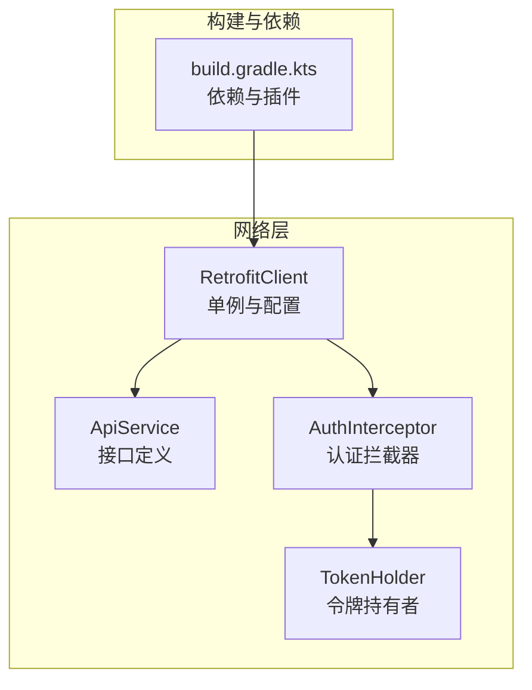
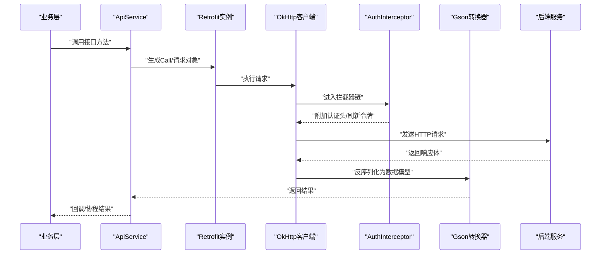
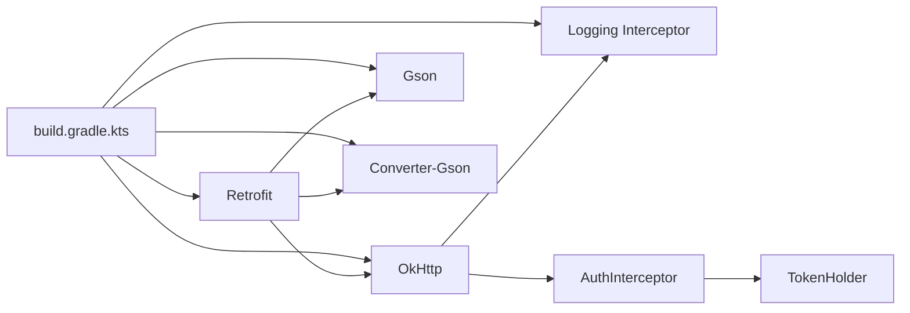
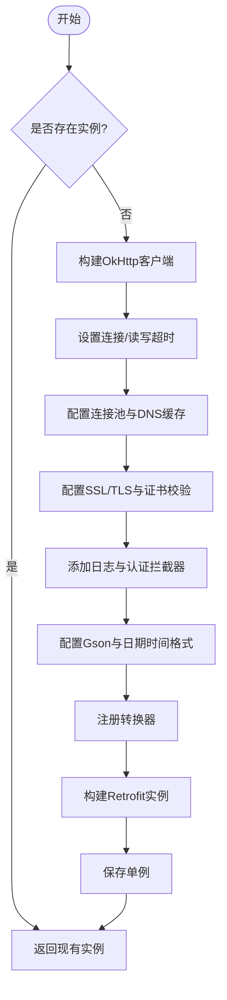

# Retrofit客户端配置

<cite>
**本文引用的文件**   
- [RetrofitClient.kt](file://mobile-android/app/src/main/java/com/dip/material/data/network/RetrofitClient.kt)
- [ApiService.kt](file://mobile-android/app/src/main/java/com/dip/material/data/network/ApiService.kt)
- [AuthInterceptor.kt](file://mobile-android/app/src/main/java/com/dip/material/data/network/AuthInterceptor.kt)
- [TokenHolder.kt](file://mobile-android/app/src/main/java/com/dip/material/data/network/TokenHolder.kt)
- [build.gradle.kts](file://mobile-android/app/build.gradle.kts)
</cite>

## 目录
1. [简介](#简介)
2. [项目结构](#项目结构)
3. [核心组件](#核心组件)
4. [架构总览](#架构总览)
5. [详细组件分析](#详细组件分析)
6. [依赖关系分析](#依赖关系分析)
7. [性能考虑](#性能考虑)
8. [故障排查指南](#故障排查指南)
9. [结论](#结论)
10. [附录](#附录)

## 简介
本文件面向DIP系统Android应用中的Retrofit网络层，系统化说明Retrofit实例的初始化流程、Base URL配置、HTTP客户端设置、Gson序列化器与日期时间处理、自定义转换器注册、请求超时与重试策略、SSL证书校验、连接池优化、日志拦截器与性能监控集成。文档同时提供最佳实践建议与常见问题排查指引，帮助开发者快速定位并优化网络层行为。

## 项目结构
Android端网络相关代码集中在 data/network 包下，主要包含：
- Retrofit实例与基础配置（单例）
- API接口定义
- 认证拦截器与令牌持有者
- 构建脚本中Retrofit及相关依赖声明

图表来源
- [RetrofitClient.kt](file://mobile-android/app/src/main/java/com/dip/material/data/network/RetrofitClient.kt)
- [ApiService.kt](file://mobile-android/app/src/main/java/com/dip/material/data/network/ApiService.kt)
- [AuthInterceptor.kt](file://mobile-android/app/src/main/java/com/dip/material/data/network/AuthInterceptor.kt)
- [TokenHolder.kt](file://mobile-android/app/src/main/java/com/dip/material/data/network/TokenHolder.kt)
- [build.gradle.kts](file://mobile-android/app/build.gradle.kts)

章节来源
- [RetrofitClient.kt](file://mobile-android/app/src/main/java/com/dip/material/data/network/RetrofitClient.kt)
- [ApiService.kt](file://mobile-android/app/src/main/java/com/dip/material/data/network/ApiService.kt)
- [AuthInterceptor.kt](file://mobile-android/app/src/main/java/com/dip/material/data/network/AuthInterceptor.kt)
- [TokenHolder.kt](file://mobile-android/app/src/main/java/com/dip/material/data/network/TokenHolder.kt)
- [build.gradle.kts](file://mobile-android/app/build.gradle.kts)

## 核心组件
- Retrofit实例与配置：集中管理Base URL、OkHttp客户端、序列化器与转换器、日志与重试等。
- ApiService：以Kotlin接口形式声明API方法，配合注解描述路径、参数、请求体与响应类型。
- AuthInterceptor：统一为请求附加鉴权头或刷新令牌逻辑。
- TokenHolder：集中管理访问令牌的生命周期与获取方式。
- 构建脚本：声明Retrofit、OkHttp、Gson、Converter、Logging等依赖版本与特性开关。

章节来源
- [RetrofitClient.kt](file://mobile-android/app/src/main/java/com/dip/material/data/network/RetrofitClient.kt)
- [ApiService.kt](file://mobile-android/app/src/main/java/com/dip/material/data/network/ApiService.kt)
- [AuthInterceptor.kt](file://mobile-android/app/src/main/java/com/dip/material/data/network/AuthInterceptor.kt)
- [TokenHolder.kt](file://mobile-android/app/src/main/java/com/dip/material/data/network/TokenHolder.kt)
- [build.gradle.kts](file://mobile-android/app/build.gradle.kts)

## 架构总览
下图展示了从业务调用到网络请求的关键链路：业务通过ApiService发起请求，Retrofit将请求委托给OkHttp，拦截器链在发送前注入认证信息，响应经Gson解析后返回。

图表来源
- [ApiService.kt](file://mobile-android/app/src/main/java/com/dip/material/data/network/ApiService.kt)
- [RetrofitClient.kt](file://mobile-android/app/src/main/java/com/dip/material/data/network/RetrofitClient.kt)
- [AuthInterceptor.kt](file://mobile-android/app/src/main/java/com/dip/material/data/network/AuthInterceptor.kt)
- [TokenHolder.kt](file://mobile-android/app/src/main/java/com/dip/material/data/network/TokenHolder.kt)

## 详细组件分析

### Retrofit实例与基础配置
- 单例模式：确保全局唯一Retrofit实例，避免重复创建带来的资源浪费。
- Base URL：集中配置服务端根地址，便于环境切换（开发/测试/生产）。
- OkHttp客户端：统一设置连接/读写超时、重试策略、连接池、TLS/SSL、代理与DNS等。
- 序列化与转换器：配置Gson及其格式化选项，注册必要的转换器（如JSON、字符串、原始字节等）。
- 日志与监控：可选启用HttpLoggingInterceptor，结合指标上报进行性能监控。

章节来源
- [RetrofitClient.kt](file://mobile-android/app/src/main/java/com/dip/material/data/network/RetrofitClient.kt)

### ApiService接口定义
- 使用注解声明HTTP方法与路径，支持路径参数、查询参数、表单与JSON请求体。
- 返回值建议使用协程挂起函数或RxJava/Flow，便于异步处理与错误传播。
- 对分页、排序、过滤等通用参数可通过默认值或封装工具类统一管理。

章节来源
- [ApiService.kt](file://mobile-android/app/src/main/java/com/dip/material/data/network/ApiService.kt)

### 认证拦截器与令牌管理
- AuthInterceptor：在请求头中注入Authorization或其他必要字段；可结合TokenHolder实现自动刷新。
- TokenHolder：提供线程安全的令牌存取与刷新机制，避免并发竞态条件。
- 失败重试：针对401/403等状态码，可在拦截器内触发刷新并重试一次。

章节来源
- [AuthInterceptor.kt](file://mobile-android/app/src/main/java/com/dip/material/data/network/AuthInterceptor.kt)
- [TokenHolder.kt](file://mobile-android/app/src/main/java/com/dip/material/data/network/TokenHolder.kt)

### 构建脚本与依赖
- 声明Retrofit、OkHttp、Gson、Converter-Gson、Logging等依赖及版本。
- 根据产品需求开启/关闭调试功能（如日志打印、Mock服务器）。
- 注意依赖冲突与版本兼容，尤其是OkHttp与Retrofit之间的匹配。

章节来源
- [build.gradle.kts](file://mobile-android/app/build.gradle.kts)

## 依赖关系分析
- Retrofit依赖OkHttp作为底层HTTP引擎。
- Gson用于JSON序列化/反序列化，需与转换器模块协同工作。
- 拦截器链由OkHttp驱动，认证拦截器依赖令牌持有者。
- 构建脚本决定运行时可用能力与版本约束。

图表来源
- [build.gradle.kts](file://mobile-android/app/build.gradle.kts)
- [RetrofitClient.kt](file://mobile-android/app/src/main/java/com/dip/material/data/network/RetrofitClient.kt)
- [AuthInterceptor.kt](file://mobile-android/app/src/main/java/com/dip/material/data/network/AuthInterceptor.kt)
- [TokenHolder.kt](file://mobile-android/app/src/main/java/com/dip/material/data/network/TokenHolder.kt)

## 性能考虑
- 连接池优化：合理设置最大空闲连接数、连接存活时间与DNS缓存，减少握手开销。
- 超时策略：区分连接超时、读取超时与写入超时，避免长尾请求阻塞线程。
- 重试与退避：对幂等请求启用有限次重试，指数退避降低雪崩风险。
- 序列化性能：Gson开启按需字段、禁用不必要的检查，必要时使用自定义TypeAdapter。
- 日志级别：生产环境降低日志级别或仅记录关键指标，避免I/O瓶颈。
- 缓存策略：对静态或低频变更数据启用HTTP缓存，减少网络往返。

[本节为通用指导，不直接分析具体文件]

## 故障排查指南
- 无法连接或证书错误：检查Base URL、网络权限、SSL证书配置与主机名验证。
- 401/403未授权：确认令牌是否过期、刷新逻辑是否正确、拦截器顺序是否合理。
- 请求体为空或格式错误：核对Content-Type、Gson字段命名与序列化配置。
- 超时频繁：检查服务端响应时间、网络质量、超时阈值与重试次数。
- 内存泄漏：避免在Activity/Fragment中持有Retrofit/OkHttp引用，使用Application上下文。

章节来源
- [RetrofitClient.kt](file://mobile-android/app/src/main/java/com/dip/material/data/network/RetrofitClient.kt)
- [AuthInterceptor.kt](file://mobile-android/app/src/main/java/com/dip/material/data/network/AuthInterceptor.kt)
- [TokenHolder.kt](file://mobile-android/app/src/main/java/com/dip/material/data/network/TokenHolder.kt)

## 结论
通过统一的Retrofit实例与OkHttp客户端配置，结合认证拦截器与令牌管理，DIP系统Android端的网络层具备高内聚、易扩展、可观测的特点。遵循本文的配置与最佳实践，可有效提升稳定性、性能与可维护性。

[本节为总结性内容，不直接分析具体文件]

## 附录

### Retrofit实例初始化流程（概念图）

[该图为概念流程图，不映射具体源码文件]

### 常见配置清单（建议）
- Base URL：按环境分离，使用常量或配置文件管理。
- 超时：连接超时3-5秒，读取超时10-30秒，写入超时10-30秒（视业务而定）。
- 重试：幂等请求最多重试2-3次，指数退避间隔500ms起步。
- SSL：生产环境启用严格证书校验，避免自签证书绕过。
- 日志：开发环境全量日志，生产环境仅错误与关键指标。
- 序列化：Gson开启字段命名策略、忽略空值、自定义日期格式。
- 监控：接入APM或自定义埋点，统计成功率、时延、错误码分布。

[本节为通用建议，不直接分析具体文件]