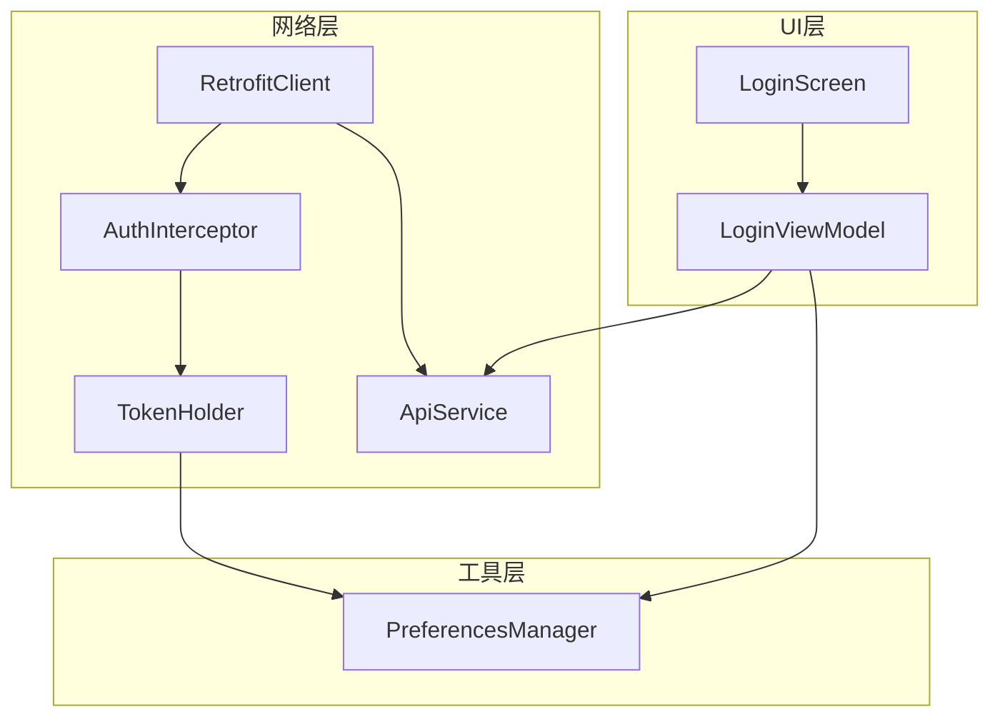
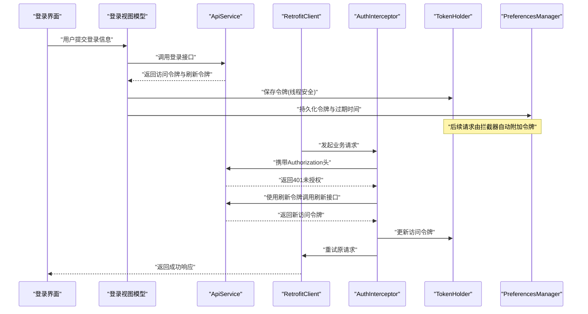
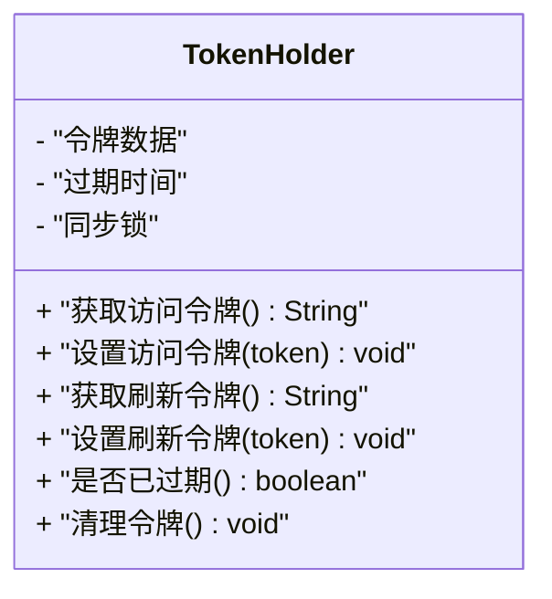
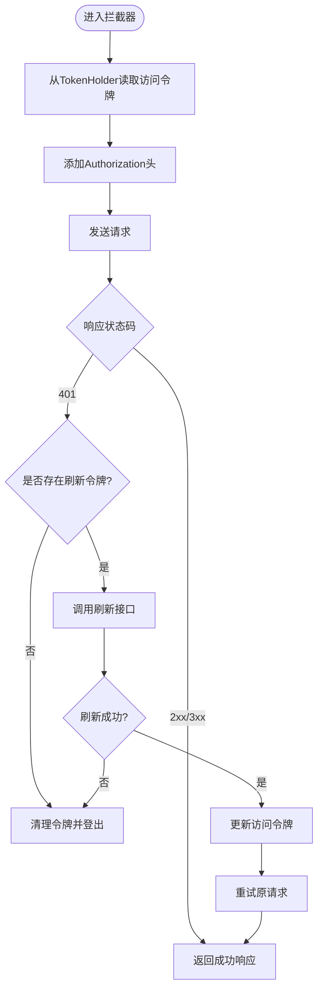
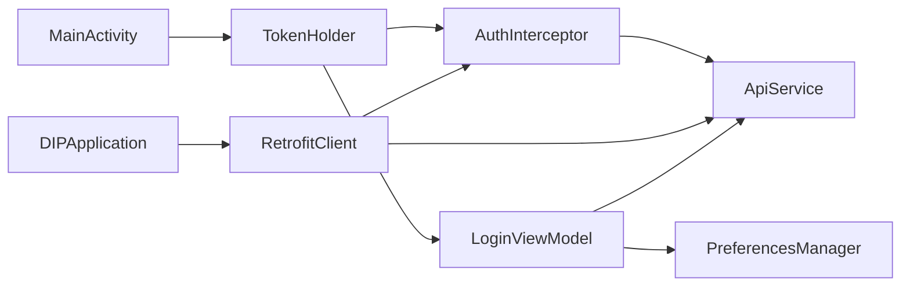

# 令牌管理

<cite>
**本文引用的文件**   
- [TokenHolder.kt](file://mobile-android/app/src/main/java/com/dip/material/data/network/TokenHolder.kt)
- [AuthInterceptor.kt](file://mobile-android/app/src/main/java/com/dip/material/data/network/AuthInterceptor.kt)
- [RetrofitClient.kt](file://mobile-android/app/src/main/java/com/dip/material/data/network/RetrofitClient.kt)
- [ApiService.kt](file://mobile-android/app/src/main/java/com/dip/material/data/network/ApiService.kt)
- [LoginScreen.kt](file://mobile-android/app/src/main/java/com/dip/material/ui/login/LoginScreen.kt)
- [LoginViewModel.kt](file://mobile-android/app/src/main/java/com/dip/material/ui/login/LoginViewModel.kt)
- [PreferencesManager.kt](file://mobile-android/app/src/main/java/com/dip/material/utils/PreferencesManager.kt)
- [DIPApplication.kt](file://mobile-android/app/src/main/java/com/dip/material/DIPApplication.kt)
- [MainActivity.kt](file://mobile-android/app/src/main/java/com/dip/material/MainActivity.kt)
</cite>

## 目录
1. [简介](#简介)
2. [项目结构](#项目结构)
3. [核心组件](#核心组件)
4. [架构总览](#架构总览)
5. [详细组件分析](#详细组件分析)
6. [依赖关系分析](#依赖关系分析)
7. [性能考虑](#性能考虑)
8. [故障排查指南](#故障排查指南)
9. [结论](#结论)
10. [附录](#附录)

## 简介
本文件面向DIP系统Android应用的令牌管理系统，聚焦于TokenHolder类的单例设计、线程安全的令牌存储机制，以及JWT令牌的生成、解析、验证与生命周期管理。文档涵盖自动刷新策略、本地持久化方案、加密存储与安全传输、内存泄漏防护、令牌失效处理、重新登录流程与错误恢复机制，帮助开发者快速理解并安全地扩展令牌管理能力。

## 项目结构
与令牌管理相关的代码主要位于Android模块的data.network与ui.login、utils等包中：
- data.network：网络层封装，包含Retrofit客户端、拦截器、API接口定义与TokenHolder单例
- ui.login：登录界面与视图模型，负责触发登录、获取并保存令牌
- utils：偏好设置管理器，用于本地持久化令牌及过期时间
- Application与Activity：应用启动时初始化网络与令牌相关能力

图表来源
- [RetrofitClient.kt](file://mobile-android/app/src/main/java/com/dip/material/data/network/RetrofitClient.kt)
- [AuthInterceptor.kt](file://mobile-android/app/src/main/java/com/dip/material/data/network/AuthInterceptor.kt)
- [TokenHolder.kt](file://mobile-android/app/src/main/java/com/dip/material/data/network/TokenHolder.kt)
- [ApiService.kt](file://mobile-android/app/src/main/java/com/dip/material/data/network/ApiService.kt)
- [LoginScreen.kt](file://mobile-android/app/src/main/java/com/dip/material/ui/login/LoginScreen.kt)
- [LoginViewModel.kt](file://mobile-android/app/src/main/java/com/dip/material/ui/login/LoginViewModel.kt)
- [PreferencesManager.kt](file://mobile-android/app/src/main/java/com/dip/material/utils/PreferencesManager.kt)

章节来源
- [RetrofitClient.kt](file://mobile-android/app/src/main/java/com/dip/material/data/network/RetrofitClient.kt)
- [AuthInterceptor.kt](file://mobile-android/app/src/main/java/com/dip/material/data/network/AuthInterceptor.kt)
- [TokenHolder.kt](file://mobile-android/app/src/main/java/com/dip/material/data/network/TokenHolder.kt)
- [ApiService.kt](file://mobile-android/app/src/main/java/com/dip/material/data/network/ApiService.kt)
- [LoginScreen.kt](file://mobile-android/app/src/main/java/com/dip/material/ui/login/LoginScreen.kt)
- [LoginViewModel.kt](file://mobile-android/app/src/main/java/com/dip/material/ui/login/LoginViewModel.kt)
- [PreferencesManager.kt](file://mobile-android/app/src/main/java/com/dip/material/utils/PreferencesManager.kt)

## 核心组件
- TokenHolder：单例持有当前访问令牌（access token）与刷新令牌（refresh token），提供线程安全的读写方法，支持过期判断与清理。
- AuthInterceptor：在请求前注入Authorization头，并在收到401时尝试使用刷新令牌续期；失败则触发登出流程。
- RetrofitClient：构建Retrofit实例，注册AuthInterceptor，暴露统一的网络入口。
- ApiService：声明业务API接口，包括登录、刷新令牌等。
- LoginViewModel / LoginScreen：发起登录请求，成功后保存令牌到TokenHolder与本地持久化。
- PreferencesManager：封装SharedPreferences，实现令牌的本地持久化与读取。

章节来源
- [TokenHolder.kt](file://mobile-android/app/src/main/java/com/dip/material/data/network/TokenHolder.kt)
- [AuthInterceptor.kt](file://mobile-android/app/src/main/java/com/dip/material/data/network/AuthInterceptor.kt)
- [RetrofitClient.kt](file://mobile-android/app/src/main/java/com/dip/material/data/network/RetrofitClient.kt)
- [ApiService.kt](file://mobile-android/app/src/main/java/com/dip/material/data/network/ApiService.kt)
- [LoginViewModel.kt](file://mobile-android/app/src/main/java/com/dip/material/ui/login/LoginViewModel.kt)
- [LoginScreen.kt](file://mobile-android/app/src/main/java/com/dip/material/ui/login/LoginScreen.kt)
- [PreferencesManager.kt](file://mobile-android/app/src/main/java/com/dip/material/utils/PreferencesManager.kt)

## 架构总览
令牌管理的整体流程如下：
- 登录成功后，服务端返回JWT访问令牌与刷新令牌；客户端将其写入TokenHolder并持久化到本地。
- 每次HTTP请求通过AuthInterceptor附加Authorization头；若响应为401且存在刷新令牌，则调用刷新接口更新令牌并重试原请求。
- 刷新失败或令牌过期无法恢复时，清除本地令牌并跳转登录页。
- 应用启动时从本地恢复令牌至TokenHolder，确保会话连续性。

图表来源
- [LoginScreen.kt](file://mobile-android/app/src/main/java/com/dip/material/ui/login/LoginScreen.kt)
- [LoginViewModel.kt](file://mobile-android/app/src/main/java/com/dip/material/ui/login/LoginViewModel.kt)
- [ApiService.kt](file://mobile-android/app/src/main/java/com/dip/material/data/network/ApiService.kt)
- [RetrofitClient.kt](file://mobile-android/app/src/main/java/com/dip/material/data/network/RetrofitClient.kt)
- [AuthInterceptor.kt](file://mobile-android/app/src/main/java/com/dip/material/data/network/AuthInterceptor.kt)
- [TokenHolder.kt](file://mobile-android/app/src/main/java/com/dip/material/data/network/TokenHolder.kt)
- [PreferencesManager.kt](file://mobile-android/app/src/main/java/com/dip/material/utils/PreferencesManager.kt)

## 详细组件分析

### TokenHolder：单例与线程安全存储
- 单例模式：保证全局唯一实例，避免多实例导致令牌不一致。
- 线程安全：对令牌的读写采用同步机制，防止并发竞态条件。
- 过期判断：根据本地保存的过期时间判断令牌是否有效，必要时触发刷新或清理。
- 清理逻辑：登出或令牌不可用时清空内存与本地存储，释放资源。

图表来源
- [TokenHolder.kt](file://mobile-android/app/src/main/java/com/dip/material/data/network/TokenHolder.kt)

章节来源
- [TokenHolder.kt](file://mobile-android/app/src/main/java/com/dip/material/data/network/TokenHolder.kt)

### AuthInterceptor：请求拦截与自动刷新
- 注入Authorization头：在请求前从TokenHolder读取访问令牌并添加到Header。
- 401处理：当服务端返回未授权时，检查是否存在刷新令牌；若有则调用刷新接口获取新访问令牌，更新TokenHolder并重试原请求。
- 失败处理：刷新失败或无刷新令牌时，清除本地令牌并通知上层进行登出处理。

图表来源
- [AuthInterceptor.kt](file://mobile-android/app/src/main/java/com/dip/material/data/network/AuthInterceptor.kt)
- [TokenHolder.kt](file://mobile-android/app/src/main/java/com/dip/material/data/network/TokenHolder.kt)
- [ApiService.kt](file://mobile-android/app/src/main/java/com/dip/material/data/network/ApiService.kt)

章节来源
- [AuthInterceptor.kt](file://mobile-android/app/src/main/java/com/dip/material/data/network/AuthInterceptor.kt)
- [TokenHolder.kt](file://mobile-android/app/src/main/java/com/dip/material/data/network/TokenHolder.kt)
- [ApiService.kt](file://mobile-android/app/src/main/java/com/dip/material/data/network/ApiService.kt)

### RetrofitClient：网络客户端与拦截器装配
- 构建Retrofit实例：配置基础URL、序列化器、超时等。
- 注册拦截器：将AuthInterceptor加入拦截链，确保所有请求统一处理认证。
- 暴露ApiService：通过Retrofit生成接口代理，供业务层调用。

章节来源
- [RetrofitClient.kt](file://mobile-android/app/src/main/java/com/dip/material/data/network/RetrofitClient.kt)
- [AuthInterceptor.kt](file://mobile-android/app/src/main/java/com/dip/material/data/network/AuthInterceptor.kt)
- [ApiService.kt](file://mobile-android/app/src/main/java/com/dip/material/data/network/ApiService.kt)

### ApiService：API接口定义
- 登录接口：接收用户名与密码，返回访问令牌与刷新令牌。
- 刷新接口：接收刷新令牌，返回新的访问令牌。
- 业务接口：其他功能API，均受拦截器保护。

章节来源
- [ApiService.kt](file://mobile-android/app/src/main/java/com/dip/material/data/network/ApiService.kt)

### LoginViewModel与LoginScreen：登录流程与令牌保存
- LoginScreen：收集用户输入，触发登录动作。
- LoginViewModel：调用ApiService登录接口，成功后将令牌保存到TokenHolder与本地持久化，并导航到主界面。

章节来源
- [LoginScreen.kt](file://mobile-android/app/src/main/java/com/dip/material/ui/login/LoginScreen.kt)
- [LoginViewModel.kt](file://mobile-android/app/src/main/java/com/dip/material/ui/login/LoginViewModel.kt)
- [TokenHolder.kt](file://mobile-android/app/src/main/java/com/dip/material/data/network/TokenHolder.kt)
- [PreferencesManager.kt](file://mobile-android/app/src/main/java/com/dip/material/utils/PreferencesManager.kt)

### PreferencesManager：本地持久化
- 存储键值：访问令牌、刷新令牌、过期时间戳等。
- 读写封装：提供安全的存取方法，避免空指针与类型转换异常。
- 清理支持：登出时清空敏感数据。

章节来源
- [PreferencesManager.kt](file://mobile-android/app/src/main/java/com/dip/material/utils/PreferencesManager.kt)

### DIPApplication与MainActivity：应用初始化与会话恢复
- DIPApplication：初始化网络客户端、日志、崩溃捕获等；可在启动时从本地恢复令牌至TokenHolder。
- MainActivity：作为主入口，根据令牌状态决定跳转到登录页或主页。

章节来源
- [DIPApplication.kt](file://mobile-android/app/src/main/java/com/dip/material/DIPApplication.kt)
- [MainActivity.kt](file://mobile-android/app/src/main/java/com/dip/material/MainActivity.kt)
- [TokenHolder.kt](file://mobile-android/app/src/main/java/com/dip/material/data/network/TokenHolder.kt)
- [PreferencesManager.kt](file://mobile-android/app/src/main/java/com/dip/material/utils/PreferencesManager.kt)

## 依赖关系分析
- TokenHolder被AuthInterceptor与LoginViewModel直接依赖，用于读写令牌。
- AuthInterceptor依赖ApiService以执行刷新操作，依赖TokenHolder更新令牌。
- RetrofitClient依赖AuthInterceptor与ApiService，形成网络层闭环。
- LoginViewModel依赖ApiService与PreferencesManager，完成登录与持久化。
- DIPApplication与MainActivity负责应用级初始化与状态恢复。

图表来源
- [TokenHolder.kt](file://mobile-android/app/src/main/java/com/dip/material/data/network/TokenHolder.kt)
- [AuthInterceptor.kt](file://mobile-android/app/src/main/java/com/dip/material/data/network/AuthInterceptor.kt)
- [RetrofitClient.kt](file://mobile-android/app/src/main/java/com/dip/material/data/network/RetrofitClient.kt)
- [ApiService.kt](file://mobile-android/app/src/main/java/com/dip/material/data/network/ApiService.kt)
- [LoginViewModel.kt](file://mobile-android/app/src/main/java/com/dip/material/ui/login/LoginViewModel.kt)
- [PreferencesManager.kt](file://mobile-android/app/src/main/java/com/dip/material/utils/PreferencesManager.kt)
- [DIPApplication.kt](file://mobile-android/app/src/main/java/com/dip/material/DIPApplication.kt)
- [MainActivity.kt](file://mobile-android/app/src/main/java/com/dip/material/MainActivity.kt)

章节来源
- [TokenHolder.kt](file://mobile-android/app/src/main/java/com/dip/material/data/network/TokenHolder.kt)
- [AuthInterceptor.kt](file://mobile-android/app/src/main/java/com/dip/material/data/network/AuthInterceptor.kt)
- [RetrofitClient.kt](file://mobile-android/app/src/main/java/com/dip/material/data/network/RetrofitClient.kt)
- [ApiService.kt](file://mobile-android/app/src/main/java/com/dip/material/data/network/ApiService.kt)
- [LoginViewModel.kt](file://mobile-android/app/src/main/java/com/dip/material/ui/login/LoginViewModel.kt)
- [PreferencesManager.kt](file://mobile-android/app/src/main/java/com/dip/material/utils/PreferencesManager.kt)
- [DIPApplication.kt](file://mobile-android/app/src/main/java/com/dip/material/DIPApplication.kt)
- [MainActivity.kt](file://mobile-android/app/src/main/java/com/dip/material/MainActivity.kt)

## 性能考虑
- 令牌读取与写入应尽量避免频繁I/O，优先使用内存中的TokenHolder，仅在必要时机落盘。
- 刷新令牌请求需具备幂等性与去重机制，避免并发刷新造成重复请求。
- 网络超时与重试策略需合理配置，防止阻塞UI线程。
- 大对象与回调应避免在TokenHolder中长时间持有，减少内存占用。

## 故障排查指南
- 401未授权持续出现：检查刷新令牌是否有效、服务端刷新接口是否正常、拦截器重试逻辑是否正确。
- 令牌未生效：确认TokenHolder是否被正确初始化、登录流程是否保存了令牌、拦截器是否被注册。
- 本地数据不一致：检查PreferencesManager的读写逻辑，确保键名一致、类型转换正确。
- 内存泄漏风险：避免在TokenHolder或拦截器中持有Activity/Fragment引用，使用弱引用或上下文安全的API。

章节来源
- [AuthInterceptor.kt](file://mobile-android/app/src/main/java/com/dip/material/data/network/AuthInterceptor.kt)
- [TokenHolder.kt](file://mobile-android/app/src/main/java/com/dip/material/data/network/TokenHolder.kt)
- [PreferencesManager.kt](file://mobile-android/app/src/main/java/com/dip/material/utils/PreferencesManager.kt)

## 结论
本令牌管理体系通过TokenHolder单例与AuthInterceptor拦截器实现了集中化、线程安全的令牌管理与自动刷新机制。结合本地持久化与应用初始化，保证了会话的连续性与安全性。建议在生产环境中进一步引入令牌加密存储、更严格的过期校验与完善的错误恢复策略，以提升整体健壮性。

## 附录
- JWT令牌生成与解析：通常由服务端生成，客户端仅负责保存与传递；如需本地解析，可使用标准库解码头部与载荷，注意不要信任未经验证的签名。
- 安全传输：务必使用HTTPS，避免中间人攻击；在可能的情况下启用证书固定。
- 令牌失效处理：统一在拦截器中处理401，区分“可刷新”与“不可刷新”场景，分别执行刷新或登出流程。
- 重新登录流程：清除本地令牌后跳转登录页，登录成功后重建会话。
- 错误恢复机制：对网络异常、解析异常、刷新失败等进行分类处理，提供用户友好的提示与重试选项。