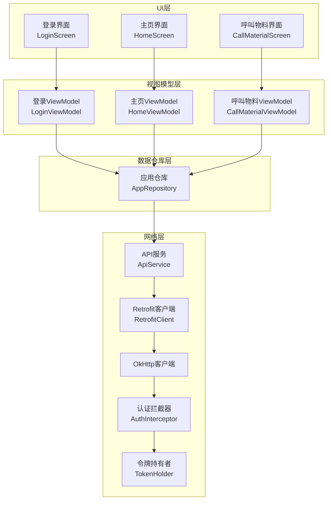
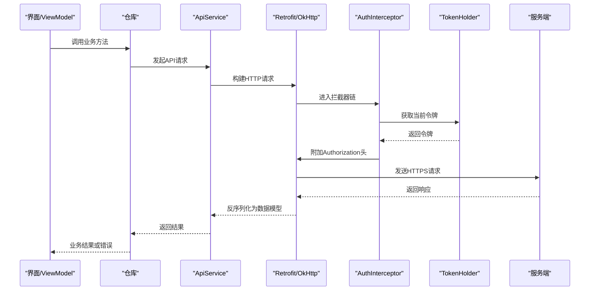
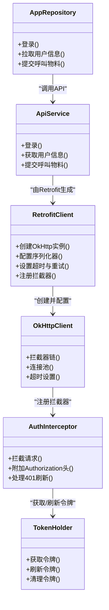
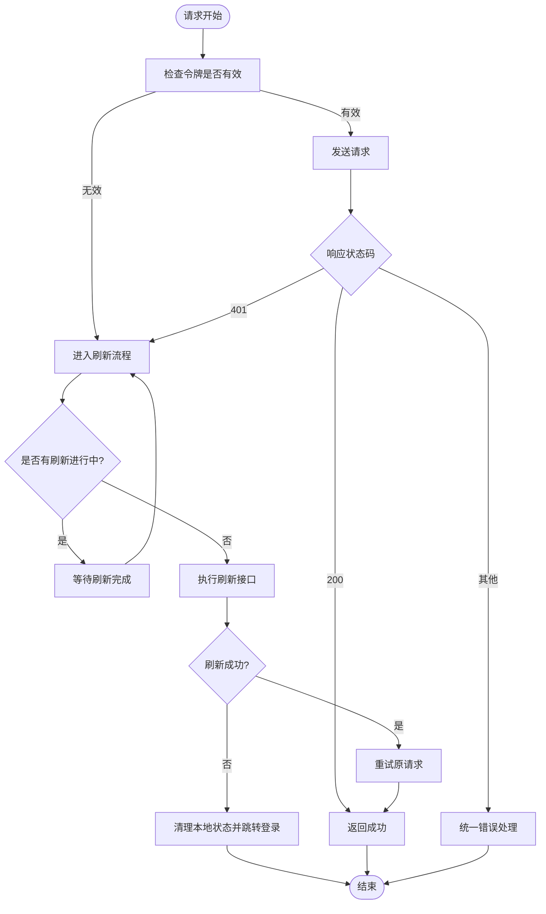

# 网络通信层

<cite>
**本文引用的文件**   
- [RetrofitClient.kt](file://mobile-android/app/src/main/java/com/dip/material/data/network/RetrofitClient.kt)
- [ApiService.kt](file://mobile-android/app/src/main/java/com/dip/material/data/network/ApiService.kt)
- [AuthInterceptor.kt](file://mobile-android/app/src/main/java/com/dip/material/data/network/AuthInterceptor.kt)
- [TokenHolder.kt](file://mobile-android/app/src/main/java/com/dip/material/data/network/TokenHolder.kt)
- [Models.kt](file://mobile-android/app/src/main/java/com/dip/material/data/models/Models.kt)
- [AppRepository.kt](file://mobile-android/app/src/main/java/com/dip/material/data/repository/AppRepository.kt)
- [DIPApplication.kt](file://mobile-android/app/src/main/java/com/dip/material/DIPApplication.kt)
- [MainActivity.kt](file://mobile-android/app/src/main/java/com/dip/material/MainActivity.kt)
- [LoginScreen.kt](file://mobile-android/app/src/main/java/com/dip/material/ui/login/LoginScreen.kt)
- [LoginViewModel.kt](file://mobile-android/app/src/main/java/com/dip/material/ui/login/LoginViewModel.kt)
- [HomeScreen.kt](file://mobile-android/app/src/main/java/com/dip/material/ui/home/HomeScreen.kt)
- [HomeViewModel.kt](file://mobile-android/app/src/main/java/com/dip/material/ui/home/HomeViewModel.kt)
- [CallMaterialScreen.kt](file://mobile-android/app/src/main/java/com/dip/material/ui/callmaterial/CallMaterialScreen.kt)
- [CallMaterialViewModel.kt](file://mobile-android/app/src/main/java/com/dip/material/ui/callmaterial/CallMaterialViewModel.kt)
- [PreferencesManager.kt](file://mobile-android/app/src/main/java/com/dip/material/utils/PreferencesManager.kt)
</cite>

## 目录
1. [简介](#简介)
2. [项目结构](#项目结构)
3. [核心组件](#核心组件)
4. [架构总览](#架构总览)
5. [详细组件分析](#详细组件分析)
6. [依赖关系分析](#依赖关系分析)
7. [性能与连接优化](#性能与连接优化)
8. [缓存与离线策略](#缓存与离线策略)
9. [安全与HTTPS](#安全与https)
10. [JWT令牌管理与自动刷新](#jwt令牌管理与自动刷新)
11. [API接口定义与数据模型](#api接口定义与数据模型)
12. [错误处理与异常恢复](#错误处理与异常恢复)
13. [调试与监控](#调试与监控)
14. [故障排查指南](#故障排查指南)
15. [结论](#结论)

## 简介
本文件面向DIP系统Android应用的网络通信层，聚焦于Retrofit客户端配置、OkHttp拦截器链、HTTPS安全通信、JWT令牌管理与自动刷新、错误处理模式、API接口定义与数据序列化、网络缓存与离线数据处理、连接池优化、网络调试技巧、性能监控与异常恢复机制。文档以代码级为依据，结合模块职责与调用时序，帮助开发者快速理解并扩展网络层能力。

## 项目结构
Android端网络相关代码集中在 data/network 与 data/models 目录，UI层通过 ViewModel 调用 Repository，Repository 使用 Retrofit API 进行网络请求。关键入口包括 Application 初始化、Activity/Screen 发起请求、Repository 封装业务逻辑、Network 层提供统一的HTTP能力。

图表来源
- [ApiService.kt:1-200](file://mobile-android/app/src/main/java/com/dip/material/data/network/ApiService.kt#L1-L200)
- [RetrofitClient.kt:1-200](file://mobile-android/app/src/main/java/com/dip/material/data/network/RetrofitClient.kt#L1-L200)
- [AuthInterceptor.kt:1-200](file://mobile-android/app/src/main/java/com/dip/material/data/network/AuthInterceptor.kt#L1-L200)
- [TokenHolder.kt:1-200](file://mobile-android/app/src/main/java/com/dip/material/data/network/TokenHolder.kt#L1-L200)
- [AppRepository.kt:1-200](file://mobile-android/app/src/main/java/com/dip/material/data/repository/AppRepository.kt#L1-L200)

章节来源
- [DIPApplication.kt:1-200](file://mobile-android/app/src/main/java/com/dip/material/DIPApplication.kt#L1-L200)
- [MainActivity.kt:1-200](file://mobile-android/app/src/main/java/com/dip/material/MainActivity.kt#L1-L200)
- [ApiService.kt:1-200](file://mobile-android/app/src/main/java/com/dip/material/data/network/ApiService.kt#L1-L200)
- [RetrofitClient.kt:1-200](file://mobile-android/app/src/main/java/com/dip/material/data/network/RetrofitClient.kt#L1-L200)
- [AuthInterceptor.kt:1-200](file://mobile-android/app/src/main/java/com/dip/material/data/network/AuthInterceptor.kt#L1-L200)
- [TokenHolder.kt:1-200](file://mobile-android/app/src/main/java/com/dip/material/data/network/TokenHolder.kt#L1-L200)
- [AppRepository.kt:1-200](file://mobile-android/app/src/main/java/com/dip/material/data/repository/AppRepository.kt#L1-L200)

## 核心组件
- Retrofit客户端：统一创建和配置OkHttp、序列化器、超时、重试等。
- OkHttp拦截器链：注入鉴权头、日志、重试、错误转换等。
- JWT令牌管理：集中存储、获取、刷新令牌，避免并发刷新冲突。
- API服务：声明式接口定义，对应后端RESTful端点。
- 数据模型：Kotlin数据类映射JSON字段，配合序列化器。
- 仓库层：聚合多个API调用，提供业务友好的方法。

章节来源
- [RetrofitClient.kt:1-200](file://mobile-android/app/src/main/java/com/dip/material/data/network/RetrofitClient.kt#L1-L200)
- [ApiService.kt:1-200](file://mobile-android/app/src/main/java/com/dip/material/data/network/ApiService.kt#L1-L200)
- [AuthInterceptor.kt:1-200](file://mobile-android/app/src/main/java/com/dip/material/data/network/AuthInterceptor.kt#L1-L200)
- [TokenHolder.kt:1-200](file://mobile-android/app/src/main/java/com/dip/material/data/network/TokenHolder.kt#L1-L200)
- [Models.kt:1-200](file://mobile-android/app/src/main/java/com/dip/material/data/models/Models.kt#L1-L200)
- [AppRepository.kt:1-200](file://mobile-android/app/src/main/java/com/dip/material/data/repository/AppRepository.kt#L1-L200)

## 架构总览
网络层采用分层设计：UI层通过ViewModel调用Repository，Repository组合多个ApiService方法完成业务操作；ApiService由Retrofit生成实现，底层OkHttp负责实际HTTP传输，拦截器链在请求前后进行增强（如添加Authorization头、记录日志、统一错误处理）。

图表来源
- [ApiService.kt:1-200](file://mobile-android/app/src/main/java/com/dip/material/data/network/ApiService.kt#L1-L200)
- [RetrofitClient.kt:1-200](file://mobile-android/app/src/main/java/com/dip/material/data/network/RetrofitClient.kt#L1-L200)
- [AuthInterceptor.kt:1-200](file://mobile-android/app/src/main/java/com/dip/material/data/network/AuthInterceptor.kt#L1-L200)
- [TokenHolder.kt:1-200](file://mobile-android/app/src/main/java/com/dip/material/data/network/TokenHolder.kt#L1-L200)

## 详细组件分析

### Retrofit客户端配置
- 作用：集中配置OkHttp实例、序列化器、Base URL、超时时间、重试策略等。
- 关键点：
  - Base URL从配置或环境变量读取，便于多环境切换。
  - 设置Gson/Moshi序列化器，统一日期、枚举、空值处理。
  - 配置OkHttp连接池、读写超时、重试次数。
  - 注册全局拦截器（日志、认证、错误转换）。

章节来源
- [RetrofitClient.kt:1-200](file://mobile-android/app/src/main/java/com/dip/material/data/network/RetrofitClient.kt#L1-L200)

### OkHttp拦截器链
- 认证拦截器：为每个请求附加Authorization头，支持Bearer令牌。
- 日志拦截器：打印请求/响应头与体，便于调试。
- 错误转换拦截器：将HTTP状态码转换为业务异常，统一错误处理。
- 重试拦截器：对特定状态码（如401）进行幂等重试或触发刷新流程。

章节来源
- [AuthInterceptor.kt:1-200](file://mobile-android/app/src/main/java/com/dip/material/data/network/AuthInterceptor.kt#L1-L200)

### JWT令牌管理机制
- 令牌存储：优先使用内存缓存，持久化到SharedPreferences作为后备。
- 令牌获取：线程安全地读取当前令牌，避免竞态条件。
- 令牌刷新：当收到401时，尝试刷新令牌；若失败则清理本地状态并跳转登录。
- 并发控制：防止多次并发刷新导致重复请求刷新接口。

章节来源
- [TokenHolder.kt:1-200](file://mobile-android/app/src/main/java/com/dip/material/data/network/TokenHolder.kt#L1-L200)
- [PreferencesManager.kt:1-200](file://mobile-android/app/src/main/java/com/dip/material/utils/PreferencesManager.kt#L1-200)

### API接口定义与数据模型
- ApiService：使用注解声明GET/POST/PUT/DELETE等端点，参数映射路径、查询、表单或JSON。
- Models.kt：定义请求与响应数据类，字段命名与后端保持一致，必要时使用注解指定序列化键名。
- 示例端点：
  - 登录：POST /auth/login
  - 用户信息：GET /user/me
  - 呼叫物料：POST /call-material

章节来源
- [ApiService.kt:1-200](file://mobile-android/app/src/main/java/com/dip/material/data/network/ApiService.kt#L1-L200)
- [Models.kt:1-200](file://mobile-android/app/src/main/java/com/dip/material/data/models/Models.kt#L1-L200)

### 仓库层与业务编排
- AppRepository：聚合多个ApiService调用，封装业务逻辑，如登录成功后保存令牌、拉取用户信息、提交呼叫物料等。
- 错误处理：捕获网络异常、解析错误消息，向上抛出业务友好异常。
- 缓存策略：对读多写少的数据（如字典、基础配置）进行本地缓存。

章节来源
- [AppRepository.kt:1-200](file://mobile-android/app/src/main/java/com/dip/material/data/repository/AppRepository.kt#L1-L200)

### UI层集成
- LoginScreen/LoginViewModel：处理登录输入、调用仓库登录方法、处理成功/失败回调。
- HomeScreen/HomeViewModel：登录后拉取用户信息与首页数据。
- CallMaterialScreen/CallMaterialViewModel：提交呼叫物料请求，处理成功提示与错误反馈。

章节来源
- [LoginScreen.kt:1-200](file://mobile-android/app/src/main/java/com/dip/material/ui/login/LoginScreen.kt#L1-L200)
- [LoginViewModel.kt:1-200](file://mobile-android/app/src/main/java/com/dip/material/ui/login/LoginViewModel.kt#L1-L200)
- [HomeScreen.kt:1-200](file://mobile-android/app/src/main/java/com/dip/material/ui/home/HomeScreen.kt#L1-L200)
- [HomeViewModel.kt:1-200](file://mobile-android/app/src/main/java/com/dip/material/ui/home/HomeViewModel.kt#L1-L200)
- [CallMaterialScreen.kt:1-200](file://mobile-android/app/src/main/java/com/dip/material/ui/callmaterial/CallMaterialScreen.kt#L1-L200)
- [CallMaterialViewModel.kt:1-200](file://mobile-android/app/src/main/java/com/dip/material/ui/callmaterial/CallMaterialViewModel.kt#L1-L200)

## 依赖关系分析
- Retrofit依赖OkHttp，OkHttp通过拦截器链扩展功能。
- AuthInterceptor依赖TokenHolder获取令牌。
- ApiService由Retrofit生成实现，依赖Models.kt中的数据类型。
- Repository依赖ApiService，向上暴露业务方法给ViewModel。
- UI层通过ViewModel间接依赖Repository与网络层。

图表来源
- [RetrofitClient.kt:1-200](file://mobile-android/app/src/main/java/com/dip/material/data/network/RetrofitClient.kt#L1-L200)
- [AuthInterceptor.kt:1-200](file://mobile-android/app/src/main/java/com/dip/material/data/network/AuthInterceptor.kt#L1-L200)
- [TokenHolder.kt:1-200](file://mobile-android/app/src/main/java/com/dip/material/data/network/TokenHolder.kt#L1-L200)
- [ApiService.kt:1-200](file://mobile-android/app/src/main/java/com/dip/material/data/network/ApiService.kt#L1-L200)
- [AppRepository.kt:1-200](file://mobile-android/app/src/main/java/com/dip/material/data/repository/AppRepository.kt#L1-L200)

章节来源
- [RetrofitClient.kt:1-200](file://mobile-android/app/src/main/java/com/dip/material/data/network/RetrofitClient.kt#L1-L200)
- [ApiService.kt:1-200](file://mobile-android/app/src/main/java/com/dip/material/data/network/ApiService.kt#L1-L200)
- [AuthInterceptor.kt:1-200](file://mobile-android/app/src/main/java/com/dip/material/data/network/AuthInterceptor.kt#L1-L200)
- [TokenHolder.kt:1-200](file://mobile-android/app/src/main/java/com/dip/material/data/network/TokenHolder.kt#L1-L200)
- [AppRepository.kt:1-200](file://mobile-android/app/src/main/java/com/dip/material/data/repository/AppRepository.kt#L1-L200)

## 性能与连接优化
- 连接池：合理设置最大空闲连接数与保持时间，减少握手开销。
- 超时配置：根据业务场景设置合理的连接、读取、写入超时。
- 重试策略：仅对幂等请求启用重试，避免重复提交。
- 序列化：选择高效的序列化库（如Moshi），减少CPU与内存占用。
- 请求合并：对频繁的小请求进行合并或批量接口。

章节来源
- [RetrofitClient.kt:1-200](file://mobile-android/app/src/main/java/com/dip/material/data/network/RetrofitClient.kt#L1-L200)

## 缓存与离线策略
- HTTP缓存：利用OkHttp的Cache-Control与ETag实现响应缓存。
- 本地缓存：对静态数据（字典、配置）使用Room或SharedPreferences缓存。
- 离线优先：先查本地缓存，再请求网络，失败时回退到缓存数据。
- 缓存失效：在写操作后主动清除相关缓存，保证数据一致性。

章节来源
- [RetrofitClient.kt:1-200](file://mobile-android/app/src/main/java/com/dip/material/data/network/RetrofitClient.kt#L1-L200)
- [AppRepository.kt:1-200](file://mobile-android/app/src/main/java/com/dip/material/data/repository/AppRepository.kt#L1-L200)

## 安全与HTTPS
- 证书校验：启用默认HTTPS校验，禁止自定义信任所有证书的调试配置上线。
- 安全头：强制HSTS、CSP等安全响应头。
- 敏感信息：不在日志中输出令牌与密码。
- 防重放：对关键接口增加时间戳与签名。

章节来源
- [RetrofitClient.kt:1-200](file://mobile-android/app/src/main/java/com/dip/material/data/network/RetrofitClient.kt#L1-L200)
- [AuthInterceptor.kt:1-200](file://mobile-android/app/src/main/java/com/dip/material/data/network/AuthInterceptor.kt#L1-L200)

## JWT令牌管理与自动刷新
- 令牌生命周期：登录成功获取令牌，过期前刷新，失败则清理并跳转登录。
- 刷新流程：检测到401时，暂停其他请求，串行执行刷新，成功后重试原请求。
- 并发控制：使用锁或信号量确保同一时刻只有一个刷新任务。
- 持久化：令牌落盘加密存储，重启后恢复。

图表来源
- [AuthInterceptor.kt:1-200](file://mobile-android/app/src/main/java/com/dip/material/data/network/AuthInterceptor.kt#L1-L200)
- [TokenHolder.kt:1-200](file://mobile-android/app/src/main/java/com/dip/material/data/network/TokenHolder.kt#L1-L200)

章节来源
- [AuthInterceptor.kt:1-200](file://mobile-android/app/src/main/java/com/dip/material/data/network/AuthInterceptor.kt#L1-L200)
- [TokenHolder.kt:1-200](file://mobile-android/app/src/main/java/com/dip/material/data/network/TokenHolder.kt#L1-L200)

## API接口定义与数据模型
- 接口定义：使用注解声明端点、方法、路径、参数、请求体与响应类型。
- 数据模型：Kotlin data class映射JSON字段，使用注解指定序列化键名与格式。
- 示例：
  - 登录：POST /auth/login，请求体包含用户名与密码，返回令牌与用户信息。
  - 用户信息：GET /user/me，返回用户详情。
  - 呼叫物料：POST /call-material，提交物料呼叫请求。

章节来源
- [ApiService.kt:1-200](file://mobile-android/app/src/main/java/com/dip/material/data/network/ApiService.kt#L1-L200)
- [Models.kt:1-200](file://mobile-android/app/src/main/java/com/dip/material/data/models/Models.kt#L1-L200)

## 错误处理与异常恢复
- 统一错误转换：将HTTP状态码与网络异常转换为业务异常，携带错误码与消息。
- 重试机制：对临时性错误（如网络抖动）进行有限次重试。
- 降级策略：在网络不可用时返回缓存数据或友好提示。
- 用户反馈：在UI层展示错误原因与操作建议。

章节来源
- [AppRepository.kt:1-200](file://mobile-android/app/src/main/java/com/dip/material/data/repository/AppRepository.kt#L1-L200)
- [AuthInterceptor.kt:1-200](file://mobile-android/app/src/main/java/com/dip/material/data/network/AuthInterceptor.kt#L1-L200)

## 调试与监控
- 日志拦截：开启OkHttp日志拦截器，打印请求/响应详情。
- 网络监控：统计请求耗时、成功率、错误率，上报至监控系统。
- 抓包工具：使用Charles/Fiddler进行HTTPS抓包（需安装信任证书）。
- 性能分析：使用Android Profiler分析CPU、内存、网络IO。

章节来源
- [RetrofitClient.kt:1-200](file://mobile-android/app/src/main/java/com/dip/material/data/network/RetrofitClient.kt#L1-L200)

## 故障排查指南
- 常见问题：
  - 401未授权：检查令牌是否过期或无效，确认刷新流程是否正常。
  - 网络超时：调整超时配置，检查服务器负载与网络状况。
  - 证书错误：确认服务器证书链完整，避免自签证书问题。
  - 序列化失败：检查JSON结构与数据模型字段是否一致。
- 排查步骤：
  - 打开日志拦截器，查看请求与响应内容。
  - 使用抓包工具验证网络链路。
  - 检查本地令牌存储与刷新逻辑。
  - 逐步缩小范围定位问题模块。

章节来源
- [AuthInterceptor.kt:1-200](file://mobile-android/app/src/main/java/com/dip/material/data/network/AuthInterceptor.kt#L1-L200)
- [TokenHolder.kt:1-200](file://mobile-android/app/src/main/java/com/dip/material/data/network/TokenHolder.kt#L1-L200)
- [RetrofitClient.kt:1-200](file://mobile-android/app/src/main/java/com/dip/material/data/network/RetrofitClient.kt#L1-L200)

## 结论
DIP系统Android应用的网络通信层基于Retrofit与OkHttp构建了高内聚、低耦合的网络抽象，通过拦截器链实现了统一的鉴权、日志与错误处理。JWT令牌管理具备自动刷新与并发控制能力，结合缓存与离线策略提升了用户体验与系统稳定性。建议在后续迭代中持续优化性能监控与错误可观测性，完善安全策略与降级方案。