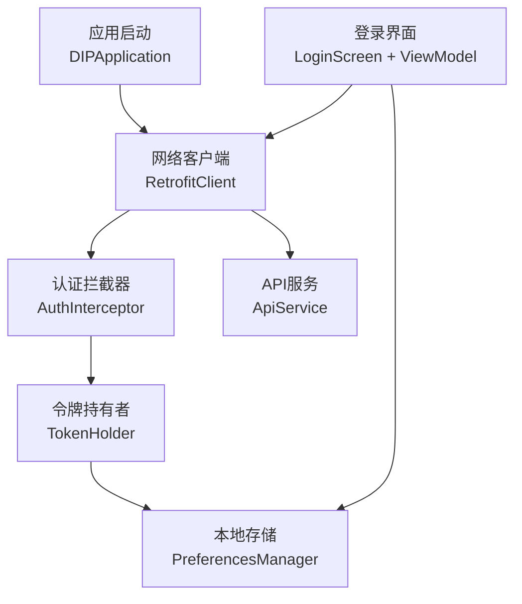
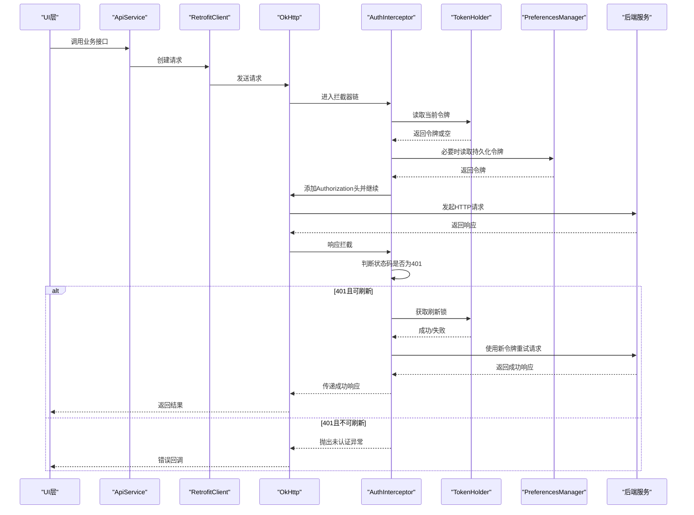
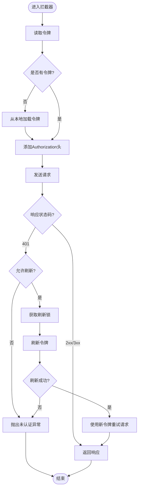
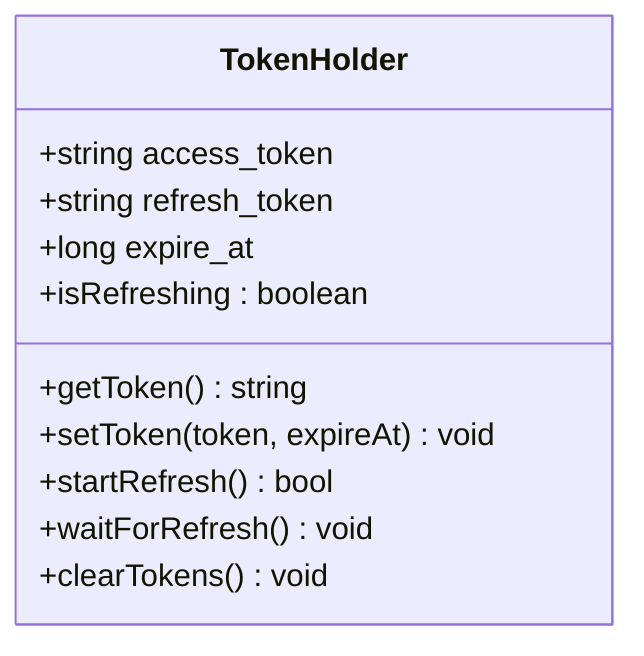
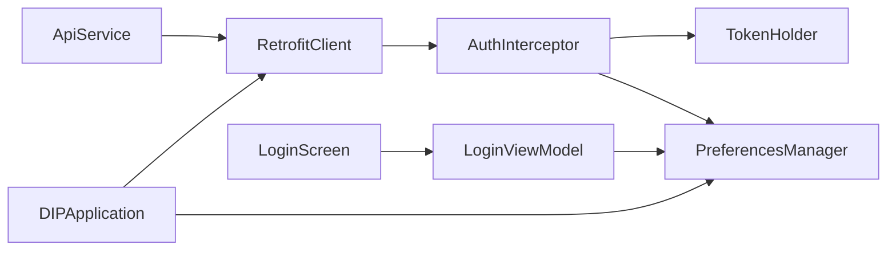

# 认证拦截器

<cite>
**本文引用的文件**   
- [AuthInterceptor.kt](file://mobile-android/app/src/main/java/com/dip/material/data/network/AuthInterceptor.kt)
- [RetrofitClient.kt](file://mobile-android/app/src/main/java/com/dip/material/data/network/RetrofitClient.kt)
- [TokenHolder.kt](file://mobile-android/app/src/main/java/com/dip/material/data/network/TokenHolder.kt)
- [ApiService.kt](file://mobile-android/app/src/main/java/com/dip/material/data/network/ApiService.kt)
- [PreferencesManager.kt](file://mobile-android/app/src/main/java/com/dip/material/utils/PreferencesManager.kt)
- [LoginViewModel.kt](file://mobile-android/app/src/main/java/com/dip/material/ui/login/LoginViewModel.kt)
- [LoginScreen.kt](file://mobile-android/app/src/main/java/com/dip/material/ui/login/LoginScreen.kt)
- [DIPApplication.kt](file://mobile-android/app/src/main/java/com/dip/material/DIPApplication.kt)
</cite>

## 目录
1. [简介](#简介)
2. [项目结构](#项目结构)
3. [核心组件](#核心组件)
4. [架构总览](#架构总览)
5. [详细组件分析](#详细组件分析)
6. [依赖关系分析](#依赖关系分析)
7. [性能考虑](#性能考虑)
8. [故障排查指南](#故障排查指南)
9. [结论](#结论)
10. [附录](#附录)

## 简介
本文件面向DIP系统Android应用中的认证拦截器，围绕OkHttp拦截器在请求与响应阶段的处理机制进行系统化说明。重点涵盖：
- 请求拦截：自动附加JWT令牌、令牌有效性检查、并发刷新保护
- 响应拦截：401状态码识别、令牌过期检测、重试策略与错误上报
- 令牌刷新流程：单例刷新锁、失败回退、幂等性保障
- 安全与存储：令牌持久化、最小权限原则、敏感信息防护
- 调试技巧：日志打印、断点定位、常见异常模式

## 项目结构
与认证拦截器相关的代码集中在网络层与登录模块中，关键文件如下：
- 网络层
  - AuthInterceptor.kt：OkHttp拦截器实现（请求头注入、401处理、刷新协调）
  - RetrofitClient.kt：Retrofit与OkHttp客户端构建、拦截器装配
  - TokenHolder.kt：令牌持有与并发访问控制
  - ApiService.kt：API接口定义（用于理解哪些接口需要鉴权）
- 存储与初始化
  - PreferencesManager.kt：本地偏好存储（令牌存取）
  - DIPApplication.kt：应用启动时初始化网络与存储
- 登录流程
  - LoginViewModel.kt / LoginScreen.kt：登录成功后写入令牌并触发后续业务调用

图表来源
- [DIPApplication.kt](file://mobile-android/app/src/main/java/com/dip/material/DIPApplication.kt)
- [RetrofitClient.kt](file://mobile-android/app/src/main/java/com/dip/material/data/network/RetrofitClient.kt)
- [AuthInterceptor.kt](file://mobile-android/app/src/main/java/com/dip/material/data/network/AuthInterceptor.kt)
- [TokenHolder.kt](file://mobile-android/app/src/main/java/com/dip/material/data/network/TokenHolder.kt)
- [PreferencesManager.kt](file://mobile-android/app/src/main/java/com/dip/material/utils/PreferencesManager.kt)
- [ApiService.kt](file://mobile-android/app/src/main/java/com/dip/material/data/network/ApiService.kt)
- [LoginScreen.kt](file://mobile-android/app/src/main/java/com/dip/material/ui/login/LoginScreen.kt)
- [LoginViewModel.kt](file://mobile-android/app/src/main/java/com/dip/material/ui/login/LoginViewModel.kt)

章节来源
- [RetrofitClient.kt](file://mobile-android/app/src/main/java/com/dip/material/data/network/RetrofitClient.kt)
- [AuthInterceptor.kt](file://mobile-android/app/src/main/java/com/dip/material/data/network/AuthInterceptor.kt)
- [TokenHolder.kt](file://mobile-android/app/src/main/java/com/dip/material/data/network/TokenHolder.kt)
- [PreferencesManager.kt](file://mobile-android/app/src/main/java/com/dip/material/utils/PreferencesManager.kt)
- [ApiService.kt](file://mobile-android/app/src/main/java/com/dip/material/data/network/ApiService.kt)
- [LoginViewModel.kt](file://mobile-android/app/src/main/java/com/dip/material/ui/login/LoginViewModel.kt)
- [LoginScreen.kt](file://mobile-android/app/src/main/java/com/dip/material/ui/login/LoginScreen.kt)
- [DIPApplication.kt](file://mobile-android/app/src/main/java/com/dip/material/DIPApplication.kt)

## 核心组件
- 认证拦截器（AuthInterceptor）
  - 职责：在请求阶段注入Authorization头；在响应阶段捕获401并触发令牌刷新；对刷新后的请求进行重试。
  - 关键点：避免重复刷新（并发保护）、区分可重试与不可重试的401场景、记录必要日志。
- 令牌持有者（TokenHolder）
  - 职责：提供线程安全的令牌读写、刷新锁、刷新状态标志。
  - 关键点：使用互斥或协程同步原语保证同一时刻仅一个刷新任务执行。
- 本地存储（PreferencesManager）
  - 职责：持久化access_token、refresh_token、过期时间戳等。
  - 关键点：加密或混淆建议、读写原子性、默认值与空值处理。
- 网络客户端（RetrofitClient）
  - 职责：构建OkHttp实例、装配认证拦截器、配置超时与重试策略。
  - 关键点：拦截器顺序、日志级别、连接池参数。
- API服务（ApiService）
  - 职责：声明REST接口，供UI层调用。
  - 关键点：鉴权接口与非鉴权接口的划分。

章节来源
- [AuthInterceptor.kt](file://mobile-android/app/src/main/java/com/dip/material/data/network/AuthInterceptor.kt)
- [TokenHolder.kt](file://mobile-android/app/src/main/java/com/dip/material/data/network/TokenHolder.kt)
- [PreferencesManager.kt](file://mobile-android/app/src/main/java/com/dip/material/utils/PreferencesManager.kt)
- [RetrofitClient.kt](file://mobile-android/app/src/main/java/com/dip/material/data/network/RetrofitClient.kt)
- [ApiService.kt](file://mobile-android/app/src/main/java/com/dip/material/data/network/ApiService.kt)

## 架构总览
下图展示从UI发起请求到服务端返回结果的完整链路，以及认证拦截器在其中扮演的角色。

图表来源
- [AuthInterceptor.kt](file://mobile-android/app/src/main/java/com/dip/material/data/network/AuthInterceptor.kt)
- [TokenHolder.kt](file://mobile-android/app/src/main/java/com/dip/material/data/network/TokenHolder.kt)
- [PreferencesManager.kt](file://mobile-android/app/src/main/java/com/dip/material/utils/PreferencesManager.kt)
- [RetrofitClient.kt](file://mobile-android/app/src/main/java/com/dip/material/data/network/RetrofitClient.kt)
- [ApiService.kt](file://mobile-android/app/src/main/java/com/dip/material/data/network/ApiService.kt)

## 详细组件分析

### 认证拦截器（AuthInterceptor）
- 请求拦截
  - 从TokenHolder读取当前access_token，若为空则尝试从PreferencesManager恢复。
  - 为请求添加Authorization头（例如Bearer前缀）。
  - 对于无需鉴权的接口（如登录、注册），跳过注入。
- 响应拦截
  - 捕获401状态码，判定是否属于“令牌过期”场景。
  - 通过TokenHolder确保并发刷新保护，避免多次刷新。
  - 刷新成功后，用新令牌重试原始请求，返回成功结果。
  - 刷新失败或不可重试时，向上抛出未认证异常，交由上层处理（跳转登录页等）。
- 重试策略
  - 限制最大重试次数，防止无限循环。
  - 区分网络错误与业务错误，仅对明确的401进行重试。
- 日志与监控
  - 记录关键节点（令牌读取、刷新开始/结束、重试次数、失败原因）。
  - 生产环境降低日志级别，避免泄露敏感信息。

图表来源
- [AuthInterceptor.kt](file://mobile-android/app/src/main/java/com/dip/material/data/network/AuthInterceptor.kt)
- [TokenHolder.kt](file://mobile-android/app/src/main/java/com/dip/material/data/network/TokenHolder.kt)
- [PreferencesManager.kt](file://mobile-android/app/src/main/java/com/dip/material/utils/PreferencesManager.kt)

章节来源
- [AuthInterceptor.kt](file://mobile-android/app/src/main/java/com/dip/material/data/network/AuthInterceptor.kt)
- [TokenHolder.kt](file://mobile-android/app/src/main/java/com/dip/material/data/network/TokenHolder.kt)
- [PreferencesManager.kt](file://mobile-android/app/src/main/java/com/dip/material/utils/PreferencesManager.kt)

### 令牌持有者（TokenHolder）
- 功能要点
  - 提供get/set方法读写access_token与refresh_token。
  - 维护刷新锁与刷新状态标志，确保并发安全。
  - 支持令牌过期时间管理，便于提前刷新或快速失效判断。
- 并发保护
  - 使用互斥锁或协程同步原语，保证同一时刻只有一个刷新任务。
  - 其他等待的请求在刷新完成后直接复用新令牌重试。
- 数据一致性
  - 写操作需原子更新，避免部分更新导致的状态不一致。
  - 读操作需考虑内存可见性与缓存一致性。

图表来源
- [TokenHolder.kt](file://mobile-android/app/src/main/java/com/dip/material/data/network/TokenHolder.kt)

章节来源
- [TokenHolder.kt](file://mobile-android/app/src/main/java/com/dip/material/data/network/TokenHolder.kt)

### 本地存储（PreferencesManager）
- 功能要点
  - 保存access_token、refresh_token、过期时间戳等。
  - 提供安全读取与写入接口，支持默认值与空值处理。
- 安全建议
  - 建议使用加密存储或至少混淆敏感字段。
  - 避免在日志中输出完整令牌。
- 生命周期
  - 应用退出或用户登出时清理敏感数据。
  - 首次启动时检查是否存在有效令牌。

章节来源
- [PreferencesManager.kt](file://mobile-android/app/src/main/java/com/dip/material/utils/PreferencesManager.kt)

### 网络客户端（RetrofitClient）
- 功能要点
  - 构建OkHttp实例，设置连接池、超时、重试策略。
  - 装配认证拦截器与其他中间件（如日志、压缩）。
  - 暴露统一的API服务实例。
- 配置建议
  - 合理设置超时时间与重试次数，避免阻塞主线程。
  - 在生产环境关闭详细日志，启用结构化日志。

章节来源
- [RetrofitClient.kt](file://mobile-android/app/src/main/java/com/dip/material/data/network/RetrofitClient.kt)

### API服务（ApiService）
- 功能要点
  - 定义业务接口，明确鉴权需求。
  - 将鉴权逻辑下沉至拦截器，保持接口简洁。
- 最佳实践
  - 区分公开接口与鉴权接口，减少不必要的令牌注入。
  - 统一错误模型，便于上层处理。

章节来源
- [ApiService.kt](file://mobile-android/app/src/main/java/com/dip/material/data/network/ApiService.kt)

### 登录流程（LoginViewModel / LoginScreen）
- 功能要点
  - 用户输入凭证后调用登录接口。
  - 成功后保存令牌到本地存储，并更新内存中的令牌状态。
  - 跳转到主页或业务页面，后续请求由拦截器自动附加令牌。
- 错误处理
  - 捕获网络异常与业务错误，提示用户并重试或引导重新登录。

章节来源
- [LoginViewModel.kt](file://mobile-android/app/src/main/java/com/dip/material/ui/login/LoginViewModel.kt)
- [LoginScreen.kt](file://mobile-android/app/src/main/java/com/dip/material/ui/login/LoginScreen.kt)

### 应用初始化（DIPApplication）
- 功能要点
  - 初始化网络客户端、存储管理器、令牌持有者。
  - 设置全局异常处理器与日志级别。
- 启动优化
  - 延迟加载非关键资源，提升冷启动速度。

章节来源
- [DIPApplication.kt](file://mobile-android/app/src/main/java/com/dip/material/DIPApplication.kt)

## 依赖关系分析
- 组件耦合
  - AuthInterceptor依赖TokenHolder与PreferencesManager，解耦了令牌来源与校验逻辑。
  - RetrofitClient集中管理OkHttp配置，便于统一调整网络行为。
- 外部依赖
  - OkHttp负责底层HTTP通信。
  - Retrofit提供类型安全的API封装。
- 潜在风险
  - 循环重试可能导致雪崩，需限制重试次数与退避策略。
  - 令牌泄露风险，需严格管控日志与内存。

图表来源
- [AuthInterceptor.kt](file://mobile-android/app/src/main/java/com/dip/material/data/network/AuthInterceptor.kt)
- [TokenHolder.kt](file://mobile-android/app/src/main/java/com/dip/material/data/network/TokenHolder.kt)
- [PreferencesManager.kt](file://mobile-android/app/src/main/java/com/dip/material/utils/PreferencesManager.kt)
- [RetrofitClient.kt](file://mobile-android/app/src/main/java/com/dip/material/data/network/RetrofitClient.kt)
- [ApiService.kt](file://mobile-android/app/src/main/java/com/dip/material/data/network/ApiService.kt)
- [LoginViewModel.kt](file://mobile-android/app/src/main/java/com/dip/material/ui/login/LoginViewModel.kt)
- [LoginScreen.kt](file://mobile-android/app/src/main/java/com/dip/material/ui/login/LoginScreen.kt)
- [DIPApplication.kt](file://mobile-android/app/src/main/java/com/dip/material/DIPApplication.kt)

章节来源
- [AuthInterceptor.kt](file://mobile-android/app/src/main/java/com/dip/material/data/network/AuthInterceptor.kt)
- [TokenHolder.kt](file://mobile-android/app/src/main/java/com/dip/material/data/network/TokenHolder.kt)
- [PreferencesManager.kt](file://mobile-android/app/src/main/java/com/dip/material/utils/PreferencesManager.kt)
- [RetrofitClient.kt](file://mobile-android/app/src/main/java/com/dip/material/data/network/RetrofitClient.kt)
- [ApiService.kt](file://mobile-android/app/src/main/java/com/dip/material/data/network/ApiService.kt)
- [LoginViewModel.kt](file://mobile-android/app/src/main/java/com/dip/material/ui/login/LoginViewModel.kt)
- [LoginScreen.kt](file://mobile-android/app/src/main/java/com/dip/material/ui/login/LoginScreen.kt)
- [DIPApplication.kt](file://mobile-android/app/src/main/java/com/dip/material/DIPApplication.kt)

## 性能考虑
- 令牌读取与写入应尽量避免阻塞主线程，使用异步或轻量级同步原语。
- 合理设置OkHttp连接池大小与超时时间，避免资源耗尽。
- 减少日志输出频率与内容，生产环境仅保留关键错误信息。
- 对频繁调用的接口启用缓存策略（如ETag、Cache-Control），降低网络开销。

## 故障排查指南
- 常见问题
  - 401持续出现：检查令牌刷新逻辑是否正确、服务器是否返回有效的刷新令牌。
  - 并发刷新导致死锁：确认刷新锁的实现是否包含超时与唤醒机制。
  - 令牌未持久化：检查PreferencesManager的读写路径与权限。
- 调试技巧
  - 开启OkHttp日志，观察请求头与响应体变化。
  - 在拦截器关键分支打点，记录令牌状态与刷新结果。
  - 模拟令牌过期场景，验证重试与错误处理路径。
- 异常处理模式
  - 统一捕获网络异常与业务异常，转换为上层可理解的错误码。
  - 对用户可见的错误进行友好提示，并提供重试或重新登录入口。

章节来源
- [AuthInterceptor.kt](file://mobile-android/app/src/main/java/com/dip/material/data/network/AuthInterceptor.kt)
- [TokenHolder.kt](file://mobile-android/app/src/main/java/com/dip/material/data/network/TokenHolder.kt)
- [PreferencesManager.kt](file://mobile-android/app/src/main/java/com/dip/material/utils/PreferencesManager.kt)
- [RetrofitClient.kt](file://mobile-android/app/src/main/java/com/dip/material/data/network/RetrofitClient.kt)

## 结论
认证拦截器通过将鉴权逻辑下沉到网络层，实现了令牌自动注入、过期检测与刷新重试的统一处理。结合令牌持有者与本地存储，系统在并发安全、性能与安全性方面具备良好基础。建议在后续迭代中进一步优化日志与监控能力，完善错误分类与用户反馈机制。

## 附录
- 安全考虑
  - 令牌最小化暴露：仅在必要接口附加Authorization头。
  - 敏感数据加密：本地存储建议使用加密方案。
  - 防重放攻击：结合时间戳与签名增强安全性。
- 令牌存储方案
  - 短期令牌（access_token）与长期令牌（refresh_token）分离。
  - 过期时间戳管理，支持提前刷新与快速失效。
- 调试清单
  - 检查拦截器顺序与日志级别。
  - 验证刷新锁的正确性与超时设置。
  - 模拟网络异常与服务器错误，确保健壮性。