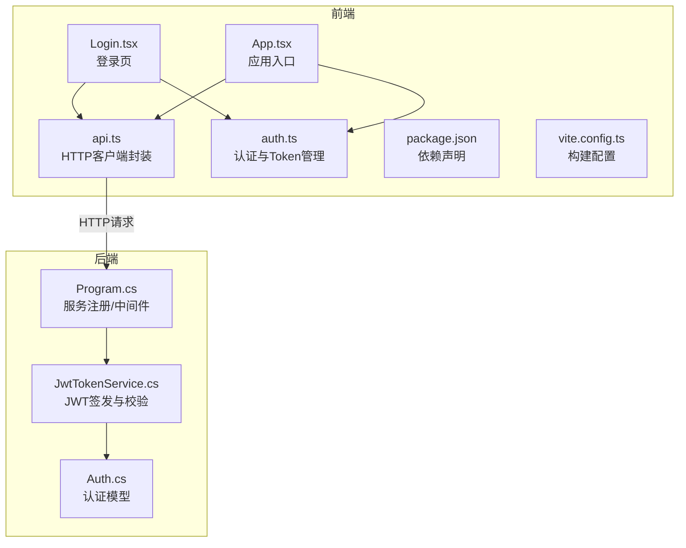
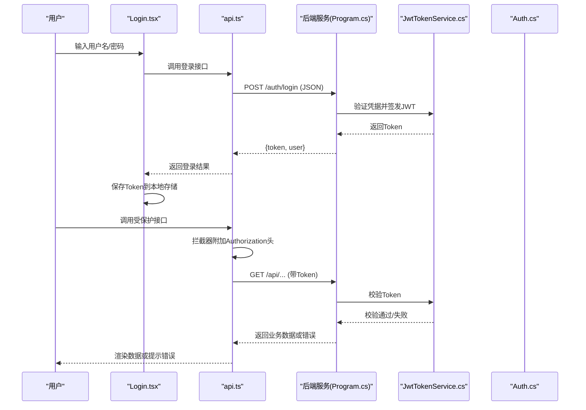
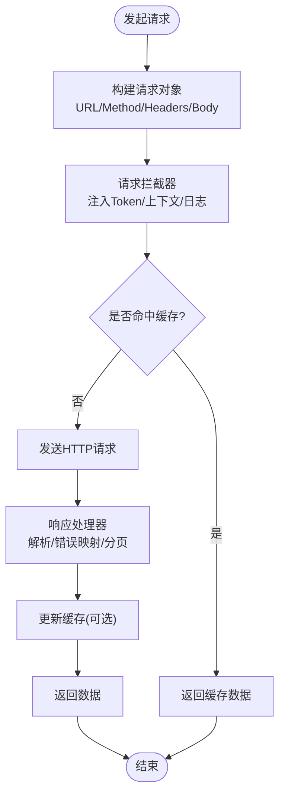
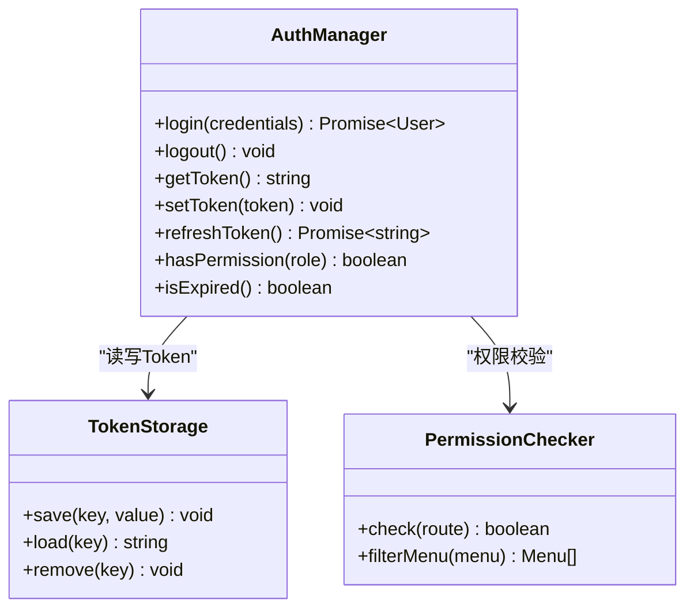
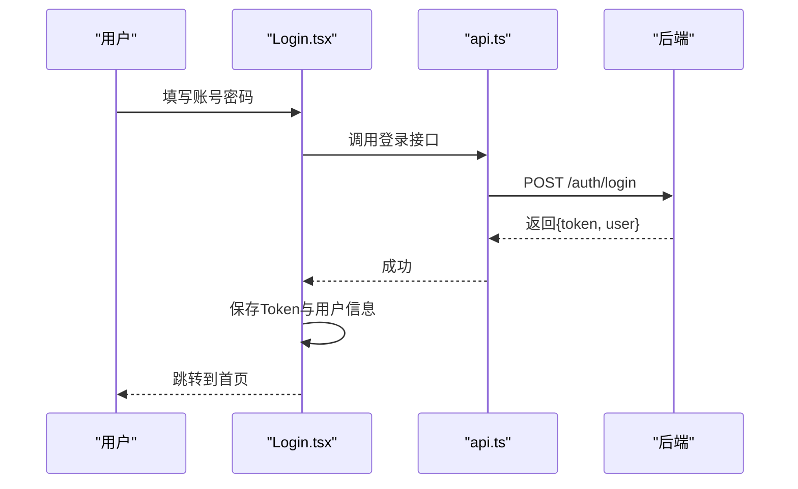
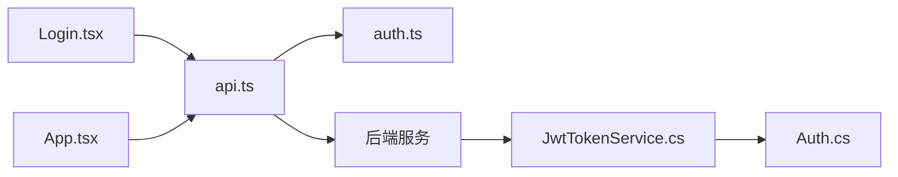

# API集成层

<cite>
**本文引用的文件**   
- [frontend-web/src/lib/api.ts](file://dip-system/frontend-web/src/lib/api.ts)
- [frontend-web/src/lib/auth.ts](file://dip-system/frontend-web/src/lib/auth.ts)
- [frontend-web/src/pages/Login.tsx](file://dip-system/frontend-web/src/pages/Login.tsx)
- [frontend-web/src/App.tsx](file://dip-system/frontend-web/src/App.tsx)
- [frontend-web/package.json](file://dip-system/frontend-web/package.json)
- [frontend-web/vite.config.ts](file://dip-system/frontend-web/vite.config.ts)
- [dip-system/Program.cs](file://dip-system/Program.cs)
- [dip-system/Services/JwtTokenService.cs](file://dip-system/Services/JwtTokenService.cs)
- [dip-system/Models/Auth.cs](file://dip-system/Models/Auth.cs)
</cite>

## 目录
1. [简介](#简介)
2. [项目结构](#项目结构)
3. [核心组件](#核心组件)
4. [架构总览](#架构总览)
5. [详细组件分析](#详细组件分析)
6. [依赖关系分析](#依赖关系分析)
7. [性能考量](#性能考量)
8. [故障排查指南](#故障排查指南)
9. [结论](#结论)
10. [附录](#附录)

## 简介
本章节面向DIP系统Web前端API集成层，聚焦HTTP客户端封装、请求拦截器、响应处理器、认证与权限、错误处理、重试与超时、数据转换、参数序列化、文件上传下载、缓存策略、请求去重与并发控制等主题。文档旨在帮助开发者快速理解并正确使用前端网络层，同时提供最佳实践、调试技巧与性能优化建议。

## 项目结构
前端位于dip-system/frontend-web目录，采用Vite + TypeScript构建，核心网络能力集中在lib/api.ts与lib/auth.ts中；页面通过Login.tsx完成登录流程，App.tsx进行全局路由与状态组织；后端JWT鉴权由Program.cs与JwtTokenService.cs实现，Auth模型定义在Models/Auth.cs。

**图表来源**
- [frontend-web/src/lib/api.ts](file://dip-system/frontend-web/src/lib/api.ts)
- [frontend-web/src/lib/auth.ts](file://dip-system/frontend-web/src/lib/auth.ts)
- [frontend-web/src/pages/Login.tsx](file://dip-system/frontend-web/src/pages/Login.tsx)
- [frontend-web/src/App.tsx](file://dip-system/frontend-web/src/App.tsx)
- [frontend-web/package.json](file://dip-system/frontend-web/package.json)
- [frontend-web/vite.config.ts](file://dip-system/frontend-web/vite.config.ts)
- [dip-system/Program.cs](file://dip-system/Program.cs)
- [dip-system/Services/JwtTokenService.cs](file://dip-system/Services/JwtTokenService.cs)
- [dip-system/Models/Auth.cs](file://dip-system/Models/Auth.cs)

**章节来源**
- [frontend-web/src/lib/api.ts](file://dip-system/frontend-web/src/lib/api.ts)
- [frontend-web/src/lib/auth.ts](file://dip-system/frontend-web/src/lib/auth.ts)
- [frontend-web/src/pages/Login.tsx](file://dip-system/frontend-web/src/pages/Login.tsx)
- [frontend-web/src/App.tsx](file://dip-system/frontend-web/src/App.tsx)
- [frontend-web/package.json](file://dip-system/frontend-web/package.json)
- [frontend-web/vite.config.ts](file://dip-system/frontend-web/vite.config.ts)
- [dip-system/Program.cs](file://dip-system/Program.cs)
- [dip-system/Services/JwtTokenService.cs](file://dip-system/Services/JwtTokenService.cs)
- [dip-system/Models/Auth.cs](file://dip-system/Models/Auth.cs)

## 核心组件
- HTTP客户端封装：统一封装fetch或axios调用，集中处理基础URL、默认头、序列化、反序列化、错误映射、重试与超时。
- 请求拦截器：注入认证令牌、租户/业务上下文、请求ID、日志埋点、幂等键等。
- 响应处理器：统一解析成功/失败、业务码映射、分页结果标准化、错误信息规范化。
- 认证与Token管理：登录获取Token、本地持久化、自动刷新、过期检测、权限判断。
- 错误处理策略：网络异常、HTTP状态码、业务错误码分类处理，支持用户提示与重试。
- 高级特性：缓存（内存/存储）、请求去重（相同请求合并）、并发控制（限流/队列）。

**章节来源**
- [frontend-web/src/lib/api.ts](file://dip-system/frontend-web/src/lib/api.ts)
- [frontend-web/src/lib/auth.ts](file://dip-system/frontend-web/src/lib/auth.ts)

## 架构总览
前端API集成层作为“网关”，向上为页面提供简洁的API方法，向下对接后端REST接口。认证流程由Login.tsx触发，成功后将Token写入本地存储并通过拦截器附加到后续请求。后端通过JwtTokenService校验Token并返回受保护资源。

**图表来源**
- [frontend-web/src/pages/Login.tsx](file://dip-system/frontend-web/src/pages/Login.tsx)
- [frontend-web/src/lib/api.ts](file://dip-system/frontend-web/src/lib/api.ts)
- [frontend-web/src/lib/auth.ts](file://dip-system/frontend-web/src/lib/auth.ts)
- [dip-system/Program.cs](file://dip-system/Program.cs)
- [dip-system/Services/JwtTokenService.cs](file://dip-system/Services/JwtTokenService.cs)
- [dip-system/Models/Auth.cs](file://dip-system/Models/Auth.cs)

## 详细组件分析

### HTTP客户端封装（api.ts）
- 职责：统一发起HTTP请求，设置基础URL、默认头、Content-Type、Accept、超时、重试次数、错误映射。
- 关键能力：
  - 请求拦截：注入Authorization、TraceId、业务上下文。
  - 响应处理：统一解析成功/失败、业务码、分页、错误消息。
  - 数据转换：请求体序列化（JSON/Form/Multipart），响应体反序列化为TS类型。
  - 文件上传下载：支持FormData、Blob、进度回调、取消请求。
  - 高级特性：缓存（按URL+参数生成键）、请求去重（Promise池）、并发控制（信号量/队列）。
- 典型用法：封装get/post/put/delete等方法，暴露给页面直接调用。

**图表来源**
- [frontend-web/src/lib/api.ts](file://dip-system/frontend-web/src/lib/api.ts)

**章节来源**
- [frontend-web/src/lib/api.ts](file://dip-system/frontend-web/src/lib/api.ts)

### 认证与Token管理（auth.ts）
- 职责：登录、登出、Token持久化、自动刷新、过期检测、权限判断。
- 关键点：
  - 登录：调用后端登录接口，成功后保存Token与用户信息。
  - 拦截器：每次请求前检查Token有效性，必要时刷新或跳转登录。
  - 权限：基于角色/权限列表控制菜单与按钮可见性。
  - 安全：敏感信息加密存储、避免XSS/CSRF风险。

**图表来源**
- [frontend-web/src/lib/auth.ts](file://dip-system/frontend-web/src/lib/auth.ts)

**章节来源**
- [frontend-web/src/lib/auth.ts](file://dip-system/frontend-web/src/lib/auth.ts)

### 登录流程（Login.tsx）
- 职责：收集表单、调用登录API、处理成功/失败、跳转首页。
- 关键点：错误提示、加载态、记住我、自动填充。

**图表来源**
- [frontend-web/src/pages/Login.tsx](file://dip-system/frontend-web/src/pages/Login.tsx)
- [frontend-web/src/lib/api.ts](file://dip-system/frontend-web/src/lib/api.ts)

**章节来源**
- [frontend-web/src/pages/Login.tsx](file://dip-system/frontend-web/src/pages/Login.tsx)
- [frontend-web/src/lib/api.ts](file://dip-system/frontend-web/src/lib/api.ts)

### 应用入口（App.tsx）
- 职责：全局路由、布局、错误边界、网络状态监听、全局Toast。
- 关键点：未登录重定向、权限守卫、全局错误捕获。

**章节来源**
- [frontend-web/src/App.tsx](file://dip-system/frontend-web/src/App.tsx)

### 构建与依赖（package.json, vite.config.ts）
- package.json：声明依赖（如axios/fetch polyfill、工具库）、脚本命令。
- vite.config.ts：代理配置、环境变量、构建优化。

**章节来源**
- [frontend-web/package.json](file://dip-system/frontend-web/package.json)
- [frontend-web/vite.config.ts](file://dip-system/frontend-web/vite.config.ts)

### 后端认证（Program.cs, JwtTokenService.cs, Auth.cs）
- Program.cs：注册JWT中间件、CORS、路由。
- JwtTokenService.cs：签发与校验Token、过期时间、签名密钥。
- Auth.cs：登录请求/响应模型、用户信息结构。

**章节来源**
- [dip-system/Program.cs](file://dip-system/Program.cs)
- [dip-system/Services/JwtTokenService.cs](file://dip-system/Services/JwtTokenService.cs)
- [dip-system/Models/Auth.cs](file://dip-system/Models/Auth.cs)

## 依赖关系分析
前端API层依赖认证模块与页面组件；后端依赖JWT服务与认证模型。整体耦合度低，职责清晰。

**图表来源**
- [frontend-web/src/pages/Login.tsx](file://dip-system/frontend-web/src/pages/Login.tsx)
- [frontend-web/src/App.tsx](file://dip-system/frontend-web/src/App.tsx)
- [frontend-web/src/lib/api.ts](file://dip-system/frontend-web/src/lib/api.ts)
- [frontend-web/src/lib/auth.ts](file://dip-system/frontend-web/src/lib/auth.ts)
- [dip-system/Program.cs](file://dip-system/Program.cs)
- [dip-system/Services/JwtTokenService.cs](file://dip-system/Services/JwtTokenService.cs)
- [dip-system/Models/Auth.cs](file://dip-system/Models/Auth.cs)

**章节来源**
- [frontend-web/src/lib/api.ts](file://dip-system/frontend-web/src/lib/api.ts)
- [frontend-web/src/lib/auth.ts](file://dip-system/frontend-web/src/lib/auth.ts)
- [frontend-web/src/pages/Login.tsx](file://dip-system/frontend-web/src/pages/Login.tsx)
- [frontend-web/src/App.tsx](file://dip-system/frontend-web/src/App.tsx)
- [dip-system/Program.cs](file://dip-system/Program.cs)
- [dip-system/Services/JwtTokenService.cs](file://dip-system/Services/JwtTokenService.cs)
- [dip-system/Models/Auth.cs](file://dip-system/Models/Auth.cs)

## 性能考量
- 缓存策略：对GET类接口启用内存缓存，按URL+参数生成唯一键，设置TTL与失效条件。
- 请求去重：同一时刻相同请求合并为一个Promise，减少重复网络开销。
- 并发控制：限制并发数，避免瞬时高峰导致服务端压力。
- 超时与重试：合理设置超时时间，对幂等接口启用指数退避重试。
- 数据压缩：启用Gzip/Brotli，减少传输体积。
- 懒加载：按需加载页面与组件，减少首屏体积。

[本节为通用指导，不直接分析具体文件]

## 故障排查指南
- 常见问题：
  - 401未授权：检查Token是否存在、是否过期、拦截器是否正确注入。
  - 403禁止访问：检查权限列表与路由守卫。
  - 500服务器错误：查看后端日志与错误码映射。
  - 网络错误：检查代理、跨域、证书、DNS。
- 调试技巧：
  - 使用浏览器Network面板抓包，查看请求头与响应体。
  - 在拦截器中添加日志打印，记录TraceId与耗时。
  - 使用Mock服务模拟后端异常场景。
- 恢复策略：
  - 自动重试（幂等接口）、降级返回、用户友好提示。

**章节来源**
- [frontend-web/src/lib/api.ts](file://dip-system/frontend-web/src/lib/api.ts)
- [frontend-web/src/lib/auth.ts](file://dip-system/frontend-web/src/lib/auth.ts)

## 结论
DIP系统Web前端API集成层通过统一的HTTP客户端封装、拦截器与响应处理器，实现了健壮的认证、权限、错误处理与高级特性。结合后端的JWT机制，形成完整的安全与性能保障体系。遵循本文的最佳实践与优化建议，可显著提升开发效率与用户体验。

[本节为总结性内容，不直接分析具体文件]

## 附录
- API调用最佳实践：
  - 明确区分GET/POST/PUT/DELETE语义，确保幂等性。
  - 使用统一的错误码与消息格式，便于前端处理。
  - 对敏感操作增加二次确认与防抖。
- 调试清单：
  - 检查环境变量与代理配置。
  - 验证Token生命周期与刷新逻辑。
  - 监控网络请求耗时与错误率。
- 性能优化清单：
  - 启用缓存与去重。
  - 合理设置超时与重试。
  - 使用CDN与资源压缩。

[本节为补充说明，不直接分析具体文件]