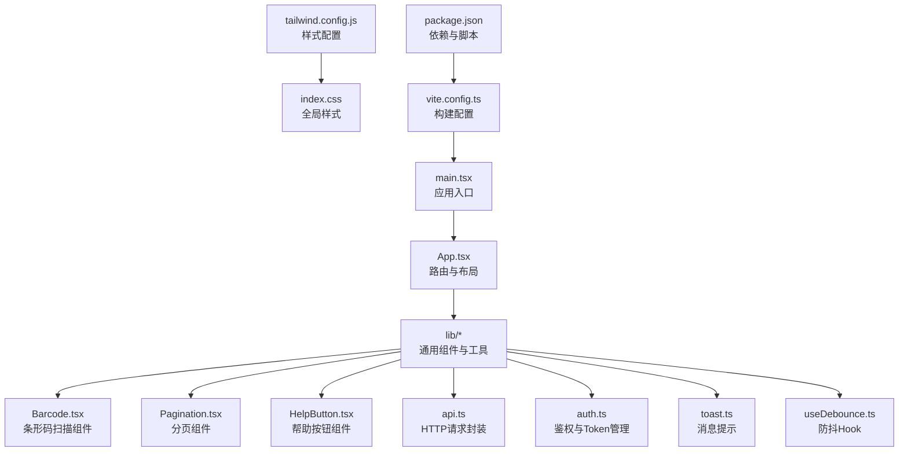
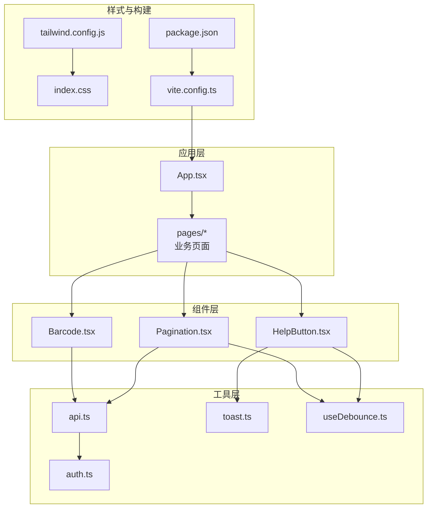
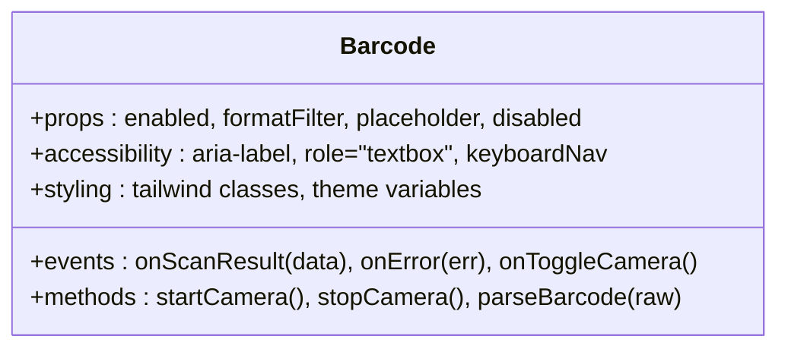
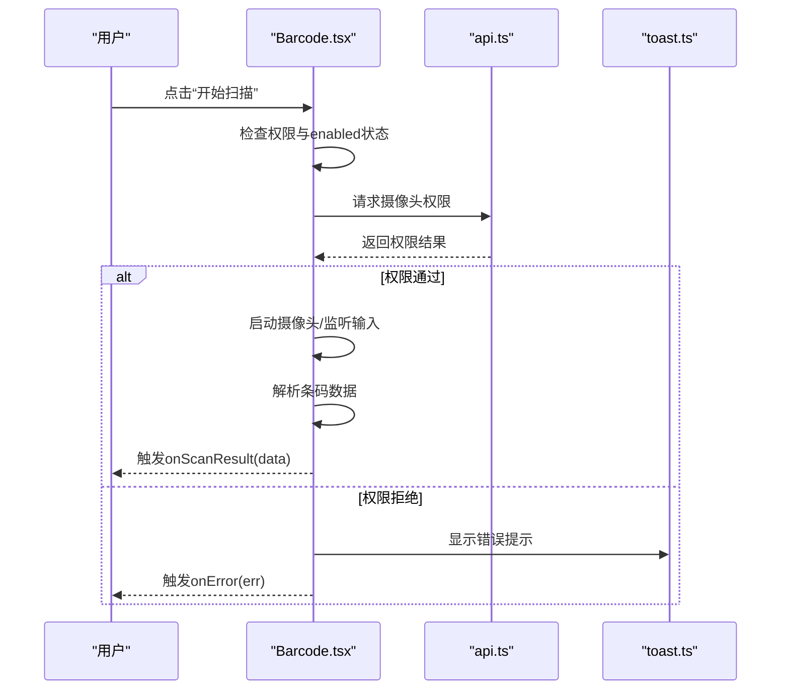
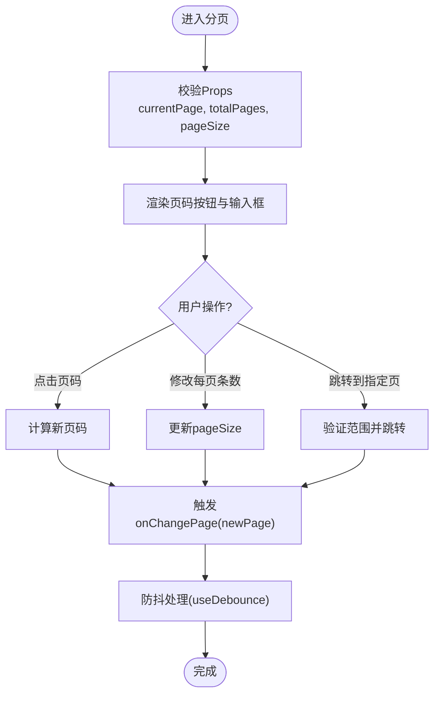
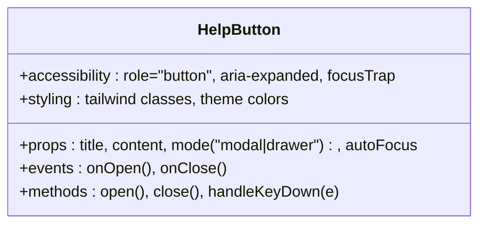
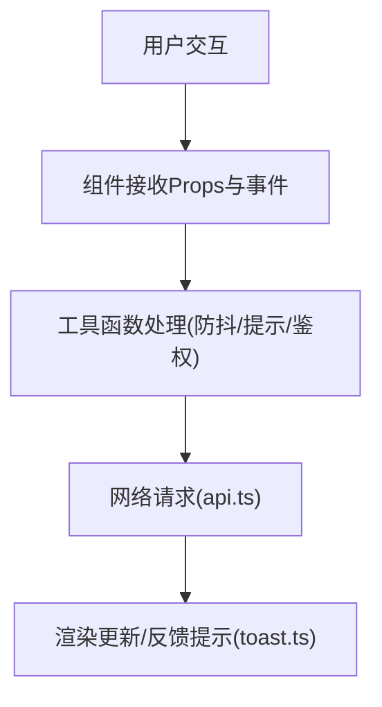
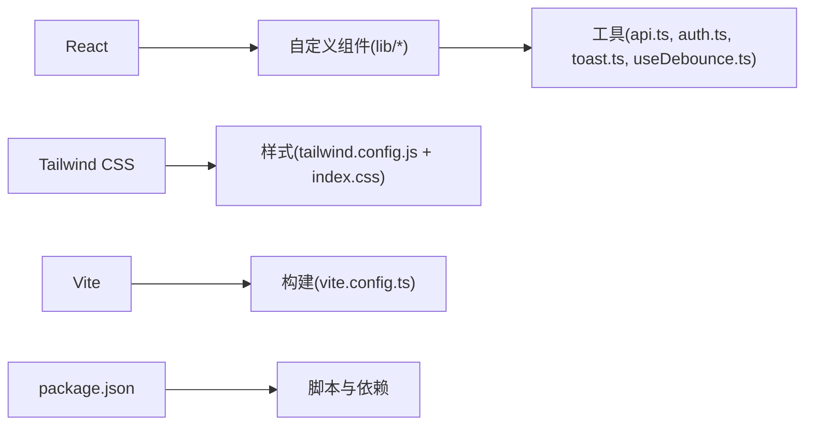

# UI组件库

<cite>
**本文引用的文件**   
- [Barcode.tsx](file://dip-system/frontend-web/src/lib/Barcode.tsx)
- [HelpButton.tsx](file://dip-system/frontend-web/src/lib/HelpButton.tsx)
- [Pagination.tsx](file://dip-system/frontend-web/src/lib/Pagination.tsx)
- [api.ts](file://dip-system/frontend-web/src/lib/api.ts)
- [auth.ts](file://dip-system/frontend-web/src/lib/auth.ts)
- [toast.ts](file://dip-system/frontend-web/src/lib/toast.ts)
- [useDebounce.ts](file://dip-system/frontend-web/src/lib/useDebounce.ts)
- [App.tsx](file://dip-system/frontend-web/src/App.tsx)
- [index.css](file://dip-system/frontend-web/src/index.css)
- [main.tsx](file://dip-system/frontend-web/src/main.tsx)
- [package.json](file://dip-system/frontend-web/package.json)
- [tailwind.config.js](file://dip-system/frontend-web/tailwind.config.js)
- [vite.config.ts](file://dip-system/frontend-web/vite.config.ts)
</cite>

## 目录
1. [简介](#简介)
2. [项目结构](#项目结构)
3. [核心组件](#核心组件)
4. [架构总览](#架构总览)
5. [详细组件分析](#详细组件分析)
6. [依赖分析](#依赖分析)
7. [性能考虑](#性能考虑)
8. [故障排查指南](#故障排查指南)
9. [结论](#结论)
10. [附录](#附录)

## 简介
本文件为DIP系统Web前端UI组件库的全面文档，聚焦于自定义组件的设计理念与实现方式，涵盖条形码扫描组件、分页组件、帮助按钮等核心能力。文档从Props接口定义、事件处理机制、样式定制选项入手，说明使用示例、组合模式与插槽用法，并解释响应式设计、主题适配与无障碍访问支持。同时提供性能优化建议、测试策略与版本兼容性说明，以及组件开发规范与扩展指南，帮助开发者快速上手与持续演进。

## 项目结构
前端采用Vite + React + TypeScript技术栈，样式基于Tailwind CSS，组件集中在lib目录中，页面在pages目录中，应用入口在main.tsx，路由与布局由App.tsx组织。

**图表来源** 
- [main.tsx:1-50](file://dip-system/frontend-web/src/main.tsx#L1-L50)
- [App.tsx:1-120](file://dip-system/frontend-web/src/App.tsx#L1-L120)
- [Barcode.tsx:1-200](file://dip-system/frontend-web/src/lib/Barcode.tsx#L1-L200)
- [Pagination.tsx:1-200](file://dip-system/frontend-web/src/lib/Pagination.tsx#L1-L200)
- [HelpButton.tsx:1-150](file://dip-system/frontend-web/src/lib/HelpButton.tsx#L1-L150)
- [api.ts:1-150](file://dip-system/frontend-web/src/lib/api.ts#L1-L150)
- [auth.ts:1-120](file://dip-system/frontend-web/src/lib/auth.ts#L1-L120)
- [toast.ts:1-100](file://dip-system/frontend-web/src/lib/toast.ts#L1-L100)
- [useDebounce.ts:1-80](file://dip-system/frontend-web/src/lib/useDebounce.ts#L1-L80)
- [tailwind.config.js:1-120](file://dip-system/frontend-web/tailwind.config.js#L1-L120)
- [index.css:1-120](file://dip-system/frontend-web/src/index.css#L1-L120)
- [vite.config.ts:1-120](file://dip-system/frontend-web/vite.config.ts#L1-L120)
- [package.json:1-120](file://dip-system/frontend-web/package.json#L1-L120)

**章节来源**
- [main.tsx:1-50](file://dip-system/frontend-web/src/main.tsx#L1-L50)
- [App.tsx:1-120](file://dip-system/frontend-web/src/App.tsx#L1-L120)
- [package.json:1-120](file://dip-system/frontend-web/package.json#L1-L120)
- [tailwind.config.js:1-120](file://dip-system/frontend-web/tailwind.config.js#L1-L120)
- [vite.config.ts:1-120](file://dip-system/frontend-web/vite.config.ts#L1-L120)

## 核心组件
本节概述三个核心自定义组件：条形码扫描组件、分页组件、帮助按钮组件。每个组件均遵循统一的Props接口设计、事件回调约定与可访问性规范，并通过Tailwind进行样式定制。

- 条形码扫描组件（Barcode）
  - 职责：调用设备摄像头或扫码枪输入，解析条码数据，触发结果回调。
  - Props要点：是否启用摄像头、扫码格式过滤、结果回调、错误回调、占位文案、禁用状态等。
  - 事件：onScanResult、onError、onToggleCamera等。
  - 样式：通过Tailwind类名覆盖容器、按钮、遮罩层样式；支持暗色主题变量。
  - 可访问性：ARIA标签、键盘导航、屏幕阅读器提示。
  - 性能：按需加载摄像头权限、防抖输入、错误重试上限。

- 分页组件（Pagination）
  - 职责：展示页码、跳转、每页条数选择，驱动列表数据刷新。
  - Props要点：当前页、总页数、每页条数、是否显示跳转、是否显示每页条数选择器、禁用状态等。
  - 事件：onChangePage、onChangePageSize。
  - 样式：分页按钮、激活态、禁用态、移动端自适应布局。
  - 可访问性：aria-label、tabIndex、焦点管理。
  - 性能：虚拟滚动配合（可选）、懒加载下一页数据。

- 帮助按钮组件（HelpButton）
  - 职责：提供上下文帮助入口，支持弹窗或侧边栏展示帮助内容。
  - Props要点：帮助标题、帮助内容、打开方式（弹窗/抽屉）、关闭回调、是否自动聚焦等。
  - 事件：onOpen、onClose。
  - 样式：图标、悬浮提示、主题色适配。
  - 可访问性：role="button"、aria-expanded、Esc关闭、焦点陷阱（弹窗）。
  - 性能：延迟渲染帮助内容、按需加载远程帮助资源。

**章节来源**
- [Barcode.tsx:1-200](file://dip-system/frontend-web/src/lib/Barcode.tsx#L1-L200)
- [Pagination.tsx:1-200](file://dip-system/frontend-web/src/lib/Pagination.tsx#L1-L200)
- [HelpButton.tsx:1-150](file://dip-system/frontend-web/src/lib/HelpButton.tsx#L1-L150)

## 架构总览
组件库整体采用“轻量组件 + 工具函数”的架构，组件之间低耦合，通过事件与Props通信；网络请求、鉴权、提示等横切关注点通过工具模块统一封装，便于复用与维护。

**图表来源** 
- [App.tsx:1-120](file://dip-system/frontend-web/src/App.tsx#L1-L120)
- [Barcode.tsx:1-200](file://dip-system/frontend-web/src/lib/Barcode.tsx#L1-L200)
- [Pagination.tsx:1-200](file://dip-system/frontend-web/src/lib/Pagination.tsx#L1-L200)
- [HelpButton.tsx:1-150](file://dip-system/frontend-web/src/lib/HelpButton.tsx#L1-L150)
- [api.ts:1-150](file://dip-system/frontend-web/src/lib/api.ts#L1-L150)
- [auth.ts:1-120](file://dip-system/frontend-web/src/lib/auth.ts#L1-L120)
- [toast.ts:1-100](file://dip-system/frontend-web/src/lib/toast.ts#L1-L100)
- [useDebounce.ts:1-80](file://dip-system/frontend-web/src/lib/useDebounce.ts#L1-L80)
- [tailwind.config.js:1-120](file://dip-system/frontend-web/tailwind.config.js#L1-L120)
- [index.css:1-120](file://dip-system/frontend-web/src/index.css#L1-L120)
- [vite.config.ts:1-120](file://dip-system/frontend-web/vite.config.ts#L1-L120)
- [package.json:1-120](file://dip-system/frontend-web/package.json#L1-L120)

## 详细组件分析

### 条形码扫描组件（Barcode）
该组件负责采集条码数据，支持摄像头扫描与外部输入，具备错误处理与可访问性保障。

**图表来源** 
- [Barcode.tsx:1-200](file://dip-system/frontend-web/src/lib/Barcode.tsx#L1-L200)

**图表来源** 
- [Barcode.tsx:1-200](file://dip-system/frontend-web/src/lib/Barcode.tsx#L1-L200)
- [api.ts:1-150](file://dip-system/frontend-web/src/lib/api.ts#L1-L150)
- [toast.ts:1-100](file://dip-system/frontend-web/src/lib/toast.ts#L1-L100)

**章节来源**
- [Barcode.tsx:1-200](file://dip-system/frontend-web/src/lib/Barcode.tsx#L1-L200)
- [api.ts:1-150](file://dip-system/frontend-web/src/lib/api.ts#L1-L150)
- [toast.ts:1-100](file://dip-system/frontend-web/src/lib/toast.ts#L1-L100)

### 分页组件（Pagination）
分页组件提供页码切换、每页条数选择与跳转功能，结合防抖减少频繁请求。

**图表来源** 
- [Pagination.tsx:1-200](file://dip-system/frontend-web/src/lib/Pagination.tsx#L1-L200)
- [useDebounce.ts:1-80](file://dip-system/frontend-web/src/lib/useDebounce.ts#L1-L80)

**章节来源**
- [Pagination.tsx:1-200](file://dip-system/frontend-web/src/lib/Pagination.tsx#L1-L200)
- [useDebounce.ts:1-80](file://dip-system/frontend-web/src/lib/useDebounce.ts#L1-L80)

### 帮助按钮组件（HelpButton）
帮助按钮用于展示上下文帮助信息，支持弹窗或抽屉形式，具备焦点管理与键盘交互。

**图表来源** 
- [HelpButton.tsx:1-150](file://dip-system/frontend-web/src/lib/HelpButton.tsx#L1-L150)

**章节来源**
- [HelpButton.tsx:1-150](file://dip-system/frontend-web/src/lib/HelpButton.tsx#L1-L150)

### 概念总览
以下为组件库的概念性工作流图，展示从用户交互到数据处理的典型流程，不直接映射具体代码文件。

[本图为概念性流程图，无需图表来源]

## 依赖分析
组件库依赖React生态与Tailwind样式体系，构建由Vite驱动，包管理通过npm/yarn。

**图表来源** 
- [package.json:1-120](file://dip-system/frontend-web/package.json#L1-L120)
- [tailwind.config.js:1-120](file://dip-system/frontend-web/tailwind.config.js#L1-L120)
- [index.css:1-120](file://dip-system/frontend-web/src/index.css#L1-L120)
- [vite.config.ts:1-120](file://dip-system/frontend-web/vite.config.ts#L1-L120)
- [api.ts:1-150](file://dip-system/frontend-web/src/lib/api.ts#L1-L150)
- [auth.ts:1-120](file://dip-system/frontend-web/src/lib/auth.ts#L1-L120)
- [toast.ts:1-100](file://dip-system/frontend-web/src/lib/toast.ts#L1-L100)
- [useDebounce.ts:1-80](file://dip-system/frontend-web/src/lib/useDebounce.ts#L1-L80)

**章节来源**
- [package.json:1-120](file://dip-system/frontend-web/package.json#L1-L120)
- [tailwind.config.js:1-120](file://dip-system/frontend-web/tailwind.config.js#L1-L120)
- [vite.config.ts:1-120](file://dip-system/frontend-web/vite.config.ts#L1-L120)

## 性能考虑
- 条形码扫描组件：限制摄像头权限请求频率，失败重试上限，解析逻辑避免阻塞主线程。
- 分页组件：使用防抖减少onChange事件触发频率，结合虚拟滚动提升大数据量渲染性能。
- 帮助按钮组件：延迟渲染帮助内容，按需加载远程资源，避免首屏负担。
- 通用优化：组件拆分与懒加载、Tree Shaking、CSS按需生成、图片与字体资源压缩。

[本节为通用指导，无需章节来源]

## 故障排查指南
- 条形码扫描无响应
  - 检查浏览器摄像头权限与HTTPS环境。
  - 确认组件enabled状态与输入格式过滤配置。
  - 查看错误回调onError输出与控制台日志。
- 分页无效或闪烁
  - 校验currentPage与totalPages边界值。
  - 检查onChangePage与onChangePageSize是否正确绑定。
  - 确认防抖时间设置合理，避免过度节流。
- 帮助按钮无法关闭或焦点丢失
  - 检查键盘事件处理与Esc键绑定。
  - 确认弹窗/抽屉的焦点陷阱实现正确。
  - 验证autoFocus与tabIndex设置。

**章节来源**
- [Barcode.tsx:1-200](file://dip-system/frontend-web/src/lib/Barcode.tsx#L1-L200)
- [Pagination.tsx:1-200](file://dip-system/frontend-web/src/lib/Pagination.tsx#L1-L200)
- [HelpButton.tsx:1-150](file://dip-system/frontend-web/src/lib/HelpButton.tsx#L1-L150)

## 结论
本UI组件库以简洁、可复用、可访问为核心设计理念，围绕条形码扫描、分页、帮助按钮等高频场景提供稳定实现。通过统一的Props与事件约定、Tailwind样式定制与工具函数支撑，组件易于集成与扩展。建议在后续迭代中继续完善单元测试与端到端测试，强化主题系统与国际化支持，提升整体用户体验与可维护性。

[本节为总结，无需章节来源]

## 附录
- 使用示例与组合模式
  - 在页面中引入组件，通过Props传递数据与行为，使用事件回调处理用户交互。
  - 组合多个组件形成复杂界面，如“条形码输入 + 分页列表 + 帮助按钮”。
- 插槽用法
  - 对于需要灵活内容的组件（如帮助按钮），可通过插槽注入自定义内容。
- 响应式设计与主题适配
  - 使用Tailwind断点实现移动端适配，通过CSS变量支持暗色主题。
- 无障碍访问支持
  - 确保ARIA标签、键盘导航、屏幕阅读器兼容。
- 测试策略
  - 单元测试：组件渲染、事件触发、边界条件。
  - 集成测试：与api.ts、auth.ts、toast.ts协作流程。
  - 端到端测试：用户操作流程与关键路径。
- 版本兼容性
  - 明确React、Tailwind、Vite版本要求，记录破坏性变更。
- 开发规范与扩展指南
  - 命名约定、文件组织、Props接口定义、事件命名、错误处理、可访问性检查。
  - 新增组件应遵循现有模式，补充文档与测试用例。

[本节为通用指导，无需章节来源]