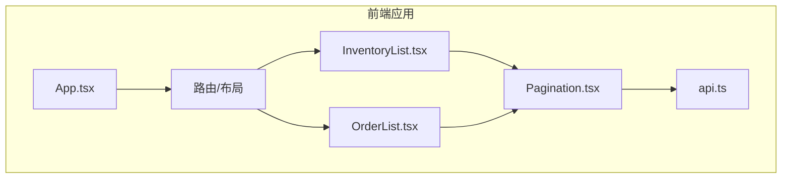
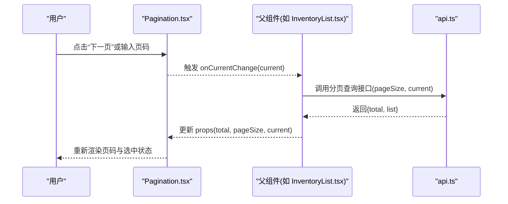
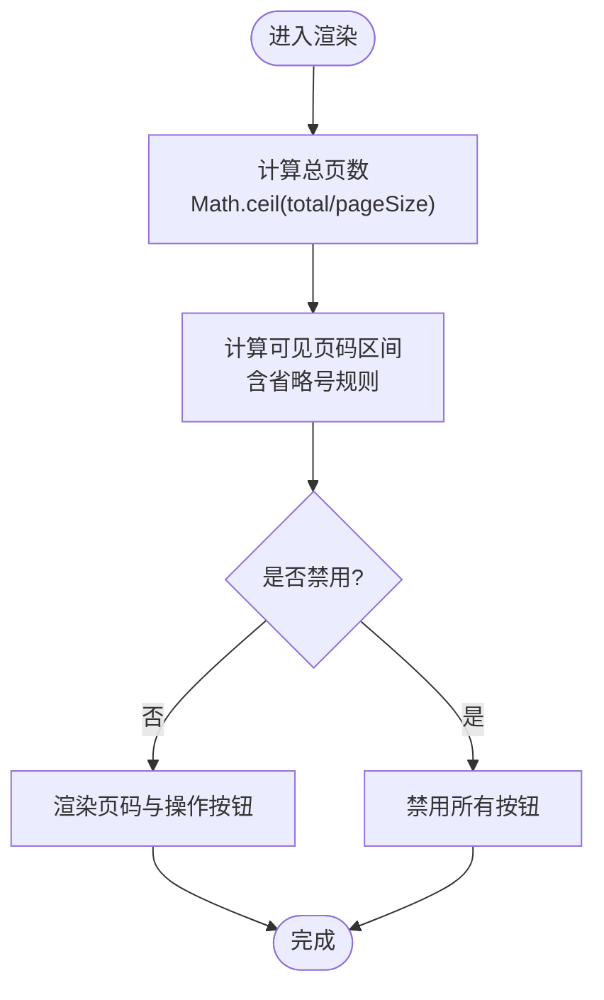
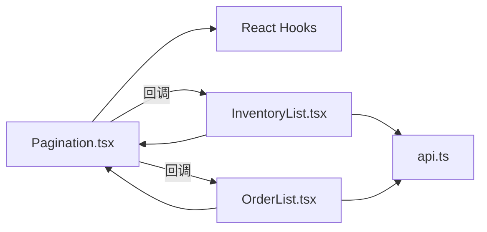

# 分页组件

<cite>
**本文引用的文件**   
- [Pagination.tsx](file://dip-system/frontend-web/src/lib/Pagination.tsx)
- [InventoryList.tsx](file://dip-system/frontend-web/src/pages/InventoryList.tsx)
- [OrderList.tsx](file://dip-system/frontend-web/src/pages/OrderList.tsx)
- [api.ts](file://dip-system/frontend-web/src/lib/api.ts)
</cite>

## 目录
1. [简介](#简介)
2. [项目结构](#项目结构)
3. [核心组件](#核心组件)
4. [架构总览](#架构总览)
5. [详细组件分析](#详细组件分析)
6. [依赖分析](#依赖分析)
7. [性能考虑](#性能考虑)
8. [故障排查指南](#故障排查指南)
9. [结论](#结论)
10. [附录](#附录)

## 简介
本文件为 DIP 系统前端分页组件的全面技术文档。内容涵盖设计理念、实现架构、数据分页逻辑、页码计算与跳转机制、Props 接口定义、事件处理、样式定制与响应式布局，以及性能优化策略（如虚拟滚动、懒加载）的应用建议。该组件用于在表格等列表场景中高效展示大量数据，并提供友好的交互体验。

## 项目结构
DIP 系统的前端位于 dip-system/frontend-web 目录中，分页组件作为通用 UI 能力被多个页面复用。关键文件包括：
- 分页组件实现：src/lib/Pagination.tsx
- 使用示例页面：src/pages/InventoryList.tsx、src/pages/OrderList.tsx
- API 调用封装：src/lib/api.ts

图表来源
- [Pagination.tsx](file://dip-system/frontend-web/src/lib/Pagination.tsx)
- [InventoryList.tsx](file://dip-system/frontend-web/src/pages/InventoryList.tsx)
- [OrderList.tsx](file://dip-system/frontend-web/src/pages/OrderList.tsx)
- [api.ts](file://dip-system/frontend-web/src/lib/api.ts)

章节来源
- [Pagination.tsx](file://dip-system/frontend-web/src/lib/Pagination.tsx)
- [InventoryList.tsx](file://dip-system/frontend-web/src/pages/InventoryList.tsx)
- [OrderList.tsx](file://dip-system/frontend-web/src/pages/OrderList.tsx)
- [api.ts](file://dip-system/frontend-web/src/lib/api.ts)

## 核心组件
- 组件名称：Pagination
- 职责：提供页码显示、上一页/下一页、页码跳转、每页条数选择、当前页高亮、禁用状态控制等；触发回调以驱动上层数据刷新。
- 设计要点：
  - 纯展示型组件，通过 Props 接收数据与行为，避免内部状态耦合业务。
  - 支持响应式布局，在小屏设备上自动隐藏部分页码或简化操作。
  - 可访问性：键盘导航、焦点管理、ARIA 标签完善。
  - 可扩展：预留插槽或自定义渲染函数，便于主题化与二次开发。

章节来源
- [Pagination.tsx](file://dip-system/frontend-web/src/lib/Pagination.tsx)

## 架构总览
分页组件采用“受控组件 + 回调”模式：
- 父组件维护 total、pageSize、current 等状态，并传入 Pagination。
- Pagination 不直接请求数据，而是通过 onChange、onPageSizeChange、onJump 等回调通知父组件。
- 父组件根据回调更新状态并调用 api.ts 中的接口获取新数据，再回传给 Pagination。

图表来源
- [Pagination.tsx](file://dip-system/frontend-web/src/lib/Pagination.tsx)
- [InventoryList.tsx](file://dip-system/frontend-web/src/pages/InventoryList.tsx)
- [api.ts](file://dip-system/frontend-web/src/lib/api.ts)

## 详细组件分析

### 组件 Props 接口
- total: number — 总记录数
- pageSize: number — 每页显示数量
- current: number — 当前页码（从 1 开始）
- showSizeChanger: boolean — 是否显示每页条数切换
- showQuickJumper: boolean — 是否显示快速跳转
- showTotal: boolean | (total: number) => string — 是否显示总数文案或自定义格式化
- disabled: boolean — 禁用整个分页控件
- hideOnSinglePage: boolean — 单页时是否隐藏分页
- onChange: (current: number) => void — 页码变化回调
- onPageSizeChange: (pageSize: number) => void — 每页条数变化回调
- onJump: (page: number) => void — 跳转到指定页回调
- className?: string — 自定义类名
- style?: object — 内联样式
- locale?: object — 本地化文案配置（如“共 {total} 条”、“跳至”等）

说明：
- 所有数值参数需进行边界校验（如 current > 0、pageSize > 0）。
- 当 total=0 或 pageSize<=0 时，应禁用分页或给出空态提示。
- 建议在父组件中对 pageSize 的可选值做白名单限制（如 [10, 20, 50]）。

章节来源
- [Pagination.tsx](file://dip-system/frontend-web/src/lib/Pagination.tsx)

### 页码计算与显示逻辑
- 总页数 = Math.ceil(total / pageSize)
- 可见页码范围：
  - 默认显示前后若干页码，超出范围时使用省略号。
  - 小屏设备下减少可见页码数量，提升可读性。
- 当前页高亮：current 对应的按钮处于激活态。
- 首尾页快捷按钮：首页、末页始终可用（除非 disabled）。
- 禁用条件：disabled 为真、total <= pageSize 且 hideOnSinglePage 为真。

图表来源
- [Pagination.tsx](file://dip-system/frontend-web/src/lib/Pagination.tsx)

章节来源
- [Pagination.tsx](file://dip-system/frontend-web/src/lib/Pagination.tsx)

### 事件处理机制
- 页码切换：
  - 点击页码按钮触发 onChange(current)。
  - 上一页/下一页分别对 current 进行 ±1 校验后触发。
- 快速跳转：
  - 输入框回车或失焦触发 onJump(page)，需校验 page 合法性。
- 每页条数改变：
  - 选择器变更触发 onPageSizeChange(newPageSize)，通常同时重置 current 到 1。
- 组合事件：
  - 某些场景下需要同时上报 current 与 pageSize，可在父组件合并处理。

章节来源
- [Pagination.tsx](file://dip-system/frontend-web/src/lib/Pagination.tsx)

### 与表格数据结合的使用示例
- 典型流程：
  - 父组件维护 state: { total, pageSize, current, data }。
  - 首次加载调用 api.ts 的分页接口，设置初始 state。
  - 监听 Pagination 的 onChange/onPageSizeChange/onJump，更新 state 并再次请求数据。
  - 将 data 渲染到表格，total/pageSize/current 绑定到 Pagination。
- 参考页面：
  - InventoryList.tsx：库存列表分页集成
  - OrderList.tsx：订单列表分页集成

章节来源
- [InventoryList.tsx](file://dip-system/frontend-web/src/pages/InventoryList.tsx)
- [OrderList.tsx](file://dip-system/frontend-web/src/pages/OrderList.tsx)
- [api.ts](file://dip-system/frontend-web/src/lib/api.ts)

### 样式定制与响应式布局
- 样式定制：
  - 通过 className/style 注入外层容器样式。
  - 建议暴露主题变量（颜色、字号、间距），便于统一风格。
  - 支持覆盖默认按钮样式（如激活态、禁用态、悬停态）。
- 响应式布局：
  - 小屏设备隐藏部分页码，保留“首页/末页/上一页/下一页”。
  - 调整字号与间距，确保触摸友好。
  - 文本本地化（locale）适配多语言。

章节来源
- [Pagination.tsx](file://dip-system/frontend-web/src/lib/Pagination.tsx)

## 依赖分析
- 组件内无外部复杂依赖，主要依赖 React 基础能力（useState/useEffect 等）。
- 与页面组件的关系：
  - InventoryList.tsx、OrderList.tsx 作为消费者，负责数据获取与状态管理。
- 与 API 层的关系：
  - api.ts 提供统一的 HTTP 请求封装，分页组件不直接发起网络请求。

图表来源
- [Pagination.tsx](file://dip-system/frontend-web/src/lib/Pagination.tsx)
- [InventoryList.tsx](file://dip-system/frontend-web/src/pages/InventoryList.tsx)
- [OrderList.tsx](file://dip-system/frontend-web/src/pages/OrderList.tsx)
- [api.ts](file://dip-system/frontend-web/src/lib/api.ts)

章节来源
- [Pagination.tsx](file://dip-system/frontend-web/src/lib/Pagination.tsx)
- [InventoryList.tsx](file://dip-system/frontend-web/src/pages/InventoryList.tsx)
- [OrderList.tsx](file://dip-system/frontend-web/src/pages/OrderList.tsx)
- [api.ts](file://dip-system/frontend-web/src/lib/api.ts)

## 性能考虑
- 渲染优化：
  - 仅当 total/pageSize/current 变化时重渲染，避免不必要的更新。
  - 对频繁触发的 onInput/onKeyDown 做防抖/节流（如跳转输入）。
- 大数据量列表：
  - 配合虚拟滚动（只渲染可视区域行）以减少 DOM 节点数量。
  - 服务端分页优先，避免一次性拉取全量数据。
- 网络优化：
  - 请求去重与缓存（相同参数短时间内复用结果）。
  - 错误重试与超时控制。
- 内存与 GC：
  - 及时解绑事件监听与定时器。
  - 大数组切片渲染时注意引用稳定性。

[本节为通用指导，无需特定文件来源]

## 故障排查指南
- 常见问题：
  - 页码异常：检查 total/pageSize/current 的边界值与类型。
  - 跳转无效：确认输入页码是否在 1..总页数范围内。
  - 样式错乱：检查 className/style 冲突与主题变量覆盖。
  - 响应式异常：验证媒体查询断点与文本换行。
- 调试建议：
  - 在 onChange/onPageSizeChange/onJump 中打印入参与返回值。
  - 使用浏览器开发者工具观察网络请求与状态变化。
  - 对关键计算（总页数、可见页码区间）增加单元测试。

章节来源
- [Pagination.tsx](file://dip-system/frontend-web/src/lib/Pagination.tsx)

## 结论
Pagination 组件以受控模式为核心，通过清晰的 Props 与回调契约，与页面组件解耦，具备良好的可测试性与可维护性。结合响应式设计与样式定制，可满足多端一致的用户体验。在生产环境中，建议配合虚拟滚动与服务端分页，进一步提升大数据量下的性能表现。

[本节为总结，无需特定文件来源]

## 附录
- 最佳实践清单：
  - 始终对 pageSize 做白名单校验。
  - 在单页场景下按需隐藏分页。
  - 为键盘用户提供完整导航路径。
  - 对跳转输入做即时校验与反馈。
  - 保持 API 响应结构与分页字段约定一致。

[本节为补充信息，无需特定文件来源]