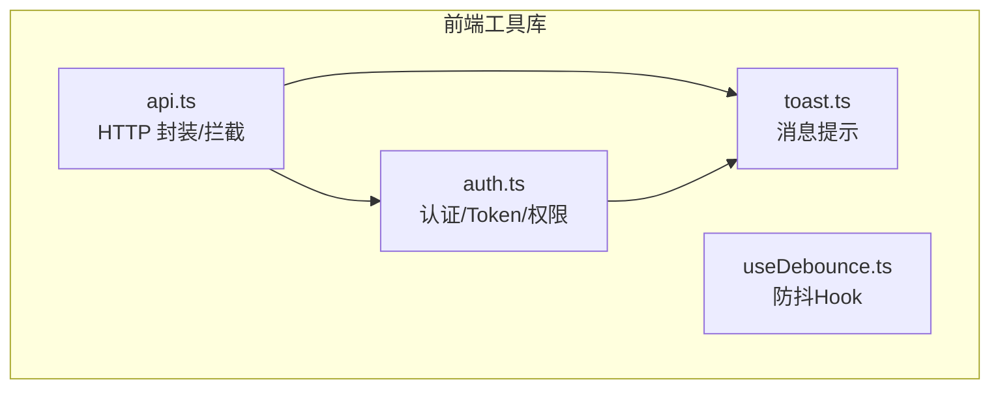
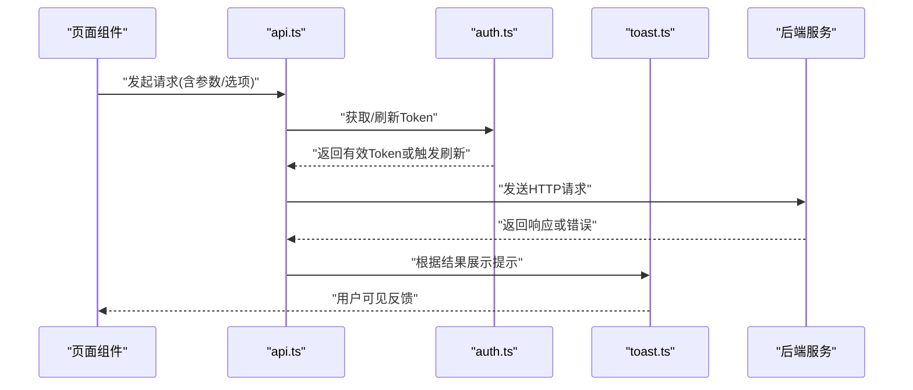
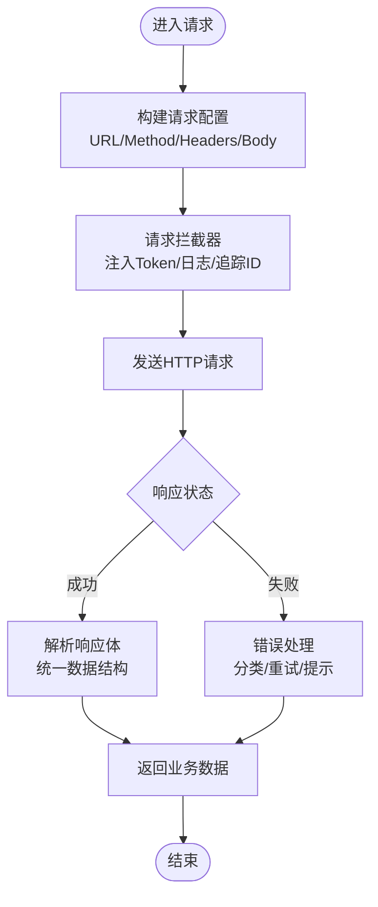
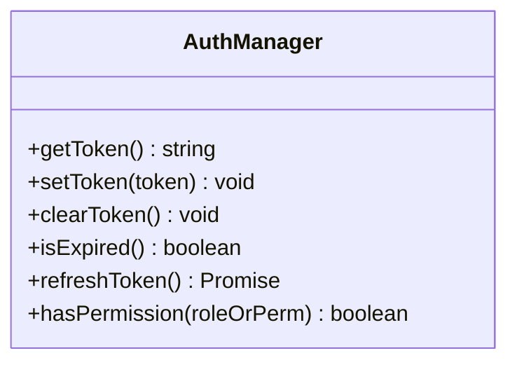
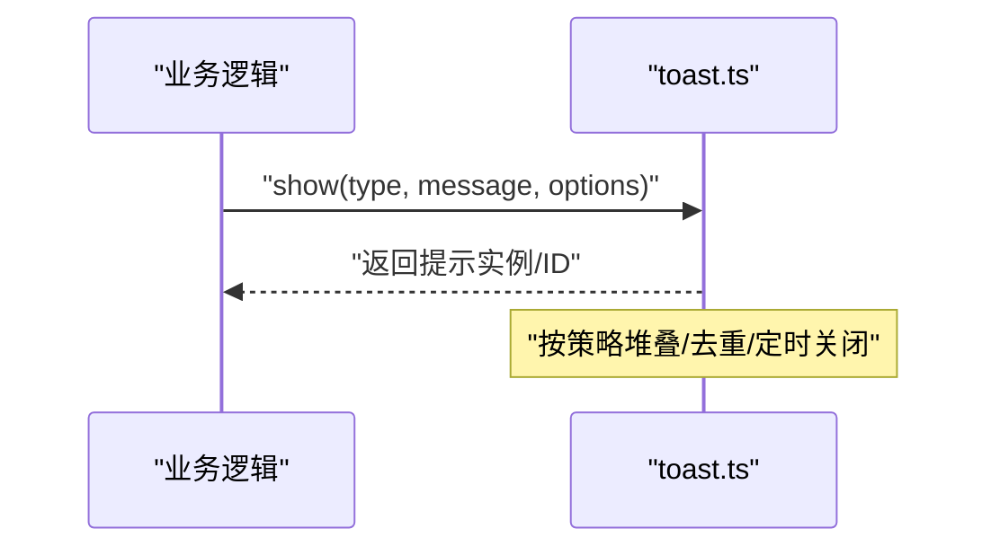
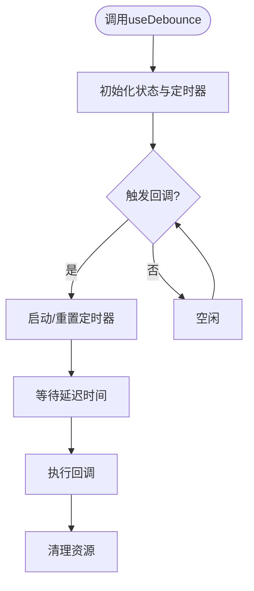
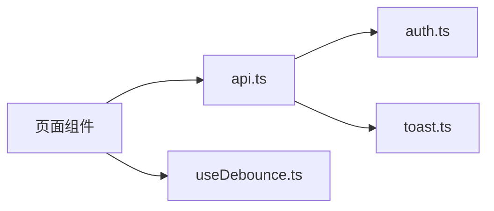

# 工具函数库

<cite>
**本文引用的文件**   
- [api.ts](file://dip-system/frontend-web/src/lib/api.ts)
- [auth.ts](file://dip-system/frontend-web/src/lib/auth.ts)
- [toast.ts](file://dip-system/frontend-web/src/lib/toast.ts)
- [useDebounce.ts](file://dip-system/frontend-web/src/lib/useDebounce.ts)
- [package.json](file://dip-system/frontend-web/package.json)
</cite>

## 目录
1. [简介](#简介)
2. [项目结构](#项目结构)
3. [核心组件](#核心组件)
4. [架构总览](#架构总览)
5. [详细组件分析](#详细组件分析)
6. [依赖分析](#依赖分析)
7. [性能考虑](#性能考虑)
8. [故障排查指南](#故障排查指南)
9. [结论](#结论)
10. [附录](#附录)

## 简介
本文件面向 DIP 系统前端（Web）工具函数库，聚焦以下能力：
- API 请求封装：统一的请求拦截、响应处理与错误统一处理机制。
- 认证管理：Token 存储、自动刷新与权限校验。
- 消息提示：成功、警告、错误等类型提示的配置与使用。
- 防抖 Hook：实现原理、适用场景与最佳实践。
- 扩展指南与版本兼容性说明。

目标读者包括前端开发者、集成方与维护者，文档力求在保持技术深度的同时，对非专业读者友好。

## 项目结构
DIP 前端位于 dip-system/frontend-web/src/lib，包含四个核心工具模块：
- api.ts：HTTP 请求封装与拦截器。
- auth.ts：认证状态、Token 存取与刷新策略。
- toast.ts：全局消息提示服务。
- useDebounce.ts：React Hook 防抖实现。

图表来源
- [api.ts](file://dip-system/frontend-web/src/lib/api.ts)
- [auth.ts](file://dip-system/frontend-web/src/lib/auth.ts)
- [toast.ts](file://dip-system/frontend-web/src/lib/toast.ts)
- [useDebounce.ts](file://dip-system/frontend-web/src/lib/useDebounce.ts)

章节来源
- [api.ts](file://dip-system/frontend-web/src/lib/api.ts)
- [auth.ts](file://dip-system/frontend-web/src/lib/auth.ts)
- [toast.ts](file://dip-system/frontend-web/src/lib/toast.ts)
- [useDebounce.ts](file://dip-system/frontend-web/src/lib/useDebounce.ts)

## 核心组件
- API 请求封装（api.ts）
  - 提供统一的请求方法（如 GET/POST/PUT/DELETE），内置请求头注入、超时控制、重试策略、错误码映射与统一异常抛出。
  - 支持请求/响应拦截器，用于日志、鉴权、缓存或数据标准化。
- 认证管理（auth.ts）
  - Token 的获取、设置、清除与过期检测；支持自动刷新流程与权限判断。
  - 暴露登录态查询、角色/权限检查等能力。
- 消息提示（toast.ts）
  - 提供 success/warning/error/info 等类型提示，支持自定义时长、位置与堆叠策略。
- 防抖 Hook（useDebounce.ts）
  - 基于 React Hooks 的防抖封装，适用于搜索输入、高频事件等场景。

章节来源
- [api.ts](file://dip-system/frontend-web/src/lib/api.ts)
- [auth.ts](file://dip-system/frontend-web/src/lib/auth.ts)
- [toast.ts](file://dip-system/frontend-web/src/lib/toast.ts)
- [useDebounce.ts](file://dip-system/frontend-web/src/lib/useDebounce.ts)

## 架构总览
下图展示了工具库之间的协作关系与典型调用链：页面组件通过 api.ts 发起请求，auth.ts 负责注入 Token 与刷新，toast.ts 负责展示结果反馈，useDebounce.ts 在 UI 层减少无效请求。

图表来源
- [api.ts](file://dip-system/frontend-web/src/lib/api.ts)
- [auth.ts](file://dip-system/frontend-web/src/lib/auth.ts)
- [toast.ts](file://dip-system/frontend-web/src/lib/toast.ts)

## 详细组件分析

### API 请求封装（api.ts）
- 设计要点
  - 统一入口：封装常用 HTTP 方法，屏蔽底层差异。
  - 拦截器：请求前注入认证头、追踪 ID；响应后统一解析业务状态码、转换数据结构。
  - 错误处理：网络异常、超时、业务错误分类处理，并向上抛出结构化错误对象。
  - 可配置项：基础 URL、超时时间、重试次数、是否启用调试日志等。
- 典型用法
  - 基本请求：传入方法与路径，自动附加认证信息。
  - 带参请求：GET 支持 query 序列化，POST/PUT 支持 JSON body。
  - 错误捕获：try/catch 捕获统一错误对象，结合 toast 展示。
- 最佳实践
  - 将业务错误码映射为可读文案，避免直接暴露原始错误。
  - 对幂等接口开启有限重试，非幂等接口谨慎重试。
  - 大文件上传/下载建议单独封装，避免阻塞主流程。

图表来源
- [api.ts](file://dip-system/frontend-web/src/lib/api.ts)

章节来源
- [api.ts](file://dip-system/frontend-web/src/lib/api.ts)

### 认证管理（auth.ts）
- 设计要点
  - Token 存储：优先使用内存缓存，持久化到本地存储（如 localStorage/sessionStorage）。
  - 生命周期：登录时写入，登出时清理；过期前自动刷新。
  - 权限校验：基于角色/权限集合进行访问控制。
- 典型用法
  - 获取当前 Token：供 api.ts 注入 Authorization 头。
  - 登录/登出：更新 Token 与用户信息，必要时清空缓存。
  - 权限检查：路由守卫或按钮级权限控制。
- 最佳实践
  - 敏感信息加密存储，避免明文。
  - 刷新失败时引导重新登录，防止静默失效。
  - 多端同步：确保 Token 变更能跨标签页同步。

图表来源
- [auth.ts](file://dip-system/frontend-web/src/lib/auth.ts)

章节来源
- [auth.ts](file://dip-system/frontend-web/src/lib/auth.ts)

### 消息提示（toast.ts）
- 设计要点
  - 类型丰富：success、warning、error、info 等。
  - 可控性：显示时长、位置、最大堆叠数、是否允许重复。
  - 主题适配：支持暗色模式与品牌色。
- 典型用法
  - 成功提示：操作成功后调用 success。
  - 错误提示：捕获异常后调用 error，附带错误原因。
  - 批量提示：合并相同内容，避免刷屏。
- 最佳实践
  - 关键失败必须提示，成功提示适度使用。
  - 长文本截断，避免遮挡重要信息。
  - 与 api.ts 的错误处理联动，统一文案风格。

图表来源
- [toast.ts](file://dip-system/frontend-web/src/lib/toast.ts)

章节来源
- [toast.ts](file://dip-system/frontend-web/src/lib/toast.ts)

### 防抖 Hook（useDebounce.ts）
- 设计要点
  - 基于 useState/useEffect 实现，延迟执行回调。
  - 支持立即执行、取消与重置。
  - 与搜索、滚动、窗口尺寸变化等高频事件配合。
- 典型用法
  - 搜索框：用户停止输入后发起查询。
  - 表单提交：快速点击多次时仅生效一次。
  - 节流替代：需要限制频率而非完全延迟的场景建议使用节流。
- 最佳实践
  - 合理设置延迟时间，兼顾体验与性能。
  - 注意组件卸载时清理定时器，避免内存泄漏。
  - 与 api.ts 的重试策略配合，避免重复请求。

图表来源
- [useDebounce.ts](file://dip-system/frontend-web/src/lib/useDebounce.ts)

章节来源
- [useDebounce.ts](file://dip-system/frontend-web/src/lib/useDebounce.ts)

## 依赖分析
- 内部依赖
  - api.ts 依赖 auth.ts 获取 Token，依赖 toast.ts 展示错误/成功提示。
  - 页面组件依赖以上三个模块完成数据交互与反馈。
- 外部依赖
  - 浏览器 Web API（localStorage、fetch/XMLHttpRequest、setTimeout 等）。
  - React Hooks（useState、useEffect、useCallback 等）。
- 潜在风险
  - 循环依赖：确保模块间单向依赖。
  - 环境差异：Node 环境与浏览器环境需隔离。

图表来源
- [api.ts](file://dip-system/frontend-web/src/lib/api.ts)
- [auth.ts](file://dip-system/frontend-web/src/lib/auth.ts)
- [toast.ts](file://dip-system/frontend-web/src/lib/toast.ts)
- [useDebounce.ts](file://dip-system/frontend-web/src/lib/useDebounce.ts)

章节来源
- [api.ts](file://dip-system/frontend-web/src/lib/api.ts)
- [auth.ts](file://dip-system/frontend-web/src/lib/auth.ts)
- [toast.ts](file://dip-system/frontend-web/src/lib/toast.ts)
- [useDebounce.ts](file://dip-system/frontend-web/src/lib/useDebounce.ts)

## 性能考虑
- 请求优化
  - 合理设置超时与重试，避免雪崩。
  - 对热点数据增加缓存层（内存/浏览器缓存）。
  - 分页与懒加载结合，减少首屏压力。
- 渲染优化
  - 防抖/节流减少频繁计算与请求。
  - 列表虚拟化与增量更新。
- 内存管理
  - 及时清理事件监听与定时器。
  - 避免闭包持有大对象引用。

[本节为通用指导，不直接分析具体文件]

## 故障排查指南
- 常见问题
  - 401/403：检查 Token 是否存在、是否过期、权限是否足够。
  - 网络错误：检查代理、CORS、域名与端口配置。
  - 提示过多：调整 toast 堆叠策略与去重规则。
  - 防抖不生效：确认延迟时间、组件生命周期与清理逻辑。
- 定位步骤
  - 打开调试日志，查看请求头与响应体。
  - 检查 auth.ts 的 Token 生命周期与刷新逻辑。
  - 使用浏览器网络面板与性能面板定位瓶颈。
- 修复建议
  - 统一错误码映射，便于快速定位。
  - 增加重试退避与熔断保护。
  - 完善埋点与告警，提升可观测性。

章节来源
- [api.ts](file://dip-system/frontend-web/src/lib/api.ts)
- [auth.ts](file://dip-system/frontend-web/src/lib/auth.ts)
- [toast.ts](file://dip-system/frontend-web/src/lib/toast.ts)
- [useDebounce.ts](file://dip-system/frontend-web/src/lib/useDebounce.ts)

## 结论
本工具函数库围绕“请求、认证、提示、防抖”四大能力，构建了稳定、可扩展的前端基础设施。通过统一的拦截与错误处理、健壮的认证管理与友好的消息反馈，以及高效的防抖机制，显著提升了开发效率与用户体验。建议在项目中遵循本文的最佳实践，并结合业务特性进行适度扩展。

[本节为总结，不直接分析具体文件]

## 附录

### 使用示例与最佳实践
- API 请求
  - 示例：调用列表接口，携带分页参数与排序字段；捕获错误并提示。
  - 最佳实践：对只读接口启用缓存；对写操作禁用自动重试。
- 认证管理
  - 示例：登录后保存 Token，并在后续请求中自动注入；登出时清理。
  - 最佳实践：多标签页同步 Token；刷新失败强制重新登录。
- 消息提示
  - 示例：成功操作后显示成功提示；失败时显示错误详情。
  - 最佳实践：避免重复提示；关键失败不可忽略。
- 防抖 Hook
  - 示例：搜索框输入防抖，延迟 300ms 后发起查询。
  - 最佳实践：根据输入长度与网络状况动态调整延迟。

[本节为通用指导，不直接分析具体文件]

### 自定义扩展指南
- 扩展 API 封装
  - 新增拦截器：在请求/响应阶段插入自定义逻辑（如埋点、国际化）。
  - 新增错误码：维护错误码到文案的映射表。
- 扩展认证
  - 新增权限模型：支持更细粒度的权限控制。
  - 多 Token 策略：支持 Refresh Token 与短期 Access Token 分离。
- 扩展提示
  - 自定义样式：适配品牌主题与暗色模式。
  - 高级行为：支持点击跳转、批量合并与优先级。
- 扩展防抖
  - 组合策略：与节流、去重、取消令牌结合。
  - 异步回调：支持 async/await 与错误传播。

[本节为通用指导，不直接分析具体文件]

### 版本兼容性说明
- 运行时要求
  - 现代浏览器（Chrome/Firefox/Safari/Edge 最新两个大版本）。
  - Node.js 版本与构建工具链匹配（参考 package.json）。
- 依赖版本
  - React 与 Hooks 相关依赖需满足最低版本要求。
  - 第三方库升级时需回归测试认证与提示功能。
- 迁移建议
  - 逐步替换旧版 API 调用方式。
  - 统一错误处理与提示规范，消除历史包袱。

章节来源
- [package.json](file://dip-system/frontend-web/package.json)