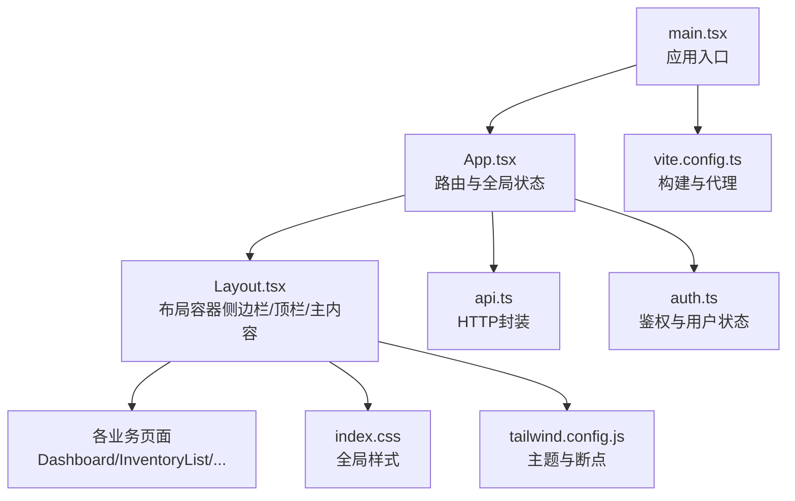
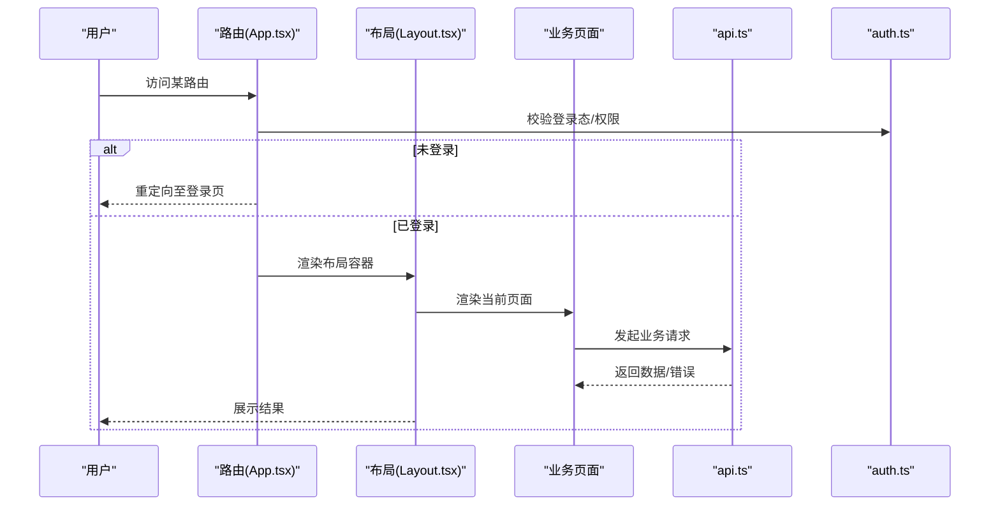
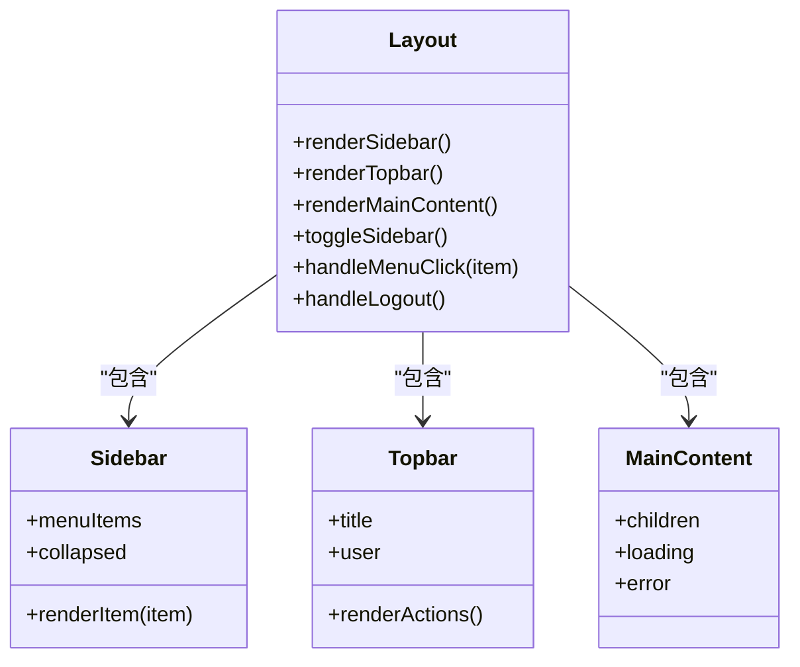
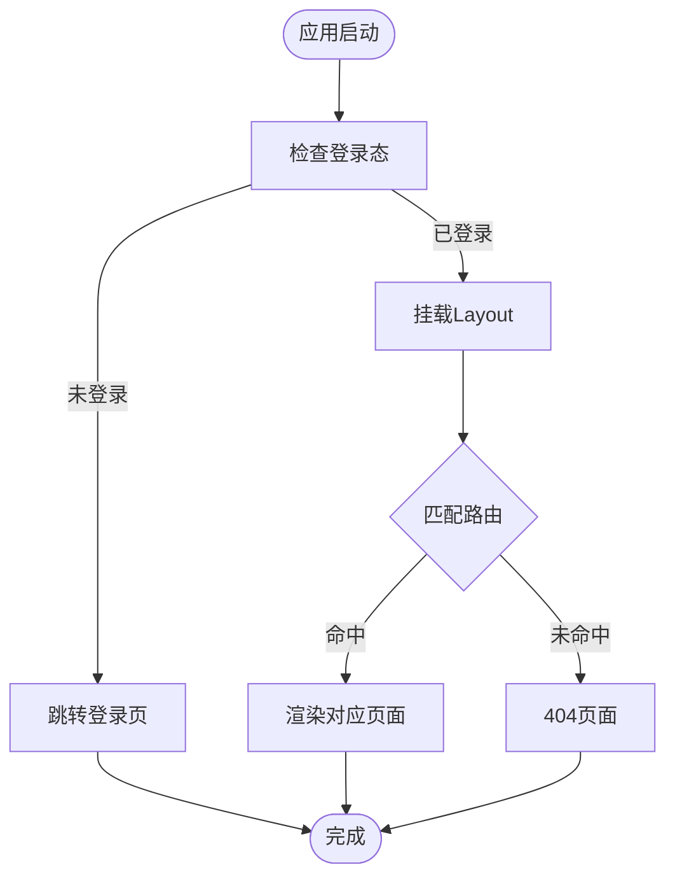
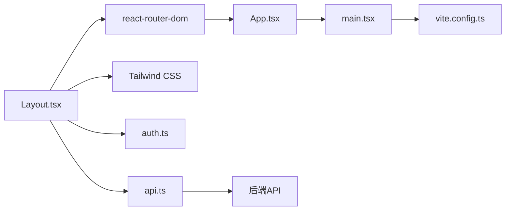

# 布局组件

<cite>
**本文引用的文件**   
- [Layout.tsx](file://dip-system/frontend-web/src/pages/Layout.tsx)
- [App.tsx](file://dip-system/frontend-web/src/App.tsx)
- [main.tsx](file://dip-system/frontend-web/src/main.tsx)
- [index.css](file://dip-system/frontend-web/src/index.css)
- [tailwind.config.js](file://dip-system/frontend-web/tailwind.config.js)
- [vite.config.ts](file://dip-system/frontend-web/vite.config.ts)
- [package.json](file://dip-system/frontend-web/package.json)
- [api.ts](file://dip-system/frontend-web/src/lib/api.ts)
- [auth.ts](file://dip-system/frontend-web/src/lib/auth.ts)
</cite>

## 目录
1. [简介](#简介)
2. [项目结构](#项目结构)
3. [核心组件](#核心组件)
4. [架构总览](#架构总览)
5. [详细组件分析](#详细组件分析)
6. [依赖分析](#依赖分析)
7. [性能考虑](#性能考虑)
8. [故障排查指南](#故障排查指南)
9. [结论](#结论)
10. [附录](#附录)

## 简介
本文件面向DIP系统的前端Web应用，聚焦“布局组件”的完整文档。内容涵盖整体布局架构（侧边栏导航、顶部工具栏、主内容区域）、响应式适配方案、路由集成方式、权限控制实现、用户状态管理、布局定制指南（主题切换、尺寸调整、模块扩展），以及与业务组件的集成方式和最佳实践。同时提供性能优化策略与移动端适配建议，帮助开发者快速理解并高效扩展布局能力。

## 项目结构
前端采用Vite + React + TypeScript技术栈，样式基于Tailwind CSS。布局相关代码集中在页面级组件中，通过路由挂载到应用根节点。关键文件包括：
- 入口与路由：main.tsx、App.tsx
- 布局容器：pages/Layout.tsx
- 样式与主题：index.css、tailwind.config.js
- 构建配置：vite.config.ts
- 依赖清单：package.json
- 网络与鉴权：lib/api.ts、lib/auth.ts

**图表来源** 
- [main.tsx](file://dip-system/frontend-web/src/main.tsx)
- [App.tsx](file://dip-system/frontend-web/src/App.tsx)
- [Layout.tsx](file://dip-system/frontend-web/src/pages/Layout.tsx)
- [index.css](file://dip-system/frontend-web/src/index.css)
- [tailwind.config.js](file://dip-system/frontend-web/tailwind.config.js)
- [vite.config.ts](file://dip-system/frontend-web/vite.config.ts)

**章节来源**
- [main.tsx](file://dip-system/frontend-web/src/main.tsx)
- [App.tsx](file://dip-system/frontend-web/src/App.tsx)
- [Layout.tsx](file://dip-system/frontend-web/src/pages/Layout.tsx)
- [index.css](file://dip-system/frontend-web/src/index.css)
- [tailwind.config.js](file://dip-system/frontend-web/tailwind.config.js)
- [vite.config.ts](file://dip-system/frontend-web/vite.config.ts)
- [package.json](file://dip-system/frontend-web/package.json)

## 核心组件
- 布局容器 Layout.tsx
  - 职责：组织侧边栏导航、顶部工具栏、主内容区域；处理移动端折叠/展开；承载路由出口。
  - 关键点：响应式断点、可折叠侧边栏、顶栏用户信息与操作入口、主内容区自适应。
- 应用根 App.tsx
  - 职责：注册路由、挂载布局、统一错误边界与加载态。
  - 关键点：路由守卫（未登录跳转）、懒加载页面、全局状态注入。
- 入口 main.tsx
  - 职责：初始化React应用、挂载根组件、全局样式与插件。
- 样式与主题
  - index.css：全局基础样式、滚动条、过渡动画等。
  - tailwind.config.js：主题色、字体、断点、自定义扩展。
- 构建与代理
  - vite.config.ts：开发服务器、API代理、资源优化。
- 网络与鉴权
  - api.ts：请求拦截、错误处理、Token注入。
  - auth.ts：登录态、用户信息、权限判断。

**章节来源**
- [Layout.tsx](file://dip-system/frontend-web/src/pages/Layout.tsx)
- [App.tsx](file://dip-system/frontend-web/src/App.tsx)
- [main.tsx](file://dip-system/frontend-web/src/main.tsx)
- [index.css](file://dip-system/frontend-web/src/index.css)
- [tailwind.config.js](file://dip-system/frontend-web/tailwind.config.js)
- [vite.config.ts](file://dip-system/frontend-web/vite.config.ts)
- [api.ts](file://dip-system/frontend-web/src/lib/api.ts)
- [auth.ts](file://dip-system/frontend-web/src/lib/auth.ts)

## 架构总览
布局层位于路由之下、业务页面上方，承担“壳”的职责。数据流方面，布局不直接持有业务状态，而是通过上下文或轻量Hook暴露用户信息、菜单权限等；网络请求由api.ts集中处理，鉴权逻辑在auth.ts中维护。

**图表来源** 
- [App.tsx](file://dip-system/frontend-web/src/App.tsx)
- [Layout.tsx](file://dip-system/frontend-web/src/pages/Layout.tsx)
- [api.ts](file://dip-system/frontend-web/src/lib/api.ts)
- [auth.ts](file://dip-system/frontend-web/src/lib/auth.ts)

## 详细组件分析

### 布局容器 Layout.tsx
- 结构设计
  - 外层容器：全屏高度，使用flex/grid组织三块区域（侧边栏、顶栏、主内容）。
  - 侧边栏：菜单列表、分组标题、图标与文字、选中高亮、移动端抽屉式折叠。
  - 顶部工具栏：面包屑/标题、搜索框、通知、用户头像下拉（退出、设置）。
  - 主内容区：路由出口、加载骨架屏、错误重试。
- 响应式适配
  - 小屏：侧边栏默认隐藏，通过汉堡按钮打开抽屉；顶栏简化为图标行。
  - 中屏：侧边栏半屏显示，支持收起为图标模式。
  - 大屏：侧边栏全宽显示，主内容区自适应剩余空间。
- 交互逻辑
  - 菜单点击：更新路由、记录选中项、触发权限检查。
  - 折叠状态：持久化到本地存储，跨会话保持。
  - 用户操作：退出登录清空状态并跳转登录页。
- 可扩展点
  - 菜单数据源抽象：支持动态加载、按角色过滤。
  - 顶栏插槽：预留扩展位用于消息中心、国际化切换等。

**图表来源** 
- [Layout.tsx](file://dip-system/frontend-web/src/pages/Layout.tsx)

**章节来源**
- [Layout.tsx](file://dip-system/frontend-web/src/pages/Layout.tsx)

### 应用根 App.tsx
- 路由注册：定义路由表，将Layout作为嵌套布局包裹所有业务路由。
- 路由守卫：根据auth.ts中的登录态与权限决定可见性。
- 懒加载：按需加载页面组件，减少首屏体积。
- 全局异常：捕获未处理的Promise拒绝与渲染错误。

**图表来源** 
- [App.tsx](file://dip-system/frontend-web/src/App.tsx)
- [auth.ts](file://dip-system/frontend-web/src/lib/auth.ts)

**章节来源**
- [App.tsx](file://dip-system/frontend-web/src/App.tsx)
- [auth.ts](file://dip-system/frontend-web/src/lib/auth.ts)

### 入口 main.tsx
- 初始化React应用，挂载根组件。
- 引入全局样式与第三方插件。
- 可选：埋点、错误上报、性能监控初始化。

**章节来源**
- [main.tsx](file://dip-system/frontend-web/src/main.tsx)

### 样式与主题（index.css、tailwind.config.js）
- 全局样式：重置、滚动条、过渡动画、打印样式等。
- Tailwind主题：颜色变量、字体族、间距、圆角、阴影、断点配置。
- 暗色模式：通过类名切换，配合顶层容器class实现。

**章节来源**
- [index.css](file://dip-system/frontend-web/src/index.css)
- [tailwind.config.js](file://dip-system/frontend-web/tailwind.config.js)

### 构建与代理（vite.config.ts）
- 开发服务器：端口、热重载、源码映射。
- API代理：将/api前缀转发至后端服务，避免CORS问题。
- 资源优化：代码分割、图片压缩、Tree Shaking。

**章节来源**
- [vite.config.ts](file://dip-system/frontend-web/vite.config.ts)

### 网络与鉴权（api.ts、auth.ts）
- api.ts
  - 请求拦截：附加Authorization头、超时控制、重试策略。
  - 响应拦截：统一错误码处理、401自动登出、消息提示。
- auth.ts
  - 登录态：Token存取、过期刷新、用户信息缓存。
  - 权限：角色/菜单权限判断、动态路由生成。

**章节来源**
- [api.ts](file://dip-system/frontend-web/src/lib/api.ts)
- [auth.ts](file://dip-system/frontend-web/src/lib/auth.ts)

## 依赖分析
- 运行时依赖
  - React生态：react、react-router-dom（或等价路由库）、状态管理（如zustand/redux）。
  - UI与样式：Tailwind CSS、可能的UI库（如Ant Design/Tremor等）。
- 构建依赖
  - Vite、TypeScript、PostCSS、Autoprefixer。
- 外部服务
  - 后端API：通过vite代理转发，统一域名与协议。

**图表来源** 
- [Layout.tsx](file://dip-system/frontend-web/src/pages/Layout.tsx)
- [App.tsx](file://dip-system/frontend-web/src/App.tsx)
- [main.tsx](file://dip-system/frontend-web/src/main.tsx)
- [vite.config.ts](file://dip-system/frontend-web/vite.config.ts)
- [api.ts](file://dip-system/frontend-web/src/lib/api.ts)
- [tailwind.config.js](file://dip-system/frontend-web/tailwind.config.js)

**章节来源**
- [package.json](file://dip-system/frontend-web/package.json)
- [vite.config.ts](file://dip-system/frontend-web/vite.config.ts)
- [tailwind.config.js](file://dip-system/frontend-web/tailwind.config.js)

## 性能考虑
- 首屏优化
  - 路由懒加载：仅加载当前页面所需代码。
  - 静态资源：启用CDN、缓存策略、图片压缩。
  - 代码分割：按路由/功能拆分chunk。
- 渲染优化
  - 避免不必要的重渲染：合理使用memo/useMemo/useCallback。
  - 列表虚拟化：大数据量时使用虚拟滚动。
- 网络优化
  - 请求合并与去抖：搜索输入防抖、批量接口。
  - 缓存策略：GET请求缓存、ETag/Last-Modified。
- 内存与稳定性
  - 清理副作用：取消订阅、清除定时器。
  - 错误边界：捕获渲染错误，降级展示。

[本节为通用指导，无需特定文件引用]

## 故障排查指南
- 路由无法进入
  - 检查路由守卫条件与权限配置。
  - 确认路由路径与组件懒加载是否正确。
- 侧边栏不显示或折叠异常
  - 检查响应式断点与状态持久化逻辑。
  - 确认DOM结构与CSS层级。
- 登录后仍被重定向
  - 检查Token存储与有效期。
  - 确认api.ts的401处理流程。
- 样式错乱
  - 检查Tailwind类名是否生效。
  - 确认全局样式覆盖顺序。
- 网络请求失败
  - 查看代理配置与后端地址。
  - 检查请求头与跨域设置。

**章节来源**
- [api.ts](file://dip-system/frontend-web/src/lib/api.ts)
- [auth.ts](file://dip-system/frontend-web/src/lib/auth.ts)
- [vite.config.ts](file://dip-system/frontend-web/vite.config.ts)
- [tailwind.config.js](file://dip-system/frontend-web/tailwind.config.js)

## 结论
DIP系统的布局组件以清晰的层次划分与良好的响应式设计为基础，结合路由守卫与统一的网络/鉴权机制，提供了稳定可扩展的壳层能力。通过主题配置、插槽扩展与懒加载策略，可在保证性能的同时满足多端适配与业务定制需求。

[本节为总结，无需特定文件引用]

## 附录
- 布局定制指南
  - 主题切换：在tailwind.config.js中扩展颜色与字体，通过顶层class切换暗色模式。
  - 尺寸调整：修改断点与容器最大宽度，适配不同屏幕密度。
  - 模块扩展：在顶栏与侧边栏预留插槽，新增功能时优先复用现有布局容器。
- 与其他组件的集成最佳实践
  - 数据获取：在页面组件内调用api.ts，避免在布局中耦合业务逻辑。
  - 权限控制：通过auth.ts提供的钩子或HOC进行菜单与按钮级权限控制。
  - 状态管理：用户信息、菜单权限等全局状态应置于独立模块，供布局与页面共享。
- 移动端适配方案
  - 侧边栏抽屉化、顶栏图标化、触摸友好的交互反馈。
  - 键盘与无障碍：确保Tab导航与ARIA标签完善。

[本节为通用指导，无需特定文件引用]