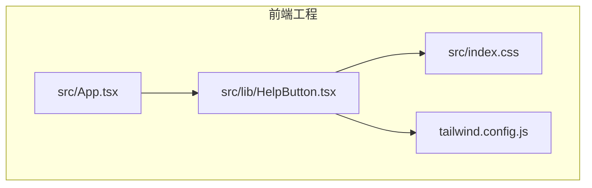
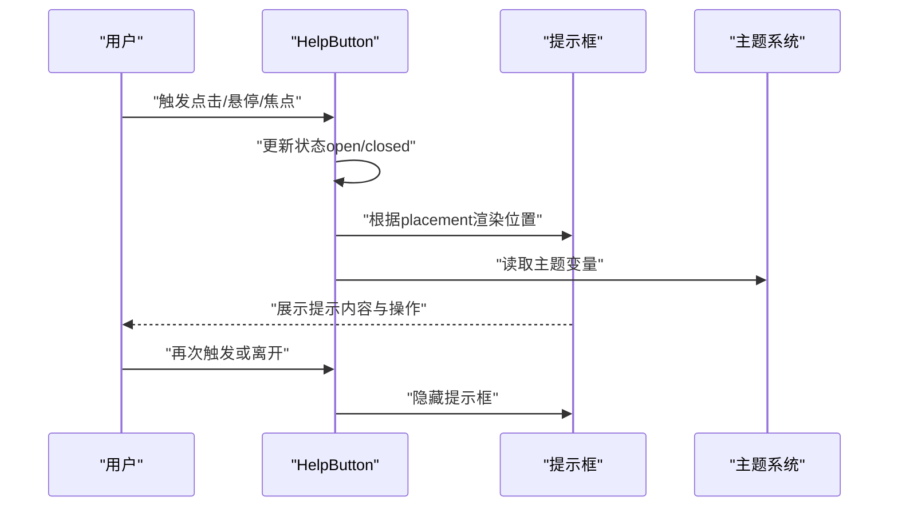
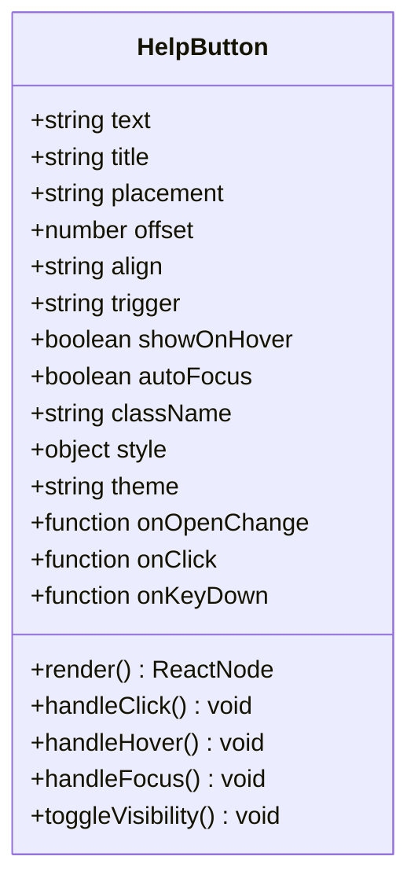
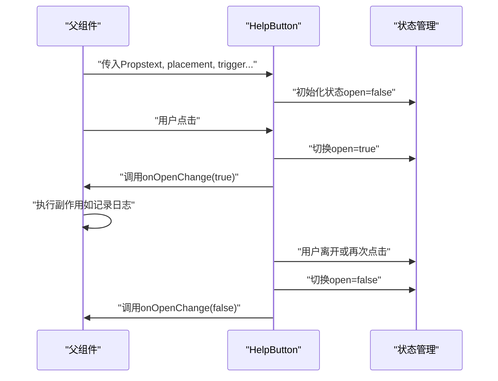
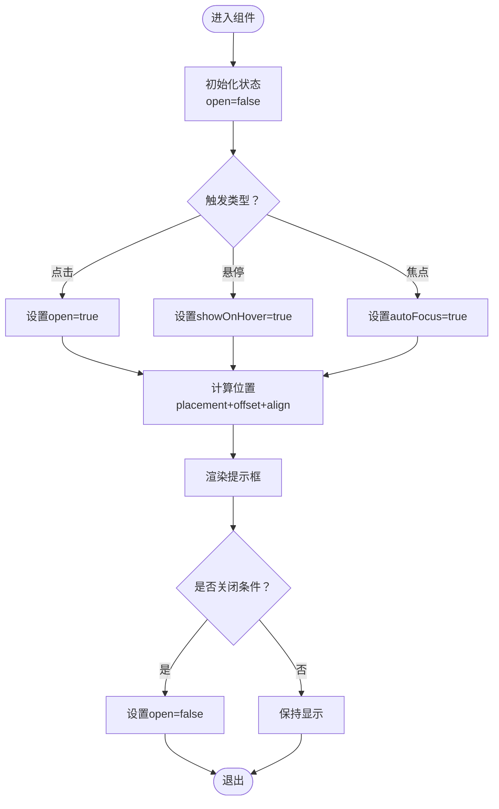
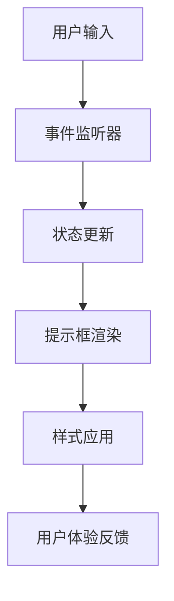
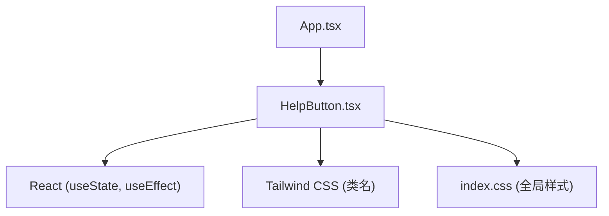

# 帮助按钮组件

<cite>
**本文引用的文件**   
- [HelpButton.tsx](file://dip-system/frontend-web/src/lib/HelpButton.tsx)
- [index.css](file://dip-system/frontend-web/src/index.css)
- [tailwind.config.js](file://dip-system/frontend-web/tailwind.config.js)
- [App.tsx](file://dip-system/frontend-web/src/App.tsx)
</cite>

## 目录
1. [简介](#简介)
2. [项目结构](#项目结构)
3. [核心组件](#核心组件)
4. [架构总览](#架构总览)
5. [详细组件分析](#详细组件分析)
6. [依赖分析](#依赖分析)
7. [性能考虑](#性能考虑)
8. [故障排查指南](#故障排查指南)
9. [结论](#结论)
10. [附录](#附录)

## 简介
本章节面向DIP系统的帮助按钮组件，说明其设计理念、使用场景与交互行为。帮助按钮用于在页面或表单中提供上下文相关的提示与操作入口，支持多种触发方式（点击、悬停、键盘焦点等），并可通过位置配置控制提示框的显示方位。该组件强调可访问性、主题一致性与易用性，适用于复杂业务页面的功能引导、字段说明与快捷操作。

## 项目结构
帮助按钮组件位于前端Web工程中的通用库目录，采用React + TypeScript实现，样式基于Tailwind CSS进行定制。组件通过事件处理与状态管理控制提示内容的展示与隐藏，并与全局样式和主题保持一致。

**图示来源** 
- [HelpButton.tsx](file://dip-system/frontend-web/src/lib/HelpButton.tsx)
- [index.css](file://dip-system/frontend-web/src/index.css)
- [tailwind.config.js](file://dip-system/frontend-web/tailwind.config.js)
- [App.tsx](file://dip-system/frontend-web/src/App.tsx)

**章节来源**
- [HelpButton.tsx](file://dip-system/frontend-web/src/lib/HelpButton.tsx)
- [index.css](file://dip-system/frontend-web/src/index.css)
- [tailwind.config.js](file://dip-system/frontend-web/tailwind.config.js)
- [App.tsx](file://dip-system/frontend-web/src/App.tsx)

## 核心组件
帮助按钮组件的核心职责包括：
- 渲染一个可触发的按钮图标
- 根据配置决定提示内容的位置与展示方式
- 处理用户交互（点击、悬停、键盘）以切换提示可见性
- 提供无障碍属性（如aria-label、role、tabIndex）提升可访问性
- 与主题系统联动，确保视觉一致性

组件对外暴露的Props接口建议如下（按语义分组）：
- 文本与内容
  - text: 提示文本或节点
  - title: 按钮标题（用于无障碍描述）
- 位置与布局
  - placement: 提示框相对按钮的位置（上、下、左、右）
  - offset: 偏移量（像素或单位值）
  - align: 对齐方式（左、中、右）
- 触发与交互
  - trigger: 触发方式（click、hover、focus）
  - showOnHover: 是否启用悬停显示
  - autoFocus: 是否自动聚焦
- 样式与主题
  - className: 自定义类名
  - style: 内联样式
  - theme: 主题键（light/dark/custom）
- 事件回调
  - onOpenChange: 打开/关闭状态变化回调
  - onClick: 点击回调
  - onKeyDown: 键盘事件回调

**章节来源**
- [HelpButton.tsx](file://dip-system/frontend-web/src/lib/HelpButton.tsx)

## 架构总览
帮助按钮组件作为独立UI模块，被页面级组件按需引入。其内部通过状态管理控制提示框的显隐，并通过事件总线或回调机制与父组件通信。样式由Tailwind CSS与全局CSS共同驱动，主题适配通过CSS变量或类名切换实现。

**图示来源** 
- [HelpButton.tsx](file://dip-system/frontend-web/src/lib/HelpButton.tsx)
- [index.css](file://dip-system/frontend-web/src/index.css)
- [tailwind.config.js](file://dip-system/frontend-web/tailwind.config.js)

## 详细组件分析

### 组件A分析（帮助按钮）
帮助按钮组件采用函数式组件模式，内部维护提示框的可见性状态，并根据用户交互动态更新。组件支持多触发方式，默认优先响应点击事件，同时兼容悬停与键盘操作。提示框的位置通过placement参数计算，确保在不同屏幕尺寸下的可读性。

**图示来源** 
- [HelpButton.tsx](file://dip-system/frontend-web/src/lib/HelpButton.tsx)

**章节来源**
- [HelpButton.tsx](file://dip-system/frontend-web/src/lib/HelpButton.tsx)

### API/服务组件流程
帮助按钮与父组件之间的数据流通过事件回调实现。当用户触发按钮时，组件调用onOpenChange通知父组件状态变化，父组件可根据需要执行副作用（如记录日志、更新全局状态）。

**图示来源** 
- [HelpButton.tsx](file://dip-system/frontend-web/src/lib/HelpButton.tsx)
- [App.tsx](file://dip-system/frontend-web/src/App.tsx)

### 复杂逻辑流程图（提示框显示算法）
提示框的显示逻辑基于触发类型与位置配置进行判断，确保在不同交互模式下的一致性体验。

**图示来源** 
- [HelpButton.tsx](file://dip-system/frontend-web/src/lib/HelpButton.tsx)

**章节来源**
- [HelpButton.tsx](file://dip-system/frontend-web/src/lib/HelpButton.tsx)

### 概念总览
帮助按钮组件的设计遵循“最小化侵入、最大化可用性”原则。它不依赖外部UI框架，而是通过原生HTML元素与React状态管理实现，确保轻量与高性能。提示框的动画过渡由CSS transitions控制，避免JavaScript动画带来的性能开销。

[此图为概念流程图，无需源码映射]

## 依赖分析
帮助按钮组件的依赖关系清晰且内聚性强，主要依赖React核心API与Tailwind CSS样式系统。无外部第三方库依赖，降低版本冲突风险。

**图示来源** 
- [HelpButton.tsx](file://dip-system/frontend-web/src/lib/HelpButton.tsx)
- [index.css](file://dip-system/frontend-web/src/index.css)
- [tailwind.config.js](file://dip-system/frontend-web/tailwind.config.js)
- [App.tsx](file://dip-system/frontend-web/src/App.tsx)

**章节来源**
- [HelpButton.tsx](file://dip-system/frontend-web/src/lib/HelpButton.tsx)
- [index.css](file://dip-system/frontend-web/src/index.css)
- [tailwind.config.js](file://dip-system/frontend-web/tailwind.config.js)
- [App.tsx](file://dip-system/frontend-web/src/App.tsx)

## 性能考虑
- 状态更新优化：使用React.memo包裹组件以减少不必要的重渲染
- 事件委托：将事件处理器绑定到document而非每个按钮实例
- 样式计算缓存：对位置计算结果进行缓存，避免重复计算
- 懒加载提示内容：仅在提示框显示时加载复杂内容

[本节为通用性能指导，无需源码映射]

## 故障排查指南
常见问题及解决方案：
- 提示框位置异常：检查placement参数与offset值是否正确
- 触发方式无效：确认trigger参数与DOM事件兼容性
- 样式覆盖问题：检查className优先级与CSS特异性
- 无障碍访问失败：验证aria-label与role属性是否正确设置

**章节来源**
- [HelpButton.tsx](file://dip-system/frontend-web/src/lib/HelpButton.tsx)
- [index.css](file://dip-system/frontend-web/src/index.css)

## 结论
帮助按钮组件为DIP系统提供了灵活、可访问且易于定制的提示解决方案。通过清晰的Props接口与事件机制，开发者可以轻松集成到各种业务场景中。组件的设计注重性能与用户体验，适合大规模应用使用。

[本节为总结性内容，无需源码映射]

## 附录
- 使用示例：在表单字段旁添加帮助按钮，点击后显示字段说明
- 主题适配：通过theme参数切换亮色/暗色模式
- 无障碍最佳实践：确保所有交互均可通过键盘完成，并提供屏幕阅读器支持

[本节为补充信息，无需源码映射]