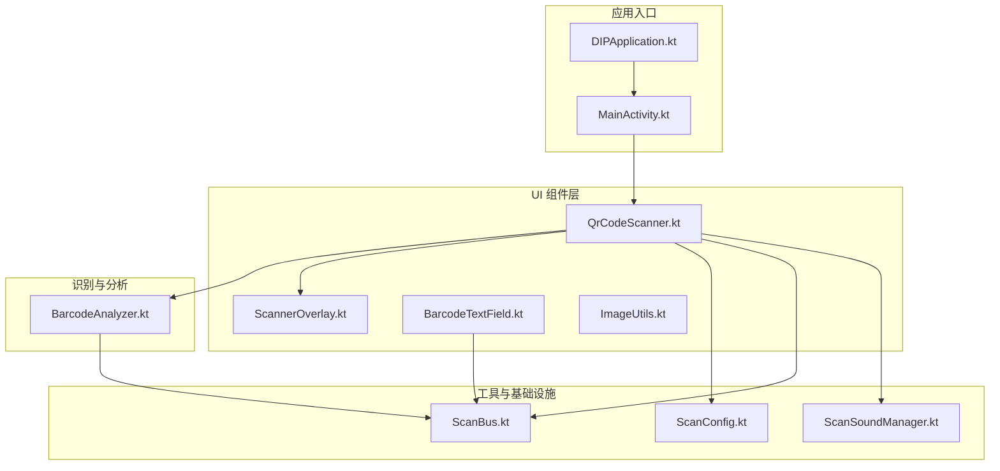
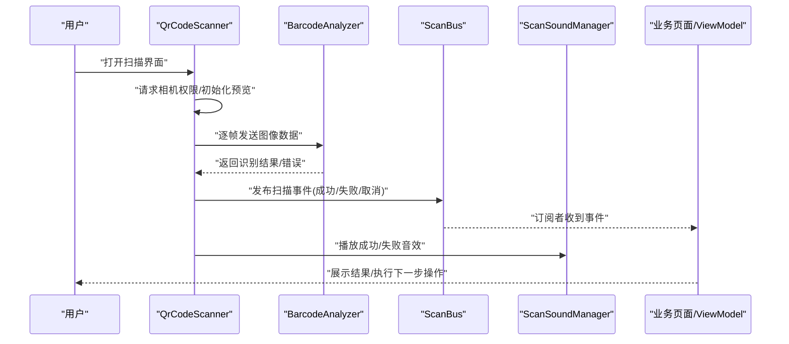
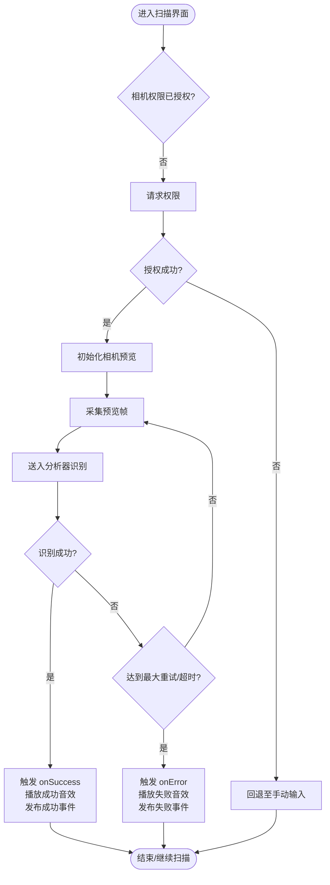
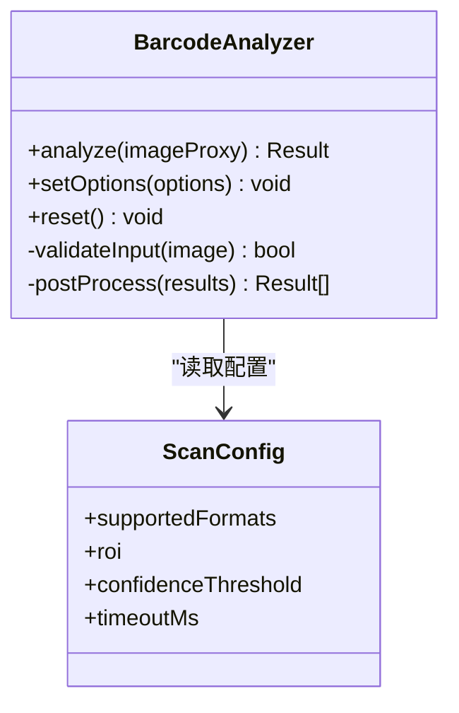
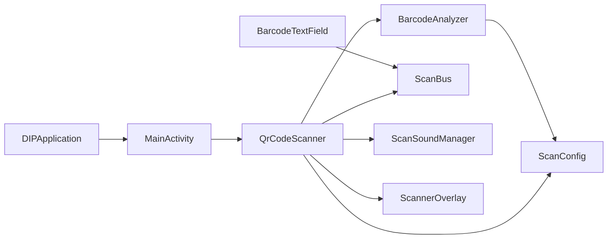

# 条形码扫描组件

<cite>
**本文引用的文件**   
- [BarcodeAnalyzer.kt](file://mobile-android/app/src/main/java/com/dip/material/ui/components/BarcodeAnalyzer.kt)
- [QrCodeScanner.kt](file://mobile-android/app/src/main/java/com/dip/material/ui/components/QrCodeScanner.kt)
- [ScannerOverlay.kt](file://mobile-android/app/src/main/java/com/dip/material/ui/components/ScannerOverlay.kt)
- [ScanConfig.kt](file://mobile-android/app/src/main/java/com/dip/material/utils/ScanConfig.kt)
- [ScanBus.kt](file://mobile-android/app/src/main/java/com/dip/material/utils/ScanBus.kt)
- [ScanSoundManager.kt](file://mobile-android/app/src/main/java/com/dip/material/utils/ScanSoundManager.kt)
- [BarcodeTextField.kt](file://mobile-android/app/src/main/java/com/dip/material/ui/components/BarcodeTextField.kt)
- [ImageUtils.kt](file://mobile-android/app/src/main/java/com/dip/material/ui/components/ImageUtils.kt)
- [MainActivity.kt](file://mobile-android/app/src/main/java/com/dip/material/MainActivity.kt)
- [DIPApplication.kt](file://mobile-android/app/src/main/java/com/dip/material/DIPApplication.kt)
</cite>

## 目录
1. [简介](#简介)
2. [项目结构](#项目结构)
3. [核心组件](#核心组件)
4. [架构总览](#架构总览)
5. [详细组件分析](#详细组件分析)
6. [依赖关系分析](#依赖关系分析)
7. [性能考虑](#性能考虑)
8. [故障排查指南](#故障排查指南)
9. [结论](#结论)
10. [附录](#附录)

## 简介
本文件为 DIP 系统 Android 端的“条形码扫描组件”提供完整技术文档。内容涵盖：
- 摄像头访问与预览流程
- 条码识别算法与解码管线
- 扫描结果处理机制（成功、失败、取消）
- Props 接口定义（扫描模式配置、回调函数、错误处理选项）
- 页面集成示例与事件处理
- 样式定制与主题适配
- 性能优化建议与常见问题解决方案

该组件基于 Jetpack Compose 构建，使用 ML Kit Barcode Scanning 进行条码识别，并通过内部总线与声音管理模块协同工作，提供稳定、可配置、易扩展的扫码体验。

## 项目结构
Android 端扫码相关代码集中在 mobile-android 模块中，关键目录与职责如下：
- ui/components：UI 组件层，包含二维码/条码扫描器、叠加层、输入框等
- utils：工具与基础设施，包含扫描配置、事件总线、声音管理等
- MainActivity/DIPApplication：应用入口与全局初始化

图表来源
- [QrCodeScanner.kt](file://mobile-android/app/src/main/java/com/dip/material/ui/components/QrCodeScanner.kt)
- [BarcodeAnalyzer.kt](file://mobile-android/app/src/main/java/com/dip/material/ui/components/BarcodeAnalyzer.kt)
- [ScannerOverlay.kt](file://mobile-android/app/src/main/java/com/dip/material/ui/components/ScannerOverlay.kt)
- [ScanConfig.kt](file://mobile-android/app/src/main/java/com/dip/material/utils/ScanConfig.kt)
- [ScanBus.kt](file://mobile-android/app/src/main/java/com/dip/material/utils/ScanBus.kt)
- [ScanSoundManager.kt](file://mobile-android/app/src/main/java/com/dip/material/utils/ScanSoundManager.kt)
- [BarcodeTextField.kt](file://mobile-android/app/src/main/java/com/dip/material/ui/components/BarcodeTextField.kt)
- [ImageUtils.kt](file://mobile-android/app/src/main/java/com/dip/material/ui/components/ImageUtils.kt)
- [MainActivity.kt](file://mobile-android/app/src/main/java/com/dip/material/MainActivity.kt)
- [DIPApplication.kt](file://mobile-android/app/src/main/java/com/dip/material/DIPApplication.kt)

章节来源
- [QrCodeScanner.kt](file://mobile-android/app/src/main/java/com/dip/material/ui/components/QrCodeScanner.kt)
- [BarcodeAnalyzer.kt](file://mobile-android/app/src/main/java/com/dip/material/ui/components/BarcodeAnalyzer.kt)
- [ScannerOverlay.kt](file://mobile-android/app/src/main/java/com/dip/material/ui/components/ScannerOverlay.kt)
- [ScanConfig.kt](file://mobile-android/app/src/main/java/com/dip/material/utils/ScanConfig.kt)
- [ScanBus.kt](file://mobile-android/app/src/main/java/com/dip/material/utils/ScanBus.kt)
- [ScanSoundManager.kt](file://mobile-android/app/src/main/java/com/dip/material/utils/ScanSoundManager.kt)
- [BarcodeTextField.kt](file://mobile-android/app/src/main/java/com/dip/material/ui/components/BarcodeTextField.kt)
- [ImageUtils.kt](file://mobile-android/app/src/main/java/com/dip/material/ui/components/ImageUtils.kt)
- [MainActivity.kt](file://mobile-android/app/src/main/java/com/dip/material/MainActivity.kt)
- [DIPApplication.kt](file://mobile-android/app/src/main/java/com/dip/material/DIPApplication.kt)

## 核心组件
- 扫描器 UI（QrCodeScanner）：负责相机权限申请、预览渲染、识别帧采集、状态管理与回调分发
- 条码分析器（BarcodeAnalyzer）：封装 ML Kit 条码识别逻辑，输出识别结果或错误
- 叠加层（ScannerOverlay）：绘制取景框、提示文案、扫描动画等视觉反馈
- 扫描配置（ScanConfig）：集中管理扫描模式、支持的码制、阈值、超时等参数
- 事件总线（ScanBus）：统一发布/订阅扫描事件（成功、失败、取消），解耦 UI 与业务
- 声音管理（ScanSoundManager）：播放成功/失败音效，支持静音模式
- 文本输入（BarcodeTextField）：在扫描失败时允许手动输入，自动去重与校验
- 图像工具（ImageUtils）：图片缩放、格式转换、内存优化辅助

章节来源
- [QrCodeScanner.kt](file://mobile-android/app/src/main/java/com/dip/material/ui/components/QrCodeScanner.kt)
- [BarcodeAnalyzer.kt](file://mobile-android/app/src/main/java/com/dip/material/ui/components/BarcodeAnalyzer.kt)
- [ScannerOverlay.kt](file://mobile-android/app/src/main/java/com/dip/material/ui/components/ScannerOverlay.kt)
- [ScanConfig.kt](file://mobile-android/app/src/main/java/com/dip/material/utils/ScanConfig.kt)
- [ScanBus.kt](file://mobile-android/app/src/main/java/com/dip/material/utils/ScanBus.kt)
- [ScanSoundManager.kt](file://mobile-android/app/src/main/java/com/dip/material/utils/ScanSoundManager.kt)
- [BarcodeTextField.kt](file://mobile-android/app/src/main/java/com/dip/material/ui/components/BarcodeTextField.kt)
- [ImageUtils.kt](file://mobile-android/app/src/main/java/com/dip/material/ui/components/ImageUtils.kt)

## 架构总览
扫码整体流程从 UI 发起，经分析器完成识别，通过总线广播结果，最终由上层业务消费并触发后续动作（如跳转、提示、播放音效）。

图表来源
- [QrCodeScanner.kt](file://mobile-android/app/src/main/java/com/dip/material/ui/components/QrCodeScanner.kt)
- [BarcodeAnalyzer.kt](file://mobile-android/app/src/main/java/com/dip/material/ui/components/BarcodeAnalyzer.kt)
- [ScanBus.kt](file://mobile-android/app/src/main/java/com/dip/material/utils/ScanBus.kt)
- [ScanSoundManager.kt](file://mobile-android/app/src/main/java/com/dip/material/utils/ScanSoundManager.kt)

## 详细组件分析

### 扫描器 UI（QrCodeScanner）
职责
- 生命周期管理：启动/暂停/销毁相机预览
- 权限处理：动态申请相机权限，失败回退到手动输入
- 帧采集：将 CameraX 预览帧转换为 ML Kit 输入格式
- 状态机：运行中、已识别、失败、取消等状态切换
- 回调分发：调用外部传入的成功/失败/取消回调，并发布总线事件

Props 接口（概念性说明）
- 扫描模式：单次扫描/连续扫描
- 支持的码制：一维码、二维码、混合码
- 识别区域：自定义 ROI（矩形）
- 回调函数：onSuccess、onError、onCancel
- 错误处理：重试次数、超时时间、是否启用震动/声音
- 样式主题：边框颜色、提示文案、背景遮罩透明度

图表来源
- [QrCodeScanner.kt](file://mobile-android/app/src/main/java/com/dip/material/ui/components/QrCodeScanner.kt)
- [BarcodeAnalyzer.kt](file://mobile-android/app/src/main/java/com/dip/material/ui/components/BarcodeAnalyzer.kt)
- [ScanBus.kt](file://mobile-android/app/src/main/java/com/dip/material/utils/ScanBus.kt)
- [ScanSoundManager.kt](file://mobile-android/app/src/main/java/com/dip/material/utils/ScanSoundManager.kt)

章节来源
- [QrCodeScanner.kt](file://mobile-android/app/src/main/java/com/dip/material/ui/components/QrCodeScanner.kt)

### 条码分析器（BarcodeAnalyzer）
职责
- 封装 ML Kit BarcodeScanning API
- 设置识别选项（码制、精度、ROI）
- 处理识别结果与异常，统一返回结构化结果
- 可选：对低置信度结果进行二次判定或过滤

复杂度与优化
- 时间复杂度：每帧 O(n)，n 为检测到的候选条码数量
- 空间复杂度：O(k)，k 为单帧中间对象大小（图像缓冲、结果列表）
- 优化点：限制 ROI 范围、降低分辨率、禁用不必要的码制、合并重复结果

图表来源
- [BarcodeAnalyzer.kt](file://mobile-android/app/src/main/java/com/dip/material/ui/components/BarcodeAnalyzer.kt)
- [ScanConfig.kt](file://mobile-android/app/src/main/java/com/dip/material/utils/ScanConfig.kt)

章节来源
- [BarcodeAnalyzer.kt](file://mobile-android/app/src/main/java/com/dip/material/ui/components/BarcodeAnalyzer.kt)
- [ScanConfig.kt](file://mobile-android/app/src/main/java/com/dip/material/utils/ScanConfig.kt)

### 叠加层（ScannerOverlay）
职责
- 绘制取景框、引导线、提示文案
- 根据状态切换高亮/抖动/闪烁效果
- 支持主题色与尺寸适配

章节来源
- [ScannerOverlay.kt](file://mobile-android/app/src/main/java/com/dip/material/ui/components/ScannerOverlay.kt)

### 事件总线（ScanBus）
职责
- 定义事件类型：扫描成功、失败、取消
- 提供发布/订阅接口，支持生命周期感知
- 保证线程安全与顺序性

章节来源
- [ScanBus.kt](file://mobile-android/app/src/main/java/com/dip/material/utils/ScanBus.kt)

### 声音管理（ScanSoundManager）
职责
- 播放成功/失败音效
- 支持静音模式与音量控制
- 资源懒加载与缓存

章节来源
- [ScanSoundManager.kt](file://mobile-android/app/src/main/java/com/dip/material/utils/ScanSoundManager.kt)

### 文本输入（BarcodeTextField）
职责
- 在扫描失败时提供手动输入
- 自动去除空格/换行、大小写规范化
- 与扫描结果去重，避免重复提交

章节来源
- [BarcodeTextField.kt](file://mobile-android/app/src/main/java/com/dip/material/ui/components/BarcodeTextField.kt)

### 图像工具（ImageUtils）
职责
- 图像格式转换（YUV/RGB）
- 尺寸缩放与裁剪
- 内存占用估算与回收策略

章节来源
- [ImageUtils.kt](file://mobile-android/app/src/main/java/com/dip/material/ui/components/ImageUtils.kt)

## 依赖关系分析
- QrCodeScanner 依赖 BarcodeAnalyzer、ScanConfig、ScanBus、ScanSoundManager、ScannerOverlay
- BarcodeAnalyzer 依赖 ScanConfig
- ScanBus 被多个组件订阅，形成松耦合的事件驱动架构
- MainActivity/DIPApplication 负责初始化全局配置与应用级资源

图表来源
- [QrCodeScanner.kt](file://mobile-android/app/src/main/java/com/dip/material/ui/components/QrCodeScanner.kt)
- [BarcodeAnalyzer.kt](file://mobile-android/app/src/main/java/com/dip/material/ui/components/BarcodeAnalyzer.kt)
- [ScanConfig.kt](file://mobile-android/app/src/main/java/com/dip/material/utils/ScanConfig.kt)
- [ScanBus.kt](file://mobile-android/app/src/main/java/com/dip/material/utils/ScanBus.kt)
- [ScanSoundManager.kt](file://mobile-android/app/src/main/java/com/dip/material/utils/ScanSoundManager.kt)
- [ScannerOverlay.kt](file://mobile-android/app/src/main/java/com/dip/material/ui/components/ScannerOverlay.kt)
- [BarcodeTextField.kt](file://mobile-android/app/src/main/java/com/dip/material/ui/components/BarcodeTextField.kt)
- [MainActivity.kt](file://mobile-android/app/src/main/java/com/dip/material/MainActivity.kt)
- [DIPApplication.kt](file://mobile-android/app/src/main/java/com/dip/material/DIPApplication.kt)

章节来源
- [QrCodeScanner.kt](file://mobile-android/app/src/main/java/com/dip/material/ui/components/QrCodeScanner.kt)
- [BarcodeAnalyzer.kt](file://mobile-android/app/src/main/java/com/dip/material/ui/components/BarcodeAnalyzer.kt)
- [ScanConfig.kt](file://mobile-android/app/src/main/java/com/dip/material/utils/ScanConfig.kt)
- [ScanBus.kt](file://mobile-android/app/src/main/java/com/dip/material/utils/ScanBus.kt)
- [ScanSoundManager.kt](file://mobile-android/app/src/main/java/com/dip/material/utils/ScanSoundManager.kt)
- [ScannerOverlay.kt](file://mobile-android/app/src/main/java/com/dip/material/ui/components/ScannerOverlay.kt)
- [BarcodeTextField.kt](file://mobile-android/app/src/main/java/com/dip/material/ui/components/BarcodeTextField.kt)
- [MainActivity.kt](file://mobile-android/app/src/main/java/com/dip/material/MainActivity.kt)
- [DIPApplication.kt](file://mobile-android/app/src/main/java/com/dip/material/DIPApplication.kt)

## 性能考虑
- 预览帧处理
  - 限制分辨率与帧率，平衡识别速度与功耗
  - 使用 ROI 缩小识别区域，减少计算量
- 识别算法
  - 仅启用必要码制，避免多余解码路径
  - 合理设置置信度阈值，减少误报与重复识别
- 内存与资源
  - 复用图像缓冲，避免频繁分配
  - 及时释放相机与识别器资源
- UI 渲染
  - 叠加层绘制尽量轻量，避免复杂动画
  - 使用 Compose 的 remember 与状态提升减少重组

[本节为通用指导，不直接分析具体文件]

## 故障排查指南
常见问题与解决思路
- 无法获取相机权限
  - 检查 AndroidManifest 权限声明与运行时授权流程
  - 在失败回调中引导用户前往系统设置授权
- 识别成功率低
  - 调整 ROI、光照与对焦距离
  - 增加对比度/锐化预处理（必要时）
  - 放宽置信度阈值或启用多码制
- 卡顿与掉帧
  - 降低预览分辨率与帧率
  - 关闭不必要的动画与日志
  - 检查主线程阻塞任务
- 重复结果
  - 在 ScanBus 或 UI 层做去重与冷却时间控制
- 声音不播放
  - 检查媒体音量与静音模式
  - 确认音频资源可用且未损坏

章节来源
- [QrCodeScanner.kt](file://mobile-android/app/src/main/java/com/dip/material/ui/components/QrCodeScanner.kt)
- [BarcodeAnalyzer.kt](file://mobile-android/app/src/main/java/com/dip/material/ui/components/BarcodeAnalyzer.kt)
- [ScanBus.kt](file://mobile-android/app/src/main/java/com/dip/material/utils/ScanBus.kt)
- [ScanSoundManager.kt](file://mobile-android/app/src/main/java/com/dip/material/utils/ScanSoundManager.kt)

## 结论
本组件以清晰的职责划分与事件驱动架构，实现了稳定高效的条形码扫描能力。通过可配置的 Props、统一的回调与事件总线，便于在不同业务场景中快速集成与定制。配合性能优化与完善的故障排查方案，可在复杂现场环境中保持良好用户体验。

[本节为总结性内容，不直接分析具体文件]

## 附录

### Props 接口定义（概念性）
- 扫描模式
  - 单次扫描：识别成功后立即返回
  - 连续扫描：持续识别，直到手动停止或达到上限
- 支持的码制
  - 一维码（EAN-13/UPC-A/Code128 等）
  - 二维码（QR Code/DataMatrix）
  - 混合码（同时支持多种）
- 识别区域
  - 矩形 ROI（相对坐标或绝对像素）
- 回调函数
  - onSuccess(code, metadata)
  - onError(error, context)
  - onCancel(context)
- 错误处理选项
  - 最大重试次数
  - 超时时间（毫秒）
  - 震动/声音开关
- 样式与主题
  - 边框颜色、宽度
  - 提示文案
  - 背景遮罩透明度
  - 字体与字号

[本节为概念性说明，不直接分析具体文件]

### 页面集成示例（步骤说明）
- 在页面中引入扫描组件
- 配置 Props（模式、码制、ROI、回调）
- 监听事件（成功/失败/取消）
- 在成功回调中执行业务逻辑（如查询库存、跳转详情页）
- 在失败回调中提供手动输入入口

[本节为概念性说明，不直接分析具体文件]

### 事件处理机制
- 扫描成功
  - 播放成功音效
  - 发布成功事件
  - 更新 UI 状态（显示结果、禁用扫描按钮）
- 扫描失败
  - 播放失败音效
  - 发布失败事件
  - 显示错误提示，提供重试或手动输入
- 取消扫描
  - 清理资源（相机、识别器）
  - 发布取消事件
  - 返回上一页或重置状态

章节来源
- [ScanBus.kt](file://mobile-android/app/src/main/java/com/dip/material/utils/ScanBus.kt)
- [ScanSoundManager.kt](file://mobile-android/app/src/main/java/com/dip/material/utils/ScanSoundManager.kt)
- [QrCodeScanner.kt](file://mobile-android/app/src/main/java/com/dip/material/ui/components/QrCodeScanner.kt)

### 样式定制与主题适配
- 主题色：通过主题配置覆盖边框与提示文案颜色
- 尺寸适配：根据屏幕密度与方向动态调整 ROI 与叠加层
- 暗色模式：提供明暗两套配色方案
- 无障碍：为叠加层添加描述文本，便于读屏

章节来源
- [ScannerOverlay.kt](file://mobile-android/app/src/main/java/com/dip/material/ui/components/ScannerOverlay.kt)