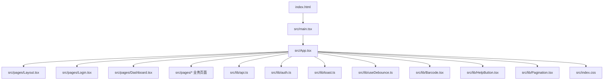
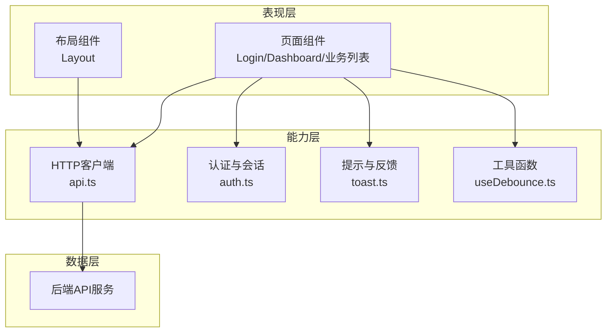
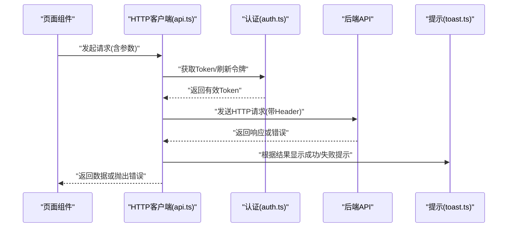
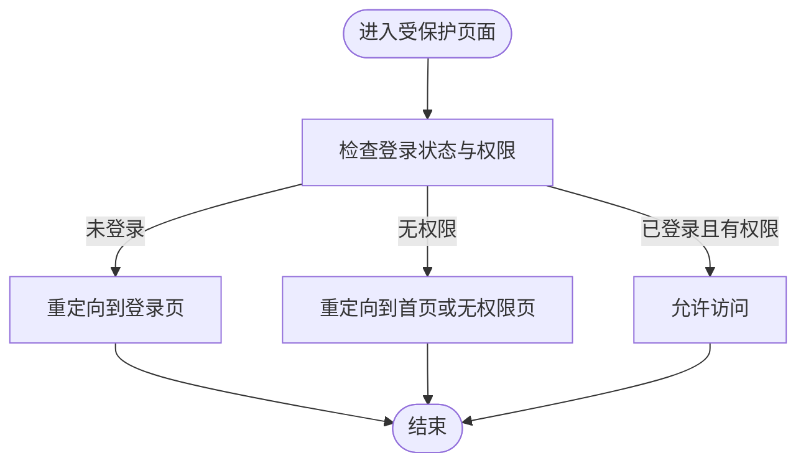
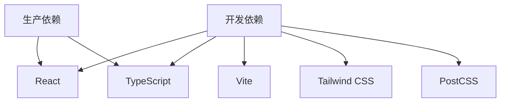

# Web前端应用

<cite>
**本文引用的文件**   
- [package.json](file://dip-system/frontend-web/package.json)
- [vite.config.ts](file://dip-system/frontend-web/vite.config.ts)
- [tailwind.config.js](file://dip-system/frontend-web/tailwind.config.js)
- [postcss.config.js](file://dip-system/frontend-web/postcss.config.js)
- [tsconfig.json](file://dip-system/frontend-web/tsconfig.json)
- [index.html](file://dip-system/frontend-web/index.html)
- [main.tsx](file://dip-system/frontend-web/src/main.tsx)
- [App.tsx](file://dip-system/frontend-web/src/App.tsx)
- [Layout.tsx](file://dip-system/frontend-web/src/pages/Layout.tsx)
- [Login.tsx](file://dip-system/frontend-web/src/pages/Login.tsx)
- [Dashboard.tsx](file://dip-system/frontend-web/src/pages/Dashboard.tsx)
- [api.ts](file://dip-system/frontend-web/src/lib/api.ts)
- [auth.ts](file://dip-system/frontend-web/src/lib/auth.ts)
- [toast.ts](file://dip-system/frontend-web/src/lib/toast.ts)
- [useDebounce.ts](file://dip-system/frontend-web/src/lib/useDebounce.ts)
- [Barcode.tsx](file://dip-system/frontend-web/src/lib/Barcode.tsx)
- [HelpButton.tsx](file://dip-system/frontend-web/src/lib/HelpButton.tsx)
- [Pagination.tsx](file://dip-system/frontend-web/src/lib/Pagination.tsx)
- [index.css](file://dip-system/frontend-web/src/index.css)
</cite>

## 目录
1. [简介](#简介)
2. [项目结构](#项目结构)
3. [核心组件](#核心组件)
4. [架构总览](#架构总览)
5. [详细组件分析](#详细组件分析)
6. [依赖关系分析](#依赖关系分析)
7. [性能考虑](#性能考虑)
8. [故障排查指南](#故障排查指南)
9. [结论](#结论)
10. [附录](#附录)

## 简介
本文件为DIP系统Web前端应用的全面技术文档。该前端采用React + TypeScript + Vite构建，使用Tailwind CSS进行样式开发，并通过统一的HTTP客户端与后端API集成。文档涵盖组件化开发模式、状态管理策略、路由配置、API封装、错误处理、加载状态管理、权限控制与会话管理、文件上传下载、构建与开发环境配置、性能优化以及开发规范与最佳实践。目标是帮助开发者快速理解并高效维护该系统的前端代码。

## 项目结构
前端工程位于dip-system/frontend-web目录，采用Vite作为构建工具，TypeScript作为类型系统，React作为UI框架，Tailwind CSS作为原子化样式库。主要目录与职责如下：
- src/main.tsx：应用入口，初始化React根节点与全局样式
- src/App.tsx：应用顶层路由与布局容器
- src/pages/*：页面级组件（如登录、仪表盘及各业务列表页）
- src/lib/*：通用能力与工具（HTTP客户端、认证、提示、防抖等）
- index.html：HTML模板
- vite.config.ts：Vite构建配置
- tailwind.config.js / postcss.config.js：样式与PostCSS配置
- tsconfig.json：TypeScript编译选项
- package.json：依赖与脚本定义

**图表来源** 
- [index.html](file://dip-system/frontend-web/index.html)
- [main.tsx](file://dip-system/frontend-web/src/main.tsx)
- [App.tsx](file://dip-system/frontend-web/src/App.tsx)
- [Layout.tsx](file://dip-system/frontend-web/src/pages/Layout.tsx)
- [Login.tsx](file://dip-system/frontend-web/src/pages/Login.tsx)
- [Dashboard.tsx](file://dip-system/frontend-web/src/pages/Dashboard.tsx)
- [api.ts](file://dip-system/frontend-web/src/lib/api.ts)
- [auth.ts](file://dip-system/frontend-web/src/lib/auth.ts)
- [toast.ts](file://dip-system/frontend-web/src/lib/toast.ts)
- [useDebounce.ts](file://dip-system/frontend-web/src/lib/useDebounce.ts)
- [Barcode.tsx](file://dip-system/frontend-web/src/lib/Barcode.tsx)
- [HelpButton.tsx](file://dip-system/frontend-web/src/lib/HelpButton.tsx)
- [Pagination.tsx](file://dip-system/frontend-web/src/lib/Pagination.tsx)
- [index.css](file://dip-system/frontend-web/src/index.css)

**章节来源**
- [package.json](file://dip-system/frontend-web/package.json)
- [vite.config.ts](file://dip-system/frontend-web/vite.config.ts)
- [tailwind.config.js](file://dip-system/frontend-web/tailwind.config.js)
- [postcss.config.js](file://dip-system/frontend-web/postcss.config.js)
- [tsconfig.json](file://dip-system/frontend-web/tsconfig.json)
- [index.html](file://dip-system/frontend-web/index.html)

## 核心组件
- 应用入口与初始化
  - main.tsx负责挂载React根节点、引入全局样式与基础依赖
- 应用路由与布局
  - App.tsx定义路由结构与页面导航
  - Layout.tsx提供侧边栏、顶部导航、内容区等统一布局
- 页面组件
  - Login.tsx实现用户登录流程
  - Dashboard.tsx展示系统概览数据
  - 其他业务页面（如库存、订单、异常等）遵循一致的列表/表单模式
- 通用能力
  - api.ts封装HTTP请求、拦截器、错误处理与加载状态
  - auth.ts管理用户会话、Token存储与鉴权守卫
  - toast.ts提供操作反馈提示
  - useDebounce.ts用于输入防抖优化
  - Barcode.tsx、HelpButton.tsx、Pagination.tsx为可复用UI组件

**章节来源**
- [main.tsx](file://dip-system/frontend-web/src/main.tsx)
- [App.tsx](file://dip-system/frontend-web/src/App.tsx)
- [Layout.tsx](file://dip-system/frontend-web/src/pages/Layout.tsx)
- [Login.tsx](file://dip-system/frontend-web/src/pages/Login.tsx)
- [Dashboard.tsx](file://dip-system/frontend-web/src/pages/Dashboard.tsx)
- [api.ts](file://dip-system/frontend-web/src/lib/api.ts)
- [auth.ts](file://dip-system/frontend-web/src/lib/auth.ts)
- [toast.ts](file://dip-system/frontend-web/src/lib/toast.ts)
- [useDebounce.ts](file://dip-system/frontend-web/src/lib/useDebounce.ts)
- [Barcode.tsx](file://dip-system/frontend-web/src/lib/Barcode.tsx)
- [HelpButton.tsx](file://dip-system/frontend-web/src/lib/HelpButton.tsx)
- [Pagination.tsx](file://dip-system/frontend-web/src/lib/Pagination.tsx)

## 架构总览
整体架构采用“页面组件 + 通用能力”的分层设计：
- 表现层：页面组件与布局组件，专注于UI渲染与交互
- 能力层：HTTP客户端、认证、提示、防抖等工具模块
- 数据层：通过HTTP客户端调用后端API，返回结构化数据供页面消费
- 构建层：Vite负责开发与构建，Tailwind CSS负责样式生成

**图表来源** 
- [App.tsx](file://dip-system/frontend-web/src/App.tsx)
- [Layout.tsx](file://dip-system/frontend-web/src/pages/Layout.tsx)
- [Login.tsx](file://dip-system/frontend-web/src/pages/Login.tsx)
- [Dashboard.tsx](file://dip-system/frontend-web/src/pages/Dashboard.tsx)
- [api.ts](file://dip-system/frontend-web/src/lib/api.ts)
- [auth.ts](file://dip-system/frontend-web/src/lib/auth.ts)
- [toast.ts](file://dip-system/frontend-web/src/lib/toast.ts)
- [useDebounce.ts](file://dip-system/frontend-web/src/lib/useDebounce.ts)

## 详细组件分析

### HTTP客户端与API集成（api.ts）
- 功能要点
  - 统一请求封装：GET/POST/PUT/DELETE等方法封装
  - 请求拦截：自动附加Authorization头、BaseURL设置
  - 响应拦截：统一错误码处理、消息提示、加载状态管理
  - 错误处理：网络异常、业务错误码分类处理
  - 文件上传/下载：支持FormData上传与Blob下载
- 使用建议
  - 所有页面通过api.ts发起请求，避免分散的fetch/axios调用
  - 错误信息通过toast.ts集中提示，保持用户体验一致
  - 大文件下载建议使用流式处理，避免内存占用过高

**图表来源** 
- [api.ts](file://dip-system/frontend-web/src/lib/api.ts)
- [auth.ts](file://dip-system/frontend-web/src/lib/auth.ts)
- [toast.ts](file://dip-system/frontend-web/src/lib/toast.ts)

**章节来源**
- [api.ts](file://dip-system/frontend-web/src/lib/api.ts)

### 认证与会话管理（auth.ts）
- 功能要点
  - Token存储：本地存储或Cookie持久化
  - 登录流程：调用后端认证接口，成功后保存用户信息与权限
  - 权限控制：基于角色或权限码的访问控制
  - 会话过期：自动刷新或引导重新登录
- 使用建议
  - 在路由守卫中检查登录状态与权限
  - 敏感操作前校验Token有效性
  - 登出时清理本地存储与会话

**图表来源** 
- [auth.ts](file://dip-system/frontend-web/src/lib/auth.ts)

**章节来源**
- [auth.ts](file://dip-system/frontend-web/src/lib/auth.ts)

### 提示与反馈（toast.ts）
- 功能要点
  - 成功/失败/警告/信息等多类型提示
  - 自动消失与手动关闭
  - 堆叠显示与定位控制
- 使用建议
  - 统一通过toast.ts调用，避免分散的alert或自定义弹窗
  - 重要操作需明确提示结果

**章节来源**
- [toast.ts](file://dip-system/frontend-web/src/lib/toast.ts)

### 防抖工具（useDebounce.ts）
- 功能要点
  - 输入防抖：减少频繁请求与计算
  - 自定义延迟时间
- 使用建议
  - 搜索框、分页切换等场景使用防抖优化性能

**章节来源**
- [useDebounce.ts](file://dip-system/frontend-web/src/lib/useDebounce.ts)

### 通用UI组件
- Barcode.tsx：条形码扫描与输入组件
- HelpButton.tsx：帮助按钮，提供上下文帮助
- Pagination.tsx：分页组件，支持页码跳转与每页条数设置

**章节来源**
- [Barcode.tsx](file://dip-system/frontend-web/src/lib/Barcode.tsx)
- [HelpButton.tsx](file://dip-system/frontend-web/src/lib/HelpButton.tsx)
- [Pagination.tsx](file://dip-system/frontend-web/src/lib/Pagination.tsx)

## 依赖关系分析
前端依赖主要包括：
- React与TypeScript：核心框架与类型系统
- Vite：构建与开发服务器
- Tailwind CSS：原子化样式库
- PostCSS：CSS预处理
- 其他工具库：如日期处理、图标库等

**图表来源** 
- [package.json](file://dip-system/frontend-web/package.json)

**章节来源**
- [package.json](file://dip-system/frontend-web/package.json)

## 性能考虑
- 代码分割：利用Vite的动态导入按需加载页面组件
- 资源优化：图片压缩、字体子集化、静态资源缓存
- 请求优化：接口合并、缓存策略、防抖节流
- 渲染优化：避免不必要的重渲染，合理使用React.memo与useMemo
- 样式优化：Tailwind CSS按需生成，减少CSS体积

[本节为通用指导，无需特定文件引用]

## 故障排查指南
- 网络连接问题
  - 检查BaseURL配置与跨域设置
  - 查看浏览器控制台网络请求详情
- 认证失败
  - 确认Token是否有效且未过期
  - 检查登录流程是否正确保存用户信息
- 样式异常
  - 验证Tailwind CSS配置是否正确
  - 检查CSS类名冲突
- 构建失败
  - 检查TypeScript类型错误
  - 确认依赖版本兼容性

**章节来源**
- [api.ts](file://dip-system/frontend-web/src/lib/api.ts)
- [auth.ts](file://dip-system/frontend-web/src/lib/auth.ts)
- [tailwind.config.js](file://dip-system/frontend-web/tailwind.config.js)
- [tsconfig.json](file://dip-system/frontend-web/tsconfig.json)

## 结论
DIP系统Web前端采用现代化的React + TypeScript + Vite技术栈，结合Tailwind CSS实现高效的组件化开发与样式管理。通过统一的HTTP客户端与认证模块，确保了前后端集成的稳定性与安全性。文档详细介绍了架构设计、核心组件、API集成、权限控制、性能优化等内容，为后续开发与维护提供了清晰的技术指南。

[本节为总结性内容，无需特定文件引用]

## 附录
- 开发环境设置
  - 安装Node.js与包管理器
  - 执行依赖安装命令
  - 启动开发服务器
- 构建与部署
  - 生产构建命令
  - 静态资源部署方式
- 编码规范
  - TypeScript严格模式启用
  - ESLint与Prettier配置
  - 组件命名与文件组织约定

[本节为补充信息，无需特定文件引用]