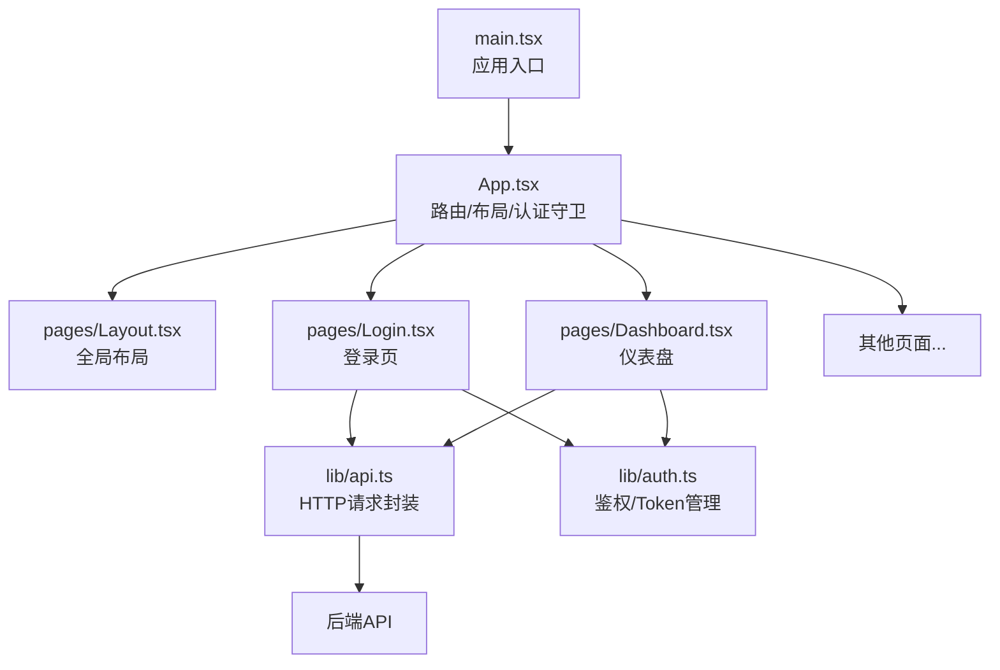
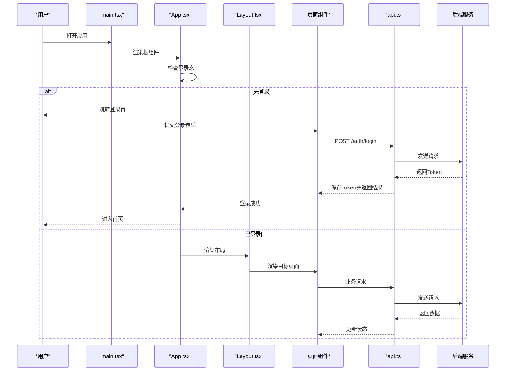
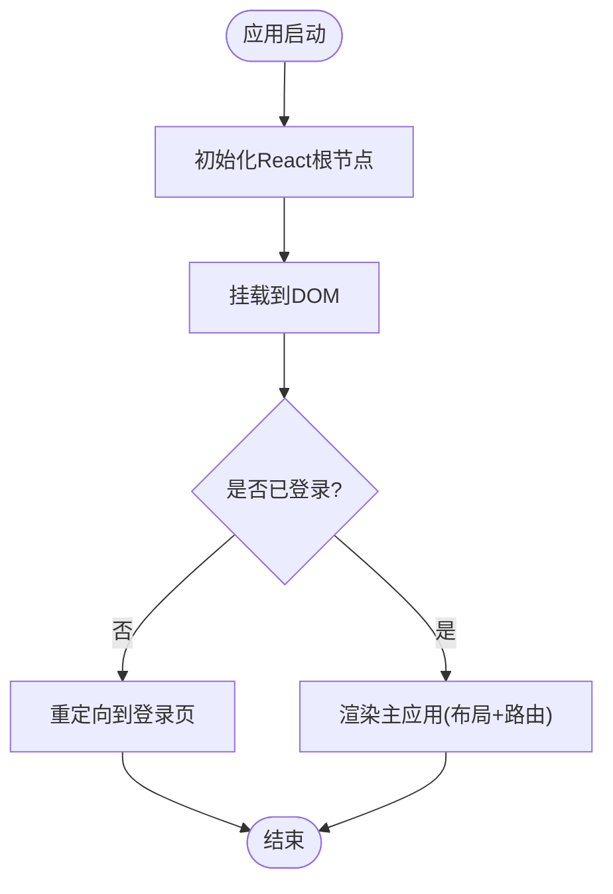
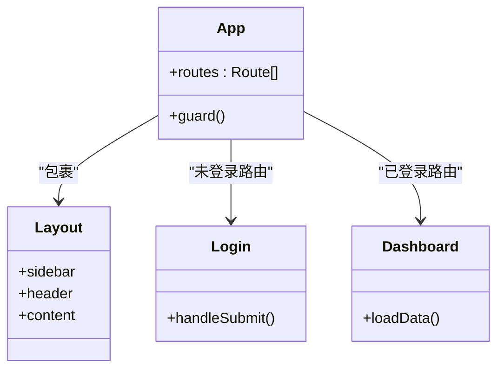
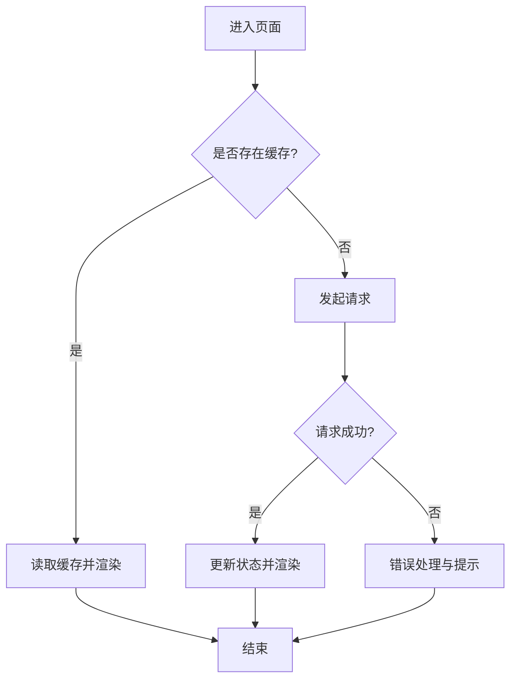
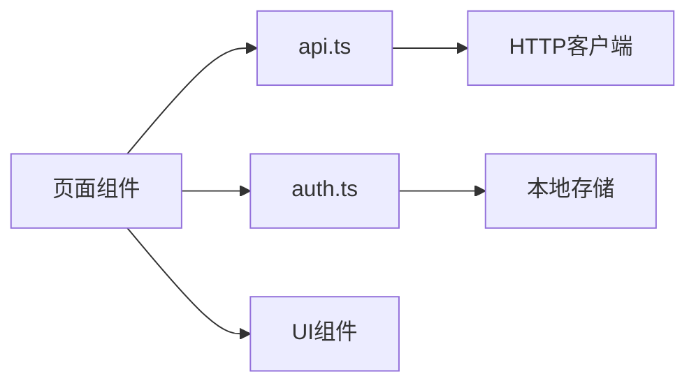
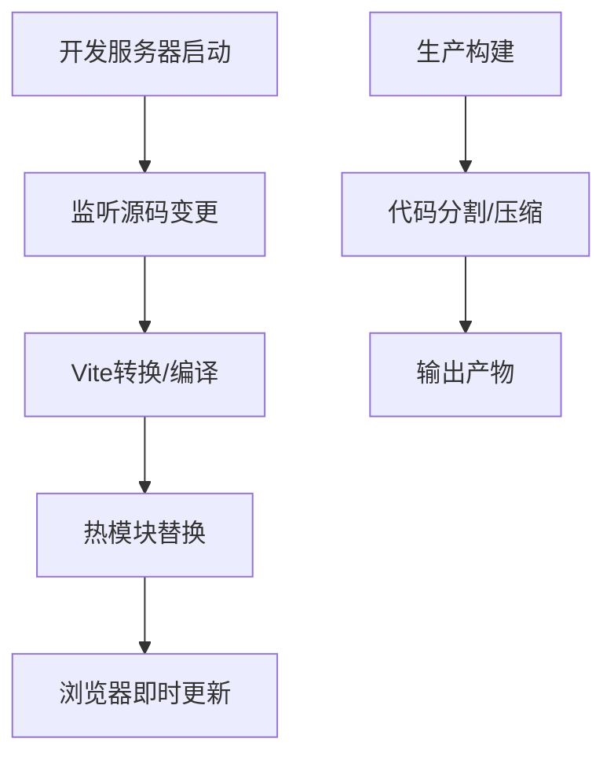
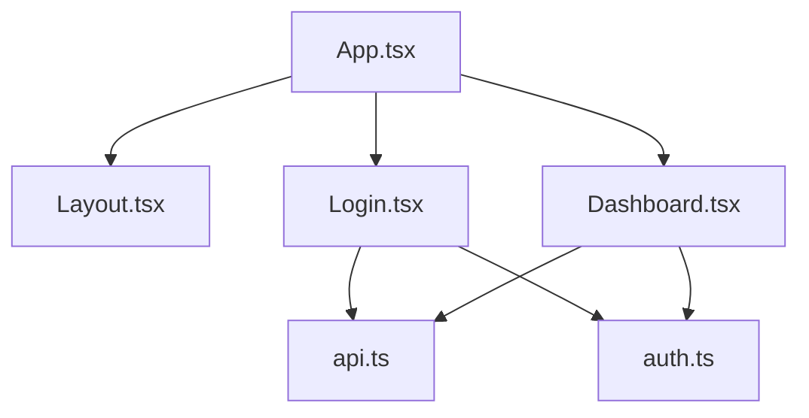

# 前端架构设计

<cite>
**本文引用的文件**   
- [frontend-web/src/main.tsx](file://dip-system/frontend-web/src/main.tsx)
- [frontend-web/src/App.tsx](file://dip-system/frontend-web/src/App.tsx)
- [frontend-web/src/pages/Layout.tsx](file://dip-system/frontend-web/src/pages/Layout.tsx)
- [frontend-web/src/pages/Login.tsx](file://dip-system/frontend-web/src/pages/Login.tsx)
- [frontend-web/src/pages/Dashboard.tsx](file://dip-system/frontend-web/src/pages/Dashboard.tsx)
- [frontend-web/src/lib/api.ts](file://dip-system/frontend-web/src/lib/api.ts)
- [frontend-web/src/lib/auth.ts](file://dip-system/frontend-web/src/lib/auth.ts)
- [frontend-web/src/lib/toast.ts](file://dip-system/frontend-web/src/lib/toast.ts)
- [frontend-web/src/lib/useDebounce.ts](file://dip-system/frontend-web/src/lib/useDebounce.ts)
- [frontend-web/vite.config.ts](file://dip-system/frontend-web/vite.config.ts)
- [frontend-web/package.json](file://dip-system/frontend-web/package.json)
- [frontend-web/tsconfig.json](file://dip-system/frontend-web/tsconfig.json)
- [frontend-web/tailwind.config.js](file://dip-system/frontend-web/tailwind.config.js)
- [frontend-web/postcss.config.js](file://dip-system/frontend-web/postcss.config.js)
</cite>

## 目录
1. [简介](#简介)
2. [项目结构](#项目结构)
3. [核心组件](#核心组件)
4. [架构总览](#架构总览)
5. [详细组件分析](#详细组件分析)
6. [依赖关系分析](#依赖关系分析)
7. [性能考量](#性能考量)
8. [故障排查指南](#故障排查指南)
9. [结论](#结论)
10. [附录](#附录)

## 简介
本文件面向DIP系统Web前端，基于React + TypeScript + Vite技术栈，系统化阐述应用初始化流程、路由与布局策略、组件分层架构、状态管理、依赖注入机制、模块化组织方式、构建优化与开发环境配置。文档旨在帮助开发者快速理解现有实现，并在扩展新功能时遵循一致的架构规范与最佳实践。

## 项目结构
前端位于 dip-system/frontend-web 目录，采用以功能页面为维度的组织方式：
- src/main.tsx：应用入口，负责创建根节点、挂载React应用、全局样式与插件初始化。
- src/App.tsx：顶层路由与布局容器，集中管理认证守卫与页面路由。
- src/pages/*：按业务域划分的页面组件（如登录、仪表盘、库存、出库等），以及公共布局 Layout。
- src/lib/*：可复用能力与工具库，包括HTTP封装、鉴权、提示、防抖Hook等。
- 构建与工程化：vite.config.ts、package.json、tsconfig.json、tailwind.config.js、postcss.config.js。

**图表来源** 
- [frontend-web/src/main.tsx](file://dip-system/frontend-web/src/main.tsx)
- [frontend-web/src/App.tsx](file://dip-system/frontend-web/src/App.tsx)
- [frontend-web/src/pages/Layout.tsx](file://dip-system/frontend-web/src/pages/Layout.tsx)
- [frontend-web/src/pages/Login.tsx](file://dip-system/frontend-web/src/pages/Login.tsx)
- [frontend-web/src/pages/Dashboard.tsx](file://dip-system/frontend-web/src/pages/Dashboard.tsx)
- [frontend-web/src/lib/api.ts](file://dip-system/frontend-web/src/lib/api.ts)
- [frontend-web/src/lib/auth.ts](file://dip-system/frontend-web/src/lib/auth.ts)

**章节来源**
- [frontend-web/src/main.tsx](file://dip-system/frontend-web/src/main.tsx)
- [frontend-web/src/App.tsx](file://dip-system/frontend-web/src/App.tsx)
- [frontend-web/src/pages/Layout.tsx](file://dip-system/frontend-web/src/pages/Layout.tsx)
- [frontend-web/src/pages/Login.tsx](file://dip-system/frontend-web/src/pages/Login.tsx)
- [frontend-web/src/pages/Dashboard.tsx](file://dip-system/frontend-web/src/pages/Dashboard.tsx)
- [frontend-web/src/lib/api.ts](file://dip-system/frontend-web/src/lib/api.ts)
- [frontend-web/src/lib/auth.ts](file://dip-system/frontend-web/src/lib/auth.ts)

## 核心组件
- 应用入口 main.tsx
  - 职责：初始化React渲染树、引入全局样式、注册必要的Provider或插件。
  - 关键点：确保在浏览器环境下执行；按需加载Tailwind样式；避免阻塞首屏。
- 顶层应用 App.tsx
  - 职责：定义路由表、集成认证守卫、提供全局上下文（如有）。
  - 关键点：未登录重定向到登录页；登录后根据权限展示菜单与页面。
- 布局 Layout.tsx
  - 职责：侧边栏、顶部导航、面包屑、内容区占位。
  - 关键点：保持布局稳定，减少不必要的重渲染。
- 页面组件（Login.tsx、Dashboard.tsx 等）
  - 职责：各自业务逻辑与UI呈现。
  - 关键点：通过 lib/api.ts 发起数据请求，使用 lib/auth.ts 获取用户信息。
- 工具库 lib/*
  - api.ts：统一HTTP封装（拦截器、错误处理、重试/超时）。
  - auth.ts：Token存取、登录态校验、刷新策略。
  - toast.ts：全局消息提示。
  - useDebounce.ts：通用防抖Hook。

**章节来源**
- [frontend-web/src/main.tsx](file://dip-system/frontend-web/src/main.tsx)
- [frontend-web/src/App.tsx](file://dip-system/frontend-web/src/App.tsx)
- [frontend-web/src/pages/Layout.tsx](file://dip-system/frontend-web/src/pages/Layout.tsx)
- [frontend-web/src/pages/Login.tsx](file://dip-system/frontend-web/src/pages/Login.tsx)
- [frontend-web/src/pages/Dashboard.tsx](file://dip-system/frontend-web/src/pages/Dashboard.tsx)
- [frontend-web/src/lib/api.ts](file://dip-system/frontend-web/src/lib/api.ts)
- [frontend-web/src/lib/auth.ts](file://dip-system/frontend-web/src/lib/auth.ts)
- [frontend-web/src/lib/toast.ts](file://dip-system/frontend-web/src/lib/toast.ts)
- [frontend-web/src/lib/useDebounce.ts](file://dip-system/frontend-web/src/lib/useDebounce.ts)

## 架构总览
整体采用“入口 -> 路由/布局 -> 页面 -> 工具库”的分层模式，前后端通过REST API交互，鉴权由前端维护Token并附加至请求头。

**图表来源** 
- [frontend-web/src/main.tsx](file://dip-system/frontend-web/src/main.tsx)
- [frontend-web/src/App.tsx](file://dip-system/frontend-web/src/App.tsx)
- [frontend-web/src/pages/Layout.tsx](file://dip-system/frontend-web/src/pages/Layout.tsx)
- [frontend-web/src/pages/Login.tsx](file://dip-system/frontend-web/src/pages/Login.tsx)
- [frontend-web/src/pages/Dashboard.tsx](file://dip-system/frontend-web/src/pages/Dashboard.tsx)
- [frontend-web/src/lib/api.ts](file://dip-system/frontend-web/src/lib/api.ts)

## 详细组件分析

### 应用初始化与启动流程
- main.tsx 作为唯一入口，完成React根节点创建与挂载，引入全局样式与必要插件。
- App.tsx 负责路由与认证守卫，决定初始页面与访问控制。
- 建议：将第三方SDK初始化、埋点、国际化等放在入口或独立初始化模块中，避免污染业务代码。

**图表来源** 
- [frontend-web/src/main.tsx](file://dip-system/frontend-web/src/main.tsx)
- [frontend-web/src/App.tsx](file://dip-system/frontend-web/src/App.tsx)

**章节来源**
- [frontend-web/src/main.tsx](file://dip-system/frontend-web/src/main.tsx)
- [frontend-web/src/App.tsx](file://dip-system/frontend-web/src/App.tsx)

### 路由与布局策略
- 路由策略：集中式路由表，按功能域划分页面；对需要鉴权的页面进行守卫拦截。
- 布局策略：Layout.tsx 提供统一的侧边栏、头部、内容区；子页面仅关注自身内容。
- 建议：动态路由与懒加载结合，提升首屏性能；菜单与路由保持一致性。

**图表来源** 
- [frontend-web/src/App.tsx](file://dip-system/frontend-web/src/App.tsx)
- [frontend-web/src/pages/Layout.tsx](file://dip-system/frontend-web/src/pages/Layout.tsx)
- [frontend-web/src/pages/Login.tsx](file://dip-system/frontend-web/src/pages/Login.tsx)
- [frontend-web/src/pages/Dashboard.tsx](file://dip-system/frontend-web/src/pages/Dashboard.tsx)

**章节来源**
- [frontend-web/src/App.tsx](file://dip-system/frontend-web/src/App.tsx)
- [frontend-web/src/pages/Layout.tsx](file://dip-system/frontend-web/src/pages/Layout.tsx)
- [frontend-web/src/pages/Login.tsx](file://dip-system/frontend-web/src/pages/Login.tsx)
- [frontend-web/src/pages/Dashboard.tsx](file://dip-system/frontend-web/src/pages/Dashboard.tsx)

### 状态管理模式
- 现状：页面级状态为主，通过useState/useEffect管理本地数据；跨页面共享可通过URL参数或轻量Context。
- 建议：
  - 列表查询与缓存：使用useMemo/useCallback与请求去重，避免重复网络请求。
  - 复杂状态：考虑引入轻量状态库（如Zustand/Jotai）统一管理用户信息、权限、主题等。
  - 服务端状态：优先使用React Query/SWR进行缓存、同步与重试。

**图表来源** 
- [frontend-web/src/pages/Dashboard.tsx](file://dip-system/frontend-web/src/pages/Dashboard.tsx)
- [frontend-web/src/lib/api.ts](file://dip-system/frontend-web/src/lib/api.ts)

**章节来源**
- [frontend-web/src/pages/Dashboard.tsx](file://dip-system/frontend-web/src/pages/Dashboard.tsx)
- [frontend-web/src/lib/api.ts](file://dip-system/frontend-web/src/lib/api.ts)

### 依赖注入与模块化组织
- 依赖注入：当前以函数式调用为主，通过lib/api.ts与lib/auth.ts提供能力；可在未来引入DI容器（如InversifyJS）统一管理服务实例。
- 模块化：按功能域拆分页面，工具库集中在lib下；避免循环依赖，明确边界。
- 建议：接口先行，定义清晰的API契约；对副作用进行抽象（如网络、存储、设备能力）。

**图表来源** 
- [frontend-web/src/lib/api.ts](file://dip-system/frontend-web/src/lib/api.ts)
- [frontend-web/src/lib/auth.ts](file://dip-system/frontend-web/src/lib/auth.ts)

**章节来源**
- [frontend-web/src/lib/api.ts](file://dip-system/frontend-web/src/lib/api.ts)
- [frontend-web/src/lib/auth.ts](file://dip-system/frontend-web/src/lib/auth.ts)

### 构建配置与开发体验
- Vite：极速冷启动与热重载，支持TypeScript、CSS预处理、资源优化。
- Tailwind + PostCSS：原子化样式与自动化清理，提升样式一致性。
- TypeScript：严格类型约束，提升可维护性与重构安全性。
- 建议：开启生产环境的Tree Shaking、代码分割与资源压缩；合理配置代理与环境变量。

**图表来源** 
- [frontend-web/vite.config.ts](file://dip-system/frontend-web/vite.config.ts)
- [frontend-web/package.json](file://dip-system/frontend-web/package.json)
- [frontend-web/tsconfig.json](file://dip-system/frontend-web/tsconfig.json)
- [frontend-web/tailwind.config.js](file://dip-system/frontend-web/tailwind.config.js)
- [frontend-web/postcss.config.js](file://dip-system/frontend-web/postcss.config.js)

**章节来源**
- [frontend-web/vite.config.ts](file://dip-system/frontend-web/vite.config.ts)
- [frontend-web/package.json](file://dip-system/frontend-web/package.json)
- [frontend-web/tsconfig.json](file://dip-system/frontend-web/tsconfig.json)
- [frontend-web/tailwind.config.js](file://dip-system/frontend-web/tailwind.config.js)
- [frontend-web/postcss.config.js](file://dip-system/frontend-web/postcss.config.js)

## 依赖关系分析
- 模块耦合：页面组件依赖lib/api.ts与lib/auth.ts；布局与路由集中在App.tsx与Layout.tsx。
- 外部依赖：Vite、React、TypeScript、Tailwind、PostCSS。
- 潜在风险：避免页面直接操作全局状态；统一错误处理与日志上报。

**图表来源** 
- [frontend-web/src/App.tsx](file://dip-system/frontend-web/src/App.tsx)
- [frontend-web/src/pages/Layout.tsx](file://dip-system/frontend-web/src/pages/Layout.tsx)
- [frontend-web/src/pages/Login.tsx](file://dip-system/frontend-web/src/pages/Login.tsx)
- [frontend-web/src/pages/Dashboard.tsx](file://dip-system/frontend-web/src/pages/Dashboard.tsx)
- [frontend-web/src/lib/api.ts](file://dip-system/frontend-web/src/lib/api.ts)
- [frontend-web/src/lib/auth.ts](file://dip-system/frontend-web/src/lib/auth.ts)

**章节来源**
- [frontend-web/src/App.tsx](file://dip-system/frontend-web/src/App.tsx)
- [frontend-web/src/pages/Layout.tsx](file://dip-system/frontend-web/src/pages/Layout.tsx)
- [frontend-web/src/pages/Login.tsx](file://dip-system/frontend-web/src/pages/Login.tsx)
- [frontend-web/src/pages/Dashboard.tsx](file://dip-system/frontend-web/src/pages/Dashboard.tsx)
- [frontend-web/src/lib/api.ts](file://dip-system/frontend-web/src/lib/api.ts)
- [frontend-web/src/lib/auth.ts](file://dip-system/frontend-web/src/lib/auth.ts)

## 性能考量
- 首屏优化：路由懒加载、关键路径代码分割、静态资源压缩。
- 渲染优化：避免不必要重渲染，合理使用memo/useMemo/useCallback。
- 网络优化：请求去重、缓存策略、分页与增量更新。
- 构建优化：启用Tree Shaking、按需引入、图片与字体优化。

[本节为通用指导，不直接分析具体文件]

## 故障排查指南
- 登录失败
  - 检查Token是否正确保存与携带；确认后端接口地址与跨域配置。
  - 查看lib/auth.ts的登录流程与错误分支。
- 网络请求异常
  - 检查lib/api.ts的错误处理与重试策略；确认请求头与参数格式。
- 样式问题
  - 确认Tailwind与PostCSS配置；清理缓存后重启开发服务器。
- 热重载失效
  - 检查vite.config.ts配置；确保文件未被忽略且端口未被占用。

**章节来源**
- [frontend-web/src/lib/auth.ts](file://dip-system/frontend-web/src/lib/auth.ts)
- [frontend-web/src/lib/api.ts](file://dip-system/frontend-web/src/lib/api.ts)
- [frontend-web/vite.config.ts](file://dip-system/frontend-web/vite.config.ts)
- [frontend-web/tailwind.config.js](file://dip-system/frontend-web/tailwind.config.js)
- [frontend-web/postcss.config.js](file://dip-system/frontend-web/postcss.config.js)

## 结论
本项目采用清晰的分层与模块化组织，结合React + TypeScript + Vite实现了高效的开发与构建体验。通过统一的HTTP封装与鉴权管理，保证了前后端交互的一致性与安全性。建议在后续迭代中引入更完善的状态管理与服务端状态缓存方案，进一步提升可维护性与性能。

[本节为总结性内容，不直接分析具体文件]

## 附录
- 开发环境搭建
  - 安装依赖：npm install
  - 启动开发服务器：npm run dev
  - 构建生产包：npm run build
- 代码规范
  - 使用ESLint + Prettier统一风格；TypeScript严格模式。
- 扩展指南
  - 新增页面：在src/pages下新建组件，并在App.tsx中注册路由与守卫。
  - 新增工具：在src/lib下添加模块，保持单一职责与无副作用。

**章节来源**
- [frontend-web/package.json](file://dip-system/frontend-web/package.json)
- [frontend-web/vite.config.ts](file://dip-system/frontend-web/vite.config.ts)
- [frontend-web/src/App.tsx](file://dip-system/frontend-web/src/App.tsx)
- [frontend-web/src/lib/api.ts](file://dip-system/frontend-web/src/lib/api.ts)
- [frontend-web/src/lib/auth.ts](file://dip-system/frontend-web/src/lib/auth.ts)