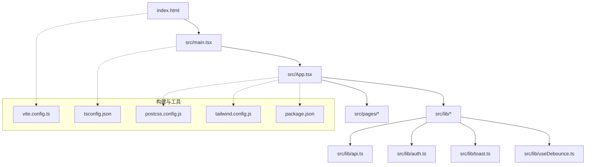
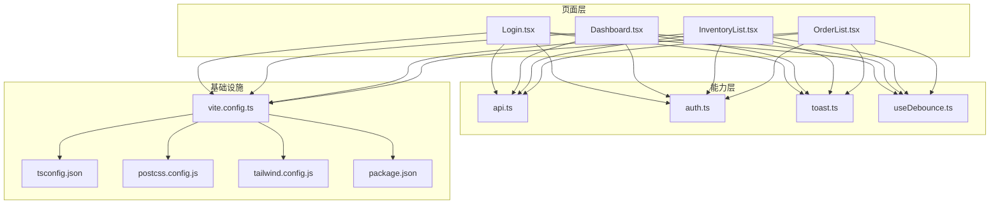
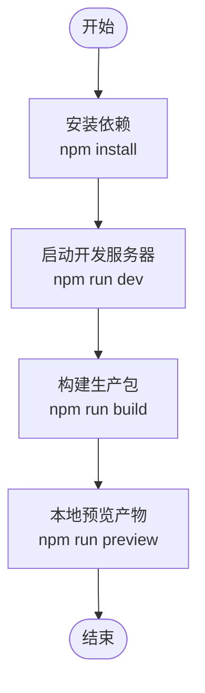
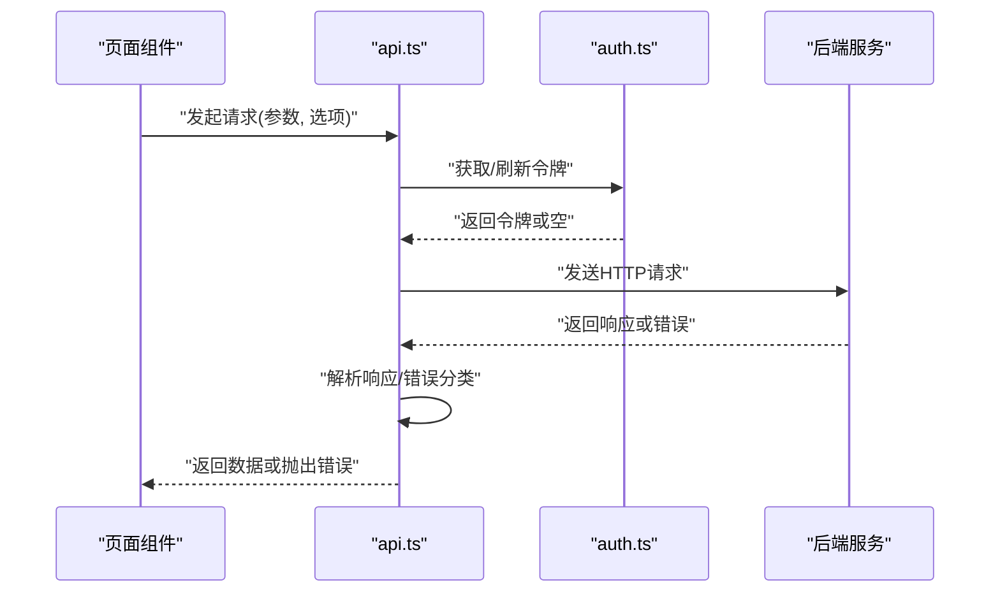
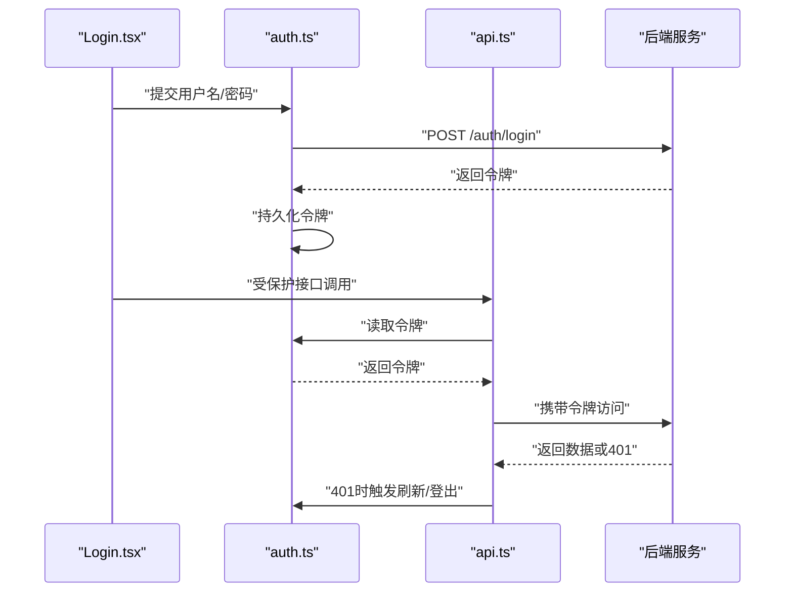
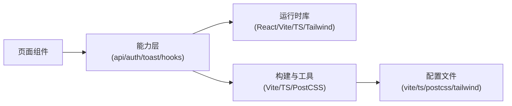

# 开发指南

<cite>
**本文引用的文件**   
- [package.json](file://dip-system/frontend-web/package.json)
- [tsconfig.json](file://dip-system/frontend-web/tsconfig.json)
- [vite.config.ts](file://dip-system/frontend-web/vite.config.ts)
- [postcss.config.js](file://dip-system/frontend-web/postcss.config.js)
- [tailwind.config.js](file://dip-system/frontend-web/tailwind.config.js)
- [index.html](file://dip-system/frontend-web/index.html)
- [main.tsx](file://dip-system/frontend-web/src/main.tsx)
- [App.tsx](file://dip-system/frontend-web/src/App.tsx)
- [api.ts](file://dip-system/frontend-web/src/lib/api.ts)
- [auth.ts](file://dip-system/frontend-web/src/lib/auth.ts)
- [toast.ts](file://dip-system/frontend-web/src/lib/toast.ts)
- [useDebounce.ts](file://dip-system/frontend-web/src/lib/useDebounce.ts)
- [Layout.tsx](file://dip-system/frontend-web/src/pages/Layout.tsx)
- [Login.tsx](file://dip-system/frontend-web/src/pages/Login.tsx)
- [Dashboard.tsx](file://dip-system/frontend-web/src/pages/Dashboard.tsx)
- [InventoryList.tsx](file://dip-system/frontend-web/src/pages/InventoryList.tsx)
- [OrderList.tsx](file://dip-system/frontend-web/src/pages/OrderList.tsx)
</cite>

## 目录
1. [简介](#简介)
2. [项目结构](#项目结构)
3. [核心组件](#核心组件)
4. [架构总览](#架构总览)
5. [详细组件分析](#详细组件分析)
6. [依赖分析](#依赖分析)
7. [性能考虑](#性能考虑)
8. [故障排查指南](#故障排查指南)
9. [结论](#结论)
10. [附录](#附录)

## 简介
本指南面向DIP系统Web前端开发者，覆盖从环境搭建、依赖安装、启动调试到构建优化与生产部署的全流程。文档同时给出TypeScript配置要点、代码规范与ESLint/Prettier集成建议、调试技巧与日志输出、错误追踪方法、单元测试与Mock数据生成、测试覆盖率统计，以及CI/CD集成与工作流、代码审查标准、版本管理规范等最佳实践。

## 项目结构
前端工程位于 dip-system/frontend-web 目录，采用 Vite + React + TypeScript 技术栈，样式使用 Tailwind CSS，API 调用集中在 lib 层，页面按功能模块划分在 pages 目录。

图表来源
- [index.html:1-200](file://dip-system/frontend-web/index.html#L1-L200)
- [main.tsx:1-200](file://dip-system/frontend-web/src/main.tsx#L1-L200)
- [App.tsx:1-200](file://dip-system/frontend-web/src/App.tsx#L1-L200)
- [vite.config.ts:1-200](file://dip-system/frontend-web/vite.config.ts#L1-L200)
- [tsconfig.json:1-200](file://dip-system/frontend-web/tsconfig.json#L1-L200)
- [postcss.config.js:1-200](file://dip-system/frontend-web/postcss.config.js#L1-L200)
- [tailwind.config.js:1-200](file://dip-system/frontend-web/tailwind.config.js#L1-L200)
- [package.json:1-200](file://dip-system/frontend-web/package.json#L1-L200)

章节来源
- [index.html:1-200](file://dip-system/frontend-web/index.html#L1-L200)
- [package.json:1-200](file://dip-system/frontend-web/package.json#L1-L200)

## 核心组件
- 应用入口与路由：main.tsx 负责挂载根组件；App.tsx 组织全局布局与路由；Layout.tsx 提供统一页面框架。
- API 与认证：lib/api.ts 封装HTTP请求（含基础URL、拦截器、错误处理）；lib/auth.ts 管理登录态与令牌。
- 通用能力：lib/toast.ts 提供用户提示；lib/useDebounce.ts 提供防抖Hook。
- 页面模块：pages 下各列表页与业务页面（如 Dashboard、InventoryList、OrderList、Login 等）。

章节来源
- [main.tsx:1-200](file://dip-system/frontend-web/src/main.tsx#L1-L200)
- [App.tsx:1-200](file://dip-system/frontend-web/src/App.tsx#L1-L200)
- [Layout.tsx:1-200](file://dip-system/frontend-web/src/pages/Layout.tsx#L1-L200)
- [api.ts:1-200](file://dip-system/frontend-web/src/lib/api.ts#L1-L200)
- [auth.ts:1-200](file://dip-system/frontend-web/src/lib/auth.ts#L1-L200)
- [toast.ts:1-200](file://dip-system/frontend-web/src/lib/toast.ts#L1-L200)
- [useDebounce.ts:1-200](file://dip-system/frontend-web/src/lib/useDebounce.ts#L1-L200)

## 架构总览
前端采用“页面-能力-基础设施”分层：
- 页面层：业务页面组件，聚焦交互与展示。
- 能力层：API封装、鉴权、Toast、Hooks等可复用逻辑。
- 基础设施：Vite构建、TypeScript编译、Tailwind样式、PostCSS处理。

图表来源
- [App.tsx:1-200](file://dip-system/frontend-web/src/App.tsx#L1-L200)
- [api.ts:1-200](file://dip-system/frontend-web/src/lib/api.ts#L1-L200)
- [auth.ts:1-200](file://dip-system/frontend-web/src/lib/auth.ts#L1-L200)
- [toast.ts:1-200](file://dip-system/frontend-web/src/lib/toast.ts#L1-L200)
- [useDebounce.ts:1-200](file://dip-system/frontend-web/src/lib/useDebounce.ts#L1-L200)
- [vite.config.ts:1-200](file://dip-system/frontend-web/vite.config.ts#L1-L200)
- [tsconfig.json:1-200](file://dip-system/frontend-web/tsconfig.json#L1-L200)
- [postcss.config.js:1-200](file://dip-system/frontend-web/postcss.config.js#L1-L200)
- [tailwind.config.js:1-200](file://dip-system/frontend-web/tailwind.config.js#L1-L200)
- [package.json:1-200](file://dip-system/frontend-web/package.json#L1-L200)

## 详细组件分析

### 构建与运行（Vite + TypeScript + Tailwind）
- 构建工具：Vite 通过 vite.config.ts 配置开发服务器、代理、插件与产物输出。
- 类型系统：tsconfig.json 定义编译选项、路径别名与严格模式。
- 样式管线：postcss.config.js 与 tailwind.config.js 配合实现原子化样式与按需生成。
- 脚本命令：package.json 中定义 dev/build/preview 等常用命令。

图表来源
- [vite.config.ts:1-200](file://dip-system/frontend-web/vite.config.ts#L1-L200)
- [tsconfig.json:1-200](file://dip-system/frontend-web/tsconfig.json#L1-L200)
- [postcss.config.js:1-200](file://dip-system/frontend-web/postcss.config.js#L1-L200)
- [tailwind.config.js:1-200](file://dip-system/frontend-web/tailwind.config.js#L1-L200)
- [package.json:1-200](file://dip-system/frontend-web/package.json#L1-L200)

章节来源
- [vite.config.ts:1-200](file://dip-system/frontend-web/vite.config.ts#L1-L200)
- [tsconfig.json:1-200](file://dip-system/frontend-web/tsconfig.json#L1-L200)
- [postcss.config.js:1-200](file://dip-system/frontend-web/postcss.config.js#L1-L200)
- [tailwind.config.js:1-200](file://dip-system/frontend-web/tailwind.config.js#L1-L200)
- [package.json:1-200](file://dip-system/frontend-web/package.json#L1-L200)

### API 封装与错误处理
- api.ts 集中管理请求基地址、超时、重试、响应拦截与错误分类。
- 建议将网络异常、业务错误码与用户提示解耦，便于统一处理与埋点。

图表来源
- [api.ts:1-200](file://dip-system/frontend-web/src/lib/api.ts#L1-L200)
- [auth.ts:1-200](file://dip-system/frontend-web/src/lib/auth.ts#L1-L200)

章节来源
- [api.ts:1-200](file://dip-system/frontend-web/src/lib/api.ts#L1-L200)
- [auth.ts:1-200](file://dip-system/frontend-web/src/lib/auth.ts#L1-L200)

### 鉴权流程
- auth.ts 负责登录态、令牌存储与过期处理，建议在请求前自动注入并处理401场景。

图表来源
- [Login.tsx:1-200](file://dip-system/frontend-web/src/pages/Login.tsx#L1-L200)
- [auth.ts:1-200](file://dip-system/frontend-web/src/lib/auth.ts#L1-L200)
- [api.ts:1-200](file://dip-system/frontend-web/src/lib/api.ts#L1-L200)

章节来源
- [Login.tsx:1-200](file://dip-system/frontend-web/src/pages/Login.tsx#L1-L200)
- [auth.ts:1-200](file://dip-system/frontend-web/src/lib/auth.ts#L1-L200)
- [api.ts:1-200](file://dip-system/frontend-web/src/lib/api.ts#L1-L200)

### 页面与布局
- Layout.tsx 提供统一的导航、侧边栏与内容区；各页面组件专注于业务表单与表格。
- 建议将公共UI元素抽取为独立组件，保持页面简洁。

章节来源
- [Layout.tsx:1-200](file://dip-system/frontend-web/src/pages/Layout.tsx#L1-L200)
- [Dashboard.tsx:1-200](file://dip-system/frontend-web/src/pages/Dashboard.tsx#L1-L200)
- [InventoryList.tsx:1-200](file://dip-system/frontend-web/src/pages/InventoryList.tsx#L1-L200)
- [OrderList.tsx:1-200](file://dip-system/frontend-web/src/pages/OrderList.tsx#L1-L200)

## 依赖分析
- 运行时依赖：React、Vite、TypeScript、Tailwind CSS、PostCSS、Axios/Fetch封装等。
- 开发依赖：ESLint、Prettier、Jest/Vitest（可选）、Testing Library（可选）、Source Map 相关工具。
- 依赖关系：页面依赖能力层，能力层依赖基础设施配置与运行时库。

图表来源
- [package.json:1-200](file://dip-system/frontend-web/package.json#L1-L200)
- [vite.config.ts:1-200](file://dip-system/frontend-web/vite.config.ts#L1-L200)
- [tsconfig.json:1-200](file://dip-system/frontend-web/tsconfig.json#L1-L200)
- [postcss.config.js:1-200](file://dip-system/frontend-web/postcss.config.js#L1-L200)
- [tailwind.config.js:1-200](file://dip-system/frontend-web/tailwind.config.js#L1-L200)

章节来源
- [package.json:1-200](file://dip-system/frontend-web/package.json#L1-L200)

## 性能考虑
- 构建优化
  - 启用代码分割与懒加载，减少首屏体积。
  - 合理配置缓存策略与资源压缩。
  - 使用Tree Shaking与按需引入第三方库。
- 运行时优化
  - 列表分页与虚拟滚动，避免大列表渲染卡顿。
  - 防抖与节流（useDebounce）降低高频事件开销。
  - 图片与静态资源按需加载与压缩。
- 监控与度量
  - 接入性能监控与错误上报，收集关键指标（FCP/LCP/CLS等）。

[本节为通用指导，不直接分析具体文件]

## 故障排查指南
- 常见问题定位
  - 网络请求失败：检查代理配置、跨域设置、令牌有效性。
  - 样式异常：确认Tailwind类名与PostCSS顺序，清理缓存后重试。
  - 类型错误：核对tsconfig严格模式与接口定义一致性。
- 日志与调试
  - 在关键路径添加结构化日志，区分环境（dev/prod）。
  - 使用浏览器开发者工具断点与Network面板排查。
- 错误追踪
  - 统一捕获未处理异常与Promise拒绝，上报至监控平台。
  - 对业务错误码进行友好提示与降级处理。

章节来源
- [api.ts:1-200](file://dip-system/frontend-web/src/lib/api.ts#L1-L200)
- [toast.ts:1-200](file://dip-system/frontend-web/src/lib/toast.ts#L1-L200)
- [auth.ts:1-200](file://dip-system/frontend-web/src/lib/auth.ts#L1-L200)

## 结论
本文档系统化梳理了DIP系统Web前端的开发环境与工程化体系，涵盖构建、样式、API封装、鉴权、页面组织与性能优化等关键环节。遵循本文的规范与实践，可有效提升团队协作效率与代码质量，保障项目在开发与生产环境的稳定运行。

[本节为总结性内容，不直接分析具体文件]

## 附录

### 开发环境搭建与启动
- 环境要求
  - Node.js LTS 版本
  - npm/yarn/pnpm 任一包管理器
- 安装与启动
  - 进入 frontend-web 目录
  - 安装依赖：执行包管理器安装命令
  - 启动开发服务器：执行开发命令
  - 构建与预览：执行构建与预览命令

章节来源
- [package.json:1-200](file://dip-system/frontend-web/package.json#L1-L200)

### TypeScript 配置要点
- 严格模式与路径别名
- 模块解析与目标版本
- 与Vite集成的类型检查与增量编译

章节来源
- [tsconfig.json:1-200](file://dip-system/frontend-web/tsconfig.json#L1-L200)

### 代码规范与格式化
- ESLint规则建议
  - 启用React与TypeScript规则集
  - 统一导入顺序与命名约定
- Prettier格式化
  - 统一缩进、引号、分号与换行风格
  - 与编辑器集成，保存时自动格式化

[本节为通用指导，不直接分析具体文件]

### 调试技巧与日志输出
- 开发期
  - 使用浏览器控制台与Sources断点
  - 在API层打印请求/响应摘要（脱敏）
- 生产期
  - 仅保留必要日志，避免敏感信息泄露
  - 接入错误上报与性能监控

章节来源
- [api.ts:1-200](file://dip-system/frontend-web/src/lib/api.ts#L1-L200)
- [toast.ts:1-200](file://dip-system/frontend-web/src/lib/toast.ts#L1-L200)

### 单元测试与Mock数据
- 测试框架选择
  - 推荐 Vitest + Testing Library
- Mock数据
  - 使用 MSW 或自定义Mock函数模拟API
- 覆盖率统计
  - 配置覆盖率阈值与报告输出

[本节为通用指导，不直接分析具体文件]

### 构建优化与生产部署
- 构建优化
  - 拆分路由与组件懒加载
  - 静态资源哈希与CDN缓存
- 部署方案
  - 静态站点托管（Nginx/对象存储）
  - 环境变量与反向代理配置

章节来源
- [vite.config.ts:1-200](file://dip-system/frontend-web/vite.config.ts#L1-L200)
- [package.json:1-200](file://dip-system/frontend-web/package.json#L1-L200)

### CI/CD 集成
- 流水线步骤
  - 依赖安装、类型检查、单元测试、构建产物
- 制品发布
  - 上传构建产物到仓库或对象存储
  - 触发部署任务（灰度/全量）

[本节为通用指导，不直接分析具体文件]

### 开发工作流与代码审查
- 分支策略
  - 主分支保护，特性分支开发，合并请求评审
- 代码审查标准
  - 可读性、可维护性、安全性与性能考量
  - 变更影响评估与回归验证

[本节为通用指导，不直接分析具体文件]

### 版本管理规范
- 语义化版本
  - 主版本：破坏性更新
  - 次版本：向后兼容的功能新增
  - 修订版本：向后兼容的问题修复
- 发布流程
  - 标签打版、变更日志生成、发布说明

[本节为通用指导，不直接分析具体文件]