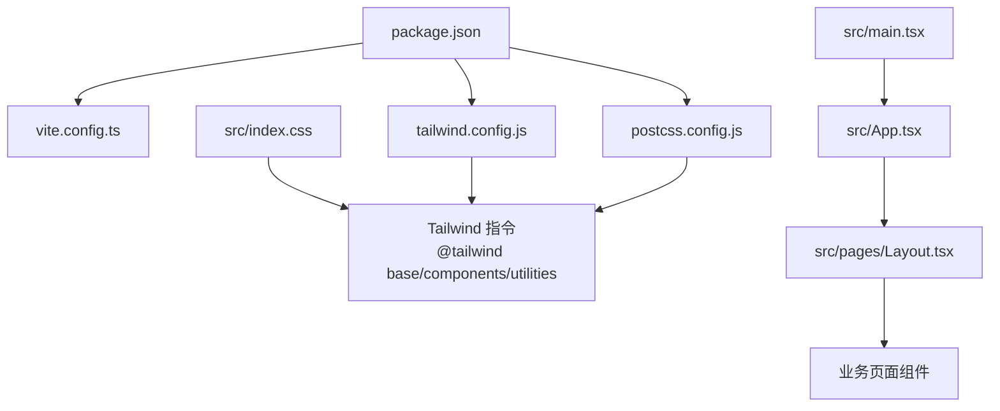
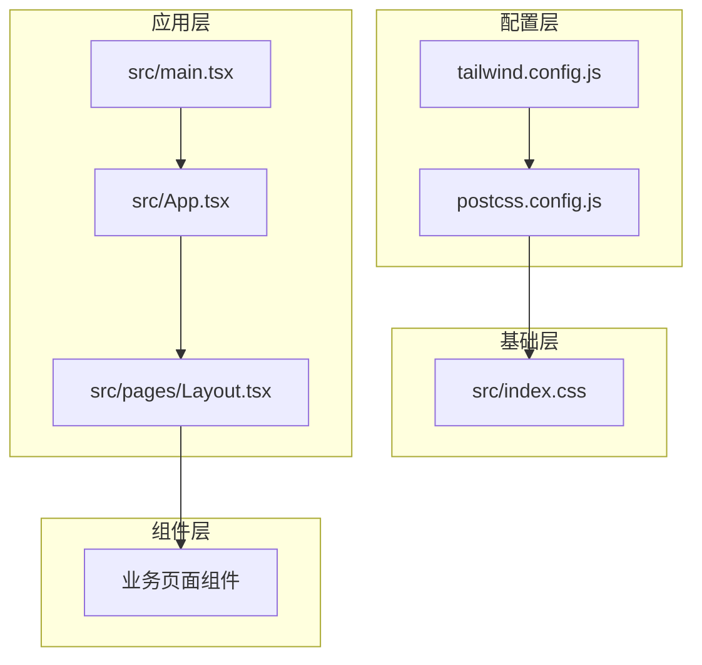
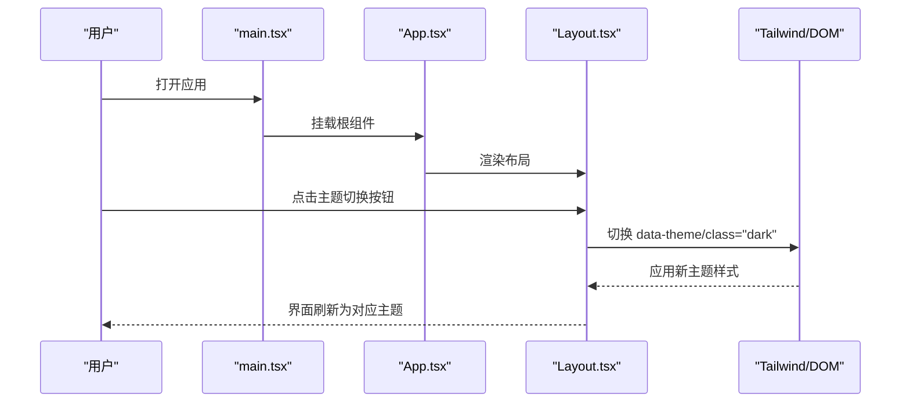
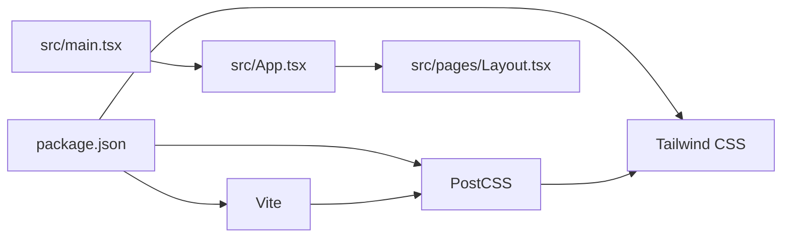

# 样式与主题

<cite>
**本文引用的文件**   
- [tailwind.config.js](file://dip-system/frontend-web/tailwind.config.js)
- [postcss.config.js](file://dip-system/frontend-web/postcss.config.js)
- [index.css](file://dip-system/frontend-web/src/index.css)
- [main.tsx](file://dip-system/frontend-web/src/main.tsx)
- [App.tsx](file://dip-system/frontend-web/src/App.tsx)
- [Layout.tsx](file://dip-system/frontend-web/src/pages/Layout.tsx)
- [package.json](file://dip-system/frontend-web/package.json)
</cite>

## 目录
1. [简介](#简介)
2. [项目结构](#项目结构)
3. [核心组件](#核心组件)
4. [架构总览](#架构总览)
5. [详细组件分析](#详细组件分析)
6. [依赖分析](#依赖分析)
7. [性能考虑](#性能考虑)
8. [故障排查指南](#故障排查指南)
9. [结论](#结论)
10. [附录](#附录)

## 简介
本章节面向DIP系统Web前端的样式与主题体系，聚焦Tailwind CSS的配置与使用、CSS架构组织、样式复用与隔离、暗色模式与多主题切换、动态样式生成、移动端适配、浏览器兼容性、性能优化以及开发规范与调试技巧。文档旨在帮助开发者快速理解并高效扩展前端样式系统。

## 项目结构
前端位于 dip-system/frontend-web 目录，关键样式与主题相关文件如下：
- tailwind.config.js：Tailwind配置（主题色、字体、断点、插件等）
- postcss.config.js：PostCSS构建链配置（Tailwind、Autoprefixer等）
- src/index.css：全局样式入口（导入Tailwind、自定义基础样式）
- src/main.tsx：应用启动入口（挂载根组件）
- src/App.tsx：应用根组件（路由与布局容器）
- src/pages/Layout.tsx：页面布局组件（侧边栏/顶栏/内容区）
- package.json：依赖与脚本（Vite、Tailwind、PostCSS等）

图表来源
- [package.json](file://dip-system/frontend-web/package.json)
- [tailwind.config.js](file://dip-system/frontend-web/tailwind.config.js)
- [postcss.config.js](file://dip-system/frontend-web/postcss.config.js)
- [index.css](file://dip-system/frontend-web/src/index.css)
- [main.tsx](file://dip-system/frontend-web/src/main.tsx)
- [App.tsx](file://dip-system/frontend-web/src/App.tsx)
- [Layout.tsx](file://dip-system/frontend-web/src/pages/Layout.tsx)

小节来源
- [package.json](file://dip-system/frontend-web/package.json)
- [tailwind.config.js](file://dip-system/frontend-web/tailwind.config.js)
- [postcss.config.js](file://dip-system/frontend-web/postcss.config.js)
- [index.css](file://dip-system/frontend-web/src/index.css)
- [main.tsx](file://dip-system/frontend-web/src/main.tsx)
- [App.tsx](file://dip-system/frontend-web/src/App.tsx)
- [Layout.tsx](file://dip-system/frontend-web/src/pages/Layout.tsx)

## 核心组件
- Tailwind配置中心：通过 tailwind.config.js 集中管理颜色、字体、间距、圆角、阴影、动画、响应式断点、深色模式开关等。
- PostCSS构建链：postcss.config.js 串联 Tailwind、Autoprefixer、CSS变量处理等，确保跨浏览器兼容与按需生成。
- 全局样式入口：src/index.css 统一引入Tailwind指令与基础重置，作为样式树根节点。
- 应用入口与布局：src/main.tsx 挂载应用；src/App.tsx 组织路由与主题上下文；src/pages/Layout.tsx 提供统一的页面骨架与主题切换入口。

小节来源
- [tailwind.config.js](file://dip-system/frontend-web/tailwind.config.js)
- [postcss.config.js](file://dip-system/frontend-web/postcss.config.js)
- [index.css](file://dip-system/frontend-web/src/index.css)
- [main.tsx](file://dip-system/frontend-web/src/main.tsx)
- [App.tsx](file://dip-system/frontend-web/src/App.tsx)
- [Layout.tsx](file://dip-system/frontend-web/src/pages/Layout.tsx)

## 架构总览
整体样式架构遵循“配置驱动 + 原子化类名 + 组件隔离”的模式：
- 配置层：tailwind.config.js 定义设计令牌（颜色、字体、断点、动效等），PostCSS层负责编译与兼容。
- 基础层：index.css 注入Tailwind基础样式与全局重置。
- 组件层：各页面与UI组件通过Tailwind原子类组合实现样式，必要时在组件内维护最小化的局部样式。
- 主题层：通过数据属性或类名切换（如 dark: 前缀）实现暗色模式与多主题切换，由顶层布局或状态管理驱动。

图表来源
- [tailwind.config.js](file://dip-system/frontend-web/tailwind.config.js)
- [postcss.config.js](file://dip-system/frontend-web/postcss.config.js)
- [index.css](file://dip-system/frontend-web/src/index.css)
- [main.tsx](file://dip-system/frontend-web/src/main.tsx)
- [App.tsx](file://dip-system/frontend-web/src/App.tsx)
- [Layout.tsx](file://dip-system/frontend-web/src/pages/Layout.tsx)

## 详细组件分析

### Tailwind配置与主题色
- 主题色：在配置中扩展默认调色板，定义品牌主色、辅助色、语义色（成功/警告/错误等），并通过命名空间统一管理。
- 字体：注册企业字体族与回退栈，保证可读性与一致性。
- 断点：根据产品需求定制响应式断点，覆盖手机、平板、桌面端。
- 深色模式：启用 data 属性驱动的暗色模式，便于与系统设置或用户偏好联动。
- 插件：按需引入常用插件（如 forms、typography、container-queries等）增强能力。

小节来源
- [tailwind.config.js](file://dip-system/frontend-web/tailwind.config.js)

### PostCSS构建链
- 插件顺序：Tailwind → Autoprefixer → 其他（如CSS变量处理）。
- 兼容性：通过Autoprefixer自动补齐浏览器前缀，确保跨端一致。
- 构建产物：Vite集成PostCSS，支持热更新与增量编译。

小节来源
- [postcss.config.js](file://dip-system/frontend-web/postcss.config.js)

### 全局样式入口
- 指令导入：在 index.css 中按顺序引入 @tailwind base/components/utilities，确保样式优先级正确。
- 基础重置：可在此处添加全局重置、滚动条样式、打印样式等。
- 主题变量：将设计令牌以CSS变量形式暴露，供运行时动态替换。

小节来源
- [index.css](file://dip-system/frontend-web/src/index.css)

### 应用入口与主题切换流程
- 启动流程：main.tsx 初始化应用并挂载到DOM。
- 根组件：App.tsx 组织路由、主题上下文与全局状态。
- 布局组件：Layout.tsx 提供侧边栏/顶栏/内容区，并在顶部暴露主题切换控件。
- 切换机制：通过切换 data-theme 或 class="dark" 触发Tailwind的暗色模式与主题变量更新。

图表来源
- [main.tsx](file://dip-system/frontend-web/src/main.tsx)
- [App.tsx](file://dip-system/frontend-web/src/App.tsx)
- [Layout.tsx](file://dip-system/frontend-web/src/pages/Layout.tsx)
- [tailwind.config.js](file://dip-system/frontend-web/tailwind.config.js)

### 组件样式隔离与复用策略
- 原子类优先：尽量使用Tailwind原子类组合，避免重复CSS。
- 组件级样式：仅在必要处使用组件内样式，限制作用域，避免污染全局。
- 设计令牌：通过Tailwind配置与CSS变量抽象通用样式（颜色、字号、间距），提升复用性。
- 命名约定：采用BEM或功能前缀（如 btn-primary、card-header）保持清晰与可维护性。

小节来源
- [tailwind.config.js](file://dip-system/frontend-web/tailwind.config.js)
- [index.css](file://dip-system/frontend-web/src/index.css)

### 暗色模式与多主题切换
- 暗色模式：启用 data 属性驱动，结合系统偏好与用户选择进行切换。
- 多主题：通过 data-theme 值映射不同配色方案，配合CSS变量实现运行时替换。
- 持久化：将主题偏好存储于 localStorage，应用启动时恢复。

小节来源
- [tailwind.config.js](file://dip-system/frontend-web/tailwind.config.js)
- [index.css](file://dip-system/frontend-web/src/index.css)
- [Layout.tsx](file://dip-system/frontend-web/src/pages/Layout.tsx)

### 移动端适配与响应式
- 断点策略：基于 tailwind.config.js 中的断点，使用 sm/md/lg/xl 等类名控制布局。
- 弹性布局：优先使用Flex/Grid，结合 gap、p、m 等原子类快速搭建。
- 触摸友好：增大点击区域、合理行高与字号，提升移动端体验。

小节来源
- [tailwind.config.js](file://dip-system/frontend-web/tailwind.config.js)

### 浏览器兼容性处理
- Autoprefixer：自动补齐厂商前缀，覆盖主流浏览器。
- Polyfill：按需引入必要的JS polyfill（如 Promise、fetch）。
- 降级策略：对不支持特性提供优雅降级（如 container-queries 回退到媒体查询）。

小节来源
- [postcss.config.js](file://dip-system/frontend-web/postcss.config.js)

### 动态样式生成
- CSS变量：通过JS修改CSS变量实现运行时主题切换。
- 条件类名：根据状态动态拼接Tailwind类名，减少冗余样式。
- 按需加载：利用Vite与Tailwind扫描机制，仅生成使用的样式。

小节来源
- [tailwind.config.js](file://dip-system/frontend-web/tailwind.config.js)
- [index.css](file://dip-system/frontend-web/src/index.css)

## 依赖分析
- Vite：构建与开发服务器，集成PostCSS与Tailwind。
- Tailwind CSS：原子化样式框架，提供丰富的实用类。
- PostCSS：样式预处理链，包含Autoprefixer等插件。
- React生态：main.tsx与App.tsx基于React构建应用。

图表来源
- [package.json](file://dip-system/frontend-web/package.json)
- [postcss.config.js](file://dip-system/frontend-web/postcss.config.js)
- [tailwind.config.js](file://dip-system/frontend-web/tailwind.config.js)
- [main.tsx](file://dip-system/frontend-web/src/main.tsx)
- [App.tsx](file://dip-system/frontend-web/src/App.tsx)
- [Layout.tsx](file://dip-system/frontend-web/src/pages/Layout.tsx)

小节来源
- [package.json](file://dip-system/frontend-web/package.json)
- [postcss.config.js](file://dip-system/frontend-web/postcss.config.js)
- [tailwind.config.js](file://dip-system/frontend-web/tailwind.config.js)

## 性能考虑
- 按需生成：Tailwind扫描模板与样式文件，仅输出使用的类，减小体积。
- 缓存策略：Vite与浏览器缓存CSS，提升二次加载速度。
- 资源压缩：生产构建启用CSS压缩与Tree Shaking。
- 懒加载：页面与组件按需加载，减少首屏压力。
- 动画优化：合理使用 transform/opacity，避免重排重绘。

[本节为通用指导，不直接分析具体文件]

## 故障排查指南
- 样式未生效：检查 index.css 是否正确导入Tailwind指令；确认Tailwind扫描路径包含模板文件。
- 暗色模式无效：确认已启用 data 属性驱动；检查 data-theme 或 class="dark" 是否被正确设置。
- 断点不生效：核对 tailwind.config.js 中的断点配置；检查类名是否与预期匹配。
- 兼容性问题：查看 postcss.config.js 中Autoprefixer配置；确认目标浏览器范围。
- 构建缓慢：检查是否有大量未使用的样式；优化Tailwind扫描范围与插件顺序。

小节来源
- [index.css](file://dip-system/frontend-web/src/index.css)
- [tailwind.config.js](file://dip-system/frontend-web/tailwind.config.js)
- [postcss.config.js](file://dip-system/frontend-web/postcss.config.js)

## 结论
本样式与主题体系以Tailwind为核心，结合PostCSS与Vite构建链，实现了高度可配置、易扩展、高性能的前端样式解决方案。通过统一的设计令牌、清晰的架构分层与严格的开发规范，团队可高效协作并持续演进主题与组件库。

[本节为总结性内容，不直接分析具体文件]

## 附录
- 样式开发规范
  - 优先使用Tailwind原子类，避免手写CSS。
  - 组件内样式最小化，限制作用域。
  - 命名遵循功能前缀或BEM，保持一致性。
- 调试技巧
  - 使用浏览器开发者工具检查 computed styles 与 Tailwind 类命中情况。
  - 开启Tailwind IntelliSense与VS Code插件提升效率。
  - 通过控制台修改 data-theme 或 class="dark" 快速验证主题效果。
- 主题定制指南
  - 在 tailwind.config.js 中扩展颜色、字体、断点与动效。
  - 通过CSS变量暴露设计令牌，支持运行时切换。
  - 在 Layout.tsx 中提供主题切换入口，并持久化用户偏好。

[本节为通用指导，不直接分析具体文件]