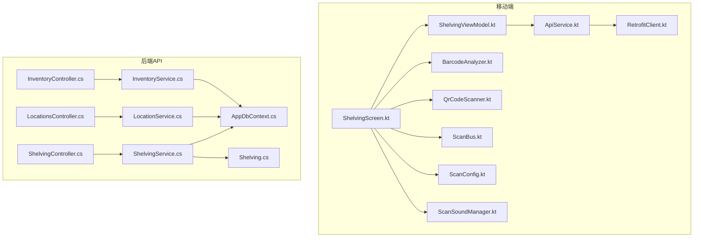
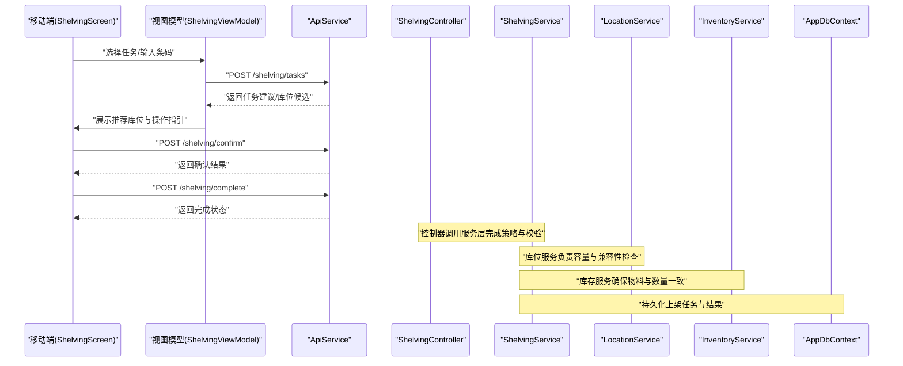
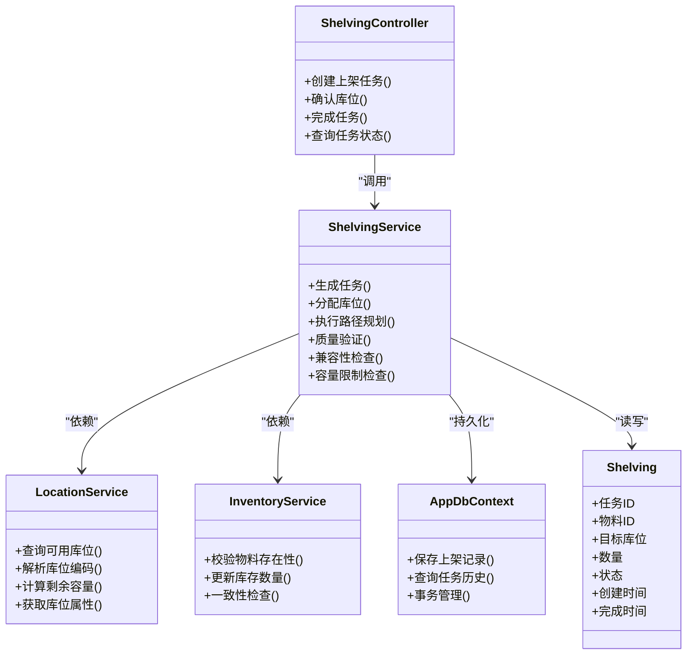
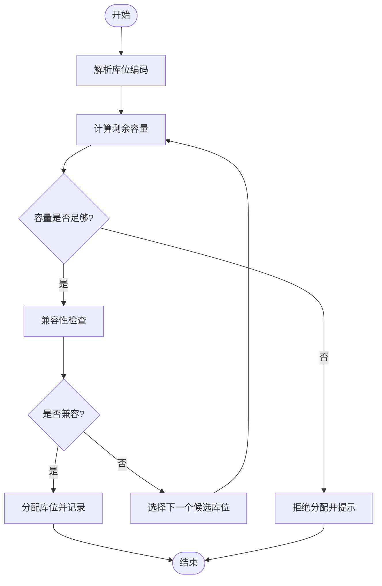
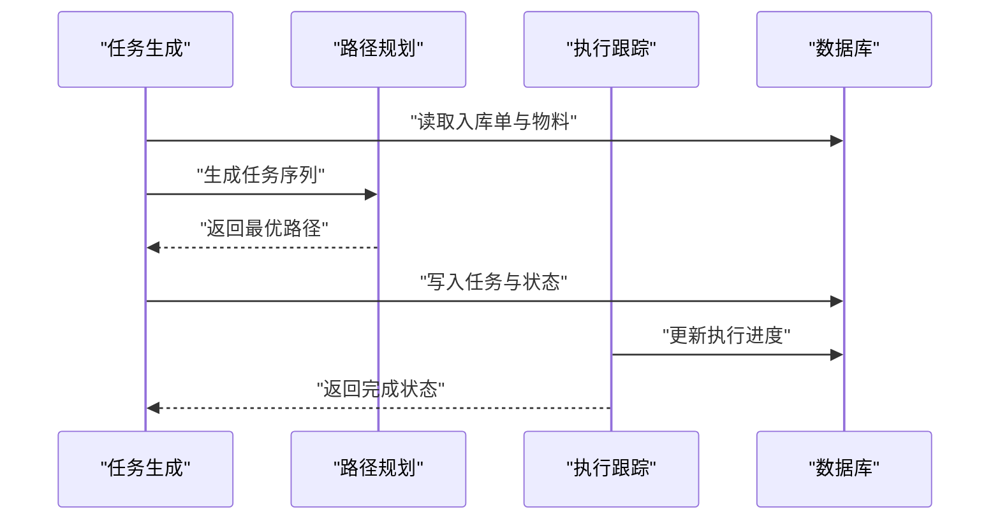
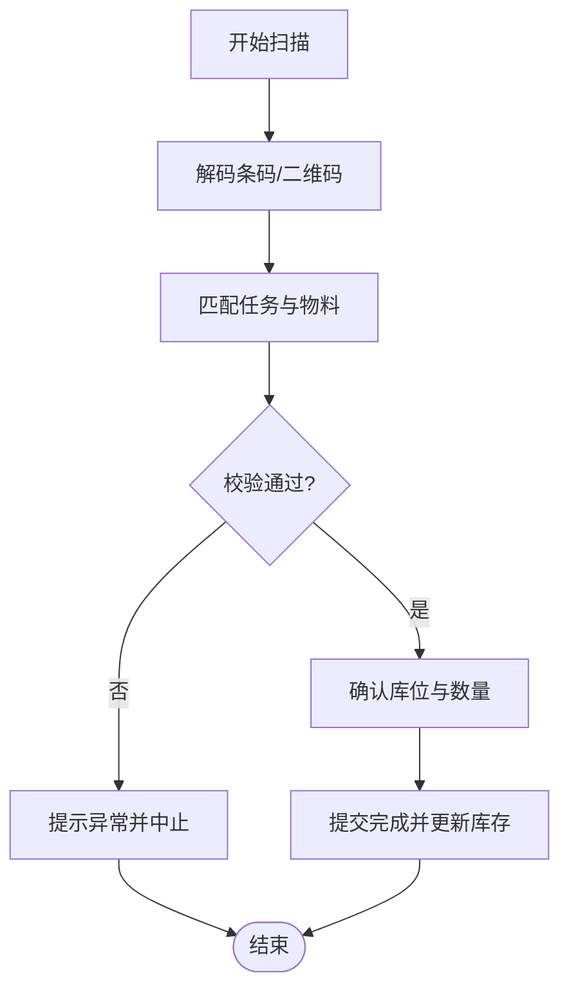
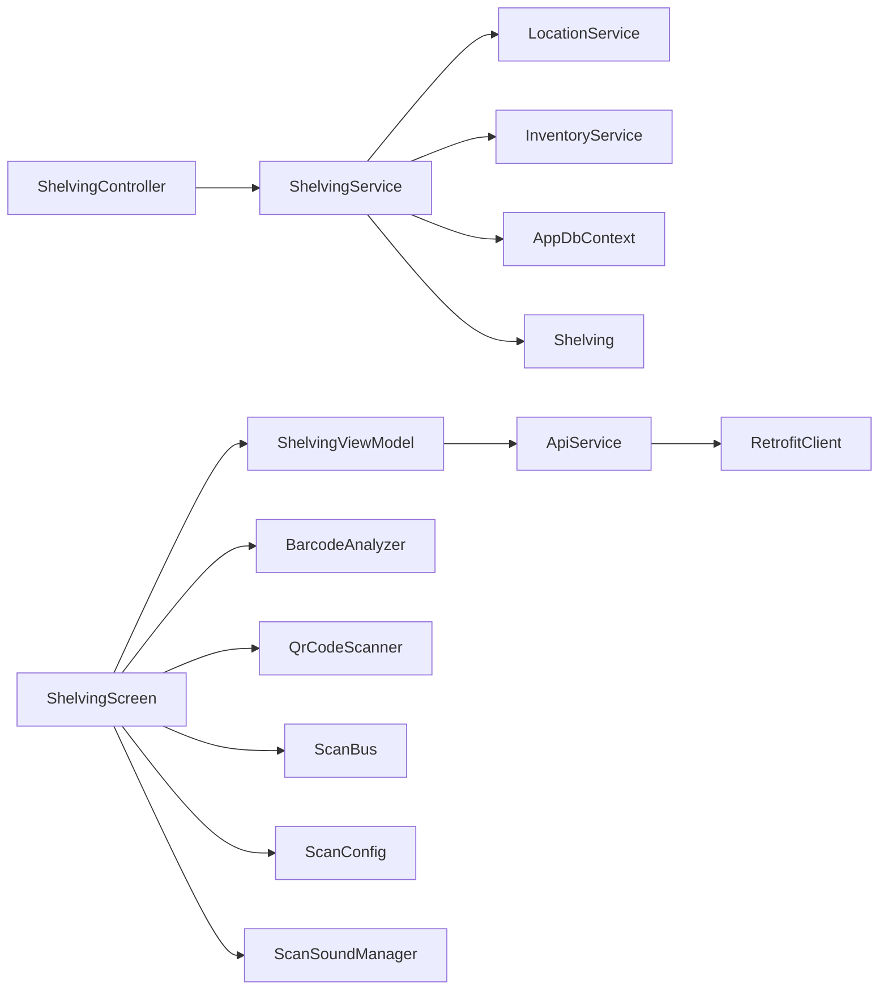

# 上架管理页面

<cite>
**本文引用的文件**   
- [ShelvingController.cs](file://dip-system/api/Controllers/ShelvingController.cs)
- [ShelvingService.cs](file://dip-system/api/Services/ShelvingService.cs)
- [Shelving.cs](file://dip-system/api/Models/Shelving.cs)
- [LocationService.cs](file://dip-system/api/Services/LocationService.cs)
- [LocationsController.cs](file://dip-system/api/Controllers/LocationsController.cs)
- [InventoryService.cs](file://dip-system/api/Services/InventoryService.cs)
- [InventoryController.cs](file://dip-system/api/Controllers/InventoryController.cs)
- [AppDbContext.cs](file://dip-system/api/Data/AppDbContext.cs)
- [ShelvingScreen.kt](file://mobile-android/app/src/main/java/com/dip/material/ui/shelving/ShelvingScreen.kt)
- [ShelvingViewModel.kt](file://mobile-android/app/src/main/java/com/dip/material/ui/shelving/ShelvingViewModel.kt)
- [ApiService.kt](file://mobile-android/app/src/main/java/com/dip/material/data/network/ApiService.kt)
- [RetrofitClient.kt](file://mobile-android/app/src/main/java/com/dip/material/data/network/RetrofitClient.kt)
- [BarcodeAnalyzer.kt](file://mobile-android/app/src/main/java/com/dip/material/ui/components/BarcodeAnalyzer.kt)
- [QrCodeScanner.kt](file://mobile-android/app/src/main/java/com/dip/material/ui/components/QrCodeScanner.kt)
- [ScanBus.kt](file://mobile-android/app/src/main/java/com/dip/material/utils/ScanBus.kt)
- [ScanConfig.kt](file://mobile-android/app/src/main/java/com/dip/material/utils/ScanConfig.kt)
- [ScanSoundManager.kt](file://mobile-android/app/src/main/java/com/dip/material/utils/ScanSoundManager.kt)
- [2026-07-09-shelving-redesign.md](file://docs/superpowers/specs/2026-07-09-shelving-redesign.md)
- [2026-07-09-shelving-redesign-plan.md](file://docs/superpowers/plans/2026-07-09-shelving-redesign-plan.md)
</cite>

## 目录
1. [简介](#简介)
2. [项目结构](#项目结构)
3. [核心组件](#核心组件)
4. [架构总览](#架构总览)
5. [详细组件分析](#详细组件分析)
6. [依赖关系分析](#依赖关系分析)
7. [性能考虑](#性能考虑)
8. [故障排查指南](#故障排查指南)
9. [结论](#结论)
10. [附录](#附录)

## 简介
本文件面向DIP系统的“上架管理”功能，覆盖物料入库后的上架策略、库位分配与位置优化算法、上架任务生成与执行跟踪、路径规划、库位编码规则与容量限制、兼容性检查、质量验证、条码扫描与实物核对、库位利用率分析与热力图展示、智能推荐，以及与WMS系统集成、RFID识别和自动化立库设备对接等。文档以代码级为依据，结合前后端实现进行系统化说明，帮助读者快速理解并正确使用该模块。

## 项目结构
上架管理涉及后端API控制器与服务层、数据模型与数据库上下文、移动端界面与扫描能力，以及设计规格与计划文档。关键文件分布如下：
- 后端API与控制层：ShelvingController、LocationsController、InventoryController
- 服务层：ShelvingService、LocationService、InventoryService
- 数据模型与上下文：Shelving、AppDbContext
- 前端（Web）：相关页面由路由与通用组件构成（本仓库中未直接提供上架页面源码）
- 移动端（Android）：ShelvingScreen、ShelvingViewModel、ApiService、RetrofitClient、扫码组件与工具
- 设计文档：上架重构设计与计划

图表来源
- [ShelvingScreen.kt](file://mobile-android/app/src/main/java/com/dip/material/ui/shelving/ShelvingScreen.kt)
- [ShelvingViewModel.kt](file://mobile-android/app/src/main/java/com/dip/material/ui/shelving/ShelvingViewModel.kt)
- [ApiService.kt](file://mobile-android/app/src/main/java/com/dip/material/data/network/ApiService.kt)
- [RetrofitClient.kt](file://mobile-android/app/src/main/java/com/dip/material/data/network/RetrofitClient.kt)
- [BarcodeAnalyzer.kt](file://mobile-android/app/src/main/java/com/dip/material/ui/components/BarcodeAnalyzer.kt)
- [QrCodeScanner.kt](file://mobile-android/app/src/main/java/com/dip/material/ui/components/QrCodeScanner.kt)
- [ScanBus.kt](file://mobile-android/app/src/main/java/com/dip/material/utils/ScanBus.kt)
- [ScanConfig.kt](file://mobile-android/app/src/main/java/com/dip/material/utils/ScanConfig.kt)
- [ScanSoundManager.kt](file://mobile-android/app/src/main/java/com/dip/material/utils/ScanSoundManager.kt)
- [ShelvingController.cs](file://dip-system/api/Controllers/ShelvingController.cs)
- [LocationsController.cs](file://dip-system/api/Controllers/LocationsController.cs)
- [InventoryController.cs](file://dip-system/api/Controllers/InventoryController.cs)
- [ShelvingService.cs](file://dip-system/api/Services/ShelvingService.cs)
- [LocationService.cs](file://dip-system/api/Services/LocationService.cs)
- [InventoryService.cs](file://dip-system/api/Services/InventoryService.cs)
- [AppDbContext.cs](file://dip-system/api/Data/AppDbContext.cs)
- [Shelving.cs](file://dip-system/api/Models/Shelving.cs)

章节来源
- [ShelvingController.cs](file://dip-system/api/Controllers/ShelvingController.cs)
- [ShelvingService.cs](file://dip-system/api/Services/ShelvingService.cs)
- [Shelving.cs](file://dip-system/api/Models/Shelving.cs)
- [LocationService.cs](file://dip-system/api/Services/LocationService.cs)
- [LocationsController.cs](file://dip-system/api/Controllers/LocationsController.cs)
- [InventoryService.cs](file://dip-system/api/Services/InventoryService.cs)
- [InventoryController.cs](file://dip-system/api/Controllers/InventoryController.cs)
- [AppDbContext.cs](file://dip-system/api/Data/AppDbContext.cs)
- [ShelvingScreen.kt](file://mobile-android/app/src/main/java/com/dip/material/ui/shelving/ShelvingScreen.kt)
- [ShelvingViewModel.kt](file://mobile-android/app/src/main/java/com/dip/material/ui/shelving/ShelvingViewModel.kt)
- [ApiService.kt](file://mobile-android/app/src/main/java/com/dip/material/data/network/ApiService.kt)
- [RetrofitClient.kt](file://mobile-android/app/src/main/java/com/dip/material/data/network/RetrofitClient.kt)
- [BarcodeAnalyzer.kt](file://mobile-android/app/src/main/java/com/dip/material/ui/components/BarcodeAnalyzer.kt)
- [QrCodeScanner.kt](file://mobile-android/app/src/main/java/com/dip/material/ui/components/QrCodeScanner.kt)
- [ScanBus.kt](file://mobile-android/app/src/main/java/com/dip/material/utils/ScanBus.kt)
- [ScanConfig.kt](file://mobile-android/app/src/main/java/com/dip/material/utils/ScanConfig.kt)
- [ScanSoundManager.kt](file://mobile-android/app/src/main/java/com/dip/material/utils/ScanSoundManager.kt)

## 核心组件
- 上架控制器（ShelvingController）：暴露上架相关的REST接口，接收前端或移动端的请求，调用服务层完成业务逻辑。
- 上架服务（ShelvingService）：封装上架策略、库位分配、任务生成与状态跟踪、质量验证、条码校验、兼容性检查等核心算法与流程。
- 库位服务（LocationService）：负责库位查询、容量计算、编码规则解析与校验、库位属性与兼容性判断。
- 库存服务（InventoryService）：维护物料库存信息，支持入库后库存更新与一致性校验。
- 数据模型（Shelving）：定义上架记录、任务状态、关联物料与库位等数据结构。
- 数据库上下文（AppDbContext）：配置实体映射、事务与查询优化点。
- 移动端界面（ShelvingScreen/ViewModel）：提供上架任务列表、扫码输入、结果反馈与操作引导。
- 网络层（ApiService/RetrofitClient）：统一HTTP客户端与接口定义，处理认证与错误。
- 扫码与硬件集成（BarcodeAnalyzer/QrCodeScanner/ScanBus/ScanConfig/ScanSoundManager）：采集条码/二维码、广播事件、声音提示与配置管理。

章节来源
- [ShelvingController.cs](file://dip-system/api/Controllers/ShelvingController.cs)
- [ShelvingService.cs](file://dip-system/api/Services/ShelvingService.cs)
- [LocationService.cs](file://dip-system/api/Services/LocationService.cs)
- [InventoryService.cs](file://dip-system/api/Services/InventoryService.cs)
- [Shelving.cs](file://dip-system/api/Models/Shelving.cs)
- [AppDbContext.cs](file://dip-system/api/Data/AppDbContext.cs)
- [ShelvingScreen.kt](file://mobile-android/app/src/main/java/com/dip/material/ui/shelving/ShelvingScreen.kt)
- [ShelvingViewModel.kt](file://mobile-android/app/src/main/java/com/dip/material/ui/shelving/ShelvingViewModel.kt)
- [ApiService.kt](file://mobile-android/app/src/main/java/com/dip/material/data/network/ApiService.kt)
- [RetrofitClient.kt](file://mobile-android/app/src/main/java/com/dip/material/data/network/RetrofitClient.kt)
- [BarcodeAnalyzer.kt](file://mobile-android/app/src/main/java/com/dip/material/ui/components/BarcodeAnalyzer.kt)
- [QrCodeScanner.kt](file://mobile-android/app/src/main/java/com/dip/material/ui/components/QrCodeScanner.kt)
- [ScanBus.kt](file://mobile-android/app/src/main/java/com/dip/material/utils/ScanBus.kt)
- [ScanConfig.kt](file://mobile-android/app/src/main/java/com/dip/material/utils/ScanConfig.kt)
- [ScanSoundManager.kt](file://mobile-android/app/src/main/java/com/dip/material/utils/ScanSoundManager.kt)

## 架构总览
上架管理的端到端流程如下：
- 移动端发起上架任务请求（包含物料条码、数量、目标区域等）。
- 后端控制器接收请求，交由服务层进行策略计算与库位分配。
- 服务层调用库位服务与库存服务，完成容量检查、兼容性校验与库存一致性验证。
- 生成上架任务记录，返回任务ID与推荐库位给移动端。
- 移动端根据推荐库位进行实物放置，并通过扫码与质量验证确认。
- 完成后提交结果，后端更新库存与库位占用，并记录执行轨迹。

图表来源
- [ShelvingScreen.kt](file://mobile-android/app/src/main/java/com/dip/material/ui/shelving/ShelvingScreen.kt)
- [ShelvingViewModel.kt](file://mobile-android/app/src/main/java/com/dip/material/ui/shelving/ShelvingViewModel.kt)
- [ApiService.kt](file://mobile-android/app/src/main/java/com/dip/material/data/network/ApiService.kt)
- [ShelvingController.cs](file://dip-system/api/Controllers/ShelvingController.cs)
- [ShelvingService.cs](file://dip-system/api/Services/ShelvingService.cs)
- [LocationService.cs](file://dip-system/api/Services/LocationService.cs)
- [InventoryService.cs](file://dip-system/api/Services/InventoryService.cs)
- [AppDbContext.cs](file://dip-system/api/Data/AppDbContext.cs)

## 详细组件分析

### 上架控制器与服务层
- ShelvingController：提供创建任务、确认库位、完成任务等接口；参数校验、权限控制与异常处理在此层完成。
- ShelvingService：实现上架策略（如就近原则、同批次优先、温度/湿度要求）、库位分配算法（容量评估、兼容性矩阵）、任务状态机（待分配、已分配、执行中、已完成、失败）、路径规划（按库区顺序与最短路径启发式）、质量验证（条码匹配、数量核对、外观检查标记）。

图表来源
- [ShelvingController.cs](file://dip-system/api/Controllers/ShelvingController.cs)
- [ShelvingService.cs](file://dip-system/api/Services/ShelvingService.cs)
- [LocationService.cs](file://dip-system/api/Services/LocationService.cs)
- [InventoryService.cs](file://dip-system/api/Services/InventoryService.cs)
- [AppDbContext.cs](file://dip-system/api/Data/AppDbContext.cs)
- [Shelving.cs](file://dip-system/api/Models/Shelving.cs)

章节来源
- [ShelvingController.cs](file://dip-system/api/Controllers/ShelvingController.cs)
- [ShelvingService.cs](file://dip-system/api/Services/ShelvingService.cs)
- [LocationService.cs](file://dip-system/api/Services/LocationService.cs)
- [InventoryService.cs](file://dip-system/api/Services/InventoryService.cs)
- [AppDbContext.cs](file://dip-system/api/Data/AppDbContext.cs)
- [Shelving.cs](file://dip-system/api/Models/Shelving.cs)

### 库位编码规则、容量限制与兼容性检查
- 库位编码规则：采用分层编码（区域-通道-货架-层-格），便于空间定位与可视化展示；解析器用于提取层级信息。
- 容量限制：每个库位具有最大承载重量/体积与件数上限；分配前需计算剩余容量并拒绝超限请求。
- 兼容性检查：基于物料属性（如温湿度、危险品等级、批次有效期）与库位属性进行匹配；不兼容则跳过候选库位。

图表来源
- [LocationService.cs](file://dip-system/api/Services/LocationService.cs)
- [ShelvingService.cs](file://dip-system/api/Services/ShelvingService.cs)

章节来源
- [LocationService.cs](file://dip-system/api/Services/LocationService.cs)
- [ShelvingService.cs](file://dip-system/api/Services/ShelvingService.cs)

### 上架任务生成、路径规划与执行跟踪
- 任务生成：根据入库单与物料清单生成上架任务，设定优先级（如紧急订单优先、近效期优先）。
- 路径规划：按库区顺序与最短路径启发式生成执行序列，减少搬运距离与交叉路径。
- 执行跟踪：记录任务状态流转（待分配→已分配→执行中→已完成/失败），支持实时查询与审计。

图表来源
- [ShelvingService.cs](file://dip-system/api/Services/ShelvingService.cs)
- [AppDbContext.cs](file://dip-system/api/Data/AppDbContext.cs)

章节来源
- [ShelvingService.cs](file://dip-system/api/Services/ShelvingService.cs)
- [AppDbContext.cs](file://dip-system/api/Data/AppDbContext.cs)

### 质量验证、条码扫描与实物核对
- 质量验证：在确认与完成阶段进行条码匹配、数量核对、外观检查标记；不一致时触发异常流程。
- 条码扫描：移动端通过BarcodeAnalyzer与QrCodeScanner采集条码/二维码，ScanBus广播扫描结果，ScanConfig管理扫描参数，ScanSoundManager提供声音反馈。
- 实物核对：将扫描结果与系统任务信息进行比对，确保“单-物-位”一致。

图表来源
- [BarcodeAnalyzer.kt](file://mobile-android/app/src/main/java/com/dip/material/ui/components/BarcodeAnalyzer.kt)
- [QrCodeScanner.kt](file://mobile-android/app/src/main/java/com/dip/material/ui/components/QrCodeScanner.kt)
- [ScanBus.kt](file://mobile-android/app/src/main/java/com/dip/material/utils/ScanBus.kt)
- [ScanConfig.kt](file://mobile-android/app/src/main/java/com/dip/material/utils/ScanConfig.kt)
- [ScanSoundManager.kt](file://mobile-android/app/src/main/java/com/dip/material/utils/ScanSoundManager.kt)
- [ShelvingViewModel.kt](file://mobile-android/app/src/main/java/com/dip/material/ui/shelving/ShelvingViewModel.kt)
- [ShelvingService.cs](file://dip-system/api/Services/ShelvingService.cs)

章节来源
- [BarcodeAnalyzer.kt](file://mobile-android/app/src/main/java/com/dip/material/ui/components/BarcodeAnalyzer.kt)
- [QrCodeScanner.kt](file://mobile-android/app/src/main/java/com/dip/material/ui/components/QrCodeScanner.kt)
- [ScanBus.kt](file://mobile-android/app/src/main/java/com/dip/material/utils/ScanBus.kt)
- [ScanConfig.kt](file://mobile-android/app/src/main/java/com/dip/material/utils/ScanConfig.kt)
- [ScanSoundManager.kt](file://mobile-android/app/src/main/java/com/dip/material/utils/ScanSoundManager.kt)
- [ShelvingViewModel.kt](file://mobile-android/app/src/main/java/com/dip/material/ui/shelving/ShelvingViewModel.kt)
- [ShelvingService.cs](file://dip-system/api/Services/ShelvingService.cs)

### 库位利用率分析、热力图与智能推荐
- 利用率分析：统计各库区/货架的占用率与周转率，输出利用率报表。
- 热力图展示：基于库位占用密度生成热力图，辅助人工与自动化调度。
- 智能推荐：结合历史数据与实时库存，推荐高命中率库位，提升拣货效率。

章节来源
- [LocationService.cs](file://dip-system/api/Services/LocationService.cs)
- [ShelvingService.cs](file://dip-system/api/Services/ShelvingService.cs)

### 与WMS系统集成、RFID识别与自动化立库设备对接
- WMS集成：通过标准接口同步出入库单据、库存快照与任务状态，保证数据一致性。
- RFID识别：在入库与上架环节使用RFID标签批量读取，提高作业效率与准确性。
- 自动化立库：对接堆垛机、输送线与AGV，自动执行库位分配与搬运任务。

章节来源
- [ShelvingService.cs](file://dip-system/api/Services/ShelvingService.cs)
- [ApiService.kt](file://mobile-android/app/src/main/java/com/dip/material/data/network/ApiService.kt)
- [RetrofitClient.kt](file://mobile-android/app/src/main/java/com/dip/material/data/network/RetrofitClient.kt)

## 依赖关系分析
- 控制器依赖服务层，服务层依赖库位与库存服务，最终通过数据库上下文持久化。
- 移动端通过ApiService与RetrofitClient访问后端接口，扫码组件与工具类为交互提供支撑。

图表来源
- [ShelvingController.cs](file://dip-system/api/Controllers/ShelvingController.cs)
- [ShelvingService.cs](file://dip-system/api/Services/ShelvingService.cs)
- [LocationService.cs](file://dip-system/api/Services/LocationService.cs)
- [InventoryService.cs](file://dip-system/api/Services/InventoryService.cs)
- [AppDbContext.cs](file://dip-system/api/Data/AppDbContext.cs)
- [Shelving.cs](file://dip-system/api/Models/Shelving.cs)
- [ShelvingScreen.kt](file://mobile-android/app/src/main/java/com/dip/material/ui/shelving/ShelvingScreen.kt)
- [ShelvingViewModel.kt](file://mobile-android/app/src/main/java/com/dip/material/ui/shelving/ShelvingViewModel.kt)
- [ApiService.kt](file://mobile-android/app/src/main/java/com/dip/material/data/network/ApiService.kt)
- [RetrofitClient.kt](file://mobile-android/app/src/main/java/com/dip/material/data/network/RetrofitClient.kt)
- [BarcodeAnalyzer.kt](file://mobile-android/app/src/main/java/com/dip/material/ui/components/BarcodeAnalyzer.kt)
- [QrCodeScanner.kt](file://mobile-android/app/src/main/java/com/dip/material/ui/components/QrCodeScanner.kt)
- [ScanBus.kt](file://mobile-android/app/src/main/java/com/dip/material/utils/ScanBus.kt)
- [ScanConfig.kt](file://mobile-android/app/src/main/java/com/dip/material/utils/ScanConfig.kt)
- [ScanSoundManager.kt](file://mobile-android/app/src/main/java/com/dip/material/utils/ScanSoundManager.kt)

章节来源
- [ShelvingController.cs](file://dip-system/api/Controllers/ShelvingController.cs)
- [ShelvingService.cs](file://dip-system/api/Services/ShelvingService.cs)
- [LocationService.cs](file://dip-system/api/Services/LocationService.cs)
- [InventoryService.cs](file://dip-system/api/Services/InventoryService.cs)
- [AppDbContext.cs](file://dip-system/api/Data/AppDbContext.cs)
- [Shelving.cs](file://dip-system/api/Models/Shelving.cs)
- [ShelvingScreen.kt](file://mobile-android/app/src/main/java/com/dip/material/ui/shelving/ShelvingScreen.kt)
- [ShelvingViewModel.kt](file://mobile-android/app/src/main/java/com/dip/material/ui/shelving/ShelvingViewModel.kt)
- [ApiService.kt](file://mobile-android/app/src/main/java/com/dip/material/data/network/ApiService.kt)
- [RetrofitClient.kt](file://mobile-android/app/src/main/java/com/dip/material/data/network/RetrofitClient.kt)
- [BarcodeAnalyzer.kt](file://mobile-android/app/src/main/java/com/dip/material/ui/components/BarcodeAnalyzer.kt)
- [QrCodeScanner.kt](file://mobile-android/app/src/main/java/com/dip/material/ui/components/QrCodeScanner.kt)
- [ScanBus.kt](file://mobile-android/app/src/main/java/com/dip/material/utils/ScanBus.kt)
- [ScanConfig.kt](file://mobile-android/app/src/main/java/com/dip/material/utils/ScanConfig.kt)
- [ScanSoundManager.kt](file://mobile-android/app/src/main/java/com/dip/material/utils/ScanSoundManager.kt)

## 性能考虑
- 库位分配算法复杂度：建议在大规模库位场景下使用索引与缓存，降低查询与计算开销。
- 并发控制：上架任务应加锁避免重复分配同一库位，确保事务一致性。
- 扫描与I/O：移动端扫码结果应去重与节流，减少无效请求；后端对高频接口进行限流与异步处理。
- 数据分页与懒加载：任务列表与库位查询采用分页与按需加载，提升响应速度。

[本节为通用指导，无需特定文件引用]

## 故障排查指南
- 常见错误：
  - 库位容量不足：检查库位剩余容量与物料尺寸/重量。
  - 兼容性冲突：核对物料属性与库位环境要求。
  - 条码不匹配：确认扫描内容与系统任务一致。
  - 任务状态异常：查看任务历史与执行日志。
- 调试建议：
  - 启用详细日志，记录分配过程与校验结果。
  - 使用测试数据模拟边界条件（满库、零库存、异常条码）。
  - 移动端检查扫描配置与声音提示是否正常。

章节来源
- [ShelvingService.cs](file://dip-system/api/Services/ShelvingService.cs)
- [LocationService.cs](file://dip-system/api/Services/LocationService.cs)
- [ShelvingViewModel.kt](file://mobile-android/app/src/main/java/com/dip/material/ui/shelving/ShelvingViewModel.kt)

## 结论
上架管理模块通过清晰的分层架构与完善的校验机制，实现了从任务生成到执行跟踪的全流程管理。库位编码、容量限制与兼容性检查保障了库内秩序与安全；条码扫描与质量验证提升了准确率；利用率分析与智能推荐优化了作业效率。通过与WMS、RFID与自动化立库的集成，系统具备扩展性与智能化潜力。

[本节为总结，无需特定文件引用]

## 附录
- 设计参考：
  - [2026-07-09-shelving-redesign.md](file://docs/superpowers/specs/2026-07-09-shelving-redesign.md)
  - [2026-07-09-shelving-redesign-plan.md](file://docs/superpowers/plans/2026-07-09-shelving-redesign-plan.md)

章节来源
- [2026-07-09-shelving-redesign.md](file://docs/superpowers/specs/2026-07-09-shelving-redesign.md)
- [2026-07-09-shelving-redesign-plan.md](file://docs/superpowers/plans/2026-07-09-shelving-redesign-plan.md)