# 业务操作页面

<cite>
**本文引用的文件**   
- [AbnormalController.cs](file://dip-system/api/Controllers/AbnormalController.cs)
- [AbnormalService.cs](file://dip-system/api/Services/AbnormalService.cs)
- [Abnormal.cs](file://dip-system/api/Models/Abnormal.cs)
- [MaterialRequestController.cs](file://dip-system/api/Controllers/MaterialRequestController.cs)
- [MaterialRequestService.cs](file://dip-system/api/Services/MaterialRequestService.cs)
- [MaterialRequest.cs](file://dip-system/api/Models/MaterialRequest.cs)
- [ChangeoverController.cs](file://dip-system/api/Controllers/ChangeoverController.cs)
- [ChangeoverService.cs](file://dip-system/api/Services/ChangeoverService.cs)
- [Changeover.cs](file://dip-system/api/Models/Changeover.cs)
- [OnlineController.cs](file://dip-system/api/Controllers/OnlineController.cs)
- [OnlineService.cs](file://dip-system/api/Services/OnlineService.cs)
- [Online.cs](file://dip-system/api/Models/Online.cs)
- [OutboundController.cs](file://dip-system/api/Controllers/OutboundController.cs)
- [OutboundService.cs](file://dip-system/api/Services/OutboundService.cs)
- [Outbound.cs](file://dip-system/api/Models/Outbound.cs)
- [PrepController.cs](file://dip-system/api/Controllers/PrepController.cs)
- [PrepService.cs](file://dip-system/api/Services/PrepService.cs)
- [Prep.cs](file://dip-system/api/Models/Prep.cs)
- [RefillController.cs](file://dip-system/api/Controllers/RefillController.cs)
- [RefillService.cs](file://dip-system/api/Services/RefillService.cs)
- [Refill.cs](file://dip-system/api/Models/Refill.cs)
- [ReturnController.cs](file://dip-system/api/Controllers/ReturnController.cs)
- [ReturnService.cs](file://dip-system/api/Services/ReturnService.cs)
- [Return.cs](file://dip-system/api/Models/Return.cs)
- [ShelvingController.cs](file://dip-system/api/Controllers/ShelvingController.cs)
- [ShelvingService.cs](file://dip-system/api/Services/ShelvingService.cs)
- [Shelving.cs](file://dip-system/api/Models/Shelving.cs)
- [SubstituteController.cs](file://dip-system/api/Controllers/SubstituteController.cs)
- [SubstituteService.cs](file://dip-system/api/Services/SubstituteService.cs)
- [SubstituteOrder.cs](file://dip-system/api/Models/SubstituteOrder.cs)
- [SubstituteRecord.cs](file://dip-system/api/Models/SubstituteRecord.cs)
- [AppExceptionFilter.cs](file://dip-system/api/Controllers/AppExceptionFilter.cs)
- [ApiResponse.cs](file://dip-system/api/Models/ApiResponse.cs)
- [AuthController.cs](file://dip-system/api/Controllers/AuthController.cs)
- [AuthService.cs](file://dip-system/api/Services/AuthService.cs)
- [JwtTokenService.cs](file://dip-system/api/Services/JwtTokenService.cs)
- [ApiService.kt](file://mobile-android/app/src/main/java/com/dip/material/data/network/ApiService.kt)
- [RetrofitClient.kt](file://mobile-android/app/src/main/java/com/dip/material/data/network/RetrofitClient.kt)
- [AuthInterceptor.kt](file://mobile-android/app/src/main/java/com/dip/material/data/network/AuthInterceptor.kt)
- [CallMaterialScreen.kt](file://mobile-android/app/src/main/java/com/dip/material/ui/callmaterial/CallMaterialScreen.kt)
- [CallMaterialViewModel.kt](file://mobile-android/app/src/main/java/com/dip/material/ui/callmaterial/CallMaterialViewModel.kt)
- [ChangeoverScreen.kt](file://mobile-android/app/src/main/java/com/dip/material/ui/changeover/ChangeoverScreen.kt)
- [ChangeoverViewModel.kt](file://mobile-android/app/src/main/java/com/dip/material/ui/changeover/ChangeoverViewModel.kt)
- [OnlineScreen.kt](file://mobile-android/app/src/main/java/com/dip/material/ui/online/OnlineScreen.kt)
- [OnlineViewModel.kt](file://mobile-android/app/src/main/java/com/dip/material/ui/online/OnlineViewModel.kt)
- [OutboundScreen.kt](file://mobile-android/app/src/main/java/com/dip/material/ui/outbound/OutboundScreen.kt)
- [OutboundViewModel.kt](file://mobile-android/app/src/main/java/com/dip/material/ui/outbound/OutboundViewModel.kt)
- [PrepScreen.kt](file://mobile-android/app/src/main/java/com/dip/material/ui/prep/PrepScreen.kt)
- [PrepViewModel.kt](file://mobile-android/app/src/main/java/com/dip/material/ui/prep/PrepViewModel.kt)
- [RefillScreen.kt](file://mobile-android/app/src/main/java/com/dip/material/ui/refill/RefillScreen.kt)
- [RefillViewModel.kt](file://mobile-android/app/src/main/java/com/dip/material/ui/refill/RefillViewModel.kt)
- [ReturnScreen.kt](file://mobile-android/app/src/main/java/com/dip/material/ui/return_/ReturnScreen.kt)
- [ReturnViewModel.kt](file://mobile-android/app/src/main/java/com/dip/material/ui/return_/ReturnViewModel.kt)
- [ShelvingScreen.kt](file://mobile-android/app/src/main/java/com/dip/material/ui/shelving/ShelvingScreen.kt)
- [ShelvingViewModel.kt](file://mobile-android/app/src/main/java/com/dip/material/ui/shelving/ShelvingViewModel.kt)
- [SubstituteScreen.kt](file://mobile-android/app/src/main/java/com/dip/material/ui/substitute/SubstituteScreen.kt)
- [SubstituteViewModel.kt](file://mobile-android/app/src/main/java/com/dip/material/ui/substitute/SubstituteViewModel.kt)
- [QrCodeScanner.kt](file://mobile-android/app/src/main/java/com/dip/material/ui/components/QrCodeScanner.kt)
- [BarcodeAnalyzer.kt](file://mobile-android/app/src/main/java/com/dip/material/ui/components/BarcodeAnalyzer.kt)
- [ScanBus.kt](file://mobile-android/app/src/main/java/com/dip/material/utils/ScanBus.kt)
- [ScanConfig.kt](file://mobile-android/app/src/main/java/com/dip/material/utils/ScanConfig.kt)
- [ScanSoundManager.kt](file://mobile-android/app/src/main/java/com/dip/material/utils/ScanSoundManager.kt)
- [ScanBroadcastReceiver.kt](file://mobile-android/app/src/main/java/com/dip/material/utils/ScanBroadcastReceiver.kt)
- [AppRepository.kt](file://mobile-android/app/src/main/java/com/dip/material/data/repository/AppRepository.kt)
- [AppException.kt](file://dip-system/api/Services/AppException.cs)
- [AppDbContext.cs](file://dip-system/api/Data/AppDbContext.cs)
</cite>

## 目录
1. [引言](#引言)
2. [项目结构](#项目结构)
3. [核心组件](#核心组件)
4. [架构总览](#架构总览)
5. [详细组件分析](#详细组件分析)
6. [依赖关系分析](#依赖关系分析)
7. [性能考量](#性能考量)
8. [故障排查指南](#故障排查指南)
9. [结论](#结论)
10. [附录](#附录)

## 引言
本文件面向DIP系统的业务操作相关页面，覆盖异常管理、物料呼叫、换线管理、在线监控、出库管理、备料管理、补料管理、退货管理、上架管理和替代管理等核心功能。文档从前后端实现出发，阐述各页面的工作流设计、状态机管理与业务规则验证；并说明扫码集成、PDA设备兼容性与离线数据处理方案；同时给出批量操作、模板导入与自动化流程配置建议，以及业务异常处理、数据一致性保证和性能优化策略。

## 项目结构
系统采用“后端API + Web前端 + 移动端（Android）”的三层架构：
- 后端API（C#）：按领域划分控制器与服务层，提供统一的REST接口与统一响应封装。
- Web前端（React/Vite）：面向PC端的列表、表单与审批操作。
- 移动端（Kotlin/Android）：面向PDA设备的扫码、作业执行与离线缓存。

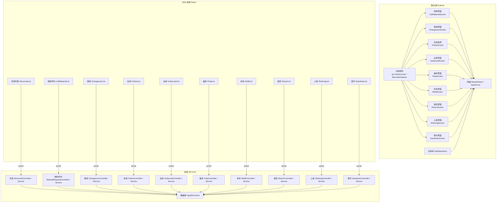

**图表来源** 
- [CallMaterialScreen.kt](file://mobile-android/app/src/main/java/com/dip/material/ui/callmaterial/CallMaterialScreen.kt)
- [ChangeoverScreen.kt](file://mobile-android/app/src/main/java/com/dip/material/ui/changeover/ChangeoverScreen.kt)
- [OnlineScreen.kt](file://mobile-android/app/src/main/java/com/dip/material/ui/online/OnlineScreen.kt)
- [OutboundScreen.kt](file://mobile-android/app/src/main/java/com/dip/material/ui/outbound/OutboundScreen.kt)
- [PrepScreen.kt](file://mobile-android/app/src/main/java/com/dip/material/ui/prep/PrepScreen.kt)
- [RefillScreen.kt](file://mobile-android/app/src/main/java/com/dip/material/ui/refill/RefillScreen.kt)
- [ReturnScreen.kt](file://mobile-android/app/src/main/java/com/dip/material/ui/return_/ReturnScreen.kt)
- [ShelvingScreen.kt](file://mobile-android/app/src/main/java/com/dip/material/ui/shelving/ShelvingScreen.kt)
- [SubstituteScreen.kt](file://mobile-android/app/src/main/java/com/dip/material/ui/substitute/SubstituteScreen.kt)
- [QrCodeScanner.kt](file://mobile-android/app/src/main/java/com/dip/material/ui/components/QrCodeScanner.kt)
- [BarcodeAnalyzer.kt](file://mobile-android/app/src/main/java/com/dip/material/ui/components/BarcodeAnalyzer.kt)
- [ApiService.kt](file://mobile-android/app/src/main/java/com/dip/material/data/network/ApiService.kt)
- [RetrofitClient.kt](file://mobile-android/app/src/main/java/com/dip/material/data/network/RetrofitClient.kt)
- [AbnormalController.cs](file://dip-system/api/Controllers/AbnormalController.cs)
- [MaterialRequestController.cs](file://dip-system/api/Controllers/MaterialRequestController.cs)
- [ChangeoverController.cs](file://dip-system/api/Controllers/ChangeoverController.cs)
- [OnlineController.cs](file://dip-system/api/Controllers/OnlineController.cs)
- [OutboundController.cs](file://dip-system/api/Controllers/OutboundController.cs)
- [PrepController.cs](file://dip-system/api/Controllers/PrepController.cs)
- [RefillController.cs](file://dip-system/api/Controllers/RefillController.cs)
- [ReturnController.cs](file://dip-system/api/Controllers/ReturnController.cs)
- [ShelvingController.cs](file://dip-system/api/Controllers/ShelvingController.cs)
- [SubstituteController.cs](file://dip-system/api/Controllers/SubstituteController.cs)
- [AppDbContext.cs](file://dip-system/api/Data/AppDbContext.cs)

**章节来源**
- [AppDbContext.cs](file://dip-system/api/Data/AppDbContext.cs)
- [ApiService.kt](file://mobile-android/app/src/main/java/com/dip/material/data/network/ApiService.kt)
- [RetrofitClient.kt](file://mobile-android/app/src/main/java/com/dip/material/data/network/RetrofitClient.kt)

## 核心组件
- 控制器层：每个业务域一个控制器，暴露REST接口，负责参数校验、权限控制与结果封装。
- 服务层：承载业务逻辑、事务边界、状态流转与规则校验。
- 模型层：实体定义与DTO映射，支撑数据持久化与接口契约。
- 移动端：以屏幕+ViewModel组织交互，结合扫码组件与网络库完成数据采集与提交。
- Web前端：列表与表单页面，通过HTTP访问后端API。

**章节来源**
- [AbnormalController.cs](file://dip-system/api/Controllers/AbnormalController.cs)
- [AbnormalService.cs](file://dip-system/api/Services/AbnormalService.cs)
- [Abnormal.cs](file://dip-system/api/Models/Abnormal.cs)
- [MaterialRequestController.cs](file://dip-system/api/Controllers/MaterialRequestController.cs)
- [MaterialRequestService.cs](file://dip-system/api/Services/MaterialRequestService.cs)
- [MaterialRequest.cs](file://dip-system/api/Models/MaterialRequest.cs)
- [ChangeoverController.cs](file://dip-system/api/Controllers/ChangeoverController.cs)
- [ChangeoverService.cs](file://dip-system/api/Services/ChangeoverService.cs)
- [Changeover.cs](file://dip-system/api/Models/Changeover.cs)
- [OnlineController.cs](file://dip-system/api/Controllers/OnlineController.cs)
- [OnlineService.cs](file://dip-system/api/Services/OnlineService.cs)
- [Online.cs](file://dip-system/api/Models/Online.cs)
- [OutboundController.cs](file://dip-system/api/Controllers/OutboundController.cs)
- [OutboundService.cs](file://dip-system/api/Services/OutboundService.cs)
- [Outbound.cs](file://dip-system/api/Models/Outbound.cs)
- [PrepController.cs](file://dip-system/api/Controllers/PrepController.cs)
- [PrepService.cs](file://dip-system/api/Services/PrepService.cs)
- [Prep.cs](file://dip-system/api/Models/Prep.cs)
- [RefillController.cs](file://dip-system/api/Controllers/RefillController.cs)
- [RefillService.cs](file://dip-system/api/Services/RefillService.cs)
- [Refill.cs](file://dip-system/api/Models/Refill.cs)
- [ReturnController.cs](file://dip-system/api/Controllers/ReturnController.cs)
- [ReturnService.cs](file://dip-system/api/Services/ReturnService.cs)
- [Return.cs](file://dip-system/api/Models/Return.cs)
- [ShelvingController.cs](file://dip-system/api/Controllers/ShelvingController.cs)
- [ShelvingService.cs](file://dip-system/api/Services/ShelvingService.cs)
- [Shelving.cs](file://dip-system/api/Models/Shelving.cs)
- [SubstituteController.cs](file://dip-system/api/Controllers/SubstituteController.cs)
- [SubstituteService.cs](file://dip-system/api/Services/SubstituteService.cs)
- [SubstituteOrder.cs](file://dip-system/api/Models/SubstituteOrder.cs)
- [SubstituteRecord.cs](file://dip-system/api/Models/SubstituteRecord.cs)

## 架构总览
整体采用分层架构与清晰的职责分离：
- 移动端通过Retrofit发起请求，携带鉴权拦截器与统一错误处理。
- Web前端通过HTTP访问控制器，控制器委托服务层执行业务。
- 服务层维护状态机与事务，确保数据一致性与可追溯性。
- 数据库由EF Core上下文统一管理。

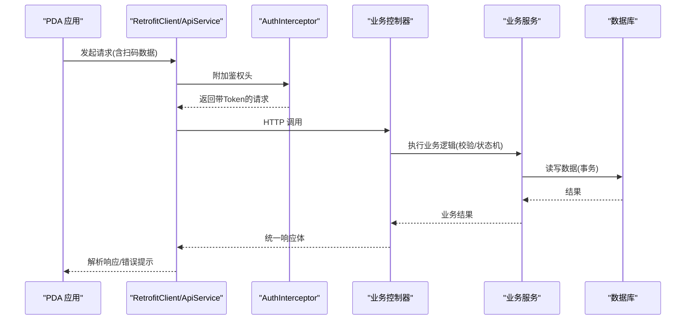

**图表来源** 
- [RetrofitClient.kt](file://mobile-android/app/src/main/java/com/dip/material/data/network/RetrofitClient.kt)
- [ApiService.kt](file://mobile-android/app/src/main/java/com/dip/material/data/network/ApiService.kt)
- [AuthInterceptor.kt](file://mobile-android/app/src/main/java/com/dip/material/data/network/AuthInterceptor.kt)
- [AuthController.cs](file://dip-system/api/Controllers/AuthController.cs)
- [AuthService.cs](file://dip-system/api/Services/AuthService.cs)
- [JwtTokenService.cs](file://dip-system/api/Services/JwtTokenService.cs)

## 详细组件分析

### 异常管理
- 工作流：创建异常单 -> 审核/处理 -> 关闭归档。支持按产线/工单筛选与批量处理。
- 状态机：草稿、待审核、处理中、已关闭、已作废。
- 规则验证：必填字段校验、责任岗位校验、关联工单有效性、处理意见必填。
- 扫码集成：扫描条码自动填充异常物料/位置信息。
- 批量操作：批量审核、批量关闭、批量导出。
- 模板导入：异常记录Excel模板导入（校验失败行回滚）。

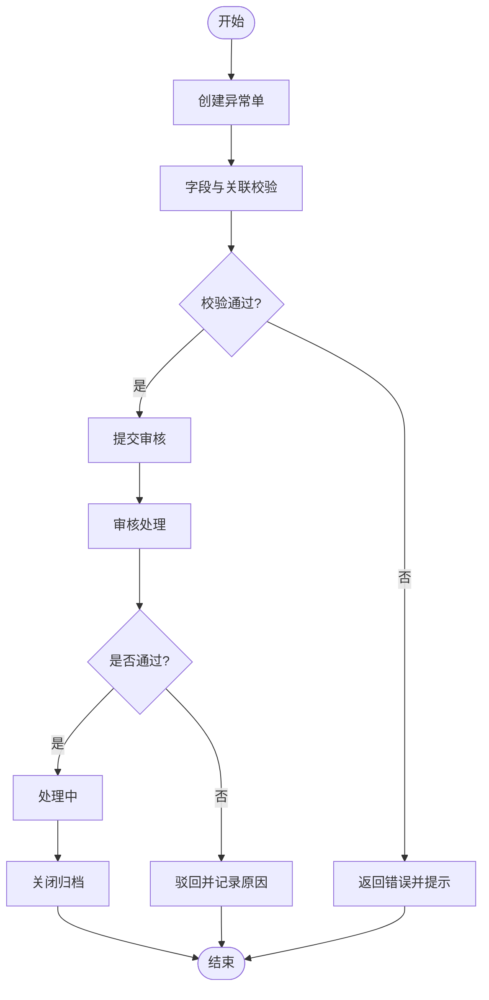

**图表来源** 
- [AbnormalController.cs](file://dip-system/api/Controllers/AbnormalController.cs)
- [AbnormalService.cs](file://dip-system/api/Services/AbnormalService.cs)
- [Abnormal.cs](file://dip-system/api/Models/Abnormal.cs)

**章节来源**
- [AbnormalController.cs](file://dip-system/api/Controllers/AbnormalController.cs)
- [AbnormalService.cs](file://dip-system/api/Services/AbnormalService.cs)
- [Abnormal.cs](file://dip-system/api/Models/Abnormal.cs)

### 物料呼叫
- 工作流：扫描工单/站点 -> 生成呼叫单 -> 仓库备料确认 -> 发料出库。
- 状态机：待备料、备料中、已备料、已发料、已取消。
- 规则验证：呼叫数量不超过库存可用量、批次有效期校验、最小包装单位校验。
- 扫码集成：扫描条码自动匹配物料与库位，减少输入错误。
- 批量操作：批量确认备料、批量打印标签。
- 自动化：按预设规则自动分配库位与拣货路径。

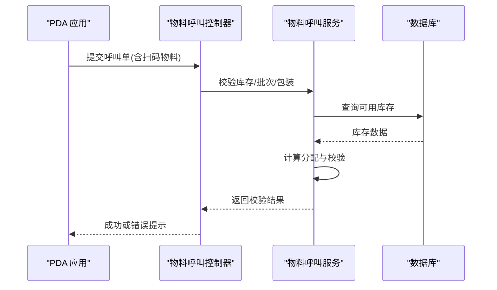

**图表来源** 
- [MaterialRequestController.cs](file://dip-system/api/Controllers/MaterialRequestController.cs)
- [MaterialRequestService.cs](file://dip-system/api/Services/MaterialRequestService.cs)
- [MaterialRequest.cs](file://dip-system/api/Models/MaterialRequest.cs)
- [CallMaterialScreen.kt](file://mobile-android/app/src/main/java/com/dip/material/ui/callmaterial/CallMaterialScreen.kt)
- [CallMaterialViewModel.kt](file://mobile-android/app/src/main/java/com/dip/material/ui/callmaterial/CallMaterialViewModel.kt)

**章节来源**
- [MaterialRequestController.cs](file://dip-system/api/Controllers/MaterialRequestController.cs)
- [MaterialRequestService.cs](file://dip-system/api/Services/MaterialRequestService.cs)
- [MaterialRequest.cs](file://dip-system/api/Models/MaterialRequest.cs)
- [CallMaterialScreen.kt](file://mobile-android/app/src/main/java/com/dip/material/ui/callmaterial/CallMaterialScreen.kt)
- [CallMaterialViewModel.kt](file://mobile-android/app/src/main/java/com/dip/material/ui/callmaterial/CallMaterialViewModel.kt)

### 换线管理
- 工作流：计划换线 -> 准备物料/工具 -> 执行换线 -> 首件确认 -> 恢复生产。
- 状态机：计划、准备中、执行中、首检中、已完成、已取消。
- 规则验证：换线时间窗口、必备物料齐套率、安全条件检查。
- 扫码集成：扫描物料/工具条码进行齐套核对。
- 批量操作：批量下发换线任务、批量确认首件。
- 自动化：根据BOM与工艺路线自动生成换线清单。

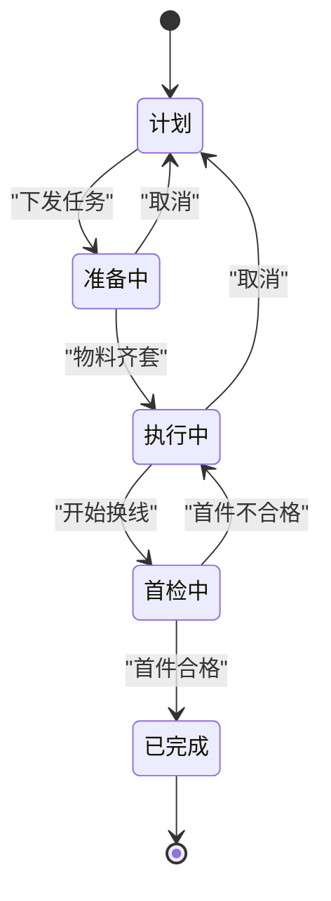

**图表来源** 
- [ChangeoverController.cs](file://dip-system/api/Controllers/ChangeoverController.cs)
- [ChangeoverService.cs](file://dip-system/api/Services/ChangeoverService.cs)
- [Changeover.cs](file://dip-system/api/Models/Changeover.cs)
- [ChangeoverScreen.kt](file://mobile-android/app/src/main/java/com/dip/material/ui/changeover/ChangeoverScreen.kt)
- [ChangeoverViewModel.kt](file://mobile-android/app/src/main/java/com/dip/material/ui/changeover/ChangeoverViewModel.kt)

**章节来源**
- [ChangeoverController.cs](file://dip-system/api/Controllers/ChangeoverController.cs)
- [ChangeoverService.cs](file://dip-system/api/Services/ChangeoverService.cs)
- [Changeover.cs](file://dip-system/api/Models/Changeover.cs)
- [ChangeoverScreen.kt](file://mobile-android/app/src/main/java/com/dip/material/ui/changeover/ChangeoverScreen.kt)
- [ChangeoverViewModel.kt](file://mobile-android/app/src/main/java/com/dip/material/ui/changeover/ChangeoverViewModel.kt)

### 在线监控
- 工作流：采集设备/工位状态 -> 实时展示 -> 告警触发 -> 处置闭环。
- 状态机：正常、预警、异常、停机、维护。
- 规则验证：阈值配置、报警级别判定、重复报警抑制。
- 扫码集成：扫描设备码快速定位与上报。
- 批量操作：批量确认告警、批量切换状态。
- 自动化：定时轮询与事件驱动混合采集。

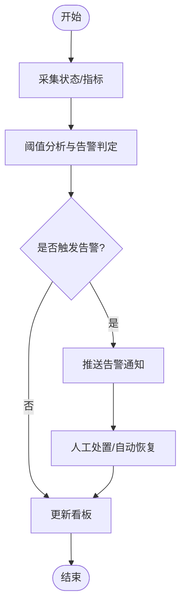

**图表来源** 
- [OnlineController.cs](file://dip-system/api/Controllers/OnlineController.cs)
- [OnlineService.cs](file://dip-system/api/Services/OnlineService.cs)
- [Online.cs](file://dip-system/api/Models/Online.cs)
- [OnlineScreen.kt](file://mobile-android/app/src/main/java/com/dip/material/ui/online/OnlineScreen.kt)
- [OnlineViewModel.kt](file://mobile-android/app/src/main/java/com/dip/material/ui/online/OnlineViewModel.kt)

**章节来源**
- [OnlineController.cs](file://dip-system/api/Controllers/OnlineController.cs)
- [OnlineService.cs](file://dip-system/api/Services/OnlineService.cs)
- [Online.cs](file://dip-system/api/Models/Online.cs)
- [OnlineScreen.kt](file://mobile-android/app/src/main/java/com/dip/material/ui/online/OnlineScreen.kt)
- [OnlineViewModel.kt](file://mobile-android/app/src/main/java/com/dip/material/ui/online/OnlineViewModel.kt)

### 出库管理
- 工作流：出库申请 -> 拣货复核 -> 打包发货 -> 过账出库。
- 状态机：待拣货、拣货中、已复核、已打包、已出库、已取消。
- 规则验证：订单完整性、批次先进先出、重量体积限制。
- 扫码集成：扫描箱码/托盘码绑定出库明细。
- 批量操作：批量拣货、批量打印面单。
- 自动化：波次拣货与路径优化。

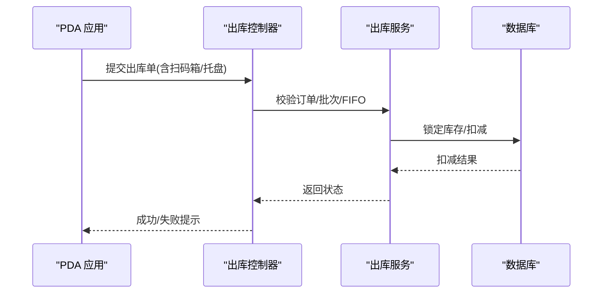

**图表来源** 
- [OutboundController.cs](file://dip-system/api/Controllers/OutboundController.cs)
- [OutboundService.cs](file://dip-system/api/Services/OutboundService.cs)
- [Outbound.cs](file://dip-system/api/Models/Outbound.cs)
- [OutboundScreen.kt](file://mobile-android/app/src/main/java/com/dip/material/ui/outbound/OutboundScreen.kt)
- [OutboundViewModel.kt](file://mobile-android/app/src/main/java/com/dip/material/ui/outbound/OutboundViewModel.kt)

**章节来源**
- [OutboundController.cs](file://dip-system/api/Controllers/OutboundController.cs)
- [OutboundService.cs](file://dip-system/api/Services/OutboundService.cs)
- [Outbound.cs](file://dip-system/api/Models/Outbound.cs)
- [OutboundScreen.kt](file://mobile-android/app/src/main/java/com/dip/material/ui/outbound/OutboundScreen.kt)
- [OutboundViewModel.kt](file://mobile-android/app/src/main/java/com/dip/material/ui/outbound/OutboundViewModel.kt)

### 备料管理
- 工作流：备料计划 -> 扫描备料 -> 差异核对 -> 确认入库。
- 状态机：计划中、备料中、差异处理、已确认、已取消。
- 规则验证：BOM齐套率、替代料规则、有效期与批次。
- 扫码集成：扫描物料条码与库位码进行防错。
- 批量操作：批量确认、批量打印备料单。
- 自动化：按工单自动拆分备料任务。

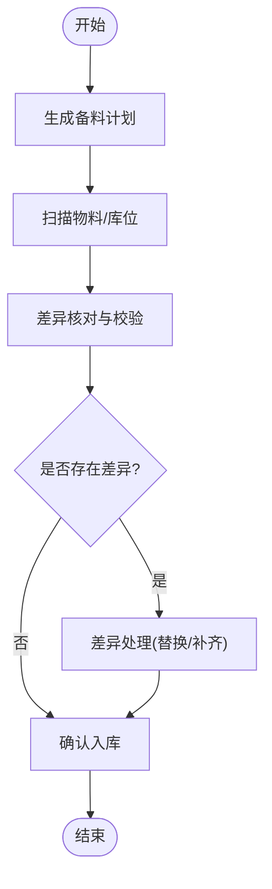

**图表来源** 
- [PrepController.cs](file://dip-system/api/Controllers/PrepController.cs)
- [PrepService.cs](file://dip-system/api/Services/PrepService.cs)
- [Prep.cs](file://dip-system/api/Models/Prep.cs)
- [PrepScreen.kt](file://mobile-android/app/src/main/java/com/dip/material/ui/prep/PrepScreen.kt)
- [PrepViewModel.kt](file://mobile-android/app/src/main/java/com/dip/material/ui/prep/PrepViewModel.kt)

**章节来源**
- [PrepController.cs](file://dip-system/api/Controllers/PrepController.cs)
- [PrepService.cs](file://dip-system/api/Services/PrepService.cs)
- [Prep.cs](file://dip-system/api/Models/Prep.cs)
- [PrepScreen.kt](file://mobile-android/app/src/main/java/com/dip/material/ui/prep/PrepScreen.kt)
- [PrepViewModel.kt](file://mobile-android/app/src/main/java/com/dip/material/ui/prep/PrepViewModel.kt)

### 补料管理
- 工作流：缺料申请 -> 审批 -> 补料执行 -> 过账。
- 状态机：待审批、已批准、执行中、已完成、已拒绝。
- 规则验证：缺料原因分类、库存可用性、成本中心归属。
- 扫码集成：扫描物料与工单号进行关联。
- 批量操作：批量审批、批量过账。
- 自动化：按历史消耗预测自动触发补料建议。

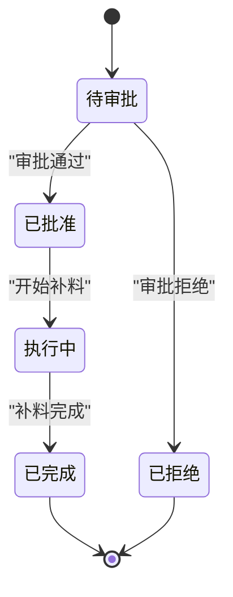

**图表来源** 
- [RefillController.cs](file://dip-system/api/Controllers/RefillController.cs)
- [RefillService.cs](file://dip-system/api/Services/RefillService.cs)
- [Refill.cs](file://dip-system/api/Models/Refill.cs)
- [RefillScreen.kt](file://mobile-android/app/src/main/java/com/dip/material/ui/refill/RefillScreen.kt)
- [RefillViewModel.kt](file://mobile-android/app/src/main/java/com/dip/material/ui/refill/RefillViewModel.kt)

**章节来源**
- [RefillController.cs](file://dip-system/api/Controllers/RefillController.cs)
- [RefillService.cs](file://dip-system/api/Services/RefillService.cs)
- [Refill.cs](file://dip-system/api/Models/Refill.cs)
- [RefillScreen.kt](file://mobile-android/app/src/main/java/com/dip/material/ui/refill/RefillScreen.kt)
- [RefillViewModel.kt](file://mobile-android/app/src/main/java/com/dip/material/ui/refill/RefillViewModel.kt)

### 退货管理
- 工作流：退货申请 -> 质检 -> 入库/报废 -> 结算。
- 状态机：待质检、质检中、已入库、已报废、已结算、已取消。
- 规则验证：退货原因、质量判定、供应商责任。
- 扫码集成：扫描退货单与物料条码。
- 批量操作：批量质检、批量入库。
- 自动化：按退货类型自动路由到不同库区。

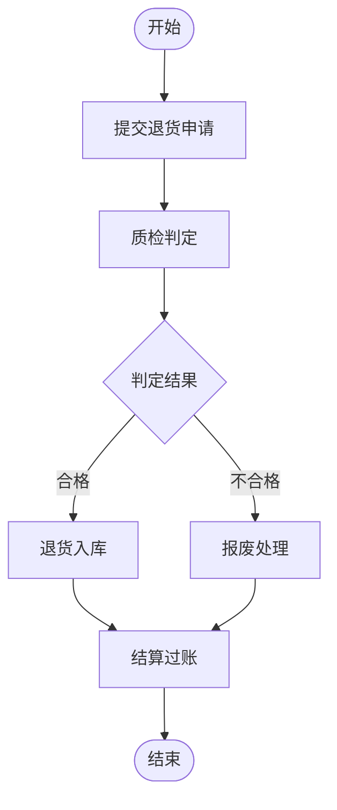

**图表来源** 
- [ReturnController.cs](file://dip-system/api/Controllers/ReturnController.cs)
- [ReturnService.cs](file://dip-system/api/Services/ReturnService.cs)
- [Return.cs](file://dip-system/api/Models/Return.cs)
- [ReturnScreen.kt](file://mobile-android/app/src/main/java/com/dip/material/ui/return_/ReturnScreen.kt)
- [ReturnViewModel.kt](file://mobile-android/app/src/main/java/com/dip/material/ui/return_/ReturnViewModel.kt)

**章节来源**
- [ReturnController.cs](file://dip-system/api/Controllers/ReturnController.cs)
- [ReturnService.cs](file://dip-system/api/Services/ReturnService.cs)
- [Return.cs](file://dip-system/api/Models/Return.cs)
- [ReturnScreen.kt](file://mobile-android/app/src/main/java/com/dip/material/ui/return_/ReturnScreen.kt)
- [ReturnViewModel.kt](file://mobile-android/app/src/main/java/com/dip/material/ui/return_/ReturnViewModel.kt)

### 上架管理
- 工作流：到货登记 -> 上架任务 -> 扫描库位 -> 确认上架。
- 状态机：待上架、上架中、已上架、已取消。
- 规则验证：库位容量、混放规则、批次隔离。
- 扫码集成：扫描库位码与物料码进行绑定。
- 批量操作：批量确认上架、批量打印标签。
- 自动化：推荐最优库位与上架路径。

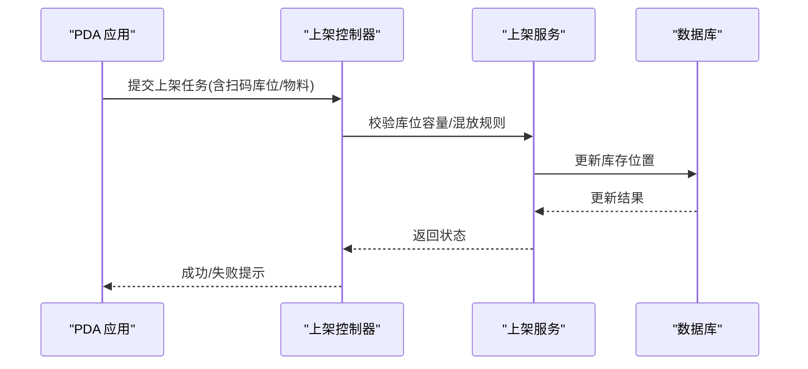

**图表来源** 
- [ShelvingController.cs](file://dip-system/api/Controllers/ShelvingController.cs)
- [ShelvingService.cs](file://dip-system/api/Services/ShelvingService.cs)
- [Shelving.cs](file://dip-system/api/Models/Shelving.cs)
- [ShelvingScreen.kt](file://mobile-android/app/src/main/java/com/dip/material/ui/shelving/ShelvingScreen.kt)
- [ShelvingViewModel.kt](file://mobile-android/app/src/main/java/com/dip/material/ui/shelving/ShelvingViewModel.kt)

**章节来源**
- [ShelvingController.cs](file://dip-system/api/Controllers/ShelvingController.cs)
- [ShelvingService.cs](file://dip-system/api/Services/ShelvingService.cs)
- [Shelving.cs](file://dip-system/api/Models/Shelving.cs)
- [ShelvingScreen.kt](file://mobile-android/app/src/main/java/com/dip/material/ui/shelving/ShelvingScreen.kt)
- [ShelvingViewModel.kt](file://mobile-android/app/src/main/java/com/dip/material/ui/shelving/ShelvingViewModel.kt)

### 替代管理
- 工作流：替代申请 -> 工程/质量审批 -> 执行替代 -> 记录追溯。
- 状态机：待审批、已批准、执行中、已完成、已拒绝。
- 规则验证：替代料资质、兼容性矩阵、批次追溯要求。
- 扫码集成：扫描原物料与替代料条码进行比对。
- 批量操作：批量审批、批量执行。
- 自动化：基于BOM与替代库自动推荐替代料。

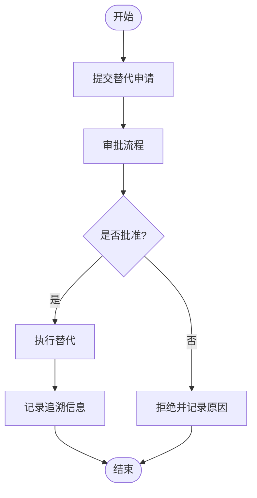

**图表来源** 
- [SubstituteController.cs](file://dip-system/api/Controllers/SubstituteController.cs)
- [SubstituteService.cs](file://dip-system/api/Services/SubstituteService.cs)
- [SubstituteOrder.cs](file://dip-system/api/Models/SubstituteOrder.cs)
- [SubstituteRecord.cs](file://dip-system/api/Models/SubstituteRecord.cs)
- [SubstituteScreen.kt](file://mobile-android/app/src/main/java/com/dip/material/ui/substitute/SubstituteScreen.kt)
- [SubstituteViewModel.kt](file://mobile-android/app/src/main/java/com/dip/material/ui/substitute/SubstituteViewModel.kt)

**章节来源**
- [SubstituteController.cs](file://dip-system/api/Controllers/SubstituteController.cs)
- [SubstituteService.cs](file://dip-system/api/Services/SubstituteService.cs)
- [SubstituteOrder.cs](file://dip-system/api/Models/SubstituteOrder.cs)
- [SubstituteRecord.cs](file://dip-system/api/Models/SubstituteRecord.cs)
- [SubstituteScreen.kt](file://mobile-android/app/src/main/java/com/dip/material/ui/substitute/SubstituteScreen.kt)
- [SubstituteViewModel.kt](file://mobile-android/app/src/main/java/com/dip/material/ui/substitute/SubstituteViewModel.kt)

### 扫码集成与PDA兼容性
- 扫码组件：QrCodeScanner与BarcodeAnalyzer提供摄像头扫码与条码解析能力。
- 广播接收：ScanBroadcastReceiver监听硬件扫码键，ScanBus分发事件。
- 配置管理：ScanConfig集中管理扫码模式、声音反馈与超时设置。
- PDA兼容：适配常见PDA品牌与Android版本，处理权限与相机生命周期。
- 离线处理：本地缓存扫码结果与操作日志，网络恢复后同步。

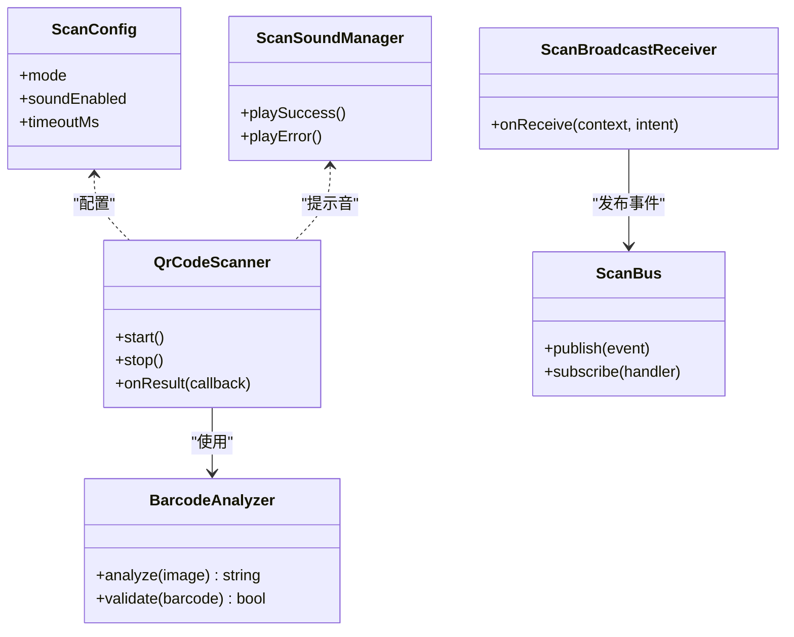

**图表来源** 
- [QrCodeScanner.kt](file://mobile-android/app/src/main/java/com/dip/material/ui/components/QrCodeScanner.kt)
- [BarcodeAnalyzer.kt](file://mobile-android/app/src/main/java/com/dip/material/ui/components/BarcodeAnalyzer.kt)
- [ScanBus.kt](file://mobile-android/app/src/main/java/com/dip/material/utils/ScanBus.kt)
- [ScanConfig.kt](file://mobile-android/app/src/main/java/com/dip/material/utils/ScanConfig.kt)
- [ScanSoundManager.kt](file://mobile-android/app/src/main/java/com/dip/material/utils/ScanSoundManager.kt)
- [ScanBroadcastReceiver.kt](file://mobile-android/app/src/main/java/com/dip/material/utils/ScanBroadcastReceiver.kt)

**章节来源**
- [QrCodeScanner.kt](file://mobile-android/app/src/main/java/com/dip/material/ui/components/QrCodeScanner.kt)
- [BarcodeAnalyzer.kt](file://mobile-android/app/src/main/java/com/dip/material/ui/components/BarcodeAnalyzer.kt)
- [ScanBus.kt](file://mobile-android/app/src/main/java/com/dip/material/utils/ScanBus.kt)
- [ScanConfig.kt](file://mobile-android/app/src/main/java/com/dip/material/utils/ScanConfig.kt)
- [ScanSoundManager.kt](file://mobile-android/app/src/main/java/com/dip/material/utils/ScanSoundManager.kt)
- [ScanBroadcastReceiver.kt](file://mobile-android/app/src/main/java/com/dip/material/utils/ScanBroadcastReceiver.kt)

### 批量操作与模板导入
- 批量操作：在控制器与服务层提供批量接口，支持批量审核、批量确认、批量过账等。
- 模板导入：后端校验导入数据格式与业务规则，失败行单独记录并返回明细。
- 并发控制：对批量写入加锁与幂等键，避免重复提交与数据竞争。
- 进度反馈：异步任务返回进度与结果汇总，便于用户跟踪。

**章节来源**
- [AbnormalController.cs](file://dip-system/api/Controllers/AbnormalController.cs)
- [MaterialRequestController.cs](file://dip-system/api/Controllers/MaterialRequestController.cs)
- [ChangeoverController.cs](file://dip-system/api/Controllers/ChangeoverController.cs)
- [OutboundController.cs](file://dip-system/api/Controllers/OutboundController.cs)
- [PrepController.cs](file://dip-system/api/Controllers/PrepController.cs)
- [RefillController.cs](file://dip-system/api/Controllers/RefillController.cs)
- [ReturnController.cs](file://dip-system/api/Controllers/ReturnController.cs)
- [ShelvingController.cs](file://dip-system/api/Controllers/ShelvingController.cs)
- [SubstituteController.cs](file://dip-system/api/Controllers/SubstituteController.cs)

### 自动化流程配置
- 规则引擎：在Service层实现可配置的业务规则（如FIFO、替代料优先级、报警阈值）。
- 任务调度：定时任务触发补料建议、在线监控采集与报表生成。
- 工作流编排：将多步骤流程拆分为可重用的子流程，便于扩展与维护。
- 审计追踪：关键操作记录审计日志，支持回溯与合规审查。

**章节来源**
- [AbnormalService.cs](file://dip-system/api/Services/AbnormalService.cs)
- [MaterialRequestService.cs](file://dip-system/api/Services/MaterialRequestService.cs)
- [ChangeoverService.cs](file://dip-system/api/Services/ChangeoverService.cs)
- [OnlineService.cs](file://dip-system/api/Services/OnlineService.cs)
- [OutboundService.cs](file://dip-system/api/Services/OutboundService.cs)
- [PrepService.cs](file://dip-system/api/Services/PrepService.cs)
- [RefillService.cs](file://dip-system/api/Services/RefillService.cs)
- [ReturnService.cs](file://dip-system/api/Services/ReturnService.cs)
- [ShelvingService.cs](file://dip-system/api/Services/ShelvingService.cs)
- [SubstituteService.cs](file://dip-system/api/Services/SubstituteService.cs)

## 依赖关系分析
- 控制器与服务解耦：控制器仅做参数校验与响应封装，复杂逻辑下沉至服务层。
- 移动端与后端契约：ApiService定义接口契约，RetrofitClient统一网络配置与拦截器。
- 数据一致性：服务层使用事务包裹关键操作，确保跨表更新的原子性。
- 鉴权与授权：AuthInterceptor注入Token，后端JWT校验用户身份与角色。

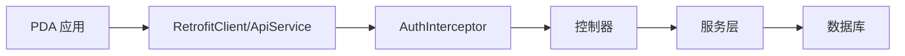

**图表来源** 
- [ApiService.kt](file://mobile-android/app/src/main/java/com/dip/material/data/network/ApiService.kt)
- [RetrofitClient.kt](file://mobile-android/app/src/main/java/com/dip/material/data/network/RetrofitClient.kt)
- [AuthInterceptor.kt](file://mobile-android/app/src/main/java/com/dip/material/data/network/AuthInterceptor.kt)
- [AuthController.cs](file://dip-system/api/Controllers/AuthController.cs)
- [AuthService.cs](file://dip-system/api/Services/AuthService.cs)
- [JwtTokenService.cs](file://dip-system/api/Services/JwtTokenService.cs)

**章节来源**
- [ApiService.kt](file://mobile-android/app/src/main/java/com/dip/material/data/network/ApiService.kt)
- [RetrofitClient.kt](file://mobile-android/app/src/main/java/com/dip/material/data/network/RetrofitClient.kt)
- [AuthInterceptor.kt](file://mobile-android/app/src/main/java/com/dip/material/data/network/AuthInterceptor.kt)
- [AuthController.cs](file://dip-system/api/Controllers/AuthController.cs)
- [AuthService.cs](file://dip-system/api/Services/AuthService.cs)
- [JwtTokenService.cs](file://dip-system/api/Services/JwtTokenService.cs)

## 性能考量
- 数据库优化：合理索引、分页查询、批量写入与事务合并。
- 网络优化：连接池、重试机制、压缩与缓存策略。
- 前端渲染：虚拟列表、懒加载与防抖处理。
- 移动端体验：后台线程处理耗时操作、UI主线程轻量更新。
- 缓存策略：热点数据本地缓存与失效策略。

[本节为通用指导，不直接分析具体文件]

## 故障排查指南
- 统一异常处理：AppExceptionFilter捕获未处理异常，返回标准错误码与消息。
- 业务异常：AppException用于抛出明确业务错误，便于前端提示与日志追踪。
- 日志记录：关键节点输出结构化日志，包含请求ID、用户信息与上下文。
- 调试建议：检查网络拦截器Token是否正确、扫码回调是否正常、事务是否回滚。

**章节来源**
- [AppExceptionFilter.cs](file://dip-system/api/Controllers/AppExceptionFilter.cs)
- [AppException.cs](file://dip-system/api/Services/AppException.cs)
- [ApiResponse.cs](file://dip-system/api/Models/ApiResponse.cs)

## 结论
本系统通过清晰的分层架构与模块化设计，实现了DIP业务操作的端到端闭环。各页面在工作流、状态机与规则验证方面具备良好扩展性；扫码集成与PDA兼容性保障了现场作业效率；批量操作、模板导入与自动化配置提升了运营效能。通过统一的异常处理与数据一致性保障，系统在稳定性与可维护性上达到较高水平。

## 附录
- 术语表：异常单、呼叫单、换线、在线监控、出库、备料、补料、退货、上架、替代。
- 参考规范：接口命名约定、错误码规范、审计日志规范。
- 部署建议：容器化部署、环境变量配置、数据库初始化脚本。

[本节为通用补充，不直接分析具体文件]