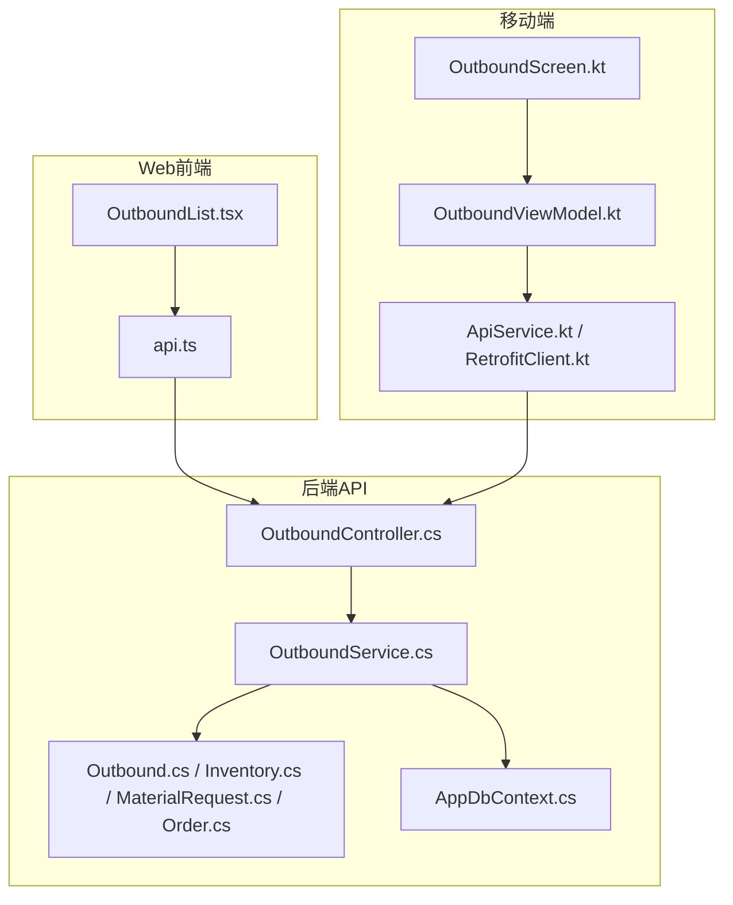
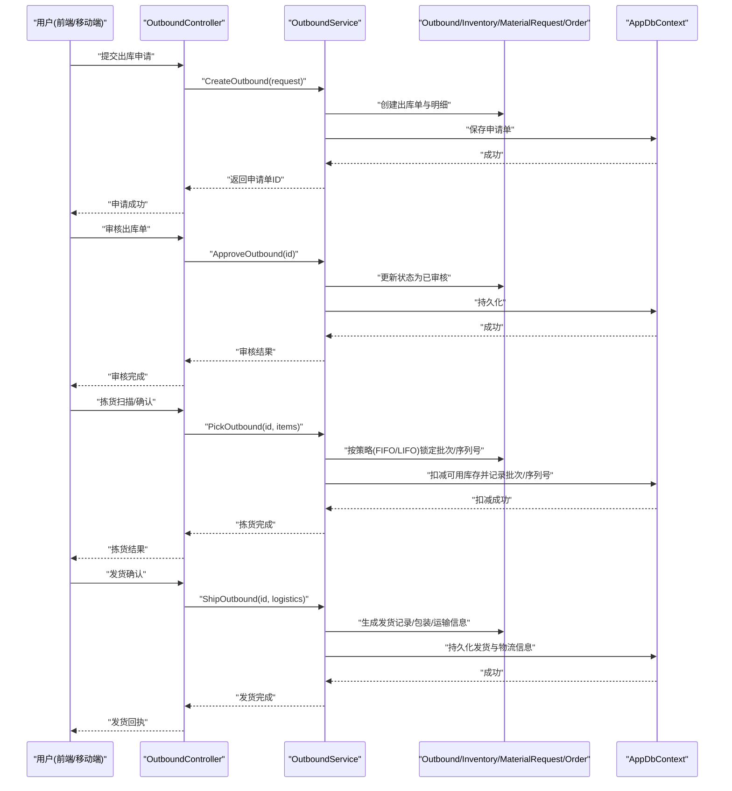
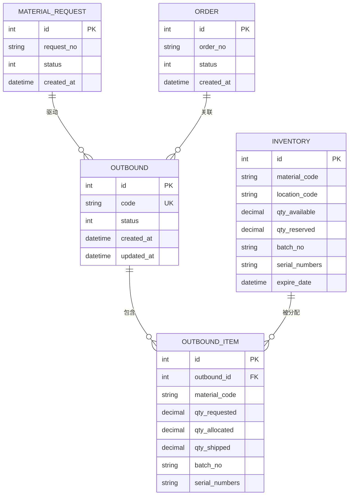
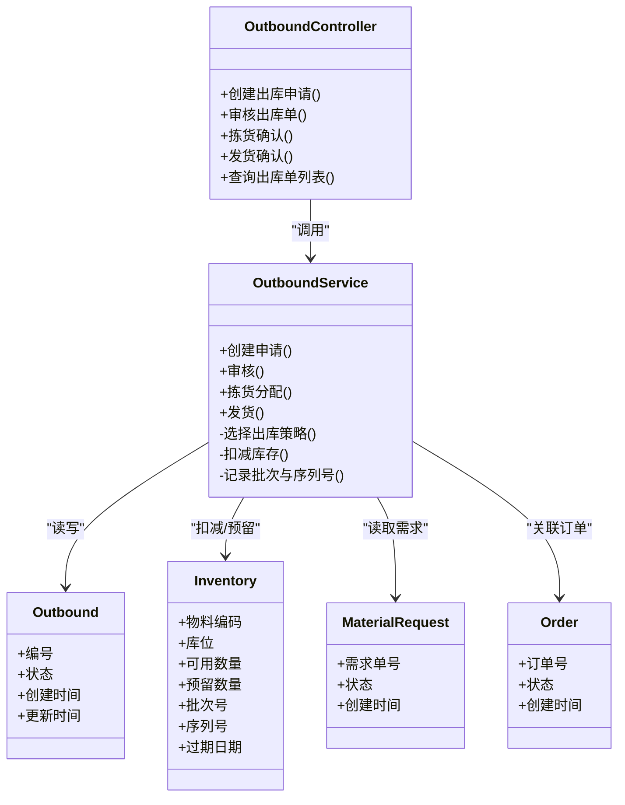
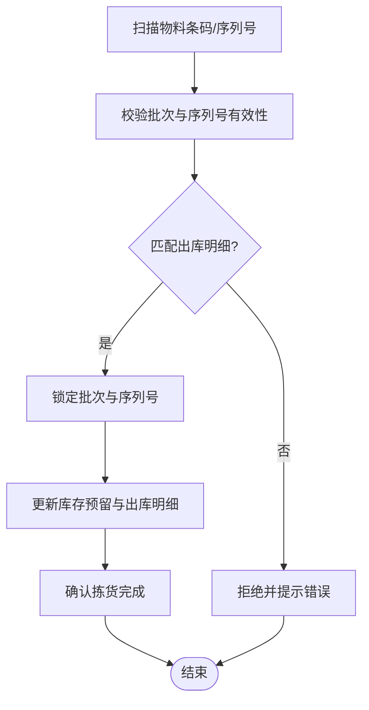
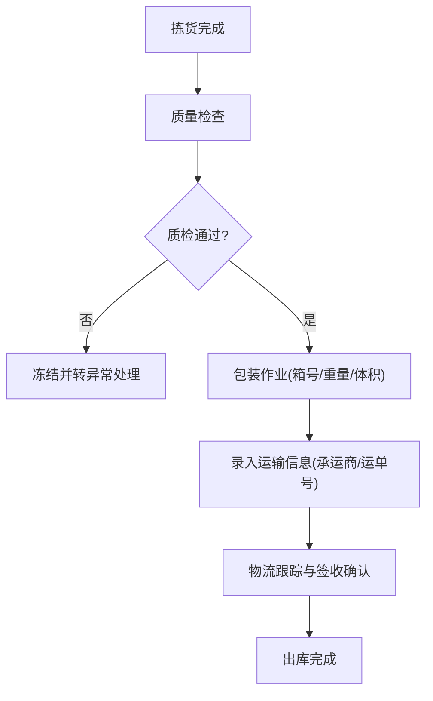
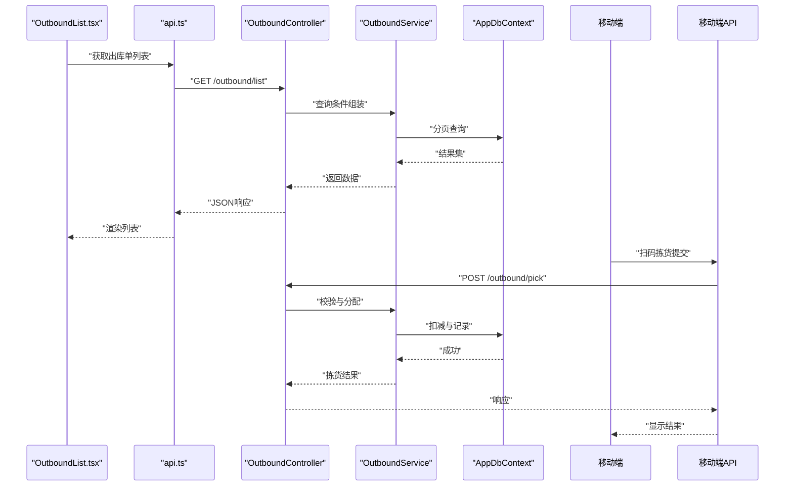
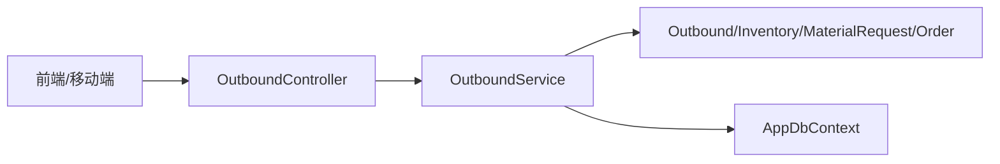

# 出库管理页面

<cite>
**本文引用的文件**   
- [OutboundController.cs](file://dip-system/api/Controllers/OutboundController.cs)
- [OutboundService.cs](file://dip-system/api/Services/OutboundService.cs)
- [Outbound.cs](file://dip-system/api/Models/Outbound.cs)
- [Inventory.cs](file://dip-system/api/Models/Inventory.cs)
- [MaterialRequest.cs](file://dip-system/api/Models/MaterialRequest.cs)
- [Order.cs](file://dip-system/api/Models/Order.cs)
- [AppDbContext.cs](file://dip-system/api/Data/AppDbContext.cs)
- [OutboundList.tsx](file://dip-system/frontend-web/src/pages/OutboundList.tsx)
- [api.ts](file://dip-system/frontend-web/src/lib/api.ts)
- [OutboundScreen.kt](file://mobile-android/app/src/main/java/com/dip/material/ui/outbound/OutboundScreen.kt)
- [OutboundViewModel.kt](file://mobile-android/app/src/main/java/com/dip/material/ui/outbound/OutboundViewModel.kt)
- [ApiService.kt](file://mobile-android/app/src/main/java/com/dip/material/data/network/ApiService.kt)
- [RetrofitClient.kt](file://mobile-android/app/src/main/java/com/dip/material/data/network/RetrofitClient.kt)
</cite>

## 目录
1. [简介](#简介)
2. [项目结构](#项目结构)
3. [核心组件](#核心组件)
4. [架构总览](#架构总览)
5. [详细组件分析](#详细组件分析)
6. [依赖关系分析](#依赖关系分析)
7. [性能考虑](#性能考虑)
8. [故障排查指南](#故障排查指南)
9. [结论](#结论)
10. [附录](#附录)

## 简介
本文件为DIP系统“出库管理页面”的完整技术文档，覆盖物料出库申请、审核、拣货与发货的全流程；定义出库单数据结构、批次管理与序列号追踪能力；说明先进先出(FIFO)、后进先出(LIFO)等出库策略的实现要点；并给出质量控制、包装规范与运输信息记录要求。同时提供出库效率分析、库存周转率计算与成本核算方法，以及与WMS系统集成、物流跟踪与签收确认的数据同步机制说明。

## 项目结构
本项目采用前后端分离与移动端协同的架构：
- 后端API（C#）：控制器、服务层、数据模型与数据库上下文
- Web前端（React+TypeScript）：出库列表页与API调用封装
- 移动端（Android/Kotlin）：扫码拣货、出库作业界面与网络层

图表来源
- [OutboundList.tsx](file://dip-system/frontend-web/src/pages/OutboundList.tsx)
- [api.ts](file://dip-system/frontend-web/src/lib/api.ts)
- [OutboundController.cs](file://dip-system/api/Controllers/OutboundController.cs)
- [OutboundService.cs](file://dip-system/api/Services/OutboundService.cs)
- [Outbound.cs](file://dip-system/api/Models/Outbound.cs)
- [Inventory.cs](file://dip-system/api/Models/Inventory.cs)
- [MaterialRequest.cs](file://dip-system/api/Models/MaterialRequest.cs)
- [Order.cs](file://dip-system/api/Models/Order.cs)
- [AppDbContext.cs](file://dip-system/api/Data/AppDbContext.cs)
- [OutboundScreen.kt](file://mobile-android/app/src/main/java/com/dip/material/ui/outbound/OutboundScreen.kt)
- [OutboundViewModel.kt](file://mobile-android/app/src/main/java/com/dip/material/ui/outbound/OutboundViewModel.kt)
- [ApiService.kt](file://mobile-android/app/src/main/java/com/dip/material/data/network/ApiService.kt)
- [RetrofitClient.kt](file://mobile-android/app/src/main/java/com/dip/material/data/network/RetrofitClient.kt)

章节来源
- [OutboundController.cs](file://dip-system/api/Controllers/OutboundController.cs)
- [OutboundService.cs](file://dip-system/api/Services/OutboundService.cs)
- [Outbound.cs](file://dip-system/api/Models/Outbound.cs)
- [Inventory.cs](file://dip-system/api/Models/Inventory.cs)
- [MaterialRequest.cs](file://dip-system/api/Models/MaterialRequest.cs)
- [Order.cs](file://dip-system/api/Models/Order.cs)
- [AppDbContext.cs](file://dip-system/api/Data/AppDbContext.cs)
- [OutboundList.tsx](file://dip-system/frontend-web/src/pages/OutboundList.tsx)
- [api.ts](file://dip-system/frontend-web/src/lib/api.ts)
- [OutboundScreen.kt](file://mobile-android/app/src/main/java/com/dip/material/ui/outbound/OutboundScreen.kt)
- [OutboundViewModel.kt](file://mobile-android/app/src/main/java/com/dip/material/ui/outbound/OutboundViewModel.kt)
- [ApiService.kt](file://mobile-android/app/src/main/java/com/dip/material/data/network/ApiService.kt)
- [RetrofitClient.kt](file://mobile-android/app/src/main/java/com/dip/material/data/network/RetrofitClient.kt)

## 核心组件
- 控制器层：对外暴露出库相关REST接口，负责请求校验、参数绑定与响应封装
- 服务层：实现出库业务编排，包括申请创建、审核、拣货分配、发货扣减、策略选择(FIFO/LIFO)
- 数据模型：出库单、库存、物料需求、订单等实体及其关系
- 数据访问：通过EF Core上下文进行持久化与查询
- 前端与移动端：提供出库作业界面、扫码采集、状态流转与网络交互

章节来源
- [OutboundController.cs](file://dip-system/api/Controllers/OutboundController.cs)
- [OutboundService.cs](file://dip-system/api/Services/OutboundService.cs)
- [Outbound.cs](file://dip-system/api/Models/Outbound.cs)
- [Inventory.cs](file://dip-system/api/Models/Inventory.cs)
- [MaterialRequest.cs](file://dip-system/api/Models/MaterialRequest.cs)
- [Order.cs](file://dip-system/api/Models/Order.cs)
- [AppDbContext.cs](file://dip-system/api/Data/AppDbContext.cs)
- [OutboundList.tsx](file://dip-system/frontend-web/src/pages/OutboundList.tsx)
- [api.ts](file://dip-system/frontend-web/src/lib/api.ts)
- [OutboundScreen.kt](file://mobile-android/app/src/main/java/com/dip/material/ui/outbound/OutboundScreen.kt)
- [OutboundViewModel.kt](file://mobile-android/app/src/main/java/com/dip/material/ui/outbound/OutboundViewModel.kt)
- [ApiService.kt](file://mobile-android/app/src/main/java/com/dip/material/data/network/ApiService.kt)
- [RetrofitClient.kt](file://mobile-android/app/src/main/java/com/dip/material/data/network/RetrofitClient.kt)

## 架构总览
出库业务流程贯穿“申请→审核→拣货→发货”，涉及多端协作与库存策略执行。

图表来源
- [OutboundController.cs](file://dip-system/api/Controllers/OutboundController.cs)
- [OutboundService.cs](file://dip-system/api/Services/OutboundService.cs)
- [Outbound.cs](file://dip-system/api/Models/Outbound.cs)
- [Inventory.cs](file://dip-system/api/Models/Inventory.cs)
- [MaterialRequest.cs](file://dip-system/api/Models/MaterialRequest.cs)
- [Order.cs](file://dip-system/api/Models/Order.cs)
- [AppDbContext.cs](file://dip-system/api/Data/AppDbContext.cs)

## 详细组件分析

### 数据模型与关系
出库管理涉及的核心实体包括出库单、库存、物料需求与订单。它们之间的关系如下：

图表来源
- [Outbound.cs](file://dip-system/api/Models/Outbound.cs)
- [Inventory.cs](file://dip-system/api/Models/Inventory.cs)
- [MaterialRequest.cs](file://dip-system/api/Models/MaterialRequest.cs)
- [Order.cs](file://dip-system/api/Models/Order.cs)

章节来源
- [Outbound.cs](file://dip-system/api/Models/Outbound.cs)
- [Inventory.cs](file://dip-system/api/Models/Inventory.cs)
- [MaterialRequest.cs](file://dip-system/api/Models/MaterialRequest.cs)
- [Order.cs](file://dip-system/api/Models/Order.cs)

### 控制器与服务层职责
- 控制器：接收并校验请求，调用服务层处理业务逻辑，返回统一响应
- 服务层：编排出库全流程，包括申请创建、审核、拣货策略执行、发货与物流信息落库

图表来源
- [OutboundController.cs](file://dip-system/api/Controllers/OutboundController.cs)
- [OutboundService.cs](file://dip-system/api/Services/OutboundService.cs)
- [Outbound.cs](file://dip-system/api/Models/Outbound.cs)
- [Inventory.cs](file://dip-system/api/Models/Inventory.cs)
- [MaterialRequest.cs](file://dip-system/api/Models/MaterialRequest.cs)
- [Order.cs](file://dip-system/api/Models/Order.cs)

章节来源
- [OutboundController.cs](file://dip-system/api/Controllers/OutboundController.cs)
- [OutboundService.cs](file://dip-system/api/Services/OutboundService.cs)
- [Outbound.cs](file://dip-system/api/Models/Outbound.cs)
- [Inventory.cs](file://dip-system/api/Models/Inventory.cs)
- [MaterialRequest.cs](file://dip-system/api/Models/MaterialRequest.cs)
- [Order.cs](file://dip-system/api/Models/Order.cs)

### 出库策略：FIFO与LIFO
- FIFO（先进先出）：优先分配最早入库或最早过期的批次，降低呆滞与过期风险
- LIFO（后进先出）：优先分配最近入库的批次，适用于价格波动或特定工艺要求
- 策略选择：在拣货分配时根据出库单配置或全局策略决定，并在库存扣减时锁定对应批次与序列号

```mermaid
flowchart TD
Start(["开始拣货分配"]) --> ReadPolicy["读取出库策略(FIFO/LIFO)"]
ReadPolicy --> QueryStock["查询可用库存(含批次/序列号)"]
QueryStock --> Sort{"策略类型?"}
Sort --> |FIFO| SortFIFO["按入库时间/过期时间升序排序"]
Sort --> |LIFO| SortLIFO["按入库时间降序排序"]
SortFIFO --> Allocate["逐条分配数量并锁定批次/序列号"]
SortLIFO --> Allocate
Allocate --> CheckEnough{"是否满足需求?"}
CheckEnough --> |否| Insufficient["标记不足并提示补货"]
CheckEnough --> |是| Reserve["预留库存并记录分配明细"]
Reserve --> End(["结束"])
Insufficient --> End
```

图表来源
- [OutboundService.cs](file://dip-system/api/Services/OutboundService.cs)
- [Inventory.cs](file://dip-system/api/Models/Inventory.cs)
- [Outbound.cs](file://dip-system/api/Models/Outbound.cs)

章节来源
- [OutboundService.cs](file://dip-system/api/Services/OutboundService.cs)
- [Inventory.cs](file://dip-system/api/Models/Inventory.cs)
- [Outbound.cs](file://dip-system/api/Models/Outbound.cs)

### 批次管理与序列号追踪
- 批次管理：每个库存条目携带批次号与过期日期，支持按批次追溯与隔离
- 序列号追踪：对高价值或需唯一标识的物料，记录序列号集合，确保可追溯性
- 分配与扣减：拣货时锁定具体批次与序列号，发货时再次校验一致性

图表来源
- [OutboundService.cs](file://dip-system/api/Services/OutboundService.cs)
- [Inventory.cs](file://dip-system/api/Models/Inventory.cs)
- [Outbound.cs](file://dip-system/api/Models/Outbound.cs)

章节来源
- [OutboundService.cs](file://dip-system/api/Services/OutboundService.cs)
- [Inventory.cs](file://dip-system/api/Models/Inventory.cs)
- [Outbound.cs](file://dip-system/api/Models/Outbound.cs)

### 出库质量控制、包装规范与运输信息
- 质量控制：在拣货与发货环节增加质量检查点，记录检验结果与异常
- 包装规范：记录包装方式、箱号、毛重/净重、体积与标签信息
- 运输信息：承运商、运单号、预计到达时间、签收状态与回传

图表来源
- [OutboundService.cs](file://dip-system/api/Services/OutboundService.cs)
- [Outbound.cs](file://dip-system/api/Models/Outbound.cs)

章节来源
- [OutboundService.cs](file://dip-system/api/Services/OutboundService.cs)
- [Outbound.cs](file://dip-system/api/Models/Outbound.cs)

### 前端与移动端交互
- Web前端：出库列表展示、状态筛选、操作入口（申请、审核、拣货、发货）
- 移动端：扫码拣货、批次/序列号采集、离线缓存与重试
- 网络层：统一的API封装与拦截器，保证认证与错误处理

图表来源
- [OutboundList.tsx](file://dip-system/frontend-web/src/pages/OutboundList.tsx)
- [api.ts](file://dip-system/frontend-web/src/lib/api.ts)
- [OutboundController.cs](file://dip-system/api/Controllers/OutboundController.cs)
- [OutboundService.cs](file://dip-system/api/Services/OutboundService.cs)
- [AppDbContext.cs](file://dip-system/api/Data/AppDbContext.cs)
- [OutboundScreen.kt](file://mobile-android/app/src/main/java/com/dip/material/ui/outbound/OutboundScreen.kt)
- [OutboundViewModel.kt](file://mobile-android/app/src/main/java/com/dip/material/ui/outbound/OutboundViewModel.kt)
- [ApiService.kt](file://mobile-android/app/src/main/java/com/dip/material/data/network/ApiService.kt)
- [RetrofitClient.kt](file://mobile-android/app/src/main/java/com/dip/material/data/network/RetrofitClient.kt)

章节来源
- [OutboundList.tsx](file://dip-system/frontend-web/src/pages/OutboundList.tsx)
- [api.ts](file://dip-system/frontend-web/src/lib/api.ts)
- [OutboundController.cs](file://dip-system/api/Controllers/OutboundController.cs)
- [OutboundService.cs](file://dip-system/api/Services/OutboundService.cs)
- [AppDbContext.cs](file://dip-system/api/Data/AppDbContext.cs)
- [OutboundScreen.kt](file://mobile-android/app/src/main/java/com/dip/material/ui/outbound/OutboundScreen.kt)
- [OutboundViewModel.kt](file://mobile-android/app/src/main/java/com/dip/material/ui/outbound/OutboundViewModel.kt)
- [ApiService.kt](file://mobile-android/app/src/main/java/com/dip/material/data/network/ApiService.kt)
- [RetrofitClient.kt](file://mobile-android/app/src/main/java/com/dip/material/data/network/RetrofitClient.kt)

## 依赖关系分析
- 控制器依赖服务层，服务层依赖数据模型与数据库上下文
- 前端与移动端通过HTTP API与控制器交互，使用统一的认证与错误处理
- 出库流程强依赖库存与需求/订单数据的一致性

图表来源
- [OutboundController.cs](file://dip-system/api/Controllers/OutboundController.cs)
- [OutboundService.cs](file://dip-system/api/Services/OutboundService.cs)
- [Outbound.cs](file://dip-system/api/Models/Outbound.cs)
- [Inventory.cs](file://dip-system/api/Models/Inventory.cs)
- [MaterialRequest.cs](file://dip-system/api/Models/MaterialRequest.cs)
- [Order.cs](file://dip-system/api/Models/Order.cs)
- [AppDbContext.cs](file://dip-system/api/Data/AppDbContext.cs)

章节来源
- [OutboundController.cs](file://dip-system/api/Controllers/OutboundController.cs)
- [OutboundService.cs](file://dip-system/api/Services/OutboundService.cs)
- [Outbound.cs](file://dip-system/api/Models/Outbound.cs)
- [Inventory.cs](file://dip-system/api/Models/Inventory.cs)
- [MaterialRequest.cs](file://dip-system/api/Models/MaterialRequest.cs)
- [Order.cs](file://dip-system/api/Models/Order.cs)
- [AppDbContext.cs](file://dip-system/api/Data/AppDbContext.cs)

## 性能考虑
- 索引优化：对物料编码、库位、批次号、过期日期建立合适索引，提升查询与分配效率
- 事务边界：将拣货分配与库存扣减置于同一事务，避免并发冲突与数据不一致
- 分页与过滤：出库单列表与库存查询使用分页与条件过滤，减少数据传输量
- 批量操作：拣货与发货尽量批量提交，降低网络与数据库往返开销
- 缓存策略：对字典与热点数据使用内存缓存，提高响应速度

[本节为通用指导，不直接分析具体文件]

## 故障排查指南
- 常见错误
  - 库存不足：检查可用数量与预留数量，确认批次与序列号是否被其他任务占用
  - 批次过期：核对过期日期与出库策略，必要时调整策略或替换批次
  - 序列号重复：校验序列号唯一性，避免重复扫描或重复分配
  - 并发冲突：检查事务与锁机制，确保并发场景下的数据一致性
- 定位方法
  - 查看出库单状态与明细，确认各阶段是否完成
  - 检查库存预留与扣减记录，定位异常批次与序列号
  - 审查日志与异常堆栈，定位控制器或服务层错误点

章节来源
- [OutboundController.cs](file://dip-system/api/Controllers/OutboundController.cs)
- [OutboundService.cs](file://dip-system/api/Services/OutboundService.cs)
- [Outbound.cs](file://dip-system/api/Models/Outbound.cs)
- [Inventory.cs](file://dip-system/api/Models/Inventory.cs)

## 结论
本文件系统化梳理了DIP系统出库管理的业务流程、数据结构与策略实现，涵盖FIFO/LIFO策略、批次与序列号追踪、质量控制与包装运输信息记录，以及效率分析与成本核算方法。通过前后端与移动端的协同设计，实现了从申请到发货的闭环管理，并为与WMS集成、物流跟踪与签收确认提供了数据基础。建议在生产环境中加强索引与事务管理，完善异常处理与监控告警，以提升系统的稳定性与可维护性。

## 附录
- 出库效率分析
  - 指标：平均处理时长、拣货准确率、发货及时率
  - 方法：基于出库单时间与节点时间戳统计，结合异常率评估
- 库存周转率计算
  - 公式：周转率 = 出库成本 / 平均库存成本
  - 应用：按物料或批次维度计算，辅助采购与库存策略优化
- 成本核算
  - 成本归集：按批次或序列号归集出库成本，支持加权平均或先进先出计价
  - 差异分析：对比标准成本与实际成本，识别损耗与浪费

[本节为通用指导，不直接分析具体文件]