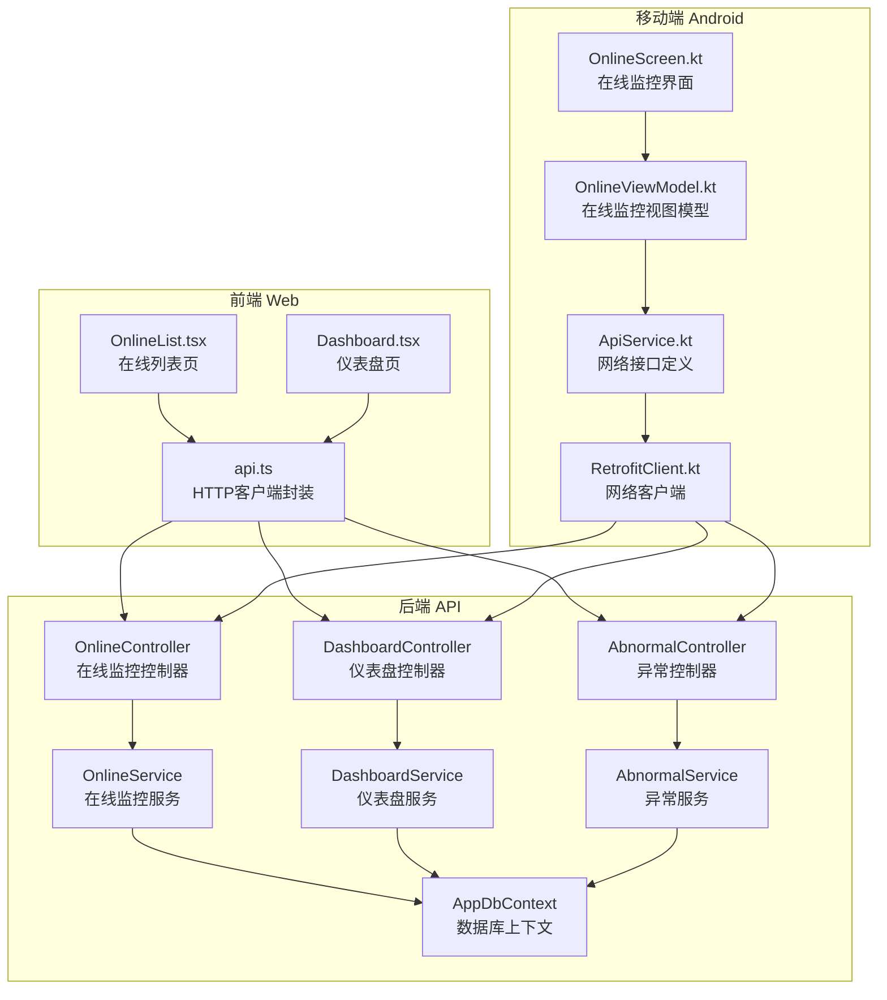
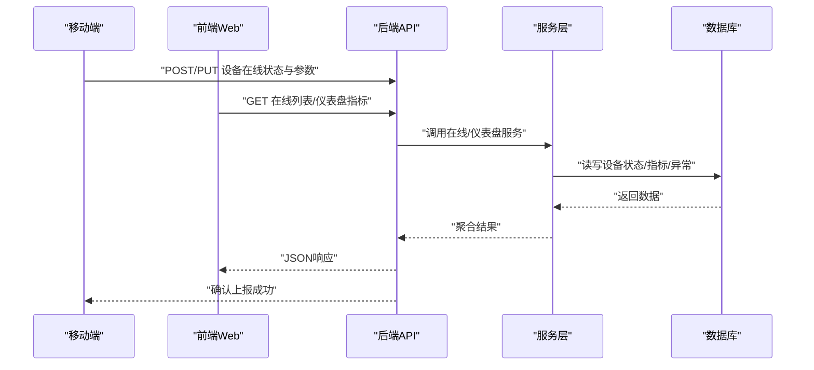
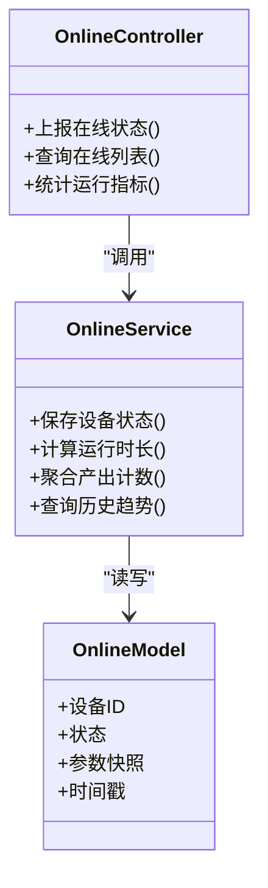
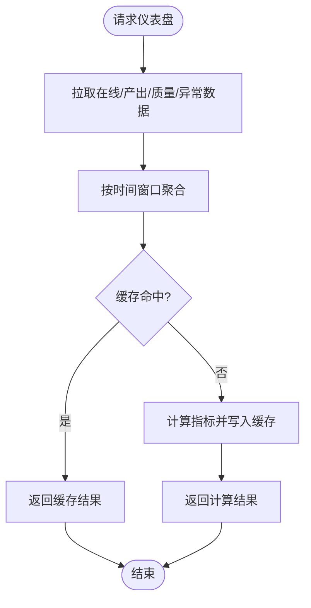
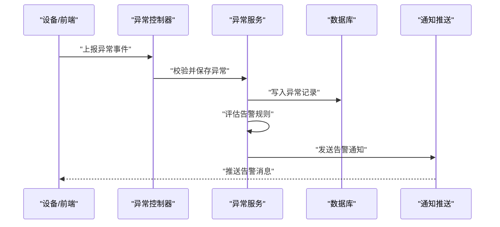
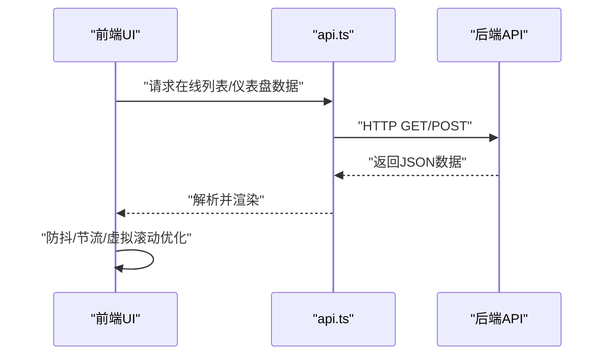
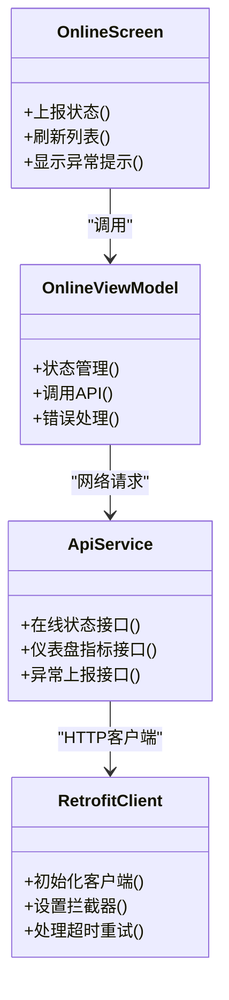
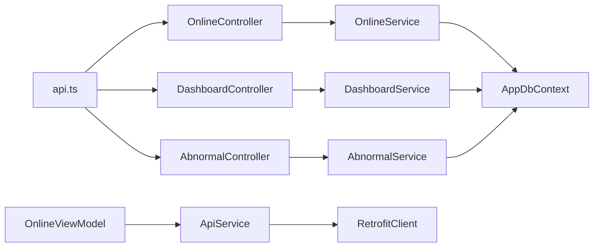

# 在线监控页面

<cite>
**本文引用的文件**   
- [OnlineController.cs](file://dip-system/api/Controllers/OnlineController.cs)
- [OnlineService.cs](file://dip-system/api/Services/OnlineService.cs)
- [Online.cs](file://dip-system/api/Models/Online.cs)
- [DashboardController.cs](file://dip-system/api/Controllers/DashboardController.cs)
- [DashboardService.cs](file://dip-system/api/Services/DashboardService.cs)
- [AbnormalController.cs](file://dip-system/api/Controllers/AbnormalController.cs)
- [AbnormalService.cs](file://dip-system/api/Services/AbnormalService.cs)
- [AppExceptionFilter.cs](file://dip-system/api/Controllers/AppExceptionFilter.cs)
- [AppDbContext.cs](file://dip-system/api/Data/AppDbContext.cs)
- [api.ts](file://dip-system/frontend-web/src/lib/api.ts)
- [OnlineList.tsx](file://dip-system/frontend-web/src/pages/OnlineList.tsx)
- [Dashboard.tsx](file://dip-system/frontend-web/src/pages/Dashboard.tsx)
- [OnlineScreen.kt](file://mobile-android/app/src/main/java/com/dip/material/ui/online/OnlineScreen.kt)
- [OnlineViewModel.kt](file://mobile-android/app/src/main/java/com/dip/material/ui/online/OnlineViewModel.kt)
- [ApiService.kt](file://mobile-android/app/src/main/java/com/dip/material/data/network/ApiService.kt)
- [RetrofitClient.kt](file://mobile-android/app/src/main/java/com/dip/material/data/network/RetrofitClient.kt)
</cite>

## 目录
1. [简介](#简介)
2. [项目结构](#项目结构)
3. [核心组件](#核心组件)
4. [架构总览](#架构总览)
5. [详细组件分析](#详细组件分析)
6. [依赖关系分析](#依赖关系分析)
7. [性能考虑](#性能考虑)
8. [故障排查指南](#故障排查指南)
9. [结论](#结论)
10. [附录](#附录)

## 简介
本文件面向DIP系统的“在线监控页面”，聚焦生产线的实时监控数据采集、显示与分析能力。文档覆盖设备状态监控、生产进度跟踪与质量指标显示的实时性要求；说明监控数据的采集频率、存储策略与缓存机制；告警规则配置、阈值设定与通知推送；以及性能监控、故障诊断与生产效率分析的可视化界面设计。同时，对WebSocket实时通信、数据推送与前端渲染优化技术进行说明，帮助开发与运维团队快速理解并高效使用在线监控功能。

## 项目结构
在线监控相关代码分布在后端API、前端Web与移动端三个层次：
- 后端API（C#）：提供在线监控数据接口、仪表盘聚合数据、异常事件处理等。
- 前端Web（React/Vite）：在线列表页、仪表盘页，负责数据拉取、展示与交互。
- 移动端（Android/Kotlin）：在线监控页面与视图模型，用于现场操作与数据上报。

图表来源
- [OnlineController.cs](file://dip-system/api/Controllers/OnlineController.cs)
- [OnlineService.cs](file://dip-system/api/Services/OnlineService.cs)
- [DashboardController.cs](file://dip-system/api/Controllers/DashboardController.cs)
- [DashboardService.cs](file://dip-system/api/Services/DashboardService.cs)
- [AbnormalController.cs](file://dip-system/api/Controllers/AbnormalController.cs)
- [AbnormalService.cs](file://dip-system/api/Services/AbnormalService.cs)
- [AppDbContext.cs](file://dip-system/api/Data/AppDbContext.cs)
- [api.ts](file://dip-system/frontend-web/src/lib/api.ts)
- [OnlineList.tsx](file://dip-system/frontend-web/src/pages/OnlineList.tsx)
- [Dashboard.tsx](file://dip-system/frontend-web/src/pages/Dashboard.tsx)
- [OnlineScreen.kt](file://mobile-android/app/src/main/java/com/dip/material/ui/online/OnlineScreen.kt)
- [OnlineViewModel.kt](file://mobile-android/app/src/main/java/com/dip/material/ui/online/OnlineViewModel.kt)
- [ApiService.kt](file://mobile-android/app/src/main/java/com/dip/material/data/network/ApiService.kt)
- [RetrofitClient.kt](file://mobile-android/app/src/main/java/com/dip/material/data/network/RetrofitClient.kt)

章节来源
- [OnlineController.cs](file://dip-system/api/Controllers/OnlineController.cs)
- [OnlineService.cs](file://dip-system/api/Services/OnlineService.cs)
- [DashboardController.cs](file://dip-system/api/Controllers/DashboardController.cs)
- [DashboardService.cs](file://dip-system/api/Services/DashboardService.cs)
- [AbnormalController.cs](file://dip-system/api/Controllers/AbnormalController.cs)
- [AbnormalService.cs](file://dip-system/api/Services/AbnormalService.cs)
- [AppDbContext.cs](file://dip-system/api/Data/AppDbContext.cs)
- [api.ts](file://dip-system/frontend-web/src/lib/api.ts)
- [OnlineList.tsx](file://dip-system/frontend-web/src/pages/OnlineList.tsx)
- [Dashboard.tsx](file://dip-system/frontend-web/src/pages/Dashboard.tsx)
- [OnlineScreen.kt](file://mobile-android/app/src/main/java/com/dip/material/ui/online/OnlineScreen.kt)
- [OnlineViewModel.kt](file://mobile-android/app/src/main/java/com/dip/material/ui/online/OnlineViewModel.kt)
- [ApiService.kt](file://mobile-android/app/src/main/java/com/dip/material/data/network/ApiService.kt)
- [RetrofitClient.kt](file://mobile-android/app/src/main/java/com/dip/material/data/network/RetrofitClient.kt)

## 核心组件
- 在线监控控制器与服务：负责接收设备上报的在线状态、运行参数与生产计数，返回实时列表与汇总信息。
- 仪表盘控制器与服务：聚合关键指标（如设备利用率、产出速率、不良率），为前端提供聚合数据。
- 异常控制器与服务：记录与查询异常事件，支撑告警与故障诊断。
- 前端在线列表与仪表盘：通过HTTP接口获取数据并进行可视化展示。
- 移动端在线监控：现场扫码/上报设备状态，驱动后端更新。

章节来源
- [OnlineController.cs](file://dip-system/api/Controllers/OnlineController.cs)
- [OnlineService.cs](file://dip-system/api/Services/OnlineService.cs)
- [DashboardController.cs](file://dip-system/api/Controllers/DashboardController.cs)
- [DashboardService.cs](file://dip-system/api/Services/DashboardService.cs)
- [AbnormalController.cs](file://dip-system/api/Controllers/AbnormalController.cs)
- [AbnormalService.cs](file://dip-system/api/Services/AbnormalService.cs)
- [OnlineList.tsx](file://dip-system/frontend-web/src/pages/OnlineList.tsx)
- [Dashboard.tsx](file://dip-system/frontend-web/src/pages/Dashboard.tsx)
- [OnlineScreen.kt](file://mobile-android/app/src/main/java/com/dip/material/ui/online/OnlineScreen.kt)
- [OnlineViewModel.kt](file://mobile-android/app/src/main/java/com/dip/material/ui/online/OnlineViewModel.kt)

## 架构总览
在线监控采用“端-云-库”三层架构：
- 端侧（移动端/前端）：采集与展示，支持轮询或长连接推送。
- 云端（API）：业务逻辑、数据聚合、异常处理与持久化。
- 数据层（数据库）：存储设备状态、生产计数、质量指标与异常事件。

图表来源
- [OnlineController.cs](file://dip-system/api/Controllers/OnlineController.cs)
- [OnlineService.cs](file://dip-system/api/Services/OnlineService.cs)
- [DashboardController.cs](file://dip-system/api/Controllers/DashboardController.cs)
- [DashboardService.cs](file://dip-system/api/Services/DashboardService.cs)
- [AppDbContext.cs](file://dip-system/api/Data/AppDbContext.cs)

## 详细组件分析

### 在线监控控制器与服务
- 职责：处理设备在线状态上报、查询在线设备列表、统计设备运行时长与产出计数。
- 关键点：
  - 输入校验与错误统一处理。
  - 高频写入时采用批量更新与事务控制。
  - 查询接口支持分页与过滤（按产线、设备类型、状态）。
- 数据流：
  - 上报路径：设备 -> API -> Service -> DB。
  - 查询路径：前端/移动端 -> API -> Service -> DB -> 聚合 -> 返回。

图表来源
- [OnlineController.cs](file://dip-system/api/Controllers/OnlineController.cs)
- [OnlineService.cs](file://dip-system/api/Services/OnlineService.cs)
- [Online.cs](file://dip-system/api/Models/Online.cs)

章节来源
- [OnlineController.cs](file://dip-system/api/Controllers/OnlineController.cs)
- [OnlineService.cs](file://dip-system/api/Services/OnlineService.cs)
- [Online.cs](file://dip-system/api/Models/Online.cs)

### 仪表盘控制器与服务
- 职责：聚合设备利用率、产出速率、不良率、停机时长等关键指标，供前端仪表盘展示。
- 关键点：
  - 多源数据聚合（在线状态、生产计数、质量指标、异常事件）。
  - 时间窗口计算（分钟/小时/日）与同比环比。
  - 缓存热点指标以减少数据库压力。
- 数据流：
  - 前端请求 -> API -> Service -> 多表聚合 -> 返回。

图表来源
- [DashboardController.cs](file://dip-system/api/Controllers/DashboardController.cs)
- [DashboardService.cs](file://dip-system/api/Services/DashboardService.cs)
- [AppDbContext.cs](file://dip-system/api/Data/AppDbContext.cs)

章节来源
- [DashboardController.cs](file://dip-system/api/Controllers/DashboardController.cs)
- [DashboardService.cs](file://dip-system/api/Services/DashboardService.cs)

### 异常控制器与服务
- 职责：记录设备异常、质量异常与生产异常，提供查询与统计。
- 关键点：
  - 异常分类与严重级别。
  - 阈值触发告警（如温度超限、停机时长过长）。
  - 与通知推送集成（邮件/短信/站内信）。
- 数据流：
  - 上报异常 -> API -> Service -> DB -> 触发告警 -> 通知。

图表来源
- [AbnormalController.cs](file://dip-system/api/Controllers/AbnormalController.cs)
- [AbnormalService.cs](file://dip-system/api/Services/AbnormalService.cs)
- [AppDbContext.cs](file://dip-system/api/Data/AppDbContext.cs)

章节来源
- [AbnormalController.cs](file://dip-system/api/Controllers/AbnormalController.cs)
- [AbnormalService.cs](file://dip-system/api/Services/AbnormalService.cs)

### 前端在线列表与仪表盘
- 在线列表页：
  - 通过HTTP接口拉取在线设备列表，支持刷新与筛选。
  - 展示设备状态、运行参数、最近更新时间。
- 仪表盘页：
  - 聚合关键指标，以图表形式展示趋势与分布。
  - 支持时间范围选择与指标切换。
- 性能优化：
  - 防抖与节流减少重复请求。
  - 虚拟滚动提升大数据量渲染性能。
  - 按需加载与懒渲染降低首屏负载。

图表来源
- [api.ts](file://dip-system/frontend-web/src/lib/api.ts)
- [OnlineList.tsx](file://dip-system/frontend-web/src/pages/OnlineList.tsx)
- [Dashboard.tsx](file://dip-system/frontend-web/src/pages/Dashboard.tsx)

章节来源
- [api.ts](file://dip-system/frontend-web/src/lib/api.ts)
- [OnlineList.tsx](file://dip-system/frontend-web/src/pages/OnlineList.tsx)
- [Dashboard.tsx](file://dip-system/frontend-web/src/pages/Dashboard.tsx)

### 移动端在线监控
- 在线监控界面：
  - 现场扫码/手动输入设备ID，上报状态与参数。
  - 展示本地缓存的设备状态与最近上报时间。
- 视图模型：
  - 管理状态与业务逻辑，调用网络接口。
  - 处理网络错误与重试机制。
- 网络层：
  - Retrofit客户端封装，统一拦截器与超时设置。

图表来源
- [OnlineScreen.kt](file://mobile-android/app/src/main/java/com/dip/material/ui/online/OnlineScreen.kt)
- [OnlineViewModel.kt](file://mobile-android/app/src/main/java/com/dip/material/ui/online/OnlineViewModel.kt)
- [ApiService.kt](file://mobile-android/app/src/main/java/com/dip/material/data/network/ApiService.kt)
- [RetrofitClient.kt](file://mobile-android/app/src/main/java/com/dip/material/data/network/RetrofitClient.kt)

章节来源
- [OnlineScreen.kt](file://mobile-android/app/src/main/java/com/dip/material/ui/online/OnlineScreen.kt)
- [OnlineViewModel.kt](file://mobile-android/app/src/main/java/com/dip/material/ui/online/OnlineViewModel.kt)
- [ApiService.kt](file://mobile-android/app/src/main/java/com/dip/material/data/network/ApiService.kt)
- [RetrofitClient.kt](file://mobile-android/app/src/main/java/com/dip/material/data/network/RetrofitClient.kt)

## 依赖关系分析
- 控制器依赖服务层，服务层依赖数据访问层（EF Core DbContext）。
- 前端通过HTTP客户端调用后端API，移动端通过Retrofit调用相同接口。
- 异常服务与通知模块解耦，便于扩展多种通知渠道。

图表来源
- [OnlineController.cs](file://dip-system/api/Controllers/OnlineController.cs)
- [OnlineService.cs](file://dip-system/api/Services/OnlineService.cs)
- [DashboardController.cs](file://dip-system/api/Controllers/DashboardController.cs)
- [DashboardService.cs](file://dip-system/api/Services/DashboardService.cs)
- [AbnormalController.cs](file://dip-system/api/Controllers/AbnormalController.cs)
- [AbnormalService.cs](file://dip-system/api/Services/AbnormalService.cs)
- [AppDbContext.cs](file://dip-system/api/Data/AppDbContext.cs)
- [api.ts](file://dip-system/frontend-web/src/lib/api.ts)
- [OnlineViewModel.kt](file://mobile-android/app/src/main/java/com/dip/material/ui/online/OnlineViewModel.kt)
- [ApiService.kt](file://mobile-android/app/src/main/java/com/dip/material/data/network/ApiService.kt)
- [RetrofitClient.kt](file://mobile-android/app/src/main/java/com/dip/material/data/network/RetrofitClient.kt)

章节来源
- [OnlineController.cs](file://dip-system/api/Controllers/OnlineController.cs)
- [OnlineService.cs](file://dip-system/api/Services/OnlineService.cs)
- [DashboardController.cs](file://dip-system/api/Controllers/DashboardController.cs)
- [DashboardService.cs](file://dip-system/api/Services/DashboardService.cs)
- [AbnormalController.cs](file://dip-system/api/Controllers/AbnormalController.cs)
- [AbnormalService.cs](file://dip-system/api/Services/AbnormalService.cs)
- [AppDbContext.cs](file://dip-system/api/Data/AppDbContext.cs)
- [api.ts](file://dip-system/frontend-web/src/lib/api.ts)
- [OnlineViewModel.kt](file://mobile-android/app/src/main/java/com/dip/material/ui/online/OnlineViewModel.kt)
- [ApiService.kt](file://mobile-android/app/src/main/java/com/dip/material/data/network/ApiService.kt)
- [RetrofitClient.kt](file://mobile-android/app/src/main/java/com/dip/material/data/network/RetrofitClient.kt)

## 性能考虑
- 采集频率建议：
  - 设备状态上报：1-5秒间隔，避免过高频率导致数据库压力。
  - 生产计数与质量指标：10-30秒间隔，结合批次聚合。
- 存储策略：
  - 热数据（最近1小时）内存缓存，冷数据落盘归档。
  - 分区表与索引优化（按时间、设备ID、产线）。
- 缓存机制：
  - 仪表盘指标使用分布式缓存（如Redis）共享。
  - 前端使用浏览器缓存与内存缓存（如Redux/Zustand）。
- 前端渲染优化：
  - 虚拟滚动、增量更新、防抖节流。
  - 图表按需加载与懒渲染。

## 故障排查指南
- 常见问题：
  - 设备无法上报：检查网络连通性与接口鉴权。
  - 数据延迟：查看数据库锁与慢查询日志。
  - 告警未触发：核对阈值配置与规则引擎状态。
- 诊断工具：
  - 后端异常过滤器统一捕获与记录。
  - 前端错误边界与日志上报。
  - 移动端网络重试与离线队列。

章节来源
- [AppExceptionFilter.cs](file://dip-system/api/Controllers/AppExceptionFilter.cs)

## 结论
在线监控页面通过前后端协同与移动端上报，实现了生产线设备状态、生产进度与质量指标的实时监控。系统采用分层架构与缓存策略，保障高并发下的稳定性与实时性。告警规则与通知推送为异常处理提供闭环支持。未来可引入WebSocket实现真正的双向实时通信，进一步提升数据推送效率与用户体验。

## 附录
- WebSocket实时通信建议：
  - 使用SignalR或原生WebSocket建立长连接。
  - 服务端广播设备状态变更，前端订阅并增量更新。
- 告警规则配置示例：
  - 温度上限、停机时长、不良率阈值。
  - 通知渠道：邮件、短信、站内信、企业微信/钉钉。
- 性能监控指标：
  - 接口响应时间、QPS、错误率。
  - 数据库连接池、缓存命中率。
  - 前端首屏时间、交互延迟。