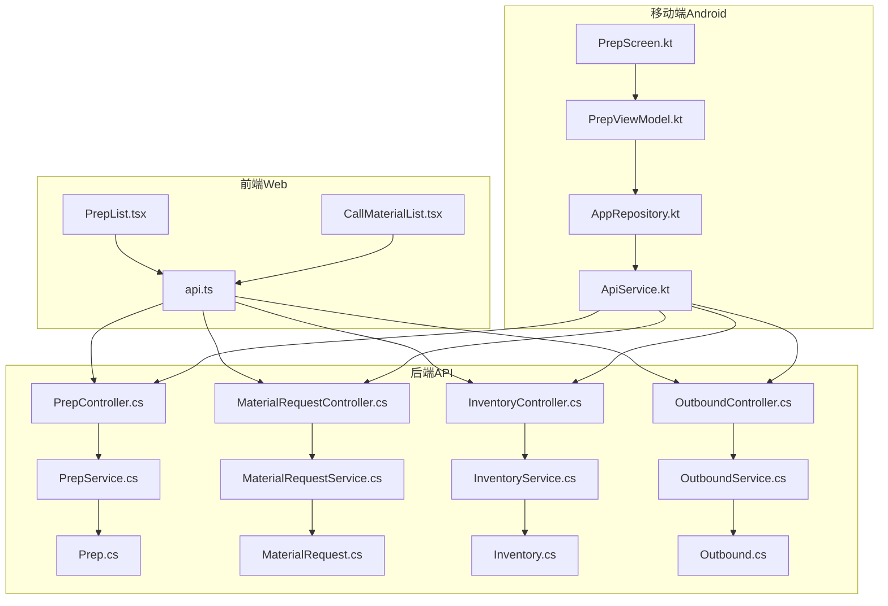
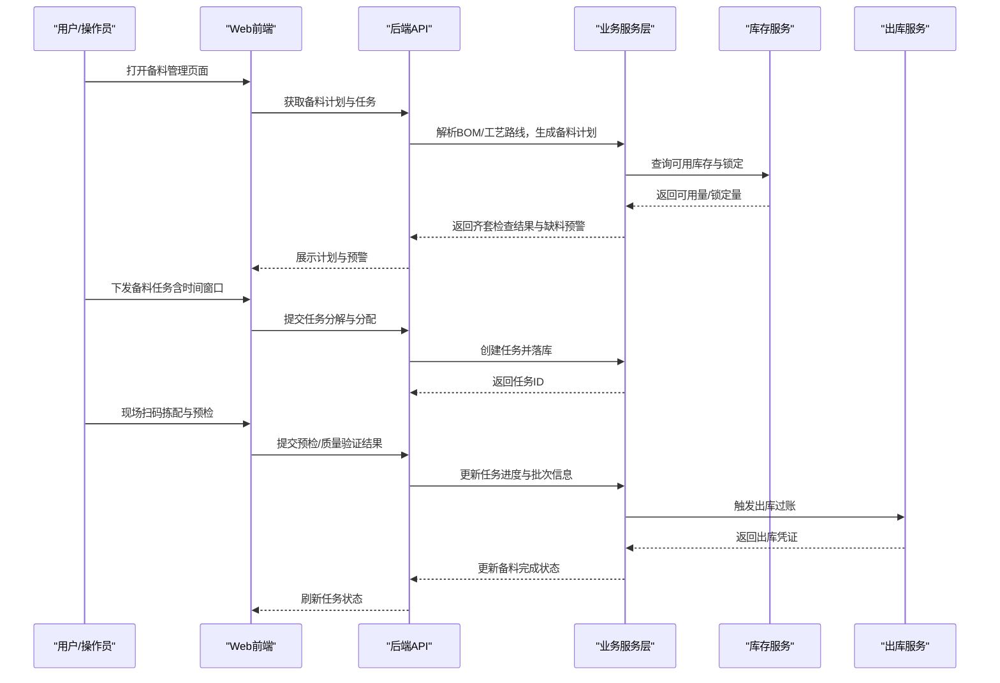
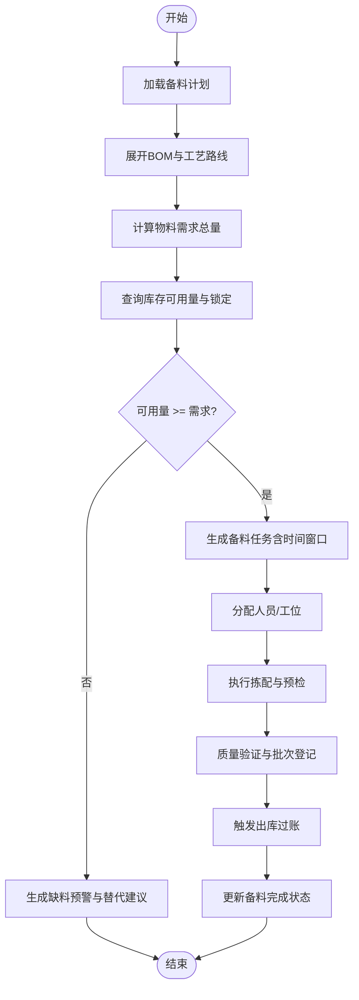
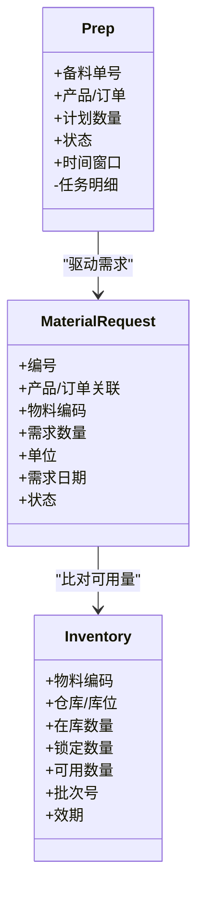
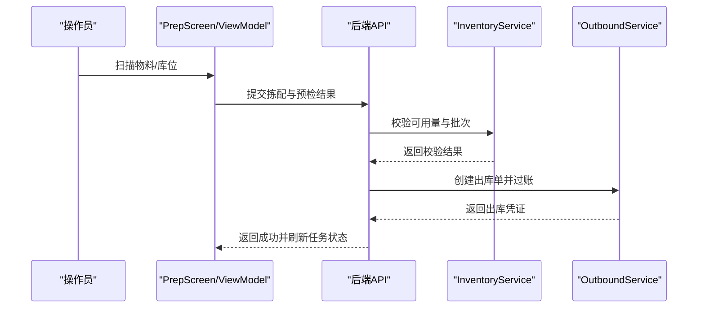
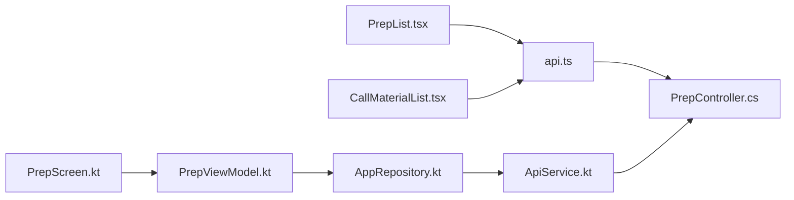
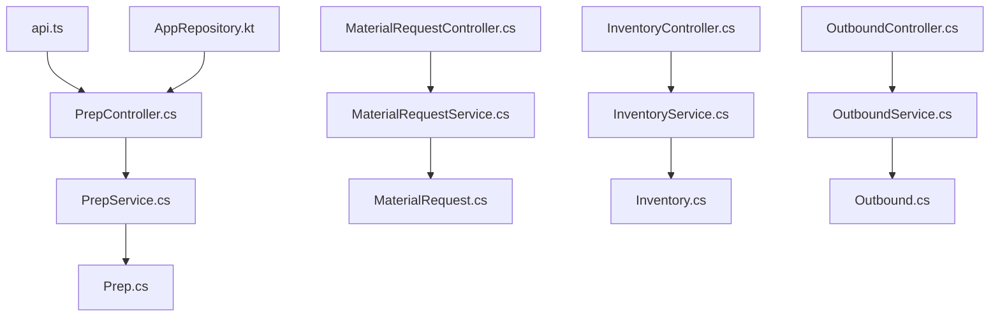

# 备料管理页面

<cite>
**本文引用的文件**   
- [PrepController.cs](file://dip-system/api/Controllers/PrepController.cs)
- [PrepService.cs](file://dip-system/api/Services/PrepService.cs)
- [Prep.cs](file://dip-system/api/Models/Prep.cs)
- [MaterialRequestController.cs](file://dip-system/api/Controllers/MaterialRequestController.cs)
- [MaterialRequestService.cs](file://dip-system/api/Services/MaterialRequestService.cs)
- [MaterialRequest.cs](file://dip-system/api/Models/MaterialRequest.cs)
- [InventoryController.cs](file://dip-system/api/Controllers/InventoryController.cs)
- [InventoryService.cs](file://dip-system/api/Services/InventoryService.cs)
- [Inventory.cs](file://dip-system/api/Models/Inventory.cs)
- [OutboundController.cs](file://dip-system/api/Controllers/OutboundController.cs)
- [OutboundService.cs](file://dip-system/api/Services/OutboundService.cs)
- [Outbound.cs](file://dip-system/api/Models/Outbound.cs)
- [PrepList.tsx](file://dip-system/frontend-web/src/pages/PrepList.tsx)
- [CallMaterialList.tsx](file://dip-system/frontend-web/src/pages/CallMaterialList.tsx)
- [Api.ts](file://dip-system/frontend-web/src/lib/api.ts)
- [PrepScreen.kt](file://mobile-android/app/src/main/java/com/dip/material/ui/prep/PrepScreen.kt)
- [PrepViewModel.kt](file://mobile-android/app/src/main/java/com/dip/material/ui/prep/PrepViewModel.kt)
- [ApiService.kt](file://mobile-android/app/src/main/java/com/dip/material/data/network/ApiService.kt)
- [AppRepository.kt](file://mobile-android/app/src/main/java/com/dip/material/data/repository/AppRepository.kt)
</cite>

## 目录
1. [简介](#简介)
2. [项目结构](#项目结构)
3. [核心组件](#核心组件)
4. [架构总览](#架构总览)
5. [详细组件分析](#详细组件分析)
6. [依赖关系分析](#依赖关系分析)
7. [性能考量](#性能考量)
8. [故障排查指南](#故障排查指南)
9. [结论](#结论)
10. [附录](#附录)

## 简介
本文件面向DIP系统“备料管理页面”的完整文档，覆盖生产前的物料准备、检验与配送全流程。重点说明：
- 备料计划生成、齐套性检查与缺料预警机制
- 备料任务分解、人员调度与时间窗口管理
- 物料预检、质量验证与批次追溯
- 备料效率分析与错误率统计、优化建议
- 与BOM系统集成、工艺路线匹配与智能配料的自动化逻辑

该模块贯穿前端Web、后端API服务与移动端（Android），通过统一的接口契约实现跨端协同。

## 项目结构
备料管理相关代码分布在以下三层：
- 前端Web：React+TypeScript页面与API封装
- 后端API：ASP.NET Core控制器、服务层与数据模型
- 移动端Android：Kotlin界面、视图模型与网络仓库

图表来源
- [PrepList.tsx](file://dip-system/frontend-web/src/pages/PrepList.tsx)
- [CallMaterialList.tsx](file://dip-system/frontend-web/src/pages/CallMaterialList.tsx)
- [Api.ts](file://dip-system/frontend-web/src/lib/api.ts)
- [PrepController.cs](file://dip-system/api/Controllers/PrepController.cs)
- [PrepService.cs](file://dip-system/api/Services/PrepService.cs)
- [Prep.cs](file://dip-system/api/Models/Prep.cs)
- [MaterialRequestController.cs](file://dip-system/api/Controllers/MaterialRequestController.cs)
- [MaterialRequestService.cs](file://dip-system/api/Services/MaterialRequestService.cs)
- [MaterialRequest.cs](file://dip-system/api/Models/MaterialRequest.cs)
- [InventoryController.cs](file://dip-system/api/Controllers/InventoryController.cs)
- [InventoryService.cs](file://dip-system/api/Services/InventoryService.cs)
- [Inventory.cs](file://dip-system/api/Models/Inventory.cs)
- [OutboundController.cs](file://dip-system/api/Controllers/OutboundController.cs)
- [OutboundService.cs](file://dip-system/api/Services/OutboundService.cs)
- [Outbound.cs](file://dip-system/api/Models/Outbound.cs)
- [PrepScreen.kt](file://mobile-android/app/src/main/java/com/dip/material/ui/prep/PrepScreen.kt)
- [PrepViewModel.kt](file://mobile-android/app/src/main/java/com/dip/material/ui/prep/PrepViewModel.kt)
- [ApiService.kt](file://mobile-android/app/src/main/java/com/dip/material/data/network/ApiService.kt)
- [AppRepository.kt](file://mobile-android/app/src/main/java/com/dip/material/data/repository/AppRepository.kt)

章节来源
- [PrepController.cs](file://dip-system/api/Controllers/PrepController.cs)
- [PrepService.cs](file://dip-system/api/Services/PrepService.cs)
- [Prep.cs](file://dip-system/api/Models/Prep.cs)
- [MaterialRequestController.cs](file://dip-system/api/Controllers/MaterialRequestController.cs)
- [MaterialRequestService.cs](file://dip-system/api/Services/MaterialRequestService.cs)
- [MaterialRequest.cs](file://dip-system/api/Models/MaterialRequest.cs)
- [InventoryController.cs](file://dip-system/api/Controllers/InventoryController.cs)
- [InventoryService.cs](file://dip-system/api/Services/InventoryService.cs)
- [Inventory.cs](file://dip-system/api/Models/Inventory.cs)
- [OutboundController.cs](file://dip-system/api/Controllers/OutboundController.cs)
- [OutboundService.cs](file://dip-system/api/Services/OutboundService.cs)
- [Outbound.cs](file://dip-system/api/Models/Outbound.cs)
- [PrepList.tsx](file://dip-system/frontend-web/src/pages/PrepList.tsx)
- [CallMaterialList.tsx](file://dip-system/frontend-web/src/pages/CallMaterialList.tsx)
- [Api.ts](file://dip-system/frontend-web/src/lib/api.ts)
- [PrepScreen.kt](file://mobile-android/app/src/main/java/com/dip/material/ui/prep/PrepScreen.kt)
- [PrepViewModel.kt](file://mobile-android/app/src/main/java/com/dip/material/ui/prep/PrepViewModel.kt)
- [ApiService.kt](file://mobile-android/app/src/main/java/com/dip/material/data/network/ApiService.kt)
- [AppRepository.kt](file://mobile-android/app/src/main/java/com/dip/material/data/repository/AppRepository.kt)

## 核心组件
- 备料控制器与服务：负责备料单生命周期管理、任务拆分、状态流转与结果回写
- 物料需求控制器与服务：承接BOM展开后的物料需求，驱动齐套性检查与缺料预警
- 库存控制器与服务：提供实时库存查询、可用量计算与锁定策略
- 出库控制器与服务：执行备料拣配与出库过账，形成配送闭环
- 前端页面：备料列表、呼叫物料等交互入口，统一调用API
- 移动端：现场扫码、确认与异常上报，提升作业效率

章节来源
- [PrepController.cs](file://dip-system/api/Controllers/PrepController.cs)
- [PrepService.cs](file://dip-system/api/Services/PrepService.cs)
- [Prep.cs](file://dip-system/api/Models/Prep.cs)
- [MaterialRequestController.cs](file://dip-system/api/Controllers/MaterialRequestController.cs)
- [MaterialRequestService.cs](file://dip-system/api/Services/MaterialRequestService.cs)
- [MaterialRequest.cs](file://dip-system/api/Models/MaterialRequest.cs)
- [InventoryController.cs](file://dip-system/api/Controllers/InventoryController.cs)
- [InventoryService.cs](file://dip-system/api/Services/InventoryService.cs)
- [Inventory.cs](file://dip-system/api/Models/Inventory.cs)
- [OutboundController.cs](file://dip-system/api/Controllers/OutboundController.cs)
- [OutboundService.cs](file://dip-system/api/Services/OutboundService.cs)
- [Outbound.cs](file://dip-system/api/Models/Outbound.cs)
- [PrepList.tsx](file://dip-system/frontend-web/src/pages/PrepList.tsx)
- [CallMaterialList.tsx](file://dip-system/frontend-web/src/pages/CallMaterialList.tsx)
- [Api.ts](file://dip-system/frontend-web/src/lib/api.ts)
- [PrepScreen.kt](file://mobile-android/app/src/main/java/com/dip/material/ui/prep/PrepScreen.kt)
- [PrepViewModel.kt](file://mobile-android/app/src/main/java/com/dip/material/ui/prep/PrepViewModel.kt)
- [ApiService.kt](file://mobile-android/app/src/main/java/com/dip/material/data/network/ApiService.kt)
- [AppRepository.kt](file://mobile-android/app/src/main/java/com/dip/material/data/repository/AppRepository.kt)

## 架构总览
备料管理的端到端流程如下：
- 计划阶段：根据订单/BOM生成备料计划，进行齐套性校验与缺料预警
- 任务阶段：将备料计划拆分为可执行的备料任务，分配至产线/班组与时间窗口
- 执行阶段：现场扫码拣配、预检与质量验证，记录批次信息并触发出库
- 交付阶段：完成配送与签收，回写备料完成状态，形成闭环

图表来源
- [PrepController.cs](file://dip-system/api/Controllers/PrepController.cs)
- [PrepService.cs](file://dip-system/api/Services/PrepService.cs)
- [Prep.cs](file://dip-system/api/Models/Prep.cs)
- [MaterialRequestController.cs](file://dip-system/api/Controllers/MaterialRequestController.cs)
- [MaterialRequestService.cs](file://dip-system/api/Services/MaterialRequestService.cs)
- [MaterialRequest.cs](file://dip-system/api/Models/MaterialRequest.cs)
- [InventoryController.cs](file://dip-system/api/Controllers/InventoryController.cs)
- [InventoryService.cs](file://dip-system/api/Services/InventoryService.cs)
- [Inventory.cs](file://dip-system/api/Models/Inventory.cs)
- [OutboundController.cs](file://dip-system/api/Controllers/OutboundController.cs)
- [OutboundService.cs](file://dip-system/api/Services/OutboundService.cs)
- [Outbound.cs](file://dip-system/api/Models/Outbound.cs)
- [PrepList.tsx](file://dip-system/frontend-web/src/pages/PrepList.tsx)
- [CallMaterialList.tsx](file://dip-system/frontend-web/src/pages/CallMaterialList.tsx)
- [Api.ts](file://dip-system/frontend-web/src/lib/api.ts)
- [PrepScreen.kt](file://mobile-android/app/src/main/java/com/dip/material/ui/prep/PrepScreen.kt)
- [PrepViewModel.kt](file://mobile-android/app/src/main/java/com/dip/material/ui/prep/PrepViewModel.kt)
- [ApiService.kt](file://mobile-android/app/src/main/java/com/dip/material/data/network/ApiService.kt)
- [AppRepository.kt](file://mobile-android/app/src/main/java/com/dip/material/data/repository/AppRepository.kt)

## 详细组件分析

### 备料控制器与服务（Plan & Task）
- 职责
  - 备料计划CRUD、状态机控制（待执行、执行中、已完成、已取消）
  - 任务分解：按工序/工位/时间窗口切分任务，支持批量操作
  - 齐套性检查：基于BOM与库存可用量计算缺口，输出缺料清单与预警等级
  - 结果回写：记录预检、质量验证、批次号、拣配数量与差异
- 关键数据流
  - 输入：订单/BOM、工艺路线、时间窗口、人员/设备资源
  - 处理：BOM展开→需求汇总→库存可用量计算→缺口判定→任务拆分
  - 输出：备料计划、任务明细、预警报告、执行进度

图表来源
- [PrepController.cs](file://dip-system/api/Controllers/PrepController.cs)
- [PrepService.cs](file://dip-system/api/Services/PrepService.cs)
- [Prep.cs](file://dip-system/api/Models/Prep.cs)

章节来源
- [PrepController.cs](file://dip-system/api/Controllers/PrepController.cs)
- [PrepService.cs](file://dip-system/api/Services/PrepService.cs)
- [Prep.cs](file://dip-system/api/Models/Prep.cs)

### 物料需求与齐套性检查（MRP & Kitting）
- 职责
  - 接收BOM展开后的物料需求，合并同料号需求
  - 计算可用量（在库+在途-锁定-预留），对比需求得出缺口
  - 生成缺料预警（按紧急度分级），支持替代料推荐
- 关键算法要点
  - 需求聚合：按料号+批次属性分组求和
  - 可用量计算：考虑安全库存、冻结量、在途预计到达
  - 预警规则：低于阈值触发预警，结合交期与优先级排序

图表来源
- [MaterialRequest.cs](file://dip-system/api/Models/MaterialRequest.cs)
- [Inventory.cs](file://dip-system/api/Models/Inventory.cs)
- [Prep.cs](file://dip-system/api/Models/Prep.cs)

章节来源
- [MaterialRequestController.cs](file://dip-system/api/Controllers/MaterialRequestController.cs)
- [MaterialRequestService.cs](file://dip-system/api/Services/MaterialRequestService.cs)
- [MaterialRequest.cs](file://dip-system/api/Models/MaterialRequest.cs)
- [InventoryController.cs](file://dip-system/api/Controllers/InventoryController.cs)
- [InventoryService.cs](file://dip-system/api/Services/InventoryService.cs)
- [Inventory.cs](file://dip-system/api/Models/Inventory.cs)

### 库存与出库（Pick & Ship）
- 职责
  - 库存查询：按料号、库位、批次维度检索可用量
  - 出库过账：拣配完成后扣减库存，生成出库单与批次追溯链
- 关键流程
  - 校验：出库前再次校验可用量与批次一致性
  - 过账：事务性扣减，确保库存与出库单一致
  - 追溯：记录批次、效期、供应商、质检结果

图表来源
- [InventoryController.cs](file://dip-system/api/Controllers/InventoryController.cs)
- [InventoryService.cs](file://dip-system/api/Services/InventoryService.cs)
- [Inventory.cs](file://dip-system/api/Models/Inventory.cs)
- [OutboundController.cs](file://dip-system/api/Controllers/OutboundController.cs)
- [OutboundService.cs](file://dip-system/api/Services/OutboundService.cs)
- [Outbound.cs](file://dip-system/api/Models/Outbound.cs)
- [PrepScreen.kt](file://mobile-android/app/src/main/java/com/dip/material/ui/prep/PrepScreen.kt)
- [PrepViewModel.kt](file://mobile-android/app/src/main/java/com/dip/material/ui/prep/PrepViewModel.kt)

章节来源
- [InventoryController.cs](file://dip-system/api/Controllers/InventoryController.cs)
- [InventoryService.cs](file://dip-system/api/Services/InventoryService.cs)
- [Inventory.cs](file://dip-system/api/Models/Inventory.cs)
- [OutboundController.cs](file://dip-system/api/Controllers/OutboundController.cs)
- [OutboundService.cs](file://dip-system/api/Services/OutboundService.cs)
- [Outbound.cs](file://dip-system/api/Models/Outbound.cs)

### 前端与移动端集成（UI & UX）
- Web端
  - 备料列表页：展示计划、任务、状态、预警；支持筛选与分页
  - 呼叫物料页：快速发起补料/调拨请求，联动库存与出库
- 移动端
  - 备料作业：扫码拣配、预检录入、异常上报、批次登记
  - 视图模型：本地状态管理与异步请求封装

图表来源
- [PrepList.tsx](file://dip-system/frontend-web/src/pages/PrepList.tsx)
- [CallMaterialList.tsx](file://dip-system/frontend-web/src/pages/CallMaterialList.tsx)
- [Api.ts](file://dip-system/frontend-web/src/lib/api.ts)
- [PrepScreen.kt](file://mobile-android/app/src/main/java/com/dip/material/ui/prep/PrepScreen.kt)
- [PrepViewModel.kt](file://mobile-android/app/src/main/java/com/dip/material/ui/prep/PrepViewModel.kt)
- [ApiService.kt](file://mobile-android/app/src/main/java/com/dip/material/data/network/ApiService.kt)
- [AppRepository.kt](file://mobile-android/app/src/main/java/com/dip/material/data/repository/AppRepository.kt)
- [PrepController.cs](file://dip-system/api/Controllers/PrepController.cs)

章节来源
- [PrepList.tsx](file://dip-system/frontend-web/src/pages/PrepList.tsx)
- [CallMaterialList.tsx](file://dip-system/frontend-web/src/pages/CallMaterialList.tsx)
- [Api.ts](file://dip-system/frontend-web/src/lib/api.ts)
- [PrepScreen.kt](file://mobile-android/app/src/main/java/com/dip/material/ui/prep/PrepScreen.kt)
- [PrepViewModel.kt](file://mobile-android/app/src/main/java/com/dip/material/ui/prep/PrepViewModel.kt)
- [ApiService.kt](file://mobile-android/app/src/main/java/com/dip/material/data/network/ApiService.kt)
- [AppRepository.kt](file://mobile-android/app/src/main/java/com/dip/material/data/repository/AppRepository.kt)

## 依赖关系分析
- 控制器到服务：每个控制器仅做参数校验与响应封装，业务逻辑下沉至服务层
- 服务到模型：服务层直接操作领域模型，保证数据一致性
- 前端到API：统一API封装，避免重复请求与错误处理分散
- 移动端到仓库：仓库模式抽象网络与缓存，便于测试与扩展

图表来源
- [PrepController.cs](file://dip-system/api/Controllers/PrepController.cs)
- [PrepService.cs](file://dip-system/api/Services/PrepService.cs)
- [Prep.cs](file://dip-system/api/Models/Prep.cs)
- [MaterialRequestController.cs](file://dip-system/api/Controllers/MaterialRequestController.cs)
- [MaterialRequestService.cs](file://dip-system/api/Services/MaterialRequestService.cs)
- [MaterialRequest.cs](file://dip-system/api/Models/MaterialRequest.cs)
- [InventoryController.cs](file://dip-system/api/Controllers/InventoryController.cs)
- [InventoryService.cs](file://dip-system/api/Services/InventoryService.cs)
- [Inventory.cs](file://dip-system/api/Models/Inventory.cs)
- [OutboundController.cs](file://dip-system/api/Controllers/OutboundController.cs)
- [OutboundService.cs](file://dip-system/api/Services/OutboundService.cs)
- [Outbound.cs](file://dip-system/api/Models/Outbound.cs)
- [Api.ts](file://dip-system/frontend-web/src/lib/api.ts)
- [AppRepository.kt](file://mobile-android/app/src/main/java/com/dip/material/data/repository/AppRepository.kt)

章节来源
- [PrepController.cs](file://dip-system/api/Controllers/PrepController.cs)
- [PrepService.cs](file://dip-system/api/Services/PrepService.cs)
- [Prep.cs](file://dip-system/api/Models/Prep.cs)
- [MaterialRequestController.cs](file://dip-system/api/Controllers/MaterialRequestController.cs)
- [MaterialRequestService.cs](file://dip-system/api/Services/MaterialRequestService.cs)
- [MaterialRequest.cs](file://dip-system/api/Models/MaterialRequest.cs)
- [InventoryController.cs](file://dip-system/api/Controllers/InventoryController.cs)
- [InventoryService.cs](file://dip-system/api/Services/InventoryService.cs)
- [Inventory.cs](file://dip-system/api/Models/Inventory.cs)
- [OutboundController.cs](file://dip-system/api/Controllers/OutboundController.cs)
- [OutboundService.cs](file://dip-system/api/Services/OutboundService.cs)
- [Outbound.cs](file://dip-system/api/Models/Outbound.cs)
- [Api.ts](file://dip-system/frontend-web/src/lib/api.ts)
- [AppRepository.kt](file://mobile-android/app/src/main/java/com/dip/material/data/repository/AppRepository.kt)

## 性能考量
- 数据库层面
  - 对常用查询字段建立索引（料号、批次、状态、时间窗口）
  - 使用分页与只读投影减少数据传输
- 服务层
  - 齐套性检查采用批处理与增量计算，避免全量扫描
  - 并发场景下使用乐观锁或分布式锁保护库存扣减
- 前端与移动端
  - 列表懒加载与防抖搜索，减少无效请求
  - 离线缓存关键主数据，降低网络抖动影响

[本节为通用指导，不直接分析具体文件]

## 故障排查指南
- 常见问题定位
  - 齐套性检查失败：核对BOM版本、工艺路线、库存锁定与预留
  - 出库过账失败：检查批次一致性、效期与质检状态
  - 移动端扫码异常：确认条码格式、库位映射与权限
- 日志与追踪
  - 记录关键步骤的请求ID、物料编码、批次号与操作人
  - 对异常路径输出堆栈与上下文，便于复现与修复

章节来源
- [PrepController.cs](file://dip-system/api/Controllers/PrepController.cs)
- [PrepService.cs](file://dip-system/api/Services/PrepService.cs)
- [InventoryController.cs](file://dip-system/api/Controllers/InventoryController.cs)
- [InventoryService.cs](file://dip-system/api/Services/InventoryService.cs)
- [OutboundController.cs](file://dip-system/api/Controllers/OutboundController.cs)
- [OutboundService.cs](file://dip-system/api/Services/OutboundService.cs)

## 结论
本模块以“计划—任务—执行—交付”为主线，打通了从BOM到库存再到出库的全链路。通过齐套性检查与缺料预警，有效降低停线风险；借助移动端扫码与批次追溯，提升现场作业效率与质量可控性。后续可在智能配料与动态排程方面持续优化，进一步提升整体备料效率与准确率。

[本节为总结性内容，不直接分析具体文件]

## 附录
- 术语表
  - 齐套性：物料满足生产需求的完整性与及时性
  - 时间窗口：任务允许执行的时间段，用于资源与产能规划
  - 批次追溯：从原材料到成品的全链条可追踪能力
- 最佳实践
  - 明确BOM与工艺路线的版本管理
  - 严格区分可用量与锁定量，避免超发
  - 建立异常闭环与复盘机制，持续改进

[本节为补充信息，不直接分析具体文件]