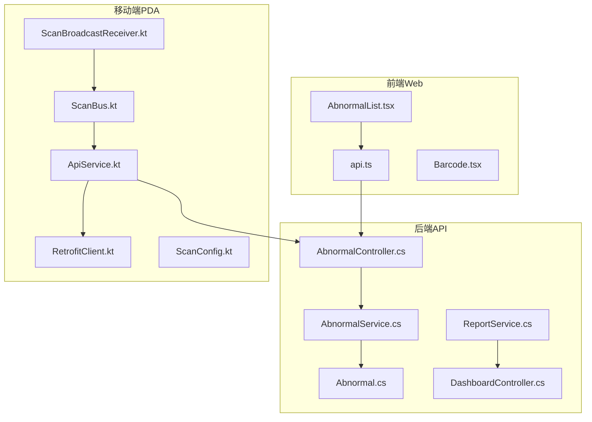
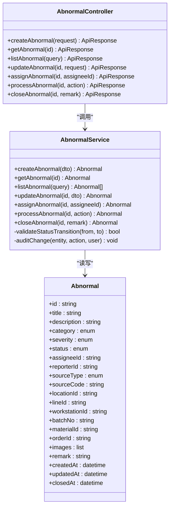
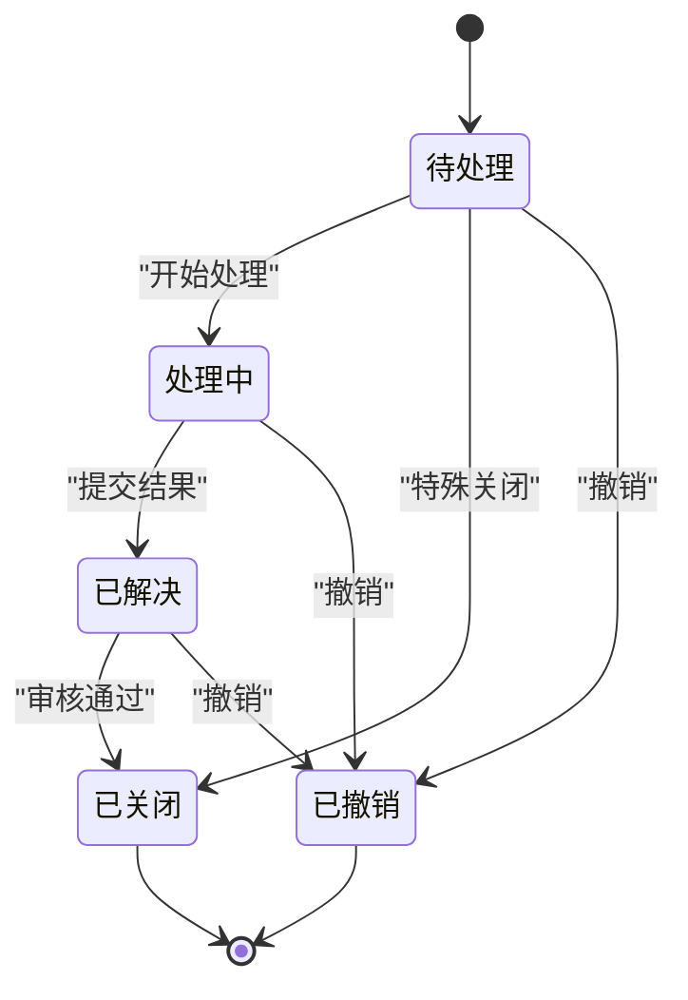
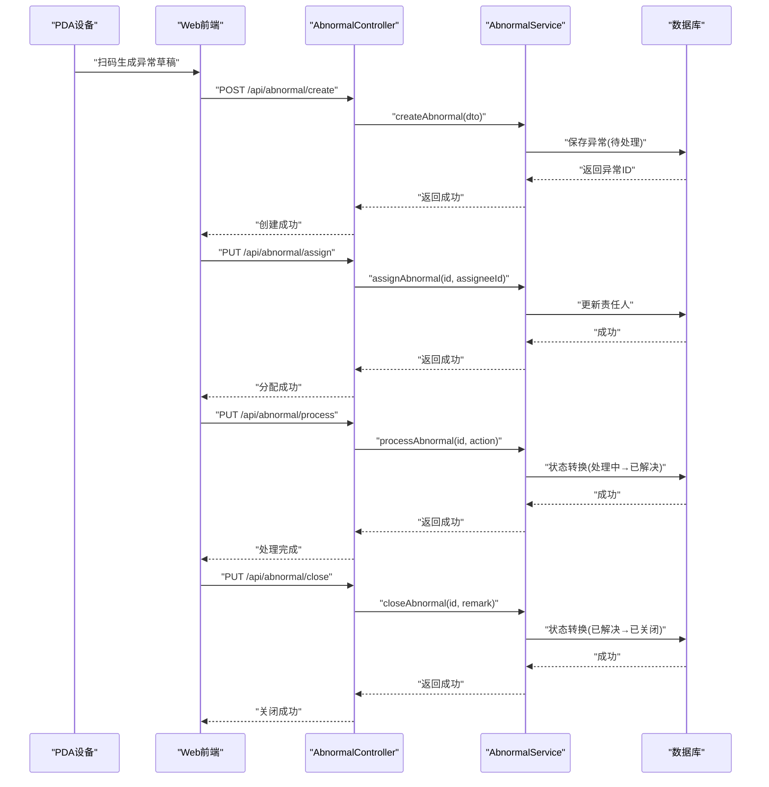
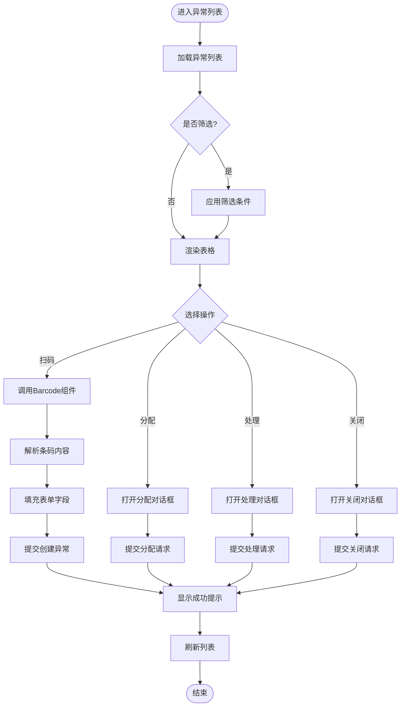
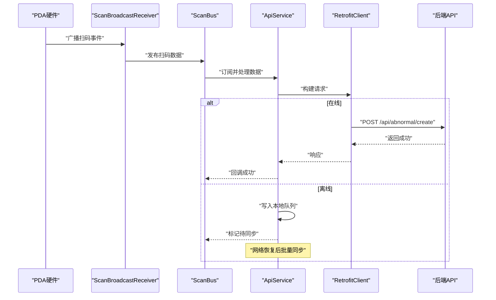
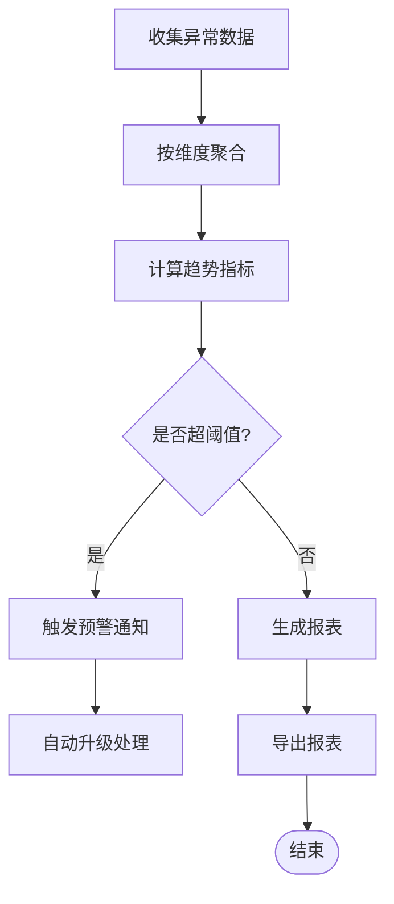
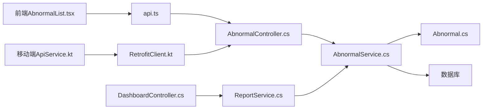

# 异常管理页面

<cite>
**本文引用的文件**   
- [AbnormalController.cs](file://dip-system/api/Controllers/AbnormalController.cs)
- [AbnormalService.cs](file://dip-system/api/Services/AbnormalService.cs)
- [Abnormal.cs](file://dip-system/api/Models/Abnormal.cs)
- [ApiResponse.cs](file://dip-system/api/Models/ApiResponse.cs)
- [AppExceptionFilter.cs](file://dip-system/api/Controllers/AppExceptionFilter.cs)
- [AbnormalList.tsx](file://dip-system/frontend-web/src/pages/AbnormalList.tsx)
- [api.ts](file://dip-system/frontend-web/src/lib/api.ts)
- [Barcode.tsx](file://dip-system/frontend-web/src/lib/Barcode.tsx)
- [ApiService.kt](file://mobile-android/app/src/main/java/com/dip/material/data/network/ApiService.kt)
- [RetrofitClient.kt](file://mobile-android/app/src/main/java/com/dip/material/data/network/RetrofitClient.kt)
- [ScanBroadcastReceiver.kt](file://mobile-android/app/src/main/java/com/dip/material/utils/ScanBroadcastReceiver.kt)
- [ScanBus.kt](file://mobile-android/app/src/main/java/com/dip/material/utils/ScanBus.kt)
- [ScanConfig.kt](file://mobile-android/app/src/main/java/com/dip/material/utils/ScanConfig.kt)
- [ReportService.cs](file://dip-system/api/Services/ReportService.cs)
- [DashboardController.cs](file://dip-system/api/Controllers/DashboardController.cs)
</cite>

## 目录
1. [简介](#简介)
2. [项目结构](#项目结构)
3. [核心组件](#核心组件)
4. [架构总览](#架构总览)
5. [详细组件分析](#详细组件分析)
6. [依赖关系分析](#依赖关系分析)
7. [性能考虑](#性能考虑)
8. [故障排查指南](#故障排查指南)
9. [结论](#结论)
10. [附录](#附录)

## 简介
本文件面向DIP系统的“异常管理”功能，覆盖异常记录、分类、处理与跟踪的完整业务流程；定义异常状态机（待处理、处理中、已解决等）及转换规则；详述异常数据模型字段、验证规则与业务约束；给出异常上报、分配、处理与关闭的工作流；说明统计报表、趋势分析与预警机制的实现要点；并描述与PDA设备的扫码集成与离线数据处理逻辑。文档兼顾技术读者与非技术读者，提供循序渐进的理解路径与可视化图示。

## 项目结构
异常管理涉及后端API控制器、服务层、数据模型、前端Web页面、移动端PDA扫码与网络访问等模块。整体采用前后端分离架构：前端通过REST API调用后端控制器，控制器委托服务层执行业务逻辑，服务层与数据库交互；移动端通过Retrofit访问同一套API，并结合系统广播接收扫码事件，支持离线缓存与同步。

**图表来源** 
- [AbnormalList.tsx](file://dip-system/frontend-web/src/pages/AbnormalList.tsx)
- [api.ts](file://dip-system/frontend-web/src/lib/api.ts)
- [Barcode.tsx](file://dip-system/frontend-web/src/lib/Barcode.tsx)
- [AbnormalController.cs](file://dip-system/api/Controllers/AbnormalController.cs)
- [AbnormalService.cs](file://dip-system/api/Services/AbnormalService.cs)
- [Abnormal.cs](file://dip-system/api/Models/Abnormal.cs)
- [ReportService.cs](file://dip-system/api/Services/ReportService.cs)
- [DashboardController.cs](file://dip-system/api/Controllers/DashboardController.cs)
- [ApiService.kt](file://mobile-android/app/src/main/java/com/dip/material/data/network/ApiService.kt)
- [RetrofitClient.kt](file://mobile-android/app/src/main/java/com/dip/material/data/network/RetrofitClient.kt)
- [ScanBroadcastReceiver.kt](file://mobile-android/app/src/main/java/com/dip/material/utils/ScanBroadcastReceiver.kt)
- [ScanBus.kt](file://mobile-android/app/src/main/java/com/dip/material/utils/ScanBus.kt)
- [ScanConfig.kt](file://mobile-android/app/src/main/java/com/dip/material/utils/ScanConfig.kt)

**章节来源**
- [AbnormalController.cs](file://dip-system/api/Controllers/AbnormalController.cs)
- [AbnormalService.cs](file://dip-system/api/Services/AbnormalService.cs)
- [Abnormal.cs](file://dip-system/api/Models/Abnormal.cs)
- [AbnormalList.tsx](file://dip-system/frontend-web/src/pages/AbnormalList.tsx)
- [api.ts](file://dip-system/frontend-web/src/lib/api.ts)
- [Barcode.tsx](file://dip-system/frontend-web/src/lib/Barcode.tsx)
- [ApiService.kt](file://mobile-android/app/src/main/java/com/dip/material/data/network/ApiService.kt)
- [RetrofitClient.kt](file://mobile-android/app/src/main/java/com/dip/material/data/network/RetrofitClient.kt)
- [ScanBroadcastReceiver.kt](file://mobile-android/app/src/main/java/com/dip/material/utils/ScanBroadcastReceiver.kt)
- [ScanBus.kt](file://mobile-android/app/src/main/java/com/dip/material/utils/ScanBus.kt)
- [ScanConfig.kt](file://mobile-android/app/src/main/java/com/dip/material/utils/ScanConfig.kt)

## 核心组件
- 异常数据模型：定义异常实体字段、枚举类型与校验约束，支撑创建、查询、更新与关闭流程。
- 控制器层：暴露REST接口，负责参数校验、权限控制、结果封装与错误统一处理。
- 服务层：实现异常生命周期管理（创建、分配、处理、关闭）、状态机转换、事务与审计。
- 前端页面：异常列表、详情编辑、扫码录入、分页筛选与操作按钮（分配、处理、关闭）。
- 移动端PDA：扫码事件采集、本地缓存、离线队列与网络同步。
- 报表与看板：异常统计、趋势分析、预警阈值与告警推送。

**章节来源**
- [Abnormal.cs](file://dip-system/api/Models/Abnormal.cs)
- [AbnormalController.cs](file://dip-system/api/Controllers/AbnormalController.cs)
- [AbnormalService.cs](file://dip-system/api/Services/AbnormalService.cs)
- [AbnormalList.tsx](file://dip-system/frontend-web/src/pages/AbnormalList.tsx)
- [api.ts](file://dip-system/frontend-web/src/lib/api.ts)
- [Barcode.tsx](file://dip-system/frontend-web/src/lib/Barcode.tsx)
- [ApiService.kt](file://mobile-android/app/src/main/java/com/dip/material/data/network/ApiService.kt)
- [RetrofitClient.kt](file://mobile-android/app/src/main/java/com/dip/material/data/network/RetrofitClient.kt)
- [ScanBroadcastReceiver.kt](file://mobile-android/app/src/main/java/com/dip/material/utils/ScanBroadcastReceiver.kt)
- [ScanBus.kt](file://mobile-android/app/src/main/java/com/dip/material/utils/ScanBus.kt)
- [ScanConfig.kt](file://mobile-android/app/src/main/java/com/dip/material/utils/ScanConfig.kt)

## 架构总览
异常管理采用分层架构：
- 表现层：Web前端与移动端PDA，负责用户交互与数据采集。
- 应用层：控制器与服务层，编排业务流程、状态转换与权限校验。
- 领域层：异常模型与规则，定义数据模型、枚举与约束。
- 基础设施层：数据库、缓存、消息总线（可选）、日志与监控。

**图表来源** 
- [Abnormal.cs](file://dip-system/api/Models/Abnormal.cs)
- [AbnormalController.cs](file://dip-system/api/Controllers/AbnormalController.cs)
- [AbnormalService.cs](file://dip-system/api/Services/AbnormalService.cs)

**章节来源**
- [Abnormal.cs](file://dip-system/api/Models/Abnormal.cs)
- [AbnormalController.cs](file://dip-system/api/Controllers/AbnormalController.cs)
- [AbnormalService.cs](file://dip-system/api/Services/AbnormalService.cs)

## 详细组件分析

### 异常数据模型与约束
- 关键字段
  - 标识与时间：id、createdAt、updatedAt、closedAt
  - 基本信息：title、description、remark
  - 分类与严重性：category、severity
  - 状态：status（待处理、处理中、已解决、已关闭、已撤销）
  - 关联信息：sourceType、sourceCode（来源类型与编码，如工单号、物料号、批次号）
  - 位置与产线：locationId、lineId、workstationId
  - 人员：reporterId、assigneeId
  - 附件：images（图片URL或Base64）
- 验证规则
  - 必填项：title、category、severity、status默认值
  - 长度限制：title、description、remark
  - 枚举校验：category、severity、status、sourceType
  - 关联有效性：locationId、lineId、workstationId、materialId、orderId存在性检查
- 业务约束
  - 状态转换必须遵循状态机规则
  - 分配前需指定责任人
  - 关闭需提供处理备注与必要证据（图片）
  - 审计日志记录关键变更

**章节来源**
- [Abnormal.cs](file://dip-system/api/Models/Abnormal.cs)

### 异常状态机设计
- 状态集合
  - 待处理（Pending）
  - 处理中（Processing）
  - 已解决（Resolved）
  - 已关闭（Closed）
  - 已撤销（Cancelled）
- 转换规则
  - 待处理 → 处理中：由责任人执行“开始处理”
  - 处理中 → 已解决：提交处理结果与证据
  - 已解决 → 已关闭：审核通过后关闭
  - 任意状态 → 已撤销：管理员撤销（需原因）
  - 待处理 → 已关闭：直接关闭（特殊情况）
- 约束与审计
  - 非法转换抛出异常并记录审计
  - 每次转换记录操作人、时间与备注

**图表来源** 
- [AbnormalService.cs](file://dip-system/api/Services/AbnormalService.cs)

**章节来源**
- [AbnormalService.cs](file://dip-system/api/Services/AbnormalService.cs)

### 异常工作流（上报、分配、处理、关闭）
- 上报
  - Web/PDA触发创建异常，填写必填信息与附件
  - 后端校验并持久化，初始状态为“待处理”
- 分配
  - 管理员或班组长分配责任人
  - 状态保持“待处理”，记录assigneeId
- 处理
  - 责任人点击“开始处理”，状态转为“处理中”
  - 提交处理结果与证据，状态转为“已解决”
- 关闭
  - 审核通过后，状态转为“已关闭”，记录closedAt
- 撤销
  - 管理员可撤销异常，状态转为“已撤销”

**图表来源** 
- [AbnormalController.cs](file://dip-system/api/Controllers/AbnormalController.cs)
- [AbnormalService.cs](file://dip-system/api/Services/AbnormalService.cs)
- [Abnormal.cs](file://dip-system/api/Models/Abnormal.cs)

**章节来源**
- [AbnormalController.cs](file://dip-system/api/Controllers/AbnormalController.cs)
- [AbnormalService.cs](file://dip-system/api/Services/AbnormalService.cs)
- [Abnormal.cs](file://dip-system/api/Models/Abnormal.cs)

### 前端异常列表与扫码集成
- 列表页功能
  - 分页、筛选（状态、分类、严重性、时间范围）
  - 操作按钮：分配、处理、关闭、查看详情
  - 实时刷新与乐观更新
- 扫码集成
  - 使用Barcode组件解析条码/二维码
  - 自动填充sourceCode、materialId、orderId等字段
  - 支持批量扫描与去重
- 表单校验
  - 前端即时校验提示
  - 必填项与格式校验

**图表来源** 
- [AbnormalList.tsx](file://dip-system/frontend-web/src/pages/AbnormalList.tsx)
- [Barcode.tsx](file://dip-system/frontend-web/src/lib/Barcode.tsx)
- [api.ts](file://dip-system/frontend-web/src/lib/api.ts)

**章节来源**
- [AbnormalList.tsx](file://dip-system/frontend-web/src/pages/AbnormalList.tsx)
- [Barcode.tsx](file://dip-system/frontend-web/src/lib/Barcode.tsx)
- [api.ts](file://dip-system/frontend-web/src/lib/api.ts)

### 移动端PDA扫码与离线处理
- 扫码采集
  - 通过系统广播接收扫码事件（ScanBroadcastReceiver）
  - 使用ScanBus进行事件分发与订阅
  - ScanConfig配置扫码参数（格式、过滤规则）
- 网络与缓存
  - RetrofitClient统一网络配置与拦截器
  - ApiService定义异常相关接口
  - 离线时写入本地队列，网络恢复后批量同步
- 用户体验
  - 扫码成功提示音与震动反馈
  - 离线状态指示与重试机制

**图表来源** 
- [ScanBroadcastReceiver.kt](file://mobile-android/app/src/main/java/com/dip/material/utils/ScanBroadcastReceiver.kt)
- [ScanBus.kt](file://mobile-android/app/src/main/java/com/dip/material/utils/ScanBus.kt)
- [ScanConfig.kt](file://mobile-android/app/src/main/java/com/dip/material/utils/ScanConfig.kt)
- [ApiService.kt](file://mobile-android/app/src/main/java/com/dip/material/data/network/ApiService.kt)
- [RetrofitClient.kt](file://mobile-android/app/src/main/java/com/dip/material/data/network/RetrofitClient.kt)

**章节来源**
- [ScanBroadcastReceiver.kt](file://mobile-android/app/src/main/java/com/dip/material/utils/ScanBroadcastReceiver.kt)
- [ScanBus.kt](file://mobile-android/app/src/main/java/com/dip/material/utils/ScanBus.kt)
- [ScanConfig.kt](file://mobile-android/app/src/main/java/com/dip/material/utils/ScanConfig.kt)
- [ApiService.kt](file://mobile-android/app/src/main/java/com/dip/material/data/network/ApiService.kt)
- [RetrofitClient.kt](file://mobile-android/app/src/main/java/com/dip/material/data/network/RetrofitClient.kt)

### 统计报表、趋势分析与预警机制
- 统计维度
  - 按分类、严重性、状态、时间（日/周/月）聚合
  - 平均处理时长、关闭率、重复发生率
- 趋势分析
  - 折线图展示异常数量变化
  - 热力图展示产线/工位异常分布
- 预警机制
  - 阈值配置（如某类异常超过N条/小时）
  - 触发告警通知（站内信、邮件、短信）
  - 自动升级策略（长时间未处理自动升级）

**图表来源** 
- [ReportService.cs](file://dip-system/api/Services/ReportService.cs)
- [DashboardController.cs](file://dip-system/api/Controllers/DashboardController.cs)

**章节来源**
- [ReportService.cs](file://dip-system/api/Services/ReportService.cs)
- [DashboardController.cs](file://dip-system/api/Controllers/DashboardController.cs)

## 依赖关系分析
- 控制器依赖服务层，服务层依赖数据模型与数据库
- 前端依赖API封装与扫码组件
- 移动端依赖网络库与系统广播
- 报表服务依赖异常数据源与聚合逻辑

**图表来源** 
- [AbnormalList.tsx](file://dip-system/frontend-web/src/pages/AbnormalList.tsx)
- [api.ts](file://dip-system/frontend-web/src/lib/api.ts)
- [AbnormalController.cs](file://dip-system/api/Controllers/AbnormalController.cs)
- [AbnormalService.cs](file://dip-system/api/Services/AbnormalService.cs)
- [Abnormal.cs](file://dip-system/api/Models/Abnormal.cs)
- [ApiService.kt](file://mobile-android/app/src/main/java/com/dip/material/data/network/ApiService.kt)
- [RetrofitClient.kt](file://mobile-android/app/src/main/java/com/dip/material/data/network/RetrofitClient.kt)
- [ReportService.cs](file://dip-system/api/Services/ReportService.cs)
- [DashboardController.cs](file://dip-system/api/Controllers/DashboardController.cs)

**章节来源**
- [AbnormalController.cs](file://dip-system/api/Controllers/AbnormalController.cs)
- [AbnormalService.cs](file://dip-system/api/Services/AbnormalService.cs)
- [Abnormal.cs](file://dip-system/api/Models/Abnormal.cs)
- [AbnormalList.tsx](file://dip-system/frontend-web/src/pages/AbnormalList.tsx)
- [api.ts](file://dip-system/frontend-web/src/lib/api.ts)
- [ApiService.kt](file://mobile-android/app/src/main/java/com/dip/material/data/network/ApiService.kt)
- [RetrofitClient.kt](file://mobile-android/app/src/main/java/com/dip/material/data/network/RetrofitClient.kt)
- [ReportService.cs](file://dip-system/api/Services/ReportService.cs)
- [DashboardController.cs](file://dip-system/api/Controllers/DashboardController.cs)

## 性能考虑
- 数据库索引
  - 对常用查询字段建立索引（status、category、severity、createdAt）
  - 复合索引优化分页与筛选
- 缓存策略
  - 热点数据（字典、分类）使用内存缓存
  - 报表数据定时预计算与缓存
- 异步处理
  - 大文件上传与图片压缩异步处理
  - 批量同步任务使用后台作业
- 前端优化
  - 虚拟滚动与懒加载
  - 防抖与节流减少请求频率

[本节为通用性能建议，不直接分析具体文件]

## 故障排查指南
- 常见错误
  - 状态转换失败：检查当前状态与目标状态是否符合规则
  - 权限不足：确认用户角色与操作权限
  - 网络超时：检查网络连接与重试策略
  - 扫码失败：确认硬件驱动与广播接收器配置
- 调试步骤
  - 查看后端日志与审计记录
  - 检查前端控制台与网络请求
  - 验证移动端本地队列与同步状态
- 统一异常处理
  - AppExceptionFilter捕获全局异常并返回标准响应

**章节来源**
- [AppExceptionFilter.cs](file://dip-system/api/Controllers/AppExceptionFilter.cs)
- [ApiResponse.cs](file://dip-system/api/Models/ApiResponse.cs)

## 结论
异常管理模块通过清晰的状态机与严谨的数据模型，实现了从上报到关闭的全流程闭环管理。前端与移动端协同提供便捷的扫码录入与离线处理能力，报表与预警机制为管理层提供决策支持。建议在后续迭代中加强审计追踪、权限细化与性能优化，以提升系统稳定性与用户体验。

[本节为总结性内容，不直接分析具体文件]

## 附录
- 术语表
  - 异常：生产过程中的问题记录，用于跟踪与改进
  - 状态机：定义对象状态及其转换规则的状态模型
  - 扫码集成：通过硬件扫描设备采集条码/二维码数据
  - 离线处理：在网络不可用时本地缓存，恢复后同步
- 参考文件
  - 数据模型：[Abnormal.cs](file://dip-system/api/Models/Abnormal.cs)
  - 控制器：[AbnormalController.cs](file://dip-system/api/Controllers/AbnormalController.cs)
  - 服务层：[AbnormalService.cs](file://dip-system/api/Services/AbnormalService.cs)
  - 前端页面：[AbnormalList.tsx](file://dip-system/frontend-web/src/pages/AbnormalList.tsx)
  - 移动端网络：[ApiService.kt](file://mobile-android/app/src/main/java/com/dip/material/data/network/ApiService.kt)
  - 扫码组件：[Barcode.tsx](file://dip-system/frontend-web/src/lib/Barcode.tsx)

[本节为附录内容，不直接分析具体文件]