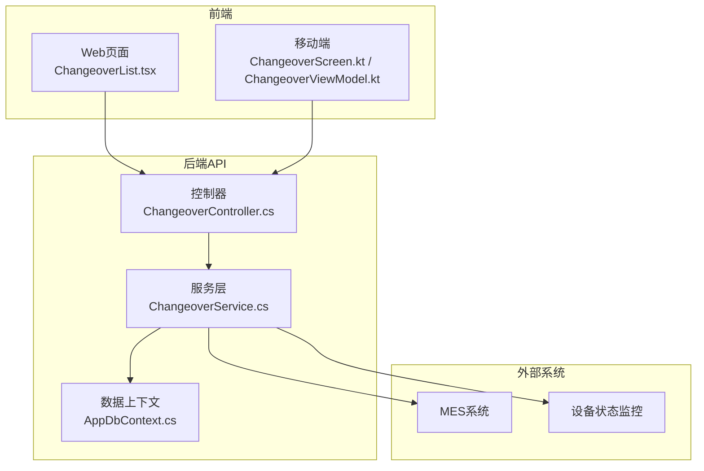
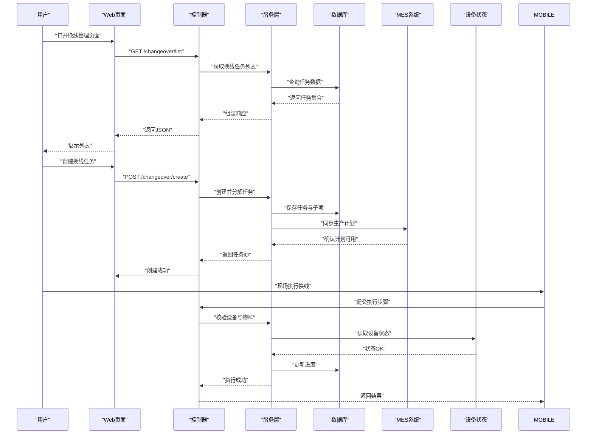
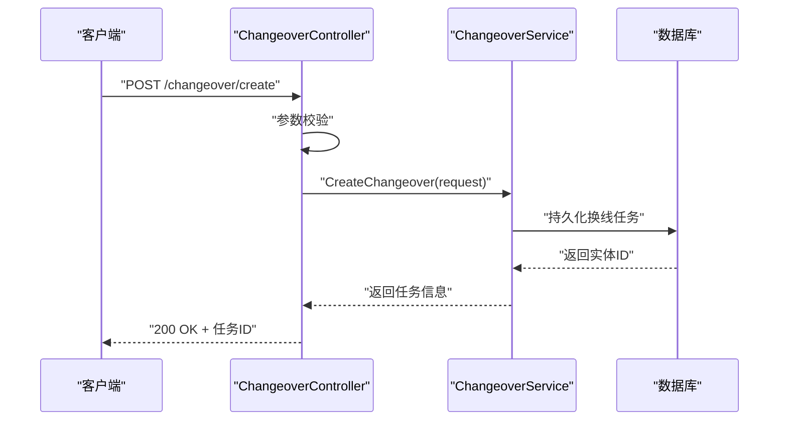
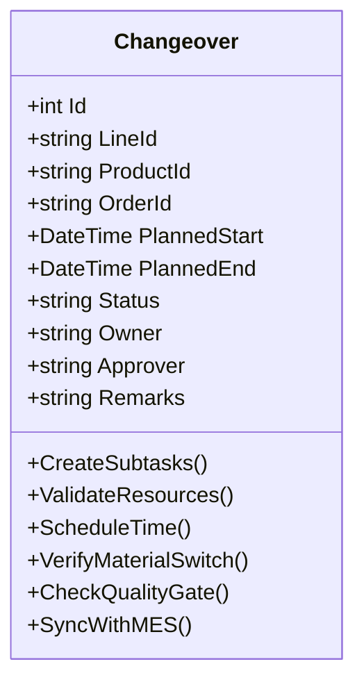
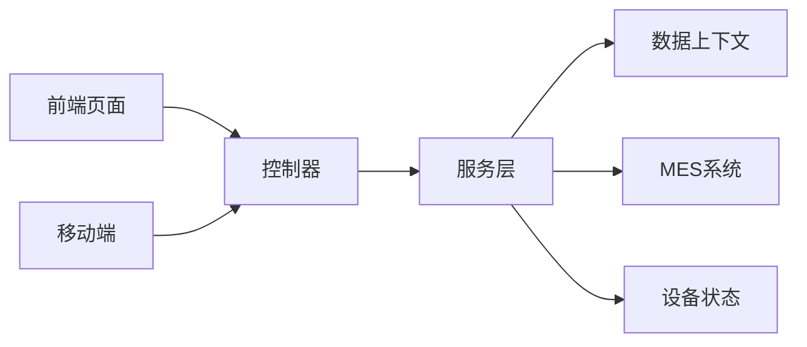

# 换线管理页面

<cite>
**本文引用的文件**   
- [ChangeoverController.cs](file://dip-system/api/Controllers/ChangeoverController.cs)
- [ChangeoverService.cs](file://dip-system/api/Services/ChangeoverService.cs)
- [Changeover.cs](file://dip-system/api/Models/Changeover.cs)
- [ChangeoverList.tsx](file://dip-system/frontend-web/src/pages/ChangeoverList.tsx)
- [ChangeoverScreen.kt](file://mobile-android/app/src/main/java/com/dip/material/ui/changeover/ChangeoverScreen.kt)
- [ChangeoverViewModel.kt](file://mobile-android/app/src/main/java/com/dip/material/ui/changeover/ChangeoverViewModel.kt)
- [AppDbContext.cs](file://dip-system/api/Data/AppDbContext.cs)
- [Program.cs](file://dip-system/api/Program.cs)
- [api.ts](file://dip-system/frontend-web/src/lib/api.ts)
</cite>

## 目录
1. [简介](#简介)
2. [项目结构](#项目结构)
3. [核心组件](#核心组件)
4. [架构总览](#架构总览)
5. [详细组件分析](#详细组件分析)
6. [依赖关系分析](#依赖关系分析)
7. [性能考虑](#性能考虑)
8. [故障排查指南](#故障排查指南)
9. [结论](#结论)
10. [附录](#附录)

## 简介
本文件面向DIP系统的“换线管理”功能，覆盖生产线换线的准备、执行与确认的标准化流程。文档从系统架构、数据模型、前后端交互、移动端操作到MES集成与设备状态监控进行系统化说明，并给出换线任务分解、资源调度与时间规划算法建议，以及效率分析与停机统计方法。同时提供模板管理与最佳实践库的设计思路，帮助团队沉淀经验、提升换线效率与质量。

## 项目结构
换线管理涉及后端API、领域服务、数据模型、前端Web页面与移动端界面：
- 后端API层：控制器负责HTTP接口定义与参数校验，服务层封装业务逻辑（任务分解、资源校验、计划编排等），数据访问通过EF Core上下文完成持久化。
- 前端Web：以React+TypeScript实现换线列表与操作界面，调用后端API完成创建、查询、审批与确认。
- 移动端：Android应用提供现场扫码、设备检查、物料核对与换线执行的便捷入口。

图表来源
- [ChangeoverController.cs](file://dip-system/api/Controllers/ChangeoverController.cs)
- [ChangeoverService.cs](file://dip-system/api/Services/ChangeoverService.cs)
- [AppDbContext.cs](file://dip-system/api/Data/AppDbContext.cs)
- [ChangeoverList.tsx](file://dip-system/frontend-web/src/pages/ChangeoverList.tsx)
- [ChangeoverScreen.kt](file://mobile-android/app/src/main/java/com/dip/material/ui/changeover/ChangeoverScreen.kt)
- [ChangeoverViewModel.kt](file://mobile-android/app/src/main/java/com/dip/material/ui/changeover/ChangeoverViewModel.kt)

章节来源
- [Program.cs](file://dip-system/api/Program.cs)

## 核心组件
- 控制器（ChangeoverController）：暴露换线相关的REST接口，包括创建换线任务、查询任务列表、提交执行、确认完成、回滚与审计记录等。
- 服务（ChangeoverService）：封装换线业务逻辑，如任务分解、资源可用性校验、时间与工序排程、物料切换验证、质量检查点控制、与MES和设备状态的交互。
- 数据模型（Changeover）：定义换线任务实体及其关联信息（产线、产品、工序、资源、计划时间、状态、审核人、备注等）。
- Web页面（ChangeoverList）：展示换线任务列表、筛选、创建与操作按钮，调用API完成业务流程。
- 移动端（ChangeoverScreen/ViewModel）：提供现场操作能力，如扫码识别、设备自检、物料核对、执行步骤推进与结果上报。

章节来源
- [ChangeoverController.cs](file://dip-system/api/Controllers/ChangeoverController.cs)
- [ChangeoverService.cs](file://dip-system/api/Services/ChangeoverService.cs)
- [Changeover.cs](file://dip-system/api/Models/Changeover.cs)
- [ChangeoverList.tsx](file://dip-system/frontend-web/src/pages/ChangeoverList.tsx)
- [ChangeoverScreen.kt](file://mobile-android/app/src/main/java/com/dip/material/ui/changeover/ChangeoverScreen.kt)
- [ChangeoverViewModel.kt](file://mobile-android/app/src/main/java/com/dip/material/ui/changeover/ChangeoverViewModel.kt)

## 架构总览
换线管理的整体架构遵循分层设计：前端与移动端通过HTTP调用后端API；控制器将请求路由至服务层；服务层协调数据访问与外部系统集成；数据通过EF Core持久化。

图表来源
- [ChangeoverController.cs](file://dip-system/api/Controllers/ChangeoverController.cs)
- [ChangeoverService.cs](file://dip-system/api/Services/ChangeoverService.cs)
- [AppDbContext.cs](file://dip-system/api/Data/AppDbContext.cs)
- [ChangeoverList.tsx](file://dip-system/frontend-web/src/pages/ChangeoverList.tsx)
- [ChangeoverScreen.kt](file://mobile-android/app/src/main/java/com/dip/material/ui/changeover/ChangeoverScreen.kt)
- [ChangeoverViewModel.kt](file://mobile-android/app/src/main/java/com/dip/material/ui/changeover/ChangeoverViewModel.kt)

## 详细组件分析

### 控制器（ChangeoverController）
职责与要点：
- 定义换线相关REST接口，包括列表查询、创建、执行提交、确认完成、回滚与审计。
- 对输入参数进行基础校验（必填字段、格式、权限）。
- 调用服务层处理业务逻辑，统一异常包装与响应格式。

关键流程示例（序列图）：

图表来源
- [ChangeoverController.cs](file://dip-system/api/Controllers/ChangeoverController.cs)
- [ChangeoverService.cs](file://dip-system/api/Services/ChangeoverService.cs)
- [AppDbContext.cs](file://dip-system/api/Data/AppDbContext.cs)

章节来源
- [ChangeoverController.cs](file://dip-system/api/Controllers/ChangeoverController.cs)

### 服务层（ChangeoverService）
职责与要点：
- 换线任务分解：根据产品BOM与工艺路线生成子任务（设备设置、工装夹具、物料准备、程序下载、首件检验等）。
- 资源调度：校验设备、人员、工具、物料的可用性，冲突检测与替代方案。
- 时间规划：基于工序依赖与资源占用计算最短换线时长，输出甘特图数据。
- 物料切换验证：比对新旧物料清单，校验批次、有效期、替代料策略。
- 质量检查点：在关键节点插入首件检验、参数复核、追溯记录。
- 外部集成：与MES同步计划变更，读取设备状态，推送换线事件。

算法与建议：
- 任务分解采用有向无环图（DAG）建模工序依赖，使用拓扑排序确定执行顺序。
- 资源调度采用贪心或约束求解（如最小化最大延迟）优化排程。
- 时间规划结合历史换线数据训练预测模型，动态调整缓冲时间。

章节来源
- [ChangeoverService.cs](file://dip-system/api/Services/ChangeoverService.cs)

### 数据模型（Changeover）
字段与关系（概念性描述）：
- 主键：换线任务ID
- 关联：产线ID、产品ID、订单ID、计划开始/结束时间、当前状态、负责人、审核人、备注
- 子任务：设备设置、物料准备、程序下载、首件检验等
- 审计：创建时间、更新时间、操作人

图表来源
- [Changeover.cs](file://dip-system/api/Models/Changeover.cs)

章节来源
- [Changeover.cs](file://dip-system/api/Models/Changeover.cs)

### Web页面（ChangeoverList）
功能与交互：
- 展示换线任务列表，支持按产线、产品、状态筛选。
- 提供创建、编辑、执行、确认、回滚等操作按钮。
- 调用API获取数据与提交操作，错误提示与加载状态管理。

章节来源
- [ChangeoverList.tsx](file://dip-system/frontend-web/src/pages/ChangeoverList.tsx)
- [api.ts](file://dip-system/frontend-web/src/lib/api.ts)

### 移动端（ChangeoverScreen/ViewModel）
功能与交互：
- 现场扫码识别设备条码、物料条码，自动填充检查项。
- 设备自检：读取设备状态、校准参数、安全联锁。
- 物料核对：扫描物料批次，校验有效期与替代策略。
- 执行推进：按步骤推进换线，记录耗时与异常。
- 结果上报：提交执行结果与照片/视频证据。

章节来源
- [ChangeoverScreen.kt](file://mobile-android/app/src/main/java/com/dip/material/ui/changeover/ChangeoverScreen.kt)
- [ChangeoverViewModel.kt](file://mobile-android/app/src/main/java/com/dip/material/ui/changeover/ChangeoverViewModel.kt)

## 依赖关系分析
换线模块依赖关系如下：
- 控制器依赖服务层，服务层依赖数据上下文与外部系统（MES、设备监控）。
- 前端与移动端依赖API接口契约，确保数据结构一致。
- 数据模型与数据库表映射由EF Core管理。

图表来源
- [ChangeoverController.cs](file://dip-system/api/Controllers/ChangeoverController.cs)
- [ChangeoverService.cs](file://dip-system/api/Services/ChangeoverService.cs)
- [AppDbContext.cs](file://dip-system/api/Data/AppDbContext.cs)

章节来源
- [Program.cs](file://dip-system/api/Program.cs)

## 性能考虑
- 列表查询分页与索引优化，避免全表扫描。
- 任务分解与排程计算异步化，减少接口响应时间。
- 缓存常用配置（设备能力、物料替代规则）降低重复计算。
- 批量提交与事务合并，减少数据库往返。
- 移动端离线缓存与增量同步，提升现场操作体验。

## 故障排查指南
常见问题与定位方法：
- 接口报错：检查控制器参数校验与服务层异常日志。
- 数据不一致：查看数据库事务与审计记录，确认是否部分提交。
- MES集成失败：检查网络连通性与消息格式，重试机制与降级策略。
- 设备状态异常：读取设备监控接口，确认传感器与联锁状态。
- 物料切换失败：核对BOM与库存批次，检查替代料策略与有效期。

章节来源
- [ChangeoverService.cs](file://dip-system/api/Services/ChangeoverService.cs)

## 结论
换线管理是DIP系统的关键环节，通过标准化的准备、执行与确认流程，结合任务分解、资源调度与时间规划算法，可显著提升换线效率与质量。建议持续积累模板与最佳实践，完善MES集成与设备监控，形成闭环改进机制。

## 附录
- 换线模板管理：建立标准换线模板（设备设置、物料清单、检查点），支持版本管理与差异对比。
- 最佳实践库：收集历史换线案例、问题与解决方案，提供检索与推荐。
- 效率分析：统计平均换线时长、瓶颈工序、资源利用率，输出改进建议。
- 停机统计：按产线、产品、班次统计停机时间，分析原因与趋势。
- 质量保证：首件检验合格率、参数偏差率、追溯完整率等指标监控。