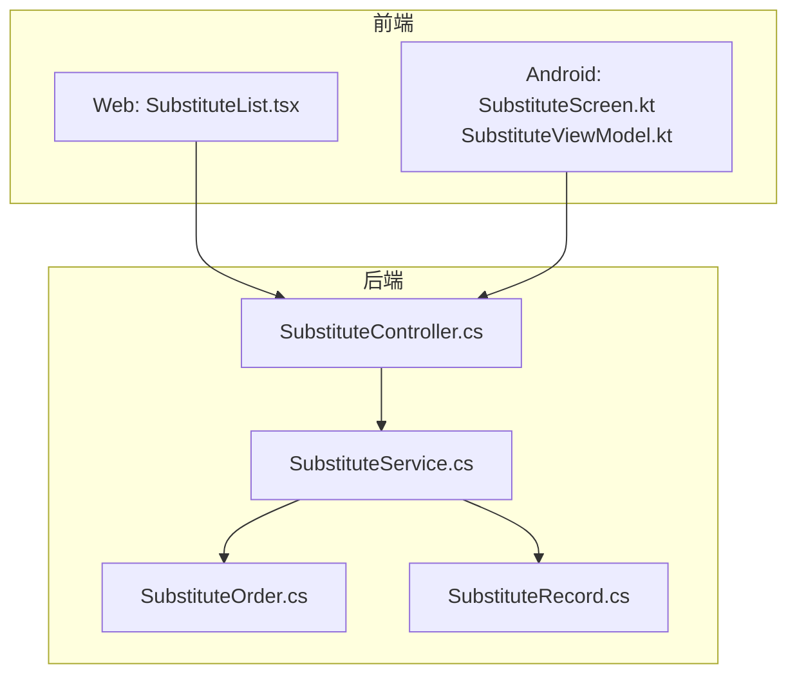
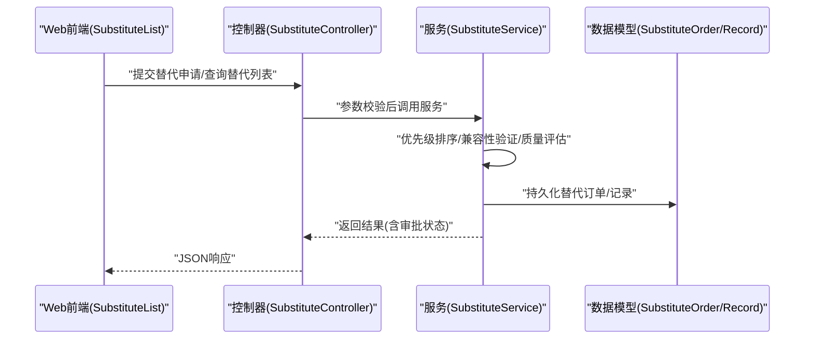
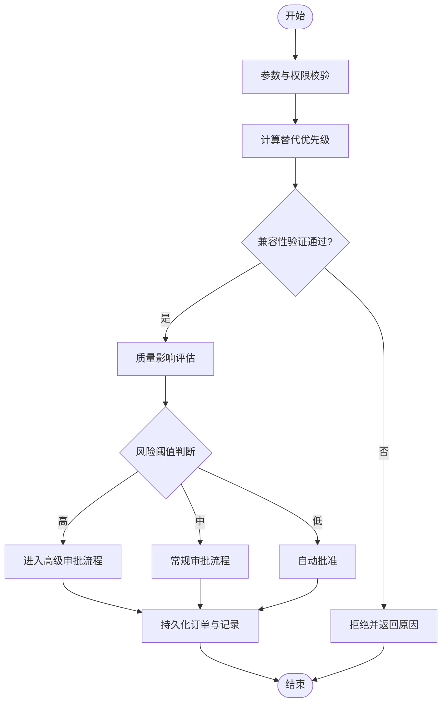
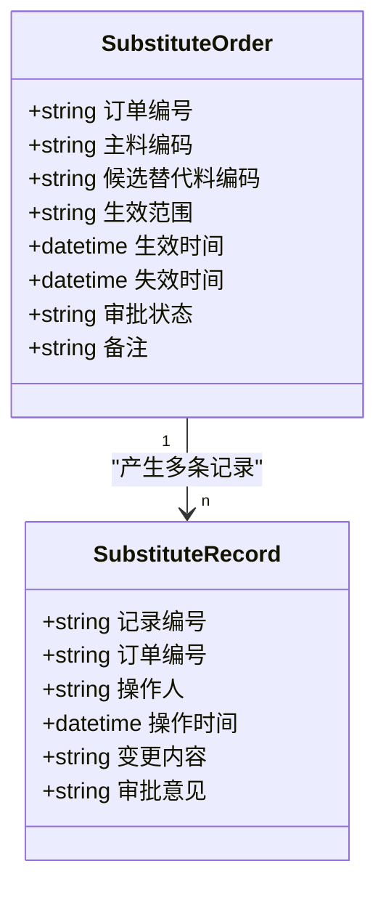
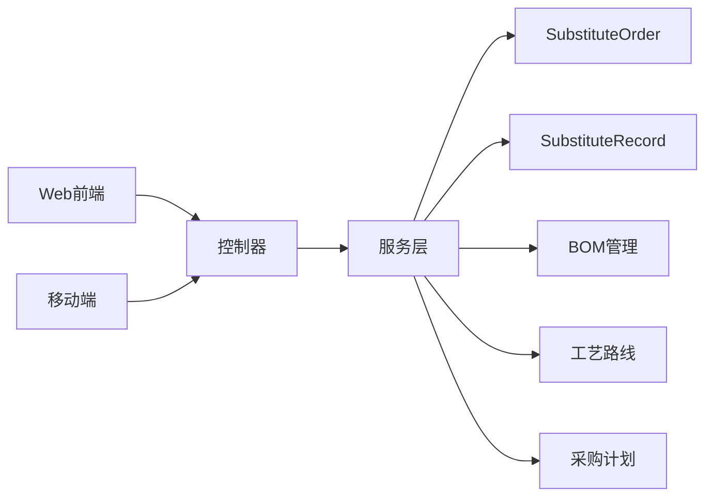

# 替代管理页面

<cite>
**本文引用的文件**   
- [SubstituteController.cs](file://dip-system/api/Controllers/SubstituteController.cs)
- [SubstituteService.cs](file://dip-system/api/Services/SubstituteService.cs)
- [SubstituteOrder.cs](file://dip-system/api/Models/SubstituteOrder.cs)
- [SubstituteRecord.cs](file://dip-system/api/Models/SubstituteRecord.cs)
- [SubstituteList.tsx](file://dip-system/frontend-web/src/pages/SubstituteList.tsx)
- [SubstituteScreen.kt](file://mobile-android/app/src/main/java/com/dip/material/ui/substitute/SubstituteScreen.kt)
- [SubstituteViewModel.kt](file://mobile-android/app/src/main/java/com/dip/material/ui/substitute/SubstituteViewModel.kt)
- [2026-07-13-substitute-redesign-plan.md](file://dip-system/docs/superpowers/plans/2026-07-13-substitute-redesign-plan.md)
</cite>

## 目录
1. [简介](#简介)
2. [项目结构](#项目结构)
3. [核心组件](#核心组件)
4. [架构总览](#架构总览)
5. [详细组件分析](#详细组件分析)
6. [依赖关系分析](#依赖关系分析)
7. [性能考虑](#性能考虑)
8. [故障排查指南](#故障排查指南)
9. [结论](#结论)
10. [附录](#附录)

## 简介
本文件为DIP系统“替代管理页面”的综合文档，围绕物料替代策略、替代关系管理与替代决策引擎展开，覆盖替代优先级排序、兼容性验证与质量影响评估机制；同时说明替代规则配置、生效范围与时间控制功能，并文档化替代审批流程、变更记录与版本管理。此外，提供替代效果分析、成本对比与供应链弹性评估方法，以及与BOM管理、工艺路线和采购计划的系统集成要点。

## 项目结构
替代管理功能贯穿后端API、服务层、数据模型、前端Web与移动端：
- 后端API控制器负责接收请求、参数校验与响应封装
- 服务层实现替代策略、优先级排序、兼容性与质量评估、审批流与审计记录
- 数据模型承载替代订单、替代记录等实体
- 前端Web提供替代列表、规则配置、审批操作界面
- 移动端提供现场扫码与快速替代操作能力

**图表来源** 
- [SubstituteList.tsx](file://dip-system/frontend-web/src/pages/SubstituteList.tsx)
- [SubstituteScreen.kt](file://mobile-android/app/src/main/java/com/dip/material/ui/substitute/SubstituteScreen.kt)
- [SubstituteViewModel.kt](file://mobile-android/app/src/main/java/com/dip/material/ui/substitute/SubstituteViewModel.kt)
- [SubstituteController.cs](file://dip-system/api/Controllers/SubstituteController.cs)
- [SubstituteService.cs](file://dip-system/api/Services/SubstituteService.cs)
- [SubstituteOrder.cs](file://dip-system/api/Models/SubstituteOrder.cs)
- [SubstituteRecord.cs](file://dip-system/api/Models/SubstituteRecord.cs)

**章节来源**
- [SubstituteController.cs](file://dip-system/api/Controllers/SubstituteController.cs)
- [SubstituteService.cs](file://dip-system/api/Services/SubstituteService.cs)
- [SubstituteOrder.cs](file://dip-system/api/Models/SubstituteOrder.cs)
- [SubstituteRecord.cs](file://dip-system/api/Models/SubstituteRecord.cs)
- [SubstituteList.tsx](file://dip-system/frontend-web/src/pages/SubstituteList.tsx)
- [SubstituteScreen.kt](file://mobile-android/app/src/main/java/com/dip/material/ui/substitute/SubstituteScreen.kt)
- [SubstituteViewModel.kt](file://mobile-android/app/src/main/java/com/dip/material/ui/substitute/SubstituteViewModel.kt)

## 核心组件
- 替代控制器（SubstituteController）：暴露替代相关的REST接口，处理创建、查询、审批、生效/停用等操作
- 替代服务（SubstituteService）：实现替代策略引擎，包括优先级排序、兼容性验证、质量影响评估、审批流转与审计记录
- 替代订单（SubstituteOrder）：描述一次替代申请或变更的上下文信息，包含主料、候选替代料、生效范围、时间窗口、审批状态等
- 替代记录（SubstituteRecord）：记录每次替代执行的结果与审计轨迹，用于追溯与分析

关键职责划分：
- 控制器仅做入参校验与调用服务，不承载业务逻辑
- 服务层集中替代决策、规则计算与跨模块协调
- 模型承载数据契约，保证前后端一致

**章节来源**
- [SubstituteController.cs](file://dip-system/api/Controllers/SubstituteController.cs)
- [SubstituteService.cs](file://dip-system/api/Services/SubstituteService.cs)
- [SubstituteOrder.cs](file://dip-system/api/Models/SubstituteOrder.cs)
- [SubstituteRecord.cs](file://dip-system/api/Models/SubstituteRecord.cs)

## 架构总览
替代管理采用分层架构：前端通过HTTP调用后端控制器，控制器委托服务完成替代策略计算与审批流转，服务读写数据模型并与其他子系统交互（如BOM、工艺路线、采购计划）。

**图表来源** 
- [SubstituteController.cs](file://dip-system/api/Controllers/SubstituteController.cs)
- [SubstituteService.cs](file://dip-system/api/Services/SubstituteService.cs)
- [SubstituteOrder.cs](file://dip-system/api/Models/SubstituteOrder.cs)
- [SubstituteRecord.cs](file://dip-system/api/Models/SubstituteRecord.cs)
- [SubstituteList.tsx](file://dip-system/frontend-web/src/pages/SubstituteList.tsx)

## 详细组件分析

### 替代控制器（SubstituteController）
- 职责：定义替代相关API端点，统一入参校验、权限检查、异常过滤与响应封装
- 典型操作：
  - 创建替代申请：接收主料、候选替代料、生效范围、时间窗口、备注等
  - 查询替代列表：支持按产品、工厂、物料、状态、时间范围筛选
  - 审批操作：提交、驳回、批准、撤销等
  - 生效/停用：控制规则的生效范围与时间
- 错误处理：对非法参数、重复申请、越权操作进行明确返回

**章节来源**
- [SubstituteController.cs](file://dip-system/api/Controllers/SubstituteController.cs)

### 替代服务（SubstituteService）
- 职责：实现替代决策引擎与业务流程编排
- 核心能力：
  - 替代优先级排序：基于成本、交期、质量等级、供应商可靠性、库存可用性等维度加权评分
  - 兼容性验证：检查电气特性、封装、温度范围、认证资质、法规限制等
  - 质量影响评估：评估替换对良率、可靠性、测试覆盖率的影响，必要时触发额外检验
  - 审批流程：根据金额、风险等级、变更类型路由至不同审批人
  - 审计记录：记录每次操作的变更轨迹，支持版本回溯
- 集成点：
  - BOM管理：读取BOM用量与层级，评估替代对装配的影响
  - 工艺路线：校验工艺参数是否适配替代料
  - 采购计划：联动采购可用性、交期与价格波动

**图表来源** 
- [SubstituteService.cs](file://dip-system/api/Services/SubstituteService.cs)

**章节来源**
- [SubstituteService.cs](file://dip-system/api/Services/SubstituteService.cs)

### 数据模型（SubstituteOrder / SubstituteRecord）
- SubstituteOrder：承载替代申请的上下文，包括主料编码、候选替代料编码、生效范围（工厂/产线/产品）、时间窗口（生效/失效时间）、审批状态、备注等
- SubstituteRecord：记录替代执行的审计轨迹，包括操作人、时间戳、变更内容、审批意见、关联订单号等

**图表来源** 
- [SubstituteOrder.cs](file://dip-system/api/Models/SubstituteOrder.cs)
- [SubstituteRecord.cs](file://dip-system/api/Models/SubstituteRecord.cs)

**章节来源**
- [SubstituteOrder.cs](file://dip-system/api/Models/SubstituteOrder.cs)
- [SubstituteRecord.cs](file://dip-system/api/Models/SubstituteRecord.cs)

### 前端Web（SubstituteList.tsx）
- 功能：展示替代列表、筛选条件、创建/编辑替代申请、提交审批、查看审批进度与历史记录
- 交互：分页加载、搜索过滤、表单校验、操作反馈（成功/失败提示）
- 集成：调用后端替代API，渲染审批状态与时间窗口

**章节来源**
- [SubstituteList.tsx](file://dip-system/frontend-web/src/pages/SubstituteList.tsx)

### 移动端（SubstituteScreen.kt / SubstituteViewModel.kt）
- 功能：现场扫码识别物料，快速发起替代申请，查看替代建议与审批状态
- 交互：扫描输入、异步加载建议、确认提交、结果提示
- 集成：通过Retrofit调用后端API，ViewModel管理状态与生命周期

**章节来源**
- [SubstituteScreen.kt](file://mobile-android/app/src/main/java/com/dip/material/ui/substitute/SubstituteScreen.kt)
- [SubstituteViewModel.kt](file://mobile-android/app/src/main/java/com/dip/material/ui/substitute/SubstituteViewModel.kt)

## 依赖关系分析
- 控制器依赖服务层，服务层依赖数据模型与外部子系统（BOM、工艺、采购）
- 前端与移动端均依赖后端API，形成松耦合的HTTP契约
- 替代决策引擎内部存在多步骤依赖：优先级排序→兼容性验证→质量评估→审批路由→持久化

**图表来源** 
- [SubstituteController.cs](file://dip-system/api/Controllers/SubstituteController.cs)
- [SubstituteService.cs](file://dip-system/api/Services/SubstituteService.cs)
- [SubstituteOrder.cs](file://dip-system/api/Models/SubstituteOrder.cs)
- [SubstituteRecord.cs](file://dip-system/api/Models/SubstituteRecord.cs)
- [SubstituteList.tsx](file://dip-system/frontend-web/src/pages/SubstituteList.tsx)
- [SubstituteScreen.kt](file://mobile-android/app/src/main/java/com/dip/material/ui/substitute/SubstituteScreen.kt)
- [SubstituteViewModel.kt](file://mobile-android/app/src/main/java/com/dip/material/ui/substitute/SubstituteViewModel.kt)

**章节来源**
- [SubstituteController.cs](file://dip-system/api/Controllers/SubstituteController.cs)
- [SubstituteService.cs](file://dip-system/api/Services/SubstituteService.cs)
- [SubstituteOrder.cs](file://dip-system/api/Models/SubstituteOrder.cs)
- [SubstituteRecord.cs](file://dip-system/api/Models/SubstituteRecord.cs)
- [SubstituteList.tsx](file://dip-system/frontend-web/src/pages/SubstituteList.tsx)
- [SubstituteScreen.kt](file://mobile-android/app/src/main/java/com/dip/material/ui/substitute/SubstituteScreen.kt)
- [SubstituteViewModel.kt](file://mobile-android/app/src/main/java/com/dip/material/ui/substitute/SubstituteViewModel.kt)

## 性能考虑
- 替代优先级计算可采用缓存策略，减少重复计算
- 批量查询替代列表时启用分页与索引优化
- 审批流程中的长耗时任务（如质量评估）可异步化处理
- 前端按需加载与防抖搜索，降低网络压力

[本节为通用指导，无需引用具体文件]

## 故障排查指南
- 常见错误：
  - 参数校验失败：检查必填字段、格式、范围
  - 重复申请：同一主料+替代料+时间窗口的唯一性约束
  - 权限不足：确认用户角色与操作权限
  - 审批卡住：检查审批人分配与流转规则
- 定位方法：
  - 查看替代记录的审计轨迹
  - 检查替代订单的状态与时间窗口
  - 核对兼容性验证与质量评估日志

**章节来源**
- [SubstituteService.cs](file://dip-system/api/Services/SubstituteService.cs)
- [SubstituteRecord.cs](file://dip-system/api/Models/SubstituteRecord.cs)

## 结论
替代管理页面以清晰的分层架构与严谨的决策引擎为核心，实现了从策略配置到审批执行的全链路管理。通过优先级排序、兼容性验证与质量影响评估，确保替代决策的科学性与可控性；借助审计记录与版本管理，保障过程可追溯。与BOM、工艺路线、采购计划的集成提升了供应链弹性与成本效益。

[本节为总结性内容，无需引用具体文件]

## 附录
- 替代策略设计参考：[2026-07-13-substitute-redesign-plan.md](file://dip-system/docs/superpowers/plans/2026-07-13-substitute-redesign-plan.md)

**章节来源**
- [2026-07-13-substitute-redesign-plan.md](file://dip-system/docs/superpowers/plans/2026-07-13-substitute-redesign-plan.md)