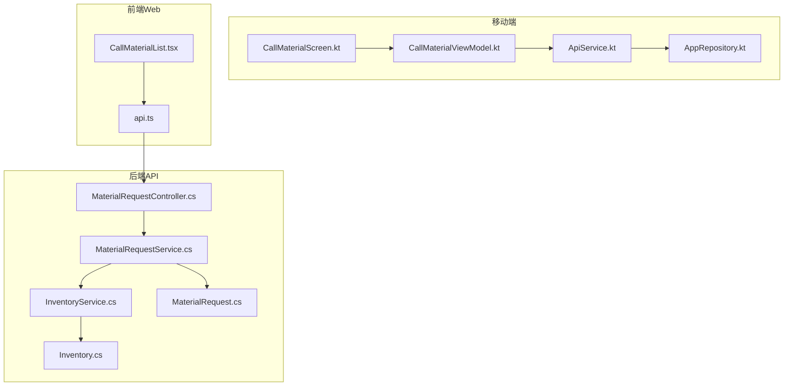
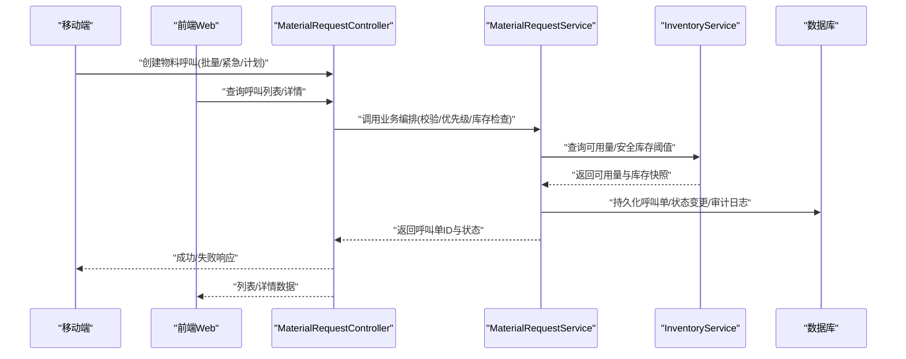
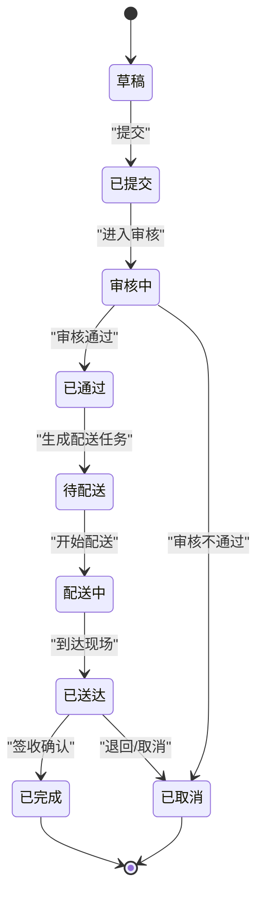
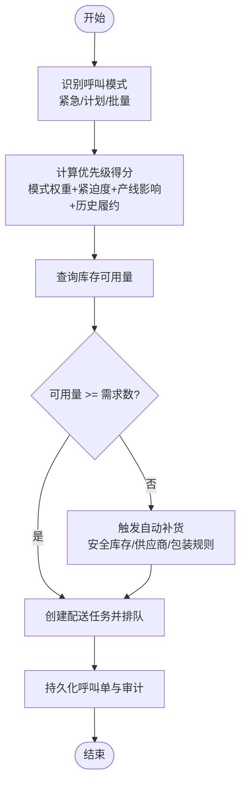
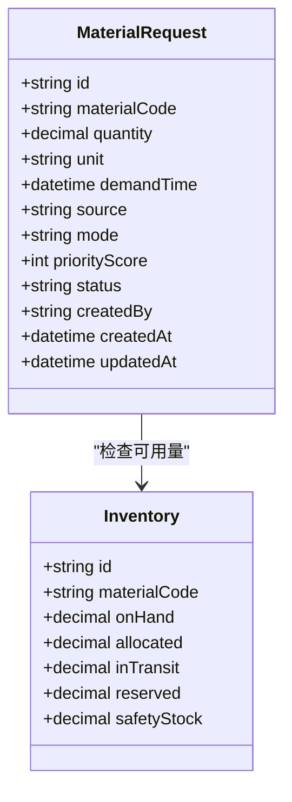
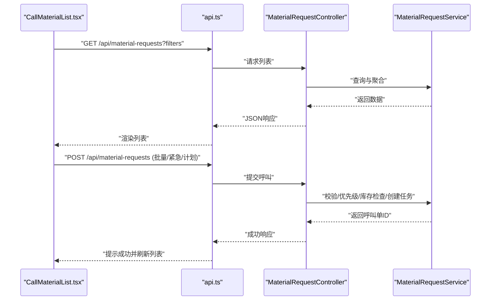
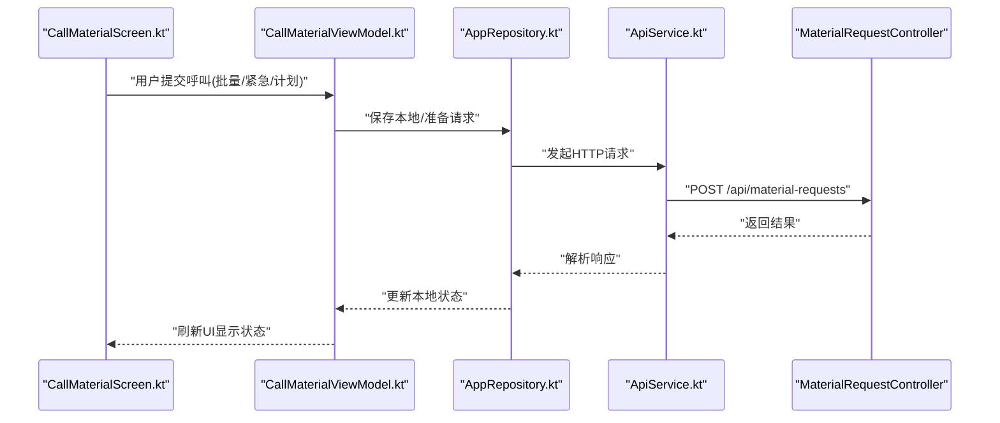
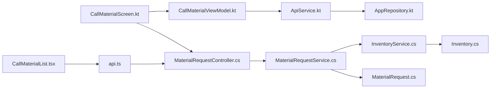

# 物料呼叫页面

<cite>
**本文引用的文件**   
- [MaterialRequestController.cs](file://dip-system/api/Controllers/MaterialRequestController.cs)
- [MaterialRequestService.cs](file://dip-system/api/Services/MaterialRequestService.cs)
- [MaterialRequest.cs](file://dip-system/api/Models/MaterialRequest.cs)
- [InventoryService.cs](file://dip-system/api/Services/InventoryService.cs)
- [Inventory.cs](file://dip-system/api/Models/Inventory.cs)
- [CallMaterialList.tsx](file://dip-system/frontend-web/src/pages/CallMaterialList.tsx)
- [api.ts](file://dip-system/frontend-web/src/lib/api.ts)
- [CallMaterialScreen.kt](file://mobile-android/app/src/main/java/com/dip/material/ui/callmaterial/CallMaterialScreen.kt)
- [CallMaterialViewModel.kt](file://mobile-android/app/src/main/java/com/dip/material/ui/callmaterial/CallMaterialViewModel.kt)
- [ApiService.kt](file://mobile-android/app/src/main/java/com/dip/material/data/network/ApiService.kt)
- [AppRepository.kt](file://mobile-android/app/src/main/java/com/dip/material/data/repository/AppRepository.kt)
</cite>

## 目录
1. [简介](#简介)
2. [项目结构](#项目结构)
3. [核心组件](#核心组件)
4. [架构总览](#架构总览)
5. [详细组件分析](#详细组件分析)
6. [依赖关系分析](#依赖关系分析)
7. [性能考虑](#性能考虑)
8. [故障排查指南](#故障排查指南)
9. [结论](#结论)
10. [附录](#附录)

## 简介
本文件为DIP系统“物料呼叫页面”的综合文档，覆盖生产线上物料需求触发、呼叫生成与配送调度的完整流程。重点说明：
- 物料呼叫优先级算法
- 库存检查逻辑与自动补货触发条件
- 呼叫单数据结构、状态管理与生命周期控制
- 批量呼叫、紧急呼叫与计划呼叫的处理模式
- 呼叫历史查询、执行跟踪与效果评估
- 与仓储系统的实时数据同步与冲突解决机制

## 项目结构
围绕“物料呼叫”功能，代码分布在后端API、前端Web与移动端Android三端：
- 后端API（ASP.NET Core）
  - 控制器：MaterialRequestController.cs
  - 服务层：MaterialRequestService.cs、InventoryService.cs
  - 模型：MaterialRequest.cs、Inventory.cs
- 前端Web（React + TypeScript）
  - 页面：CallMaterialList.tsx
  - API封装：api.ts
- 移动端（Android Kotlin）
  - 界面与视图模型：CallMaterialScreen.kt、CallMaterialViewModel.kt
  - 网络接口与仓库：ApiService.kt、AppRepository.kt

**图表来源** 
- [CallMaterialScreen.kt](file://mobile-android/app/src/main/java/com/dip/material/ui/callmaterial/CallMaterialScreen.kt)
- [CallMaterialViewModel.kt](file://mobile-android/app/src/main/java/com/dip/material/ui/callmaterial/CallMaterialViewModel.kt)
- [ApiService.kt](file://mobile-android/app/src/main/java/com/dip/material/data/network/ApiService.kt)
- [AppRepository.kt](file://mobile-android/app/src/main/java/com/dip/material/data/repository/AppRepository.kt)
- [CallMaterialList.tsx](file://dip-system/frontend-web/src/pages/CallMaterialList.tsx)
- [api.ts](file://dip-system/frontend-web/src/lib/api.ts)
- [MaterialRequestController.cs](file://dip-system/api/Controllers/MaterialRequestController.cs)
- [MaterialRequestService.cs](file://dip-system/api/Services/MaterialRequestService.cs)
- [InventoryService.cs](file://dip-system/api/Services/InventoryService.cs)
- [MaterialRequest.cs](file://dip-system/api/Models/MaterialRequest.cs)
- [Inventory.cs](file://dip-system/api/Models/Inventory.cs)

**章节来源**
- [MaterialRequestController.cs](file://dip-system/api/Controllers/MaterialRequestController.cs)
- [MaterialRequestService.cs](file://dip-system/api/Services/MaterialRequestService.cs)
- [MaterialRequest.cs](file://dip-system/api/Models/MaterialRequest.cs)
- [InventoryService.cs](file://dip-system/api/Services/InventoryService.cs)
- [Inventory.cs](file://dip-system/api/Models/Inventory.cs)
- [CallMaterialList.tsx](file://dip-system/frontend-web/src/pages/CallMaterialList.tsx)
- [api.ts](file://dip-system/frontend-web/src/lib/api.ts)
- [CallMaterialScreen.kt](file://mobile-android/app/src/main/java/com/dip/material/ui/callmaterial/CallMaterialScreen.kt)
- [CallMaterialViewModel.kt](file://mobile-android/app/src/main/java/com/dip/material/ui/callmaterial/CallMaterialViewModel.kt)
- [ApiService.kt](file://mobile-android/app/src/main/java/com/dip/material/data/network/ApiService.kt)
- [AppRepository.kt](file://mobile-android/app/src/main/java/com/dip/material/data/repository/AppRepository.kt)

## 核心组件
- 控制器层（MaterialRequestController.cs）
  - 暴露物料呼叫相关REST接口，包括创建、查询、更新、删除与批量操作入口。
- 服务层（MaterialRequestService.cs）
  - 实现呼叫单业务编排：校验、优先级计算、库存检查、自动补货触发、状态流转与审计记录。
- 库存服务（InventoryService.cs）
  - 提供库存查询、可用量计算、安全库存阈值判断、并发锁与冲突处理。
- 数据模型（MaterialRequest.cs、Inventory.cs）
  - 定义呼叫单字段、状态枚举、关联关系；库存主数据与实时可用量。
- 前端Web（CallMaterialList.tsx、api.ts）
  - 展示呼叫列表、筛选与分页、提交呼叫、查看执行进度与历史记录。
- 移动端（CallMaterialScreen.kt、CallMaterialViewModel.kt、ApiService.kt、AppRepository.kt）
  - 扫码/输入触发呼叫、选择模式（批量/紧急/计划）、本地缓存与重试、上报执行结果。

**章节来源**
- [MaterialRequestController.cs](file://dip-system/api/Controllers/MaterialRequestController.cs)
- [MaterialRequestService.cs](file://dip-system/api/Services/MaterialRequestService.cs)
- [InventoryService.cs](file://dip-system/api/Services/InventoryService.cs)
- [MaterialRequest.cs](file://dip-system/api/Models/MaterialRequest.cs)
- [Inventory.cs](file://dip-system/api/Models/Inventory.cs)
- [CallMaterialList.tsx](file://dip-system/frontend-web/src/pages/CallMaterialList.tsx)
- [api.ts](file://dip-system/frontend-web/src/lib/api.ts)
- [CallMaterialScreen.kt](file://mobile-android/app/src/main/java/com/dip/material/ui/callmaterial/CallMaterialScreen.kt)
- [CallMaterialViewModel.kt](file://mobile-android/app/src/main/java/com/dip/material/ui/callmaterial/CallMaterialViewModel.kt)
- [ApiService.kt](file://mobile-android/app/src/main/java/com/dip/material/data/network/ApiService.kt)
- [AppRepository.kt](file://mobile-android/app/src/main/java/com/dip/material/data/repository/AppRepository.kt)

## 架构总览
端到端调用时序涵盖移动端/Web发起、后端校验与调度、库存检查与自动补货、状态推进与结果回传。

**图表来源** 
- [MaterialRequestController.cs](file://dip-system/api/Controllers/MaterialRequestController.cs)
- [MaterialRequestService.cs](file://dip-system/api/Services/MaterialRequestService.cs)
- [InventoryService.cs](file://dip-system/api/Services/InventoryService.cs)
- [MaterialRequest.cs](file://dip-system/api/Models/MaterialRequest.cs)
- [Inventory.cs](file://dip-system/api/Models/Inventory.cs)
- [CallMaterialList.tsx](file://dip-system/frontend-web/src/pages/CallMaterialList.tsx)
- [CallMaterialScreen.kt](file://mobile-android/app/src/main/java/com/dip/material/ui/callmaterial/CallMaterialScreen.kt)

## 详细组件分析

### 物料呼叫单数据模型与状态管理
- 呼叫单关键字段
  - 编号、物料编码、需求数量、单位、需求时间、来源（工单/预测/人工）、模式（批量/紧急/计划）、优先级、状态、创建人、创建时间、更新时间、备注等。
- 状态机
  - 草稿 → 已提交 → 审核中 → 已通过 → 待配送 → 配送中 → 已送达 → 已完成 / 已取消
  - 异常分支：审核不通过、库存不足转采购、超时未配送、部分送达等。
- 生命周期控制
  - 提交后锁定编辑；审核通过后进入配送队列；配送完成需回传确认；取消需记录原因与审批。

**图表来源** 
- [MaterialRequest.cs](file://dip-system/api/Models/MaterialRequest.cs)

**章节来源**
- [MaterialRequest.cs](file://dip-system/api/Models/MaterialRequest.cs)

### 优先级算法与库存检查逻辑
- 优先级计算因素
  - 模式权重：紧急 > 计划 > 批量
  - 需求紧迫度：距离需求时间的剩余时长越短，优先级越高
  - 产线影响度：关键工序/瓶颈工序加权
  - 历史履约率：履约率低的需求适当提升优先级
  - 综合得分排序用于配送队列调度
- 库存检查逻辑
  - 可用量 = 在库量 - 已分配量 + 在途量 - 预留量
  - 若可用量 < 需求数量，则触发自动补货策略（按安全库存阈值、供应商交期、最小包装量）
  - 并发场景下采用乐观锁或分布式锁避免超卖

**图表来源** 
- [MaterialRequestService.cs](file://dip-system/api/Services/MaterialRequestService.cs)
- [InventoryService.cs](file://dip-system/api/Services/InventoryService.cs)

**章节来源**
- [MaterialRequestService.cs](file://dip-system/api/Services/MaterialRequestService.cs)
- [InventoryService.cs](file://dip-system/api/Services/InventoryService.cs)

### 批量呼叫、紧急呼叫与计划呼叫处理模式
- 批量呼叫
  - 支持多物料一次性提交，服务端聚合校验、合并配送建议，减少重复任务
- 紧急呼叫
  - 高优先级直达配送队列，跳过常规审核（或走快速通道），必要时触发加急运输
- 计划呼叫
  - 基于预测/排产提前生成，按时间窗与产能约束安排配送批次

**图表来源** 
- [MaterialRequest.cs](file://dip-system/api/Models/MaterialRequest.cs)
- [Inventory.cs](file://dip-system/api/Models/Inventory.cs)

**章节来源**
- [MaterialRequest.cs](file://dip-system/api/Models/MaterialRequest.cs)
- [Inventory.cs](file://dip-system/api/Models/Inventory.cs)

### 前端Web交互与数据流
- CallMaterialList.tsx
  - 列表展示、筛选（状态/模式/时间范围）、分页、新建呼叫、查看详情、跟踪执行进度
- api.ts
  - 统一封装HTTP请求、错误处理、鉴权头、重试策略

**图表来源** 
- [CallMaterialList.tsx](file://dip-system/frontend-web/src/pages/CallMaterialList.tsx)
- [api.ts](file://dip-system/frontend-web/src/lib/api.ts)
- [MaterialRequestController.cs](file://dip-system/api/Controllers/MaterialRequestController.cs)
- [MaterialRequestService.cs](file://dip-system/api/Services/MaterialRequestService.cs)

**章节来源**
- [CallMaterialList.tsx](file://dip-system/frontend-web/src/pages/CallMaterialList.tsx)
- [api.ts](file://dip-system/frontend-web/src/lib/api.ts)

### 移动端交互与数据流
- CallMaterialScreen.kt
  - 扫码/输入物料、选择呼叫模式、提交呼叫、查看状态与历史
- CallMaterialViewModel.kt
  - 管理UI状态、调用仓库层、处理加载/错误/成功回调
- ApiService.kt、AppRepository.kt
  - 网络请求封装与本地缓存、离线重试、结果落库

**图表来源** 
- [CallMaterialScreen.kt](file://mobile-android/app/src/main/java/com/dip/material/ui/callmaterial/CallMaterialScreen.kt)
- [CallMaterialViewModel.kt](file://mobile-android/app/src/main/java/com/dip/material/ui/callmaterial/CallMaterialViewModel.kt)
- [ApiService.kt](file://mobile-android/app/src/main/java/com/dip/material/data/network/ApiService.kt)
- [AppRepository.kt](file://mobile-android/app/src/main/java/com/dip/material/data/repository/AppRepository.kt)
- [MaterialRequestController.cs](file://dip-system/api/Controllers/MaterialRequestController.cs)

**章节来源**
- [CallMaterialScreen.kt](file://mobile-android/app/src/main/java/com/dip/material/ui/callmaterial/CallMaterialScreen.kt)
- [CallMaterialViewModel.kt](file://mobile-android/app/src/main/java/com/dip/material/ui/callmaterial/CallMaterialViewModel.kt)
- [ApiService.kt](file://mobile-android/app/src/main/java/com/dip/material/data/network/ApiService.kt)
- [AppRepository.kt](file://mobile-android/app/src/main/java/com/dip/material/data/repository/AppRepository.kt)

### 呼叫历史查询、执行跟踪与效果评估
- 历史查询
  - 支持按时间范围、状态、模式、物料、来源等多维度检索
  - 导出报表（CSV/Excel）便于追溯与分析
- 执行跟踪
  - 配送节点事件：生成任务、出库、装车、在途、到达、签收、异常
  - 实时看板展示当前在途与延迟预警
- 效果评估
  - 指标：准时交付率、平均响应时间、缺货率、替代率、退货率
  - 趋势分析与根因定位（供应商、工序、物料类别）

[本节为概念性说明，不直接分析具体文件，故无章节来源]

### 与仓储系统的实时数据同步与冲突解决
- 实时同步
  - 库存快照与增量变更推送（WebSocket/消息队列）
  - 入库/出库/移库事件即时更新可用量
- 冲突解决
  - 乐观锁版本号控制，冲突时回滚并重试
  - 幂等性设计：同一呼叫单多次提交仅生效一次
  - 补偿机制：对账与差异修复任务

[本节为概念性说明，不直接分析具体文件，故无章节来源]

## 依赖关系分析
- 控制器依赖服务层，服务层依赖库存服务与数据模型
- 前端Web与移动端均依赖后端API接口
- 库存服务与数据库强耦合，需保证事务一致性与并发安全

**图表来源** 
- [CallMaterialList.tsx](file://dip-system/frontend-web/src/pages/CallMaterialList.tsx)
- [api.ts](file://dip-system/frontend-web/src/lib/api.ts)
- [CallMaterialScreen.kt](file://mobile-android/app/src/main/java/com/dip/material/ui/callmaterial/CallMaterialScreen.kt)
- [CallMaterialViewModel.kt](file://mobile-android/app/src/main/java/com/dip/material/ui/callmaterial/CallMaterialViewModel.kt)
- [ApiService.kt](file://mobile-android/app/src/main/java/com/dip/material/data/network/ApiService.kt)
- [AppRepository.kt](file://mobile-android/app/src/main/java/com/dip/material/data/repository/AppRepository.kt)
- [MaterialRequestController.cs](file://dip-system/api/Controllers/MaterialRequestController.cs)
- [MaterialRequestService.cs](file://dip-system/api/Services/MaterialRequestService.cs)
- [InventoryService.cs](file://dip-system/api/Services/InventoryService.cs)
- [MaterialRequest.cs](file://dip-system/api/Models/MaterialRequest.cs)
- [Inventory.cs](file://dip-system/api/Models/Inventory.cs)

**章节来源**
- [MaterialRequestController.cs](file://dip-system/api/Controllers/MaterialRequestController.cs)
- [MaterialRequestService.cs](file://dip-system/api/Services/MaterialRequestService.cs)
- [InventoryService.cs](file://dip-system/api/Services/InventoryService.cs)
- [MaterialRequest.cs](file://dip-system/api/Models/MaterialRequest.cs)
- [Inventory.cs](file://dip-system/api/Models/Inventory.cs)
- [CallMaterialList.tsx](file://dip-system/frontend-web/src/pages/CallMaterialList.tsx)
- [api.ts](file://dip-system/frontend-web/src/lib/api.ts)
- [CallMaterialScreen.kt](file://mobile-android/app/src/main/java/com/dip/material/ui/callmaterial/CallMaterialScreen.kt)
- [CallMaterialViewModel.kt](file://mobile-android/app/src/main/java/com/dip/material/ui/callmaterial/CallMaterialViewModel.kt)
- [ApiService.kt](file://mobile-android/app/src/main/java/com/dip/material/data/network/ApiService.kt)
- [AppRepository.kt](file://mobile-android/app/src/main/java/com/dip/material/data/repository/AppRepository.kt)

## 性能考虑
- 接口层面
  - 列表查询使用分页与索引优化，避免全表扫描
  - 批量提交采用异步处理与批处理写入，降低阻塞
- 库存检查
  - 热点物料缓存可用量，定期刷新与增量更新
  - 并发控制采用乐观锁，减少锁竞争
- 前端与移动端
  - 防抖与节流减少重复请求
  - 本地缓存与离线队列，网络恢复后重试

[本节为通用指导，不直接分析具体文件，故无章节来源]

## 故障排查指南
- 常见问题
  - 提交失败：检查参数校验、权限、库存不足、并发冲突
  - 状态不同步：核对事件推送与补偿任务
  - 列表加载慢：检查分页参数、索引与缓存命中率
- 诊断步骤
  - 查看调用链日志（控制器→服务→库存→数据库）
  - 核对库存快照与增量事件一致性
  - 复现问题并抓取前后端请求/响应报文

[本节为通用指导，不直接分析具体文件，故无章节来源]

## 结论
本系统通过清晰的分层架构与完善的业务流程，实现了从需求触发到配送调度的闭环管理。优先级算法与库存检查确保资源合理分配，三种呼叫模式满足不同生产场景。历史查询与效果评估为持续优化提供数据支撑，实时同步与冲突解决保障系统稳定性与一致性。

[本节为总结性内容，不直接分析具体文件，故无章节来源]

## 附录
- 术语表
  - 呼叫单：物料需求的载体，贯穿整个配送生命周期
  - 可用量：可立即用于生产的库存数量
  - 安全库存：为避免缺货而设置的最低库存阈值
  - 自动补货：当可用量低于阈值时触发的补货动作
- 参考文件
  - 控制器与服务实现、数据模型、前端页面与移动端界面详见前述引用文件

[本节为补充信息，不直接分析具体文件，故无章节来源]