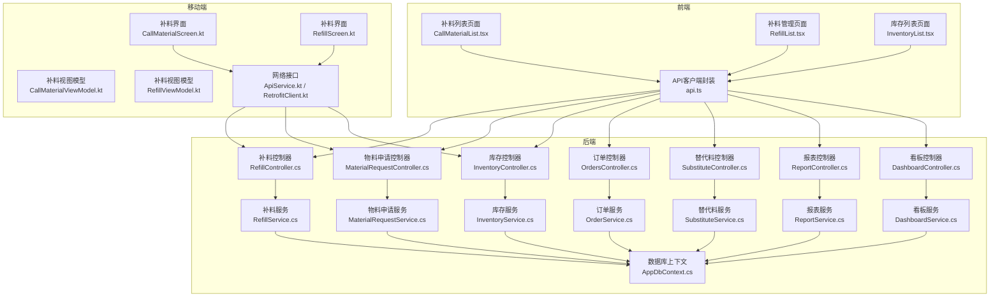
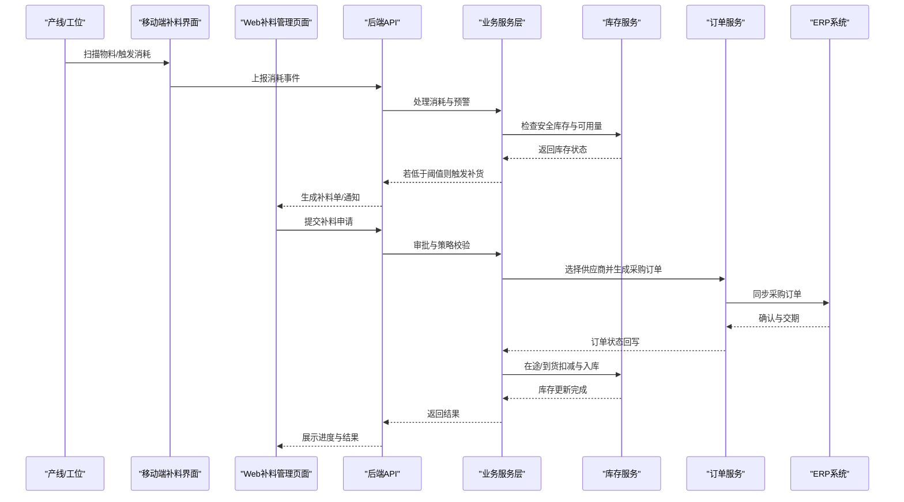
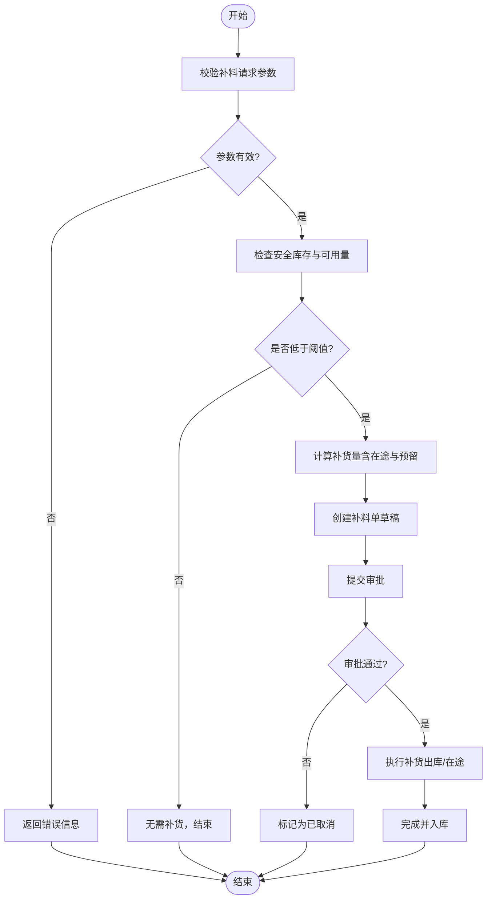
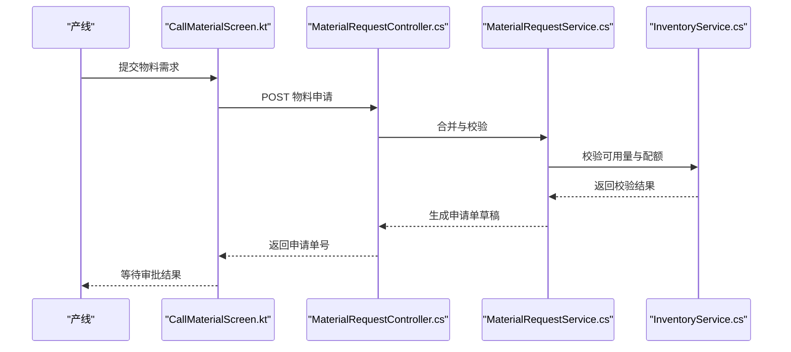
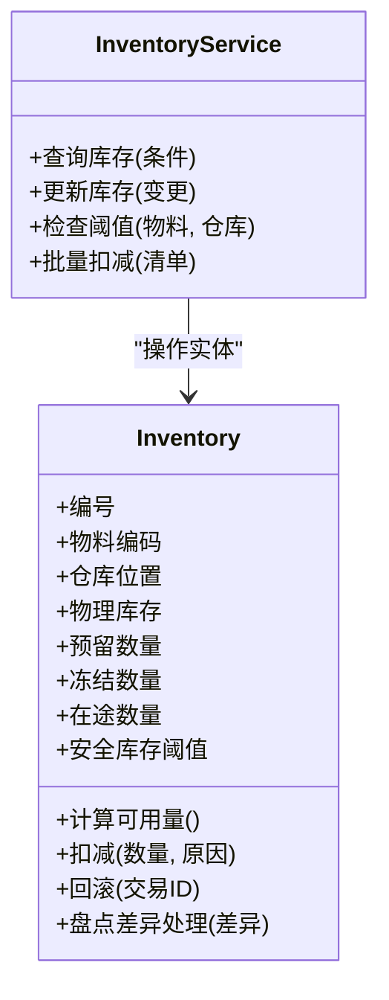
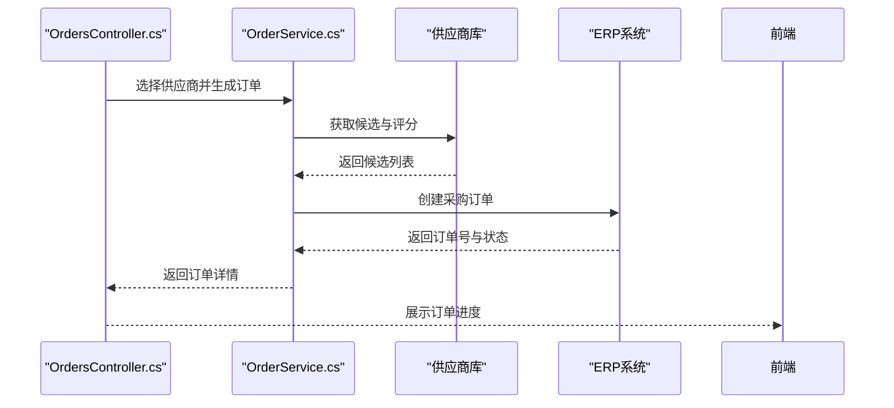
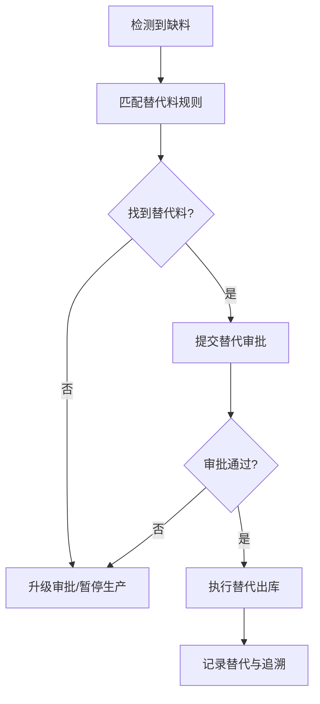
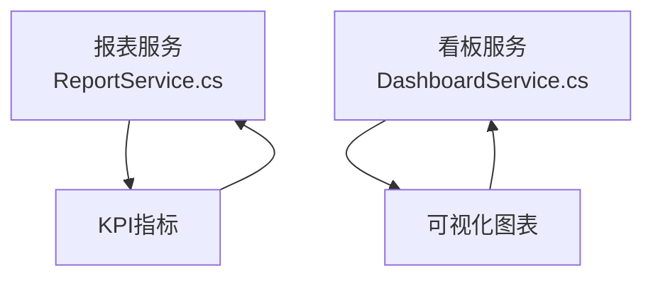
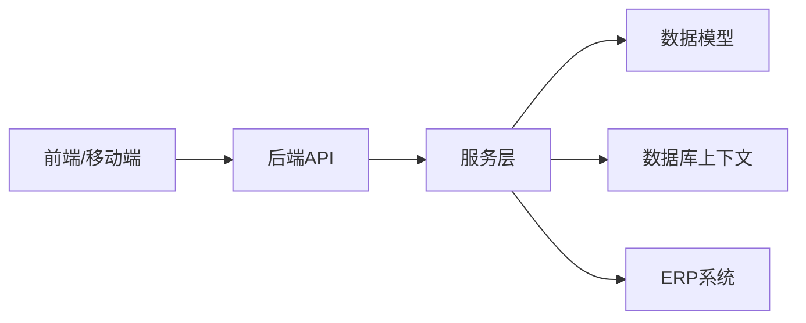

# 补料管理页面

<cite>
**本文引用的文件**   
- [RefillController.cs](file://dip-system/api/Controllers/RefillController.cs)
- [RefillService.cs](file://dip-system/api/Services/RefillService.cs)
- [Refill.cs](file://dip-system/api/Models/Refill.cs)
- [MaterialRequestController.cs](file://dip-system/api/Controllers/MaterialRequestController.cs)
- [MaterialRequestService.cs](file://dip-system/api/Services/MaterialRequestService.cs)
- [MaterialRequest.cs](file://dip-system/api/Models/MaterialRequest.cs)
- [InventoryController.cs](file://dip-system/api/Controllers/InventoryController.cs)
- [InventoryService.cs](file://dip-system/api/Services/InventoryService.cs)
- [Inventory.cs](file://dip-system/api/Models/Inventory.cs)
- [OrdersController.cs](file://dip-system/api/Controllers/OrdersController.cs)
- [OrderService.cs](file://dip-system/api/Services/OrderService.cs)
- [Order.cs](file://dip-system/api/Models/Order.cs)
- [SubstituteController.cs](file://dip-system/api/Controllers/SubstituteController.cs)
- [SubstituteService.cs](file://dip-system/api/Services/SubstituteService.cs)
- [SubstituteOrder.cs](file://dip-system/api/Models/SubstituteOrder.cs)
- [ReportController.cs](file://dip-system/api/Controllers/ReportController.cs)
- [ReportService.cs](file://dip-system/api/Services/ReportService.cs)
- [DashboardController.cs](file://dip-system/api/Controllers/DashboardController.cs)
- [DashboardService.cs](file://dip-system/api/Services/DashboardService.cs)
- [AppDbContext.cs](file://dip-system/api/Data/AppDbContext.cs)
- [CallMaterialList.tsx](file://dip-system/frontend-web/src/pages/CallMaterialList.tsx)
- [RefillList.tsx](file://dip-system/frontend-web/src/pages/RefillList.tsx)
- [InventoryList.tsx](file://dip-system/frontend-web/src/pages/InventoryList.tsx)
- [api.ts](file://dip-system/frontend-web/src/lib/api.ts)
- [CallMaterialScreen.kt](file://mobile-android/app/src/main/java/com/dip/material/ui/callmaterial/CallMaterialScreen.kt)
- [CallMaterialViewModel.kt](file://mobile-android/app/src/main/java/com/dip/material/ui/callmaterial/CallMaterialViewModel.kt)
- [RefillScreen.kt](file://mobile-android/app/src/main/java/com/dip/material/ui/refill/RefillScreen.kt)
- [RefillViewModel.kt](file://mobile-android/app/src/main/java/com/dip/material/ui/refill/RefillViewModel.kt)
- [ApiService.kt](file://mobile-android/app/src/main/java/com/dip/material/data/network/ApiService.kt)
- [RetrofitClient.kt](file://mobile-android/app/src/main/java/com/dip/material/data/network/RetrofitClient.kt)
</cite>

## 目录
1. [简介](#简介)
2. [项目结构](#项目结构)
3. [核心组件](#核心组件)
4. [架构总览](#架构总览)
5. [详细组件分析](#详细组件分析)
6. [依赖关系分析](#依赖关系分析)
7. [性能考虑](#性能考虑)
8. [故障排查指南](#故障排查指南)
9. [结论](#结论)
10. [附录](#附录)

## 简介
本文件面向DIP系统的“补料管理页面”，围绕生产过程中的物料消耗监控、低库存预警与自动补货触发机制，系统性地说明补料策略配置、安全库存设定、补货量计算算法、补料申请审批、供应商选择与采购订单生成流程。同时覆盖物料损耗分析、浪费控制与成本优化能力，并给出补料效率评估、供应商绩效分析与供应链协同能力的实现思路。文档还说明了与ERP系统集成、财务结算与库存更新的实时同步机制，帮助读者从业务到技术全面理解该模块的设计与落地。

## 项目结构
本项目采用前后端分离架构：
- 后端（C# ASP.NET Core）提供REST API，包含控制器、服务层、数据模型与数据库上下文。
- 前端（React + Vite）提供Web界面，用于补料列表、库存查看、补料申请等交互。
- 移动端（Android Kotlin）提供现场扫码与快速补料操作能力。

图表来源
- [RefillController.cs](file://dip-system/api/Controllers/RefillController.cs)
- [RefillService.cs](file://dip-system/api/Services/RefillService.cs)
- [MaterialRequestController.cs](file://dip-system/api/Controllers/MaterialRequestController.cs)
- [MaterialRequestService.cs](file://dip-system/api/Services/MaterialRequestService.cs)
- [InventoryController.cs](file://dip-system/api/Controllers/InventoryController.cs)
- [InventoryService.cs](file://dip-system/api/Services/InventoryService.cs)
- [OrdersController.cs](file://dip-system/api/Controllers/OrdersController.cs)
- [OrderService.cs](file://dip-system/api/Services/OrderService.cs)
- [SubstituteController.cs](file://dip-system/api/Controllers/SubstituteController.cs)
- [SubstituteService.cs](file://dip-system/api/Services/SubstituteService.cs)
- [ReportController.cs](file://dip-system/api/Controllers/ReportController.cs)
- [ReportService.cs](file://dip-system/api/Services/ReportService.cs)
- [DashboardController.cs](file://dip-system/api/Controllers/DashboardController.cs)
- [DashboardService.cs](file://dip-system/api/Services/DashboardService.cs)
- [AppDbContext.cs](file://dip-system/api/Data/AppDbContext.cs)
- [CallMaterialList.tsx](file://dip-system/frontend-web/src/pages/CallMaterialList.tsx)
- [RefillList.tsx](file://dip-system/frontend-web/src/pages/RefillList.tsx)
- [InventoryList.tsx](file://dip-system/frontend-web/src/pages/InventoryList.tsx)
- [api.ts](file://dip-system/frontend-web/src/lib/api.ts)
- [CallMaterialScreen.kt](file://mobile-android/app/src/main/java/com/dip/material/ui/callmaterial/CallMaterialScreen.kt)
- [CallMaterialViewModel.kt](file://mobile-android/app/src/main/java/com/dip/material/ui/callmaterial/CallMaterialViewModel.kt)
- [RefillScreen.kt](file://mobile-android/app/src/main/java/com/dip/material/ui/refill/RefillScreen.kt)
- [RefillViewModel.kt](file://mobile-android/app/src/main/java/com/dip/material/ui/refill/RefillViewModel.kt)
- [ApiService.kt](file://mobile-android/app/src/main/java/com/dip/material/data/network/ApiService.kt)
- [RetrofitClient.kt](file://mobile-android/app/src/main/java/com/dip/material/data/network/RetrofitClient.kt)

章节来源
- [RefillController.cs](file://dip-system/api/Controllers/RefillController.cs)
- [RefillService.cs](file://dip-system/api/Services/RefillService.cs)
- [MaterialRequestController.cs](file://dip-system/api/Controllers/MaterialRequestController.cs)
- [MaterialRequestService.cs](file://dip-system/api/Services/MaterialRequestService.cs)
- [InventoryController.cs](file://dip-system/api/Controllers/InventoryController.cs)
- [InventoryService.cs](file://dip-system/api/Services/InventoryService.cs)
- [OrdersController.cs](file://dip-system/api/Controllers/OrdersController.cs)
- [OrderService.cs](file://dip-system/api/Services/OrderService.cs)
- [SubstituteController.cs](file://dip-system/api/Controllers/SubstituteController.cs)
- [SubstituteService.cs](file://dip-system/api/Services/SubstituteService.cs)
- [ReportController.cs](file://dip-system/api/Controllers/ReportController.cs)
- [ReportService.cs](file://dip-system/api/Services/ReportService.cs)
- [DashboardController.cs](file://dip-system/api/Controllers/DashboardController.cs)
- [DashboardService.cs](file://dip-system/api/Services/DashboardService.cs)
- [AppDbContext.cs](file://dip-system/api/Data/AppDbContext.cs)
- [CallMaterialList.tsx](file://dip-system/frontend-web/src/pages/CallMaterialList.tsx)
- [RefillList.tsx](file://dip-system/frontend-web/src/pages/RefillList.tsx)
- [InventoryList.tsx](file://dip-system/frontend-web/src/pages/InventoryList.tsx)
- [api.ts](file://dip-system/frontend-web/src/lib/api.ts)
- [CallMaterialScreen.kt](file://mobile-android/app/src/main/java/com/dip/material/ui/callmaterial/CallMaterialScreen.kt)
- [CallMaterialViewModel.kt](file://mobile-android/app/src/main/java/com/dip/material/ui/callmaterial/CallMaterialViewModel.kt)
- [RefillScreen.kt](file://mobile-android/app/src/main/java/com/dip/material/ui/refill/RefillScreen.kt)
- [RefillViewModel.kt](file://mobile-android/app/src/main/java/com/dip/material/ui/refill/RefillViewModel.kt)
- [ApiService.kt](file://mobile-android/app/src/main/java/com/dip/material/data/network/ApiService.kt)
- [RetrofitClient.kt](file://mobile-android/app/src/main/java/com/dip/material/data/network/RetrofitClient.kt)

## 核心组件
- 补料控制器与服务：负责补料单创建、查询、状态流转、触发规则校验与执行。
- 物料申请控制器与服务：负责产线物料需求申请、审批流、配额校验与合并。
- 库存控制器与服务：负责库存查询、安全库存阈值、在途与可用量计算、扣减与回滚。
- 订单控制器与服务：负责采购订单生成、供应商选择、交期与价格策略、订单状态跟踪。
- 替代料控制器与服务：支持替代料匹配、审批与记录，保障缺料时的连续性。
- 报表与看板服务：提供补料效率、损耗分析、供应商绩效与库存健康度指标。
- 数据模型与上下文：定义实体关系、约束与持久化映射。

章节来源
- [RefillController.cs](file://dip-system/api/Controllers/RefillController.cs)
- [RefillService.cs](file://dip-system/api/Services/RefillService.cs)
- [MaterialRequestController.cs](file://dip-system/api/Controllers/MaterialRequestController.cs)
- [MaterialRequestService.cs](file://dip-system/api/Services/MaterialRequestService.cs)
- [InventoryController.cs](file://dip-system/api/Controllers/InventoryController.cs)
- [InventoryService.cs](file://dip-system/api/Services/InventoryService.cs)
- [OrdersController.cs](file://dip-system/api/Controllers/OrdersController.cs)
- [OrderService.cs](file://dip-system/api/Services/OrderService.cs)
- [SubstituteController.cs](file://dip-system/api/Controllers/SubstituteController.cs)
- [SubstituteService.cs](file://dip-system/api/Services/SubstituteService.cs)
- [ReportController.cs](file://dip-system/api/Controllers/ReportController.cs)
- [ReportService.cs](file://dip-system/api/Services/ReportService.cs)
- [DashboardController.cs](file://dip-system/api/Controllers/DashboardController.cs)
- [DashboardService.cs](file://dip-system/api/Services/DashboardService.cs)
- [AppDbContext.cs](file://dip-system/api/Data/AppDbContext.cs)

## 架构总览
补料管理涉及“前端/移动端—后端API—数据库”的三层调用链，关键业务流程包括：
- 物料消耗监控与安全库存预警
- 自动补货触发与补料单生成
- 补料申请审批与供应商选择
- 采购订单生成与ERP集成
- 库存更新与财务结算同步

图表来源
- [RefillController.cs](file://dip-system/api/Controllers/RefillController.cs)
- [RefillService.cs](file://dip-system/api/Services/RefillService.cs)
- [MaterialRequestController.cs](file://dip-system/api/Controllers/MaterialRequestController.cs)
- [MaterialRequestService.cs](file://dip-system/api/Services/MaterialRequestService.cs)
- [InventoryController.cs](file://dip-system/api/Controllers/InventoryController.cs)
- [InventoryService.cs](file://dip-system/api/Services/InventoryService.cs)
- [OrdersController.cs](file://dip-system/api/Controllers/OrdersController.cs)
- [OrderService.cs](file://dip-system/api/Services/OrderService.cs)
- [ApiService.kt](file://mobile-android/app/src/main/java/com/dip/material/data/network/ApiService.kt)
- [RetrofitClient.kt](file://mobile-android/app/src/main/java/com/dip/material/data/network/RetrofitClient.kt)

## 详细组件分析

### 补料控制器与服务（Refill）
- 职责
  - 接收补料请求，校验参数与权限
  - 根据策略与安全库存判断是否触发补货
  - 生成补料单并维护状态机（草稿、待审批、已批准、执行中、已完成、已取消）
  - 与库存服务联动，确保扣减与入库一致性
- 关键流程
  - 创建补料单：校验物料编码、批次、数量、工单关联
  - 触发补货：基于安全库存阈值与在途量计算补货量
  - 审批流：支持多级审批与条件分支
  - 执行与完成：记录执行时间、执行人、实际用量与差异
- 异常处理
  - 库存不足时回退或转替代料
  - 审批失败时保留草稿并提示原因
  - 并发冲突时使用乐观锁或重试机制

图表来源
- [RefillController.cs](file://dip-system/api/Controllers/RefillController.cs)
- [RefillService.cs](file://dip-system/api/Services/RefillService.cs)
- [InventoryService.cs](file://dip-system/api/Services/InventoryService.cs)

章节来源
- [RefillController.cs](file://dip-system/api/Controllers/RefillController.cs)
- [RefillService.cs](file://dip-system/api/Services/RefillService.cs)
- [InventoryService.cs](file://dip-system/api/Services/InventoryService.cs)

### 物料申请控制器与服务（MaterialRequest）
- 职责
  - 收集产线物料需求，合并重复项
  - 进行配额校验与优先级排序
  - 驱动审批流程，生成补料申请单
- 关键流程
  - 需求采集：扫描条码、BOM解析、工单拉动
  - 合并与去重：按物料、批次、工单维度聚合
  - 审批：依据金额、风险等级、历史表现决定审批路径
  - 输出：生成补料申请单并进入补料流程

图表来源
- [MaterialRequestController.cs](file://dip-system/api/Controllers/MaterialRequestController.cs)
- [MaterialRequestService.cs](file://dip-system/api/Services/MaterialRequestService.cs)
- [InventoryService.cs](file://dip-system/api/Services/InventoryService.cs)
- [CallMaterialScreen.kt](file://mobile-android/app/src/main/java/com/dip/material/ui/callmaterial/CallMaterialScreen.kt)

章节来源
- [MaterialRequestController.cs](file://dip-system/api/Controllers/MaterialRequestController.cs)
- [MaterialRequestService.cs](file://dip-system/api/Services/MaterialRequestService.cs)
- [InventoryService.cs](file://dip-system/api/Services/InventoryService.cs)
- [CallMaterialScreen.kt](file://mobile-android/app/src/main/java/com/dip/material/ui/callmaterial/CallMaterialScreen.kt)

### 库存控制器与服务（Inventory）
- 职责
  - 提供库存查询、安全库存阈值管理、在途与可用量计算
  - 支持扣减、回滚、批次追溯与盘点差异处理
- 关键逻辑
  - 可用量 = 物理库存 - 预留 - 冻结 + 在途
  - 安全库存阈值可配置，支持按物料、仓库、批次维度设置
  - 扣减事务保证一致性，失败时回滚并记录审计日志

图表来源
- [Inventory.cs](file://dip-system/api/Models/Inventory.cs)
- [InventoryService.cs](file://dip-system/api/Services/InventoryService.cs)
- [InventoryController.cs](file://dip-system/api/Controllers/InventoryController.cs)

章节来源
- [Inventory.cs](file://dip-system/api/Models/Inventory.cs)
- [InventoryService.cs](file://dip-system/api/Services/InventoryService.cs)
- [InventoryController.cs](file://dip-system/api/Controllers/InventoryController.cs)

### 订单控制器与服务（Orders）
- 职责
  - 供应商选择策略（价格、交期、质量、历史绩效）
  - 采购订单生成、版本管理与状态跟踪
  - 与ERP系统对接，同步订单、收货与发票
- 关键流程
  - 选择供应商：综合评分与可用性筛选
  - 生成订单：物料、数量、单价、交期、条款
  - 同步ERP：订单创建、修改、确认、关闭
  - 收货与结算：入库确认、对账、付款计划

图表来源
- [OrdersController.cs](file://dip-system/api/Controllers/OrdersController.cs)
- [OrderService.cs](file://dip-system/api/Services/OrderService.cs)
- [Order.cs](file://dip-system/api/Models/Order.cs)

章节来源
- [OrdersController.cs](file://dip-system/api/Controllers/OrdersController.cs)
- [OrderService.cs](file://dip-system/api/Services/OrderService.cs)
- [Order.cs](file://dip-system/api/Models/Order.cs)

### 替代料控制器与服务（Substitute）
- 职责
  - 替代料匹配规则与审批
  - 替代记录追踪与影响分析
- 关键流程
  - 缺料检测：主料不可用时触发替代
  - 匹配规则：按物料族、规格、认证状态筛选
  - 审批与执行：记录替代原因、批次与追溯

图表来源
- [SubstituteController.cs](file://dip-system/api/Controllers/SubstituteController.cs)
- [SubstituteService.cs](file://dip-system/api/Services/SubstituteService.cs)
- [SubstituteOrder.cs](file://dip-system/api/Models/SubstituteOrder.cs)

章节来源
- [SubstituteController.cs](file://dip-system/api/Controllers/SubstituteController.cs)
- [SubstituteService.cs](file://dip-system/api/Services/SubstituteService.cs)
- [SubstituteOrder.cs](file://dip-system/api/Models/SubstituteOrder.cs)

### 报表与看板（Report & Dashboard）
- 职责
  - 补料效率评估：平均响应时间、完成率、缺货率
  - 物料损耗分析：损耗率、浪费原因分类、趋势
  - 供应商绩效：交期达成率、质量合格率、价格波动
  - 库存健康度：周转率、呆滞料占比、安全库存达标率
- 数据来源
  - 补料单、物料申请、库存变动、订单与ERP同步记录

图表来源
- [ReportController.cs](file://dip-system/api/Controllers/ReportController.cs)
- [ReportService.cs](file://dip-system/api/Services/ReportService.cs)
- [DashboardController.cs](file://dip-system/api/Controllers/DashboardController.cs)
- [DashboardService.cs](file://dip-system/api/Services/DashboardService.cs)

章节来源
- [ReportController.cs](file://dip-system/api/Controllers/ReportController.cs)
- [ReportService.cs](file://dip-system/api/Services/ReportService.cs)
- [DashboardController.cs](file://dip-system/api/Controllers/DashboardController.cs)
- [DashboardService.cs](file://dip-system/api/Services/DashboardService.cs)

### 前端与移动端
- Web端
  - 补料列表页面：展示补料单状态、筛选与导出
  - 库存列表页面：查看可用量、安全库存与预警
  - API客户端封装：统一鉴权、错误处理与重试
- 移动端
  - 补料界面：扫码、快速提交、离线缓存
  - 视图模型：状态管理、异步加载与错误提示
  - 网络层：Retrofit封装、拦截器与Token管理

章节来源
- [CallMaterialList.tsx](file://dip-system/frontend-web/src/pages/CallMaterialList.tsx)
- [RefillList.tsx](file://dip-system/frontend-web/src/pages/RefillList.tsx)
- [InventoryList.tsx](file://dip-system/frontend-web/src/pages/InventoryList.tsx)
- [api.ts](file://dip-system/frontend-web/src/lib/api.ts)
- [CallMaterialScreen.kt](file://mobile-android/app/src/main/java/com/dip/material/ui/callmaterial/CallMaterialScreen.kt)
- [CallMaterialViewModel.kt](file://mobile-android/app/src/main/java/com/dip/material/ui/callmaterial/CallMaterialViewModel.kt)
- [RefillScreen.kt](file://mobile-android/app/src/main/java/com/dip/material/ui/refill/RefillScreen.kt)
- [RefillViewModel.kt](file://mobile-android/app/src/main/java/com/dip/material/ui/refill/RefillViewModel.kt)
- [ApiService.kt](file://mobile-android/app/src/main/java/com/dip/material/data/network/ApiService.kt)
- [RetrofitClient.kt](file://mobile-android/app/src/main/java/com/dip/material/data/network/RetrofitClient.kt)

## 依赖关系分析
- 控制器依赖服务层，服务层依赖数据模型与数据库上下文
- 前端与移动端通过API客户端与后端通信
- 订单服务与ERP系统通过外部接口集成
- 报表与看板服务聚合多源数据进行指标计算

图表来源
- [AppDbContext.cs](file://dip-system/api/Data/AppDbContext.cs)
- [api.ts](file://dip-system/frontend-web/src/lib/api.ts)
- [ApiService.kt](file://mobile-android/app/src/main/java/com/dip/material/data/network/ApiService.kt)
- [RetrofitClient.kt](file://mobile-android/app/src/main/java/com/dip/material/data/network/RetrofitClient.kt)

章节来源
- [AppDbContext.cs](file://dip-system/api/Data/AppDbContext.cs)
- [api.ts](file://dip-system/frontend-web/src/lib/api.ts)
- [ApiService.kt](file://mobile-android/app/src/main/java/com/dip/material/data/network/ApiService.kt)
- [RetrofitClient.kt](file://mobile-android/app/src/main/java/com/dip/material/data/network/RetrofitClient.kt)

## 性能考虑
- 高并发场景下使用读写分离与缓存策略，减少数据库压力
- 批量操作采用事务与分批提交，避免长事务阻塞
- 报表与看板采用异步计算与增量更新，提升响应速度
- 移动端离线缓存与重试机制，提升弱网环境稳定性

[本节为通用指导，不直接分析具体文件]

## 故障排查指南
- 常见问题
  - 库存扣减失败：检查事务回滚与并发冲突
  - 审批流程卡住：核对审批规则与权限配置
  - 供应商选择异常：验证评分权重与可用性
  - ERP同步失败：检查接口连通性与报文格式
- 排查步骤
  - 查看日志与审计记录，定位异常点
  - 检查数据一致性与约束冲突
  - 复现实验并逐步缩小范围
  - 必要时回滚并恢复数据

章节来源
- [RefillService.cs](file://dip-system/api/Services/RefillService.cs)
- [MaterialRequestService.cs](file://dip-system/api/Services/MaterialRequestService.cs)
- [InventoryService.cs](file://dip-system/api/Services/InventoryService.cs)
- [OrderService.cs](file://dip-system/api/Services/OrderService.cs)

## 结论
补料管理页面以严谨的流程与策略为核心，结合库存预警、自动补货、审批流与供应商选择，形成闭环的物料管理体系。通过报表与看板提供数据洞察，借助ERP集成实现端到端的供应链协同。建议持续优化安全库存策略、供应商绩效模型与损耗分析能力，进一步提升生产效率与成本控制水平。

[本节为总结性内容，不直接分析具体文件]

## 附录
- 术语表
  - 安全库存：为防止缺料而设定的最低库存阈值
  - 在途量：已下单但未入库的数量
  - 可用量：物理库存减去预留与冻结后的数量
  - 补料单：记录补料需求、审批与执行的单据
  - 替代料：在主料不可用时使用的替代物料
- 最佳实践
  - 定期校准安全库存阈值
  - 建立供应商动态评分机制
  - 强化批次追溯与审计记录
  - 优化移动端操作流程与离线能力

[本节为补充信息，不直接分析具体文件]