# 退货管理页面

<cite>
**本文引用的文件**   
- [ReturnController.cs](file://dip-system/api/Controllers/ReturnController.cs)
- [ReturnService.cs](file://dip-system/api/Services/ReturnService.cs)
- [Return.cs](file://dip-system/api/Models/Return.cs)
- [Inventory.cs](file://dip-system/api/Models/Inventory.cs)
- [Abnormal.cs](file://dip-system/api/Models/Abnormal.cs)
- [Outbound.cs](file://dip-system/api/Models/Outbound.cs)
- [Order.cs](file://dip-system/api/Models/Order.cs)
- [AppDbContext.cs](file://dip-system/api/Data/AppDbContext.cs)
- [ReturnList.tsx](file://dip-system/frontend-web/src/pages/ReturnList.tsx)
- [ReturnScreen.kt](file://mobile-android/app/src/main/java/com/dip/material/ui/return_/ReturnScreen.kt)
- [ReturnViewModel.kt](file://mobile-android/app/src/main/java/com/dip/material/ui/return_/ReturnViewModel.kt)
- [ApiService.kt](file://mobile-android/app/src/main/java/com/dip/material/data/network/ApiService.kt)
- [RetrofitClient.kt](file://mobile-android/app/src/main/java/com/dip/material/data/network/RetrofitClient.kt)
</cite>

## 目录
1. [简介](#简介)
2. [项目结构](#项目结构)
3. [核心组件](#核心组件)
4. [架构总览](#架构总览)
5. [详细组件分析](#详细组件分析)
6. [依赖关系分析](#依赖关系分析)
7. [性能考虑](#性能考虑)
8. [故障排查指南](#故障排查指南)
9. [结论](#结论)
10. [附录](#附录)

## 简介
本文件面向DIP系统的“退货管理”页面，覆盖不良品退货、客户退货与生产退回三类场景。文档从业务流程、数据结构、逆向物流跟踪、库存回滚机制、质检与返工流程、报废决策、统计分析、质量改进建议以及供应商索赔等方面进行全面说明，并给出与质量管理系统、供应商管理与财务结算的系统集成要点。内容兼顾非技术读者理解与技术实现细节，便于实施与运维人员快速上手。

## 项目结构
退货管理在前后端均有对应实现：
- 后端API层：控制器负责HTTP接口，服务层封装业务逻辑，模型定义数据实体，上下文提供数据库访问。
- Web前端：列表页展示退货单，支持查询、创建、状态流转等操作。
- 移动端：扫码与现场作业（如收货、质检、入库）通过屏幕界面完成，调用后端API。

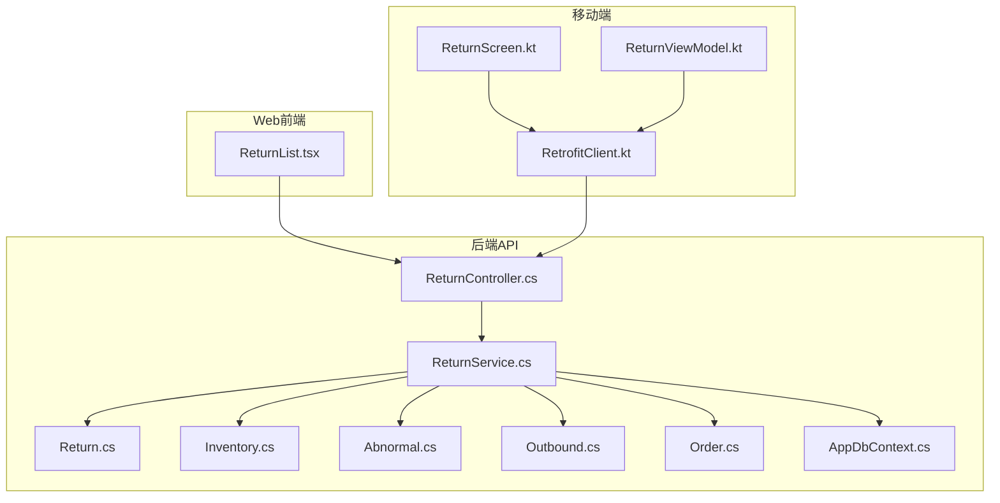

图表来源
- [ReturnList.tsx](file://dip-system/frontend-web/src/pages/ReturnList.tsx)
- [ReturnScreen.kt](file://mobile-android/app/src/main/java/com/dip/material/ui/return_/ReturnScreen.kt)
- [ReturnViewModel.kt](file://mobile-android/app/src/main/java/com/dip/material/ui/return_/ReturnViewModel.kt)
- [RetrofitClient.kt](file://mobile-android/app/src/main/java/com/dip/material/data/network/RetrofitClient.kt)
- [ReturnController.cs](file://dip-system/api/Controllers/ReturnController.cs)
- [ReturnService.cs](file://dip-system/api/Services/ReturnService.cs)
- [Return.cs](file://dip-system/api/Models/Return.cs)
- [Inventory.cs](file://dip-system/api/Models/Inventory.cs)
- [Abnormal.cs](file://dip-system/api/Models/Abnormal.cs)
- [Outbound.cs](file://dip-system/api/Models/Outbound.cs)
- [Order.cs](file://dip-system/api/Models/Order.cs)
- [AppDbContext.cs](file://dip-system/api/Data/AppDbContext.cs)

章节来源
- [ReturnController.cs](file://dip-system/api/Controllers/ReturnController.cs)
- [ReturnService.cs](file://dip-system/api/Services/ReturnService.cs)
- [Return.cs](file://dip-system/api/Models/Return.cs)
- [ReturnList.tsx](file://dip-system/frontend-web/src/pages/ReturnList.tsx)
- [ReturnScreen.kt](file://mobile-android/app/src/main/java/com/dip/material/ui/return_/ReturnScreen.kt)
- [ReturnViewModel.kt](file://mobile-android/app/src/main/java/com/dip/material/ui/return_/ReturnViewModel.kt)
- [ApiService.kt](file://mobile-android/app/src/main/java/com/dip/material/data/network/ApiService.kt)
- [RetrofitClient.kt](file://mobile-android/app/src/main/java/com/dip/material/data/network/RetrofitClient.kt)

## 核心组件
- 控制器（ReturnController）：暴露退货相关REST接口，包括退货单创建、查询、状态更新、关联操作（如质检、入库、报废）。
- 服务（ReturnService）：实现退货主流程与子流程编排，包含原因分类校验、质量判定、逆向物流记录、库存回滚、异常处理与审计。
- 模型（Return/Inventory/Abnormal/Outbound/Order）：定义退货单、库存、不良品、出库单、订单等实体的字段与关系。
- 数据上下文（AppDbContext）：提供仓储访问能力，支撑事务性写入与一致性保障。
- 前端（ReturnList）：退货单列表、筛选、新建、审批与状态变更的交互。
- 移动端（ReturnScreen/ReturnViewModel）：扫码识别、现场录入、拍照上传、离线容错与网络重试。

章节来源
- [ReturnController.cs](file://dip-system/api/Controllers/ReturnController.cs)
- [ReturnService.cs](file://dip-system/api/Services/ReturnService.cs)
- [Return.cs](file://dip-system/api/Models/Return.cs)
- [Inventory.cs](file://dip-system/api/Models/Inventory.cs)
- [Abnormal.cs](file://dip-system/api/Models/Abnormal.cs)
- [Outbound.cs](file://dip-system/api/Models/Outbound.cs)
- [Order.cs](file://dip-system/api/Models/Order.cs)
- [AppDbContext.cs](file://dip-system/api/Data/AppDbContext.cs)
- [ReturnList.tsx](file://dip-system/frontend-web/src/pages/ReturnList.tsx)
- [ReturnScreen.kt](file://mobile-android/app/src/main/java/com/dip/material/ui/return_/ReturnScreen.kt)
- [ReturnViewModel.kt](file://mobile-android/app/src/main/java/com/dip/material/ui/return_/ReturnViewModel.kt)

## 架构总览
退货管理采用分层架构：前端（Web/移动）通过HTTP调用后端API；控制器接收请求并委托服务层处理；服务层协调领域模型与数据访问，保证业务规则与数据一致性；必要时与外部系统（质量管理、供应商管理、财务结算）进行集成。

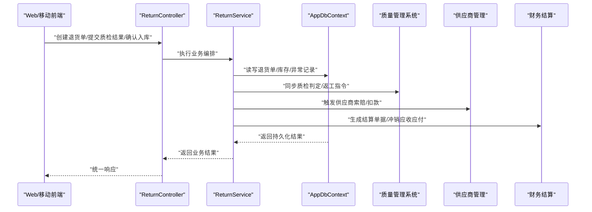

图表来源
- [ReturnController.cs](file://dip-system/api/Controllers/ReturnController.cs)
- [ReturnService.cs](file://dip-system/api/Services/ReturnService.cs)
- [AppDbContext.cs](file://dip-system/api/Data/AppDbContext.cs)

## 详细组件分析

### 退货单数据结构与关系
退货单是逆向流程的核心实体，通常包含以下关键信息：
- 基础信息：退货单号、类型（不良品退货/客户退货/生产退回）、来源（供应商/客户/内部工序）、创建时间、责任人。
- 物料与数量：物料编码、批次、计划退货数量、实际退货数量、单位。
- 质量判定：初检结论（合格/待检/不合格）、复检结论、返工建议、报废标记、检验员、检验时间。
- 物流与位置：退货仓库、暂存库位、目标库位、承运商、运单号、预计到达时间。
- 财务与结算：责任方、索赔金额、扣款方式、结算状态、发票号。
- 关联单据：原始出库单号、订单号、采购单号、不良品记录ID。

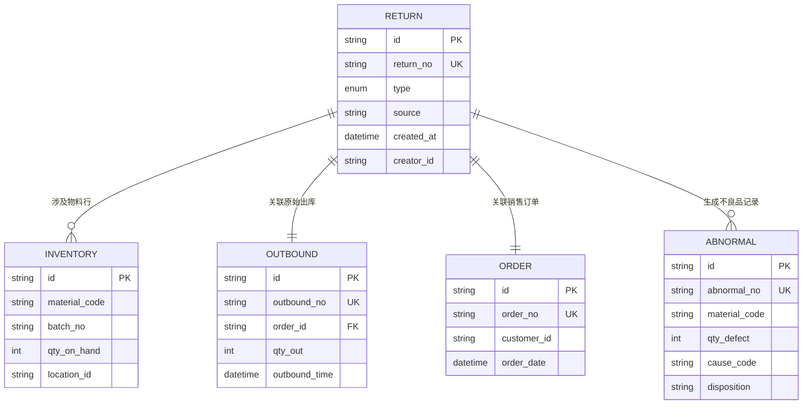

图表来源
- [Return.cs](file://dip-system/api/Models/Return.cs)
- [Inventory.cs](file://dip-system/api/Models/Inventory.cs)
- [Abnormal.cs](file://dip-system/api/Models/Abnormal.cs)
- [Outbound.cs](file://dip-system/api/Models/Outbound.cs)
- [Order.cs](file://dip-system/api/Models/Order.cs)

章节来源
- [Return.cs](file://dip-system/api/Models/Return.cs)
- [Inventory.cs](file://dip-system/api/Models/Inventory.cs)
- [Abnormal.cs](file://dip-system/api/Models/Abnormal.cs)
- [Outbound.cs](file://dip-system/api/Models/Outbound.cs)
- [Order.cs](file://dip-system/api/Models/Order.cs)

### 退货原因分类与质量判定标准
- 原因分类：来料不良、制程不良、设计缺陷、包装破损、错发漏发、运输损坏、客户误用、其他。
- 质量判定：
  - 初检：外观检查、尺寸测量、功能测试、可靠性抽检。
  - 复检：对争议或高价值物料进行二次验证。
  - 处置：合格入库、返工后入库、让步接收、报废销毁、退回供应商。
- 判定依据：检验规范、AQL抽样、历史不良率阈值、客户投诉等级。

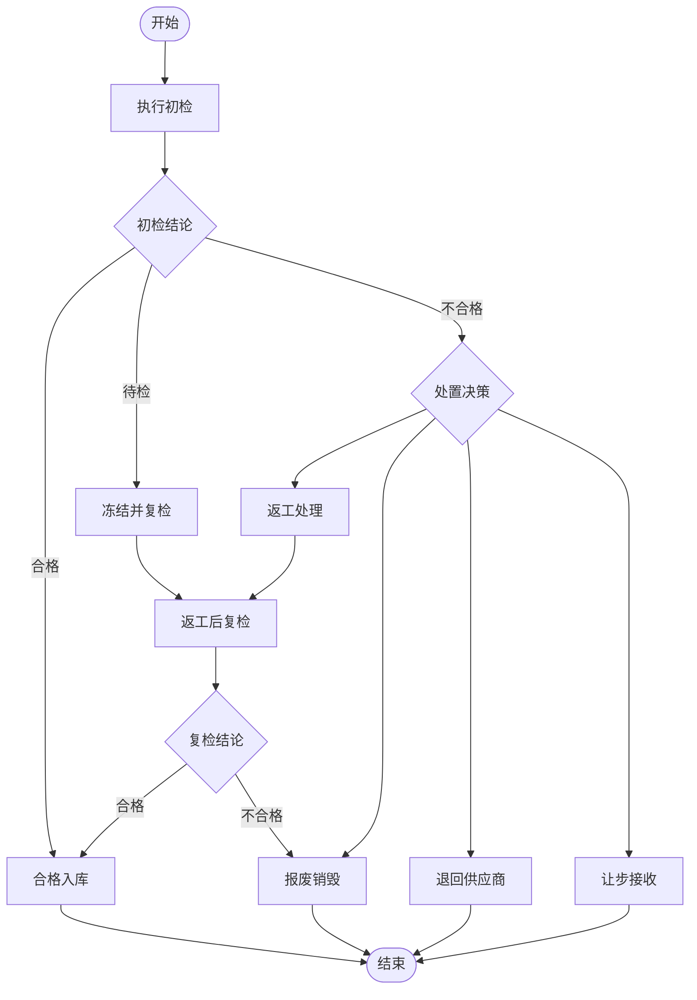

图表来源
- [ReturnService.cs](file://dip-system/api/Services/ReturnService.cs)
- [Abnormal.cs](file://dip-system/api/Models/Abnormal.cs)

章节来源
- [ReturnService.cs](file://dip-system/api/Services/ReturnService.cs)
- [Abnormal.cs](file://dip-system/api/Models/Abnormal.cs)

### 处理决策树（不良品退货/客户退货/生产退回）
- 不良品退货（供应商）：
  - 来料不良→判定责任→是否可返工→不可返工则报废或退回供应商→触发索赔。
- 客户退货：
  - 客户退回→开箱检验→功能/外观判定→可修复则返工→否则报废→影响客诉等级与召回评估。
- 生产退回（内部工序）：
  - 工序退回→追溯工艺参数→是否设备/程序问题→调整工艺后重投→记录异常闭环。

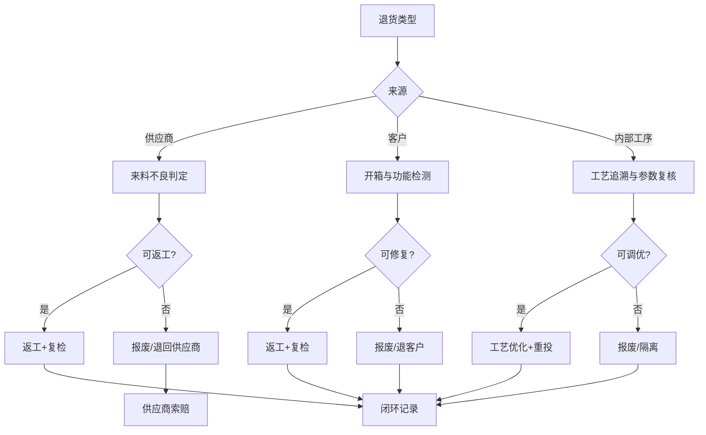

图表来源
- [ReturnService.cs](file://dip-system/api/Services/ReturnService.cs)
- [Abnormal.cs](file://dip-system/api/Models/Abnormal.cs)

章节来源
- [ReturnService.cs](file://dip-system/api/Services/ReturnService.cs)
- [Abnormal.cs](file://dip-system/api/Models/Abnormal.cs)

### 逆向物流跟踪与库存回滚机制
- 逆向物流：
  - 创建退货申请→生成退货标签→承运商取件→在途跟踪→到货验收→暂存区上架→质检→处置→最终入库或出库。
- 库存回滚：
  - 原出库冲销：根据原始出库单与订单，按批次与库位回滚可用量。
  - 暂存与冻结：到货后先入“退货暂存库”，质检后再转入“合格库”或“报废区”。
  - 事务一致性：所有库存变动在同一事务中提交，确保账物一致。

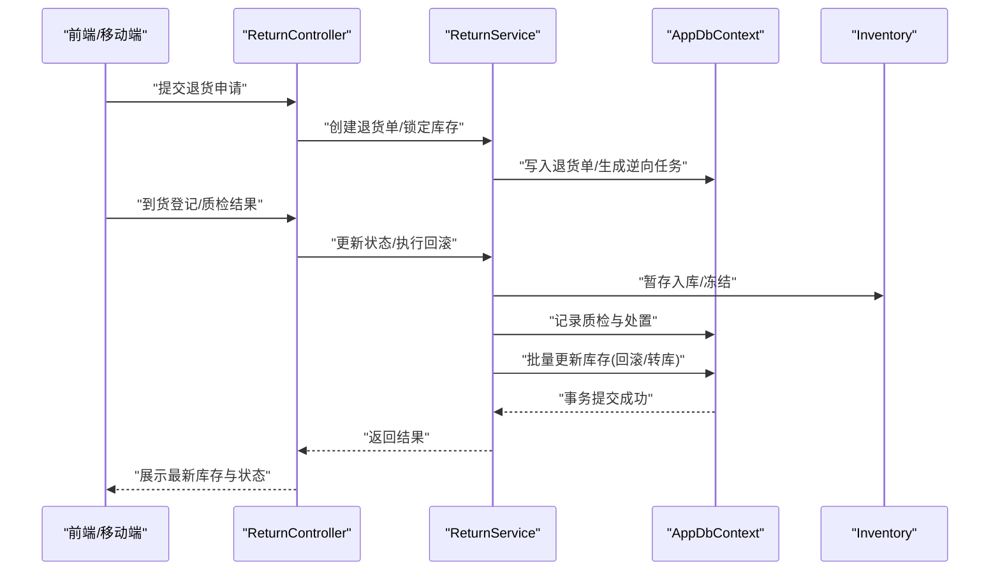

图表来源
- [ReturnController.cs](file://dip-system/api/Controllers/ReturnController.cs)
- [ReturnService.cs](file://dip-system/api/Services/ReturnService.cs)
- [AppDbContext.cs](file://dip-system/api/Data/AppDbContext.cs)
- [Inventory.cs](file://dip-system/api/Models/Inventory.cs)

章节来源
- [ReturnController.cs](file://dip-system/api/Controllers/ReturnController.cs)
- [ReturnService.cs](file://dip-system/api/Services/ReturnService.cs)
- [AppDbContext.cs](file://dip-system/api/Data/AppDbContext.cs)
- [Inventory.cs](file://dip-system/api/Models/Inventory.cs)

### 退货质检、返工处理与报废决策流程
- 质检：
  - 首件检验、全检或抽检策略；记录缺陷代码、照片、视频证据。
  - 自动判定规则：基于缺陷严重度与比例决定处置路径。
- 返工：
  - 生成返工工单；指定工位与工艺路线；返工后复检；合格后转合格库存。
- 报废：
  - 报废审批流；环保合规记录；库存扣减与成本结转。

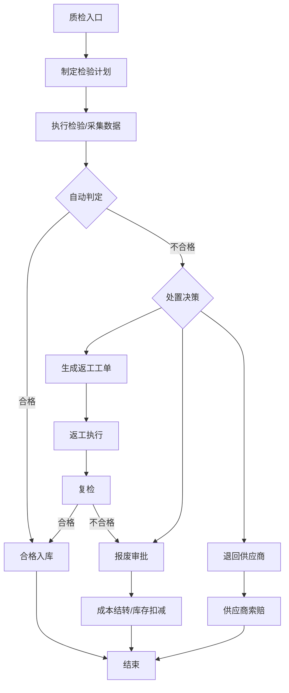

图表来源
- [ReturnService.cs](file://dip-system/api/Services/ReturnService.cs)
- [Abnormal.cs](file://dip-system/api/Models/Abnormal.cs)

章节来源
- [ReturnService.cs](file://dip-system/api/Services/ReturnService.cs)
- [Abnormal.cs](file://dip-system/api/Models/Abnormal.cs)

### 退货统计分析、质量改进建议与供应商索赔
- 统计分析：
  - 退货率、一次合格率、平均处理时长、报废占比、供应商不良排名。
  - 趋势分析与帕累托图定位主要缺陷。
- 质量改进：
  - 针对高频缺陷发起纠正预防措施（CAPA）；追踪整改效果。
- 供应商索赔：
  - 自动生成索赔单；关联退货单与不良记录；计算扣款金额；推送供应商门户确认。

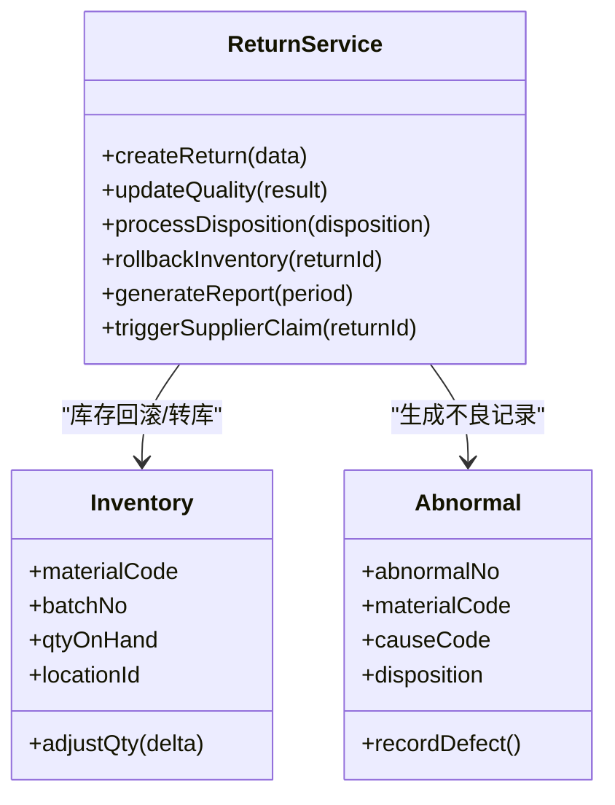

图表来源
- [ReturnService.cs](file://dip-system/api/Services/ReturnService.cs)
- [Inventory.cs](file://dip-system/api/Models/Inventory.cs)
- [Abnormal.cs](file://dip-system/api/Models/Abnormal.cs)

章节来源
- [ReturnService.cs](file://dip-system/api/Services/ReturnService.cs)
- [Inventory.cs](file://dip-system/api/Models/Inventory.cs)
- [Abnormal.cs](file://dip-system/api/Models/Abnormal.cs)

### 系统集成（质量管理系统、供应商管理、财务结算）
- 质量管理系统（QMS）：
  - 同步检验标准、检验结果、不合格报告；对接LIMS/SPC工具。
- 供应商管理（SCM）：
  - 供应商绩效评分、索赔通知、退货协议与SLA约束。
- 财务结算（ERP/财务系统）：
  - 退货冲销应收、供应商扣款、成本结转、税务处理。

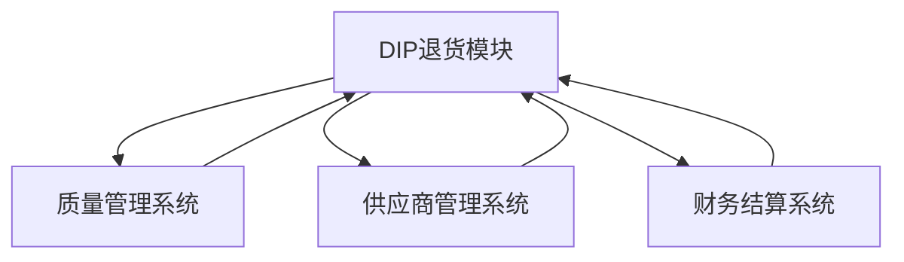

图表来源
- [ReturnService.cs](file://dip-system/api/Services/ReturnService.cs)

章节来源
- [ReturnService.cs](file://dip-system/api/Services/ReturnService.cs)

### 前端与移动端交互
- Web前端（ReturnList）：
  - 列表展示、条件筛选、新建退货单、状态流转操作、导出报表。
- 移动端（ReturnScreen/ReturnViewModel）：
  - 扫码识别物料/批次、拍照取证、离线缓存与重试、实时状态同步。

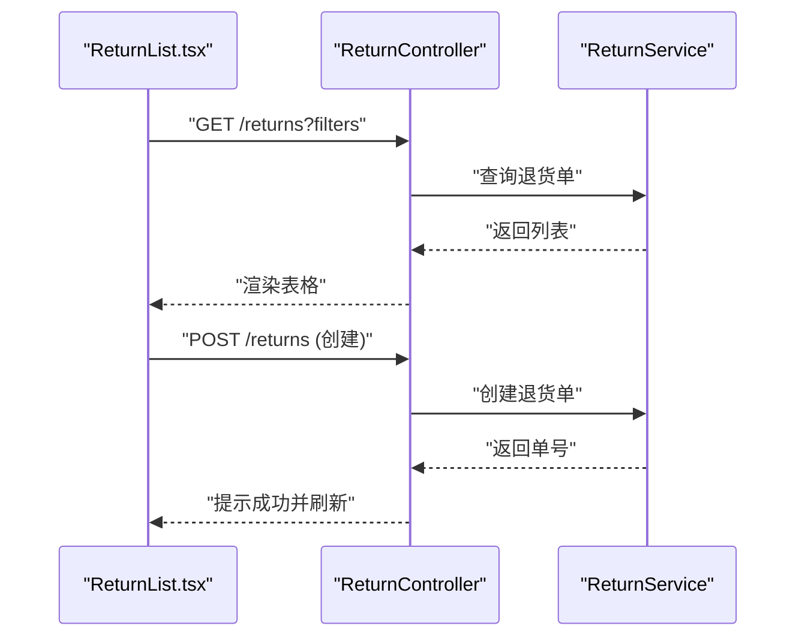

图表来源
- [ReturnList.tsx](file://dip-system/frontend-web/src/pages/ReturnList.tsx)
- [ReturnController.cs](file://dip-system/api/Controllers/ReturnController.cs)
- [ReturnService.cs](file://dip-system/api/Services/ReturnService.cs)

章节来源
- [ReturnList.tsx](file://dip-system/frontend-web/src/pages/ReturnList.tsx)
- [ReturnScreen.kt](file://mobile-android/app/src/main/java/com/dip/material/ui/return_/ReturnScreen.kt)
- [ReturnViewModel.kt](file://mobile-android/app/src/main/java/com/dip/material/ui/return_/ReturnViewModel.kt)
- [ApiService.kt](file://mobile-android/app/src/main/java/com/dip/material/data/network/ApiService.kt)
- [RetrofitClient.kt](file://mobile-android/app/src/main/java/com/dip/material/data/network/RetrofitClient.kt)

## 依赖关系分析
- 控制器与服务：控制器仅做请求解析与响应封装，业务逻辑集中在服务层，降低耦合。
- 服务与模型：服务依赖Return/Inventory/Abnormal等模型，保证领域语义清晰。
- 服务与数据上下文：通过AppDbContext进行持久化，确保事务性与一致性。
- 前端与后端：通过REST API通信，移动端使用Retrofit统一网络层。

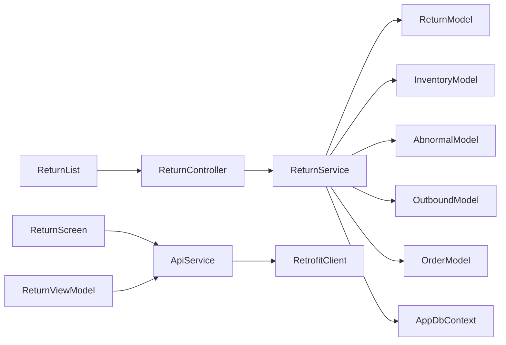

图表来源
- [ReturnController.cs](file://dip-system/api/Controllers/ReturnController.cs)
- [ReturnService.cs](file://dip-system/api/Services/ReturnService.cs)
- [Return.cs](file://dip-system/api/Models/Return.cs)
- [Inventory.cs](file://dip-system/api/Models/Inventory.cs)
- [Abnormal.cs](file://dip-system/api/Models/Abnormal.cs)
- [Outbound.cs](file://dip-system/api/Models/Outbound.cs)
- [Order.cs](file://dip-system/api/Models/Order.cs)
- [AppDbContext.cs](file://dip-system/api/Data/AppDbContext.cs)
- [ReturnList.tsx](file://dip-system/frontend-web/src/pages/ReturnList.tsx)
- [ReturnScreen.kt](file://mobile-android/app/src/main/java/com/dip/material/ui/return_/ReturnScreen.kt)
- [ReturnViewModel.kt](file://mobile-android/app/src/main/java/com/dip/material/ui/return_/ReturnViewModel.kt)
- [ApiService.kt](file://mobile-android/app/src/main/java/com/dip/material/data/network/ApiService.kt)
- [RetrofitClient.kt](file://mobile-android/app/src/main/java/com/dip/material/data/network/RetrofitClient.kt)

章节来源
- [ReturnController.cs](file://dip-system/api/Controllers/ReturnController.cs)
- [ReturnService.cs](file://dip-system/api/Services/ReturnService.cs)
- [Return.cs](file://dip-system/api/Models/Return.cs)
- [Inventory.cs](file://dip-system/api/Models/Inventory.cs)
- [Abnormal.cs](file://dip-system/api/Models/Abnormal.cs)
- [Outbound.cs](file://dip-system/api/Models/Outbound.cs)
- [Order.cs](file://dip-system/api/Models/Order.cs)
- [AppDbContext.cs](file://dip-system/api/Data/AppDbContext.cs)
- [ReturnList.tsx](file://dip-system/frontend-web/src/pages/ReturnList.tsx)
- [ReturnScreen.kt](file://mobile-android/app/src/main/java/com/dip/material/ui/return_/ReturnScreen.kt)
- [ReturnViewModel.kt](file://mobile-android/app/src/main/java/com/dip/material/ui/return_/ReturnViewModel.kt)
- [ApiService.kt](file://mobile-android/app/src/main/java/com/dip/material/data/network/ApiService.kt)
- [RetrofitClient.kt](file://mobile-android/app/src/main/java/com/dip/material/data/network/RetrofitClient.kt)

## 性能考虑
- 数据库层面：
  - 为退货单号、物料编码、批次号建立索引，提升查询效率。
  - 批量更新库存时采用批处理减少往返次数。
- 服务层：
  - 大对象（图片/视频）走对象存储，数据库仅存引用。
  - 异步处理耗时任务（如报表生成、索赔单推送）。
- 前端与移动端：
  - 分页加载、懒加载详情；移动端离线缓存与冲突合并。
  - 网络重试与指数退避，避免雪崩。

[本节为通用指导，不直接分析具体文件]

## 故障排查指南
- 常见错误：
  - 退货单号重复：检查唯一约束与并发创建。
  - 库存不足：核对原始出库与回滚逻辑是否正确。
  - 质检数据缺失：强制必填校验与附件上传。
  - 供应商索赔失败：检查接口连通性与凭证完整性。
- 排查步骤：
  - 查看日志与审计记录；复现操作步骤。
  - 检查数据库事务提交状态与锁等待。
  - 核对第三方系统回调与幂等性。

章节来源
- [ReturnService.cs](file://dip-system/api/Services/ReturnService.cs)
- [AppDbContext.cs](file://dip-system/api/Data/AppDbContext.cs)

## 结论
退货管理模块以清晰的层次结构与严谨的业务编排，实现了不良品退货、客户退货与生产退回的全链路闭环。通过标准化的原因分类、质量判定与处置决策，结合逆向物流跟踪与库存回滚机制，保障了账物一致与合规性。统计分析、质量改进与供应商索赔功能进一步提升了供应链协同与成本控制能力。建议在实施中强化数据治理与接口幂等性，持续优化性能与用户体验。

[本节为总结性内容，不直接分析具体文件]

## 附录
- 术语表：
  - 逆向物流：产品从消费端向供应端的流动过程。
  - 让步接收：在特定条件下接受不合格品的处理方式。
  - CAPA：纠正与预防措施。
- 参考流程：
  - 退货申请→到货验收→质检→处置→库存调整→结算闭环。

[本节为概念性内容，不直接分析具体文件]