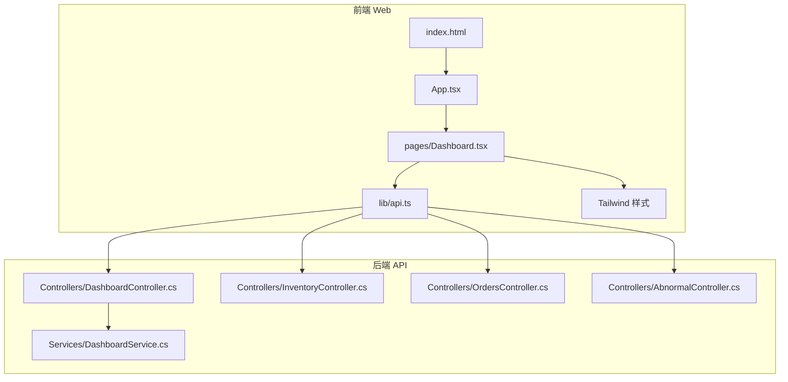
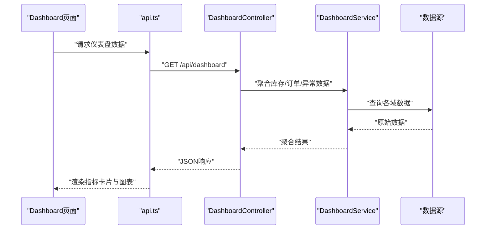
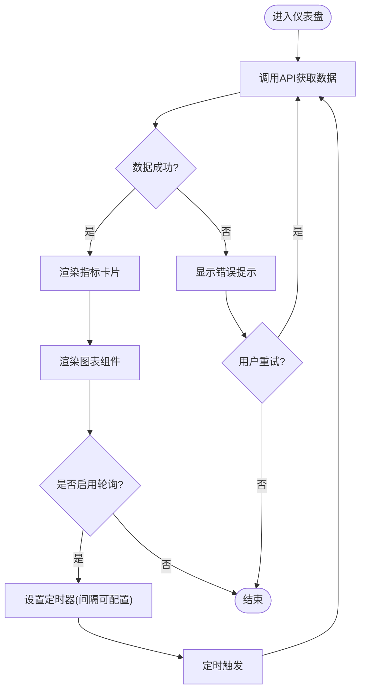
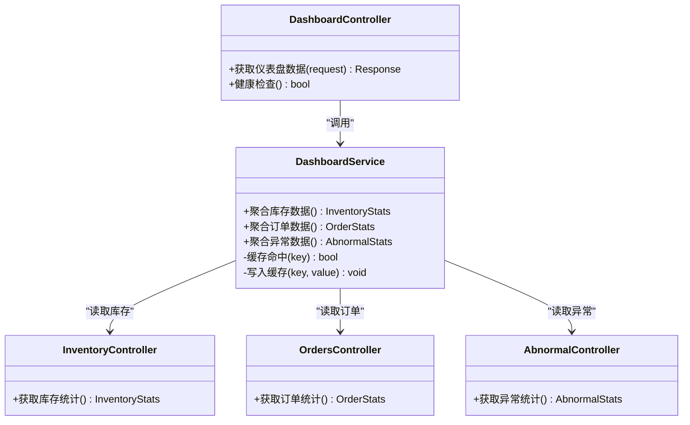
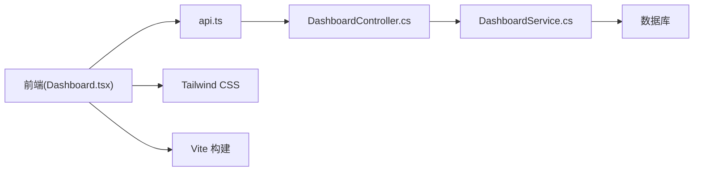

# 仪表盘页面

<cite>
**本文引用的文件**   
- [Dashboard.tsx](file://dip-system/frontend-web/src/pages/Dashboard.tsx)
- [DashboardController.cs](file://dip-system/api/Controllers/DashboardController.cs)
- [DashboardService.cs](file://dip-system/api/Services/DashboardService.cs)
- [InventoryController.cs](file://dip-system/api/Controllers/InventoryController.cs)
- [OrdersController.cs](file://dip-system/api/Controllers/OrdersController.cs)
- [AbnormalController.cs](file://dip-system/api/Controllers/AbnormalController.cs)
- [api.ts](file://dip-system/frontend-web/src/lib/api.ts)
- [App.tsx](file://dip-system/frontend-web/src/App.tsx)
- [index.html](file://dip-system/frontend-web/index.html)
- [package.json](file://dip-system/frontend-web/package.json)
- [vite.config.ts](file://dip-system/frontend-web/vite.config.ts)
- [tailwind.config.js](file://dip-system/frontend-web/tailwind.config.js)
</cite>

## 目录
1. [简介](#简介)
2. [项目结构](#项目结构)
3. [核心组件](#核心组件)
4. [架构总览](#架构总览)
5. [详细组件分析](#详细组件分析)
6. [依赖关系分析](#依赖关系分析)
7. [性能考虑](#性能考虑)
8. [故障排查指南](#故障排查指南)
9. [结论](#结论)
10. [附录](#附录)

## 简介
本文件面向DIP系统的“仪表盘”页面，系统性说明其布局设计、数据展示组件与实时数据更新机制。文档覆盖关键指标卡片（库存状态、订单统计、异常预警等）、图表组件的实现要点、数据获取策略、缓存机制与性能优化，并给出响应式设计与移动端适配方案，以及自定义指标配置和数据刷新频率设置方法。读者可据此快速理解前端页面如何与后端API协作，完成数据的拉取、缓存、渲染与实时更新。

## 项目结构
仪表盘相关的前端实现位于Web前端工程内，核心页面为Dashboard页面；后端提供Dashboard聚合接口及库存、订单、异常等子域接口。构建工具采用Vite，样式使用Tailwind CSS，运行时通过TypeScript与React进行开发。

**图示来源** 
- [index.html](file://dip-system/frontend-web/index.html)
- [App.tsx](file://dip-system/frontend-web/src/App.tsx)
- [Dashboard.tsx](file://dip-system/frontend-web/src/pages/Dashboard.tsx)
- [api.ts](file://dip-system/frontend-web/src/lib/api.ts)
- [DashboardController.cs](file://dip-system/api/Controllers/DashboardController.cs)
- [DashboardService.cs](file://dip-system/api/Services/DashboardService.cs)
- [InventoryController.cs](file://dip-system/api/Controllers/InventoryController.cs)
- [OrdersController.cs](file://dip-system/api/Controllers/OrdersController.cs)
- [AbnormalController.cs](file://dip-system/api/Controllers/AbnormalController.cs)

**章节来源**
- [index.html](file://dip-system/frontend-web/index.html)
- [App.tsx](file://dip-system/frontend-web/src/App.tsx)
- [Dashboard.tsx](file://dip-system/frontend-web/src/pages/Dashboard.tsx)
- [api.ts](file://dip-system/frontend-web/src/lib/api.ts)
- [DashboardController.cs](file://dip-system/api/Controllers/DashboardController.cs)
- [DashboardService.cs](file://dip-system/api/Services/DashboardService.cs)
- [InventoryController.cs](file://dip-system/api/Controllers/InventoryController.cs)
- [OrdersController.cs](file://dip-system/api/Controllers/OrdersController.cs)
- [AbnormalController.cs](file://dip-system/api/Controllers/AbnormalController.cs)

## 核心组件
- 仪表盘页面组件：负责整体布局、指标卡片与图表的编排、数据加载与刷新控制、错误处理与用户提示。
- API封装层：统一HTTP请求、鉴权头注入、错误解析与重试策略。
- 后端控制器与服务：聚合多源数据，提供统一的仪表盘数据接口；同时暴露库存、订单、异常等细粒度接口供其他模块复用。

关键职责划分：
- 前端Dashboard页面：UI渲染、交互逻辑、本地缓存与轮询控制。
- api.ts：网络请求封装、错误处理、可选的缓存或去抖/节流。
- DashboardController：对外暴露聚合接口，协调多个服务或数据库查询。
- DashboardService：业务聚合逻辑、数据转换、缓存与性能优化。

**章节来源**
- [Dashboard.tsx](file://dip-system/frontend-web/src/pages/Dashboard.tsx)
- [api.ts](file://dip-system/frontend-web/src/lib/api.ts)
- [DashboardController.cs](file://dip-system/api/Controllers/DashboardController.cs)
- [DashboardService.cs](file://dip-system/api/Services/DashboardService.cs)

## 架构总览
仪表盘的数据流遵循“前端页面 -> API封装 -> 后端控制器 -> 服务层 -> 数据源”的分层模式。前端通过api.ts发起请求，后端DashboardController聚合库存、订单、异常等数据后返回给前端，由Dashboard页面渲染指标卡片与图表。

**图示来源** 
- [Dashboard.tsx](file://dip-system/frontend-web/src/pages/Dashboard.tsx)
- [api.ts](file://dip-system/frontend-web/src/lib/api.ts)
- [DashboardController.cs](file://dip-system/api/Controllers/DashboardController.cs)
- [DashboardService.cs](file://dip-system/api/Services/DashboardService.cs)

## 详细组件分析

### 仪表盘页面（Dashboard）
- 布局设计：采用网格布局，按屏幕宽度自适应排列指标卡片与图表区域。在移动端单列显示，平板双列，桌面三列及以上。
- 数据展示组件：
  - 关键指标卡片：库存状态（可用量、低库存预警数量、超储数量）、订单统计（今日订单数、待处理订单、已完成订单）、异常预警（当前活跃异常数、严重级别分布）。
  - 图表组件：趋势折线图（订单趋势）、柱状图（库存分类占比）、告警列表（异常明细）。
- 实时数据更新机制：
  - 默认轮询间隔（如30秒），可通过配置项调整。
  - 支持手动刷新按钮与进入页面自动首次加载。
  - 失败重试与退避策略，避免频繁请求导致服务器压力。
- 错误处理与用户提示：网络异常、数据格式错误时进行友好提示，并提供重试入口。
- 性能优化：
  - 防抖/节流：输入过滤与高频操作限制。
  - 局部刷新：仅更新变化数据，减少重渲染。
  - 懒加载：图表按需初始化，首屏优先渲染关键指标。

**图示来源** 
- [Dashboard.tsx](file://dip-system/frontend-web/src/pages/Dashboard.tsx)

**章节来源**
- [Dashboard.tsx](file://dip-system/frontend-web/src/pages/Dashboard.tsx)

### API封装层（api.ts）
- 功能要点：
  - 统一请求封装：基础URL、超时、重试次数、错误码映射。
  - 鉴权头注入：自动附加Token，处理过期刷新流程。
  - 缓存策略：对只读数据提供内存缓存，支持失效时间配置。
  - 错误处理：标准化错误对象，便于前端统一提示。
- 与Dashboard页面的集成：
  - 提供getDashboard、getInventoryStats、getOrderStats、getAbnormalStats等方法。
  - 支持传入参数（如时间范围、仓库ID）以灵活筛选数据。

**章节来源**
- [api.ts](file://dip-system/frontend-web/src/lib/api.ts)

### 后端控制器与服务（DashboardController、DashboardService）
- DashboardController：
  - 暴露聚合接口，接收前端请求参数，调用服务层获取数据。
  - 统一响应格式与错误码，便于前端处理。
- DashboardService：
  - 聚合库存、订单、异常等多域数据，进行计算与转换。
  - 内置缓存（如内存缓存）以减少重复查询。
  - 支持分页、过滤、排序等常见查询能力。

**图示来源** 
- [DashboardController.cs](file://dip-system/api/Controllers/DashboardController.cs)
- [DashboardService.cs](file://dip-system/api/Services/DashboardService.cs)
- [InventoryController.cs](file://dip-system/api/Controllers/InventoryController.cs)
- [OrdersController.cs](file://dip-system/api/Controllers/OrdersController.cs)
- [AbnormalController.cs](file://dip-system/api/Controllers/AbnormalController.cs)

**章节来源**
- [DashboardController.cs](file://dip-system/api/Controllers/DashboardController.cs)
- [DashboardService.cs](file://dip-system/api/Services/DashboardService.cs)
- [InventoryController.cs](file://dip-system/api/Controllers/InventoryController.cs)
- [OrdersController.cs](file://dip-system/api/Controllers/OrdersController.cs)
- [AbnormalController.cs](file://dip-system/api/Controllers/AbnormalController.cs)

### 响应式设计与移动端适配
- 布局策略：基于Tailwind的栅格系统，使用断点控制列数（sm/md/lg/xl）。
- 组件适配：
  - 指标卡片在小屏下垂直堆叠，在大屏下横向排列。
  - 图表在小屏下简化展示（隐藏次要信息、切换为纵向滚动）。
- 交互优化：触摸友好的按钮尺寸、滑动刷新、键盘导航支持。

**章节来源**
- [tailwind.config.js](file://dip-system/frontend-web/tailwind.config.js)
- [Dashboard.tsx](file://dip-system/frontend-web/src/pages/Dashboard.tsx)

### 自定义指标配置与刷新频率设置
- 自定义指标：
  - 通过配置文件或环境变量定义指标字段、显示名称、单位、阈值颜色规则。
  - 前端根据配置动态生成卡片与图表，无需硬编码。
- 刷新频率：
  - 支持全局刷新间隔配置（秒级），可按模块覆盖。
  - 提供手动刷新入口与自动轮询开关。
- 缓存策略：
  - 前端内存缓存（短TTL），后端服务层缓存（长TTL）。
  - 支持按Key失效与批量刷新。

**章节来源**
- [Dashboard.tsx](file://dip-system/frontend-web/src/pages/Dashboard.tsx)
- [api.ts](file://dip-system/frontend-web/src/lib/api.ts)
- [DashboardService.cs](file://dip-system/api/Services/DashboardService.cs)

## 依赖关系分析
- 前端依赖：
  - React与TypeScript用于组件开发与类型安全。
  - Vite作为构建工具，提升开发体验与打包效率。
  - Tailwind CSS用于原子化样式与响应式设计。
- 后端依赖：
  - ASP.NET Core提供RESTful API。
  - 内存缓存用于热点数据加速。
  - 数据库访问层（EF Core或Dapper）用于数据持久化。

**图示来源** 
- [Dashboard.tsx](file://dip-system/frontend-web/src/pages/Dashboard.tsx)
- [api.ts](file://dip-system/frontend-web/src/lib/api.ts)
- [DashboardController.cs](file://dip-system/api/Controllers/DashboardController.cs)
- [DashboardService.cs](file://dip-system/api/Services/DashboardService.cs)
- [tailwind.config.js](file://dip-system/frontend-web/tailwind.config.js)
- [vite.config.ts](file://dip-system/frontend-web/vite.config.ts)

**章节来源**
- [package.json](file://dip-system/frontend-web/package.json)
- [vite.config.ts](file://dip-system/frontend-web/vite.config.ts)
- [tailwind.config.js](file://dip-system/frontend-web/tailwind.config.js)

## 性能考虑
- 前端优化：
  - 首屏关键指标优先渲染，图表懒加载。
  - 使用防抖/节流减少不必要的请求与渲染。
  - 内存缓存避免重复请求，合理设置TTL。
- 后端优化：
  - 聚合查询减少往返次数，避免N+1问题。
  - 内存缓存热点数据，降低数据库压力。
  - 异步处理与并行查询提升吞吐。
- 网络优化：
  - 压缩响应体，启用Gzip/Brotli。
  - 合理分页与过滤，避免一次性返回大量数据。

[本节为通用指导，不直接分析具体文件]

## 故障排查指南
- 常见问题：
  - 数据不更新：检查轮询定时器是否启动、网络请求是否成功、缓存是否过期。
  - 图表不显示：确认数据格式是否符合预期、图表库是否正确初始化。
  - 移动端布局错乱：检查Tailwind断点配置与组件响应式类名。
- 调试建议：
  - 浏览器开发者工具查看Network面板，确认请求与响应。
  - 控制台日志定位错误堆栈，关注api.ts的错误处理分支。
  - 后端日志查看DashboardService的缓存命中情况与异常信息。

**章节来源**
- [api.ts](file://dip-system/frontend-web/src/lib/api.ts)
- [Dashboard.tsx](file://dip-system/frontend-web/src/pages/Dashboard.tsx)
- [DashboardService.cs](file://dip-system/api/Services/DashboardService.cs)

## 结论
仪表盘页面通过清晰的分层架构与模块化设计，实现了关键指标的可视化展示与实时数据更新。前端采用响应式布局与性能优化策略，后端通过聚合接口与缓存机制保障数据的高效获取。通过自定义指标配置与灵活的刷新频率设置，系统具备良好的扩展性与可维护性。

[本节为总结性内容，不直接分析具体文件]

## 附录
- 构建与运行：
  - 前端：使用Vite进行开发与构建，确保依赖安装完整。
  - 后端：ASP.NET Core应用需配置数据库连接与缓存服务。
- 环境配置：
  - 环境变量用于控制API地址、刷新间隔、缓存TTL等。
  - Tailwind配置用于定制主题与断点。

**章节来源**
- [index.html](file://dip-system/frontend-web/index.html)
- [package.json](file://dip-system/frontend-web/package.json)
- [vite.config.ts](file://dip-system/frontend-web/vite.config.ts)
- [tailwind.config.js](file://dip-system/frontend-web/tailwind.config.js)