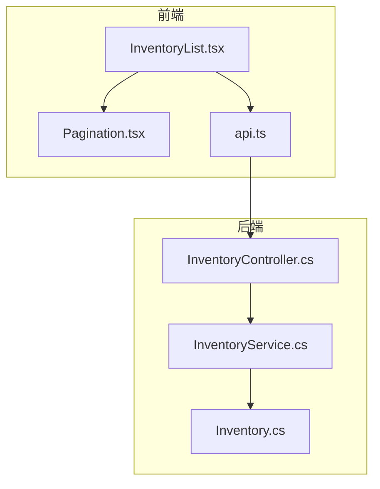
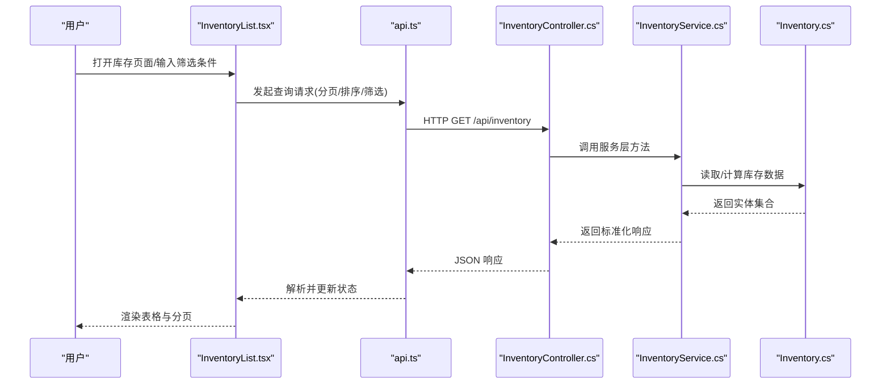
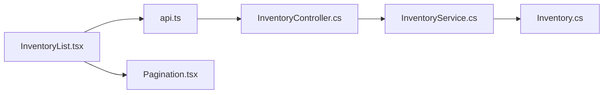

# 库存管理页面

<cite>
**本文引用的文件**   
- [InventoryList.tsx](file://dip-system/frontend-web/src/pages/InventoryList.tsx)
- [Pagination.tsx](file://dip-system/frontend-web/src/lib/Pagination.tsx)
- [api.ts](file://dip-system/frontend-web/src/lib/api.ts)
- [InventoryController.cs](file://dip-system/api/Controllers/InventoryController.cs)
- [InventoryService.cs](file://dip-system/api/Services/InventoryService.cs)
- [Inventory.cs](file://dip-system/api/Models/Inventory.cs)
</cite>

## 目录
1. [简介](#简介)
2. [项目结构](#项目结构)
3. [核心组件](#核心组件)
4. [架构总览](#架构总览)
5. [详细组件分析](#详细组件分析)
6. [依赖关系分析](#依赖关系分析)
7. [性能考虑](#性能考虑)
8. [故障排查指南](#故障排查指南)
9. [结论](#结论)
10. [附录](#附录)

## 简介
本文件为 DIP 系统“库存管理页面”的完整技术文档，面向前端与后端开发者及实施人员。内容覆盖：
- 库存列表数据表格实现（分页加载、排序筛选、批量操作）
- 库存查询接口调用、数据同步机制与实时更新策略
- 库存状态标识、颜色编码与视觉反馈规范
- 搜索过滤高级用法、导出与打印支持
- 库存预警设置与库存调整操作的实现指南

## 项目结构
库存管理功能由前后端协同实现：
- 前端：React + TypeScript，使用自研 Pagination 组件与统一 API 客户端
- 后端：ASP.NET Core Web API，提供库存查询、更新、批量操作等接口
- 数据模型：Inventory 实体承载库存字段与状态

图表来源
- [InventoryList.tsx](file://dip-system/frontend-web/src/pages/InventoryList.tsx)
- [Pagination.tsx](file://dip-system/frontend-web/src/lib/Pagination.tsx)
- [api.ts](file://dip-system/frontend-web/src/lib/api.ts)
- [InventoryController.cs](file://dip-system/api/Controllers/InventoryController.cs)
- [InventoryService.cs](file://dip-system/api/Services/InventoryService.cs)
- [Inventory.cs](file://dip-system/api/Models/Inventory.cs)

章节来源
- [InventoryList.tsx](file://dip-system/frontend-web/src/pages/InventoryList.tsx)
- [Pagination.tsx](file://dip-system/frontend-web/src/lib/Pagination.tsx)
- [api.ts](file://dip-system/frontend-web/src/lib/api.ts)
- [InventoryController.cs](file://dip-system/api/Controllers/InventoryController.cs)
- [InventoryService.cs](file://dip-system/api/Services/InventoryService.cs)
- [Inventory.cs](file://dip-system/api/Models/Inventory.cs)

## 核心组件
- 库存列表页 InventoryList.tsx
  - 负责查询参数构建、分页控制、排序与筛选、批量选择与操作、导出与打印入口
  - 通过 api.ts 调用后端接口，渲染表格并处理加载态与错误态
- 分页组件 Pagination.tsx
  - 封装页码切换、每页条数变更、总条数展示等交互
- API 客户端 api.ts
  - 统一请求封装、鉴权头注入、错误提示与重试策略
- 控制器 InventoryController.cs
  - 暴露库存查询、更新、批量操作等 REST 接口
- 服务层 InventoryService.cs
  - 业务逻辑编排、数据访问、校验与转换
- 数据模型 Inventory.cs
  - 定义库存实体字段与状态枚举

章节来源
- [InventoryList.tsx](file://dip-system/frontend-web/src/pages/InventoryList.tsx)
- [Pagination.tsx](file://dip-system/frontend-web/src/lib/Pagination.tsx)
- [api.ts](file://dip-system/frontend-web/src/lib/api.ts)
- [InventoryController.cs](file://dip-system/api/Controllers/InventoryController.cs)
- [InventoryService.cs](file://dip-system/api/Services/InventoryService.cs)
- [Inventory.cs](file://dip-system/api/Models/Inventory.cs)

## 架构总览
库存管理页面的端到端调用流程如下：

图表来源
- [InventoryList.tsx](file://dip-system/frontend-web/src/pages/InventoryList.tsx)
- [api.ts](file://dip-system/frontend-web/src/lib/api.ts)
- [InventoryController.cs](file://dip-system/api/Controllers/InventoryController.cs)
- [InventoryService.cs](file://dip-system/api/Services/InventoryService.cs)
- [Inventory.cs](file://dip-system/api/Models/Inventory.cs)

## 详细组件分析

### 库存列表页 InventoryList.tsx
- 功能要点
  - 查询参数：关键词、物料号、库位、批次、状态、时间范围等
  - 分页加载：结合 Pagination.tsx 实现页码与每页条数切换
  - 排序与筛选：支持列头点击排序与多条件组合筛选
  - 批量操作：多选行后执行批量入库/出库/调整/冻结等操作
  - 导出与打印：导出当前筛选结果或全部数据；触发浏览器打印预览
  - 实时性：支持定时刷新或事件驱动刷新（如扫码入库后）
- 交互流程
  - 初始化时加载第一页数据
  - 用户修改筛选/排序/分页参数时，防抖触发查询
  - 批量操作前进行二次确认，成功后刷新列表
- 错误处理
  - 网络异常、权限不足、参数校验失败等统一提示
  - 空数据与加载中状态友好展示

章节来源
- [InventoryList.tsx](file://dip-system/frontend-web/src/pages/InventoryList.tsx)

### 分页组件 Pagination.tsx
- 能力说明
  - 支持页码跳转、上一页/下一页、每页条数切换
  - 显示总记录数与当前页信息
  - 禁用无效页码与边界保护
- 集成方式
  - 被 InventoryList.tsx 引入，接收 total、pageSize、current、onChange 等属性

章节来源
- [Pagination.tsx](file://dip-system/frontend-web/src/lib/Pagination.tsx)

### API 客户端 api.ts
- 职责
  - 统一封装 fetch/axios 请求
  - 自动附加鉴权头、超时与重试配置
  - 统一错误拦截与消息提示
- 库存相关接口
  - 查询：GET /api/inventory（支持分页、排序、筛选）
  - 更新：PUT /api/inventory/{id}
  - 批量：POST /api/inventory/batch（批量调整/冻结/解冻等）
  - 导出：GET /api/inventory/export（可选 CSV/Excel）
  - 打印：GET /api/inventory/print（生成打印模板）

章节来源
- [api.ts](file://dip-system/frontend-web/src/lib/api.ts)

### 控制器 InventoryController.cs
- 接口设计
  - GetInventory：分页查询，支持 keyword、materialCode、location、batch、status、dateFrom、dateTo、sortField、sortOrder、page、pageSize
  - UpdateInventory：单条更新（数量、状态、备注等）
  - BatchUpdate：批量更新（按 ID 列表）
  - ExportInventory：导出筛选结果
  - PrintInventory：生成打印视图
- 安全与校验
  - 角色权限校验、参数校验、异常捕获与统一响应格式

章节来源
- [InventoryController.cs](file://dip-system/api/Controllers/InventoryController.cs)

### 服务层 InventoryService.cs
- 业务逻辑
  - 组装查询条件、分页与排序
  - 计算库存状态（可用、预留、在途、冻结等）
  - 校验更新合法性（负数、超储、冻结限制等）
  - 事务性批量更新
- 数据访问
  - 通过仓储/ORM 访问数据库，返回 DTO 或实体集合

章节来源
- [InventoryService.cs](file://dip-system/api/Services/InventoryService.cs)

### 数据模型 Inventory.cs
- 字段说明
  - 物料编号、名称、规格、单位、库位、批次、供应商、生产日期、有效期
  - 库存数量、可用数量、预留数量、在途数量、冻结数量
  - 状态枚举：正常、低库存、缺货、冻结、过期等
  - 审计字段：创建人、创建时间、更新人、更新时间
- 约束与规则
  - 必填字段校验、数值范围、状态流转规则

章节来源
- [Inventory.cs](file://dip-system/api/Models/Inventory.cs)

## 依赖关系分析
- 前端依赖
  - InventoryList.tsx 依赖 api.ts 与 Pagination.tsx
- 后端依赖
  - InventoryController.cs 依赖 InventoryService.cs
  - InventoryService.cs 依赖 Inventory.cs 及数据访问层
- 外部依赖
  - 鉴权中间件、日志、缓存（可选）、消息队列（可选用于实时更新）

图表来源
- [InventoryList.tsx](file://dip-system/frontend-web/src/pages/InventoryList.tsx)
- [Pagination.tsx](file://dip-system/frontend-web/src/lib/Pagination.tsx)
- [api.ts](file://dip-system/frontend-web/src/lib/api.ts)
- [InventoryController.cs](file://dip-system/api/Controllers/InventoryController.cs)
- [InventoryService.cs](file://dip-system/api/Services/InventoryService.cs)
- [Inventory.cs](file://dip-system/api/Models/Inventory.cs)

章节来源
- [InventoryList.tsx](file://dip-system/frontend-web/src/pages/InventoryList.tsx)
- [Pagination.tsx](file://dip-system/frontend-web/src/lib/Pagination.tsx)
- [api.ts](file://dip-system/frontend-web/src/lib/api.ts)
- [InventoryController.cs](file://dip-system/api/Controllers/InventoryController.cs)
- [InventoryService.cs](file://dip-system/api/Services/InventoryService.cs)
- [Inventory.cs](file://dip-system/api/Models/Inventory.cs)

## 性能考虑
- 前端
  - 使用防抖减少频繁查询
  - 分页加载避免一次性拉取大量数据
  - 虚拟滚动（可选）优化大数据量渲染
- 后端
  - 服务端分页与索引优化
  - 复杂查询拆分与缓存热点数据
  - 批量接口采用事务与最小化往返
- 网络
  - 合理超时与重试策略
  - 压缩与按需字段返回

[本节为通用指导，不直接分析具体文件]

## 故障排查指南
- 常见问题
  - 列表无数据：检查筛选条件、分页参数、接口权限
  - 排序异常：确认后端排序字段映射与白名单
  - 批量操作失败：核对选中行 ID 有效性、状态是否允许操作
  - 导出为空：确认导出范围与筛选条件一致性
- 定位建议
  - 查看浏览器 Network 面板请求与响应
  - 检查控制台错误与统一提示
  - 后端日志定位异常堆栈与参数值

章节来源
- [InventoryController.cs](file://dip-system/api/Controllers/InventoryController.cs)
- [InventoryService.cs](file://dip-system/api/Services/InventoryService.cs)
- [api.ts](file://dip-system/frontend-web/src/lib/api.ts)

## 结论
库存管理页面以清晰的前后端分层与统一的 API 契约为基础，实现了高效的分页查询、灵活的筛选排序、安全的批量操作以及便捷的导出打印能力。通过合理的状态标识与视觉反馈，提升了用户体验与可维护性。后续可在实时性、性能与扩展性方面持续优化。

[本节为总结性内容，不直接分析具体文件]

## 附录

### 库存状态标识与颜色编码
- 状态枚举
  - 正常：绿色
  - 低库存：黄色
  - 缺货：红色
  - 冻结：灰色
  - 过期：橙色
- 视觉反馈
  - 行级高亮、标签色块、图标提示
  - 批量操作按钮根据选中项状态动态启用/禁用

章节来源
- [Inventory.cs](file://dip-system/api/Models/Inventory.cs)
- [InventoryList.tsx](file://dip-system/frontend-web/src/pages/InventoryList.tsx)

### 搜索与过滤高级用法
- 多条件组合：AND/OR 逻辑、模糊匹配、范围查询
- 快速筛选：常用条件快捷按钮、最近搜索历史
- 高级查询：SQL-like 表达式（受控于权限与白名单）

章节来源
- [InventoryController.cs](file://dip-system/api/Controllers/InventoryController.cs)
- [InventoryService.cs](file://dip-system/api/Services/InventoryService.cs)
- [api.ts](file://dip-system/frontend-web/src/lib/api.ts)

### 导出与打印支持
- 导出
  - 支持 CSV/Excel，包含筛选条件与列选择
  - 大文件异步导出与下载通知
- 打印
  - 生成打印模板，适配 A4 纸张
  - 支持批量打印与自定义表头

章节来源
- [InventoryController.cs](file://dip-system/api/Controllers/InventoryController.cs)
- [api.ts](file://dip-system/frontend-web/src/lib/api.ts)

### 库存预警设置
- 阈值配置
  - 最低库存、最高库存、冻结比例、过期天数
- 预警规则
  - 低库存预警、缺货预警、即将过期预警
- 通知渠道
  - 站内消息、邮件、企业微信/钉钉（可选）

章节来源
- [InventoryService.cs](file://dip-system/api/Services/InventoryService.cs)
- [Inventory.cs](file://dip-system/api/Models/Inventory.cs)

### 库存调整操作指南
- 操作流程
  - 选择目标行或批量选择
  - 填写调整数量与原因
  - 提交前校验（冻结、负数、超储等）
  - 确认后执行并刷新列表
- 审计追踪
  - 记录操作人、时间、变更前后的数量与原因

章节来源
- [InventoryController.cs](file://dip-system/api/Controllers/InventoryController.cs)
- [InventoryService.cs](file://dip-system/api/Services/InventoryService.cs)
- [InventoryList.tsx](file://dip-system/frontend-web/src/pages/InventoryList.tsx)

### 数据同步与实时更新策略
- 轮询刷新
  - 定时拉取增量或全量数据
- 事件驱动
  - WebSocket/SSE 推送关键变更（入库、出库、冻结）
- 乐观更新
  - 本地先更新 UI，失败回滚并提示

章节来源
- [api.ts](file://dip-system/frontend-web/src/lib/api.ts)
- [InventoryController.cs](file://dip-system/api/Controllers/InventoryController.cs)