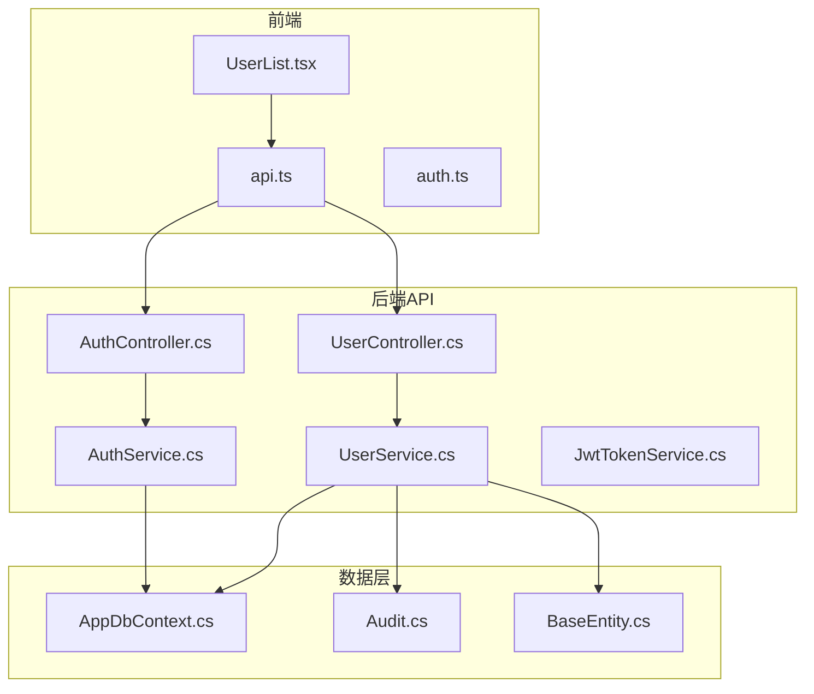
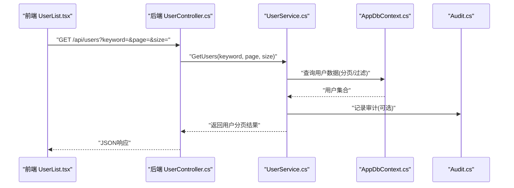
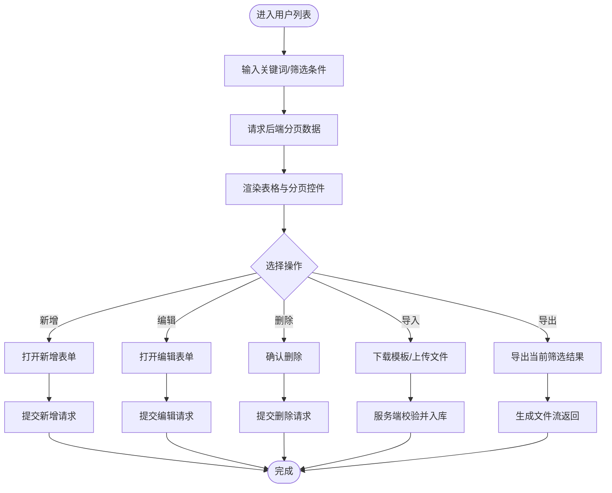
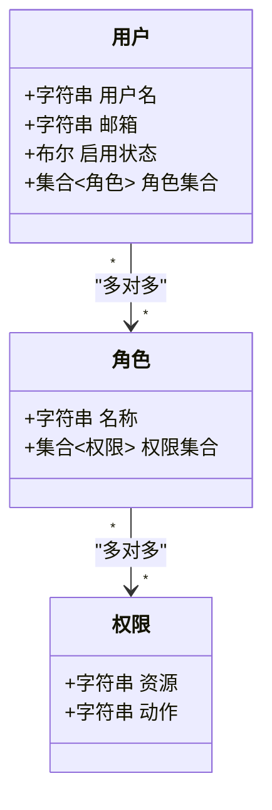
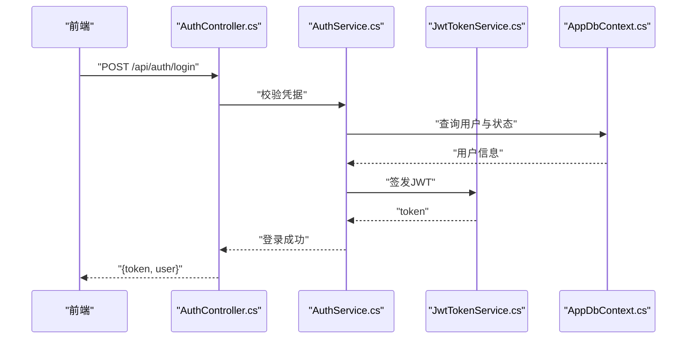
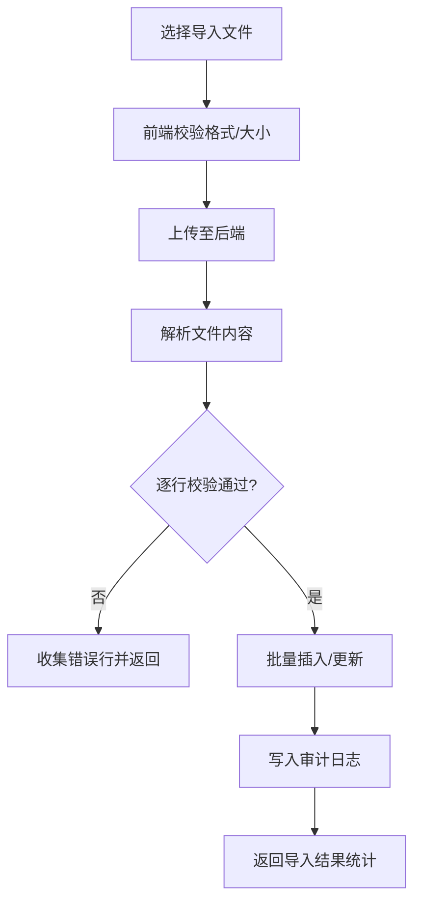
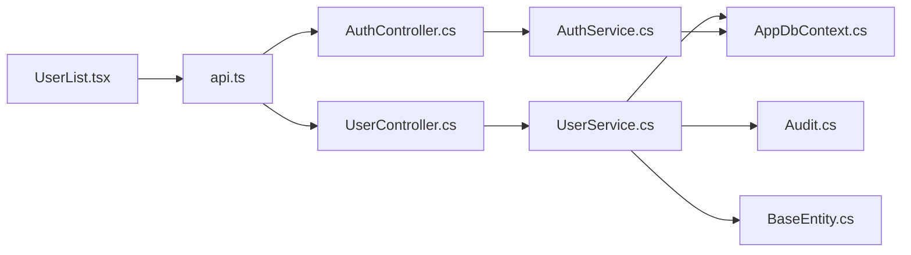

# 用户管理页面

<cite>
**本文引用的文件**   
- [UserController.cs](file://dip-system/api/Controllers/UserController.cs)
- [UserService.cs](file://dip-system/api/Services/UserService.cs)
- [AuthController.cs](file://dip-system/api/Controllers/AuthController.cs)
- [AuthService.cs](file://dip-system/api/Services/AuthService.cs)
- [JwtTokenService.cs](file://dip-system/api/Services/JwtTokenService.cs)
- [AppDbContext.cs](file://dip-system/api/Data/AppDbContext.cs)
- [UserList.tsx](file://dip-system/frontend-web/src/pages/UserList.tsx)
- [api.ts](file://dip-system/frontend-web/src/lib/api.ts)
- [auth.ts](file://dip-system/frontend-web/src/lib/auth.ts)
- [Audit.cs](file://dip-system/api/Models/Audit.cs)
- [ApiResponse.cs](file://dip-system/api/Models/ApiResponse.cs)
- [BaseEntity.cs](file://dip-system/api/Models/BaseEntity.cs)
- [Program.cs](file://dip-system/api/Program.cs)
- [appsettings.json](file://dip-system/api/appsettings.json)
</cite>

## 目录
1. [简介](#简介)
2. [项目结构](#项目结构)
3. [核心组件](#核心组件)
4. [架构总览](#架构总览)
5. [详细组件分析](#详细组件分析)
6. [依赖关系分析](#依赖关系分析)
7. [性能考虑](#性能考虑)
8. [故障排查指南](#故障排查指南)
9. [结论](#结论)
10. [附录](#附录)

## 简介
本文件面向DIP系统的“用户管理页面”，从前后端实现角度，系统性说明用户列表的数据展示、CRUD操作与权限控制；并文档化用户角色分配、权限矩阵与访问控制策略。同时覆盖用户注册、激活、禁用、密码重置流程，以及搜索、批量导入导出、审计日志能力。最后给出用户组管理、部门架构与层级权限配置方法，以及用户行为监控与安全事件告警机制的实现建议。

## 项目结构
围绕用户管理功能，后端采用ASP.NET Core Web API（控制器+服务+数据模型+上下文），前端为React + Vite应用，通过REST接口交互。关键文件分布如下：
- 后端API层：UserController.cs、UserService.cs、AuthController.cs、AuthService.cs、JwtTokenService.cs
- 数据层：AppDbContext.cs、各实体模型（含Audit、BaseEntity等）
- 前端页面：UserList.tsx（用户列表页）、api.ts（HTTP封装）、auth.ts（认证状态）
- 配置与启动：Program.cs、appsettings.json

图表来源
- [UserController.cs](file://dip-system/api/Controllers/UserController.cs)
- [UserService.cs](file://dip-system/api/Services/UserService.cs)
- [AuthController.cs](file://dip-system/api/Controllers/AuthController.cs)
- [AuthService.cs](file://dip-system/api/Services/AuthService.cs)
- [JwtTokenService.cs](file://dip-system/api/Services/JwtTokenService.cs)
- [AppDbContext.cs](file://dip-system/api/Data/AppDbContext.cs)
- [UserList.tsx](file://dip-system/frontend-web/src/pages/UserList.tsx)
- [api.ts](file://dip-system/frontend-web/src/lib/api.ts)
- [auth.ts](file://dip-system/frontend-web/src/lib/auth.ts)
- [Audit.cs](file://dip-system/api/Models/Audit.cs)
- [BaseEntity.cs](file://dip-system/api/Models/BaseEntity.cs)

章节来源
- [Program.cs](file://dip-system/api/Program.cs)
- [appsettings.json](file://dip-system/api/appsettings.json)

## 核心组件
- 用户管理控制器与服务：提供用户查询、新增、修改、删除、启用/禁用、角色分配、批量导入导出、审计记录查询等能力。
- 认证与令牌服务：负责登录校验、JWT签发与验证、会话安全。
- 数据上下文与模型：定义用户、审计、基础实体等数据结构及数据库映射。
- 前端用户列表页：渲染表格、分页、搜索、批量操作、权限按钮显隐。

章节来源
- [UserController.cs](file://dip-system/api/Controllers/UserController.cs)
- [UserService.cs](file://dip-system/api/Services/UserService.cs)
- [AuthController.cs](file://dip-system/api/Controllers/AuthController.cs)
- [AuthService.cs](file://dip-system/api/Services/AuthService.cs)
- [JwtTokenService.cs](file://dip-system/api/Services/JwtTokenService.cs)
- [AppDbContext.cs](file://dip-system/api/Data/AppDbContext.cs)
- [UserList.tsx](file://dip-system/frontend-web/src/pages/UserList.tsx)
- [api.ts](file://dip-system/frontend-web/src/lib/api.ts)
- [auth.ts](file://dip-system/frontend-web/src/lib/auth.ts)

## 架构总览
用户管理页面的端到端调用链如下：
- 前端UserList.tsx通过api.ts发起REST请求（如获取用户列表、创建用户、更新用户、删除用户、导入导出、审计查询）。
- 后端UserController接收请求，鉴权通过后委托UserService执行业务逻辑。
- UserService与AppDbContext交互读写数据库，必要时写入Audit审计表。
- 认证相关请求由AuthController与AuthService处理，使用JwtTokenService生成和校验JWT。

图表来源
- [UserList.tsx](file://dip-system/frontend-web/src/pages/UserList.tsx)
- [api.ts](file://dip-system/frontend-web/src/lib/api.ts)
- [UserController.cs](file://dip-system/api/Controllers/UserController.cs)
- [UserService.cs](file://dip-system/api/Services/UserService.cs)
- [AppDbContext.cs](file://dip-system/api/Data/AppDbContext.cs)
- [Audit.cs](file://dip-system/api/Models/Audit.cs)

## 详细组件分析

### 用户列表与CRUD
- 数据展示：支持关键词搜索、分页、排序；前端表格列包含用户名、邮箱、角色、状态等字段。
- 创建用户：表单校验后提交到后端，后端进行唯一性校验、密码加密、默认角色分配、审计记录。
- 更新用户：支持编辑基本信息、角色变更、状态切换（启用/禁用）。
- 删除用户：软删除或硬删除策略需结合业务；建议保留审计记录。
- 批量导入导出：Excel/CSV模板下载、批量导入校验、错误行回传、进度提示。

章节来源
- [UserList.tsx](file://dip-system/frontend-web/src/pages/UserList.tsx)
- [api.ts](file://dip-system/frontend-web/src/lib/api.ts)
- [UserController.cs](file://dip-system/api/Controllers/UserController.cs)
- [UserService.cs](file://dip-system/api/Services/UserService.cs)

### 权限控制与角色分配
- 角色模型：系统内置管理员、普通用户、审计员等角色，可自定义扩展。
- 权限矩阵：按模块/资源/动作维度定义（如用户管理-查看/新增/编辑/删除/导入/导出/审计）。
- 访问控制：基于角色的访问控制（RBAC），在控制器或服务层校验当前用户角色是否具备所需权限。
- 前端权限：根据用户角色动态显示/隐藏操作按钮与菜单项。

章节来源
- [UserService.cs](file://dip-system/api/Services/UserService.cs)
- [UserController.cs](file://dip-system/api/Controllers/UserController.cs)
- [Audit.cs](file://dip-system/api/Models/Audit.cs)
- [BaseEntity.cs](file://dip-system/api/Models/BaseEntity.cs)

### 认证、注册、激活、禁用与密码重置
- 登录：用户名/邮箱+密码校验，成功后签发JWT，前端保存token并在后续请求头携带。
- 注册：新用户注册流程（若开放），包括邮箱验证、激活链接发送、激活有效期。
- 激活：点击激活链接后更新用户状态为已激活。
- 禁用：管理员可将用户设为禁用，禁止登录与访问。
- 密码重置：支持忘记密码流程，生成一次性重置令牌，设置新密码后失效。

图表来源
- [AuthController.cs](file://dip-system/api/Controllers/AuthController.cs)
- [AuthService.cs](file://dip-system/api/Services/AuthService.cs)
- [JwtTokenService.cs](file://dip-system/api/Services/JwtTokenService.cs)
- [AppDbContext.cs](file://dip-system/api/Data/AppDbContext.cs)

章节来源
- [AuthController.cs](file://dip-system/api/Controllers/AuthController.cs)
- [AuthService.cs](file://dip-system/api/Services/AuthService.cs)
- [JwtTokenService.cs](file://dip-system/api/Services/JwtTokenService.cs)

### 搜索、批量导入导出与审计日志
- 搜索：支持用户名、邮箱、角色等多字段模糊匹配与组合筛选。
- 批量导入：模板下载、文件上传、逐行校验、错误汇总、事务性入库。
- 导出：按当前筛选条件导出数据为Excel/CSV，支持大文件流式输出。
- 审计日志：记录关键操作（增删改、登录、角色变更、状态切换），便于追溯与合规。

图表来源
- [UserService.cs](file://dip-system/api/Services/UserService.cs)
- [Audit.cs](file://dip-system/api/Models/Audit.cs)

章节来源
- [UserService.cs](file://dip-system/api/Services/UserService.cs)
- [Audit.cs](file://dip-system/api/Models/Audit.cs)

### 用户组管理与部门架构、层级权限
- 用户组：将用户归入不同组（如生产组、质检组、管理层），组内共享角色与权限集。
- 部门架构：树形部门结构，用户归属部门，支持按部门范围授权。
- 层级权限：上级部门可继承下级权限，或按策略限制跨部门访问。
- 配置方法：在后台维护用户组与部门树，为用户分配组与部门，并通过权限矩阵控制资源访问。

章节来源
- [UserService.cs](file://dip-system/api/Services/UserService.cs)
- [UserController.cs](file://dip-system/api/Controllers/UserController.cs)

### 用户行为监控与安全事件告警
- 行为监控：记录登录失败、频繁锁定、异常IP、越权尝试等行为指标。
- 安全事件：集中采集审计日志，触发阈值告警（如连续失败、非工作时间登录）。
- 告警渠道：邮件、短信、站内消息或集成外部告警平台。
- 可视化：仪表盘展示安全事件趋势、高风险用户TopN、热点操作分布。

章节来源
- [Audit.cs](file://dip-system/api/Models/Audit.cs)
- [UserService.cs](file://dip-system/api/Services/UserService.cs)

## 依赖关系分析
- 控制器依赖服务：UserController依赖UserService，AuthController依赖AuthService。
- 服务依赖数据层：UserService与AuthService通过AppDbContext访问数据库。
- 模型依赖：用户、角色、权限、审计等实体通过EF Core映射到数据库。
- 前端依赖：UserList.tsx依赖api.ts与auth.ts进行网络请求与认证状态管理。

图表来源
- [UserList.tsx](file://dip-system/frontend-web/src/pages/UserList.tsx)
- [api.ts](file://dip-system/frontend-web/src/lib/api.ts)
- [UserController.cs](file://dip-system/api/Controllers/UserController.cs)
- [UserService.cs](file://dip-system/api/Services/UserService.cs)
- [AuthController.cs](file://dip-system/api/Controllers/AuthController.cs)
- [AuthService.cs](file://dip-system/api/Services/AuthService.cs)
- [AppDbContext.cs](file://dip-system/api/Data/AppDbContext.cs)
- [Audit.cs](file://dip-system/api/Models/Audit.cs)
- [BaseEntity.cs](file://dip-system/api/Models/BaseEntity.cs)

章节来源
- [Program.cs](file://dip-system/api/Program.cs)
- [appsettings.json](file://dip-system/api/appsettings.json)

## 性能考虑
- 分页与索引：对用户列表查询建立合适索引（用户名、邮箱、状态），避免全表扫描。
- 批量导入：使用事务与分批提交，减少锁竞争与内存占用。
- 导出优化：流式输出大文件，避免一次性加载到内存。
- 缓存策略：对静态字典、角色权限等热点数据做短期缓存。
- 异步处理：耗时操作（如导入解析、报表生成）采用异步任务队列。

[本节为通用性能建议，不直接分析具体文件]

## 故障排查指南
- 登录失败：检查用户状态（是否禁用）、密码哈希、JWT配置（密钥、过期时间）。
- 权限不足：确认用户角色与权限矩阵配置是否正确，前端按钮显隐是否与后端校验一致。
- 导入失败：核对模板字段、数据类型、必填项；查看错误行明细与审计日志。
- 导出异常：检查筛选条件是否导致数据量过大，确认文件流输出路径与权限。
- 审计缺失：确认关键操作是否调用审计记录方法，数据库连接是否正常。

章节来源
- [AuthService.cs](file://dip-system/api/Services/AuthService.cs)
- [JwtTokenService.cs](file://dip-system/api/Services/JwtTokenService.cs)
- [UserService.cs](file://dip-system/api/Services/UserService.cs)
- [Audit.cs](file://dip-system/api/Models/Audit.cs)

## 结论
DIP系统的用户管理页面以清晰的职责分层与完善的权限控制为基础，实现了用户列表的展示与CRUD、角色与权限矩阵、认证与生命周期管理、搜索与批量导入导出、审计日志与行为监控等核心能力。通过合理的性能优化与故障排查策略，可保障系统在复杂业务场景下的稳定与高效。

[本节为总结性内容，不直接分析具体文件]

## 附录
- 术语表：RBAC（基于角色的访问控制）、JWT（JSON Web Token）、审计日志、权限矩阵、用户组、部门架构。
- 最佳实践：最小权限原则、操作留痕、敏感操作二次确认、定期审计与清理。

[本节为补充信息，不直接分析具体文件]