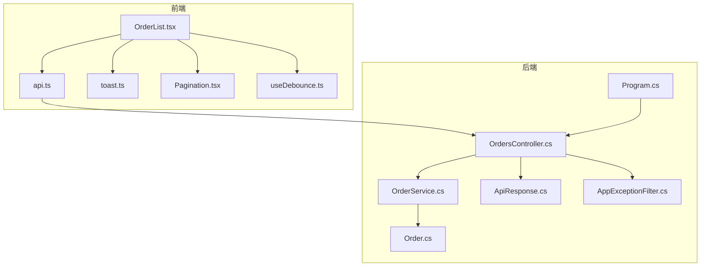
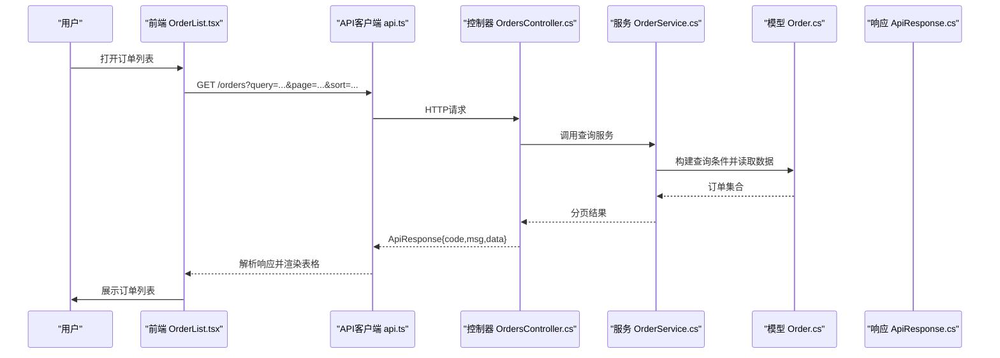
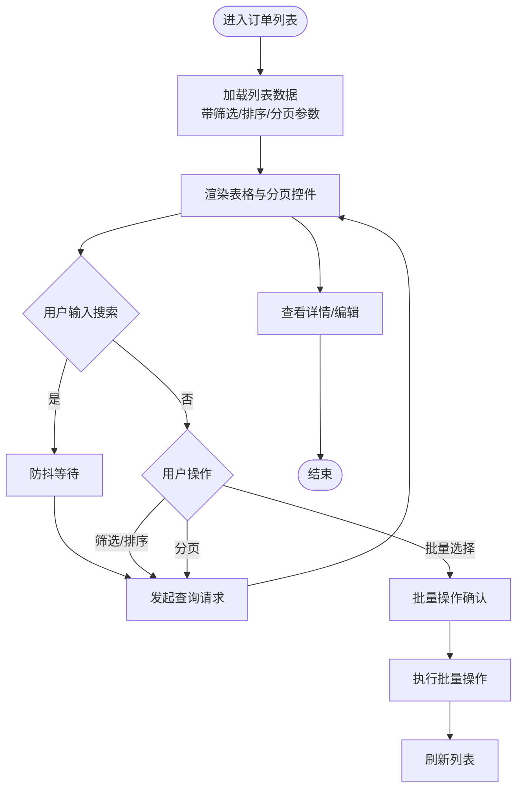
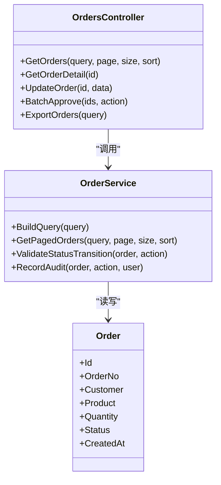
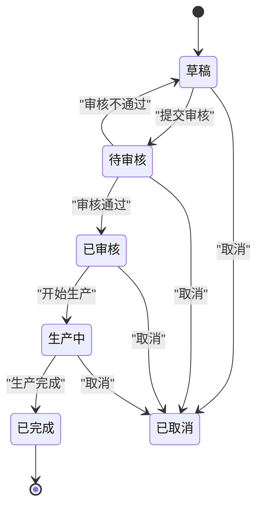
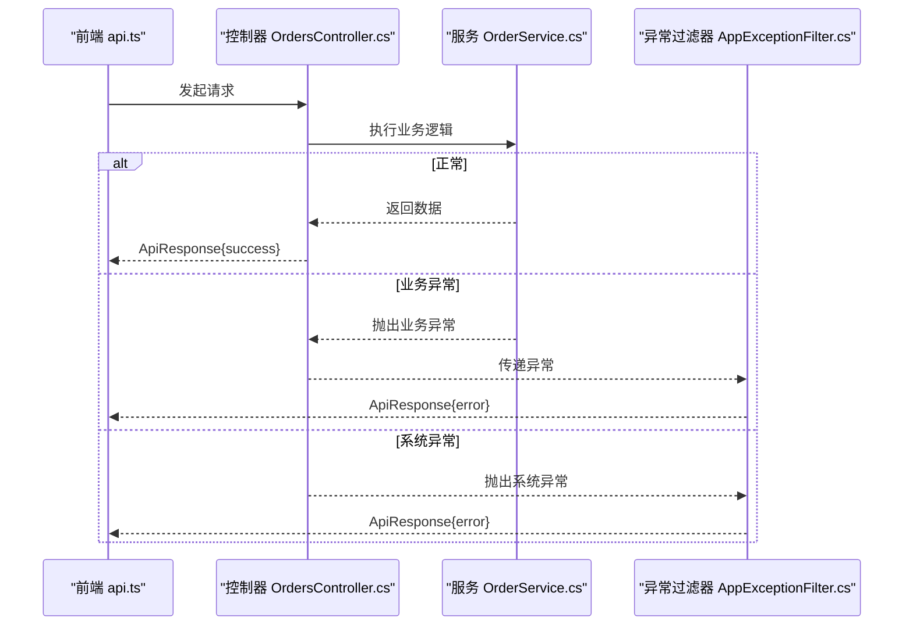
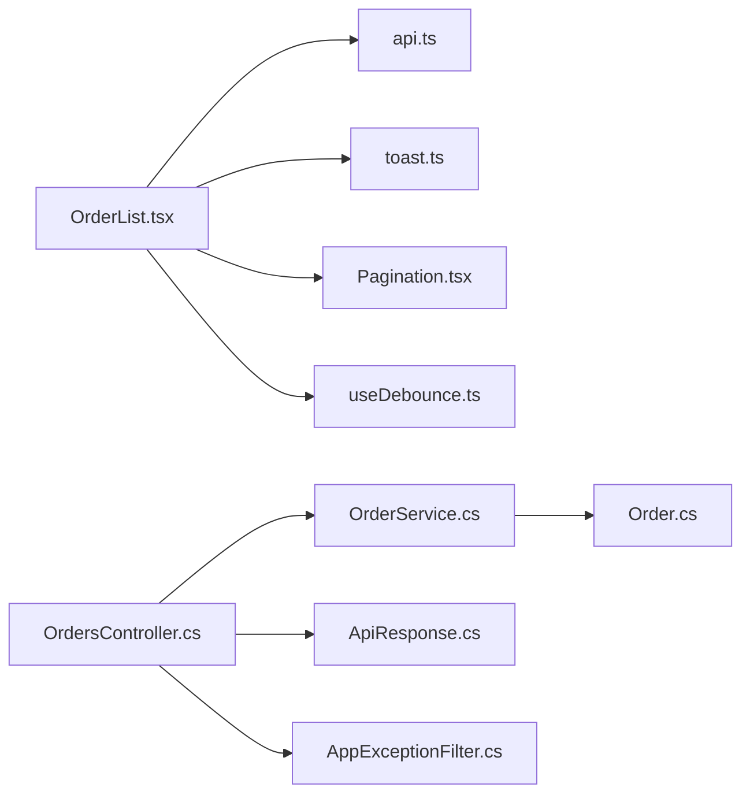

# 订单管理页面

<cite>
**本文引用的文件**   
- [OrdersController.cs](file://dip-system/api/Controllers/OrdersController.cs)
- [OrderService.cs](file://dip-system/api/Services/OrderService.cs)
- [Order.cs](file://dip-system/api/Models/Order.cs)
- [ApiResponse.cs](file://dip-system/api/Models/ApiResponse.cs)
- [AppExceptionFilter.cs](file://dip-system/api/Controllers/AppExceptionFilter.cs)
- [Program.cs](file://dip-system/api/Program.cs)
- [OrderList.tsx](file://dip-system/frontend-web/src/pages/OrderList.tsx)
- [api.ts](file://dip-system/frontend-web/src/lib/api.ts)
- [toast.ts](file://dip-system/frontend-web/src/lib/toast.ts)
- [Pagination.tsx](file://dip-system/frontend-web/src/lib/Pagination.tsx)
- [useDebounce.ts](file://dip-system/frontend-web/src/lib/useDebounce.ts)
</cite>

## 目录
1. [简介](#简介)
2. [项目结构](#项目结构)
3. [核心组件](#核心组件)
4. [架构总览](#架构总览)
5. [详细组件分析](#详细组件分析)
6. [依赖关系分析](#依赖关系分析)
7. [性能考虑](#性能考虑)
8. [故障排查指南](#故障排查指南)
9. [结论](#结论)
10. [附录](#附录)

## 简介
本文件面向DIP系统的“订单管理”页面，系统性说明订单列表的展示逻辑、状态管理与业务流程，覆盖订单查询、筛选、排序与批量处理；阐述订单状态流转、审批流程与通知机制；说明订单详情查看、编辑操作与版本历史；解释前后端交互模式、错误处理与重试策略；并提供导出、报表生成与数据分析的使用指南。文档兼顾技术实现与非技术读者理解，提供可视化图示与可操作的排障建议。

## 项目结构
订单管理功能横跨后端API控制器、服务层、数据模型以及前端页面与工具库：
- 后端
  - 控制器：OrdersController.cs 暴露订单相关REST接口（查询、详情、编辑、批量操作、导出等）。
  - 服务层：OrderService.cs 封装业务逻辑（查询条件组装、分页、状态校验、审批动作、审计记录等）。
  - 数据模型：Order.cs 定义订单实体字段、枚举及关联关系。
  - 通用响应：ApiResponse.cs 统一返回格式。
  - 异常过滤：AppExceptionFilter.cs 全局异常捕获与标准化错误响应。
  - 启动配置：Program.cs 注册中间件、路由与服务。
- 前端
  - 页面：OrderList.tsx 负责订单列表渲染、搜索、筛选、排序、分页、批量操作与导出入口。
  - API客户端：api.ts 封装HTTP请求、鉴权头、错误提示与重试策略。
  - 提示：toast.ts 用于成功/失败消息提示。
  - 分页：Pagination.tsx 通用分页控件。
  - 防抖：useDebounce.ts 用于搜索输入防抖。

**图表来源** 
- [OrdersController.cs](file://dip-system/api/Controllers/OrdersController.cs)
- [OrderService.cs](file://dip-system/api/Services/OrderService.cs)
- [Order.cs](file://dip-system/api/Models/Order.cs)
- [ApiResponse.cs](file://dip-system/api/Models/ApiResponse.cs)
- [AppExceptionFilter.cs](file://dip-system/api/Controllers/AppExceptionFilter.cs)
- [Program.cs](file://dip-system/api/Program.cs)
- [OrderList.tsx](file://dip-system/frontend-web/src/pages/OrderList.tsx)
- [api.ts](file://dip-system/frontend-web/src/lib/api.ts)
- [toast.ts](file://dip-system/frontend-web/src/lib/toast.ts)
- [Pagination.tsx](file://dip-system/frontend-web/src/lib/Pagination.tsx)
- [useDebounce.ts](file://dip-system/frontend-web/src/lib/useDebounce.ts)

**章节来源**
- [OrdersController.cs](file://dip-system/api/Controllers/OrdersController.cs)
- [OrderService.cs](file://dip-system/api/Services/OrderService.cs)
- [Order.cs](file://dip-system/api/Models/Order.cs)
- [ApiResponse.cs](file://dip-system/api/Models/ApiResponse.cs)
- [AppExceptionFilter.cs](file://dip-system/api/Controllers/AppExceptionFilter.cs)
- [Program.cs](file://dip-system/api/Program.cs)
- [OrderList.tsx](file://dip-system/frontend-web/src/pages/OrderList.tsx)
- [api.ts](file://dip-system/frontend-web/src/lib/api.ts)
- [toast.ts](file://dip-system/frontend-web/src/lib/toast.ts)
- [Pagination.tsx](file://dip-system/frontend-web/src/lib/Pagination.tsx)
- [useDebounce.ts](file://dip-system/frontend-web/src/lib/useDebounce.ts)

## 核心组件
- 订单列表页（OrderList.tsx）
  - 负责渲染订单表格、顶部筛选区、批量操作栏、分页控件。
  - 使用防抖输入优化搜索体验，结合分页控件触发查询。
  - 支持多选行进行批量操作（如批量审核、批量导出等），并在操作完成后刷新列表。
- API客户端（api.ts）
  - 统一发起GET/POST/PUT/DELETE请求，自动附加认证头。
  - 对网络错误与业务错误进行统一处理，调用toast提示用户。
  - 支持基础重试策略（如超时或临时网络错误时重试）。
- 控制器（OrdersController.cs）
  - 提供订单查询、详情、编辑、批量操作、导出等接口。
  - 参数校验、权限检查、调用服务层完成业务逻辑。
- 服务层（OrderService.cs）
  - 实现复杂查询条件拼装、分页、状态校验、审批动作执行、审计记录写入。
  - 与数据库交互，确保事务一致性与数据完整性。
- 数据模型（Order.cs）
  - 定义订单主表字段、状态枚举、关联子项（如明细、附件、审批记录等）。
- 统一响应（ApiResponse.cs）
  - 规范返回结构，包含状态码、消息、数据体等。
- 异常过滤器（AppExceptionFilter.cs）
  - 捕获未处理异常，转换为标准错误响应，避免泄露敏感信息。
- 启动配置（Program.cs）
  - 注册控制器、服务、中间件（如异常过滤、CORS、认证等）。

**章节来源**
- [OrderList.tsx](file://dip-system/frontend-web/src/pages/OrderList.tsx)
- [api.ts](file://dip-system/frontend-web/src/lib/api.ts)
- [OrdersController.cs](file://dip-system/api/Controllers/OrdersController.cs)
- [OrderService.cs](file://dip-system/api/Services/OrderService.cs)
- [Order.cs](file://dip-system/api/Models/Order.cs)
- [ApiResponse.cs](file://dip-system/api/Models/ApiResponse.cs)
- [AppExceptionFilter.cs](file://dip-system/api/Controllers/AppExceptionFilter.cs)
- [Program.cs](file://dip-system/api/Program.cs)

## 架构总览
订单管理采用典型的前后端分离架构：前端通过REST API与后端交互，控制器作为入口，服务层承载业务逻辑，数据模型映射数据库实体。异常过滤器统一处理异常，保证错误响应一致性。

**图表来源** 
- [OrderList.tsx](file://dip-system/frontend-web/src/pages/OrderList.tsx)
- [api.ts](file://dip-system/frontend-web/src/lib/api.ts)
- [OrdersController.cs](file://dip-system/api/Controllers/OrdersController.cs)
- [OrderService.cs](file://dip-system/api/Services/OrderService.cs)
- [Order.cs](file://dip-system/api/Models/Order.cs)
- [ApiResponse.cs](file://dip-system/api/Models/ApiResponse.cs)

## 详细组件分析

### 订单列表展示与交互（OrderList.tsx）
- 展示逻辑
  - 表格列包括订单号、客户、产品、数量、状态、创建时间等关键字段。
  - 支持按状态、日期范围、关键词等多维度筛选。
  - 支持多列排序（升序/降序），默认按创建时间倒序。
- 搜索与防抖
  - 使用防抖钩子减少频繁请求，提升用户体验。
- 分页
  - 使用通用分页组件，支持每页条数切换与跳转。
- 批量处理
  - 支持勾选多条订单进行批量操作（如批量审核、批量导出）。
  - 操作前二次确认，成功后刷新列表并提示。
- 详情与编辑
  - 点击行进入详情页，支持查看完整信息与版本历史。
  - 编辑操作受状态限制（如仅草稿或待审核可编辑）。

**图表来源** 
- [OrderList.tsx](file://dip-system/frontend-web/src/pages/OrderList.tsx)
- [useDebounce.ts](file://dip-system/frontend-web/src/lib/useDebounce.ts)
- [Pagination.tsx](file://dip-system/frontend-web/src/lib/Pagination.tsx)

**章节来源**
- [OrderList.tsx](file://dip-system/frontend-web/src/pages/OrderList.tsx)
- [useDebounce.ts](file://dip-system/frontend-web/src/lib/useDebounce.ts)
- [Pagination.tsx](file://dip-system/frontend-web/src/lib/Pagination.tsx)

### 后端订单查询与分页（OrdersController.cs + OrderService.cs）
- 查询接口
  - 接收查询参数（关键词、状态、日期范围、排序字段与方向、页码与页大小）。
  - 参数校验与权限检查后调用服务层。
- 服务层逻辑
  - 动态拼装查询条件，支持模糊匹配与范围查询。
  - 分页计算与排序应用，返回统一响应格式。
- 性能优化
  - 合理使用索引字段（如订单号、状态、创建时间）。
  - 避免N+1查询，按需加载关联数据。

**图表来源** 
- [OrdersController.cs](file://dip-system/api/Controllers/OrdersController.cs)
- [OrderService.cs](file://dip-system/api/Services/OrderService.cs)
- [Order.cs](file://dip-system/api/Models/Order.cs)

**章节来源**
- [OrdersController.cs](file://dip-system/api/Controllers/OrdersController.cs)
- [OrderService.cs](file://dip-system/api/Services/OrderService.cs)
- [Order.cs](file://dip-system/api/Models/Order.cs)

### 订单状态流转与审批流程
- 状态定义
  - 常见状态包括：草稿、待审核、已审核、生产中、已完成、已取消等。
- 流转规则
  - 草稿→待审核：提交审核。
  - 待审核→已审核：审核通过；或退回至草稿。
  - 已审核→生产中：生产开始。
  - 生产中→已完成：生产完成。
  - 任意状态→已取消：管理员或特定角色可取消。
- 审批动作
  - 控制器接收审批请求，服务层校验状态合法性与用户权限。
  - 更新订单状态并记录审计日志。

**图表来源** 
- [OrderService.cs](file://dip-system/api/Services/OrderService.cs)
- [Order.cs](file://dip-system/api/Models/Order.cs)

**章节来源**
- [OrderService.cs](file://dip-system/api/Services/OrderService.cs)
- [Order.cs](file://dip-system/api/Models/Order.cs)

### 通知机制
- 前端提示
  - 使用toast组件显示成功/失败消息，提升用户反馈及时性。
- 后端通知（可选扩展）
  - 可通过消息队列或邮件/短信服务发送审批结果通知。
  - 当前实现以界面提示为主，后续可扩展异步通知。

**章节来源**
- [toast.ts](file://dip-system/frontend-web/src/lib/toast.ts)

### 订单详情查看、编辑与版本历史
- 详情查看
  - 展示订单主信息与明细、附件、审批记录等。
- 编辑操作
  - 根据状态限制编辑权限（如仅草稿或待审核可编辑）。
  - 保存前进行数据校验，成功后刷新详情。
- 版本历史
  - 每次关键操作（提交、审核、变更）生成版本记录，便于追溯。

**章节来源**
- [OrderList.tsx](file://dip-system/frontend-web/src/pages/OrderList.tsx)
- [OrderService.cs](file://dip-system/api/Services/OrderService.cs)

### 与后端API的交互模式、错误处理与重试机制
- 交互模式
  - 前端通过api.ts发起REST请求，携带认证头与查询参数。
  - 控制器返回统一ApiResponse格式。
- 错误处理
  - 网络错误：重试或提示用户检查网络。
  - 业务错误：根据状态码与消息提示用户。
  - 全局异常：由AppExceptionFilter捕获并返回标准错误。
- 重试机制
  - 对超时或临时错误进行有限次重试，避免雪崩。

**图表来源** 
- [api.ts](file://dip-system/frontend-web/src/lib/api.ts)
- [OrdersController.cs](file://dip-system/api/Controllers/OrdersController.cs)
- [OrderService.cs](file://dip-system/api/Services/OrderService.cs)
- [AppExceptionFilter.cs](file://dip-system/api/Controllers/AppExceptionFilter.cs)

**章节来源**
- [api.ts](file://dip-system/frontend-web/src/lib/api.ts)
- [OrdersController.cs](file://dip-system/api/Controllers/OrdersController.cs)
- [OrderService.cs](file://dip-system/api/Services/OrderService.cs)
- [AppExceptionFilter.cs](file://dip-system/api/Controllers/AppExceptionFilter.cs)

### 订单导出、报表生成与数据分析
- 导出功能
  - 支持按当前筛选条件导出Excel/CSV。
  - 大文件导出采用异步任务与下载链接方式。
- 报表生成
  - 基于订单数据生成统计报表（如按状态、客户、产品维度）。
  - 可使用第三方库（如QuestPDF）生成PDF报表。
- 数据分析
  - 提供关键指标（订单量、完成率、平均处理时长）可视化图表。
  - 支持自定义时间段与维度组合。

**章节来源**
- [OrdersController.cs](file://dip-system/api/Controllers/OrdersController.cs)
- [OrderService.cs](file://dip-system/api/Services/OrderService.cs)

## 依赖关系分析
- 前端依赖
  - OrderList.tsx 依赖 api.ts、toast.ts、Pagination.tsx、useDebounce.ts。
- 后端依赖
  - OrdersController.cs 依赖 OrderService.cs、ApiResponse.cs、AppExceptionFilter.cs。
  - OrderService.cs 依赖 Order.cs 与数据库上下文。
- 外部依赖
  - 认证中间件、CORS、日志框架等由Program.cs注册。

**图表来源** 
- [OrderList.tsx](file://dip-system/frontend-web/src/pages/OrderList.tsx)
- [api.ts](file://dip-system/frontend-web/src/lib/api.ts)
- [toast.ts](file://dip-system/frontend-web/src/lib/toast.ts)
- [Pagination.tsx](file://dip-system/frontend-web/src/lib/Pagination.tsx)
- [useDebounce.ts](file://dip-system/frontend-web/src/lib/useDebounce.ts)
- [OrdersController.cs](file://dip-system/api/Controllers/OrdersController.cs)
- [OrderService.cs](file://dip-system/api/Services/OrderService.cs)
- [Order.cs](file://dip-system/api/Models/Order.cs)
- [ApiResponse.cs](file://dip-system/api/Models/ApiResponse.cs)
- [AppExceptionFilter.cs](file://dip-system/api/Controllers/AppExceptionFilter.cs)

**章节来源**
- [OrderList.tsx](file://dip-system/frontend-web/src/pages/OrderList.tsx)
- [api.ts](file://dip-system/frontend-web/src/lib/api.ts)
- [toast.ts](file://dip-system/frontend-web/src/lib/toast.ts)
- [Pagination.tsx](file://dip-system/frontend-web/src/lib/Pagination.tsx)
- [useDebounce.ts](file://dip-system/frontend-web/src/lib/useDebounce.ts)
- [OrdersController.cs](file://dip-system/api/Controllers/OrdersController.cs)
- [OrderService.cs](file://dip-system/api/Services/OrderService.cs)
- [Order.cs](file://dip-system/api/Models/Order.cs)
- [ApiResponse.cs](file://dip-system/api/Models/ApiResponse.cs)
- [AppExceptionFilter.cs](file://dip-system/api/Controllers/AppExceptionFilter.cs)

## 性能考虑
- 前端
  - 使用防抖减少重复请求。
  - 分页加载避免一次性渲染大量数据。
  - 懒加载详情与附件。
- 后端
  - 合理设计索引，优化查询性能。
  - 避免N+1查询，使用JOIN或预加载。
  - 大文件导出采用异步任务，避免阻塞请求。
- 缓存
  - 对字典数据（如状态、客户）进行缓存。
  - 热点查询结果短期缓存。

[本节为通用指导，无需引用具体文件]

## 故障排查指南
- 常见问题
  - 列表无数据：检查筛选条件、网络连通性、后端接口返回。
  - 审批失败：核对状态流转规则与用户权限。
  - 导出失败：检查文件大小与异步任务状态。
- 调试步骤
  - 前端：打开浏览器开发者工具，查看网络请求与错误消息。
  - 后端：查看日志与异常过滤器返回的错误信息。
  - 数据库：检查索引与慢查询日志。

**章节来源**
- [AppExceptionFilter.cs](file://dip-system/api/Controllers/AppExceptionFilter.cs)
- [api.ts](file://dip-system/frontend-web/src/lib/api.ts)

## 结论
订单管理页面通过清晰的前后端分层与统一的错误处理机制，实现了高效的订单查询、筛选、排序与批量处理能力。状态流转与审批流程严谨可控，配合通知与版本历史保障可追溯性。导出与报表功能满足数据分析需求。建议在后续迭代中进一步优化性能与扩展通知渠道。

[本节为总结性内容，无需引用具体文件]

## 附录
- 术语表
  - 订单：指生产或采购相关的业务单据。
  - 状态流转：订单在不同业务阶段的状态变化过程。
  - 审批：对订单进行校验与批准的操作。
- 参考文件
  - 控制器、服务、模型、前端页面与工具库的具体实现路径见“本文引用的文件”。

[本节为补充信息，无需引用具体文件]