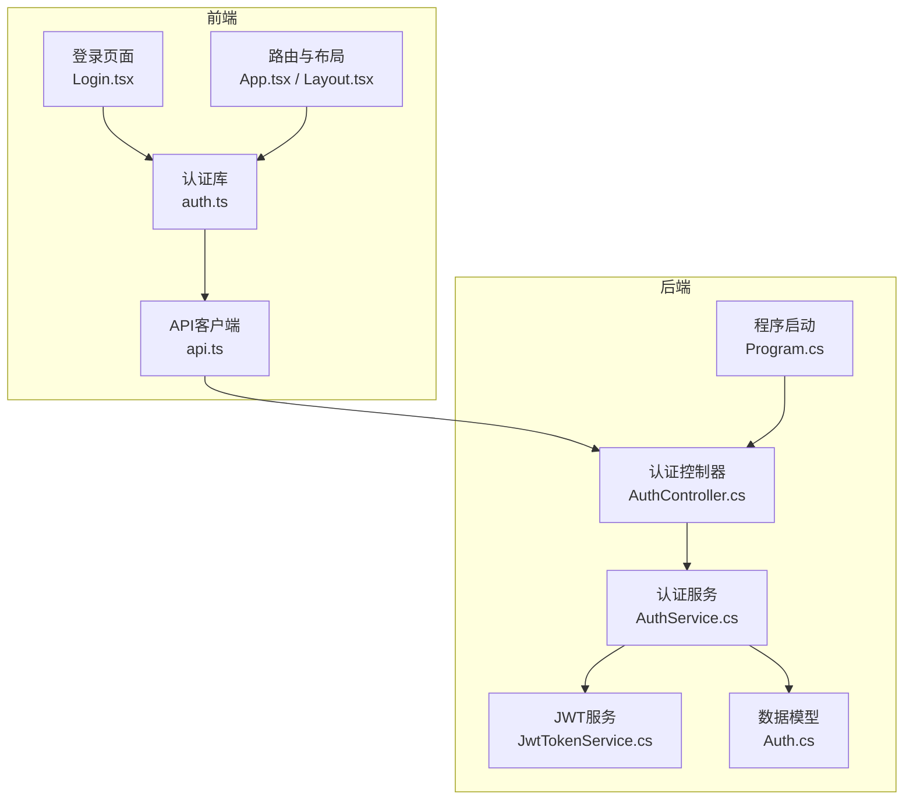
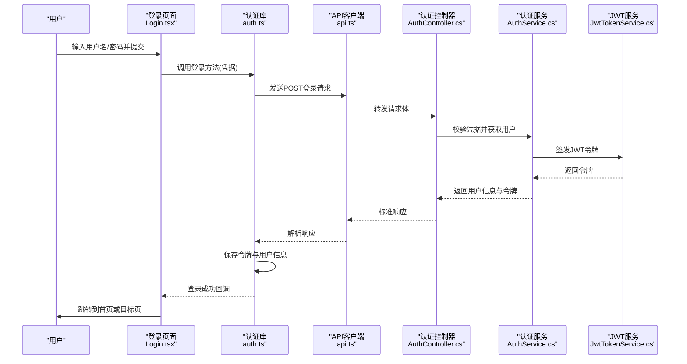
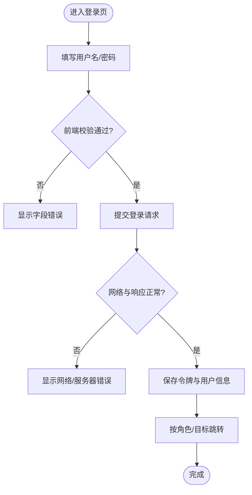
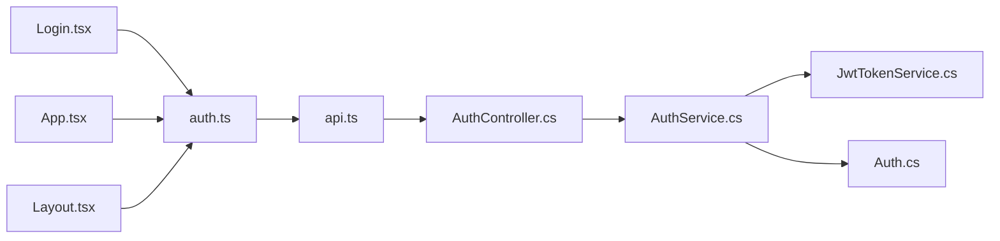

# 认证页面

<cite>
**本文引用的文件**
- [AuthController.cs](file://dip-system/api/Controllers/AuthController.cs)
- [AuthService.cs](file://dip-system/api/Services/AuthService.cs)
- [JwtTokenService.cs](file://dip-system/api/Services/JwtTokenService.cs)
- [Auth.cs](file://dip-system/api/Models/Auth.cs)
- [Program.cs](file://dip-system/api/Program.cs)
- [Login.tsx](file://dip-system/frontend-web/src/pages/Login.tsx)
- [auth.ts](file://dip-system/frontend-web/src/lib/auth.ts)
- [api.ts](file://dip-system/frontend-web/src/lib/api.ts)
- [App.tsx](file://dip-system/frontend-web/src/App.tsx)
- [Layout.tsx](file://dip-system/frontend-web/src/pages/Layout.tsx)
</cite>

## 目录
1. [简介](#简介)
2. [项目结构](#项目结构)
3. [核心组件](#核心组件)
4. [架构总览](#架构总览)
5. [详细组件分析](#详细组件分析)
6. [依赖关系分析](#依赖关系分析)
7. [性能考虑](#性能考虑)
8. [故障排查指南](#故障排查指南)
9. [结论](#结论)
10. [附录](#附录)

## 简介
本文件面向DIP系统的认证相关页面与能力，覆盖登录页UI实现、表单验证与错误处理、JWT令牌管理、会话保持与自动登出、权限校验流程、路由守卫与角色控制、密码加密存储与安全最佳实践、防暴力破解措施，以及多语言支持与无障碍访问兼容性。文档以代码为依据，提供端到端的调用链路与关键实现要点说明，帮助开发者快速理解并安全扩展认证功能。

## 项目结构
认证能力横跨前后端：
- 后端（ASP.NET Core）
  - 控制器：认证入口与接口定义
  - 服务：业务逻辑、JWT签发与校验、用户信息处理
  - 模型：请求/响应数据结构
  - 程序启动：中间件注册、授权策略配置
- 前端（React + TypeScript）
  - 登录页面：表单渲染、本地校验、交互反馈
  - 认证库：令牌存取、拦截器注入、鉴权状态管理
  - API封装：统一请求、错误处理、重试与超时
  - 路由与布局：受保护路由、角色守卫、布局壳

图表来源
- [Login.tsx](file://dip-system/frontend-web/src/pages/Login.tsx)
- [auth.ts](file://dip-system/frontend-web/src/lib/auth.ts)
- [api.ts](file://dip-system/frontend-web/src/lib/api.ts)
- [App.tsx](file://dip-system/frontend-web/src/App.tsx)
- [Layout.tsx](file://dip-system/frontend-web/src/pages/Layout.tsx)
- [AuthController.cs](file://dip-system/api/Controllers/AuthController.cs)
- [AuthService.cs](file://dip-system/api/Services/AuthService.cs)
- [JwtTokenService.cs](file://dip-system/api/Services/JwtTokenService.cs)
- [Auth.cs](file://dip-system/api/Models/Auth.cs)
- [Program.cs](file://dip-system/api/Program.cs)

章节来源
- [AuthController.cs](file://dip-system/api/Controllers/AuthController.cs)
- [AuthService.cs](file://dip-system/api/Services/AuthService.cs)
- [JwtTokenService.cs](file://dip-system/api/Services/JwtTokenService.cs)
- [Auth.cs](file://dip-system/api/Models/Auth.cs)
- [Program.cs](file://dip-system/api/Program.cs)
- [Login.tsx](file://dip-system/frontend-web/src/pages/Login.tsx)
- [auth.ts](file://dip-system/frontend-web/src/lib/auth.ts)
- [api.ts](file://dip-system/frontend-web/src/lib/api.ts)
- [App.tsx](file://dip-system/frontend-web/src/App.tsx)
- [Layout.tsx](file://dip-system/frontend-web/src/pages/Layout.tsx)

## 核心组件
- 登录页面（Login.tsx）
  - 负责用户名/密码输入、表单校验、提交加载态、错误提示、成功后跳转
  - 通过认证库保存令牌并触发路由跳转
- 认证库（auth.ts）
  - 封装令牌获取、持久化（内存/本地存储）、清除、当前用户信息读取
  - 暴露鉴权状态与守卫方法
- API客户端（api.ts）
  - 统一请求封装，自动附加Authorization头，处理401重定向到登录
  - 错误码映射与用户友好提示
- 认证控制器（AuthController.cs）
  - 登录接口接收凭据，返回JWT与用户基本信息
  - 支持错误码与消息体标准化
- 认证服务（AuthService.cs）
  - 校验用户凭据、查询用户、生成JWT载荷
  - 集成密码校验与账户锁定策略
- JWT服务（JwtTokenService.cs）
  - 签发令牌、解析与校验、过期时间设置、密钥管理
- 数据模型（Auth.cs）
  - 登录请求/响应结构、用户信息字段
- 程序启动（Program.cs）
  - 注册认证中间件、授权策略、CORS、日志等

章节来源
- [Login.tsx](file://dip-system/frontend-web/src/pages/Login.tsx)
- [auth.ts](file://dip-system/frontend-web/src/lib/auth.ts)
- [api.ts](file://dip-system/frontend-web/src/lib/api.ts)
- [AuthController.cs](file://dip-system/api/Controllers/AuthController.cs)
- [AuthService.cs](file://dip-system/api/Services/AuthService.cs)
- [JwtTokenService.cs](file://dip-system/api/Services/JwtTokenService.cs)
- [Auth.cs](file://dip-system/api/Models/Auth.cs)
- [Program.cs](file://dip-system/api/Program.cs)

## 架构总览
认证流程从前端登录页发起，经API客户端携带凭据至后端控制器，控制器委托服务完成用户校验与JWT签发，随后前端保存令牌并在后续请求中自动附加。路由层根据令牌与角色进行访问控制。

图表来源
- [Login.tsx](file://dip-system/frontend-web/src/pages/Login.tsx)
- [auth.ts](file://dip-system/frontend-web/src/lib/auth.ts)
- [api.ts](file://dip-system/frontend-web/src/lib/api.ts)
- [AuthController.cs](file://dip-system/api/Controllers/AuthController.cs)
- [AuthService.cs](file://dip-system/api/Services/AuthService.cs)
- [JwtTokenService.cs](file://dip-system/api/Services/JwtTokenService.cs)

## 详细组件分析

### 登录页面（Login.tsx）
- UI实现
  - 表单字段：用户名、密码；按钮文案与占位符支持国际化键
  - 样式与布局：居中卡片式布局，适配移动端触控
  - 无障碍：为输入框设置aria-label与关联标签，确保屏幕阅读器可读
- 表单验证
  - 前端必填校验、长度限制、格式校验（如邮箱可选）
  - 错误提示即时显示，聚焦错误字段
- 错误处理
  - 网络异常、服务端错误码映射为用户友好消息
  - 失败时保留输入便于重试
- 成功流程
  - 调用认证库保存令牌与用户信息
  - 根据角色或目标URL跳转

图表来源
- [Login.tsx](file://dip-system/frontend-web/src/pages/Login.tsx)
- [auth.ts](file://dip-system/frontend-web/src/lib/auth.ts)
- [api.ts](file://dip-system/frontend-web/src/lib/api.ts)

章节来源
- [Login.tsx](file://dip-system/frontend-web/src/pages/Login.tsx)
- [auth.ts](file://dip-system/frontend-web/src/lib/auth.ts)
- [api.ts](file://dip-system/frontend-web/src/lib/api.ts)

### 认证库（auth.ts）
- 令牌管理
  - 获取/设置/清除JWT令牌
  - 将令牌写入内存状态与本地存储（可配置）
  - 提供isAuthenticated与currentUser读取
- 拦截器集成
  - 在请求前注入Authorization头
  - 对401响应触发登出与重定向
- 守卫函数
  - canAccess(role?)用于页面级权限判断
  - 与路由守卫配合实现受保护路由

章节来源
- [auth.ts](file://dip-system/frontend-web/src/lib/auth.ts)
- [api.ts](file://dip-system/frontend-web/src/lib/api.ts)

### API客户端（api.ts）
- 统一请求封装
  - 基础URL、超时、重试策略
  - 自动附加Authorization头
- 错误处理
  - 区分网络错误、业务错误、未授权
  - 统一错误提示与日志记录
- 401处理
  - 清空本地令牌与用户信息
  - 重定向到登录页并保留目标路径

章节来源
- [api.ts](file://dip-system/frontend-web/src/lib/api.ts)
- [auth.ts](file://dip-system/frontend-web/src/lib/auth.ts)

### 认证控制器（AuthController.cs）
- 登录接口
  - 接收用户名/密码，返回JWT与用户信息
  - 参数校验、空值检查、错误响应标准化
- 其他认证相关接口（如刷新、注销）
  - 根据需求扩展

章节来源
- [AuthController.cs](file://dip-system/api/Controllers/AuthController.cs)
- [Auth.cs](file://dip-system/api/Models/Auth.cs)

### 认证服务（AuthService.cs）
- 用户校验
  - 查询用户、比对密码（哈希比较）
  - 账户状态检查（启用/禁用/锁定）
- JWT签发
  - 构建用户声明（角色、ID、过期时间）
  - 调用JWT服务生成令牌
- 安全策略
  - 失败次数计数与临时锁定
  - 审计日志记录

章节来源
- [AuthService.cs](file://dip-system/api/Services/AuthService.cs)
- [Auth.cs](file://dip-system/api/Models/Auth.cs)
- [JwtTokenService.cs](file://dip-system/api/Services/JwtTokenService.cs)

### JWT服务（JwtTokenService.cs）
- 令牌签发
  - 算法选择（HS256/RS256）、密钥管理、过期策略
- 令牌校验
  - 验签、过期检查、颁发者校验
- 令牌刷新
  - 支持短期令牌+刷新机制（可选）

章节来源
- [JwtTokenService.cs](file://dip-system/api/Services/JwtTokenService.cs)

### 程序启动（Program.cs）
- 中间件注册
  - 认证中间件、授权策略、CORS、日志
- 策略配置
  - 基于角色的访问控制（RBAC）
  - 全局默认策略与局部覆盖

章节来源
- [Program.cs](file://dip-system/api/Program.cs)

### 路由与布局（App.tsx / Layout.tsx）
- 受保护路由
  - 根据认证状态与角色决定渲染内容
  - 未登录重定向到登录页并保留目标路径
- 布局壳
  - 导航栏、侧边栏、面包屑、用户菜单（含登出）

章节来源
- [App.tsx](file://dip-system/frontend-web/src/App.tsx)
- [Layout.tsx](file://dip-system/frontend-web/src/pages/Layout.tsx)

## 依赖关系分析
- 前端依赖
  - Login.tsx依赖auth.ts与api.ts
  - api.ts依赖浏览器环境与全局配置
  - App.tsx与Layout.tsx依赖auth.ts的鉴权状态
- 后端依赖
  - AuthController.cs依赖AuthService.cs与Auth.cs
  - AuthService.cs依赖JwtTokenService.cs与数据库访问（用户仓储）
  - Program.cs依赖所有服务与中间件注册

图表来源
- [Login.tsx](file://dip-system/frontend-web/src/pages/Login.tsx)
- [auth.ts](file://dip-system/frontend-web/src/lib/auth.ts)
- [api.ts](file://dip-system/frontend-web/src/lib/api.ts)
- [AuthController.cs](file://dip-system/api/Controllers/AuthController.cs)
- [AuthService.cs](file://dip-system/api/Services/AuthService.cs)
- [JwtTokenService.cs](file://dip-system/api/Services/JwtTokenService.cs)
- [Auth.cs](file://dip-system/api/Models/Auth.cs)
- [App.tsx](file://dip-system/frontend-web/src/App.tsx)
- [Layout.tsx](file://dip-system/frontend-web/src/pages/Layout.tsx)

章节来源
- [Login.tsx](file://dip-system/frontend-web/src/pages/Login.tsx)
- [auth.ts](file://dip-system/frontend-web/src/lib/auth.ts)
- [api.ts](file://dip-system/frontend-web/src/lib/api.ts)
- [AuthController.cs](file://dip-system/api/Controllers/AuthController.cs)
- [AuthService.cs](file://dip-system/api/Services/AuthService.cs)
- [JwtTokenService.cs](file://dip-system/api/Services/JwtTokenService.cs)
- [Auth.cs](file://dip-system/api/Models/Auth.cs)
- [App.tsx](file://dip-system/frontend-web/src/App.tsx)
- [Layout.tsx](file://dip-system/frontend-web/src/pages/Layout.tsx)

## 性能考虑
- 前端
  - 表单校验采用即时反馈与防抖，减少无效提交
  - 令牌缓存避免重复解析，降低CPU开销
  - 路由懒加载与按需加载页面组件
- 后端
  - JWT校验轻量高效，避免每次请求查库
  - 用户查询使用索引与分页，减少DB压力
  - 失败计数与锁定期限合理设置，避免频繁DB写操作

## 故障排查指南
- 登录失败
  - 检查前端表单校验与网络请求是否成功
  - 查看后端控制器与服务日志，确认用户是否存在与密码是否正确
  - 核对JWT密钥与过期时间配置
- 401未授权
  - 确认Authorization头是否正确附加
  - 检查令牌是否过期或被清理
  - 路由守卫是否正确判断角色
- 界面无响应
  - 检查API客户端错误处理与重试策略
  - 查看浏览器控制台与后端日志定位异常

章节来源
- [api.ts](file://dip-system/frontend-web/src/lib/api.ts)
- [AuthController.cs](file://dip-system/api/Controllers/AuthController.cs)
- [AuthService.cs](file://dip-system/api/Services/AuthService.cs)
- [JwtTokenService.cs](file://dip-system/api/Services/JwtTokenService.cs)

## 结论
DIP系统认证模块在前端与后端形成了清晰的职责边界与协作链路：前端专注用户体验与状态管理，后端保障安全与业务校验。通过JWT与路由守卫实现细粒度权限控制，结合错误处理与日志记录提升可维护性。建议在生产环境强化密钥管理、启用HTTPS、实施速率限制与审计日志，以满足企业级安全要求。

## 附录
- 安全最佳实践
  - 使用强随机密钥与合适的算法（推荐RS256）
  - 短生命周期令牌+刷新机制
  - HTTPS强制传输，防止中间人攻击
  - 密码哈希存储（bcrypt/argon2），禁止明文
  - 登录失败次数限制与账户锁定
  - 最小权限原则与角色分离
- 多语言支持
  - 前端文案使用i18n键，动态切换语言包
  - 错误消息与提示文本国际化
- 无障碍访问
  - 输入框与按钮具备语义化标签与ARIA属性
  - 键盘导航与焦点顺序合理
  - 颜色对比度符合WCAG标准