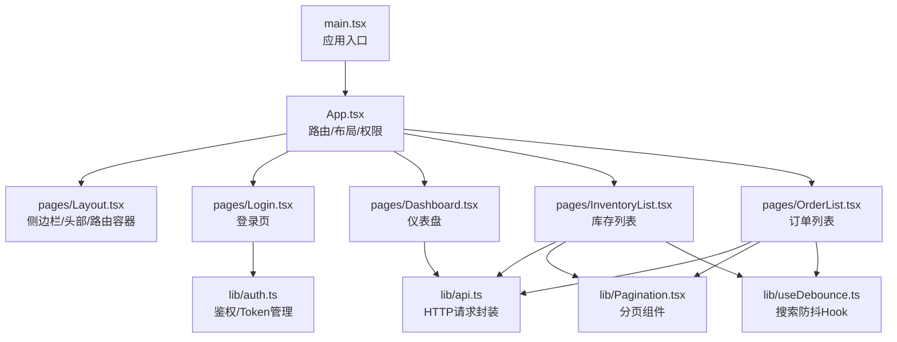
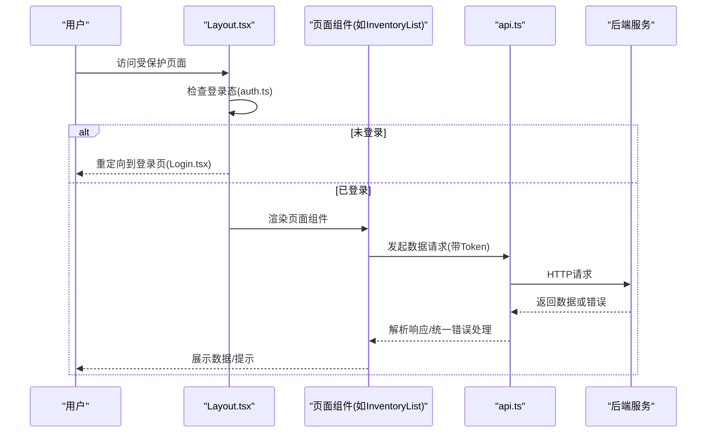
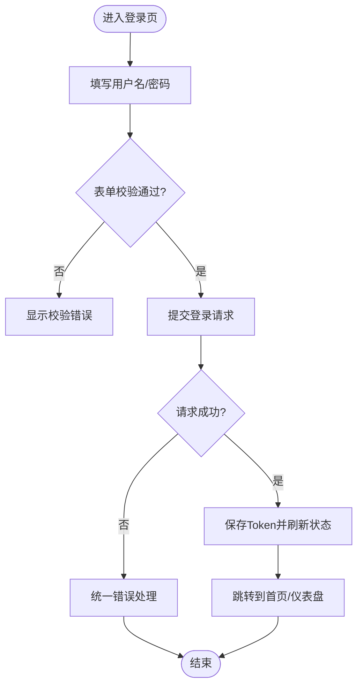
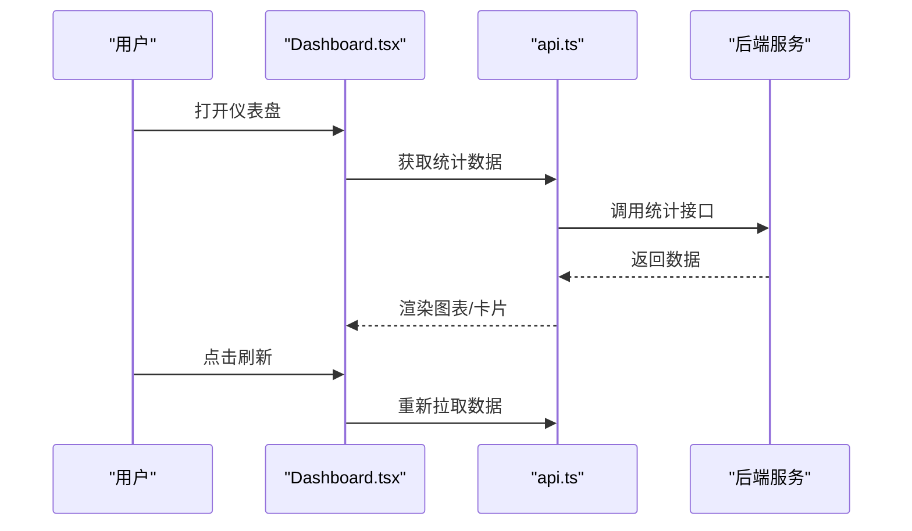
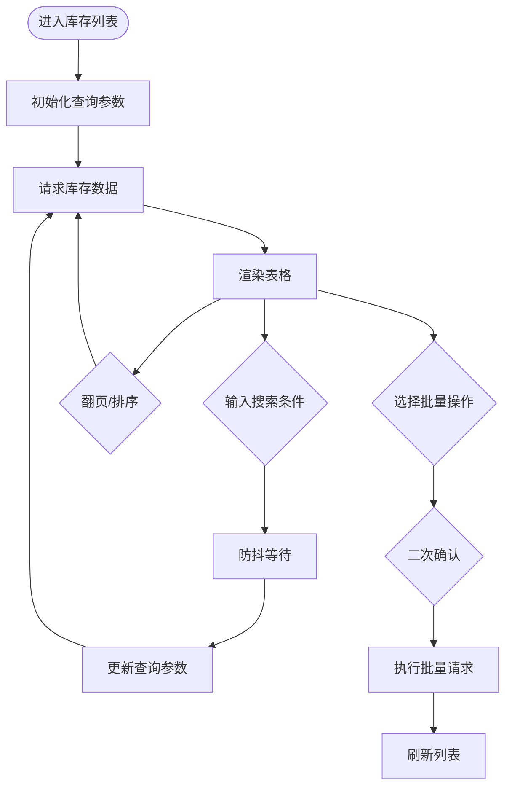
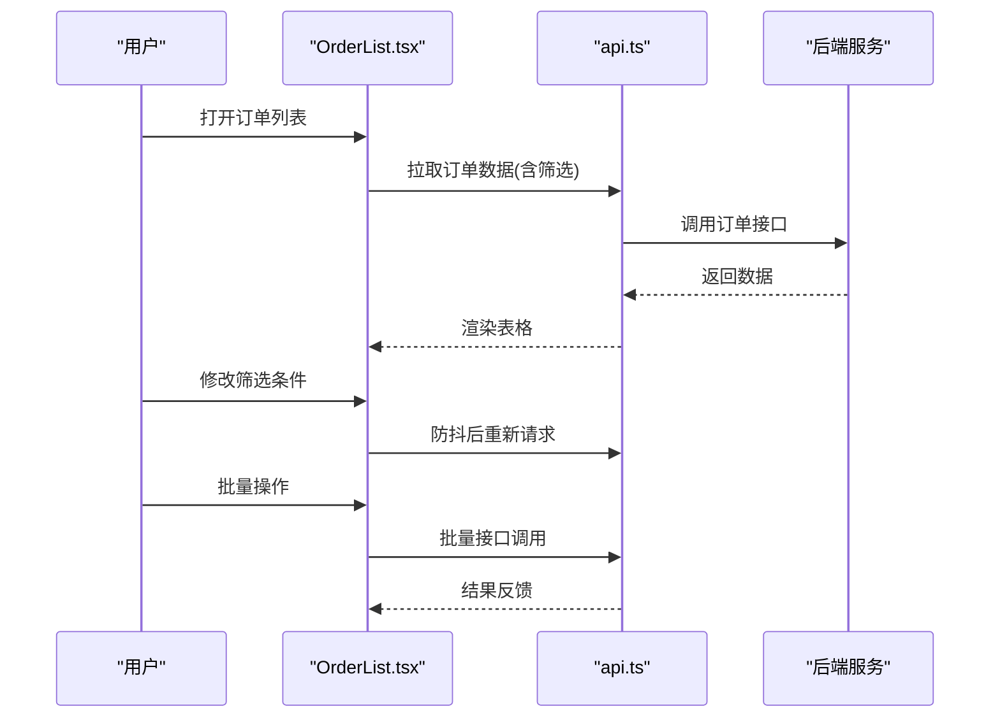
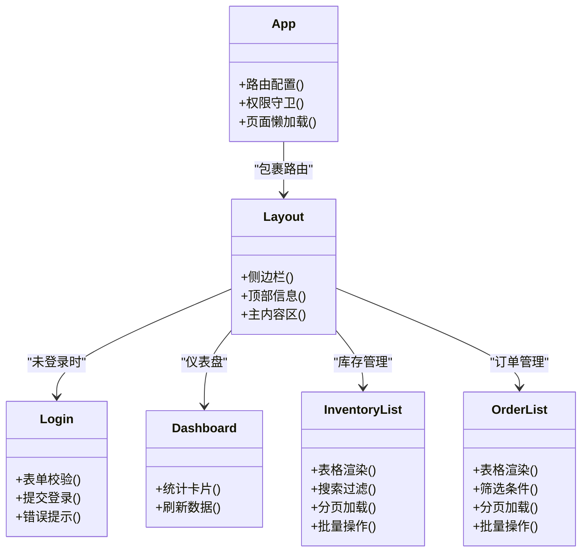
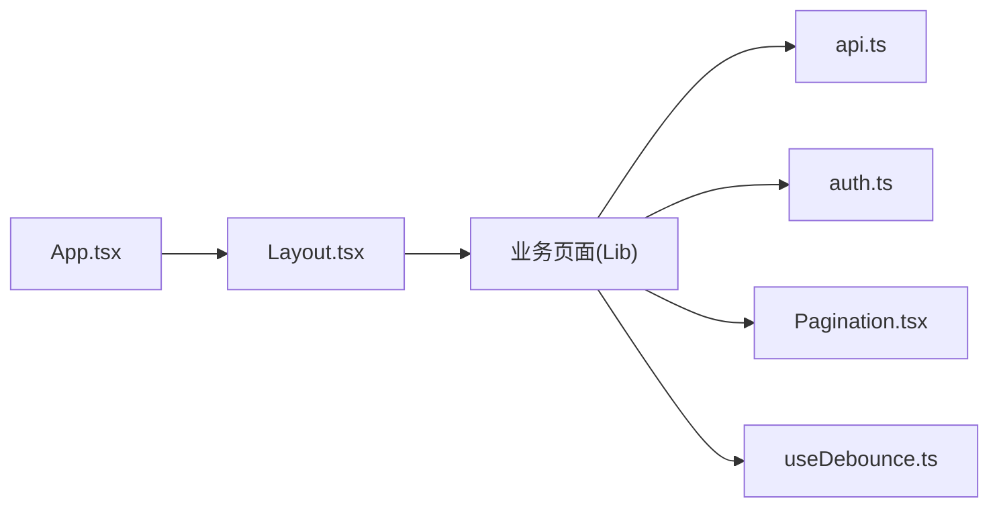

# 页面组件

<cite>
**本文引用的文件**   
- [frontend-web/src/App.tsx](file://dip-system/frontend-web/src/App.tsx)
- [frontend-web/src/main.tsx](file://dip-system/frontend-web/src/main.tsx)
- [frontend-web/src/pages/Layout.tsx](file://dip-system/frontend-web/src/pages/Layout.tsx)
- [frontend-web/src/pages/Login.tsx](file://dip-system/frontend-web/src/pages/Login.tsx)
- [frontend-web/src/pages/Dashboard.tsx](file://dip-system/frontend-web/src/pages/Dashboard.tsx)
- [frontend-web/src/pages/InventoryList.tsx](file://dip-system/frontend-web/src/pages/InventoryList.tsx)
- [frontend-web/src/pages/OrderList.tsx](file://dip-system/frontend-web/src/pages/OrderList.tsx)
- [frontend-web/src/lib/api.ts](file://dip-system/frontend-web/src/lib/api.ts)
- [frontend-web/src/lib/auth.ts](file://dip-system/frontend-web/src/lib/auth.ts)
- [frontend-web/src/lib/Pagination.tsx](file://dip-system/frontend-web/src/lib/Pagination.tsx)
- [frontend-web/src/lib/useDebounce.ts](file://dip-system/frontend-web/src/lib/useDebounce.ts)
- [frontend-web/package.json](file://dip-system/frontend-web/package.json)
- [frontend-web/vite.config.ts](file://dip-system/frontend-web/vite.config.ts)
</cite>

## 目录
1. [简介](#简介)
2. [项目结构](#项目结构)
3. [核心组件](#核心组件)
4. [架构总览](#架构总览)
5. [详细组件分析](#详细组件分析)
6. [依赖关系分析](#依赖关系分析)
7. [性能考虑](#性能考虑)
8. [故障排查指南](#故障排查指南)
9. [结论](#结论)
10. [附录](#附录)

## 简介
本文件面向DIP系统Web前端页面组件，聚焦仪表盘、登录页、库存管理、订单管理等核心页面的实现与使用。文档从系统架构、数据流、状态同步、表单处理、路由与权限控制、加载状态、表格与搜索过滤、批量操作、性能优化（懒加载、内存管理）等维度进行系统化说明，并提供开发规范与用户体验优化建议，帮助开发者快速理解并高效扩展页面功能。

## 项目结构
前端采用基于Vite的React+TypeScript工程组织方式，主要目录与职责如下：
- src/main.tsx：应用入口，初始化渲染与全局样式
- src/App.tsx：路由配置、布局容器、权限守卫与页面挂载
- src/pages/*：业务页面与通用布局（Layout、Login、Dashboard、InventoryList、OrderList等）
- src/lib/*：公共库（API封装、鉴权、分页、防抖等）
- package.json：依赖与脚本配置
- vite.config.ts：构建与代理配置

**图表来源** 
- [frontend-web/src/main.tsx](file://dip-system/frontend-web/src/main.tsx)
- [frontend-web/src/App.tsx](file://dip-system/frontend-web/src/App.tsx)
- [frontend-web/src/pages/Layout.tsx](file://dip-system/frontend-web/src/pages/Layout.tsx)
- [frontend-web/src/pages/Login.tsx](file://dip-system/frontend-web/src/pages/Login.tsx)
- [frontend-web/src/pages/Dashboard.tsx](file://dip-system/frontend-web/src/pages/Dashboard.tsx)
- [frontend-web/src/pages/InventoryList.tsx](file://dip-system/frontend-web/src/pages/InventoryList.tsx)
- [frontend-web/src/pages/OrderList.tsx](file://dip-system/frontend-web/src/pages/OrderList.tsx)
- [frontend-web/src/lib/api.ts](file://dip-system/frontend-web/src/lib/api.ts)
- [frontend-web/src/lib/auth.ts](file://dip-system/frontend-web/src/lib/auth.ts)
- [frontend-web/src/lib/Pagination.tsx](file://dip-system/frontend-web/src/lib/Pagination.tsx)
- [frontend-web/src/lib/useDebounce.ts](file://dip-system/frontend-web/src/lib/useDebounce.ts)

**章节来源**
- [frontend-web/src/main.tsx](file://dip-system/frontend-web/src/main.tsx)
- [frontend-web/src/App.tsx](file://dip-system/frontend-web/src/App.tsx)
- [frontend-web/package.json](file://dip-system/frontend-web/package.json)
- [frontend-web/vite.config.ts](file://dip-system/frontend-web/vite.config.ts)

## 核心组件
- 应用入口与路由
  - main.tsx负责创建根节点并渲染App组件
  - App.tsx集中定义路由、布局容器、权限校验与页面懒加载
- 布局与导航
  - Layout.tsx提供侧边栏、顶部信息区与主内容区，承载子路由页面
- 鉴权与Token
  - auth.ts封装登录态、Token存取与过期处理
- API层
  - api.ts统一封装HTTP请求、错误处理、拦截器与重试策略
- 通用UI与工具
  - Pagination.tsx为数据表格提供分页能力
  - useDebounce.ts用于搜索输入防抖，降低请求频率

**章节来源**
- [frontend-web/src/main.tsx](file://dip-system/frontend-web/src/main.tsx)
- [frontend-web/src/App.tsx](file://dip-system/frontend-web/src/App.tsx)
- [frontend-web/src/pages/Layout.tsx](file://dip-system/frontend-web/src/pages/Layout.tsx)
- [frontend-web/src/lib/auth.ts](file://dip-system/frontend-web/src/lib/auth.ts)
- [frontend-web/src/lib/api.ts](file://dip-system/frontend-web/src/lib/api.ts)
- [frontend-web/src/lib/Pagination.tsx](file://dip-system/frontend-web/src/lib/Pagination.tsx)
- [frontend-web/src/lib/useDebounce.ts](file://dip-system/frontend-web/src/lib/useDebounce.ts)

## 架构总览
整体采用“页面组件 + 公共库”的分层模式：
- 表现层：各页面组件（Login、Dashboard、InventoryList、OrderList等）
- 服务层：api.ts封装后端接口调用，auth.ts管理鉴权
- 基础设施：路由、布局、分页、防抖等通用能力

**图表来源** 
- [frontend-web/src/pages/Layout.tsx](file://dip-system/frontend-web/src/pages/Layout.tsx)
- [frontend-web/src/pages/Login.tsx](file://dip-system/frontend-web/src/pages/Login.tsx)
- [frontend-web/src/pages/InventoryList.tsx](file://dip-system/frontend-web/src/pages/InventoryList.tsx)
- [frontend-web/src/lib/api.ts](file://dip-system/frontend-web/src/lib/api.ts)
- [frontend-web/src/lib/auth.ts](file://dip-system/frontend-web/src/lib/auth.ts)

## 详细组件分析

### 登录页（Login）
- 功能要点
  - 用户名/密码表单校验
  - 提交后调用鉴权接口，成功后保存Token并跳转
  - 失败时显示错误提示
- 数据流
  - 表单状态本地维护，提交触发鉴权流程
  - 成功写入Token并更新路由
- 错误处理
  - 网络异常与业务错误统一提示
- 性能与体验
  - 提交按钮禁用防止重复提交
  - 错误消息即时反馈

**图表来源** 
- [frontend-web/src/pages/Login.tsx](file://dip-system/frontend-web/src/pages/Login.tsx)
- [frontend-web/src/lib/auth.ts](file://dip-system/frontend-web/src/lib/auth.ts)
- [frontend-web/src/lib/api.ts](file://dip-system/frontend-web/src/lib/api.ts)

**章节来源**
- [frontend-web/src/pages/Login.tsx](file://dip-system/frontend-web/src/pages/Login.tsx)
- [frontend-web/src/lib/auth.ts](file://dip-system/frontend-web/src/lib/auth.ts)
- [frontend-web/src/lib/api.ts](file://dip-system/frontend-web/src/lib/api.ts)

### 仪表盘（Dashboard）
- 功能要点
  - 关键指标概览（如库存总量、待处理订单数等）
  - 数据来源于后端统计接口
- 数据流
  - 页面加载时拉取统计数据，支持手动刷新
- 错误处理
  - 接口失败时降级展示空状态或重试按钮
- 性能与体验
  - 首次加载骨架屏，减少白屏感知
  - 定时刷新可配置开关

**图表来源** 
- [frontend-web/src/pages/Dashboard.tsx](file://dip-system/frontend-web/src/pages/Dashboard.tsx)
- [frontend-web/src/lib/api.ts](file://dip-system/frontend-web/src/lib/api.ts)

**章节来源**
- [frontend-web/src/pages/Dashboard.tsx](file://dip-system/frontend-web/src/pages/Dashboard.tsx)
- [frontend-web/src/lib/api.ts](file://dip-system/frontend-web/src/lib/api.ts)

### 库存管理（InventoryList）
- 功能要点
  - 数据表格展示库存明细
  - 搜索过滤（物料编码、名称、仓库等）
  - 分页加载与批量操作（导出、删除等）
- 数据流
  - 查询参数变化触发防抖请求
  - 分页切换与排序联动刷新
- 错误处理
  - 网络异常与业务错误统一提示
- 性能与体验
  - 搜索防抖减少请求
  - 虚拟滚动可选（大数据量场景）
  - 批量操作二次确认

**图表来源** 
- [frontend-web/src/pages/InventoryList.tsx](file://dip-system/frontend-web/src/pages/InventoryList.tsx)
- [frontend-web/src/lib/Pagination.tsx](file://dip-system/frontend-web/src/lib/Pagination.tsx)
- [frontend-web/src/lib/useDebounce.ts](file://dip-system/frontend-web/src/lib/useDebounce.ts)
- [frontend-web/src/lib/api.ts](file://dip-system/frontend-web/src/lib/api.ts)

**章节来源**
- [frontend-web/src/pages/InventoryList.tsx](file://dip-system/frontend-web/src/pages/InventoryList.tsx)
- [frontend-web/src/lib/Pagination.tsx](file://dip-system/frontend-web/src/lib/Pagination.tsx)
- [frontend-web/src/lib/useDebounce.ts](file://dip-system/frontend-web/src/lib/useDebounce.ts)
- [frontend-web/src/lib/api.ts](file://dip-system/frontend-web/src/lib/api.ts)

### 订单管理（OrderList）
- 功能要点
  - 订单列表展示与筛选（状态、时间范围、客户等）
  - 分页加载与批量操作（打印、导出、作废等）
  - 行内编辑或弹窗编辑（视业务需求）
- 数据流
  - 筛选条件变化触发防抖请求
  - 分页与排序联动刷新
- 错误处理
  - 统一错误提示与重试机制
- 性能与体验
  - 首屏骨架屏
  - 大列表虚拟滚动
  - 批量操作进度提示

**图表来源** 
- [frontend-web/src/pages/OrderList.tsx](file://dip-system/frontend-web/src/pages/OrderList.tsx)
- [frontend-web/src/lib/api.ts](file://dip-system/frontend-web/src/lib/api.ts)

**章节来源**
- [frontend-web/src/pages/OrderList.tsx](file://dip-system/frontend-web/src/pages/OrderList.tsx)
- [frontend-web/src/lib/api.ts](file://dip-system/frontend-web/src/lib/api.ts)

### 布局与路由（Layout & App）
- 布局
  - Layout.tsx提供侧边栏菜单、顶部信息与主内容区
  - 根据路由动态渲染页面组件
- 路由
  - App.tsx集中定义路由表，支持懒加载与权限守卫
- 权限控制
  - 未登录重定向至登录页
  - 角色/权限不足时隐藏或禁用菜单项

**图表来源** 
- [frontend-web/src/App.tsx](file://dip-system/frontend-web/src/App.tsx)
- [frontend-web/src/pages/Layout.tsx](file://dip-system/frontend-web/src/pages/Layout.tsx)
- [frontend-web/src/pages/Login.tsx](file://dip-system/frontend-web/src/pages/Login.tsx)
- [frontend-web/src/pages/Dashboard.tsx](file://dip-system/frontend-web/src/pages/Dashboard.tsx)
- [frontend-web/src/pages/InventoryList.tsx](file://dip-system/frontend-web/src/pages/InventoryList.tsx)
- [frontend-web/src/pages/OrderList.tsx](file://dip-system/frontend-web/src/pages/OrderList.tsx)

**章节来源**
- [frontend-web/src/App.tsx](file://dip-system/frontend-web/src/App.tsx)
- [frontend-web/src/pages/Layout.tsx](file://dip-system/frontend-web/src/pages/Layout.tsx)

## 依赖关系分析
- 模块耦合
  - 页面组件依赖api.ts与auth.ts，低耦合高内聚
  - 通用组件Pagination与useDebounce被多个页面复用
- 外部依赖
  - Vite构建与开发服务器
  - React生态（路由、状态管理按需引入）
- 潜在循环依赖
  - 避免页面组件直接引用其他页面组件，通过路由与布局解耦

**图表来源** 
- [frontend-web/src/App.tsx](file://dip-system/frontend-web/src/App.tsx)
- [frontend-web/src/pages/Layout.tsx](file://dip-system/frontend-web/src/pages/Layout.tsx)
- [frontend-web/src/lib/api.ts](file://dip-system/frontend-web/src/lib/api.ts)
- [frontend-web/src/lib/auth.ts](file://dip-system/frontend-web/src/lib/auth.ts)
- [frontend-web/src/lib/Pagination.tsx](file://dip-system/frontend-web/src/lib/Pagination.tsx)
- [frontend-web/src/lib/useDebounce.ts](file://dip-system/frontend-web/src/lib/useDebounce.ts)

**章节来源**
- [frontend-web/src/App.tsx](file://dip-system/frontend-web/src/App.tsx)
- [frontend-web/src/pages/Layout.tsx](file://dip-system/frontend-web/src/pages/Layout.tsx)
- [frontend-web/src/lib/api.ts](file://dip-system/frontend-web/src/lib/api.ts)
- [frontend-web/src/lib/auth.ts](file://dip-system/frontend-web/src/lib/auth.ts)
- [frontend-web/src/lib/Pagination.tsx](file://dip-system/frontend-web/src/lib/Pagination.tsx)
- [frontend-web/src/lib/useDebounce.ts](file://dip-system/frontend-web/src/lib/useDebounce.ts)

## 性能考虑
- 懒加载
  - 路由级代码分割，按需加载页面组件，减少首屏体积
- 请求优化
  - 搜索防抖减少无效请求
  - 接口缓存与重试策略提升稳定性
- 渲染优化
  - 大列表虚拟滚动，避免DOM过多导致卡顿
  - 骨架屏与占位图改善加载体验
- 内存管理
  - 组件卸载时清理定时器与事件监听
  - 避免在列表中使用不稳定key导致重复渲染
- 构建优化
  - 静态资源压缩与CDN部署
  - 按需引入第三方库，减少打包体积

[本节为通用指导，不直接分析具体文件]

## 故障排查指南
- 登录失败
  - 检查Token存储与有效期
  - 查看网络拦截器与错误码映射
- 数据加载异常
  - 核对接口路径与参数
  - 检查跨域与代理配置
- 表格渲染缓慢
  - 启用虚拟滚动
  - 减少不必要的重渲染（memo/useMemo）
- 权限问题
  - 确认路由守卫逻辑
  - 检查菜单权限配置

**章节来源**
- [frontend-web/src/lib/api.ts](file://dip-system/frontend-web/src/lib/api.ts)
- [frontend-web/src/lib/auth.ts](file://dip-system/frontend-web/src/lib/auth.ts)
- [frontend-web/src/App.tsx](file://dip-system/frontend-web/src/App.tsx)

## 结论
DIP系统Web前端以清晰的模块化与分层设计实现了仪表盘、登录、库存与订单等核心页面。通过统一的API封装、鉴权管理与通用组件，保证了良好的可维护性与扩展性。建议在后续迭代中持续优化性能（懒加载、虚拟滚动、缓存）、完善权限模型与错误处理，以提升用户体验与系统稳定性。

[本节为总结性内容，不直接分析具体文件]

## 附录
- 开发规范
  - 组件命名与目录结构保持一致
  - 表单校验与错误提示统一化
  - 接口错误码与用户提示映射清晰
- 用户体验优化
  - 关键操作二次确认
  - 长耗时操作提供进度反馈
  - 空状态与错误状态友好提示

[本节为通用指导，不直接分析具体文件]