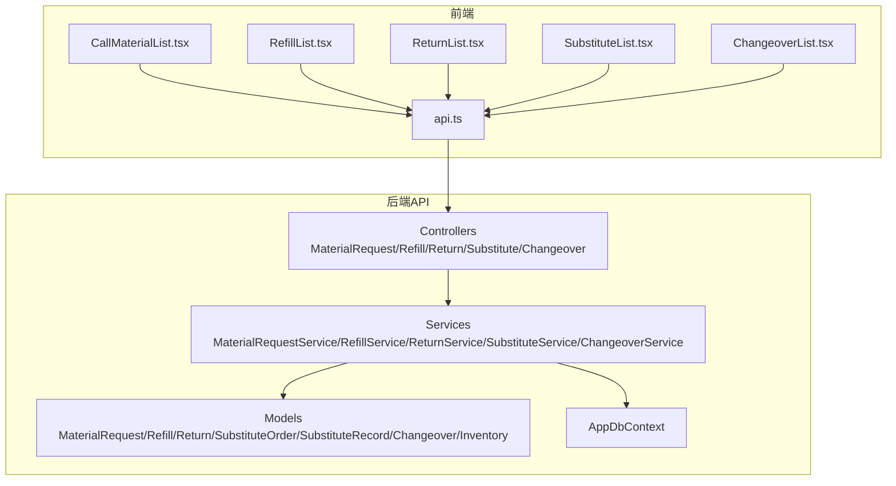
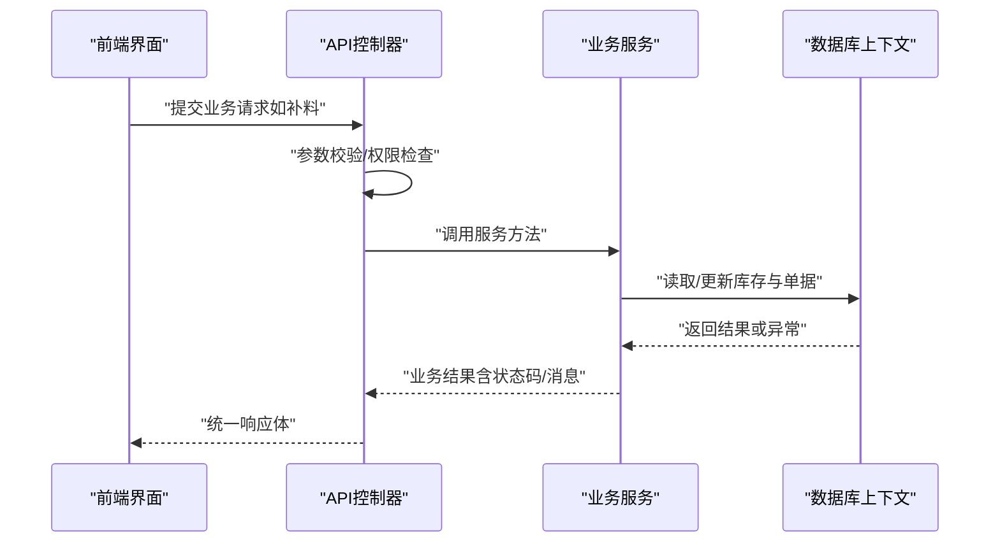
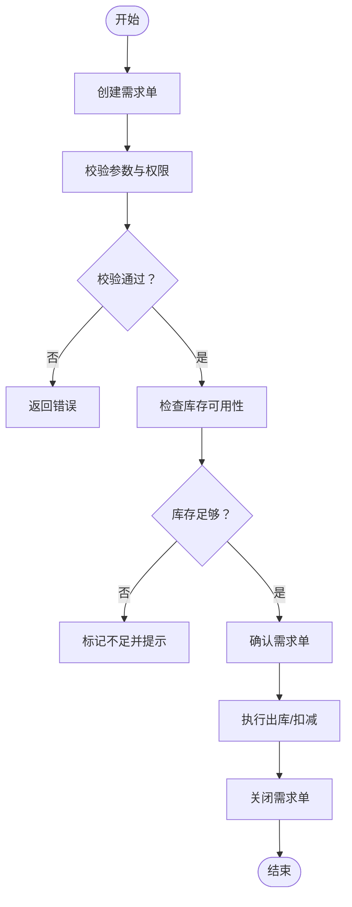
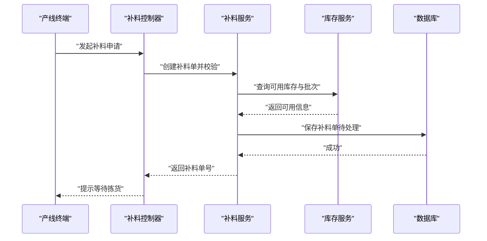
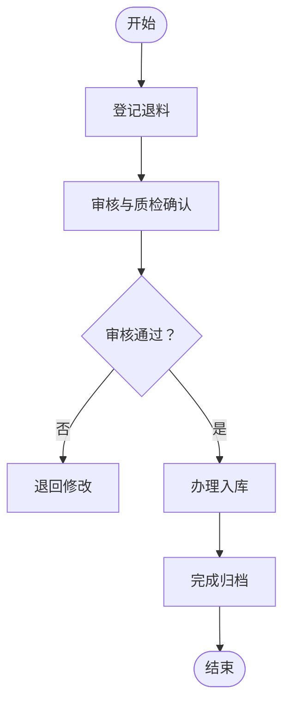
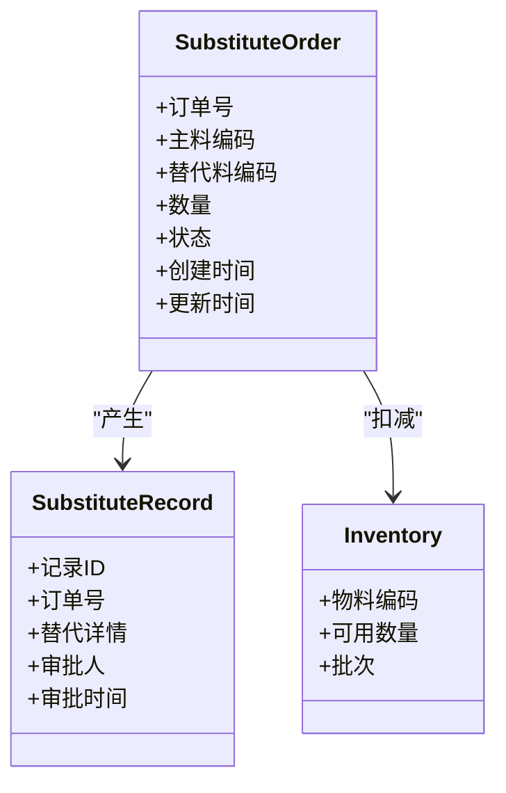
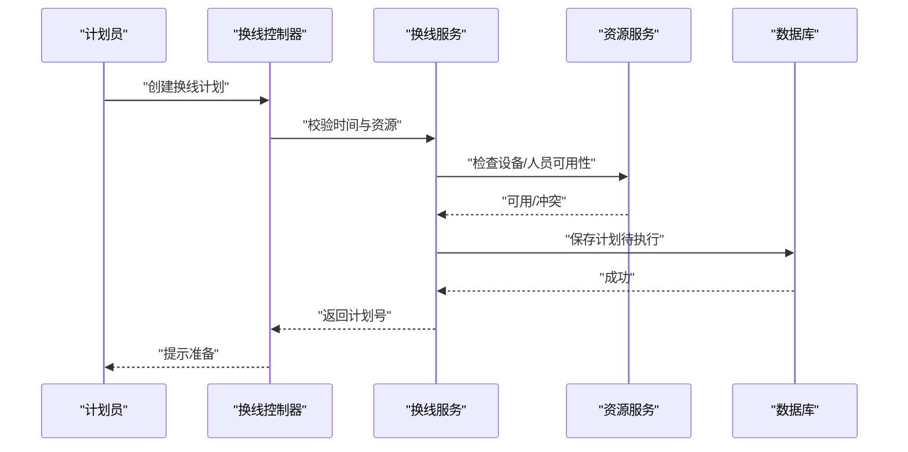
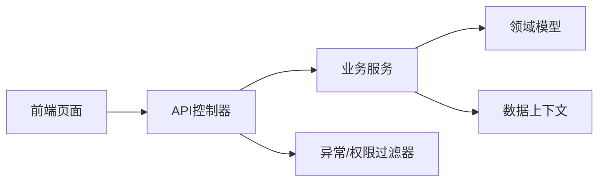

# 业务功能模块

<cite>
**本文档引用的文件**   
- [Program.cs](file://dip-system/api/Program.cs)
- [AppDbContext.cs](file://dip-system/api/Data/AppDbContext.cs)
- [MaterialRequestController.cs](file://dip-system/api/Controllers/MaterialRequestController.cs)
- [RefillController.cs](file://dip-system/api/Controllers/RefillController.cs)
- [ReturnController.cs](file://dip-system/api/Controllers/ReturnController.cs)
- [SubstituteController.cs](file://dip-system/api/Controllers/SubstituteController.cs)
- [ChangeoverController.cs](file://dip-system/api/Controllers/ChangeoverController.cs)
- [MaterialRequestService.cs](file://dip-system/api/Services/MaterialRequestService.cs)
- [RefillService.cs](file://dip-system/api/Services/RefillService.cs)
- [ReturnService.cs](file://dip-system/api/Services/ReturnService.cs)
- [SubstituteService.cs](file://dip-system/api/Services/SubstituteService.cs)
- [ChangeoverService.cs](file://dip-system/api/Services/ChangeoverService.cs)
- [MaterialRequest.cs](file://dip-system/api/Models/MaterialRequest.cs)
- [Refill.cs](file://dip-system/api/Models/Refill.cs)
- [Return.cs](file://dip-system/api/Models/Return.cs)
- [SubstituteOrder.cs](file://dip-system/api/Models/SubstituteOrder.cs)
- [SubstituteRecord.cs](file://dip-system/api/Models/SubstituteRecord.cs)
- [Changeover.cs](file://dip-system/api/Models/Changeover.cs)
- [Inventory.cs](file://dip-system/api/Models/Inventory.cs)
- [ApiResponse.cs](file://dip-system/api/Models/ApiResponse.cs)
- [BaseEntity.cs](file://dip-system/api/Models/BaseEntity.cs)
- [AppExceptionFilter.cs](file://dip-system/api/Controllers/AppExceptionFilter.cs)
- [RequireManagerFilter.cs](file://dip-system/api/Controllers/RequireManagerFilter.cs)
- [api.ts](file://dip-system/frontend-web/src/lib/api.ts)
- [CallMaterialList.tsx](file://dip-system/frontend-web/src/pages/CallMaterialList.tsx)
- [RefillList.tsx](file://dip-system/frontend-web/src/pages/RefillList.tsx)
- [ReturnList.tsx](file://dip-system/frontend-web/src/pages/ReturnList.tsx)
- [SubstituteList.tsx](file://dip-system/frontend-web/src/pages/SubstituteList.tsx)
- [ChangeoverList.tsx](file://dip-system/frontend-web/src/pages/ChangeoverList.tsx)
</cite>

## 目录
1. [简介](#简介)
2. [项目结构](#项目结构)
3. [核心组件](#核心组件)
4. [架构总览](#架构总览)
5. [详细组件分析](#详细组件分析)
6. [依赖关系分析](#依赖关系分析)
7. [性能考虑](#性能考虑)
8. [故障排查指南](#故障排查指南)
9. [结论](#结论)
10. [附录](#附录)

## 简介
本文件面向DIP系统的业务功能模块，聚焦物料需求管理、补料流程、退料处理、替代料管理与换线作业五大核心业务流程。文档从创建到完成的全生命周期出发，阐述状态流转、业务规则、数据校验逻辑与权限控制策略；同时说明跨模块的数据关联与协同机制，并给出异常处理、事务管理与并发控制的实现思路。文末提供流程图、数据流图与接口调用序列图，帮助读者快速理解系统行为与扩展点。

## 项目结构
后端采用ASP.NET Core Web API分层架构：控制器负责HTTP请求解析与响应封装，服务层承载业务逻辑与领域规则，模型层定义实体与DTO，数据访问通过EF Core上下文进行。前端为React SPA，通过统一的API客户端调用后端接口。

图表来源
- [Program.cs](file://dip-system/api/Program.cs)
- [AppDbContext.cs](file://dip-system/api/Data/AppDbContext.cs)
- [MaterialRequestController.cs](file://dip-system/api/Controllers/MaterialRequestController.cs)
- [RefillController.cs](file://dip-system/api/Controllers/RefillController.cs)
- [ReturnController.cs](file://dip-system/api/Controllers/ReturnController.cs)
- [SubstituteController.cs](file://dip-system/api/Controllers/SubstituteController.cs)
- [ChangeoverController.cs](file://dip-system/api/Controllers/ChangeoverController.cs)
- [api.ts](file://dip-system/frontend-web/src/lib/api.ts)

章节来源
- [Program.cs](file://dip-system/api/Program.cs)
- [AppDbContext.cs](file://dip-system/api/Data/AppDbContext.cs)

## 核心组件
- 控制器层：暴露REST接口，统一输入输出格式，集成异常过滤与权限校验过滤器。
- 服务层：封装业务规则、状态机、库存扣减与并发控制、事务边界。
- 模型层：实体与DTO，包含基础审计字段与通用响应包装。
- 数据访问：EF Core上下文，映射数据库表与关系。

章节来源
- [MaterialRequestController.cs](file://dip-system/api/Controllers/MaterialRequestController.cs)
- [RefillController.cs](file://dip-system/api/Controllers/RefillController.cs)
- [ReturnController.cs](file://dip-system/api/Controllers/ReturnController.cs)
- [SubstituteController.cs](file://dip-system/api/Controllers/SubstituteController.cs)
- [ChangeoverController.cs](file://dip-system/api/Controllers/ChangeoverController.cs)
- [MaterialRequestService.cs](file://dip-system/api/Services/MaterialRequestService.cs)
- [RefillService.cs](file://dip-system/api/Services/RefillService.cs)
- [ReturnService.cs](file://dip-system/api/Services/ReturnService.cs)
- [SubstituteService.cs](file://dip-system/api/Services/SubstituteService.cs)
- [ChangeoverService.cs](file://dip-system/api/Services/ChangeoverService.cs)
- [MaterialRequest.cs](file://dip-system/api/Models/MaterialRequest.cs)
- [Refill.cs](file://dip-system/api/Models/Refill.cs)
- [Return.cs](file://dip-system/api/Models/Return.cs)
- [SubstituteOrder.cs](file://dip-system/api/Models/SubstituteOrder.cs)
- [SubstituteRecord.cs](file://dip-system/api/Models/SubstituteRecord.cs)
- [Changeover.cs](file://dip-system/api/Models/Changeover.cs)
- [Inventory.cs](file://dip-system/api/Models/Inventory.cs)
- [ApiResponse.cs](file://dip-system/api/Models/ApiResponse.cs)
- [BaseEntity.cs](file://dip-system/api/Models/BaseEntity.cs)

## 架构总览
系统遵循“控制器-服务-仓储”的分层模式，结合统一异常处理与权限过滤器，确保接口一致性与安全性。前端通过统一的API客户端发起请求，页面组件按业务域组织。

图表来源
- [MaterialRequestController.cs](file://dip-system/api/Controllers/MaterialRequestController.cs)
- [RefillController.cs](file://dip-system/api/Controllers/RefillController.cs)
- [ReturnController.cs](file://dip-system/api/Controllers/ReturnController.cs)
- [SubstituteController.cs](file://dip-system/api/Controllers/SubstituteController.cs)
- [ChangeoverController.cs](file://dip-system/api/Controllers/ChangeoverController.cs)
- [MaterialRequestService.cs](file://dip-system/api/Services/MaterialRequestService.cs)
- [RefillService.cs](file://dip-system/api/Services/RefillService.cs)
- [ReturnService.cs](file://dip-system/api/Services/ReturnService.cs)
- [SubstituteService.cs](file://dip-system/api/Services/SubstituteService.cs)
- [ChangeoverService.cs](file://dip-system/api/Services/ChangeoverService.cs)
- [AppDbContext.cs](file://dip-system/api/Data/AppDbContext.cs)

## 详细组件分析

### 物料需求管理
- 生命周期
  - 创建需求单：录入工单、物料编码、需求数量、期望时间等，进入待审核状态。
  - 审核与确认：校验库存可用性与BOM匹配，通过后转为已确认。
  - 执行与关闭：根据生产消耗或计划触发出库，需求单关闭。
- 业务规则
  - 需求数量必须大于零且不超过安全阈值。
  - 同一物料在同一工单下不可重复创建冲突需求。
  - 需求变更需保留审计轨迹。
- 数据验证
  - 必填字段校验、类型与范围校验、唯一性约束。
- 权限控制
  - 仅具备“物料需求”权限的用户可创建与修改；审核需更高权限。
- 跨模块协同
  - 与库存模块联动扣减；与订单/工单模块关联追溯。
- 异常与事务
  - 库存不足时回滚事务并返回明确错误；并发场景使用乐观锁或行级锁。

图表来源
- [MaterialRequestController.cs](file://dip-system/api/Controllers/MaterialRequestController.cs)
- [MaterialRequestService.cs](file://dip-system/api/Services/MaterialRequestService.cs)
- [MaterialRequest.cs](file://dip-system/api/Models/MaterialRequest.cs)
- [Inventory.cs](file://dip-system/api/Models/Inventory.cs)

章节来源
- [MaterialRequestController.cs](file://dip-system/api/Controllers/MaterialRequestController.cs)
- [MaterialRequestService.cs](file://dip-system/api/Services/MaterialRequestService.cs)
- [MaterialRequest.cs](file://dip-system/api/Models/MaterialRequest.cs)
- [Inventory.cs](file://dip-system/api/Models/Inventory.cs)

### 补料流程
- 生命周期
  - 发起补料：扫描条码或选择工单，生成补料申请，进入待处理。
  - 拣货与复核：仓库拣货后复核数量与批次，转为已备料。
  - 上线与核销：产线领用并核销，补料单关闭。
- 业务规则
  - 补料数量不得小于实际缺料量；批次与效期需符合规则。
  - 支持部分补料与多次补料，累计不得超过需求上限。
- 数据验证
  - 条码有效性、工单存在性、数量合理性。
- 权限控制
  - 仓库人员可操作拣货与复核；产线人员仅可领用。
- 跨模块协同
  - 与库存出入库、工单进度、质量检验联动。
- 异常与事务
  - 拣货失败或数量不一致时回滚；并发锁定库存行避免超发。

图表来源
- [RefillController.cs](file://dip-system/api/Controllers/RefillController.cs)
- [RefillService.cs](file://dip-system/api/Services/RefillService.cs)
- [Refill.cs](file://dip-system/api/Models/Refill.cs)
- [Inventory.cs](file://dip-system/api/Models/Inventory.cs)

章节来源
- [RefillController.cs](file://dip-system/api/Controllers/RefillController.cs)
- [RefillService.cs](file://dip-system/api/Services/RefillService.cs)
- [Refill.cs](file://dip-system/api/Models/Refill.cs)
- [Inventory.cs](file://dip-system/api/Models/Inventory.cs)

### 退料处理
- 生命周期
  - 登记退料：记录退料原因、物料、数量、批次，进入待审核。
  - 审核与入库：质检确认后办理入库，转为已完成。
  - 归档：生成退料报告，供追溯与分析。
- 业务规则
  - 退料数量不得超过已领用量；不良品需区分责任与处理方式。
- 数据验证
  - 退料原因枚举、数量非负、批次一致性。
- 权限控制
  - 仅授权人员可审核退料；质检角色参与确认。
- 跨模块协同
  - 与库存入库、质量模块、工单核销联动。
- 异常与事务
  - 审核失败回滚；并发场景保证库存一致性。

图表来源
- [ReturnController.cs](file://dip-system/api/Controllers/ReturnController.cs)
- [ReturnService.cs](file://dip-system/api/Services/ReturnService.cs)
- [Return.cs](file://dip-system/api/Models/Return.cs)
- [Inventory.cs](file://dip-system/api/Models/Inventory.cs)

章节来源
- [ReturnController.cs](file://dip-system/api/Controllers/ReturnController.cs)
- [ReturnService.cs](file://dip-system/api/Services/ReturnService.cs)
- [Return.cs](file://dip-system/api/Models/Return.cs)
- [Inventory.cs](file://dip-system/api/Models/Inventory.cs)

### 替代料管理
- 生命周期
  - 配置替代关系：主料与替代料映射、生效条件与优先级。
  - 替代申请：生产遇到缺料时发起替代申请，进入审批。
  - 审批与执行：批准后记录替代记录，扣减主料或替代料库存。
- 业务规则
  - 替代料需满足技术兼容性与质量要求；替代比例与批次限制。
- 数据验证
  - 替代关系有效性、替代数量不超过可用量。
- 权限控制
  - 工程/工艺角色维护替代关系；生产角色发起申请；质量/主管审批。
- 跨模块协同
  - 与库存、工单、质量模块联动；替代记录用于追溯。
- 异常与事务
  - 审批失败回滚；并发替换时防止重复替代。

图表来源
- [SubstituteController.cs](file://dip-system/api/Controllers/SubstituteController.cs)
- [SubstituteService.cs](file://dip-system/api/Services/SubstituteService.cs)
- [SubstituteOrder.cs](file://dip-system/api/Models/SubstituteOrder.cs)
- [SubstituteRecord.cs](file://dip-system/api/Models/SubstituteRecord.cs)
- [Inventory.cs](file://dip-system/api/Models/Inventory.cs)

章节来源
- [SubstituteController.cs](file://dip-system/api/Controllers/SubstituteController.cs)
- [SubstituteService.cs](file://dip-system/api/Services/SubstituteService.cs)
- [SubstituteOrder.cs](file://dip-system/api/Models/SubstituteOrder.cs)
- [SubstituteRecord.cs](file://dip-system/api/Models/SubstituteRecord.cs)
- [Inventory.cs](file://dip-system/api/Models/Inventory.cs)

### 换线作业
- 生命周期
  - 创建换线计划：目标产品、停机窗口、准备清单，进入待执行。
  - 准备与确认：物料、夹具、程序准备完毕，转为可执行。
  - 执行与验收：换线完成后验收合格，转为已完成。
- 业务规则
  - 换线时间窗口需避开高峰；关键资源（设备、人员）需预约。
- 数据验证
  - 计划时间不冲突；资源可用性校验。
- 权限控制
  - 计划员创建计划；班组长确认执行；质量验收。
- 跨模块协同
  - 与设备管理、排程、物料准备联动。
- 异常与事务
  - 资源冲突回滚；并发预约使用锁或队列。

图表来源
- [ChangeoverController.cs](file://dip-system/api/Controllers/ChangeoverController.cs)
- [ChangeoverService.cs](file://dip-system/api/Services/ChangeoverService.cs)
- [Changeover.cs](file://dip-system/api/Models/Changeover.cs)

章节来源
- [ChangeoverController.cs](file://dip-system/api/Controllers/ChangeoverController.cs)
- [ChangeoverService.cs](file://dip-system/api/Services/ChangeoverService.cs)
- [Changeover.cs](file://dip-system/api/Models/Changeover.cs)

## 依赖关系分析
- 控制器依赖服务，服务依赖模型与上下文；前端通过API客户端调用控制器。
- 库存作为共享资源，被多个业务模块读写，需严格并发控制。
- 权限过滤器与异常过滤器贯穿所有控制器，保障一致的安全与错误处理。

图表来源
- [api.ts](file://dip-system/frontend-web/src/lib/api.ts)
- [MaterialRequestController.cs](file://dip-system/api/Controllers/MaterialRequestController.cs)
- [RefillController.cs](file://dip-system/api/Controllers/RefillController.cs)
- [ReturnController.cs](file://dip-system/api/Controllers/ReturnController.cs)
- [SubstituteController.cs](file://dip-system/api/Controllers/SubstituteController.cs)
- [ChangeoverController.cs](file://dip-system/api/Controllers/ChangeoverController.cs)
- [AppExceptionFilter.cs](file://dip-system/api/Controllers/AppExceptionFilter.cs)
- [RequireManagerFilter.cs](file://dip-system/api/Controllers/RequireManagerFilter.cs)

章节来源
- [api.ts](file://dip-system/frontend-web/src/lib/api.ts)
- [AppExceptionFilter.cs](file://dip-system/api/Controllers/AppExceptionFilter.cs)
- [RequireManagerFilter.cs](file://dip-system/api/Controllers/RequireManagerFilter.cs)

## 性能考虑
- 数据库层面：对高频查询字段建立索引（物料编码、工单号、批次），减少全表扫描。
- 并发控制：库存扣减使用行级锁或乐观锁版本号，避免超卖与脏读。
- 缓存策略：热点物料可用库存可短期缓存，设置合理TTL与失效策略。
- 批量操作：大批量补料/退料采用批量插入/更新，减少往返次数。
- 异步处理：耗时任务（报表生成、通知）采用异步队列，提升响应速度。

## 故障排查指南
- 常见错误
  - 库存不足：检查可用库存与锁定情况，确认是否有未完成的补料或替代申请。
  - 权限拒绝：核对用户角色与权限过滤器配置。
  - 数据不一致：查看事务日志与审计字段，定位异常节点。
- 调试建议
  - 启用详细日志，记录关键步骤的入参与出参。
  - 使用数据库监控工具观察慢查询与锁竞争。
  - 前端网络面板检查API响应与错误码。

章节来源
- [AppExceptionFilter.cs](file://dip-system/api/Controllers/AppExceptionFilter.cs)
- [RequireManagerFilter.cs](file://dip-system/api/Controllers/RequireManagerFilter.cs)
- [ApiResponse.cs](file://dip-system/api/Models/ApiResponse.cs)

## 结论
DIP系统的业务模块以清晰的分层架构与严格的权限、异常处理机制，支撑物料需求、补料、退料、替代料与换线等核心流程。通过统一的数据模型与服务化设计，实现了跨模块协同与可追溯性。建议在后续迭代中持续优化并发控制、缓存策略与异步处理能力，以提升整体性能与稳定性。

## 附录
- 前端页面与接口对应关系
  - 物料需求：[CallMaterialList.tsx](file://dip-system/frontend-web/src/pages/CallMaterialList.tsx)
  - 补料：[RefillList.tsx](file://dip-system/frontend-web/src/pages/RefillList.tsx)
  - 退料：[ReturnList.tsx](file://dip-system/frontend-web/src/pages/ReturnList.tsx)
  - 替代料：[SubstituteList.tsx](file://dip-system/frontend-web/src/pages/SubstituteList.tsx)
  - 换线：[ChangeoverList.tsx](file://dip-system/frontend-web/src/pages/ChangeoverList.tsx)
- 统一API客户端：[api.ts](file://dip-system/frontend-web/src/lib/api.ts)

章节来源
- [CallMaterialList.tsx](file://dip-system/frontend-web/src/pages/CallMaterialList.tsx)
- [RefillList.tsx](file://dip-system/frontend-web/src/pages/RefillList.tsx)
- [ReturnList.tsx](file://dip-system/frontend-web/src/pages/ReturnList.tsx)
- [SubstituteList.tsx](file://dip-system/frontend-web/src/pages/SubstituteList.tsx)
- [ChangeoverList.tsx](file://dip-system/frontend-web/src/pages/ChangeoverList.tsx)
- [api.ts](file://dip-system/frontend-web/src/lib/api.ts)