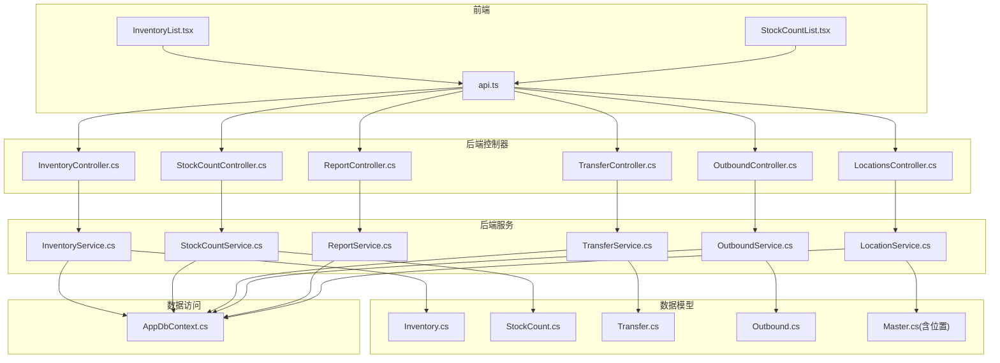
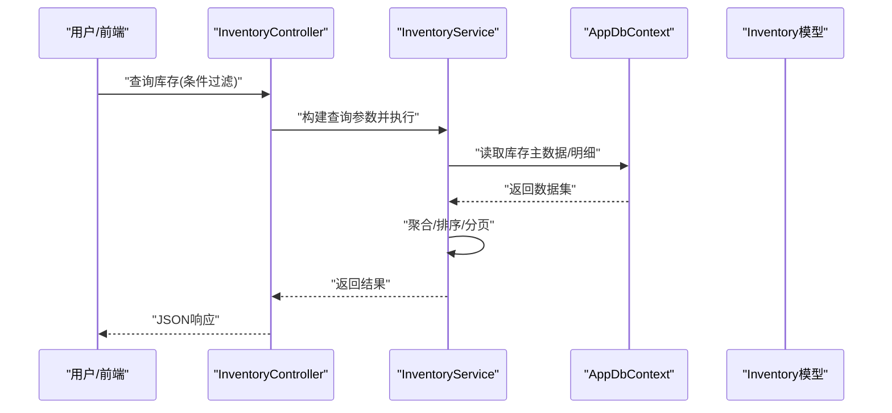
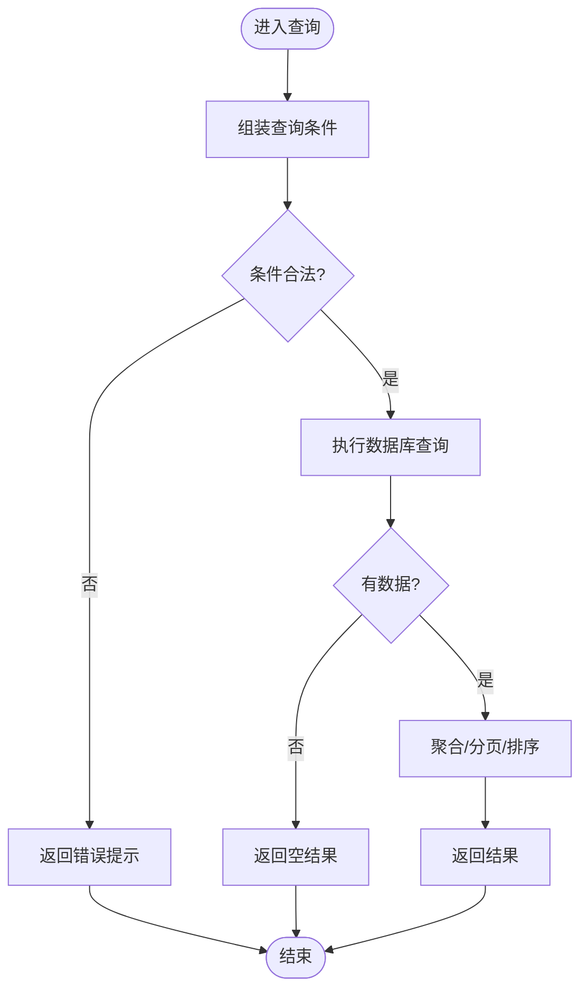
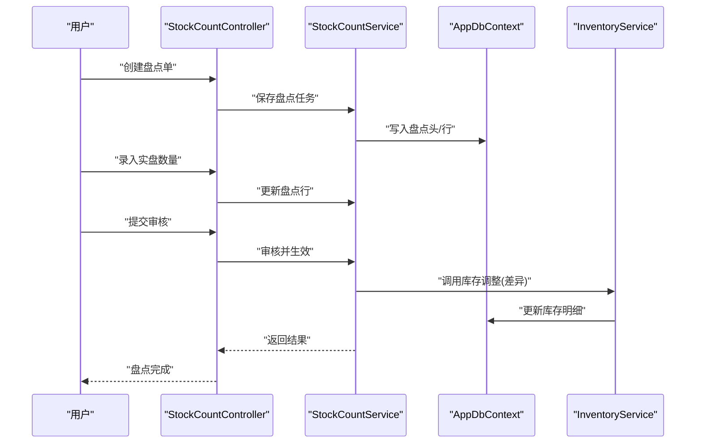
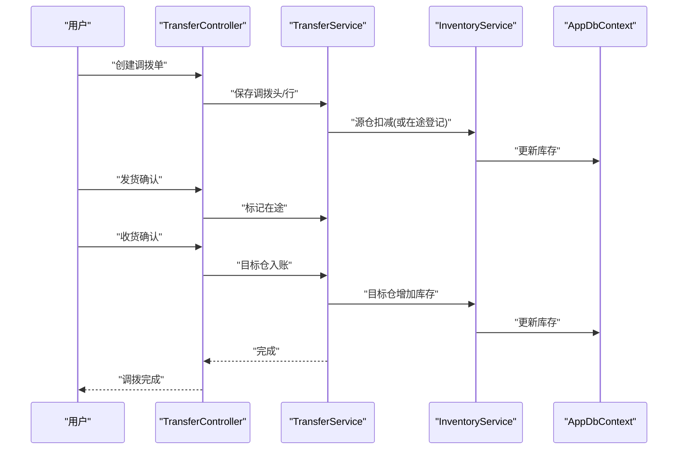
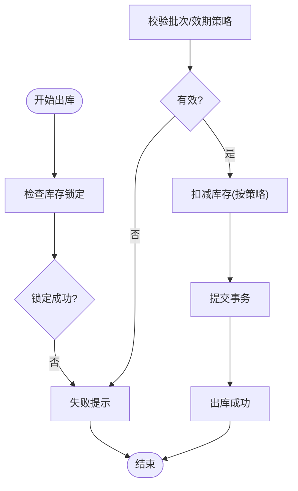
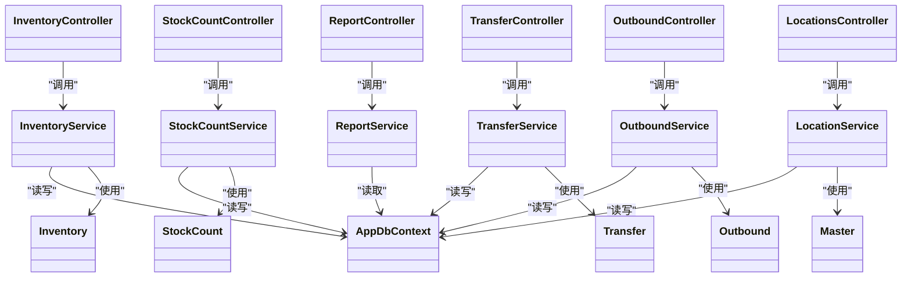

# 库存管理

<cite>
**本文引用的文件**   
- [InventoryController.cs](file://dip-system/api/Controllers/InventoryController.cs)
- [InventoryService.cs](file://dip-system/api/Services/InventoryService.cs)
- [Inventory.cs](file://dip-system/api/Models/Inventory.cs)
- [StockCountController.cs](file://dip-system/api/Controllers/StockCountController.cs)
- [StockCountService.cs](file://dip-system/api/Services/StockCountService.cs)
- [StockCount.cs](file://dip-system/api/Models/StockCount.cs)
- [TransferController.cs](file://dip-system/api/Controllers/TransferController.cs)
- [TransferService.cs](file://dip-system/api/Services/TransferService.cs)
- [Transfer.cs](file://dip-system/api/Models/Transfer.cs)
- [OutboundController.cs](file://dip-system/api/Controllers/OutboundController.cs)
- [OutboundService.cs](file://dip-system/api/Services/OutboundService.cs)
- [Outbound.cs](file://dip-system/api/Models/Outbound.cs)
- [ReportController.cs](file://dip-system/api/Controllers/ReportController.cs)
- [ReportService.cs](file://dip-system/api/Services/ReportService.cs)
- [LocationsController.cs](file://dip-system/api/Controllers/LocationsController.cs)
- [LocationService.cs](file://dip-system/api/Services/LocationService.cs)
- [Location.cs](file://dip-system/api/Models/Master.cs)
- [AppDbContext.cs](file://dip-system/api/Data/AppDbContext.cs)
- [InventoryList.tsx](file://dip-system/frontend-web/src/pages/InventoryList.tsx)
- [StockCountList.tsx](file://dip-system/frontend-web/src/pages/StockCountList.tsx)
- [api.ts](file://dip-system/frontend-web/src/lib/api.ts)
</cite>

## 目录
1. [简介](#简介)
2. [项目结构](#项目结构)
3. [核心组件](#核心组件)
4. [架构总览](#架构总览)
5. [详细组件分析](#详细组件分析)
6. [依赖关系分析](#依赖关系分析)
7. [性能考虑](#性能考虑)
8. [故障排查指南](#故障排查指南)
9. [结论](#结论)
10. [附录](#附录)

## 简介
本文件面向库存管理模块，覆盖库存查询、盘点、调整、预警等核心能力；阐述出入库、调拨、报废等操作对库存的实时更新机制；说明批次、效期、位置等精细化管控；提供周转率分析、呆滞料预警、安全库存设置等智能化管理思路；并包含多仓库、库存冻结与锁定等高级特性。文档同时给出流程图、报表分析与性能优化建议，帮助读者快速理解与落地实施。

## 项目结构
库存相关功能在后端采用控制器-服务-数据模型的分层架构，前端通过页面与API封装进行交互。关键文件分布如下：
- 控制器层：InventoryController、StockCountController、TransferController、OutboundController、ReportController、LocationsController
- 服务层：InventoryService、StockCountService、TransferService、OutboundService、ReportService、LocationService
- 数据模型：Inventory、StockCount、Transfer、Outbound、Master（含位置）
- 数据访问：AppDbContext
- 前端页面：InventoryList、StockCountList
- 前端API封装：api.ts

图表来源
- [InventoryController.cs](file://dip-system/api/Controllers/InventoryController.cs)
- [InventoryService.cs](file://dip-system/api/Services/InventoryService.cs)
- [Inventory.cs](file://dip-system/api/Models/Inventory.cs)
- [StockCountController.cs](file://dip-system/api/Controllers/StockCountController.cs)
- [StockCountService.cs](file://dip-system/api/Services/StockCountService.cs)
- [StockCount.cs](file://dip-system/api/Models/StockCount.cs)
- [TransferController.cs](file://dip-system/api/Controllers/TransferController.cs)
- [TransferService.cs](file://dip-system/api/Services/TransferService.cs)
- [Transfer.cs](file://dip-system/api/Models/Transfer.cs)
- [OutboundController.cs](file://dip-system/api/Controllers/OutboundController.cs)
- [OutboundService.cs](file://dip-system/api/Services/OutboundService.cs)
- [Outbound.cs](file://dip-system/api/Models/Outbound.cs)
- [ReportController.cs](file://dip-system/api/Controllers/ReportController.cs)
- [ReportService.cs](file://dip-system/api/Services/ReportService.cs)
- [LocationsController.cs](file://dip-system/api/Controllers/LocationsController.cs)
- [LocationService.cs](file://dip-system/api/Services/LocationService.cs)
- [Master.cs](file://dip-system/api/Models/Master.cs)
- [AppDbContext.cs](file://dip-system/api/Data/AppDbContext.cs)
- [InventoryList.tsx](file://dip-system/frontend-web/src/pages/InventoryList.tsx)
- [StockCountList.tsx](file://dip-system/frontend-web/src/pages/StockCountList.tsx)
- [api.ts](file://dip-system/frontend-web/src/lib/api.ts)

章节来源
- [InventoryController.cs](file://dip-system/api/Controllers/InventoryController.cs)
- [InventoryService.cs](file://dip-system/api/Services/InventoryService.cs)
- [Inventory.cs](file://dip-system/api/Models/Inventory.cs)
- [StockCountController.cs](file://dip-system/api/Controllers/StockCountController.cs)
- [StockCountService.cs](file://dip-system/api/Services/StockCountService.cs)
- [StockCount.cs](file://dip-system/api/Models/StockCount.cs)
- [TransferController.cs](file://dip-system/api/Controllers/TransferController.cs)
- [TransferService.cs](file://dip-system/api/Services/TransferService.cs)
- [Transfer.cs](file://dip-system/api/Models/Transfer.cs)
- [OutboundController.cs](file://dip-system/api/Controllers/OutboundController.cs)
- [OutboundService.cs](file://dip-system/api/Services/OutboundService.cs)
- [Outbound.cs](file://dip-system/api/Models/Outbound.cs)
- [ReportController.cs](file://dip-system/api/Controllers/ReportController.cs)
- [ReportService.cs](file://dip-system/api/Services/ReportService.cs)
- [LocationsController.cs](file://dip-system/api/Controllers/LocationsController.cs)
- [LocationService.cs](file://dip-system/api/Services/LocationService.cs)
- [Master.cs](file://dip-system/api/Models/Master.cs)
- [AppDbContext.cs](file://dip-system/api/Data/AppDbContext.cs)
- [InventoryList.tsx](file://dip-system/frontend-web/src/pages/InventoryList.tsx)
- [StockCountList.tsx](file://dip-system/frontend-web/src/pages/StockCountList.tsx)
- [api.ts](file://dip-system/frontend-web/src/lib/api.ts)

## 核心组件
- 库存查询与基础维护：InventoryController + InventoryService + Inventory 模型，支持按物料、仓库、位置、批次、效期等维度检索与汇总。
- 盘点管理：StockCountController + StockCountService + StockCount 模型，支持创建盘点单、差异录入、审核生效与回滚。
- 调拨管理：TransferController + TransferService + Transfer 模型，支持跨仓/跨库位调拨、在途跟踪与双向扣增。
- 出库管理：OutboundController + OutboundService + Outbound 模型，支持领料、发货、报废等出库类型，联动库存扣减与批次/效期策略。
- 报表与分析：ReportController + ReportService，提供周转率、呆滞料、安全库存等指标计算与导出。
- 位置管理：LocationsController + LocationService + Master（位置实体），支持仓库、库区、货架、货位层级管理与容量控制。

章节来源
- [InventoryController.cs](file://dip-system/api/Controllers/InventoryController.cs)
- [InventoryService.cs](file://dip-system/api/Services/InventoryService.cs)
- [Inventory.cs](file://dip-system/api/Models/Inventory.cs)
- [StockCountController.cs](file://dip-system/api/Controllers/StockCountController.cs)
- [StockCountService.cs](file://dip-system/api/Services/StockCountService.cs)
- [StockCount.cs](file://dip-system/api/Models/StockCount.cs)
- [TransferController.cs](file://dip-system/api/Controllers/TransferController.cs)
- [TransferService.cs](file://dip-system/api/Services/TransferService.cs)
- [Transfer.cs](file://dip-system/api/Models/Transfer.cs)
- [OutboundController.cs](file://dip-system/api/Controllers/OutboundController.cs)
- [OutboundService.cs](file://dip-system/api/Services/OutboundService.cs)
- [Outbound.cs](file://dip-system/api/Models/Outbound.cs)
- [ReportController.cs](file://dip-system/api/Controllers/ReportController.cs)
- [ReportService.cs](file://dip-system/api/Services/ReportService.cs)
- [LocationsController.cs](file://dip-system/api/Controllers/LocationsController.cs)
- [LocationService.cs](file://dip-system/api/Services/LocationService.cs)
- [Master.cs](file://dip-system/api/Models/Master.cs)

## 架构总览
库存模块遵循“控制器负责请求校验与路由，服务层承载业务逻辑与事务，数据模型映射持久化”的分层设计。前端通过统一的API封装调用后端接口，实现库存查询、盘点、调拨、出库与报表展示。

图表来源
- [InventoryController.cs](file://dip-system/api/Controllers/InventoryController.cs)
- [InventoryService.cs](file://dip-system/api/Services/InventoryService.cs)
- [AppDbContext.cs](file://dip-system/api/Data/AppDbContext.cs)
- [Inventory.cs](file://dip-system/api/Models/Inventory.cs)

## 详细组件分析

### 库存查询与实时性
- 查询能力：支持按物料编码、名称、规格、仓库、库位、批次、供应商、效期区间、状态等多维筛选；支持分页与排序。
- 实时性保障：所有影响库存的事务操作（入库、出库、调拨、盘点生效）均通过服务层事务提交，确保数据一致性；查询接口直接读取最新数据库快照。
- 批次与效期：库存明细关联批次号与有效期，支持先进先出（FIFO）或指定批次出库策略；过期预警由报表服务统一计算。
- 位置管理：库存记录绑定仓库、库区、货架、货位，支持容量限制与拣货路径优化。

图表来源
- [InventoryController.cs](file://dip-system/api/Controllers/InventoryController.cs)
- [InventoryService.cs](file://dip-system/api/Services/InventoryService.cs)
- [AppDbContext.cs](file://dip-system/api/Data/AppDbContext.cs)

章节来源
- [InventoryController.cs](file://dip-system/api/Controllers/InventoryController.cs)
- [InventoryService.cs](file://dip-system/api/Services/InventoryService.cs)
- [Inventory.cs](file://dip-system/api/Models/Inventory.cs)
- [AppDbContext.cs](file://dip-system/api/Data/AppDbContext.cs)

### 盘点流程与差异处理
- 盘点单：创建盘点任务，选择仓库/库位/物料范围，支持盲盘与明盘。
- 差异录入：现场扫码或手工录入实盘数量，系统自动计算差异。
- 审核生效：审核通过后，库存按差异调整；支持回滚与审计追踪。
- 异常处理：差异超阈值告警，需二次确认或审批流。

图表来源
- [StockCountController.cs](file://dip-system/api/Controllers/StockCountController.cs)
- [StockCountService.cs](file://dip-system/api/Services/StockCountService.cs)
- [StockCount.cs](file://dip-system/api/Models/StockCount.cs)
- [InventoryService.cs](file://dip-system/api/Services/InventoryService.cs)
- [AppDbContext.cs](file://dip-system/api/Data/AppDbContext.cs)

章节来源
- [StockCountController.cs](file://dip-system/api/Controllers/StockCountController.cs)
- [StockCountService.cs](file://dip-system/api/Services/StockCountService.cs)
- [StockCount.cs](file://dip-system/api/Models/StockCount.cs)
- [InventoryService.cs](file://dip-system/api/Services/InventoryService.cs)

### 调拨流程与在途管理
- 调拨申请：选择源仓库/库位与目标仓库/库位，指定物料、批次、数量。
- 在途跟踪：调拨单生成后，源仓扣减、目标仓增加在途数量；支持部分发运与合并。
- 收货确认：目标仓收货确认后，在途转正式库存；支持拒收与退货。
- 异常处理：数量不符、批次不匹配、效期异常时阻断或走例外流程。

图表来源
- [TransferController.cs](file://dip-system/api/Controllers/TransferController.cs)
- [TransferService.cs](file://dip-system/api/Services/TransferService.cs)
- [Transfer.cs](file://dip-system/api/Models/Transfer.cs)
- [InventoryService.cs](file://dip-system/api/Services/InventoryService.cs)
- [AppDbContext.cs](file://dip-system/api/Data/AppDbContext.cs)

章节来源
- [TransferController.cs](file://dip-system/api/Controllers/TransferController.cs)
- [TransferService.cs](file://dip-system/api/Services/TransferService.cs)
- [Transfer.cs](file://dip-system/api/Models/Transfer.cs)
- [InventoryService.cs](file://dip-system/api/Services/InventoryService.cs)

### 出库流程与库存扣减
- 出库类型：领料、发货、报废、退库等；不同业务类型对应不同库存扣减策略。
- 批次/效期策略：优先FIFO或按指定批次出库；效期临近或过期禁止出库。
- 库存锁定：出库前可锁定可用数量，防止并发占用；锁定超时释放。
- 审计与追溯：出库单关联物料、批次、库位、操作人、时间戳。

图表来源
- [OutboundController.cs](file://dip-system/api/Controllers/OutboundController.cs)
- [OutboundService.cs](file://dip-system/api/Services/OutboundService.cs)
- [Outbound.cs](file://dip-system/api/Models/Outbound.cs)
- [InventoryService.cs](file://dip-system/api/Services/InventoryService.cs)

章节来源
- [OutboundController.cs](file://dip-system/api/Controllers/OutboundController.cs)
- [OutboundService.cs](file://dip-system/api/Services/OutboundService.cs)
- [Outbound.cs](file://dip-system/api/Models/Outbound.cs)
- [InventoryService.cs](file://dip-system/api/Services/InventoryService.cs)

### 位置管理与多仓库支持
- 位置层级：仓库→库区→货架→货位，支持容量上限与占用统计。
- 多仓库：库存记录绑定仓库维度，支持跨仓查询与汇总。
- 库位策略：上架推荐、拣货路径优化、库位合并与拆分。
- 容量控制：库位容量不足时阻止上架或提示调整。

章节来源
- [LocationsController.cs](file://dip-system/api/Controllers/LocationsController.cs)
- [LocationService.cs](file://dip-system/api/Services/LocationService.cs)
- [Master.cs](file://dip-system/api/Models/Master.cs)

### 报表与智能化管理
- 周转率分析：按物料/仓库/时间段计算周转次数与天数，识别快慢动销。
- 呆滞料预警：基于停留时长与消耗趋势，输出呆滞清单与建议处置。
- 安全库存：结合需求预测、供应周期与安全系数，动态计算建议值。
- 过期预警：按效期区间扫描，生成临期/过期清单与处理建议。

章节来源
- [ReportController.cs](file://dip-system/api/Controllers/ReportController.cs)
- [ReportService.cs](file://dip-system/api/Services/ReportService.cs)

## 依赖关系分析
库存模块各组件之间职责清晰、耦合度低，主要依赖如下：
- 控制器依赖服务层，服务层依赖数据模型与数据上下文。
- 盘点、调拨、出库等服务在变更库存时统一调用库存服务，保证一致性与可复用性。
- 报表服务依赖历史交易与库存快照数据进行指标计算。

图表来源
- [InventoryController.cs](file://dip-system/api/Controllers/InventoryController.cs)
- [InventoryService.cs](file://dip-system/api/Services/InventoryService.cs)
- [Inventory.cs](file://dip-system/api/Models/Inventory.cs)
- [StockCountController.cs](file://dip-system/api/Controllers/StockCountController.cs)
- [StockCountService.cs](file://dip-system/api/Services/StockCountService.cs)
- [StockCount.cs](file://dip-system/api/Models/StockCount.cs)
- [TransferController.cs](file://dip-system/api/Controllers/TransferController.cs)
- [TransferService.cs](file://dip-system/api/Services/TransferService.cs)
- [Transfer.cs](file://dip-system/api/Models/Transfer.cs)
- [OutboundController.cs](file://dip-system/api/Controllers/OutboundController.cs)
- [OutboundService.cs](file://dip-system/api/Services/OutboundService.cs)
- [Outbound.cs](file://dip-system/api/Models/Outbound.cs)
- [ReportController.cs](file://dip-system/api/Controllers/ReportController.cs)
- [ReportService.cs](file://dip-system/api/Services/ReportService.cs)
- [LocationsController.cs](file://dip-system/api/Controllers/LocationsController.cs)
- [LocationService.cs](file://dip-system/api/Services/LocationService.cs)
- [Master.cs](file://dip-system/api/Models/Master.cs)
- [AppDbContext.cs](file://dip-system/api/Data/AppDbContext.cs)

## 性能考虑
- 查询优化：为常用过滤字段建立复合索引（如物料、仓库、库位、批次、效期）；避免全表扫描。
- 分页与懒加载：前端列表分页，后端按需返回；大报表采用异步导出。
- 事务粒度：将库存变更事务控制在最小范围，减少锁竞争与死锁概率。
- 缓存策略：热点查询（如库位容量、字典）可使用内存缓存；注意失效与一致性。
- 批处理：批量导入/导出采用分批处理，降低内存峰值与数据库压力。
- 并发控制：出库锁定与盘点审核采用乐观锁或分布式锁，避免超卖与重复生效。

## 故障排查指南
- 库存不一致：核对最近一次盘点与调拨/出库流水，定位差异源头；必要时启用回滚或冲销单。
- 批次/效期异常：检查批次规则与效期策略配置；查看临期/过期预警清单。
- 调拨卡在途：检查发货与收货确认状态；查看在途库存与源/目标仓余额。
- 出库失败：检查库存锁定、批次/效期校验、库位容量与权限。
- 报表延迟：检查定时任务是否运行；关注数据库锁与慢查询日志。

章节来源
- [StockCountService.cs](file://dip-system/api/Services/StockCountService.cs)
- [TransferService.cs](file://dip-system/api/Services/TransferService.cs)
- [OutboundService.cs](file://dip-system/api/Services/OutboundService.cs)
- [ReportService.cs](file://dip-system/api/Services/ReportService.cs)

## 结论
库存管理模块以分层架构为基础，围绕查询、盘点、调拨、出库与报表五大核心能力，构建了批次、效期、位置等精细化管控体系，并通过周转率、呆滞料与安全库存等智能分析提升运营效率。建议在大规模部署中强化索引、事务与并发控制，配合前端分页与异步导出，确保高吞吐与低延迟。

## 附录
- 前端页面参考：
  - 库存列表页：InventoryList.tsx
  - 盘点列表页：StockCountList.tsx
  - API封装：api.ts

章节来源
- [InventoryList.tsx](file://dip-system/frontend-web/src/pages/InventoryList.tsx)
- [StockCountList.tsx](file://dip-system/frontend-web/src/pages/StockCountList.tsx)
- [api.ts](file://dip-system/frontend-web/src/lib/api.ts)