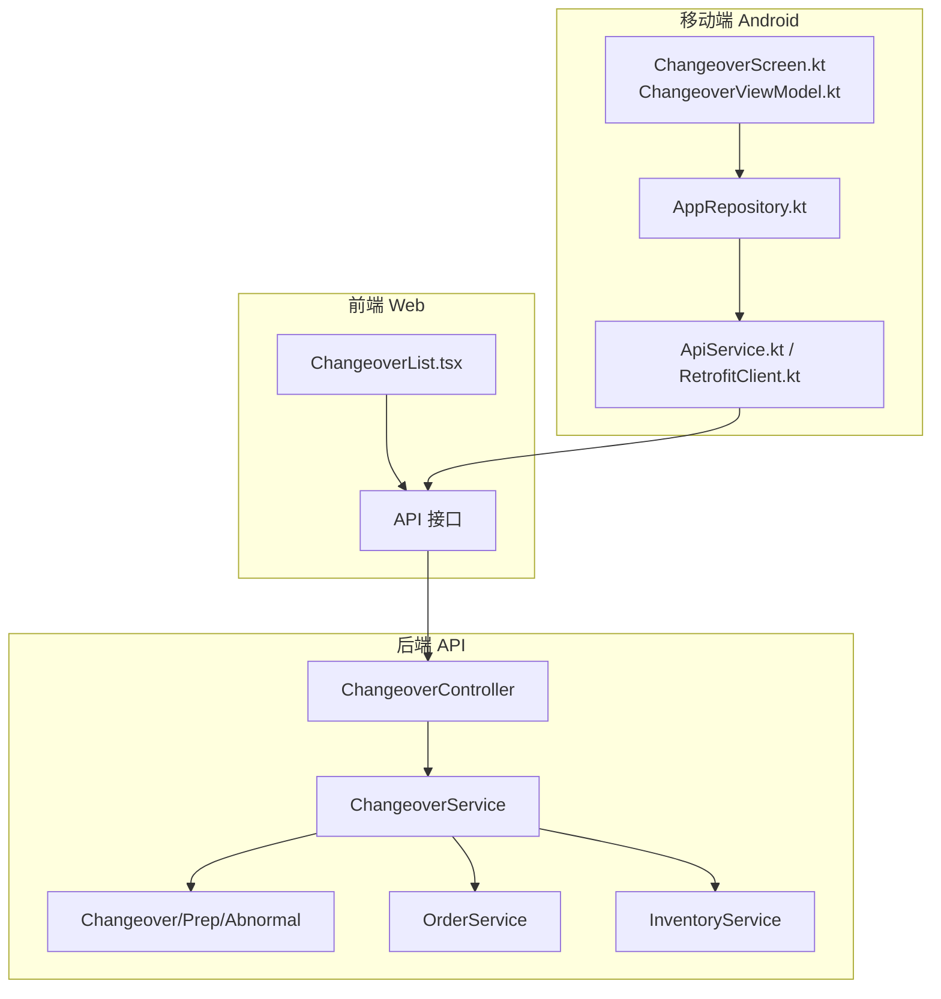
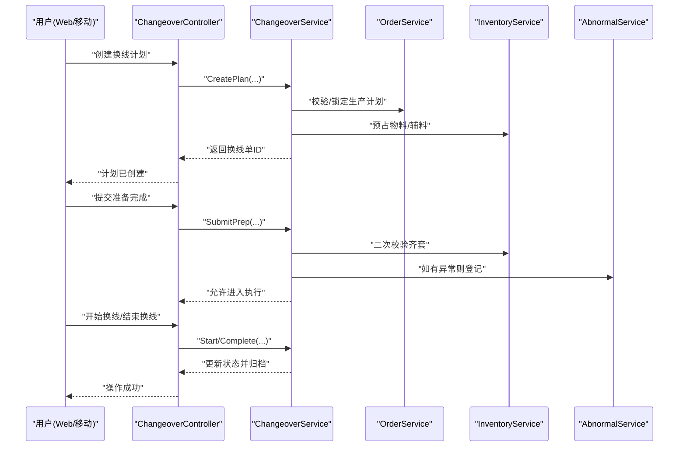
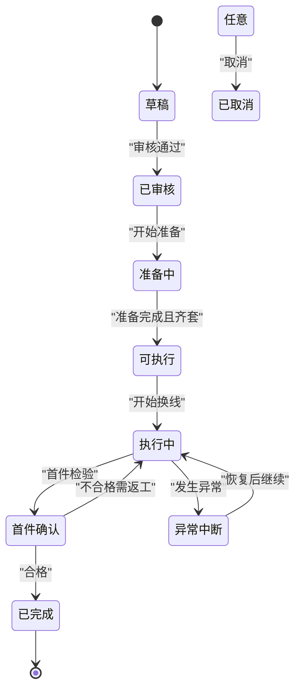
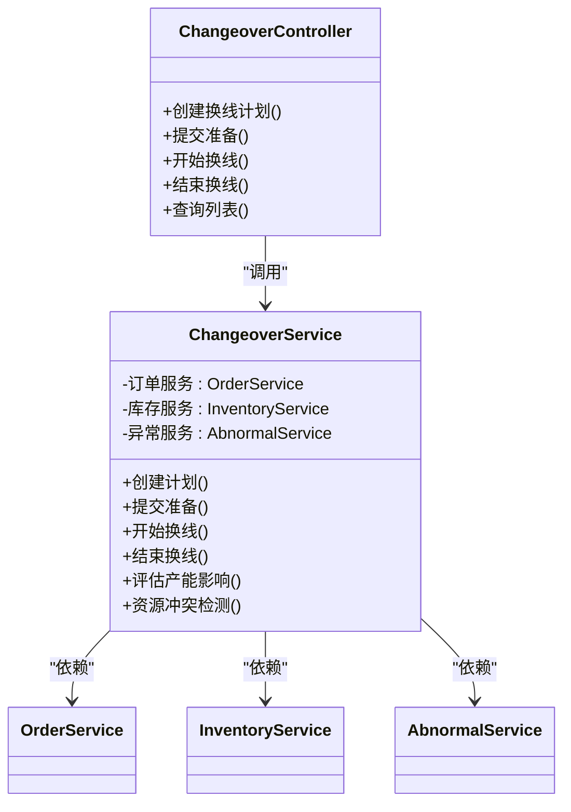
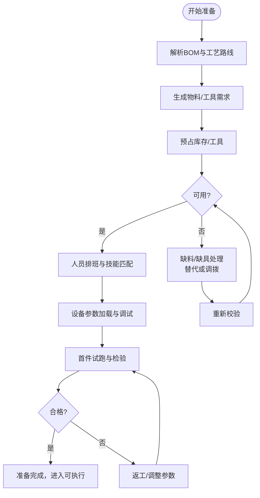
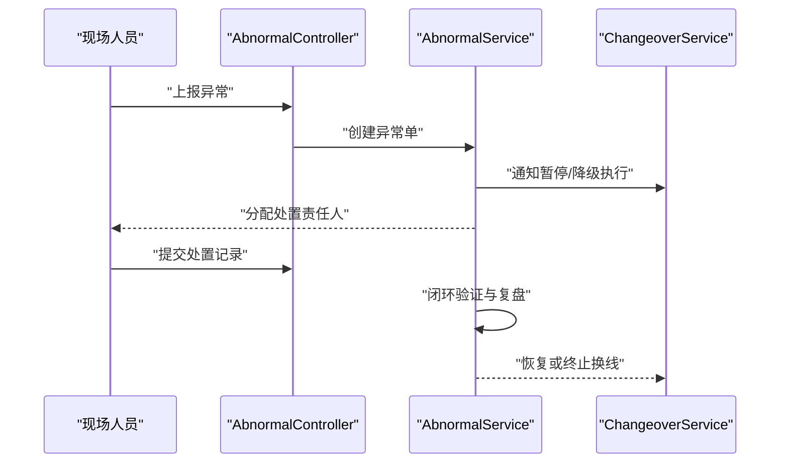
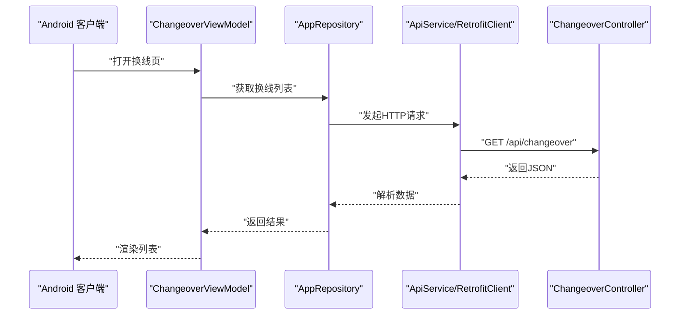
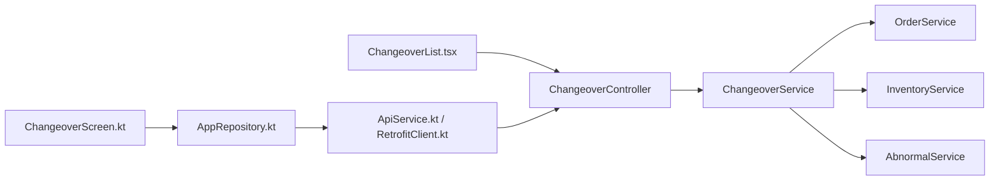
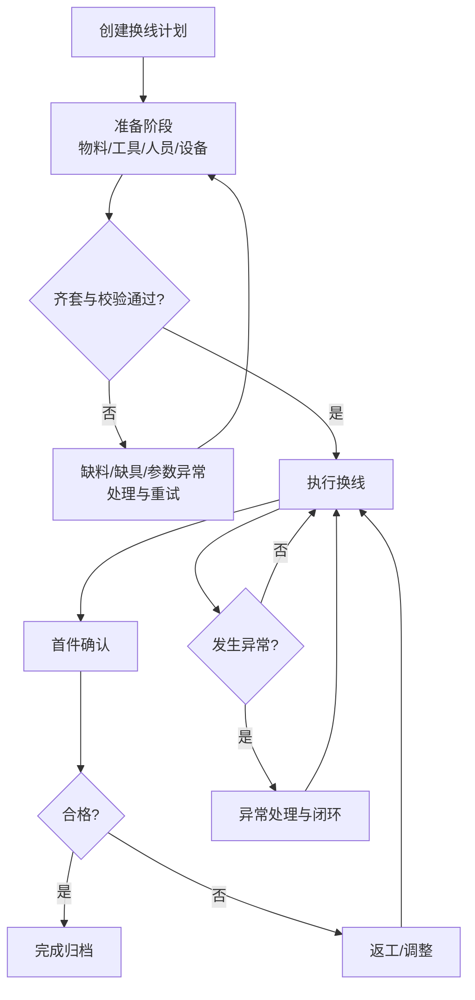

# 换线作业管理

<cite>
**本文引用的文件**   
- [ChangeoverController.cs](file://dip-system/api/Controllers/ChangeoverController.cs)
- [ChangeoverService.cs](file://dip-system/api/Services/ChangeoverService.cs)
- [Changeover.cs](file://dip-system/api/Models/Changeover.cs)
- [PrepController.cs](file://dip-system/api/Controllers/PrepController.cs)
- [PrepService.cs](file://dip-system/api/Services/PrepService.cs)
- [Prep.cs](file://dip-system/api/Models/Prep.cs)
- [OrderService.cs](file://dip-system/api/Services/OrderService.cs)
- [InventoryService.cs](file://dip-system/api/Services/InventoryService.cs)
- [AbnormalController.cs](file://dip-system/api/Controllers/AbnormalController.cs)
- [AbnormalService.cs](file://dip-system/api/Services/AbnormalService.cs)
- [Abnormal.cs](file://dip-system/api/Models/Abnormal.cs)
- [ChangeoverList.tsx](file://dip-system/frontend-web/src/pages/ChangeoverList.tsx)
- [ChangeoverScreen.kt](file://mobile-android/app/src/main/java/com/dip/material/ui/changeover/ChangeoverScreen.kt)
- [ChangeoverViewModel.kt](file://mobile-android/app/src/main/java/com/dip/material/ui/changeover/ChangeoverViewModel.kt)
- [AppRepository.kt](file://mobile-android/app/src/main/java/com/dip/material/data/repository/AppRepository.kt)
- [ApiService.kt](file://mobile-android/app/src/main/java/com/dip/material/data/network/ApiService.kt)
- [RetrofitClient.kt](file://mobile-android/app/src/main/java/com/dip/material/data/network/RetrofitClient.kt)
- [Program.cs](file://dip-system/api/Program.cs)
- [appsettings.json](file://dip-system/api/appsettings.json)
</cite>

## 目录
1. [简介](#简介)
2. [项目结构](#项目结构)
3. [核心组件](#核心组件)
4. [架构总览](#架构总览)
5. [详细组件分析](#详细组件分析)
6. [依赖关系分析](#依赖关系分析)
7. [性能考虑](#性能考虑)
8. [故障排查指南](#故障排查指南)
9. [结论](#结论)
10. [附录](#附录)

## 简介
本文件围绕“换线作业管理”功能，系统化梳理从计划、准备到执行的完整流程，覆盖产品换线、工艺换线、设备换线的差异化处理与资源配置要求。文档同时给出准备工作清单（物料、工具、人员、设备调试）、进度跟踪、异常处理、效率分析等管理能力，并说明与生产计划的协调、资源冲突解决、产能影响评估等高级能力。文末提供流程图、资源调度算法要点与性能优化建议，帮助读者快速理解与落地实施。

## 项目结构
后端采用 ASP.NET Core Web API，前端为 React SPA，移动端为 Android（Kotlin）。换线相关的主要代码分布在：
- API 控制器与服务层：ChangeoverController、ChangeoverService
- 数据模型：Changeover、Prep、Abnormal
- 业务协同服务：OrderService、InventoryService
- 前端页面与移动端界面：ChangeoverList.tsx、ChangeoverScreen.kt、ChangeoverViewModel.kt
- 网络与依赖注入：Program.cs、appsettings.json、ApiService.kt、RetrofitClient.kt、AppRepository.kt

图表来源
- [ChangeoverController.cs](file://dip-system/api/Controllers/ChangeoverController.cs)
- [ChangeoverService.cs](file://dip-system/api/Services/ChangeoverService.cs)
- [Changeover.cs](file://dip-system/api/Models/Changeover.cs)
- [PrepController.cs](file://dip-system/api/Controllers/PrepController.cs)
- [PrepService.cs](file://dip-system/api/Services/PrepService.cs)
- [Prep.cs](file://dip-system/api/Models/Prep.cs)
- [OrderService.cs](file://dip-system/api/Services/OrderService.cs)
- [InventoryService.cs](file://dip-system/api/Services/InventoryService.cs)
- [ChangeoverList.tsx](file://dip-system/frontend-web/src/pages/ChangeoverList.tsx)
- [ChangeoverScreen.kt](file://mobile-android/app/src/main/java/com/dip/material/ui/changeover/ChangeoverScreen.kt)
- [ChangeoverViewModel.kt](file://mobile-android/app/src/main/java/com/dip/material/ui/changeover/ChangeoverViewModel.kt)
- [AppRepository.kt](file://mobile-android/app/src/main/java/com/dip/material/data/repository/AppRepository.kt)
- [ApiService.kt](file://mobile-android/app/src/main/java/com/dip/material/data/network/ApiService.kt)
- [RetrofitClient.kt](file://mobile-android/app/src/main/java/com/dip/material/data/network/RetrofitClient.kt)

章节来源
- [Program.cs](file://dip-system/api/Program.cs)
- [appsettings.json](file://dip-system/api/appsettings.json)

## 核心组件
- 换线控制器与服务：负责换线单创建、状态流转、校验与执行控制；与订单、库存、异常等服务协作。
- 换线模型：承载换线类型、目标产品/工艺/设备、计划时间、资源需求、状态机、追溯信息等。
- 准备模块：用于物料齐套检查、工具到位确认、人员排班、设备点检与调试记录。
- 异常模块：记录换线过程中的异常事件、处置措施与闭环。
- 前端与移动端：提供换线计划查看、准备任务勾选、执行上报、异常上报与进度可视化。

章节来源
- [ChangeoverController.cs](file://dip-system/api/Controllers/ChangeoverController.cs)
- [ChangeoverService.cs](file://dip-system/api/Services/ChangeoverService.cs)
- [Changeover.cs](file://dip-system/api/Models/Changeover.cs)
- [PrepController.cs](file://dip-system/api/Controllers/PrepController.cs)
- [PrepService.cs](file://dip-system/api/Services/PrepService.cs)
- [Prep.cs](file://dip-system/api/Models/Prep.cs)
- [AbnormalController.cs](file://dip-system/api/Controllers/AbnormalController.cs)
- [AbnormalService.cs](file://dip-system/api/Services/AbnormalService.cs)
- [Abnormal.cs](file://dip-system/api/Models/Abnormal.cs)

## 架构总览
换线作业管理遵循“前后端分离 + 移动端采集”的架构。Web 与移动端通过 REST API 与后端交互；后端以控制器暴露接口，服务层实现业务编排，数据访问由实体模型与数据库完成。关键交互包括：
- 计划阶段：创建换线单、关联生产计划、预占资源、生成准备任务。
- 准备阶段：物料齐套、工具到位、人员就位、设备调试与点检。
- 执行阶段：下发执行指令、开始换线、首件确认、结束换线并归档。
- 异常处理：异常上报、分级响应、处置记录与复盘。

图表来源
- [ChangeoverController.cs](file://dip-system/api/Controllers/ChangeoverController.cs)
- [ChangeoverService.cs](file://dip-system/api/Services/ChangeoverService.cs)
- [OrderService.cs](file://dip-system/api/Services/OrderService.cs)
- [InventoryService.cs](file://dip-system/api/Services/InventoryService.cs)
- [AbnormalService.cs](file://dip-system/api/Services/AbnormalService.cs)

## 详细组件分析

### 换线模型与状态机
换线单包含以下关键信息：
- 基本信息：编号、名称、类型（产品/工艺/设备）、优先级、计划起止时间、责任班组/人员。
- 资源需求：物料清单、工装夹具、专用工具、测试治具、设备参数模板。
- 状态机：草稿、已审核、准备中、可执行、执行中、首件确认、已完成、已取消、异常中断。
- 追溯信息：变更原因、审批人、变更记录、质量判定、OEE影响统计。

图表来源
- [Changeover.cs](file://dip-system/api/Models/Changeover.cs)

章节来源
- [Changeover.cs](file://dip-system/api/Models/Changeover.cs)

### 换线控制器与服务
- 控制器职责：接收请求、参数校验、调用服务层、统一返回格式。
- 服务职责：编排换线生命周期、校验资源可用性、与订单/库存/异常服务协作、计算产能影响、记录审计日志。

图表来源
- [ChangeoverController.cs](file://dip-system/api/Controllers/ChangeoverController.cs)
- [ChangeoverService.cs](file://dip-system/api/Services/ChangeoverService.cs)
- [OrderService.cs](file://dip-system/api/Services/OrderService.cs)
- [InventoryService.cs](file://dip-system/api/Services/InventoryService.cs)
- [AbnormalService.cs](file://dip-system/api/Services/AbnormalService.cs)

章节来源
- [ChangeoverController.cs](file://dip-system/api/Controllers/ChangeoverController.cs)
- [ChangeoverService.cs](file://dip-system/api/Services/ChangeoverService.cs)

### 准备模块（物料、工具、人员、设备）
- 物料准备：根据 BOM/工艺路线生成物料需求，进行齐套校验与预占，支持替代料策略。
- 工具准备：工装夹具、专用工具、测试治具的准备与点检记录。
- 人员安排：按技能矩阵与班次排班，确保关键岗位到位。
- 设备调试：参数模板加载、首件试跑、点检与校准记录。

图表来源
- [PrepController.cs](file://dip-system/api/Controllers/PrepController.cs)
- [PrepService.cs](file://dip-system/api/Services/PrepService.cs)
- [Prep.cs](file://dip-system/api/Models/Prep.cs)
- [InventoryService.cs](file://dip-system/api/Services/InventoryService.cs)

章节来源
- [PrepController.cs](file://dip-system/api/Controllers/PrepController.cs)
- [PrepService.cs](file://dip-system/api/Services/PrepService.cs)
- [Prep.cs](file://dip-system/api/Models/Prep.cs)

### 异常处理与闭环
- 异常类型：物料异常、设备异常、质量异常、人员异常、安全异常等。
- 处理流程：异常上报、分级响应、临时措施、根因分析、纠正预防、闭环验证。
- 数据记录：异常单、处置记录、影响范围、停机时长、质量损失。

图表来源
- [AbnormalController.cs](file://dip-system/api/Controllers/AbnormalController.cs)
- [AbnormalService.cs](file://dip-system/api/Services/AbnormalService.cs)
- [Abnormal.cs](file://dip-system/api/Models/Abnormal.cs)
- [ChangeoverService.cs](file://dip-system/api/Services/ChangeoverService.cs)

章节来源
- [AbnormalController.cs](file://dip-system/api/Controllers/AbnormalController.cs)
- [AbnormalService.cs](file://dip-system/api/Services/AbnormalService.cs)
- [Abnormal.cs](file://dip-system/api/Models/Abnormal.cs)

### 前端与移动端交互
- Web 端：换线计划列表、详情查看、准备任务勾选、执行上报、异常上报、进度看板。
- 移动端：扫码/输入快速上报、离线缓存、弱网重试、拍照上传证据。

图表来源
- [ChangeoverList.tsx](file://dip-system/frontend-web/src/pages/ChangeoverList.tsx)
- [ChangeoverScreen.kt](file://mobile-android/app/src/main/java/com/dip/material/ui/changeover/ChangeoverScreen.kt)
- [ChangeoverViewModel.kt](file://mobile-android/app/src/main/java/com/dip/material/ui/changeover/ChangeoverViewModel.kt)
- [AppRepository.kt](file://mobile-android/app/src/main/java/com/dip/material/data/repository/AppRepository.kt)
- [ApiService.kt](file://mobile-android/app/src/main/java/com/dip/material/data/network/ApiService.kt)
- [RetrofitClient.kt](file://mobile-android/app/src/main/java/com/dip/material/data/network/RetrofitClient.kt)

章节来源
- [ChangeoverList.tsx](file://dip-system/frontend-web/src/pages/ChangeoverList.tsx)
- [ChangeoverScreen.kt](file://mobile-android/app/src/main/java/com/dip/material/ui/changeover/ChangeoverScreen.kt)
- [ChangeoverViewModel.kt](file://mobile-android/app/src/main/java/com/dip/material/ui/changeover/ChangeoverViewModel.kt)
- [AppRepository.kt](file://mobile-android/app/src/main/java/com/dip/material/data/repository/AppRepository.kt)
- [ApiService.kt](file://mobile-android/app/src/main/java/com/dip/material/data/network/ApiService.kt)
- [RetrofitClient.kt](file://mobile-android/app/src/main/java/com/dip/material/data/network/RetrofitClient.kt)

## 依赖关系分析
- 控制器与服务：松耦合，控制器仅做入参校验与转发，业务逻辑集中在服务层。
- 服务间依赖：换线服务依赖订单、库存、异常服务，形成清晰的分层与职责边界。
- 外部集成：移动端通过统一的 ApiService 与 Retrofit 客户端访问后端 API。

图表来源
- [ChangeoverController.cs](file://dip-system/api/Controllers/ChangeoverController.cs)
- [ChangeoverService.cs](file://dip-system/api/Services/ChangeoverService.cs)
- [OrderService.cs](file://dip-system/api/Services/OrderService.cs)
- [InventoryService.cs](file://dip-system/api/Services/InventoryService.cs)
- [AbnormalService.cs](file://dip-system/api/Services/AbnormalService.cs)
- [ChangeoverList.tsx](file://dip-system/frontend-web/src/pages/ChangeoverList.tsx)
- [ChangeoverScreen.kt](file://mobile-android/app/src/main/java/com/dip/material/ui/changeover/ChangeoverScreen.kt)
- [AppRepository.kt](file://mobile-android/app/src/main/java/com/dip/material/data/repository/AppRepository.kt)
- [ApiService.kt](file://mobile-android/app/src/main/java/com/dip/material/data/network/ApiService.kt)
- [RetrofitClient.kt](file://mobile-android/app/src/main/java/com/dip/material/data/network/RetrofitClient.kt)

章节来源
- [Program.cs](file://dip-system/api/Program.cs)
- [appsettings.json](file://dip-system/api/appsettings.json)

## 性能考虑
- 接口设计：分页查询、条件过滤、只返回必要字段，减少数据传输量。
- 并发控制：对资源预占与状态变更使用乐观锁或分布式锁，避免超卖与竞态。
- 缓存策略：对字典、设备参数模板、BOM 等读多写少数据进行缓存，降低数据库压力。
- 异步处理：耗时操作（如批量校验、报表生成）采用异步队列，提升响应速度。
- 移动端优化：离线缓存、增量同步、失败重试与退避策略，提升弱网体验。

[本节为通用指导，不直接分析具体文件]

## 故障排查指南
- 常见异常：
  - 资源不足：物料/工具/人员未齐套导致无法进入执行。
  - 参数错误：设备参数模板缺失或不匹配。
  - 权限问题：角色权限不足导致操作被拒绝。
  - 网络异常：移动端弱网导致请求失败或超时。
- 排查步骤：
  - 查看换线单状态与审计日志，定位卡点环节。
  - 检查库存与工具占用情况，确认是否存在冲突。
  - 核对设备参数模板与工艺路线一致性。
  - 查看异常单与处置记录，确认是否已闭环。
- 日志与监控：
  - 后端统一异常过滤器记录错误堆栈与上下文。
  - 移动端本地日志与崩溃上报，便于复现问题。

章节来源
- [AbnormalController.cs](file://dip-system/api/Controllers/AbnormalController.cs)
- [AbnormalService.cs](file://dip-system/api/Services/AbnormalService.cs)
- [Abnormal.cs](file://dip-system/api/Models/Abnormal.cs)

## 结论
换线作业管理通过清晰的模型与状态机、完善的服务编排与跨系统协作，实现了从计划到执行的闭环管理。结合准备模块与异常管理，能够有效保障换线质量与效率。配合前端与移动端的数据采集与可视化，管理层可实时掌握进度与风险，及时做出决策。建议在后续迭代中持续优化资源调度算法、强化产能影响评估与 OEE 统计，进一步提升换线效率与稳定性。

[本节为总结性内容，不直接分析具体文件]

## 附录

### 换线类型与处理方式
- 产品换线：切换不同产品型号，重点在于 BOM 与工艺参数变更、物料替换与首件确认。
- 工艺换线：切换工艺路线或加工参数，重点在于设备参数模板、程序版本与测试标准。
- 设备换线：切换设备或产线，重点在于设备能力匹配、工装夹具更换与点检校准。

章节来源
- [Changeover.cs](file://dip-system/api/Models/Changeover.cs)

### 准备工作清单
- 物料准备：依据 BOM 生成需求，完成齐套校验与预占，必要时启用替代料策略。
- 工具准备：工装夹具、专用工具、测试治具准备与点检记录。
- 人员安排：按技能矩阵与班次排班，确保关键岗位到位。
- 设备调试：加载参数模板、首件试跑、点检与校准记录。

章节来源
- [PrepController.cs](file://dip-system/api/Controllers/PrepController.cs)
- [PrepService.cs](file://dip-system/api/Services/PrepService.cs)
- [Prep.cs](file://dip-system/api/Models/Prep.cs)

### 进度跟踪与效率分析
- 进度跟踪：按状态节点记录时间与责任人，支持甘特图与看板展示。
- 效率分析：统计换线时长、首件合格率、异常次数与停机时长，输出 OEE 影响报告。

章节来源
- [ChangeoverService.cs](file://dip-system/api/Services/ChangeoverService.cs)
- [AbnormalService.cs](file://dip-system/api/Services/AbnormalService.cs)

### 与生产计划的协调与资源冲突解决
- 计划协调：换线单与生产计划绑定，自动校验时间窗口与产能约束。
- 冲突解决：基于优先级与资源占用情况的调度算法，动态调整顺序与资源分配。
- 产能影响评估：量化换线导致的停机时长与产出损失，辅助排程决策。

章节来源
- [OrderService.cs](file://dip-system/api/Services/OrderService.cs)
- [InventoryService.cs](file://dip-system/api/Services/InventoryService.cs)
- [ChangeoverService.cs](file://dip-system/api/Services/ChangeoverService.cs)

### 资源调度算法要点
- 输入：换线单集合、资源容量、时间窗、优先级、约束条件。
- 策略：贪心优先、启发式搜索、约束满足、滚动优化。
- 输出：最优或近似最优的换线序列与资源分配方案。
- 评估：目标函数（最小化换线总时长、最大化利用率），约束检查（资源不可超配）。

[本节为概念性说明，不直接分析具体文件]

### 换线作业流程图

[本节为概念性流程图，不直接映射具体文件]