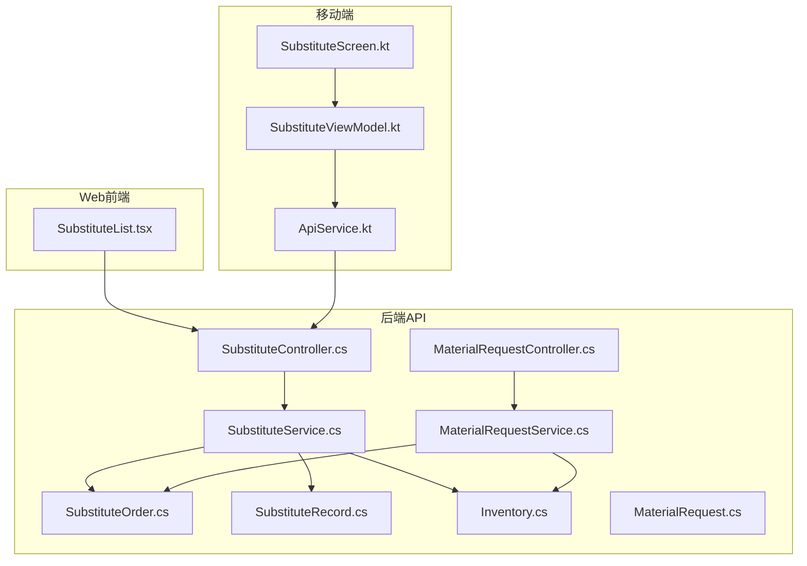
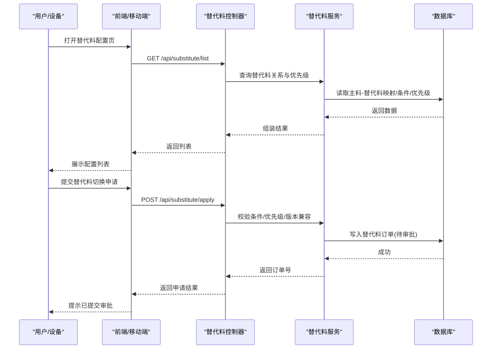
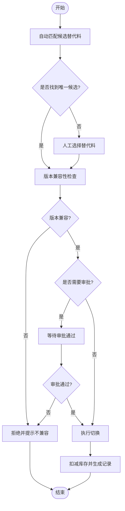
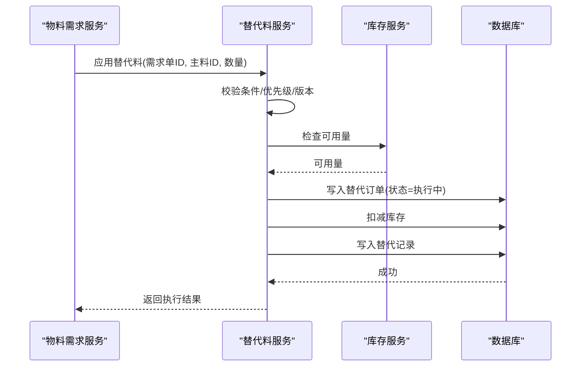
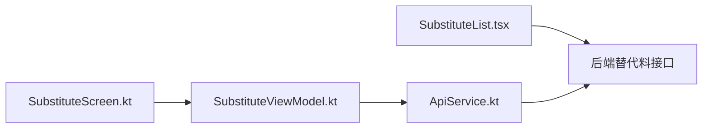
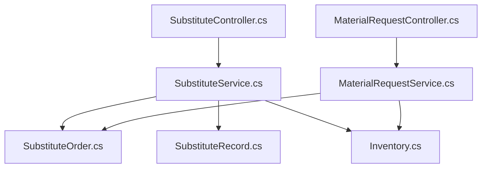

# 替代料管理

<cite>
**本文引用的文件**   
- [SubstituteController.cs](file://dip-system/api/Controllers/SubstituteController.cs)
- [SubstituteService.cs](file://dip-system/api/Services/SubstituteService.cs)
- [SubstituteOrder.cs](file://dip-system/api/Models/SubstituteOrder.cs)
- [SubstituteRecord.cs](file://dip-system/api/Models/SubstituteRecord.cs)
- [Inventory.cs](file://dip-system/api/Models/Inventory.cs)
- [MaterialRequestController.cs](file://dip-system/api/Controllers/MaterialRequestController.cs)
- [MaterialRequestService.cs](file://dip-system/api/Services/MaterialRequestService.cs)
- [MaterialRequest.cs](file://dip-system/api/Models/MaterialRequest.cs)
- [SubstituteList.tsx](file://dip-system/frontend-web/src/pages/SubstituteList.tsx)
- [ApiService.kt](file://mobile-android/app/src/main/java/com/dip/material/data/network/ApiService.kt)
- [SubstituteScreen.kt](file://mobile-android/app/src/main/java/com/dip/material/ui/substitute/SubstituteScreen.kt)
- [SubstituteViewModel.kt](file://mobile-android/app/src/main/java/com/dip/material/ui/substitute/SubstituteViewModel.kt)
- [2026-07-13-substitute-redesign-plan.md](file://dip-system/docs/superpowers/plans/2026-07-13-substitute-redesign-plan.md)
</cite>

## 目录
1. [简介](#简介)
2. [项目结构](#项目结构)
3. [核心组件](#核心组件)
4. [架构总览](#架构总览)
5. [详细组件分析](#详细组件分析)
6. [依赖关系分析](#依赖关系分析)
7. [性能考虑](#性能考虑)
8. [故障排查指南](#故障排查指南)
9. [结论](#结论)
10. [附录](#附录)

## 简介
本文件围绕“替代料管理”功能，系统化阐述替代料的定义、配置、审批与使用流程；说明主料与替代料的关系建立规则（对应关系、使用条件限制、优先级设置等）；文档化替代料切换的业务逻辑（自动匹配、人工干预、版本兼容性检查）；并覆盖使用记录、效果评估、成本分析、质量控制、供应商管理与库存影响等关联业务。同时提供配置界面要点、使用流程图与异常处理方案，帮助产品、研发与运维人员快速理解与落地。

## 项目结构
替代料能力贯穿后端 API、前端 Web 与移动端 Android：
- 后端 API（C#）：控制器负责路由与参数校验，服务层实现核心业务逻辑（匹配、审批、切换、记录），模型承载订单与记录数据。
- 前端 Web（React/TypeScript）：提供替代料配置与查询页面，调用后端接口完成增删改查与操作。
- 移动端（Android/Kotlin）：在物料呼叫、备料等场景中支持替代料选择与确认，扫码/输入后触发后端匹配与切换。



图表来源
- [SubstituteController.cs](file://dip-system/api/Controllers/SubstituteController.cs)
- [SubstituteService.cs](file://dip-system/api/Services/SubstituteService.cs)
- [SubstituteOrder.cs](file://dip-system/api/Models/SubstituteOrder.cs)
- [SubstituteRecord.cs](file://dip-system/api/Models/SubstituteRecord.cs)
- [Inventory.cs](file://dip-system/api/Models/Inventory.cs)
- [MaterialRequestController.cs](file://dip-system/api/Controllers/MaterialRequestController.cs)
- [MaterialRequestService.cs](file://dip-system/api/Services/MaterialRequestService.cs)
- [MaterialRequest.cs](file://dip-system/api/Models/MaterialRequest.cs)
- [SubstituteList.tsx](file://dip-system/frontend-web/src/pages/SubstituteList.tsx)
- [ApiService.kt](file://mobile-android/app/src/main/java/com/dip/material/data/network/ApiService.kt)
- [SubstituteScreen.kt](file://mobile-android/app/src/main/java/com/dip/material/ui/substitute/SubstituteScreen.kt)
- [SubstituteViewModel.kt](file://mobile-android/app/src/main/java/com/dip/material/ui/substitute/SubstituteViewModel.kt)

章节来源
- [2026-07-13-substitute-redesign-plan.md](file://dip-system/docs/superpowers/plans/2026-07-13-substitute-redesign-plan.md)

## 核心组件
- 控制器层
  - 替代料控制器：暴露替代料配置的增删改查、生效控制、批量导入导出等接口。
  - 物料需求控制器：在领料/备料环节集成替代料匹配与切换能力。
- 服务层
  - 替代料服务：实现主料-替代料关系维护、优先级计算、条件校验、自动匹配、审批流、切换执行与记录归档。
  - 物料需求服务：在需求单中应用替代料策略，联动库存扣减与质量追溯。
- 模型层
  - 替代料订单：承载一次替代料切换的上下文（主料、候选替代料、原因、优先级、状态、时间戳等）。
  - 替代料记录：持久化每次实际使用的明细（批次、数量、供应商、质量结果等）。
  - 库存模型：用于替代料切换时的可用量校验与扣减。
  - 物料需求模型：作为替代料应用的载体（工单/领料单/补料单等）。

章节来源
- [SubstituteController.cs](file://dip-system/api/Controllers/SubstituteController.cs)
- [SubstituteService.cs](file://dip-system/api/Services/SubstituteService.cs)
- [SubstituteOrder.cs](file://dip-system/api/Models/SubstituteOrder.cs)
- [SubstituteRecord.cs](file://dip-system/api/Models/SubstituteRecord.cs)
- [Inventory.cs](file://dip-system/api/Models/Inventory.cs)
- [MaterialRequestController.cs](file://dip-system/api/Controllers/MaterialRequestController.cs)
- [MaterialRequestService.cs](file://dip-system/api/Services/MaterialRequestService.cs)
- [MaterialRequest.cs](file://dip-system/api/Models/MaterialRequest.cs)

## 架构总览
替代料管理采用前后端分离与分层架构：
- 前端与移动端通过 REST API 与后端交互，负责展示与交互。
- 控制器接收请求并进行基础校验，委托服务层执行业务。
- 服务层协调模型与外部系统（如库存、质量、供应商），保证一致性。
- 数据持久化由数据库承载，关键操作需事务保障。



图表来源
- [SubstituteController.cs](file://dip-system/api/Controllers/SubstituteController.cs)
- [SubstituteService.cs](file://dip-system/api/Services/SubstituteService.cs)
- [SubstituteOrder.cs](file://dip-system/api/Models/SubstituteOrder.cs)

## 详细组件分析

### 替代料关系与优先级建模
- 主料与替代料的多对多关系：一个主料可对应多个候选替代料，每个替代料具备独立的使用条件与优先级。
- 使用条件限制：包括适用产品/工艺、环境条件、批次范围、有效期、供应商白名单、质量等级等。
- 优先级设置：按策略（默认优先、库存优先、成本优先、质量优先）或手工排序决定匹配顺序。
- 版本兼容性：主料/替代料版本矩阵校验，确保替换不会引发不兼容问题。

```mermaid
classDiagram
class 主料 {
+编号
+名称
+规格
+版本
}
class 替代料 {
+编号
+名称
+规格
+版本
+供应商
+质量等级
}
class 替代关系 {
+主料ID
+替代料ID
+优先级
+使用条件
+生效时间
+失效时间
+状态
}
class 替代订单 {
+订单号
+主料ID
+替代料ID
+原因
+数量
+状态
+创建人
+创建时间
}
class 替代记录 {
+记录ID
+订单号
+批次
+数量
+供应商
+质量结果
+操作人
+操作时间
}
主料 ||--o{ 替代关系 : "拥有"
替代料 ||--o{ 替代关系 : "被映射"
替代关系 ||--o{ 替代订单 : "驱动"
替代订单 ||--o{ 替代记录 : "产生"
```

图表来源
- [SubstituteOrder.cs](file://dip-system/api/Models/SubstituteOrder.cs)
- [SubstituteRecord.cs](file://dip-system/api/Models/SubstituteRecord.cs)

章节来源
- [SubstituteService.cs](file://dip-system/api/Services/SubstituteService.cs)
- [SubstituteOrder.cs](file://dip-system/api/Models/SubstituteOrder.cs)
- [SubstituteRecord.cs](file://dip-system/api/Models/SubstituteRecord.cs)

### 替代料匹配与切换流程
- 自动匹配：根据主料、需求数量、库存可用量、优先级与使用条件，筛选最优替代料。
- 人工干预：当自动匹配失败或存在多条候选时，允许人工选择并补充原因。
- 版本兼容性检查：校验主料与替代料的版本矩阵，防止不兼容替换。
- 审批流：高风险或跨批次的替换需走审批，通过后生效。
- 切换执行：更新需求单中的物料为替代料，扣减库存并生成记录。



图表来源
- [SubstituteService.cs](file://dip-system/api/Services/SubstituteService.cs)
- [Inventory.cs](file://dip-system/api/Models/Inventory.cs)
- [SubstituteOrder.cs](file://dip-system/api/Models/SubstituteOrder.cs)
- [SubstituteRecord.cs](file://dip-system/api/Models/SubstituteRecord.cs)

章节来源
- [SubstituteService.cs](file://dip-system/api/Services/SubstituteService.cs)

### 替代料使用与记录
- 使用场景：物料需求单、备料、出库、返修等节点均可触发替代料应用。
- 记录内容：订单号、主料/替代料信息、批次、数量、供应商、质量结果、操作人与时间。
- 追溯性：通过订单号串联从申请到执行的完整链路，支持审计与复盘。



图表来源
- [MaterialRequestService.cs](file://dip-system/api/Services/MaterialRequestService.cs)
- [SubstituteService.cs](file://dip-system/api/Services/SubstituteService.cs)
- [Inventory.cs](file://dip-system/api/Models/Inventory.cs)
- [SubstituteOrder.cs](file://dip-system/api/Models/SubstituteOrder.cs)
- [SubstituteRecord.cs](file://dip-system/api/Models/SubstituteRecord.cs)

章节来源
- [MaterialRequestController.cs](file://dip-system/api/Controllers/MaterialRequestController.cs)
- [MaterialRequestService.cs](file://dip-system/api/Services/MaterialRequestService.cs)
- [MaterialRequest.cs](file://dip-system/api/Models/MaterialRequest.cs)

### 前端与移动端界面
- Web 配置页：展示替代料关系、优先级、使用条件，支持新增/编辑/启用禁用/导入导出。
- 移动端替代料页：在呼叫/备料环节展示候选替代料，支持扫码/输入后触发匹配与选择。
- 交互要点：加载态、错误提示、审批状态反馈、批量操作确认。



图表来源
- [SubstituteList.tsx](file://dip-system/frontend-web/src/pages/SubstituteList.tsx)
- [SubstituteScreen.kt](file://mobile-android/app/src/main/java/com/dip/material/ui/substitute/SubstituteScreen.kt)
- [SubstituteViewModel.kt](file://mobile-android/app/src/main/java/com/dip/material/ui/substitute/SubstituteViewModel.kt)
- [ApiService.kt](file://mobile-android/app/src/main/java/com/dip/material/data/network/ApiService.kt)

章节来源
- [SubstituteList.tsx](file://dip-system/frontend-web/src/pages/SubstituteList.tsx)
- [SubstituteScreen.kt](file://mobile-android/app/src/main/java/com/dip/material/ui/substitute/SubstituteScreen.kt)
- [SubstituteViewModel.kt](file://mobile-android/app/src/main/java/com/dip/material/ui/substitute/SubstituteViewModel.kt)
- [ApiService.kt](file://mobile-android/app/src/main/java/com/dip/material/data/network/ApiService.kt)

### 质量控制、供应商管理与库存影响
- 质量控制：替代料入库检验、首件确认、过程抽检、不良率统计，记录于替代记录并可回溯。
- 供应商管理：替代料供应商准入、绩效评分、黑名单机制，影响匹配优先级。
- 库存影响：替代料切换导致主料与替代料库存变动，需保证原子性与一致性，避免超卖或缺货。

章节来源
- [SubstituteService.cs](file://dip-system/api/Services/SubstituteService.cs)
- [Inventory.cs](file://dip-system/api/Models/Inventory.cs)
- [SubstituteRecord.cs](file://dip-system/api/Models/SubstituteRecord.cs)

## 依赖关系分析
- 控制器与服务：控制器仅做参数校验与响应封装，核心逻辑下沉至服务层，降低耦合。
- 服务与模型：服务层直接操作替代订单与记录模型，并通过库存模型进行可用性校验。
- 前后端契约：Web 与移动端均通过统一 API 访问替代料能力，保持行为一致。
- 潜在循环依赖：服务层不应反向依赖控制器，避免循环引用。



图表来源
- [SubstituteController.cs](file://dip-system/api/Controllers/SubstituteController.cs)
- [SubstituteService.cs](file://dip-system/api/Services/SubstituteService.cs)
- [SubstituteOrder.cs](file://dip-system/api/Models/SubstituteOrder.cs)
- [SubstituteRecord.cs](file://dip-system/api/Models/SubstituteRecord.cs)
- [Inventory.cs](file://dip-system/api/Models/Inventory.cs)
- [MaterialRequestController.cs](file://dip-system/api/Controllers/MaterialRequestController.cs)
- [MaterialRequestService.cs](file://dip-system/api/Services/MaterialRequestService.cs)

章节来源
- [SubstituteController.cs](file://dip-system/api/Controllers/SubstituteController.cs)
- [SubstituteService.cs](file://dip-system/api/Services/SubstituteService.cs)
- [MaterialRequestController.cs](file://dip-system/api/Controllers/MaterialRequestController.cs)
- [MaterialRequestService.cs](file://dip-system/api/Services/MaterialRequestService.cs)

## 性能考虑
- 匹配算法复杂度：候选替代料数量与条件过滤会影响性能，建议对常用字段建立索引（主料ID、优先级、生效时间）。
- 缓存策略：对热点主料的候选替代料列表与优先级可进行短期缓存，减少重复查询。
- 事务边界：切换执行涉及库存扣减与记录写入，应置于单一事务内，避免部分成功。
- 并发控制：同一主料在同一时刻的切换申请需加锁或版本号控制，防止冲突。

[本节为通用指导，无需代码来源]

## 故障排查指南
- 常见错误
  - 版本不兼容：检查主料与替代料版本矩阵，确认替代料未过期或未纳入认证。
  - 库存不足：核对替代料可用量与安全库存阈值，必要时调整采购计划。
  - 审批失败：查看审批意见与退回原因，修正后再提交。
  - 条件不满足：检查使用条件（产品/工艺/环境/供应商白名单）是否匹配。
- 定位方法
  - 通过替代订单号追踪全流程日志与数据库记录。
  - 检查库存快照与变更记录，确认扣减是否成功。
  - 复核替代关系配置与优先级设置是否正确。
- 恢复措施
  - 回滚事务（若支持），重新执行切换。
  - 调整配置后重试，或降级为主料供应。

章节来源
- [SubstituteService.cs](file://dip-system/api/Services/SubstituteService.cs)
- [SubstituteOrder.cs](file://dip-system/api/Models/SubstituteOrder.cs)
- [SubstituteRecord.cs](file://dip-system/api/Models/SubstituteRecord.cs)
- [Inventory.cs](file://dip-system/api/Models/Inventory.cs)

## 结论
替代料管理通过清晰的模型与分层架构，实现了从配置、匹配、审批到执行与记录的闭环。结合质量控制、供应商管理与库存联动，能够有效提升供应链韧性并降低成本风险。建议在上线前完善索引与缓存策略，强化并发与事务控制，持续优化匹配算法与用户体验。

[本节为总结性内容，无需代码来源]

## 附录
- 配置界面要点
  - 主料-替代料关系维护：支持批量导入、启用/禁用、生效时间段设置。
  - 使用条件配置：产品/工艺/环境/供应商白名单/质量等级等。
  - 优先级策略：默认优先、库存优先、成本优先、质量优先及手工排序。
- 使用流程图
  - 自动匹配→版本检查→审批→执行→记录归档。
- 异常处理方案
  - 版本不兼容、库存不足、审批失败、条件不满足的标准化处理与提示。

[本节为概念性内容，无需代码来源]