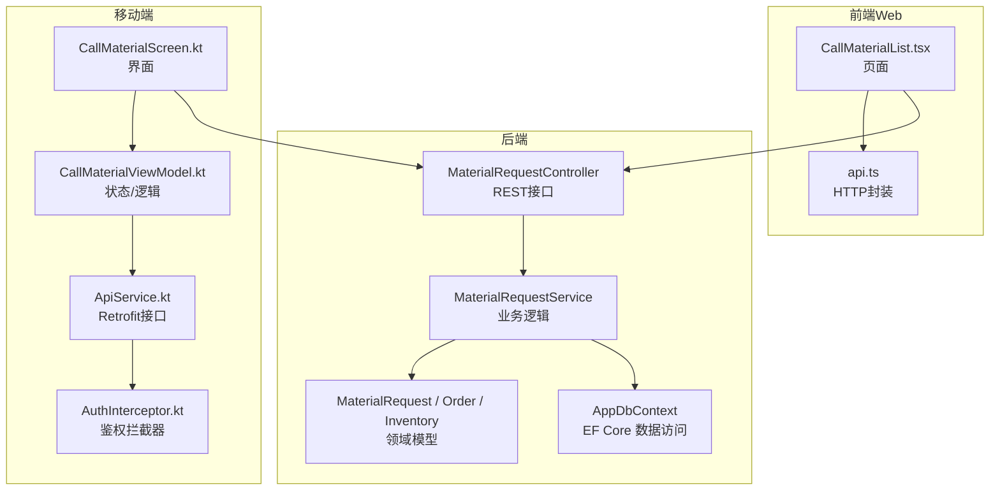
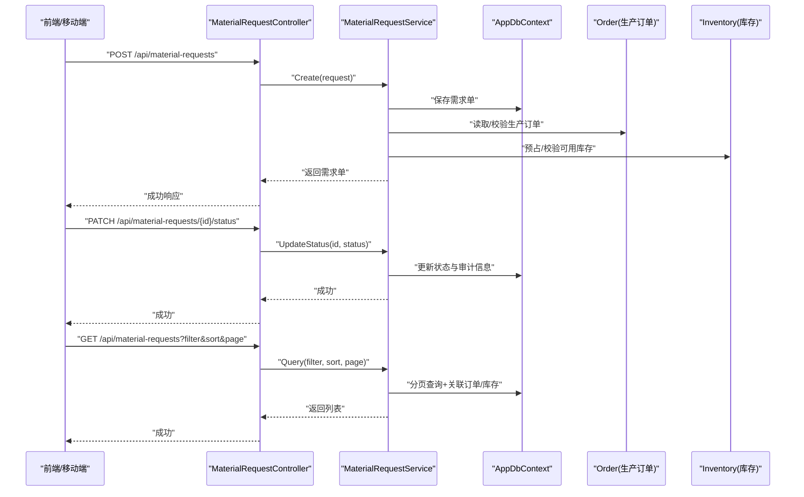
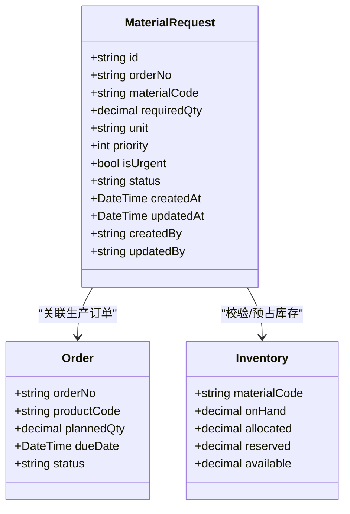
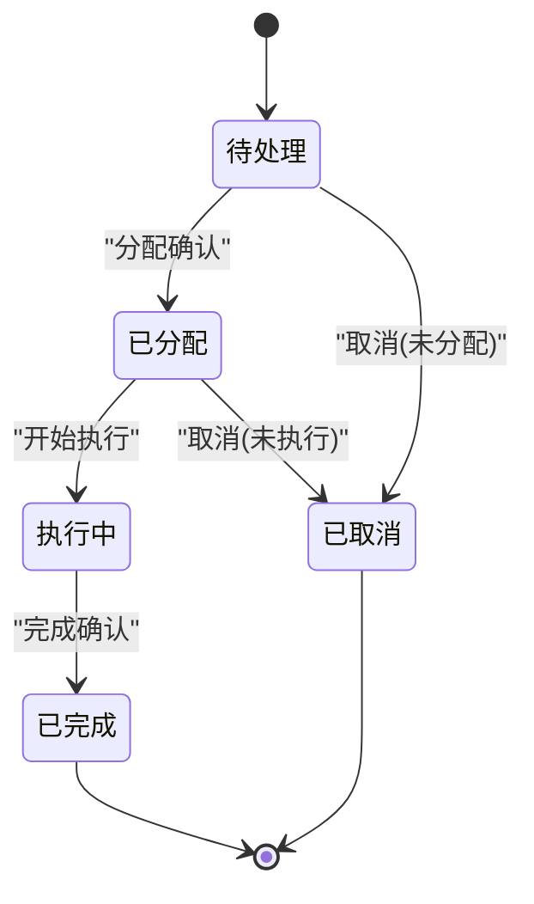
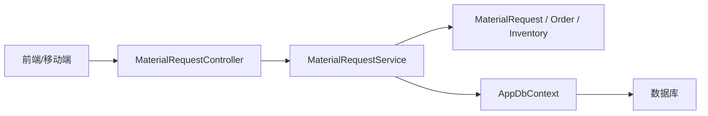

# 物料需求管理

<cite>
**本文引用的文件**   
- [MaterialRequestController.cs](file://dip-system/api/Controllers/MaterialRequestController.cs)
- [MaterialRequestService.cs](file://dip-system/api/Services/MaterialRequestService.cs)
- [MaterialRequest.cs](file://dip-system/api/Models/MaterialRequest.cs)
- [Order.cs](file://dip-system/api/Models/Order.cs)
- [Inventory.cs](file://dip-system/api/Models/Inventory.cs)
- [AppDbContext.cs](file://dip-system/api/Data/AppDbContext.cs)
- [CallMaterialList.tsx](file://dip-system/frontend-web/src/pages/CallMaterialList.tsx)
- [api.ts](file://dip-system/frontend-web/src/lib/api.ts)
- [AuthInterceptor.kt](file://mobile-android/app/src/main/java/com/dip/material/data/network/AuthInterceptor.kt)
- [ApiService.kt](file://mobile-android/app/src/main/java/com/dip/material/data/network/ApiService.kt)
- [CallMaterialScreen.kt](file://mobile-android/app/src/main/java/com/dip/material/ui/callmaterial/CallMaterialScreen.kt)
- [CallMaterialViewModel.kt](file://mobile-android/app/src/main/java/com/dip/material/ui/callmaterial/CallMaterialViewModel.kt)
- [Init DB Script](file://scripts/init-db.sql)
</cite>

## 目录
1. [简介](#简介)
2. [项目结构](#项目结构)
3. [核心组件](#核心组件)
4. [架构总览](#架构总览)
5. [详细组件分析](#详细组件分析)
6. [依赖关系分析](#依赖关系分析)
7. [性能考虑](#性能考虑)
8. [故障排查指南](#故障排查指南)
9. [结论](#结论)
10. [附录](#附录)

## 简介
本文件围绕“物料需求管理”功能，系统化阐述其CRUD操作、状态流转、与生产订单的关联、数量计算规则、批量导入导出、优先级排序与紧急处理、数据验证、权限控制、异常处理，以及前后端API调用与交互流程。目标是帮助开发者与实施人员快速理解并正确使用该模块。

## 项目结构
后端采用ASP.NET Core Web API，分层为控制器（Controllers）、服务（Services）、模型（Models）与数据访问（Data）。前端Web使用React+TypeScript，移动端使用Kotlin+Jetpack Compose。物料需求相关代码主要分布在：
- 后端控制器与服务：MaterialRequestController.cs、MaterialRequestService.cs
- 领域模型：MaterialRequest.cs、Order.cs、Inventory.cs
- 数据上下文：AppDbContext.cs
- 前端页面与API封装：CallMaterialList.tsx、api.ts
- 移动端网络与界面：AuthInterceptor.kt、ApiService.kt、CallMaterialScreen.kt、CallMaterialViewModel.kt

图表来源
- [MaterialRequestController.cs](file://dip-system/api/Controllers/MaterialRequestController.cs)
- [MaterialRequestService.cs](file://dip-system/api/Services/MaterialRequestService.cs)
- [MaterialRequest.cs](file://dip-system/api/Models/MaterialRequest.cs)
- [Order.cs](file://dip-system/api/Models/Order.cs)
- [Inventory.cs](file://dip-system/api/Models/Inventory.cs)
- [AppDbContext.cs](file://dip-system/api/Data/AppDbContext.cs)
- [CallMaterialList.tsx](file://dip-system/frontend-web/src/pages/CallMaterialList.tsx)
- [api.ts](file://dip-system/frontend-web/src/lib/api.ts)
- [ApiService.kt](file://mobile-android/app/src/main/java/com/dip/material/data/network/ApiService.kt)
- [AuthInterceptor.kt](file://mobile-android/app/src/main/java/com/dip/material/data/network/AuthInterceptor.kt)

章节来源
- [MaterialRequestController.cs](file://dip-system/api/Controllers/MaterialRequestController.cs)
- [MaterialRequestService.cs](file://dip-system/api/Services/MaterialRequestService.cs)
- [MaterialRequest.cs](file://dip-system/api/Models/MaterialRequest.cs)
- [Order.cs](file://dip-system/api/Models/Order.cs)
- [Inventory.cs](file://dip-system/api/Models/Inventory.cs)
- [AppDbContext.cs](file://dip-system/api/Data/AppDbContext.cs)
- [CallMaterialList.tsx](file://dip-system/frontend-web/src/pages/CallMaterialList.tsx)
- [api.ts](file://dip-system/frontend-web/src/lib/api.ts)
- [ApiService.kt](file://mobile-android/app/src/main/java/com/dip/material/data/network/ApiService.kt)
- [AuthInterceptor.kt](file://mobile-android/app/src/main/java/com/dip/material/data/network/AuthInterceptor.kt)

## 核心组件
- 控制器层：提供RESTful接口，负责请求校验、参数绑定、结果封装与异常映射。
- 服务层：实现物料需求的创建、查询、更新、删除、分配、执行、完成等业务流程；维护状态机与事务边界；协调库存与订单数据。
- 模型层：定义物料需求单、生产订单、库存等实体及字段约束。
- 数据访问层：通过Entity Framework Core进行持久化，支持分页、过滤、排序与关联查询。
- 前端与移动端：提供用户界面、表单校验、列表展示、批量导入导出、扫码/条码输入、状态筛选与操作按钮。

章节来源
- [MaterialRequestController.cs](file://dip-system/api/Controllers/MaterialRequestController.cs)
- [MaterialRequestService.cs](file://dip-system/api/Services/MaterialRequestService.cs)
- [MaterialRequest.cs](file://dip-system/api/Models/MaterialRequest.cs)
- [Order.cs](file://dip-system/api/Models/Order.cs)
- [Inventory.cs](file://dip-system/api/Models/Inventory.cs)
- [AppDbContext.cs](file://dip-system/api/Data/AppDbContext.cs)
- [CallMaterialList.tsx](file://dip-system/frontend-web/src/pages/CallMaterialList.tsx)
- [api.ts](file://dip-system/frontend-web/src/lib/api.ts)
- [ApiService.kt](file://mobile-android/app/src/main/java/com/dip/material/data/network/ApiService.kt)
- [AuthInterceptor.kt](file://mobile-android/app/src/main/java/com/dip/material/data/network/AuthInterceptor.kt)

## 架构总览
整体采用前后端分离架构，后端以控制器-服务-仓储模式组织，前端与移动端分别通过HTTP调用API。关键流程包括：
- 创建需求：前端/移动端提交表单，后端校验并落库，返回需求单号。
- 分配与执行：仓库或计划员分配资源，状态由待处理变更为已分配、执行中。
- 完成与闭环：执行完成后回写库存消耗，状态变更为已完成。
- 查询与报表：支持多条件筛选、分页、排序与导出。

图表来源
- [MaterialRequestController.cs](file://dip-system/api/Controllers/MaterialRequestController.cs)
- [MaterialRequestService.cs](file://dip-system/api/Services/MaterialRequestService.cs)
- [AppDbContext.cs](file://dip-system/api/Data/AppDbContext.cs)
- [Order.cs](file://dip-system/api/Models/Order.cs)
- [Inventory.cs](file://dip-system/api/Models/Inventory.cs)

## 详细组件分析

### 领域模型与数据流
- 物料需求单（MaterialRequest）：包含需求编号、关联生产订单、物料编码、需求数量、单位、优先级、紧急标识、当前状态、创建/更新时间、操作人等。
- 生产订单（Order）：承载产品、计划数量、交期等信息，用于需求数量的推导与校验。
- 库存（Inventory）：记录物料在库、在途、预留等数量，支撑可用量计算与预占。

图表来源
- [MaterialRequest.cs](file://dip-system/api/Models/MaterialRequest.cs)
- [Order.cs](file://dip-system/api/Models/Order.cs)
- [Inventory.cs](file://dip-system/api/Models/Inventory.cs)

章节来源
- [MaterialRequest.cs](file://dip-system/api/Models/MaterialRequest.cs)
- [Order.cs](file://dip-system/api/Models/Order.cs)
- [Inventory.cs](file://dip-system/api/Models/Inventory.cs)

### 控制器层（API）
- 提供标准CRUD接口：创建、获取详情、分页查询、更新、删除。
- 提供状态变更接口：如“分配”、“开始执行”、“完成”。
- 提供批量导入导出接口：Excel/CSV上传下载。
- 统一异常处理与响应封装。

章节来源
- [MaterialRequestController.cs](file://dip-system/api/Controllers/MaterialRequestController.cs)

### 服务层（业务逻辑）
- 创建需求：校验必填字段、物料编码有效性、生产订单存在性与状态、需求数量合理性；必要时根据BOM或订单展开计算需求数量；对可用库存进行预占或提示不足。
- 查询：支持按订单号、物料编码、状态、优先级、时间范围等多条件筛选；支持分页与排序。
- 更新：仅允许特定状态下的可编辑字段更新；记录审计信息。
- 删除：限制删除条件（如执行中不可删），软删除或硬删除策略依配置。
- 状态机：严格的状态转换规则与权限校验。
- 批量导入：解析文件、逐行校验、汇总错误报告、事务性写入。
- 导出：按筛选条件生成文件流。

章节来源
- [MaterialRequestService.cs](file://dip-system/api/Services/MaterialRequestService.cs)

### 数据访问层（EF Core）
- 通过AppDbContext管理实体映射、关系与迁移。
- 支持复杂查询、连接表、索引优化。
- 事务边界由服务层控制，确保一致性。

章节来源
- [AppDbContext.cs](file://dip-system/api/Data/AppDbContext.cs)

### 前端Web交互
- CallMaterialList.tsx：需求列表展示、筛选、分页、排序、新增/编辑/删除、状态操作、导入导出入口。
- api.ts：统一的HTTP封装，携带认证头、错误提示、重试策略。

章节来源
- [CallMaterialList.tsx](file://dip-system/frontend-web/src/pages/CallMaterialList.tsx)
- [api.ts](file://dip-system/frontend-web/src/lib/api.ts)

### 移动端交互
- CallMaterialScreen.kt：移动端需求录入与操作界面，支持扫码/条码输入、离线缓存、弱网提示。
- CallMaterialViewModel.kt：状态管理、表单校验、网络请求调度。
- ApiService.kt：Retrofit接口定义。
- AuthInterceptor.kt：自动附加Token、刷新令牌、失败重试。

章节来源
- [CallMaterialScreen.kt](file://mobile-android/app/src/main/java/com/dip/material/ui/callmaterial/CallMaterialScreen.kt)
- [CallMaterialViewModel.kt](file://mobile-android/app/src/main/java/com/dip/material/ui/callmaterial/CallMaterialViewModel.kt)
- [ApiService.kt](file://mobile-android/app/src/main/java/com/dip/material/data/network/ApiService.kt)
- [AuthInterceptor.kt](file://mobile-android/app/src/main/java/com/dip/material/data/network/AuthInterceptor.kt)

### 状态流转机制
- 状态集合：待处理、已分配、执行中、已完成（可扩展：已取消、已关闭）。
- 转换规则：
  - 待处理 → 已分配：经计划员/仓管确认分配后。
  - 已分配 → 执行中：仓库领料或产线开始备料时。
  - 执行中 → 已完成：实际消耗确认后，扣减库存并归档。
  - 任意状态 → 已取消：满足条件（如未分配且非执行中）时可取消。
- 约束：
  - 状态变更需记录操作人、时间与原因。
  - 某些状态禁止编辑关键字段（如需求数量、物料编码）。
  - 并发更新需乐观锁或版本号控制。

图表来源
- [MaterialRequestService.cs](file://dip-system/api/Services/MaterialRequestService.cs)

章节来源
- [MaterialRequestService.cs](file://dip-system/api/Services/MaterialRequestService.cs)

### 与生产订单的关联与数量计算
- 关联关系：每个需求单关联一个生产订单号，便于追溯与汇总。
- 数量计算规则：
  - 直接指定：用户在创建时填写需求数量。
  - 基于订单展开：根据产品BOM与计划数量计算各物料需求，考虑损耗率与替代料。
  - 安全库存与在途：结合库存可用量与在途到货，动态调整建议需求数量。
- 校验：
  - 订单必须存在且处于可下需求状态。
  - 需求数量必须大于零且不超过合理上限。
  - 物料编码必须在主数据中存在。

章节来源
- [MaterialRequestService.cs](file://dip-system/api/Services/MaterialRequestService.cs)
- [Order.cs](file://dip-system/api/Models/Order.cs)
- [Inventory.cs](file://dip-system/api/Models/Inventory.cs)

### 批量导入导出
- 导入：
  - 支持Excel/CSV模板下载。
  - 逐行校验：必填项、数据类型、枚举值、关联对象存在性、业务规则。
  - 错误汇总：返回失败明细与行号，支持部分成功。
  - 事务性写入：全部成功或回滚。
- 导出：
  - 按筛选条件导出数据。
  - 大文件分块下载与进度提示。

章节来源
- [MaterialRequestService.cs](file://dip-system/api/Services/MaterialRequestService.cs)
- [MaterialRequestController.cs](file://dip-system/api/Controllers/MaterialRequestController.cs)

### 优先级排序与紧急需求
- 优先级：数值越小优先级越高，或自定义等级（高/中/低）。
- 排序：列表默认按优先级、创建时间、交期等组合排序。
- 紧急需求：
  - 标记紧急后可跳过常规审批或缩短SLA。
  - 特殊通道：优先分配、优先发料、优先执行。
  - 预警：超时未处理告警。

章节来源
- [MaterialRequestService.cs](file://dip-system/api/Services/MaterialRequestService.cs)
- [MaterialRequest.cs](file://dip-system/api/Models/MaterialRequest.cs)

### 数据验证规则
- 必填字段：需求编号、物料编码、需求数量、单位、关联订单号。
- 类型与范围：数量为正数，单位合法，优先级在允许范围内。
- 唯一性：同一订单+物料组合去重（或允许重复但需合并）。
- 关联校验：订单存在且有效，物料在主数据中存在。
- 业务规则：状态变更合法性、编辑权限、删除限制。

章节来源
- [MaterialRequestService.cs](file://dip-system/api/Services/MaterialRequestService.cs)
- [MaterialRequest.cs](file://dip-system/api/Models/MaterialRequest.cs)

### 权限控制策略
- 角色划分：计划员、仓管、产线操作员、管理员等。
- 操作权限：
  - 创建：计划员/授权用户。
  - 分配：仓管/计划员。
  - 执行：产线操作员。
  - 完成：仓管/计划员。
  - 删除：管理员或原创建者（受状态限制）。
- 数据权限：按工厂/仓库/产品线隔离。

章节来源
- [MaterialRequestController.cs](file://dip-system/api/Controllers/MaterialRequestController.cs)
- [MaterialRequestService.cs](file://dip-system/api/Services/MaterialRequestService.cs)

### 异常处理机制
- 输入校验失败：返回明确错误消息与字段定位。
- 业务异常：如库存不足、订单无效、状态非法，返回友好提示。
- 系统异常：数据库连接失败、文件解析错误等，记录日志并返回通用错误码。
- 幂等性：重复提交保护（如基于请求ID或业务键）。

章节来源
- [MaterialRequestController.cs](file://dip-system/api/Controllers/MaterialRequestController.cs)
- [MaterialRequestService.cs](file://dip-system/api/Services/MaterialRequestService.cs)

### API接口调用示例（概念性）
- 创建需求
  - 方法：POST
  - 路径：/api/material-requests
  - 请求体：包含物料编码、需求数量、单位、关联订单号、优先级、紧急标识等
  - 响应：返回需求单号与基本信息
- 查询需求
  - 方法：GET
  - 路径：/api/material-requests
  - 查询参数：orderNo、materialCode、status、priority、dateFrom、dateTo、page、pageSize、sortBy、sortOrder
  - 响应：分页列表与总数
- 更新需求
  - 方法：PUT/PATCH
  - 路径：/api/material-requests/{id}
  - 请求体：可编辑字段（受状态限制）
  - 响应：更新后的需求单
- 删除需求
  - 方法：DELETE
  - 路径：/api/material-requests/{id}
  - 响应：成功或错误原因
- 状态变更
  - 方法：PATCH
  - 路径：/api/material-requests/{id}/status
  - 请求体：目标状态、操作原因
  - 响应：新状态与审计信息
- 批量导入
  - 方法：POST
  - 路径：/api/material-requests/import
  - 请求体：multipart/form-data，文件流
  - 响应：导入结果统计与错误明细
- 批量导出
  - 方法：GET
  - 路径：/api/material-requests/export
  - 查询参数：同查询接口
  - 响应：文件流

章节来源
- [MaterialRequestController.cs](file://dip-system/api/Controllers/MaterialRequestController.cs)
- [MaterialRequestService.cs](file://dip-system/api/Services/MaterialRequestService.cs)

### 前端交互流程（Web）
- 列表页：加载筛选条件、分页数据、排序；支持新增、编辑、删除、状态操作、导入导出。
- 表单页：字段校验、联动选择（如订单→物料→数量建议）、提交与错误提示。
- 操作反馈：成功提示、失败重试、加载态。

章节来源
- [CallMaterialList.tsx](file://dip-system/frontend-web/src/pages/CallMaterialList.tsx)
- [api.ts](file://dip-system/frontend-web/src/lib/api.ts)

### 移动端交互流程
- 扫码录入：扫描条码自动填充物料与数量。
- 离线缓存：弱网环境下暂存草稿，联网后同步。
- 状态操作：一键切换状态，记录操作人与原因。
- 错误处理：网络异常、权限不足、数据冲突提示。

章节来源
- [CallMaterialScreen.kt](file://mobile-android/app/src/main/java/com/dip/material/ui/callmaterial/CallMaterialScreen.kt)
- [CallMaterialViewModel.kt](file://mobile-android/app/src/main/java/com/dip/material/ui/callmaterial/CallMaterialViewModel.kt)
- [ApiService.kt](file://mobile-android/app/src/main/java/com/dip/material/data/network/ApiService.kt)
- [AuthInterceptor.kt](file://mobile-android/app/src/main/java/com/dip/material/data/network/AuthInterceptor.kt)

## 依赖关系分析
- 控制器依赖服务，服务依赖模型与数据上下文。
- 前端与移动端依赖API服务封装与鉴权拦截器。
- 数据库脚本初始化基础数据与表结构。

图表来源
- [MaterialRequestController.cs](file://dip-system/api/Controllers/MaterialRequestController.cs)
- [MaterialRequestService.cs](file://dip-system/api/Services/MaterialRequestService.cs)
- [MaterialRequest.cs](file://dip-system/api/Models/MaterialRequest.cs)
- [Order.cs](file://dip-system/api/Models/Order.cs)
- [Inventory.cs](file://dip-system/api/Models/Inventory.cs)
- [AppDbContext.cs](file://dip-system/api/Data/AppDbContext.cs)
- [Init DB Script](file://scripts/init-db.sql)

章节来源
- [MaterialRequestController.cs](file://dip-system/api/Controllers/MaterialRequestController.cs)
- [MaterialRequestService.cs](file://dip-system/api/Services/MaterialRequestService.cs)
- [MaterialRequest.cs](file://dip-system/api/Models/MaterialRequest.cs)
- [Order.cs](file://dip-system/api/Models/Order.cs)
- [Inventory.cs](file://dip-system/api/Models/Inventory.cs)
- [AppDbContext.cs](file://dip-system/api/Data/AppDbContext.cs)
- [Init DB Script](file://scripts/init-db.sql)

## 性能考虑
- 查询优化：合理使用索引（订单号、物料编码、状态、时间字段），避免全表扫描。
- 分页与懒加载：列表默认分页，详情页按需加载。
- 批量操作：导入导出使用流式处理，减少内存占用。
- 缓存：热点数据（如物料主数据、字典）可缓存提升响应速度。
- 并发控制：乐观锁防止覆盖更新，状态变更加分布式锁（如需）。

[本节为通用指导，不直接分析具体文件]

## 故障排查指南
- 常见错误：
  - 物料编码不存在：检查主数据是否同步。
  - 订单无效或状态不允许：核对订单生命周期。
  - 库存不足：查看可用量与在途，必要时调整需求或提前采购。
  - 状态非法：检查当前状态与目标状态的转换规则。
- 日志与追踪：
  - 后端记录关键操作与异常堆栈。
  - 前端/移动端打印请求ID与错误信息。
- 复现步骤：
  - 提供筛选条件、操作步骤、期望与实际结果。
  - 附上导入文件与错误明细。

章节来源
- [MaterialRequestController.cs](file://dip-system/api/Controllers/MaterialRequestController.cs)
- [MaterialRequestService.cs](file://dip-system/api/Services/MaterialRequestService.cs)

## 结论
物料需求管理模块通过清晰的层次结构与严格的业务规则，实现了从创建到完成的完整闭环。状态机、权限控制、数据验证与异常处理保障了系统的健壮性与可维护性。前后端协同提供了良好的用户体验，批量导入导出与优先级排序提升了效率。建议在后续迭代中持续优化查询性能、完善缓存策略与增强监控告警。

[本节为总结，不直接分析具体文件]

## 附录
- 术语说明：
  - 物料需求单：记录某生产订单所需物料的清单与数量。
  - 生产订单：制造产品的计划任务，驱动物料需求。
  - 库存可用量：在库减去预留与在途影响后的可支配数量。
- 参考脚本：
  - 数据库初始化脚本位于scripts/init-db.sql，用于建表与基础数据。

章节来源
- [Init DB Script](file://scripts/init-db.sql)