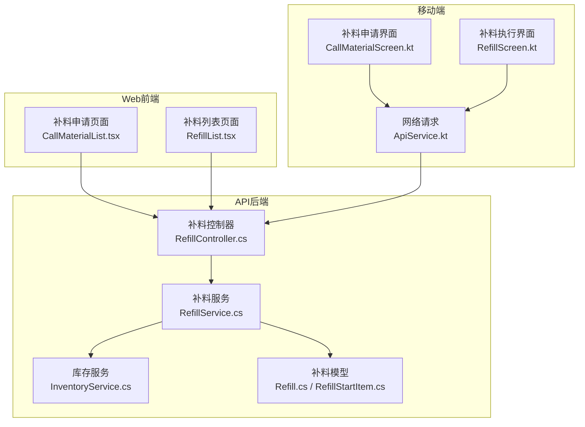
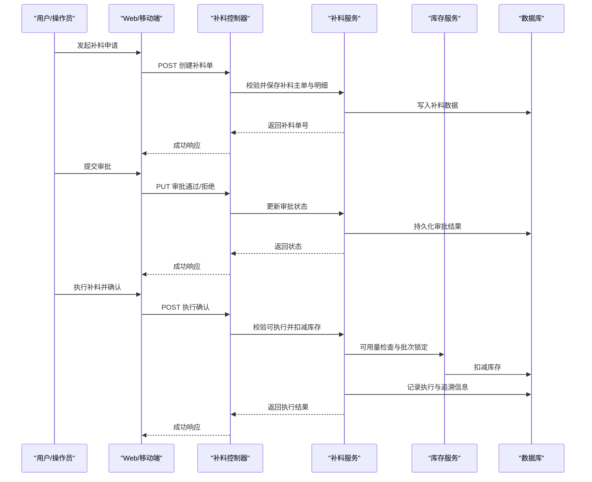
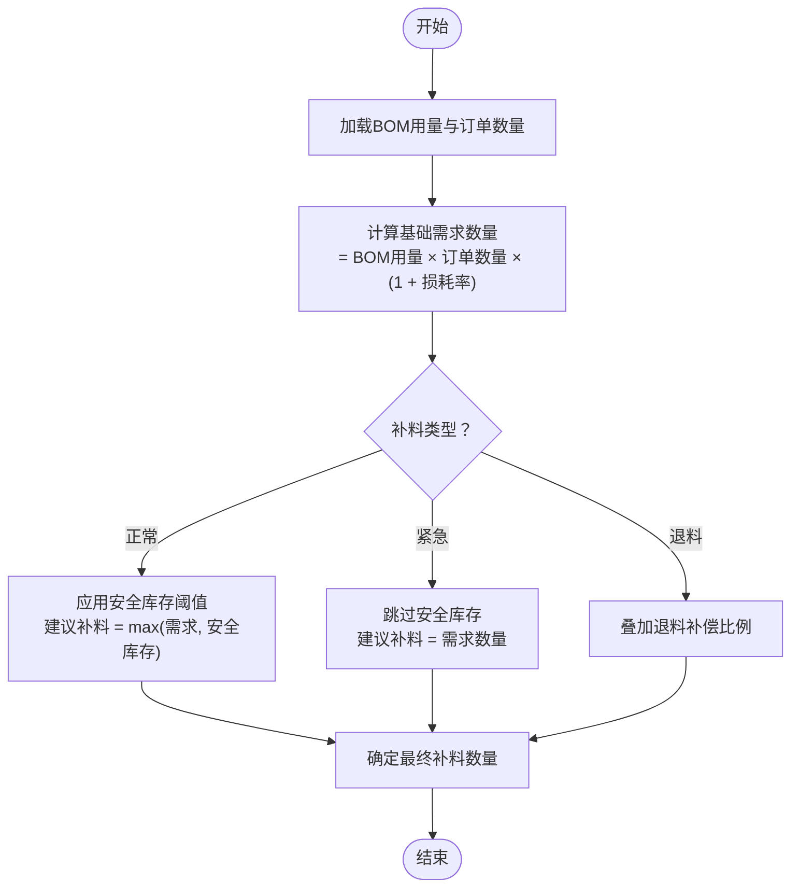
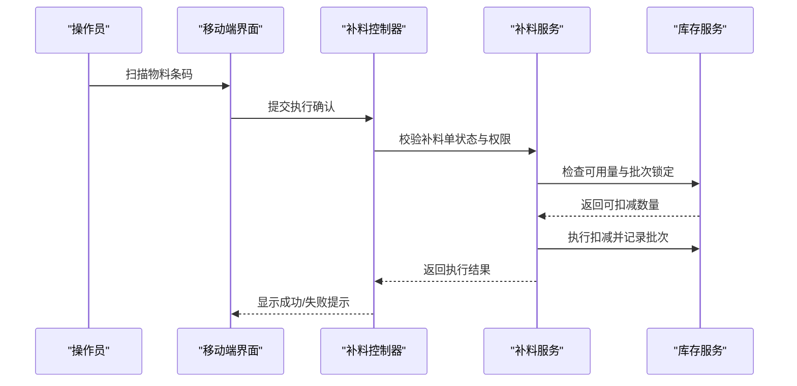
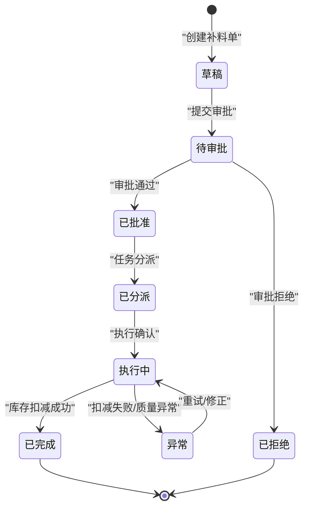
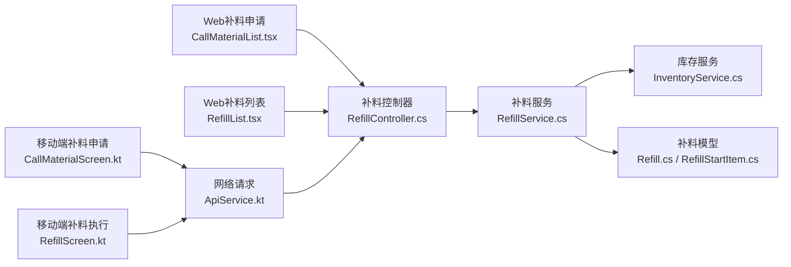

# 补料流程管理

<cite>
**本文引用的文件**   
- [RefillController.cs](file://dip-system/api/Controllers/RefillController.cs)
- [RefillService.cs](file://dip-system/api/Services/RefillService.cs)
- [Refill.cs](file://dip-system/api/Models/Refill.cs)
- [RefillStartItem.cs](file://dip-system/api/Models/RefillStartItem.cs)
- [MaterialRequestController.cs](file://dip-system/api/Controllers/MaterialRequestController.cs)
- [MaterialRequestService.cs](file://dip-system/api/Services/MaterialRequestService.cs)
- [InventoryService.cs](file://dip-system/api/Services/InventoryService.cs)
- [CallMaterialList.tsx](file://dip-system/frontend-web/src/pages/CallMaterialList.tsx)
- [RefillList.tsx](file://dip-system/frontend-web/src/pages/RefillList.tsx)
- [ApiService.kt](file://mobile-android/app/src/main/java/com/dip/material/data/network/ApiService.kt)
- [CallMaterialScreen.kt](file://mobile-android/app/src/main/java/com/dip/material/ui/callmaterial/CallMaterialScreen.kt)
- [RefillScreen.kt](file://mobile-android/app/src/main/java/com/dip/material/ui/refill/RefillScreen.kt)
</cite>

## 目录
1. [简介](#简介)
2. [项目结构](#项目结构)
3. [核心组件](#核心组件)
4. [架构总览](#架构总览)
5. [详细组件分析](#详细组件分析)
6. [依赖关系分析](#依赖关系分析)
7. [性能考虑](#性能考虑)
8. [故障排查指南](#故障排查指南)
9. [结论](#结论)
10. [附录](#附录)

## 简介
本文件面向“补料流程管理”功能，覆盖从补料申请、审批到执行与库存扣减的完整闭环。文档重点说明三类补料（正常补料、紧急补料、退料补料）的处理差异与特殊规则；给出补料数量计算逻辑（BOM用量、损耗率、安全库存等）；描述任务分派、执行确认、库存扣减等操作；并包含追溯、批次管理与质量检验等质量控制环节。文末提供流程图、状态机图与异常处理方案，帮助开发与业务人员快速理解与落地。

## 项目结构
后端采用 ASP.NET Core API，按控制器-服务-模型分层组织；前端 Web 使用 React + TypeScript；移动端 Android 使用 Kotlin + Compose。补料相关的关键位置如下：
- 控制器层：补料接口定义与入参校验
- 服务层：补料业务编排、审批流、库存扣减、追溯记录
- 模型层：补料主表与明细项
- 前端页面：补料列表、补料申请与执行界面
- 移动端：扫码/扫描触发补料、提交与执行确认

图表来源
- [RefillController.cs](file://dip-system/api/Controllers/RefillController.cs)
- [RefillService.cs](file://dip-system/api/Services/RefillService.cs)
- [InventoryService.cs](file://dip-system/api/Services/InventoryService.cs)
- [Refill.cs](file://dip-system/api/Models/Refill.cs)
- [RefillStartItem.cs](file://dip-system/api/Models/RefillStartItem.cs)
- [CallMaterialList.tsx](file://dip-system/frontend-web/src/pages/CallMaterialList.tsx)
- [RefillList.tsx](file://dip-system/frontend-web/src/pages/RefillList.tsx)
- [ApiService.kt](file://mobile-android/app/src/main/java/com/dip/material/data/network/ApiService.kt)
- [CallMaterialScreen.kt](file://mobile-android/app/src/main/java/com/dip/material/ui/callmaterial/CallMaterialScreen.kt)
- [RefillScreen.kt](file://mobile-android/app/src/main/java/com/dip/material/ui/refill/RefillScreen.kt)

章节来源
- [RefillController.cs](file://dip-system/api/Controllers/RefillController.cs)
- [RefillService.cs](file://dip-system/api/Services/RefillService.cs)
- [Refill.cs](file://dip-system/api/Models/Refill.cs)
- [RefillStartItem.cs](file://dip-system/api/Models/RefillStartItem.cs)
- [CallMaterialList.tsx](file://dip-system/frontend-web/src/pages/CallMaterialList.tsx)
- [RefillList.tsx](file://dip-system/frontend-web/src/pages/RefillList.tsx)
- [ApiService.kt](file://mobile-android/app/src/main/java/com/dip/material/data/network/ApiService.kt)
- [CallMaterialScreen.kt](file://mobile-android/app/src/main/java/com/dip/material/ui/callmaterial/CallMaterialScreen.kt)
- [RefillScreen.kt](file://mobile-android/app/src/main/java/com/dip/material/ui/refill/RefillScreen.kt)

## 核心组件
- 补料控制器（RefillController）
  - 职责：接收补料申请、审批、执行确认等 HTTP 请求，参数校验后委托服务层处理。
  - 关键能力：创建补料单、查询补料列表、更新审批状态、执行扣减与确认。
- 补料服务（RefillService）
  - 职责：编排补料全流程，包括类型判定、数量计算、审批流转、任务分派、执行确认、库存扣减、追溯记录。
  - 关键能力：BOM用量与损耗率计算、安全库存阈值判断、异常分支处理、事务边界控制。
- 库存服务（InventoryService）
  - 职责：统一库存查询与扣减，保证并发安全与一致性。
  - 关键能力：可用量检查、批次锁定、扣减原子性、回滚策略。
- 数据模型（Refill, RefillStartItem）
  - 职责：承载补料主单与明细项信息，支撑审批与执行阶段的数据持久化。
- 前端与移动端
  - Web 端：补料申请与列表展示、审批操作入口。
  - 移动端：现场扫码/扫描触发补料、执行确认与结果反馈。

章节来源
- [RefillController.cs](file://dip-system/api/Controllers/RefillController.cs)
- [RefillService.cs](file://dip-system/api/Services/RefillService.cs)
- [InventoryService.cs](file://dip-system/api/Services/InventoryService.cs)
- [Refill.cs](file://dip-system/api/Models/Refill.cs)
- [RefillStartItem.cs](file://dip-system/api/Models/RefillStartItem.cs)
- [CallMaterialList.tsx](file://dip-system/frontend-web/src/pages/CallMaterialList.tsx)
- [RefillList.tsx](file://dip-system/frontend-web/src/pages/RefillList.tsx)
- [ApiService.kt](file://mobile-android/app/src/main/java/com/dip/material/data/network/ApiService.kt)
- [CallMaterialScreen.kt](file://mobile-android/app/src/main/java/com/dip/material/ui/callmaterial/CallMaterialScreen.kt)
- [RefillScreen.kt](file://mobile-android/app/src/main/java/com/dip/material/ui/refill/RefillScreen.kt)

## 架构总览
补料流程贯穿“申请-审批-执行-扣减-追溯”全链路，前后端通过 REST API 交互，服务层负责业务编排与一致性保障。

图表来源
- [RefillController.cs](file://dip-system/api/Controllers/RefillController.cs)
- [RefillService.cs](file://dip-system/api/Services/RefillService.cs)
- [InventoryService.cs](file://dip-system/api/Services/InventoryService.cs)

## 详细组件分析

### 补料类型与处理差异
- 正常补料
  - 适用场景：计划内或常规生产导致的物料不足。
  - 处理规则：标准审批流，数量基于 BOM 用量与损耗率计算，允许安全库存缓冲。
- 紧急补料
  - 适用场景：产线停线风险或突发缺料。
  - 处理规则：简化审批或授权快速通道，优先执行，必要时先扣减后补审批。
- 退料补料
  - 适用场景：因质量问题或工艺变更退回物料后需重新补料。
  - 处理规则：关联原退料单，数量以退料实际入库为准，可能叠加额外损耗补偿。

章节来源
- [RefillService.cs](file://dip-system/api/Services/RefillService.cs)
- [Refill.cs](file://dip-system/api/Models/Refill.cs)
- [RefillStartItem.cs](file://dip-system/api/Models/RefillStartItem.cs)

### 补料数量计算逻辑
- 基础公式
  - 需求数量 = BOM 用量 × 订单数量 × (1 + 损耗率)
  - 建议补料数量 = max(需求数量, 安全库存阈值)
- 影响因素
  - BOM 用量：由产品结构与工艺路线决定
  - 损耗率：按物料类别或供应商历史统计设定
  - 安全库存：防止波动导致缺料的最小库存
- 特殊情况
  - 紧急补料：可忽略安全库存阈值，直接按需求数量执行
  - 退料补料：在需求数量基础上增加退料补偿比例

图表来源
- [RefillService.cs](file://dip-system/api/Services/RefillService.cs)

章节来源
- [RefillService.cs](file://dip-system/api/Services/RefillService.cs)

### 补料任务分派与执行确认
- 任务分派
  - 依据仓库区域、物料类别、供应商交期进行自动或人工分派
  - 支持批量分派与优先级排序（紧急优先）
- 执行确认
  - 现场扫码/扫描确认物料批次与数量
  - 系统校验可用量与批次有效性，完成库存扣减
  - 生成执行记录与追溯信息（工单、批次、时间戳、操作人）

图表来源
- [RefillController.cs](file://dip-system/api/Controllers/RefillController.cs)
- [RefillService.cs](file://dip-system/api/Services/RefillService.cs)
- [InventoryService.cs](file://dip-system/api/Services/InventoryService.cs)
- [CallMaterialScreen.kt](file://mobile-android/app/src/main/java/com/dip/material/ui/callmaterial/CallMaterialScreen.kt)
- [RefillScreen.kt](file://mobile-android/app/src/main/java/com/dip/material/ui/refill/RefillScreen.kt)

章节来源
- [RefillController.cs](file://dip-system/api/Controllers/RefillController.cs)
- [RefillService.cs](file://dip-system/api/Services/RefillService.cs)
- [InventoryService.cs](file://dip-system/api/Services/InventoryService.cs)
- [CallMaterialScreen.kt](file://mobile-android/app/src/main/java/com/dip/material/ui/callmaterial/CallMaterialScreen.kt)
- [RefillScreen.kt](file://mobile-android/app/src/main/java/com/dip/material/ui/refill/RefillScreen.kt)

### 库存扣减与一致性保障
- 可用量检查：在执行前校验库存是否满足补料需求
- 批次锁定：对指定批次进行临时锁定，避免并发冲突
- 扣减原子性：在同一事务中完成扣减与记录，确保一致性
- 回滚策略：若任一环节失败，整体回滚并提示错误原因

章节来源
- [InventoryService.cs](file://dip-system/api/Services/InventoryService.cs)
- [RefillService.cs](file://dip-system/api/Services/RefillService.cs)

### 追溯、批次管理与质量检验
- 追溯信息
  - 记录工单号、补料单号、物料批次、操作人与时间戳
  - 支持正向追踪（从工单到物料）与反向追溯（从物料到工单）
- 批次管理
  - 支持先进先出（FIFO）或指定批次出库
  - 批次有效期与质检状态联动
- 质量检验
  - 不合格批次禁止扣减，需走异常处理流程
  - 检验结果影响后续补料策略（如提高损耗率）

章节来源
- [RefillService.cs](file://dip-system/api/Services/RefillService.cs)
- [Refill.cs](file://dip-system/api/Models/Refill.cs)
- [RefillStartItem.cs](file://dip-system/api/Models/RefillStartItem.cs)

### 补料状态机

图表来源
- [RefillService.cs](file://dip-system/api/Services/RefillService.cs)
- [Refill.cs](file://dip-system/api/Models/Refill.cs)

## 依赖关系分析
- 控制器依赖服务：补料控制器调用补料服务完成业务编排
- 服务依赖库存：补料服务调用库存服务进行可用量检查与扣减
- 前端与移动端依赖控制器：通过 REST API 进行数据交互
- 模型贯穿全流程：补料主单与明细项在各阶段被读写

图表来源
- [CallMaterialList.tsx](file://dip-system/frontend-web/src/pages/CallMaterialList.tsx)
- [RefillList.tsx](file://dip-system/frontend-web/src/pages/RefillList.tsx)
- [CallMaterialScreen.kt](file://mobile-android/app/src/main/java/com/dip/material/ui/callmaterial/CallMaterialScreen.kt)
- [RefillScreen.kt](file://mobile-android/app/src/main/java/com/dip/material/ui/refill/RefillScreen.kt)
- [ApiService.kt](file://mobile-android/app/src/main/java/com/dip/material/data/network/ApiService.kt)
- [RefillController.cs](file://dip-system/api/Controllers/RefillController.cs)
- [RefillService.cs](file://dip-system/api/Services/RefillService.cs)
- [InventoryService.cs](file://dip-system/api/Services/InventoryService.cs)
- [Refill.cs](file://dip-system/api/Models/Refill.cs)
- [RefillStartItem.cs](file://dip-system/api/Models/RefillStartItem.cs)

章节来源
- [CallMaterialList.tsx](file://dip-system/frontend-web/src/pages/CallMaterialList.tsx)
- [RefillList.tsx](file://dip-system/frontend-web/src/pages/RefillList.tsx)
- [CallMaterialScreen.kt](file://mobile-android/app/src/main/java/com/dip/material/ui/callmaterial/CallMaterialScreen.kt)
- [RefillScreen.kt](file://mobile-android/app/src/main/java/com/dip/material/ui/refill/RefillScreen.kt)
- [ApiService.kt](file://mobile-android/app/src/main/java/com/dip/material/data/network/ApiService.kt)
- [RefillController.cs](file://dip-system/api/Controllers/RefillController.cs)
- [RefillService.cs](file://dip-system/api/Services/RefillService.cs)
- [InventoryService.cs](file://dip-system/api/Services/InventoryService.cs)
- [Refill.cs](file://dip-system/api/Models/Refill.cs)
- [RefillStartItem.cs](file://dip-system/api/Models/RefillStartItem.cs)

## 性能考虑
- 批量操作优化：补料申请与执行支持批量提交，减少网络往返
- 并发控制：库存扣减使用锁机制避免超卖
- 缓存策略：常用 BOM 与损耗率配置可缓存提升查询性能
- 异步处理：审批通知与日志记录采用异步队列降低主流程延迟

[本节为通用指导，不直接分析具体文件]

## 故障排查指南
- 常见异常
  - 库存不足：检查可用量与批次锁定状态
  - 审批未通过：确认审批流状态与权限
  - 执行失败：查看执行日志与扣减事务回滚原因
- 定位方法
  - 查看补料单状态与明细
  - 核对 BOM 用量与损耗率配置
  - 检查库存服务日志与数据库事务记录
- 恢复策略
  - 修正配置后重试
  - 调整安全库存阈值
  - 走异常补料流程（紧急通道）

章节来源
- [RefillService.cs](file://dip-system/api/Services/RefillService.cs)
- [InventoryService.cs](file://dip-system/api/Services/InventoryService.cs)

## 结论
补料流程管理通过清晰的三层架构与完善的状态机设计，实现了从申请到执行的闭环管控。三类补料类型差异化处理满足不同场景需求；数量计算逻辑兼顾 BOM、损耗与安全库存；任务分派与执行确认保障现场可操作性；追溯与批次管理强化质量控制。建议在实施中重点关注并发一致性与异常恢复策略，以提升系统稳定性与用户体验。

[本节为总结性内容，不直接分析具体文件]

## 附录
- 相关控制器与服务参考路径
  - 补料控制器：[RefillController.cs](file://dip-system/api/Controllers/RefillController.cs)
  - 补料服务：[RefillService.cs](file://dip-system/api/Services/RefillService.cs)
  - 库存服务：[InventoryService.cs](file://dip-system/api/Services/InventoryService.cs)
  - 补料模型：[Refill.cs](file://dip-system/api/Models/Refill.cs)、[RefillStartItem.cs](file://dip-system/api/Models/RefillStartItem.cs)
- 前端与移动端参考路径
  - Web 补料申请：[CallMaterialList.tsx](file://dip-system/frontend-web/src/pages/CallMaterialList.tsx)
  - Web 补料列表：[RefillList.tsx](file://dip-system/frontend-web/src/pages/RefillList.tsx)
  - 移动端补料申请：[CallMaterialScreen.kt](file://mobile-android/app/src/main/java/com/dip/material/ui/callmaterial/CallMaterialScreen.kt)
  - 移动端补料执行：[RefillScreen.kt](file://mobile-android/app/src/main/java/com/dip/material/ui/refill/RefillScreen.kt)
  - 网络请求：[ApiService.kt](file://mobile-android/app/src/main/java/com/dip/material/data/network/ApiService.kt)