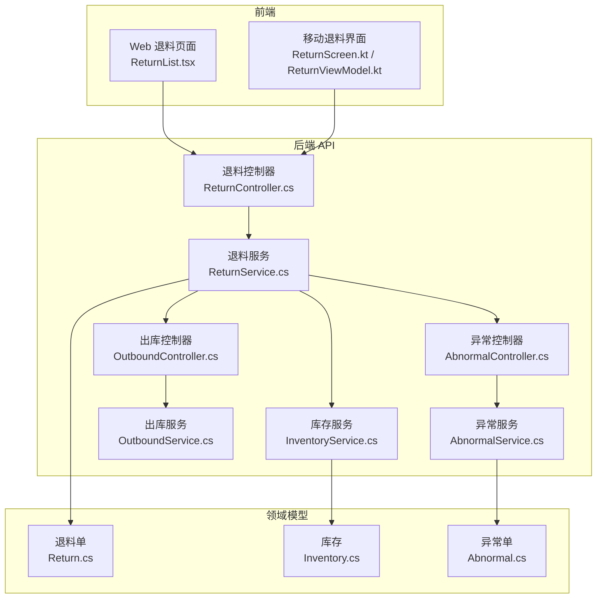
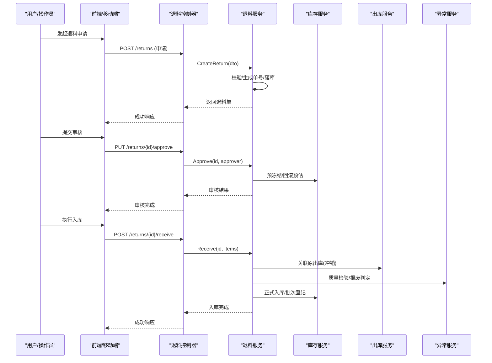
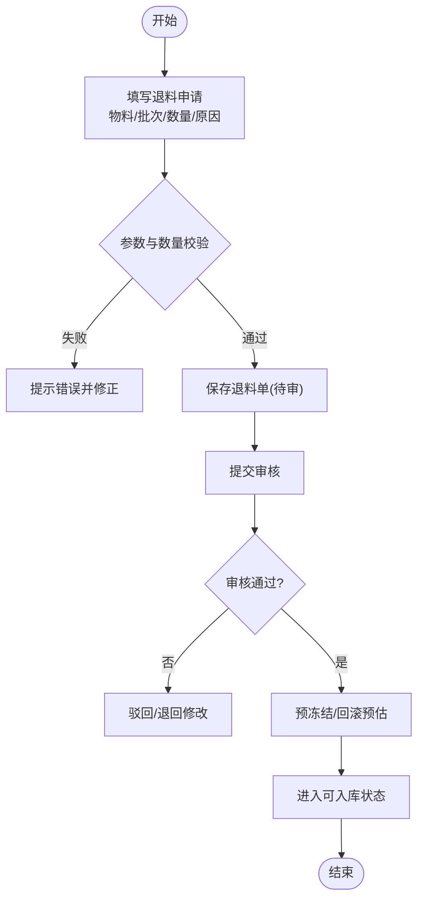
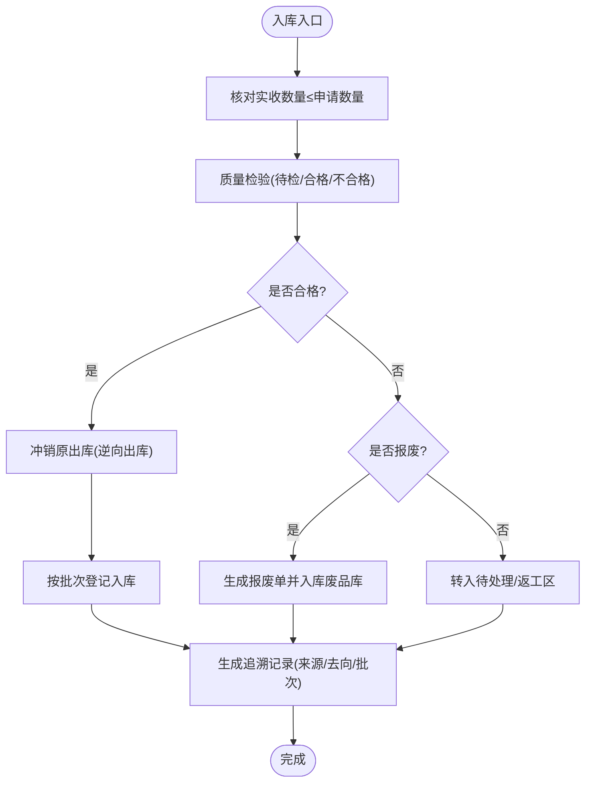
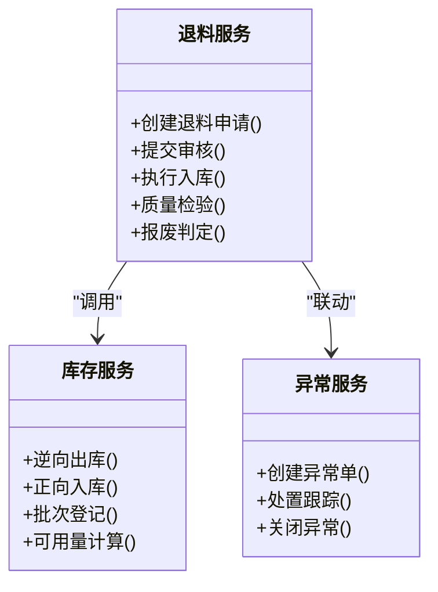
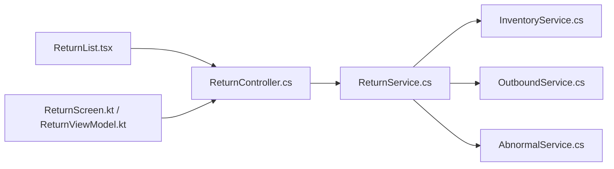

# 退料处理管理

<cite>
**本文引用的文件**   
- [ReturnController.cs](file://dip-system/api/Controllers/ReturnController.cs)
- [ReturnService.cs](file://dip-system/api/Services/ReturnService.cs)
- [Return.cs](file://dip-system/api/Models/Return.cs)
- [InventoryService.cs](file://dip-system/api/Services/InventoryService.cs)
- [Inventory.cs](file://dip-system/api/Models/Inventory.cs)
- [OutboundController.cs](file://dip-system/api/Controllers/OutboundController.cs)
- [OutboundService.cs](file://dip-system/api/Services/OutboundService.cs)
- [AbnormalController.cs](file://dip-system/api/Controllers/AbnormalController.cs)
- [AbnormalService.cs](file://dip-system/api/Services/AbnormalService.cs)
- [Abnormal.cs](file://dip-system/api/Models/Abnormal.cs)
- [ReportService.cs](file://dip-system/api/Services/ReportService.cs)
- [ReturnList.tsx](file://dip-system/frontend-web/src/pages/ReturnList.tsx)
- [ReturnScreen.kt](file://mobile-android/app/src/main/java/com/dip/material/ui/return_/ReturnScreen.kt)
- [ReturnViewModel.kt](file://mobile-android/app/src/main/java/com/dip/material/ui/return_/ReturnViewModel.kt)
- [ApiService.kt](file://mobile-android/app/src/main/java/com/dip/material/data/network/ApiService.kt)
</cite>

## 目录
1. [简介](#简介)
2. [项目结构](#项目结构)
3. [核心组件](#核心组件)
4. [架构总览](#架构总览)
5. [详细组件分析](#详细组件分析)
6. [依赖关系分析](#依赖关系分析)
7. [性能考虑](#性能考虑)
8. [故障排查指南](#故障排查指南)
9. [结论](#结论)
10. [附录](#附录)

## 简介
本文件面向“退料处理管理”功能，覆盖从退料申请、审核到入库的完整业务流程，明确退料原因分类与差异化处理策略，规范退料数量核对、质量检验、报废判定等业务规则，并说明与库存管理的集成（库存回滚、批次管理与追溯记录）。同时提供成本核算、责任追溯、统计分析等管理能力，以及流程图、数据流转图与异常处理机制，帮助开发与业务人员快速理解与落地。

## 项目结构
退料相关能力主要分布在后端 API 控制器与服务层、领域模型、前端页面与移动端界面中：
- 后端 API：退料控制器与退料服务负责请求接入与业务编排；库存服务负责库存回滚与入库；异常服务支持质量异常与报废判定联动。
- 领域模型：退料单、库存、异常等实体承载主数据与过程数据。
- 前端与移动端：退料列表、提交与查询界面，扫码与批量操作入口。

图表来源
- [ReturnController.cs](file://dip-system/api/Controllers/ReturnController.cs)
- [ReturnService.cs](file://dip-system/api/Services/ReturnService.cs)
- [InventoryService.cs](file://dip-system/api/Services/InventoryService.cs)
- [OutboundController.cs](file://dip-system/api/Controllers/OutboundController.cs)
- [OutboundService.cs](file://dip-system/api/Services/OutboundService.cs)
- [AbnormalController.cs](file://dip-system/api/Controllers/AbnormalController.cs)
- [AbnormalService.cs](file://dip-system/api/Services/AbnormalService.cs)
- [Return.cs](file://dip-system/api/Models/Return.cs)
- [Inventory.cs](file://dip-system/api/Models/Inventory.cs)
- [Abnormal.cs](file://dip-system/api/Models/Abnormal.cs)
- [ReturnList.tsx](file://dip-system/frontend-web/src/pages/ReturnList.tsx)
- [ReturnScreen.kt](file://mobile-android/app/src/main/java/com/dip/material/ui/return_/ReturnScreen.kt)
- [ReturnViewModel.kt](file://mobile-android/app/src/main/java/com/dip/material/ui/return_/ReturnViewModel.kt)

章节来源
- [ReturnController.cs](file://dip-system/api/Controllers/ReturnController.cs)
- [ReturnService.cs](file://dip-system/api/Services/ReturnService.cs)
- [Return.cs](file://dip-system/api/Models/Return.cs)
- [InventoryService.cs](file://dip-system/api/Services/InventoryService.cs)
- [Inventory.cs](file://dip-system/api/Models/Inventory.cs)
- [OutboundController.cs](file://dip-system/api/Controllers/OutboundController.cs)
- [OutboundService.cs](file://dip-system/api/Services/OutboundService.cs)
- [AbnormalController.cs](file://dip-system/api/Controllers/AbnormalController.cs)
- [AbnormalService.cs](file://dip-system/api/Services/AbnormalService.cs)
- [Abnormal.cs](file://dip-system/api/Models/Abnormal.cs)
- [ReturnList.tsx](file://dip-system/frontend-web/src/pages/ReturnList.tsx)
- [ReturnScreen.kt](file://mobile-android/app/src/main/java/com/dip/material/ui/return_/ReturnScreen.kt)
- [ReturnViewModel.kt](file://mobile-android/app/src/main/java/com/dip/material/ui/return_/ReturnViewModel.kt)

## 核心组件
- 退料控制器：暴露退料申请、查询、审核、入库等接口，统一参数校验与响应封装。
- 退料服务：编排退料流程，包括状态机推进、数量核对、质量检验、报废判定、库存回滚与入库、异常单联动、审计日志。
- 库存服务：提供库存回滚（冲销原出库）、退料入库（按批次/库位登记）、可用量计算与锁定释放。
- 异常服务：承接质量异常与报废判定，生成异常单并驱动后续处置（返工、让步接收、报废等）。
- 领域模型：退料单、库存、异常单等实体定义关键属性与约束。

章节来源
- [ReturnController.cs](file://dip-system/api/Controllers/ReturnController.cs)
- [ReturnService.cs](file://dip-system/api/Services/ReturnService.cs)
- [InventoryService.cs](file://dip-system/api/Services/InventoryService.cs)
- [AbnormalService.cs](file://dip-system/api/Services/AbnormalService.cs)
- [Return.cs](file://dip-system/api/Models/Return.cs)
- [Inventory.cs](file://dip-system/api/Models/Inventory.cs)
- [Abnormal.cs](file://dip-system/api/Models/Abnormal.cs)

## 架构总览
退料处理采用“控制器-服务-仓储/外部服务”的分层架构，前后端通过 REST 接口交互，移动端通过统一的 API 客户端调用。

图表来源
- [ReturnController.cs](file://dip-system/api/Controllers/ReturnController.cs)
- [ReturnService.cs](file://dip-system/api/Services/ReturnService.cs)
- [InventoryService.cs](file://dip-system/api/Services/InventoryService.cs)
- [OutboundService.cs](file://dip-system/api/Services/OutboundService.cs)
- [AbnormalService.cs](file://dip-system/api/Services/AbnormalService.cs)

## 详细组件分析

### 退料申请与审核流程
- 申请阶段：收集退料明细（物料、批次、数量、原因、来源订单/出库单），进行必填项与数量合理性校验，生成退料单并保存草稿或待审状态。
- 审核阶段：依据退料原因与金额阈值触发不同审批流；审核通过后进入可执行入库阶段；必要时冻结相关库存或预留回滚额度。
- 入库阶段：根据检验结果决定入库类型（良品/次品/待检/报废），更新库存可用量与批次信息，并生成追溯链。

图表来源
- [ReturnController.cs](file://dip-system/api/Controllers/ReturnController.cs)
- [ReturnService.cs](file://dip-system/api/Services/ReturnService.cs)

章节来源
- [ReturnController.cs](file://dip-system/api/Controllers/ReturnController.cs)
- [ReturnService.cs](file://dip-system/api/Services/ReturnService.cs)

### 入库与库存回滚
- 数量核对：退料实收数量不得大于申请数量；允许分多次入库，累计不超过申请数。
- 质量检验：支持待检、合格、不合格、让步接收等状态；不合格触发报废判定或返工流程。
- 库存回滚：优先冲销原出库记录（逆向出库），再按实际入库类型登记新库存；保留批次与追溯码。
- 批次管理：按最小包装/托盘批次登记，支持先进先出/先到期先出策略。

图表来源
- [ReturnService.cs](file://dip-system/api/Services/ReturnService.cs)
- [InventoryService.cs](file://dip-system/api/Services/InventoryService.cs)
- [OutboundService.cs](file://dip-system/api/Services/OutboundService.cs)

章节来源
- [ReturnService.cs](file://dip-system/api/Services/ReturnService.cs)
- [InventoryService.cs](file://dip-system/api/Services/InventoryService.cs)
- [OutboundService.cs](file://dip-system/api/Services/OutboundService.cs)

### 质量检验与报废判定
- 检验规则：按来料检验标准执行，支持抽样比例、全检、免检策略；记录检验员、时间、结论与图片证据。
- 报废判定：对不合格且无法返工的物料触发报废流程，评估残值与损失成本，生成报废单并归档。
- 异常联动：与异常服务打通，形成异常单闭环（发现-处置-验证-关闭）。

图表来源
- [ReturnService.cs](file://dip-system/api/Services/ReturnService.cs)
- [InventoryService.cs](file://dip-system/api/Services/InventoryService.cs)
- [AbnormalService.cs](file://dip-system/api/Services/AbnormalService.cs)

章节来源
- [ReturnService.cs](file://dip-system/api/Services/ReturnService.cs)
- [AbnormalService.cs](file://dip-system/api/Services/AbnormalService.cs)

### 退料原因分类与处理策略
- 质量问题：供应商来料不良、制程损坏等。策略：严格检验、退货索赔、报废或让步接收，计入质量成本。
- 设计变更：BOM/工艺变更导致旧版本物料退料。策略：冻结旧版本库存、替代料切换、变更追溯。
- 生产过剩：计划偏差或订单取消造成余料退料。策略：优先内部调拨、二次利用、折价处理。
- 其他：包装破损、错发漏发等。策略：快速核验、补发/换货、记录异常。

章节来源
- [ReturnService.cs](file://dip-system/api/Services/ReturnService.cs)
- [AbnormalService.cs](file://dip-system/api/Services/AbnormalService.cs)

### 与库存管理的集成
- 库存回滚：基于原出库单逆向冲销，确保账实一致；若部分入库则按比例冲销。
- 批次管理：退料入库保留原始批次或生成新批次，记录来源与去向，支持追溯。
- 可用量与锁定：审核通过后预冻结，入库后释放冻结并增加可用量；不合格品进入受限库位。

章节来源
- [InventoryService.cs](file://dip-system/api/Services/InventoryService.cs)
- [Inventory.cs](file://dip-system/api/Models/Inventory.cs)

### 成本核算与责任追溯
- 成本核算：按退料原因归集成本（质量损失、变更成本、过剩成本），支持按批次/供应商/产线维度统计。
- 责任追溯：记录申请人、审核人、检验员、入库员及系统操作日志，形成审计轨迹。
- 统计分析：退料率、一次合格率、报废率、供应商不良率等指标报表。

章节来源
- [ReportService.cs](file://dip-system/api/Services/ReportService.cs)
- [ReturnService.cs](file://dip-system/api/Services/ReturnService.cs)

### 前端与移动端集成
- Web 端：退料列表页支持查询、筛选、导出与快捷操作。
- 移动端：扫码录入、拍照上传、离线缓存与重试，提升现场效率。

章节来源
- [ReturnList.tsx](file://dip-system/frontend-web/src/pages/ReturnList.tsx)
- [ReturnScreen.kt](file://mobile-android/app/src/main/java/com/dip/material/ui/return_/ReturnScreen.kt)
- [ReturnViewModel.kt](file://mobile-android/app/src/main/java/com/dip/material/ui/return_/ReturnViewModel.kt)
- [ApiService.kt](file://mobile-android/app/src/main/java/com/dip/material/data/network/ApiService.kt)

## 依赖关系分析
退料服务依赖库存服务与异常服务，控制器作为入口统一编排；移动端与 Web 端通过 API 访问控制器。

图表来源
- [ReturnController.cs](file://dip-system/api/Controllers/ReturnController.cs)
- [ReturnService.cs](file://dip-system/api/Services/ReturnService.cs)
- [InventoryService.cs](file://dip-system/api/Services/InventoryService.cs)
- [OutboundService.cs](file://dip-system/api/Services/OutboundService.cs)
- [AbnormalService.cs](file://dip-system/api/Services/AbnormalService.cs)
- [ReturnList.tsx](file://dip-system/frontend-web/src/pages/ReturnList.tsx)
- [ReturnScreen.kt](file://mobile-android/app/src/main/java/com/dip/material/ui/return_/ReturnScreen.kt)
- [ReturnViewModel.kt](file://mobile-android/app/src/main/java/com/dip/material/ui/return_/ReturnViewModel.kt)

章节来源
- [ReturnController.cs](file://dip-system/api/Controllers/ReturnController.cs)
- [ReturnService.cs](file://dip-system/api/Services/ReturnService.cs)
- [InventoryService.cs](file://dip-system/api/Services/InventoryService.cs)
- [OutboundService.cs](file://dip-system/api/Services/OutboundService.cs)
- [AbnormalService.cs](file://dip-system/api/Services/AbnormalService.cs)
- [ReturnList.tsx](file://dip-system/frontend-web/src/pages/ReturnList.tsx)
- [ReturnScreen.kt](file://mobile-android/app/src/main/java/com/dip/material/ui/return_/ReturnScreen.kt)
- [ReturnViewModel.kt](file://mobile-android/app/src/main/java/com/dip/material/ui/return_/ReturnViewModel.kt)

## 性能考虑
- 并发控制：审核与入库操作需加锁避免重复提交与超发。
- 事务边界：退料申请、审核、入库各阶段以事务保证一致性。
- 批量操作：支持批量退料与批量入库，减少网络往返与数据库压力。
- 索引优化：对物料编码、批次号、退料单号、时间范围建立索引，提升查询性能。
- 异步处理：质量检验与报表生成可采用异步任务，降低主流程延迟。

[本节为通用指导，不直接分析具体文件]

## 故障排查指南
- 常见错误
  - 数量超限：实收数量超过申请数量或累计入库超过申请数。
  - 状态冲突：未审核即入库、已入库再次提交等。
  - 库存不足：逆向出库时原出库记录不存在或已被冲销。
  - 权限不足：无审核或入库权限。
- 定位方法
  - 查看退料单状态与操作日志。
  - 检查库存流水与批次记录。
  - 核对异常单与报废单状态。
- 恢复建议
  - 撤销错误入库（如允许）或生成反向调整单。
  - 重新走审核流程或补充必要附件。
  - 联系管理员解锁或修复数据。

章节来源
- [ReturnService.cs](file://dip-system/api/Services/ReturnService.cs)
- [InventoryService.cs](file://dip-system/api/Services/InventoryService.cs)
- [AbnormalService.cs](file://dip-system/api/Services/AbnormalService.cs)

## 结论
退料处理管理通过清晰的流程设计与严格的业务规则，实现了从申请、审核到入库的全链路管控，并与库存、异常、报表等模块深度集成，保障账实一致与可追溯性。建议在生产环境启用完善的审计与监控，持续优化性能与用户体验。

[本节为总结，不直接分析具体文件]

## 附录
- 术语
  - 退料单：记录退料申请与处理过程的单据。
  - 逆向出库：冲销原出库记录的库存操作。
  - 批次：用于追踪物料来源与去向的最小单位。
  - 异常单：记录质量异常与处置过程的单据。
- 参考实现路径
  - 控制器与服务：[ReturnController.cs](file://dip-system/api/Controllers/ReturnController.cs)、[ReturnService.cs](file://dip-system/api/Services/ReturnService.cs)
  - 库存与异常：[InventoryService.cs](file://dip-system/api/Services/InventoryService.cs)、[AbnormalService.cs](file://dip-system/api/Services/AbnormalService.cs)
  - 前端与移动端：[ReturnList.tsx](file://dip-system/frontend-web/src/pages/ReturnList.tsx)、[ReturnScreen.kt](file://mobile-android/app/src/main/java/com/dip/material/ui/return_/ReturnScreen.kt)、[ReturnViewModel.kt](file://mobile-android/app/src/main/java/com/dip/material/ui/return_/ReturnViewModel.kt)、[ApiService.kt](file://mobile-android/app/src/main/java/com/dip/material/data/network/ApiService.kt)