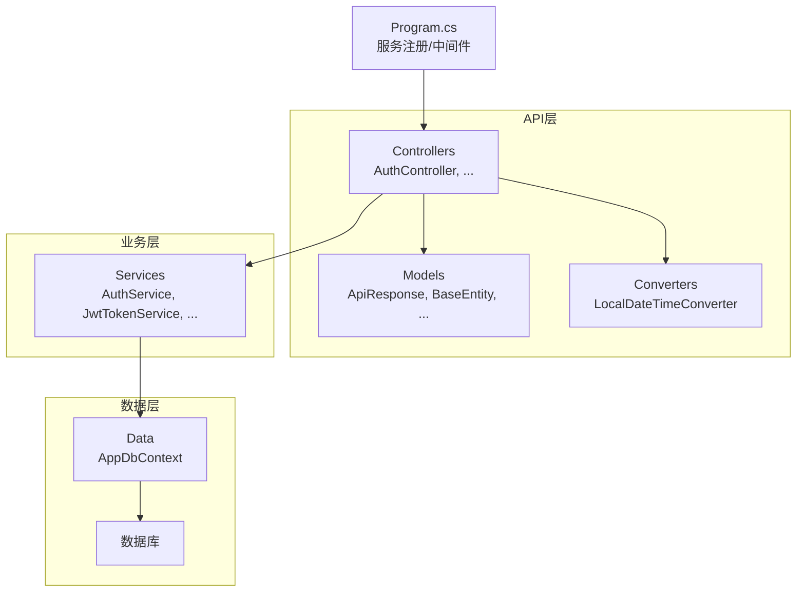
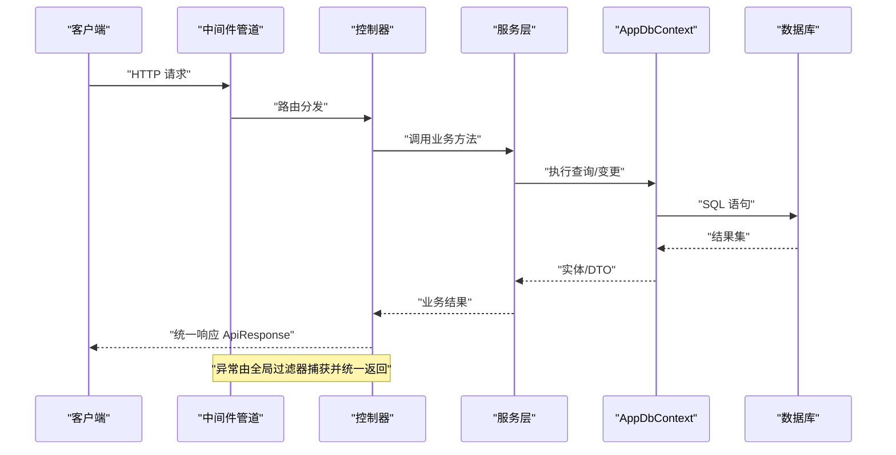
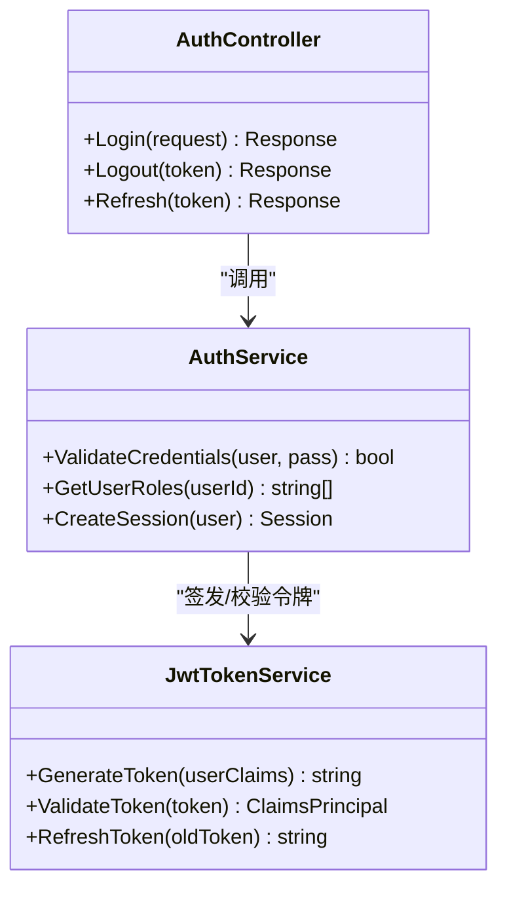
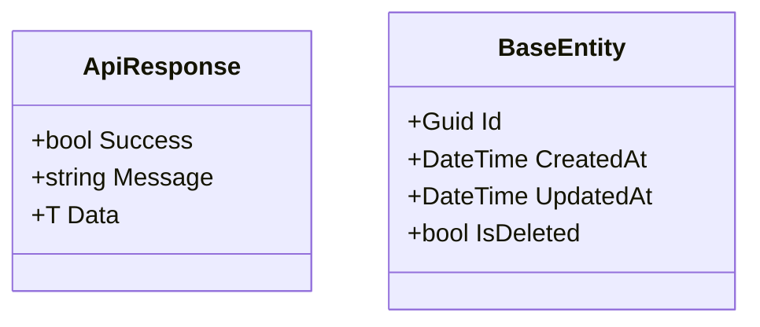
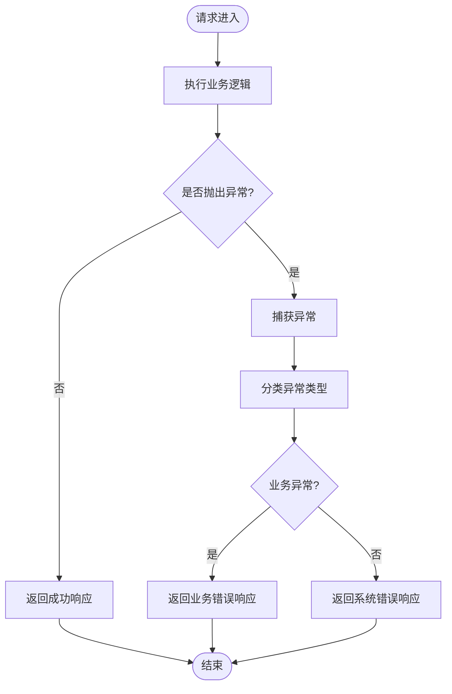
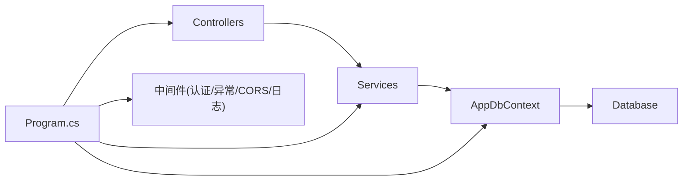

# API架构设计

<cite>
**本文引用的文件**   
- [Program.cs](file://dip-system/api/Program.cs)
- [AppDbContext.cs](file://dip-system/api/Data/AppDbContext.cs)
- [appsettings.json](file://dip-system/api/appsettings.json)
- [AuthController.cs](file://dip-system/api/Controllers/AuthController.cs)
- [AuthService.cs](file://dip-system/api/Services/AuthService.cs)
- [JwtTokenService.cs](file://dip-system/api/Services/JwtTokenService.cs)
- [AppExceptionFilter.cs](file://dip-system/api/Controllers/AppExceptionFilter.cs)
- [ApiResponse.cs](file://dip-system/api/Models/ApiResponse.cs)
- [BaseEntity.cs](file://dip-system/api/Models/BaseEntity.cs)
- [DIP.Api.csproj](file://dip-system/api/DIP.Api.csproj)
</cite>

## 目录
1. [简介](#简介)
2. [项目结构](#项目结构)
3. [核心组件](#核心组件)
4. [架构总览](#架构总览)
5. [详细组件分析](#详细组件分析)
6. [依赖关系分析](#依赖关系分析)
7. [性能考虑](#性能考虑)
8. [故障排查指南](#故障排查指南)
9. [结论](#结论)
10. [附录](#附录)

## 简介
本文件面向DIP系统的API架构，聚焦基于.NET Core的RESTful分层设计与实现。内容涵盖：
- Program.cs中的服务注册、中间件配置与依赖注入容器设置
- AppDbContext数据库上下文与Entity Framework Core使用模式
- 应用启动流程、环境变量与配置文件管理策略
- CORS跨域、日志记录、异常处理等横切关注点
- 扩展点与最佳实践建议

## 项目结构
DIP.Api采用典型的三层（控制器-服务-数据）+ 模型/转换器/配置的组织方式：
- Controllers：HTTP端点与请求路由
- Services：业务逻辑与服务编排
- Data：EF Core DbContext与数据访问
- Models：实体、DTO与统一响应封装
- Converters：序列化/反序列化定制
- Properties/launchSettings.json：本地运行配置
- appsettings.json：应用配置
- Program.cs：应用入口、服务注册、中间件管线

图表来源
- [Program.cs](file://dip-system/api/Program.cs)
- [AppDbContext.cs](file://dip-system/api/Data/AppDbContext.cs)
- [AuthController.cs](file://dip-system/api/Controllers/AuthController.cs)
- [AuthService.cs](file://dip-system/api/Services/AuthService.cs)
- [JwtTokenService.cs](file://dip-system/api/Services/JwtTokenService.cs)
- [ApiResponse.cs](file://dip-system/api/Models/ApiResponse.cs)
- [BaseEntity.cs](file://dip-system/api/Models/BaseEntity.cs)

章节来源
- [DIP.Api.csproj](file://dip-system/api/DIP.Api.csproj)

## 核心组件
- Program.cs：负责构建Web主机、加载配置、注册服务、配置中间件管道（CORS、认证、授权、异常处理、日志等），并启动应用。
- AppDbContext：定义EF Core上下文，映射实体到数据库表，提供DbSet集合与迁移支持。
- 控制器与服务：控制器接收HTTP请求，调用服务完成业务编排；服务协调领域逻辑与数据访问。
- 统一响应模型：ApiResponse用于标准化API返回结构。
- JWT令牌服务：负责令牌签发与校验相关能力。
- 全局异常过滤器：集中捕获未处理异常，统一返回错误信息。

章节来源
- [Program.cs](file://dip-system/api/Program.cs)
- [AppDbContext.cs](file://dip-system/api/Data/AppDbContext.cs)
- [AuthController.cs](file://dip-system/api/Controllers/AuthController.cs)
- [AuthService.cs](file://dip-system/api/Services/AuthService.cs)
- [JwtTokenService.cs](file://dip-system/api/Services/JwtTokenService.cs)
- [AppExceptionFilter.cs](file://dip-system/api/Controllers/AppExceptionFilter.cs)
- [ApiResponse.cs](file://dip-system/api/Models/ApiResponse.cs)

## 架构总览
下图展示从HTTP请求进入，经过中间件、控制器、服务、数据访问到数据库的完整链路，以及异常与日志的横切处理。

图表来源
- [Program.cs](file://dip-system/api/Program.cs)
- [AuthController.cs](file://dip-system/api/Controllers/AuthController.cs)
- [AuthService.cs](file://dip-system/api/Services/AuthService.cs)
- [AppDbContext.cs](file://dip-system/api/Data/AppDbContext.cs)

## 详细组件分析

### Program.cs：服务注册与中间件配置
- 服务注册
  - 通过依赖注入容器注册控制器、服务、数据上下文、JWT、缓存、日志等。
  - 典型模式：按生命周期（瞬时/作用域/单例）注册接口与实现。
- 中间件管线
  - 启用静态文件、路由、认证/授权、异常处理、CORS、日志等。
  - 顺序关键：认证应在路由之后、业务之前；异常处理应尽早注册以捕获全局异常。
- 配置加载
  - 从appsettings.json与环境变量合并加载，支持多环境覆盖。
- CORS
  - 允许指定源、方法与头，便于前后端分离开发调试。
- 日志
  - 集成结构化日志，可按级别输出到控制台或文件。

章节来源
- [Program.cs](file://dip-system/api/Program.cs)
- [appsettings.json](file://dip-system/api/appsettings.json)

### AppDbContext：EF Core数据上下文
- 实体映射
  - 通过DbSet<T>暴露聚合根与实体集合，OnModelCreating中配置关系、索引、约束。
- 连接字符串
  - 从配置系统读取数据库连接字符串，支持不同环境切换。
- 事务与并发
  - 在需要时开启事务；对高频更新场景可引入乐观并发控制。
- 性能优化
  - 按需Select投影、避免N+1查询、合理使用AsNoTracking提升读性能。

章节来源
- [AppDbContext.cs](file://dip-system/api/Data/AppDbContext.cs)
- [appsettings.json](file://dip-system/api/appsettings.json)

### 认证与授权：AuthController与JwtTokenService
- AuthController
  - 提供登录、登出、刷新等端点，验证凭据后签发JWT。
- AuthService
  - 封装用户校验、权限检查、会话管理等业务逻辑。
- JwtTokenService
  - 负责令牌生成、签名、过期策略与解析。

图表来源
- [AuthController.cs](file://dip-system/api/Controllers/AuthController.cs)
- [AuthService.cs](file://dip-system/api/Services/AuthService.cs)
- [JwtTokenService.cs](file://dip-system/api/Services/JwtTokenService.cs)

章节来源
- [AuthController.cs](file://dip-system/api/Controllers/AuthController.cs)
- [AuthService.cs](file://dip-system/api/Services/AuthService.cs)
- [JwtTokenService.cs](file://dip-system/api/Services/JwtTokenService.cs)

### 统一响应与基础实体
- ApiResponse
  - 标准化成功/失败响应结构，包含状态码、消息与数据体。
- BaseEntity
  - 为所有实体提供通用字段（如Id、创建时间、更新时间、是否删除等）。

图表来源
- [ApiResponse.cs](file://dip-system/api/Models/ApiResponse.cs)
- [BaseEntity.cs](file://dip-system/api/Models/BaseEntity.cs)

章节来源
- [ApiResponse.cs](file://dip-system/api/Models/ApiResponse.cs)
- [BaseEntity.cs](file://dip-system/api/Models/BaseEntity.cs)

### 全局异常处理：AppExceptionFilter
- 捕获未处理异常，转换为统一的错误响应格式。
- 记录异常堆栈与上下文信息，便于定位问题。
- 区分业务异常与系统异常，返回合适的HTTP状态码。

图表来源
- [AppExceptionFilter.cs](file://dip-system/api/Controllers/AppExceptionFilter.cs)

章节来源
- [AppExceptionFilter.cs](file://dip-system/api/Controllers/AppExceptionFilter.cs)

### 应用启动流程与环境配置
- 启动流程
  - 构建Host -> 加载配置 -> 注册服务 -> 配置中间件 -> 启动监听。
- 配置管理
  - appsettings.json为基础配置，环境变量覆盖敏感信息与部署差异。
  - launchSettings.json用于本地开发快速启动。
- 环境变量
  - 数据库连接串、JWT密钥、日志级别、CORS白名单等通过环境变量注入。

章节来源
- [Program.cs](file://dip-system/api/Program.cs)
- [appsettings.json](file://dip-system/api/appsettings.json)

## 依赖关系分析
- 控制器依赖服务，服务依赖数据上下文，形成清晰的分层解耦。
- 中间件与横切关注点（认证、异常、日志、CORS）独立于业务逻辑。
- EF Core作为ORM抽象数据库访问，降低与具体数据库实现的耦合。

图表来源
- [Program.cs](file://dip-system/api/Program.cs)
- [AppDbContext.cs](file://dip-system/api/Data/AppDbContext.cs)
- [AuthController.cs](file://dip-system/api/Controllers/AuthController.cs)
- [AuthService.cs](file://dip-system/api/Services/AuthService.cs)

章节来源
- [DIP.Api.csproj](file://dip-system/api/DIP.Api.csproj)

## 性能考虑
- 数据库层面
  - 合理索引与查询投影，避免全表扫描与N+1问题。
  - 读写分离与连接池调优（根据负载调整最大连接数）。
- 内存与缓存
  - 热点数据使用IMemoryCache或分布式缓存减少重复计算与IO。
- 序列化
  - 自定义转换器（如LocalDateTimeConverter）提升序列化效率与兼容性。
- 异步编程
  - 控制器与服务层尽量使用异步I/O，提高吞吐。

[本节为通用指导，不直接分析具体文件]

## 故障排查指南
- 常见问题
  - 数据库连接失败：检查连接字符串与环境变量。
  - CORS拦截：确认允许的源、方法与头。
  - 认证失败：核对JWT密钥与令牌有效期。
  - 异常未捕获：确保全局异常过滤器已注册且顺序正确。
- 诊断手段
  - 启用详细日志与请求跟踪。
  - 使用健康检查端点监控服务可用性。
  - 结合APM工具进行链路追踪与性能分析。

章节来源
- [AppExceptionFilter.cs](file://dip-system/api/Controllers/AppExceptionFilter.cs)
- [Program.cs](file://dip-system/api/Program.cs)

## 结论
DIP.Api采用清晰的三层架构与依赖注入，配合EF Core与JWT认证，形成了可扩展、易维护的RESTful API体系。通过统一响应、全局异常处理与完善的配置管理，提升了系统的稳定性与可观测性。建议在后续迭代中持续优化查询性能、引入缓存与分布式能力，并完善安全策略与审计日志。

[本节为总结性内容，不直接分析具体文件]

## 附录
- 扩展点建议
  - 新增模块：在Controllers与Services下按功能划分，保持单一职责。
  - 数据访问：在AppDbContext中新增DbSet并在OnModelCreating中配置映射。
  - 横切关注点：通过中间件或过滤器扩展（如限流、审计、国际化）。
- 最佳实践
  - 使用DTO隔离外部输入与内部实体。
  - 严格参数校验与输入过滤。
  - 遵循REST命名规范与HTTP语义。
  - 配置最小权限原则与安全默认值。

[本节为概念性内容，不直接分析具体文件]