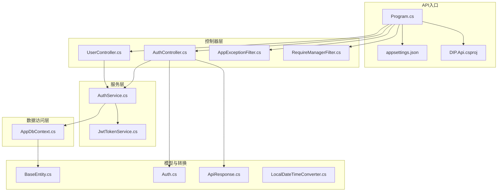
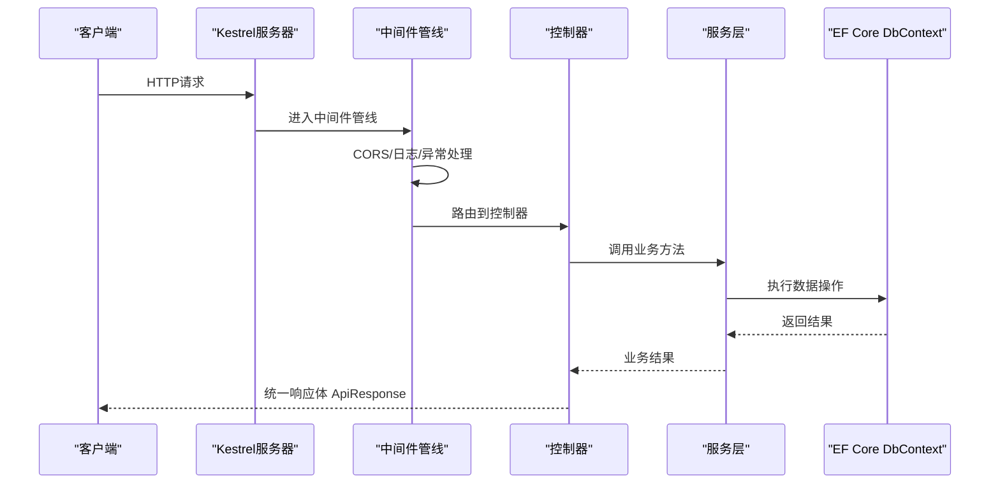
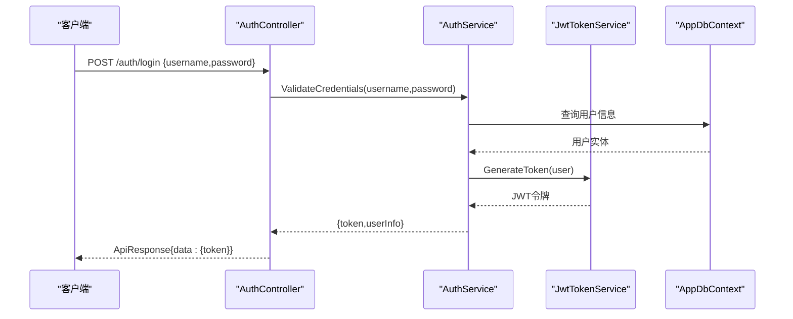
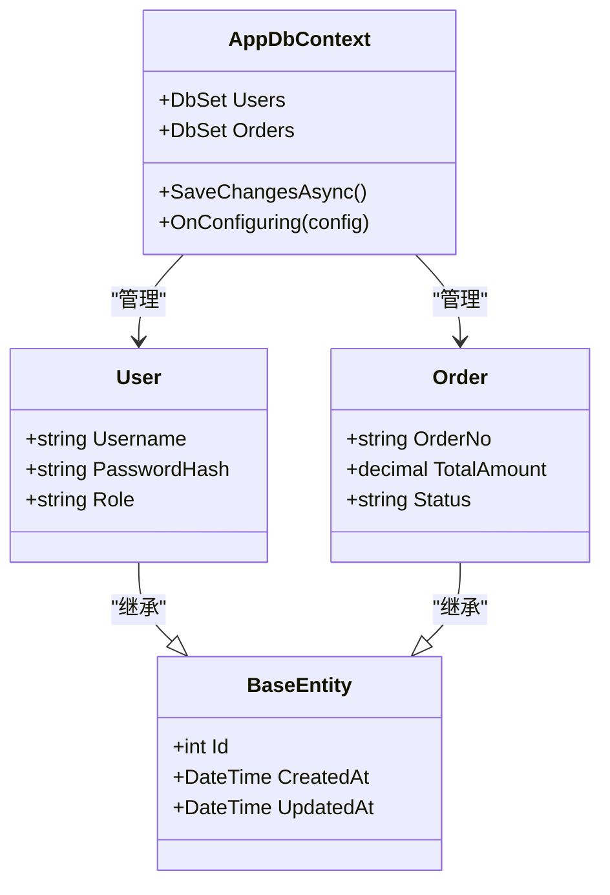
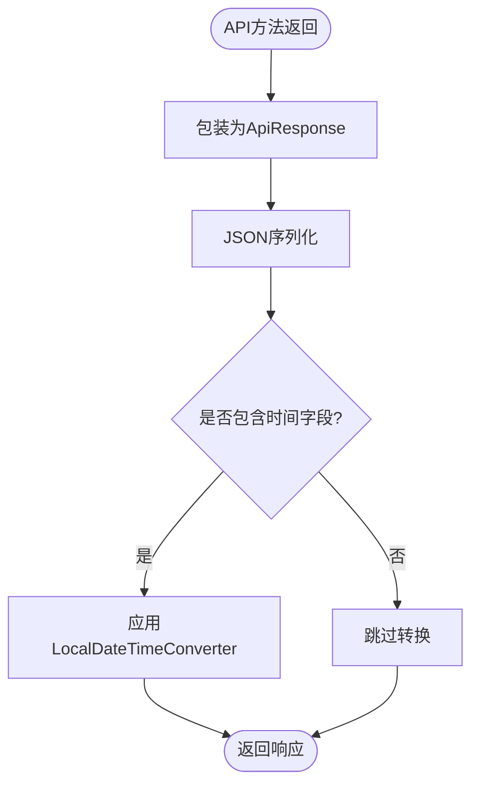
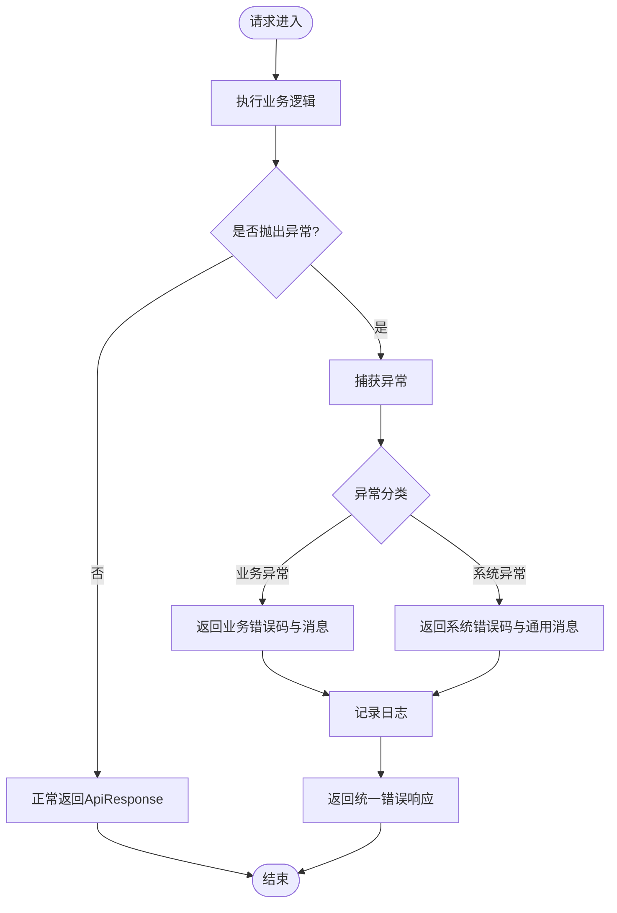
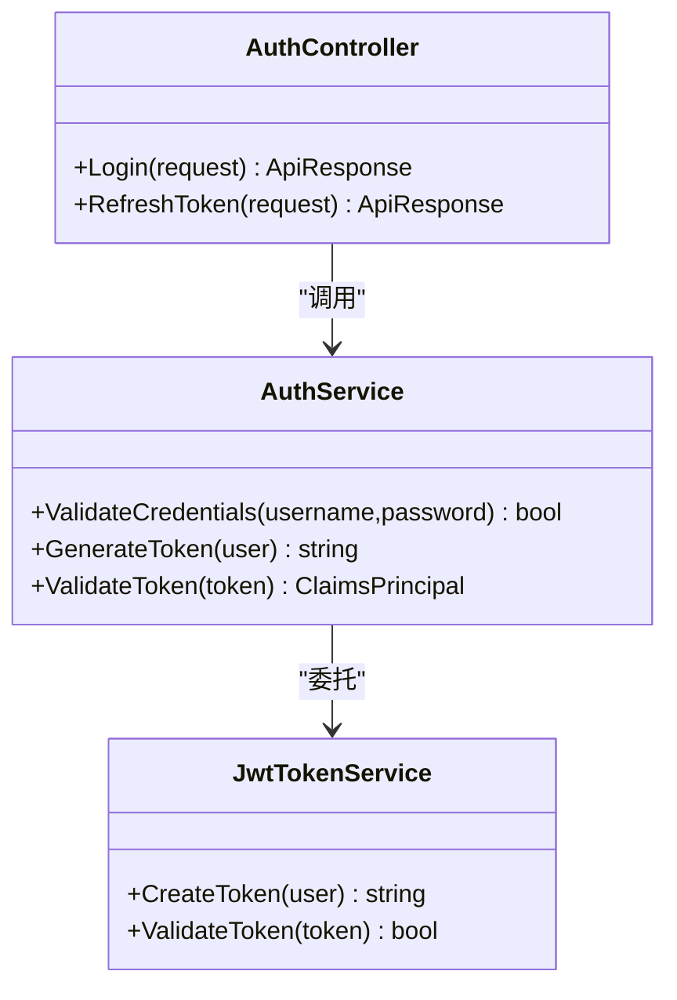
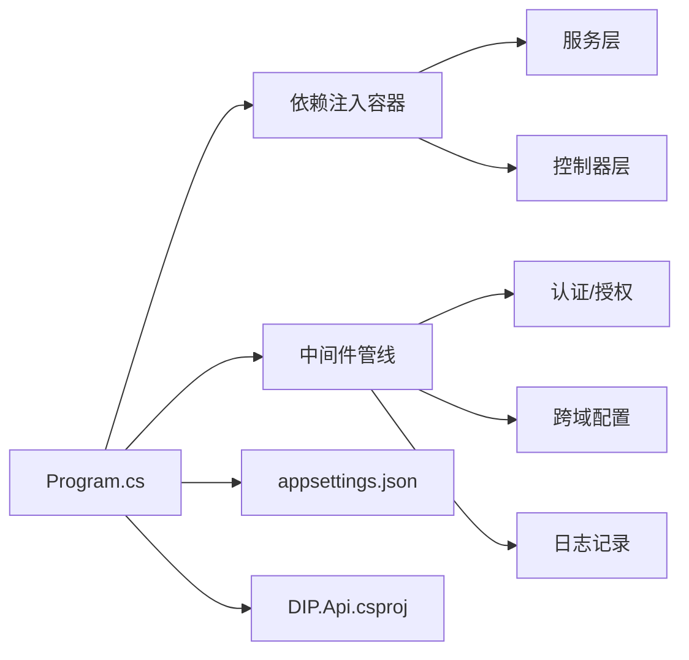

# 后端API服务

<cite>
**本文引用的文件**   
- [Program.cs](file://dip-system/api/Program.cs)
- [appsettings.json](file://dip-system/api/appsettings.json)
- [DIP.Api.csproj](file://dip-system/api/DIP.Api.csproj)
- [AppDbContext.cs](file://dip-system/api/Data/AppDbContext.cs)
- [BaseEntity.cs](file://dip-system/api/Models/BaseEntity.cs)
- [Auth.cs](file://dip-system/api/Models/Auth.cs)
- [ApiResponse.cs](file://dip-system/api/Models/ApiResponse.cs)
- [AuthController.cs](file://dip-system/api/Controllers/AuthController.cs)
- [UserController.cs](file://dip-system/api/Controllers/UserController.cs)
- [AuthService.cs](file://dip-system/api/Services/AuthService.cs)
- [JwtTokenService.cs](file://dip-system/api/Services/JwtTokenService.cs)
- [AppExceptionFilter.cs](file://dip-system/api/Controllers/AppExceptionFilter.cs)
- [RequireManagerFilter.cs](file://dip-system/api/Controllers/RequireManagerFilter.cs)
- [LocalDateTimeConverter.cs](file://dip-system/api/Converters/LocalDateTimeConverter.cs)
</cite>

## 目录
1. [简介](#简介)
2. [项目结构](#项目结构)
3. [核心组件](#核心组件)
4. [架构总览](#架构总览)
5. [详细组件分析](#详细组件分析)
6. [依赖关系分析](#依赖关系分析)
7. [性能考虑](#性能考虑)
8. [故障排查指南](#故障排查指南)
9. [结论](#结论)
10. [附录](#附录)

## 简介
本文件面向DIP系统后端API服务的开发者与维护者，系统化阐述基于.NET Core的RESTful API架构设计。内容覆盖控制器层、服务层、数据访问层的职责分离；JWT身份认证机制与中间件配置；依赖注入容器使用；数据库上下文与实体模型设计；EF Core ORM使用模式；全局异常处理、请求响应格式标准化、API版本控制策略；以及安全配置、CORS设置、日志记录等横切关注点实现细节。同时提供API开发最佳实践与扩展指南，帮助团队在现有代码基础上高效迭代与治理。

## 项目结构
后端API位于dip-system/api目录，采用分层架构：
- Controllers：HTTP端点定义与请求路由
- Services：业务逻辑封装与编排
- Data：EF Core数据库上下文与连接配置
- Models：领域实体、DTO与统一响应体
- Converters：序列化转换器（如时间类型）
- Program.cs与appsettings.json：应用启动、中间件管线与配置

图表来源
- [Program.cs](file://dip-system/api/Program.cs)
- [appsettings.json](file://dip-system/api/appsettings.json)
- [DIP.Api.csproj](file://dip-system/api/DIP.Api.csproj)
- [AuthController.cs](file://dip-system/api/Controllers/AuthController.cs)
- [UserController.cs](file://dip-system/api/Controllers/UserController.cs)
- [AppExceptionFilter.cs](file://dip-system/api/Controllers/AppExceptionFilter.cs)
- [RequireManagerFilter.cs](file://dip-system/api/Controllers/RequireManagerFilter.cs)
- [AuthService.cs](file://dip-system/api/Services/AuthService.cs)
- [JwtTokenService.cs](file://dip-system/api/Services/JwtTokenService.cs)
- [AppDbContext.cs](file://dip-system/api/Data/AppDbContext.cs)
- [BaseEntity.cs](file://dip-system/api/Models/BaseEntity.cs)
- [Auth.cs](file://dip-system/api/Models/Auth.cs)
- [ApiResponse.cs](file://dip-system/api/Models/ApiResponse.cs)
- [LocalDateTimeConverter.cs](file://dip-system/api/Converters/LocalDateTimeConverter.cs)

章节来源
- [Program.cs](file://dip-system/api/Program.cs)
- [appsettings.json](file://dip-system/api/appsettings.json)
- [DIP.Api.csproj](file://dip-system/api/DIP.Api.csproj)

## 核心组件
- 控制器层：对外暴露RESTful接口，负责参数校验、权限检查、调用服务层并返回统一响应体。
- 服务层：承载业务规则与流程编排，协调JWT令牌生成、用户鉴权、数据操作等。
- 数据访问层：通过EF Core DbContext管理数据库连接、实体映射、查询与事务。
- 统一响应体：ApiResponse用于标准化API返回结构，便于前端解析与错误处理。
- JWT令牌服务：负责签发、验证与刷新令牌，配合授权中间件完成身份认证。
- 全局异常过滤器：捕获未处理异常，转换为统一错误响应，提升可观测性与稳定性。
- 自定义授权过滤器：按角色或权限拦截请求，实现细粒度访问控制。
- 序列化转换器：对时间类型进行本地化转换，确保前后端时间一致性。

章节来源
- [AuthController.cs](file://dip-system/api/Controllers/AuthController.cs)
- [UserController.cs](file://dip-system/api/Controllers/UserController.cs)
- [AuthService.cs](file://dip-system/api/Services/AuthService.cs)
- [JwtTokenService.cs](file://dip-system/api/Services/JwtTokenService.cs)
- [AppDbContext.cs](file://dip-system/api/Data/AppDbContext.cs)
- [ApiResponse.cs](file://dip-system/api/Models/ApiResponse.cs)
- [AppExceptionFilter.cs](file://dip-system/api/Controllers/AppExceptionFilter.cs)
- [RequireManagerFilter.cs](file://dip-system/api/Controllers/RequireManagerFilter.cs)
- [LocalDateTimeConverter.cs](file://dip-system/api/Converters/LocalDateTimeConverter.cs)

## 架构总览
整体采用“控制器→服务→数据访问”的分层架构，结合中间件管线实现认证、授权、异常处理、CORS、日志等横切关注点。依赖注入贯穿各层，保证松耦合与可测试性。

图表来源
- [Program.cs](file://dip-system/api/Program.cs)
- [AuthController.cs](file://dip-system/api/Controllers/AuthController.cs)
- [AuthService.cs](file://dip-system/api/Services/AuthService.cs)
- [AppDbContext.cs](file://dip-system/api/Data/AppDbContext.cs)

## 详细组件分析

### 身份认证与授权（JWT + 中间件）
- 登录流程：客户端提交用户名/密码至认证控制器，服务层校验用户凭据后签发JWT令牌，返回给客户端。
- 授权流程：后续请求携带Authorization头，中间件解析并验证令牌，构建ClaimsPrincipal供控制器使用。
- 权限过滤：RequireManagerFilter可按角色或权限拦截请求，实现细粒度控制。

图表来源
- [AuthController.cs](file://dip-system/api/Controllers/AuthController.cs)
- [AuthService.cs](file://dip-system/api/Services/AuthService.cs)
- [JwtTokenService.cs](file://dip-system/api/Services/JwtTokenService.cs)
- [AppDbContext.cs](file://dip-system/api/Data/AppDbContext.cs)

章节来源
- [AuthController.cs](file://dip-system/api/Controllers/AuthController.cs)
- [AuthService.cs](file://dip-system/api/Services/AuthService.cs)
- [JwtTokenService.cs](file://dip-system/api/Services/JwtTokenService.cs)
- [RequireManagerFilter.cs](file://dip-system/api/Controllers/RequireManagerFilter.cs)

### 数据访问与EF Core使用模式
- AppDbContext集中管理数据库连接、实体集合与迁移配置。
- BaseEntity为所有实体提供公共字段（如创建时间、更新时间、主键等），减少重复代码。
- 通过DbSet<T>暴露聚合根，服务层以仓储式方法访问数据，避免直接SQL。

图表来源
- [AppDbContext.cs](file://dip-system/api/Data/AppDbContext.cs)
- [BaseEntity.cs](file://dip-system/api/Models/BaseEntity.cs)

章节来源
- [AppDbContext.cs](file://dip-system/api/Data/AppDbContext.cs)
- [BaseEntity.cs](file://dip-system/api/Models/BaseEntity.cs)

### 统一响应体与序列化转换器
- ApiResponse作为标准返回结构，包含状态码、消息与数据载荷，便于前端一致处理。
- LocalDateTimeConverter用于将时间类型序列化为前端期望的格式，避免时区与格式不一致问题。

图表来源
- [ApiResponse.cs](file://dip-system/api/Models/ApiResponse.cs)
- [LocalDateTimeConverter.cs](file://dip-system/api/Converters/LocalDateTimeConverter.cs)

章节来源
- [ApiResponse.cs](file://dip-system/api/Models/ApiResponse.cs)
- [LocalDateTimeConverter.cs](file://dip-system/api/Converters/LocalDateTimeConverter.cs)

### 全局异常处理
- AppExceptionFilter捕获未处理异常，转换为统一的错误响应，避免泄露内部堆栈。
- 支持区分业务异常与系统异常，返回不同状态码与提示消息。

图表来源
- [AppExceptionFilter.cs](file://dip-system/api/Controllers/AppExceptionFilter.cs)

章节来源
- [AppExceptionFilter.cs](file://dip-system/api/Controllers/AppExceptionFilter.cs)

### 控制器与服务层协作
- 控制器仅负责HTTP契约与参数绑定，复杂逻辑下沉至服务层。
- 服务层组合多个依赖（如JWT服务、数据库上下文），保持单一职责。

图表来源
- [AuthController.cs](file://dip-system/api/Controllers/AuthController.cs)
- [AuthService.cs](file://dip-system/api/Services/AuthService.cs)
- [JwtTokenService.cs](file://dip-system/api/Services/JwtTokenService.cs)

章节来源
- [AuthController.cs](file://dip-system/api/Controllers/AuthController.cs)
- [AuthService.cs](file://dip-system/api/Services/AuthService.cs)
- [JwtTokenService.cs](file://dip-system/api/Services/JwtTokenService.cs)

## 依赖关系分析
- Program.cs中注册服务、中间件与路由，形成依赖注入容器。
- appsettings.json提供数据库连接、JWT密钥、CORS策略等配置。
- DIP.Api.csproj声明项目依赖包，如ASP.NET Core、EF Core、JWT库等。

图表来源
- [Program.cs](file://dip-system/api/Program.cs)
- [appsettings.json](file://dip-system/api/appsettings.json)
- [DIP.Api.csproj](file://dip-system/api/DIP.Api.csproj)

章节来源
- [Program.cs](file://dip-system/api/Program.cs)
- [appsettings.json](file://dip-system/api/appsettings.json)
- [DIP.Api.csproj](file://dip-system/api/DIP.Api.csproj)

## 性能考虑
- 使用异步I/O（async/await）提升吞吐，避免阻塞线程池。
- 合理分页与投影查询，减少不必要的数据传输。
- 缓存热点数据（如字典、配置）以降低数据库压力。
- 启用EF Core查询优化（AsNoTracking、Select投影）。
- 连接池与超时配置需根据负载调优。

[本节为通用指导，不直接分析具体文件]

## 故障排查指南
- 全局异常：查看AppExceptionFilter输出日志，定位异常类型与堆栈。
- 认证失败：检查JWT密钥、过期时间与Claims是否正确。
- 数据库连接：确认appsettings.json中的连接字符串与网络可达性。
- CORS错误：核对允许的源、方法与头部配置。
- 性能问题：启用慢查询日志，分析EF Core生成的SQL。

章节来源
- [AppExceptionFilter.cs](file://dip-system/api/Controllers/AppExceptionFilter.cs)
- [appsettings.json](file://dip-system/api/appsettings.json)

## 结论
本后端API服务采用清晰的三层架构与中间件管线，结合JWT认证、统一响应体、全局异常处理与EF Core数据访问，具备良好的可维护性与扩展性。建议遵循本文的最佳实践，持续完善监控、日志与安全策略，确保系统在稳定与高性能下运行。

[本节为总结性内容，不直接分析具体文件]

## 附录
- API版本控制策略：建议在URL路径或Header中引入版本号（如/v1），并在路由与控制器中明确版本隔离。
- 安全配置：强制HTTPS、最小权限原则、敏感配置加密存储。
- 日志记录：结构化日志（如Serilog）、分级输出、关键链路追踪。
- 扩展指南：新增功能时遵循“控制器薄、服务厚”的原则，保持高内聚低耦合。

[本节为补充说明，不直接分析具体文件]