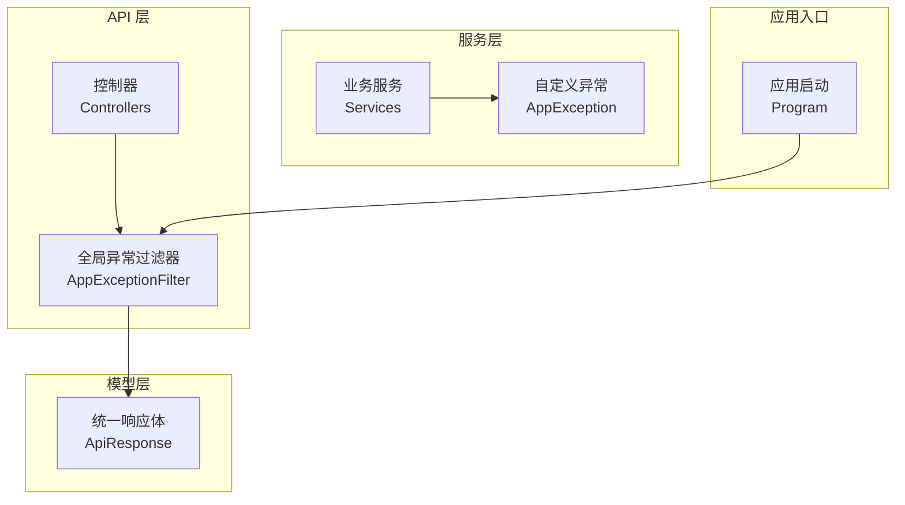
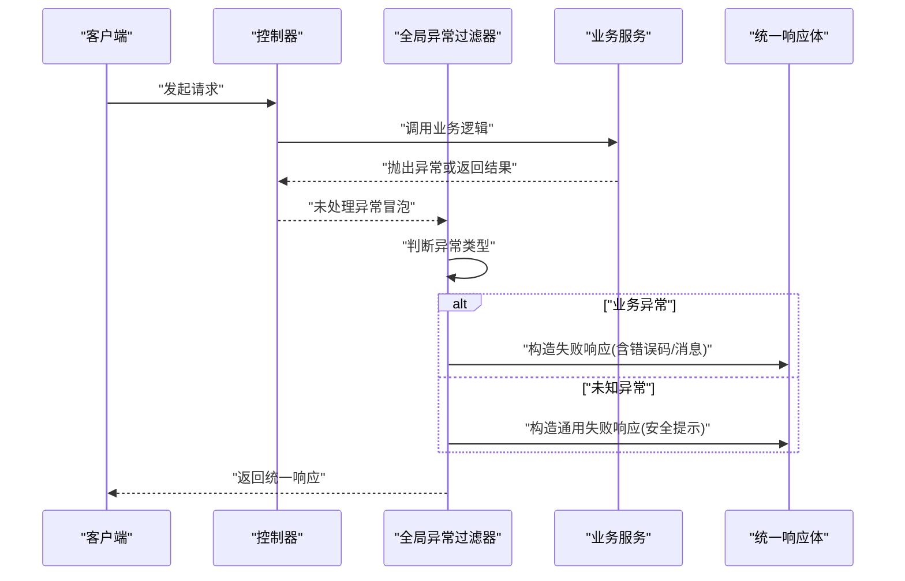
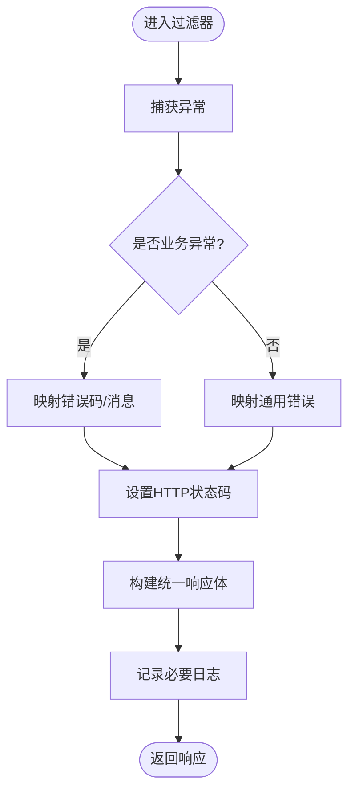
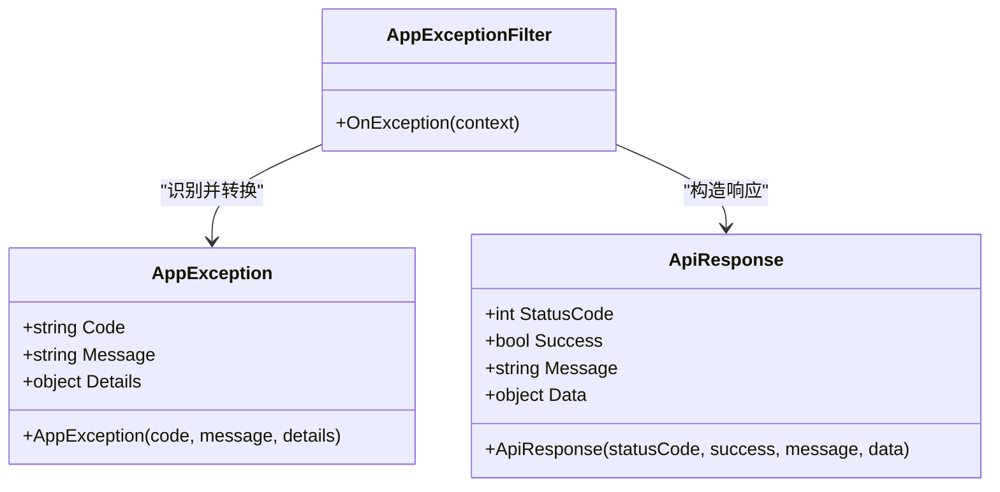
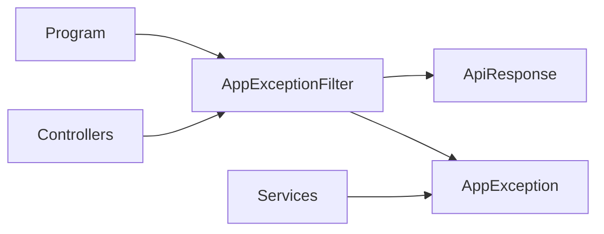

# 异常处理

<cite>
**本文引用的文件**   
- [AppExceptionFilter.cs](file://dip-system/api/Controllers/AppExceptionFilter.cs)
- [AppException.cs](file://dip-system/api/Services/AppException.cs)
- [ApiResponse.cs](file://dip-system/api/Models/ApiResponse.cs)
- [Program.cs](file://dip-system/api/Program.cs)
</cite>

## 目录
1. [简介](#简介)
2. [项目结构](#项目结构)
3. [核心组件](#核心组件)
4. [架构总览](#架构总览)
5. [详细组件分析](#详细组件分析)
6. [依赖关系分析](#依赖关系分析)
7. [性能考量](#性能考量)
8. [故障排查指南](#故障排查指南)
9. [结论](#结论)
10. [附录](#附录)

## 简介
本章节面向DIP系统的异常处理机制，聚焦于全局异常过滤器、自定义异常类型、统一响应格式以及错误码与消息规范。文档旨在帮助开发者快速理解并正确使用现有异常处理体系，同时提供扩展与最佳实践建议。

## 项目结构
DIP系统采用.NET API后端，异常处理相关代码主要分布在以下位置：
- 控制器层：全局异常过滤器（AppExceptionFilter）
- 服务层：自定义异常类型（AppException）
- 模型层：统一响应体（ApiResponse）
- 应用入口：中间件注册与管道配置（Program）

图表来源
- [AppExceptionFilter.cs](file://dip-system/api/Controllers/AppExceptionFilter.cs)
- [AppException.cs](file://dip-system/api/Services/AppException.cs)
- [ApiResponse.cs](file://dip-system/api/Models/ApiResponse.cs)
- [Program.cs](file://dip-system/api/Program.cs)

章节来源
- [AppExceptionFilter.cs](file://dip-system/api/Controllers/AppExceptionFilter.cs)
- [AppException.cs](file://dip-system/api/Services/AppException.cs)
- [ApiResponse.cs](file://dip-system/api/Models/ApiResponse.cs)
- [Program.cs](file://dip-system/api/Program.cs)

## 核心组件
- 全局异常过滤器（AppExceptionFilter）
  - 职责：在请求生命周期中捕获未处理异常，转换为统一的 ApiResponse 返回；记录必要日志；根据异常类型设置合适的HTTP状态码。
  - 关键点：对已知业务异常与未知异常进行区分处理；避免泄露敏感信息；保证响应结构一致。
- 自定义异常（AppException）
  - 职责：承载业务错误码与错误消息，便于上层统一识别与处理。
  - 关键点：包含错误码、消息、可选的详情字段；支持国际化键或可翻译的消息标识。
- 统一响应体（ApiResponse）
  - 职责：对外暴露一致的JSON结构，包含状态码、消息、数据载荷等。
  - 关键点：成功与失败路径共用同一结构；便于前端统一解析与展示。
- 应用入口（Program）
  - 职责：注册全局异常过滤器到ASP.NET Core管道，确保所有控制器均受保护。

章节来源
- [AppExceptionFilter.cs](file://dip-system/api/Controllers/AppExceptionFilter.cs)
- [AppException.cs](file://dip-system/api/Services/AppException.cs)
- [ApiResponse.cs](file://dip-system/api/Models/ApiResponse.cs)
- [Program.cs](file://dip-system/api/Program.cs)

## 架构总览
下图展示了从请求进入控制器到异常被捕获并返回统一响应的完整流程。

图表来源
- [AppExceptionFilter.cs](file://dip-system/api/Controllers/AppExceptionFilter.cs)
- [AppException.cs](file://dip-system/api/Services/AppException.cs)
- [ApiResponse.cs](file://dip-system/api/Models/ApiResponse.cs)
- [Program.cs](file://dip-system/api/Program.cs)

## 详细组件分析

### 全局异常过滤器（AppExceptionFilter）
- 设计要点
  - 作为全局过滤器注册，拦截所有控制器的未处理异常。
  - 对异常进行分类：业务异常（如AppException）与非业务异常（如运行时异常）。
  - 为不同异常设置合适的HTTP状态码（例如业务校验失败使用4xx，服务器内部错误使用5xx）。
  - 生成统一的 ApiResponse 对象，包含状态码、消息和数据载荷（失败时为空）。
  - 记录必要的诊断信息（如请求ID、时间戳、异常类型），避免记录敏感数据。
- 处理流程
  - 捕获异常后，判断是否为业务异常。
  - 若是业务异常，提取错误码与消息，直接映射到 ApiResponse。
  - 若非业务异常，返回通用错误消息，防止泄露实现细节。
  - 将 ApiResponse 序列化为HTTP响应返回。

图表来源
- [AppExceptionFilter.cs](file://dip-system/api/Controllers/AppExceptionFilter.cs)
- [AppException.cs](file://dip-system/api/Services/AppException.cs)
- [ApiResponse.cs](file://dip-system/api/Models/ApiResponse.cs)

章节来源
- [AppExceptionFilter.cs](file://dip-system/api/Controllers/AppExceptionFilter.cs)
- [AppException.cs](file://dip-system/api/Services/AppException.cs)
- [ApiResponse.cs](file://dip-system/api/Models/ApiResponse.cs)

### 自定义异常（AppException）
- 设计要点
  - 用于表达明确的业务错误，携带错误码与消息。
  - 可与统一响应体协作，使错误信息结构化。
  - 支持扩展字段（如详情、参数名等），便于前端定位问题。
- 使用场景
  - 参数校验失败、权限不足、资源不存在、业务流程不合法等。
- 与过滤器的协作
  - 过滤器识别该异常类型，将其转换为 ApiResponse 并设置对应状态码。

图表来源
- [AppException.cs](file://dip-system/api/Services/AppException.cs)
- [ApiResponse.cs](file://dip-system/api/Models/ApiResponse.cs)
- [AppExceptionFilter.cs](file://dip-system/api/Controllers/AppExceptionFilter.cs)

章节来源
- [AppException.cs](file://dip-system/api/Services/AppException.cs)
- [ApiResponse.cs](file://dip-system/api/Models/ApiResponse.cs)
- [AppExceptionFilter.cs](file://dip-system/api/Controllers/AppExceptionFilter.cs)

### 统一响应体（ApiResponse）
- 设计要点
  - 成功与失败共用同一结构，简化前端处理逻辑。
  - 包含状态码、成功标志、消息、数据载荷。
  - 失败时数据载荷为空或包含错误详情（视策略而定）。
- 序列化与兼容性
  - 保持字段稳定，避免破坏性变更。
  - 必要时提供版本兼容策略（如新增字段默认值）。

章节来源
- [ApiResponse.cs](file://dip-system/api/Models/ApiResponse.cs)

### 应用入口（Program）
- 设计要点
  - 注册全局异常过滤器，确保所有控制器生效。
  - 配置中间件顺序，保证异常在合适阶段被捕获。
  - 可结合其他中间件（如认证、授权、日志）形成完整的请求处理链。

章节来源
- [Program.cs](file://dip-system/api/Program.cs)

## 依赖关系分析
- 组件耦合
  - 过滤器依赖统一响应体与自定义异常类型。
  - 服务层通过抛出自定义异常向上层传递错误语义。
- 外部依赖
  - ASP.NET Core 管道与过滤器机制。
  - JSON序列化器（由框架内置）。
- 潜在循环依赖
  - 当前结构清晰，未见循环引用风险。

图表来源
- [Program.cs](file://dip-system/api/Program.cs)
- [AppExceptionFilter.cs](file://dip-system/api/Controllers/AppExceptionFilter.cs)
- [ApiResponse.cs](file://dip-system/api/Models/ApiResponse.cs)
- [AppException.cs](file://dip-system/api/Services/AppException.cs)

章节来源
- [Program.cs](file://dip-system/api/Program.cs)
- [AppExceptionFilter.cs](file://dip-system/api/Controllers/AppExceptionFilter.cs)
- [ApiResponse.cs](file://dip-system/api/Models/ApiResponse.cs)
- [AppException.cs](file://dip-system/api/Services/AppException.cs)

## 性能考量
- 异常捕获开销
  - 仅在发生异常时执行，正常路径无额外开销。
  - 避免在过滤器中进行重型操作（如复杂计算、远程调用）。
- 日志记录
  - 仅记录必要信息，避免频繁I/O影响吞吐。
  - 异步写入与采样策略可降低性能影响。
- 序列化
  - 统一响应体结构简单，序列化成本低。
  - 避免在失败响应中包含大对象。

[本节为通用指导，无需特定文件来源]

## 故障排查指南
- 常见问题
  - 未注册全局过滤器：检查Program中的注册语句。
  - 错误码缺失：确认业务异常是否正确设置错误码。
  - 消息泄露：非业务异常应返回通用消息，避免暴露堆栈。
- 调试技巧
  - 启用开发环境详细日志，查看异常类型与上下文。
  - 在前端统一处理ApiResponse，打印Message与StatusCode辅助定位。
- 监控告警集成
  - 将关键异常事件上报至监控系统（如错误率、特定错误码阈值）。
  - 结合分布式追踪（TraceId）关联请求链路。

章节来源
- [Program.cs](file://dip-system/api/Program.cs)
- [AppExceptionFilter.cs](file://dip-system/api/Controllers/AppExceptionFilter.cs)
- [AppException.cs](file://dip-system/api/Services/AppException.cs)
- [ApiResponse.cs](file://dip-system/api/Models/ApiResponse.cs)

## 结论
DIP系统的异常处理以全局过滤器为核心，配合自定义异常与统一响应体，实现了稳定的错误处理与一致的对外接口。通过合理的错误码设计与日志策略，既保证了用户体验，也为运维监控提供了基础。建议在业务层广泛使用自定义异常，并在过滤器中集中处理，以保持代码简洁与一致性。

[本节为总结性内容，无需特定文件来源]

## 附录
- 最佳实践
  - 明确区分业务异常与系统异常，分别处理。
  - 错误码遵循领域语义，避免随意定义。
  - 统一响应体保持稳定，避免破坏性变更。
- 扩展指南
  - 新增异常类型：继承或复用AppException，增加特定字段。
  - 新增错误码：在服务层集中管理，便于查询与维护。
  - 国际化消息：在错误码与消息之间建立映射表，按语言返回。
- 监控与告警
  - 统计各类异常频率，设定阈值触发告警。
  - 结合TraceId与日志聚合平台，提升排障效率。

[本节为通用指导，无需特定文件来源]