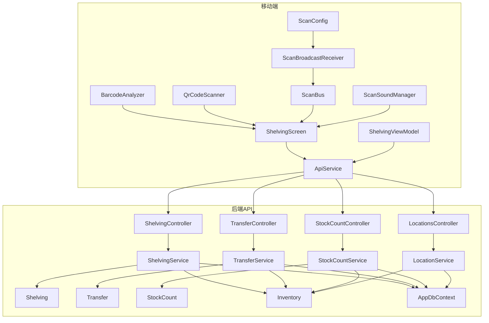
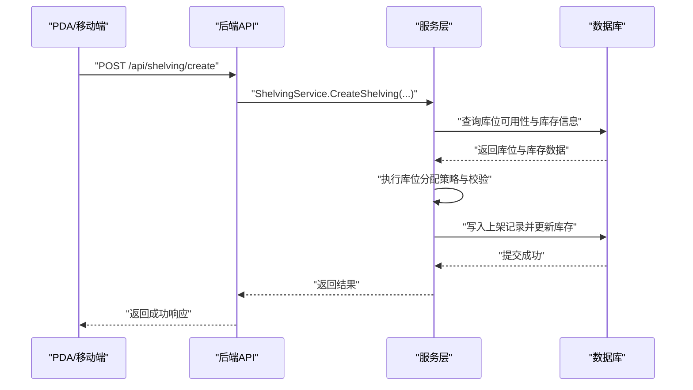
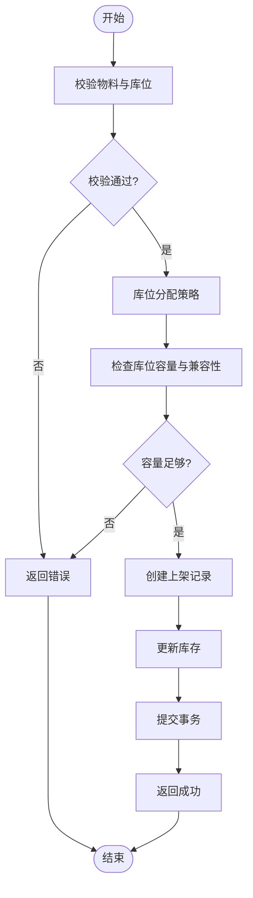
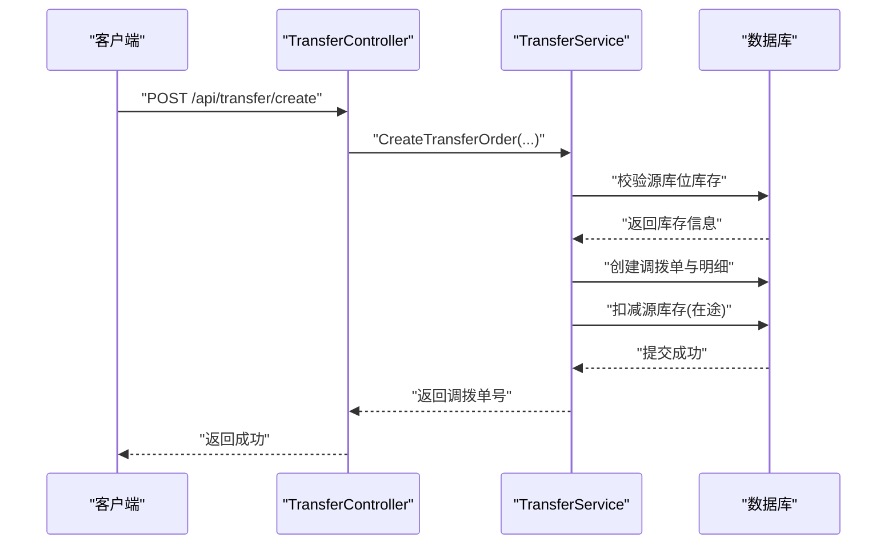
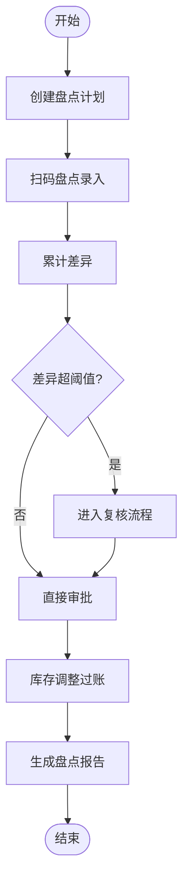
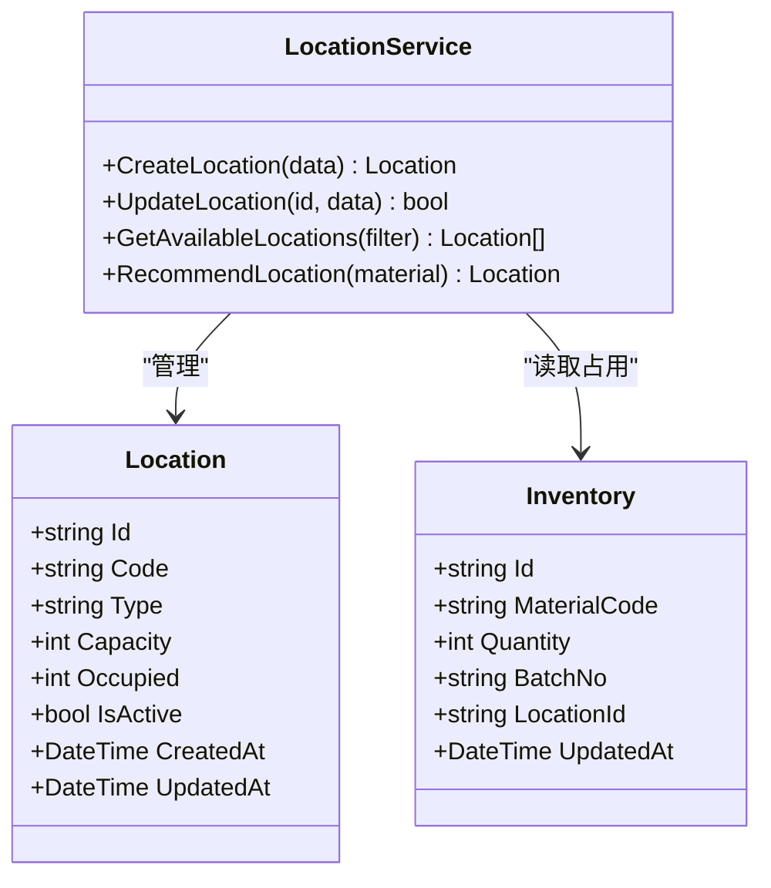
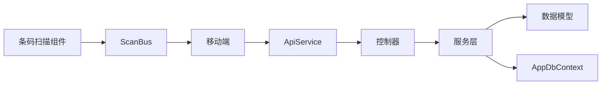

# 仓储操作控制器

<cite>
**本文引用的文件**   
- [ShelvingController.cs](file://dip-system/api/Controllers/ShelvingController.cs)
- [TransferController.cs](file://dip-system/api/Controllers/TransferController.cs)
- [StockCountController.cs](file://dip-system/api/Controllers/StockCountController.cs)
- [LocationsController.cs](file://dip-system/api/Controllers/LocationsController.cs)
- [ShelvingService.cs](file://dip-system/api/Services/ShelvingService.cs)
- [TransferService.cs](file://dip-system/api/Services/TransferService.cs)
- [StockCountService.cs](file://dip-system/api/Services/StockCountService.cs)
- [LocationService.cs](file://dip-system/api/Services/LocationService.cs)
- [Shelving.cs](file://dip-system/api/Models/Shelving.cs)
- [Transfer.cs](file://dip-system/api/Models/Transfer.cs)
- [StockCount.cs](file://dip-system/api/Models/StockCount.cs)
- [Inventory.cs](file://dip-system/api/Models/Inventory.cs)
- [AppDbContext.cs](file://dip-system/api/Data/AppDbContext.cs)
- [ApiService.kt](file://mobile-android/app/src/main/java/com/dip/material/data/network/ApiService.kt)
- [BarcodeAnalyzer.kt](file://mobile-android/app/src/main/java/com/dip/material/ui/components/BarcodeAnalyzer.kt)
- [QrCodeScanner.kt](file://mobile-android/app/src/main/java/com/dip/material/ui/components/QrCodeScanner.kt)
- [ScanBroadcastReceiver.kt](file://mobile-android/app/src/main/java/com/dip/material/utils/ScanBroadcastReceiver.kt)
- [ScanBus.kt](file://mobile-android/app/src/main/java/com/dip/material/utils/ScanBus.kt)
- [ScanConfig.kt](file://mobile-android/app/src/main/java/com/dip/material/utils/ScanConfig.kt)
- [ScanSoundManager.kt](file://mobile-android/app/src/main/java/com/dip/material/utils/ScanSoundManager.kt)
- [ShelvingScreen.kt](file://mobile-android/app/src/main/java/com/dip/material/ui/shelving/ShelvingScreen.kt)
- [ShelvingViewModel.kt](file://mobile-android/app/src/main/java/com/dip/material/ui/shelving/ShelvingViewModel.kt)
</cite>

## 目录
1. [简介](#简介)
2. [项目结构](#项目结构)
3. [核心组件](#核心组件)
4. [架构总览](#架构总览)
5. [详细组件分析](#详细组件分析)
6. [依赖关系分析](#依赖关系分析)
7. [性能考量](#性能考量)
8. [故障排查指南](#故障排查指南)
9. [结论](#结论)
10. [附录](#附录)

## 简介
本文件面向DIP系统的仓储操作相关控制器，聚焦上架管理、调拨操作、盘点管理与库位管理的API接口与业务逻辑。文档涵盖：
- 控制器与服务层职责划分、数据模型与数据库交互
- 库位分配策略、库存移动追踪、盘点差异处理
- 条码扫描集成、PDA设备支持、离线操作等移动端特性
- 空间优化、路径规划、效率统计等高级功能建议与实践

## 项目结构
后端采用.NET API（Controllers + Services + Models + Data），前端Web为React应用，移动端为Android应用（Kotlin）。仓储操作的核心代码位于：
- 控制器：ShelvingController、TransferController、StockCountController、LocationsController
- 服务层：ShelvingService、TransferService、StockCountService、LocationService
- 数据模型：Shelving、Transfer、StockCount、Inventory
- 数据访问：AppDbContext
- 移动端：ApiService、条码扫描组件、PDA广播接收器与配置

图表来源
- [ShelvingController.cs](file://dip-system/api/Controllers/ShelvingController.cs)
- [TransferController.cs](file://dip-system/api/Controllers/TransferController.cs)
- [StockCountController.cs](file://dip-system/api/Controllers/StockCountController.cs)
- [LocationsController.cs](file://dip-system/api/Controllers/LocationsController.cs)
- [ShelvingService.cs](file://dip-system/api/Services/ShelvingService.cs)
- [TransferService.cs](file://dip-system/api/Services/TransferService.cs)
- [StockCountService.cs](file://dip-system/api/Services/StockCountService.cs)
- [LocationService.cs](file://dip-system/api/Services/LocationService.cs)
- [Shelving.cs](file://dip-system/api/Models/Shelving.cs)
- [Transfer.cs](file://dip-system/api/Models/Transfer.cs)
- [StockCount.cs](file://dip-system/api/Models/StockCount.cs)
- [Inventory.cs](file://dip-system/api/Models/Inventory.cs)
- [AppDbContext.cs](file://dip-system/api/Data/AppDbContext.cs)
- [ApiService.kt](file://mobile-android/app/src/main/java/com/dip/material/data/network/ApiService.kt)
- [BarcodeAnalyzer.kt](file://mobile-android/app/src/main/java/com/dip/material/ui/components/BarcodeAnalyzer.kt)
- [QrCodeScanner.kt](file://mobile-android/app/src/main/java/com/dip/material/ui/components/QrCodeScanner.kt)
- [ScanBroadcastReceiver.kt](file://mobile-android/app/src/main/java/com/dip/material/utils/ScanBroadcastReceiver.kt)
- [ScanBus.kt](file://mobile-android/app/src/main/java/com/dip/material/utils/ScanBus.kt)
- [ScanConfig.kt](file://mobile-android/app/src/main/java/com/dip/material/utils/ScanConfig.kt)
- [ScanSoundManager.kt](file://mobile-android/app/src/main/java/com/dip/material/utils/ScanSoundManager.kt)
- [ShelvingScreen.kt](file://mobile-android/app/src/main/java/com/dip/material/ui/shelving/ShelvingScreen.kt)
- [ShelvingViewModel.kt](file://mobile-android/app/src/main/java/com/dip/material/ui/shelving/ShelvingViewModel.kt)

章节来源
- [ShelvingController.cs](file://dip-system/api/Controllers/ShelvingController.cs)
- [TransferController.cs](file://dip-system/api/Controllers/TransferController.cs)
- [StockCountController.cs](file://dip-system/api/Controllers/StockCountController.cs)
- [LocationsController.cs](file://dip-system/api/Controllers/LocationsController.cs)
- [ShelvingService.cs](file://dip-system/api/Services/ShelvingService.cs)
- [TransferService.cs](file://dip-system/api/Services/TransferService.cs)
- [StockCountService.cs](file://dip-system/api/Services/StockCountService.cs)
- [LocationService.cs](file://dip-system/api/Services/LocationService.cs)
- [Shelving.cs](file://dip-system/api/Models/Shelving.cs)
- [Transfer.cs](file://dip-system/api/Models/Transfer.cs)
- [StockCount.cs](file://dip-system/api/Models/StockCount.cs)
- [Inventory.cs](file://dip-system/api/Models/Inventory.cs)
- [AppDbContext.cs](file://dip-system/api/Data/AppDbContext.cs)
- [ApiService.kt](file://mobile-android/app/src/main/java/com/dip/material/data/network/ApiService.kt)
- [BarcodeAnalyzer.kt](file://mobile-android/app/src/main/java/com/dip/material/ui/components/BarcodeAnalyzer.kt)
- [QrCodeScanner.kt](file://mobile-android/app/src/main/java/com/dip/material/ui/components/QrCodeScanner.kt)
- [ScanBroadcastReceiver.kt](file://mobile-android/app/src/main/java/com/dip/material/utils/ScanBroadcastReceiver.kt)
- [ScanBus.kt](file://mobile-android/app/src/main/java/com/dip/material/utils/ScanBus.kt)
- [ScanConfig.kt](file://mobile-android/app/src/main/java/com/dip/material/utils/ScanConfig.kt)
- [ScanSoundManager.kt](file://mobile-android/app/src/main/java/com/dip/material/utils/ScanSoundManager.kt)
- [ShelvingScreen.kt](file://mobile-android/app/src/main/java/com/dip/material/ui/shelving/ShelvingScreen.kt)
- [ShelvingViewModel.kt](file://mobile-android/app/src/main/java/com/dip/material/ui/shelving/ShelvingViewModel.kt)

## 核心组件
- ShelvingController：提供上架相关的API，调用ShelvingService完成物料入库、库位绑定、批次与序列号记录、库存更新等操作。
- TransferController：提供调拨相关的API，调用TransferService实现跨库区/库位的库存转移、调拨单生成与状态流转。
- StockCountController：提供盘点相关的API，调用StockCountService完成盘点任务创建、扫码盘点、差异计算与调整过账。
- LocationsController：提供库位管理API，调用LocationService进行库位增删改查、容量与占用状态维护、库位属性校验。

章节来源
- [ShelvingController.cs](file://dip-system/api/Controllers/ShelvingController.cs)
- [TransferController.cs](file://dip-system/api/Controllers/TransferController.cs)
- [StockCountController.cs](file://dip-system/api/Controllers/StockCountController.cs)
- [LocationsController.cs](file://dip-system/api/Controllers/LocationsController.cs)
- [ShelvingService.cs](file://dip-system/api/Services/SheltingService.cs)
- [TransferService.cs](file://dip-system/api/Services/TransferService.cs)
- [StockCountService.cs](file://dip-system/api/Services/StockCountService.cs)
- [LocationService.cs](file://dip-system/api/Services/LocationService.cs)

## 架构总览
系统分层清晰：
- 控制器层：负责HTTP请求解析、参数校验、权限控制、响应封装
- 服务层：承载业务规则与事务边界，协调领域模型与数据访问
- 数据层：通过EF Core上下文访问数据库，保证实体一致性与并发安全
- 移动端：通过ApiService调用后端API；条码扫描与PDA广播集成提升作业效率

图表来源
- [ShelvingController.cs](file://dip-system/api/Controllers/ShelvingController.cs)
- [ShelvingService.cs](file://dip-system/api/Services/ShelvingService.cs)
- [AppDbContext.cs](file://dip-system/api/Data/AppDbContext.cs)

## 详细组件分析

### ShelvingController（上架管理）
- 职责：处理上架创建、确认、批量上架、扫码上架、异常上报等接口
- 关键流程：
  - 校验物料与库位合法性
  - 执行库位分配策略（按库位类型、容量、批次规则）
  - 记录上架明细（物料、批次、数量、库位、时间、操作人）
  - 更新库存表（增加在库数量、锁定或释放预留）
  - 返回结果与审计日志

图表来源
- [ShelvingController.cs](file://dip-system/api/Controllers/ShelvingController.cs)
- [ShelvingService.cs](file://dip-system/api/Services/ShelvingService.cs)
- [Shelving.cs](file://dip-system/api/Models/Shelving.cs)
- [Inventory.cs](file://dip-system/api/Models/Inventory.cs)

章节来源
- [ShelvingController.cs](file://dip-system/api/Controllers/ShelvingController.cs)
- [ShelvingService.cs](file://dip-system/api/Services/ShelvingService.cs)
- [Shelving.cs](file://dip-system/api/Models/Shelving.cs)
- [Inventory.cs](file://dip-system/api/Models/Inventory.cs)

### TransferController（调拨操作）
- 职责：处理调拨单创建、出库、在途、入库、取消、合并等接口
- 关键流程：
  - 校验源库位与目标库位有效性
  - 生成调拨单并记录明细（物料、批次、数量、源/目标库位）
  - 出库扣减源库存，标记在途
  - 目标库位入库增加库存，关联调拨单号
  - 支持部分调拨与状态回滚

图表来源
- [TransferController.cs](file://dip-system/api/Controllers/TransferController.cs)
- [TransferService.cs](file://dip-system/api/Services/TransferService.cs)
- [Transfer.cs](file://dip-system/api/Models/Transfer.cs)
- [Inventory.cs](file://dip-system/api/Models/Inventory.cs)

章节来源
- [TransferController.cs](file://dip-system/api/Controllers/TransferController.cs)
- [TransferService.cs](file://dip-system/api/Services/TransferService.cs)
- [Transfer.cs](file://dip-system/api/Models/Transfer.cs)
- [Inventory.cs](file://dip-system/api/Models/Inventory.cs)

### StockCountController（盘点管理）
- 职责：处理盘点计划创建、扫码盘点、差异计算、调整过账、复盘等接口
- 关键流程：
  - 创建盘点任务（范围、截止时间、负责人）
  - 扫码录入实盘数量，累计差异
  - 差异阈值判断与审批流
  - 过账调整库存，生成盘点报告

图表来源
- [StockCountController.cs](file://dip-system/api/Controllers/StockCountController.cs)
- [StockCountService.cs](file://dip-system/api/Services/StockCountService.cs)
- [StockCount.cs](file://dip-system/api/Models/StockCount.cs)
- [Inventory.cs](file://dip-system/api/Models/Inventory.cs)

章节来源
- [StockCountController.cs](file://dip-system/api/Controllers/StockCountController.cs)
- [StockCountService.cs](file://dip-system/api/Services/StockCountService.cs)
- [StockCount.cs](file://dip-system/api/Models/StockCount.cs)
- [Inventory.cs](file://dip-system/api/Models/Inventory.cs)

### LocationsController（库位管理）
- 职责：库位CRUD、库位属性（类型、容量、温度、湿度、危险品标识）、占用率统计、库位搜索与推荐
- 关键流程：
  - 新增库位时校验编码唯一性、属性完整性
  - 更新库位容量与占用状态
  - 查询库位可用性（空闲、容量、兼容性）
  - 提供库位推荐算法（基于距离、类型匹配、历史周转率）

图表来源
- [LocationsController.cs](file://dip-system/api/Controllers/LocationsController.cs)
- [LocationService.cs](file://dip-system/api/Services/LocationService.cs)
- [Inventory.cs](file://dip-system/api/Models/Inventory.cs)

章节来源
- [LocationsController.cs](file://dip-system/api/Controllers/LocationsController.cs)
- [LocationService.cs](file://dip-system/api/Services/LocationService.cs)
- [Inventory.cs](file://dip-system/api/Models/Inventory.cs)

## 依赖关系分析
- 控制器依赖服务层，服务层依赖数据模型与数据库上下文
- 移动端通过ApiService统一调用后端API，避免硬编码URL
- 条码扫描组件与PDA广播接收器解耦，通过事件总线传递扫描结果

图表来源
- [ShelvingController.cs](file://dip-system/api/Controllers/ShelvingController.cs)
- [TransferController.cs](file://dip-system/api/Controllers/TransferController.cs)
- [StockCountController.cs](file://dip-system/api/Controllers/StockCountController.cs)
- [LocationsController.cs](file://dip-system/api/Controllers/LocationsController.cs)
- [ShelvingService.cs](file://dip-system/api/Services/ShelvingService.cs)
- [TransferService.cs](file://dip-system/api/Services/TransferService.cs)
- [StockCountService.cs](file://dip-system/api/Services/StockCountService.cs)
- [LocationService.cs](file://dip-system/api/Services/LocationService.cs)
- [AppDbContext.cs](file://dip-system/api/Data/AppDbContext.cs)
- [ApiService.kt](file://mobile-android/app/src/main/java/com/dip/material/data/network/ApiService.kt)
- [BarcodeAnalyzer.kt](file://mobile-android/app/src/main/java/com/dip/material/ui/components/BarcodeAnalyzer.kt)
- [ScanBroadcastReceiver.kt](file://mobile-android/app/src/main/java/com/dip/material/utils/ScanBroadcastReceiver.kt)
- [ScanBus.kt](file://mobile-android/app/src/main/java/com/dip/material/utils/ScanBus.kt)

章节来源
- [AppDbContext.cs](file://dip-system/api/Data/AppDbContext.cs)
- [ApiService.kt](file://mobile-android/app/src/main/java/com/dip/material/data/network/ApiService.kt)
- [ScanBus.kt](file://mobile-android/app/src/main/java/com/dip/material/utils/ScanBus.kt)

## 性能考量
- 数据库层面：
  - 对常用查询字段建立索引（物料编码、库位编码、批次号、时间戳）
  - 使用分页与投影减少数据传输量
  - 批量操作使用事务与批量插入/更新降低IO开销
- 服务层：
  - 缓存热点库位信息与物料主数据
  - 异步处理耗时操作（如报表生成、盘点汇总）
- 移动端：
  - 本地缓存扫描结果与离线队列，网络恢复后自动同步
  - 图片压缩与懒加载减少带宽消耗

[本节为通用指导，不直接分析具体文件]

## 故障排查指南
- 常见错误：
  - 库位容量不足：检查库位容量与已占用数量，确认是否允许混放
  - 库存不足：核对源库位库存与锁定状态，确认是否存在未完成的调拨
  - 盘点差异过大：检查扫码录入准确性与批次匹配规则
- 调试建议：
  - 查看服务层日志与异常堆栈
  - 使用数据库工具检查实体状态与事务提交情况
  - 移动端检查扫描广播是否正常触发与事件总线订阅

章节来源
- [ShelvingService.cs](file://dip-system/api/Services/ShelvingService.cs)
- [TransferService.cs](file://dip-system/api/Services/TransferService.cs)
- [StockCountService.cs](file://dip-system/api/Services/StockCountService.cs)
- [LocationService.cs](file://dip-system/api/Services/LocationService.cs)

## 结论
本仓库的仓储操作控制器与服务层实现了完整的上架、调拨、盘点与库位管理能力。通过清晰的职责分离、严谨的数据一致性保障与移动端条码/PDA集成，能够有效支撑仓库日常作业。建议在后续迭代中持续优化库位分配策略、路径规划与效率统计，以提升整体运营效率。

[本节为总结性内容，不直接分析具体文件]

## 附录
- 移动端特性：
  - 条码扫描集成：BarcodeAnalyzer与QrCodeScanner提供多格式识别
  - PDA设备支持：ScanBroadcastReceiver监听硬件扫描事件，ScanBus分发至UI
  - 离线操作：本地队列存储扫描结果，网络恢复后批量上传
- 高级功能建议：
  - 空间优化：基于ABC分类与周转率的库位动态调整
  - 路径规划：结合库位坐标与拣货顺序的最短路径算法
  - 效率统计：作业时长、扫码准确率、差异率等指标看板

章节来源
- [BarcodeAnalyzer.kt](file://mobile-android/app/src/main/java/com/dip/material/ui/components/BarcodeAnalyzer.kt)
- [QrCodeScanner.kt](file://mobile-android/app/src/main/java/com/dip/material/ui/components/QrCodeScanner.kt)
- [ScanBroadcastReceiver.kt](file://mobile-android/app/src/main/java/com/dip/material/utils/ScanBroadcastReceiver.kt)
- [ScanBus.kt](file://mobile-android/app/src/main/java/com/dip/material/utils/ScanBus.kt)
- [ScanConfig.kt](file://mobile-android/app/src/main/java/com/dip/material/utils/ScanConfig.kt)
- [ScanSoundManager.kt](file://mobile-android/app/src/main/java/com/dip/material/utils/ScanSoundManager.kt)
- [ShelvingScreen.kt](file://mobile-android/app/src/main/java/com/dip/material/ui/shelving/ShelvingScreen.kt)
- [ShelvingViewModel.kt](file://mobile-android/app/src/main/java/com/dip/material/ui/shelving/ShelvingViewModel.kt)