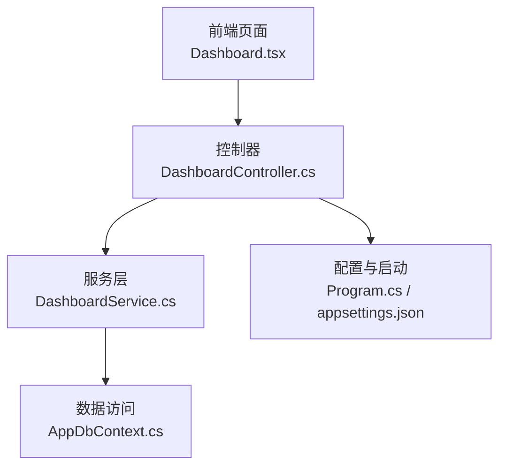
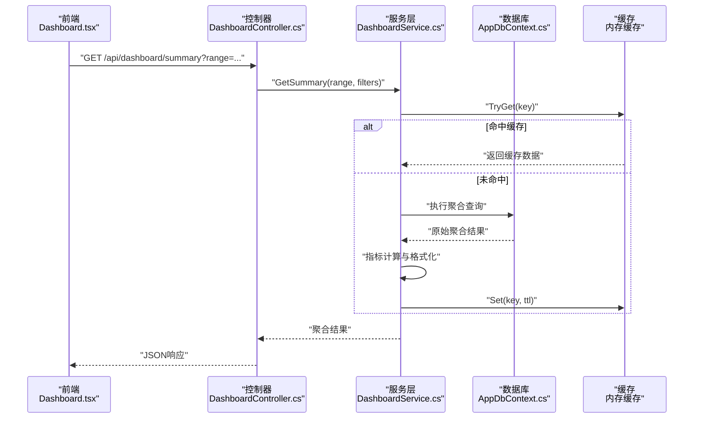
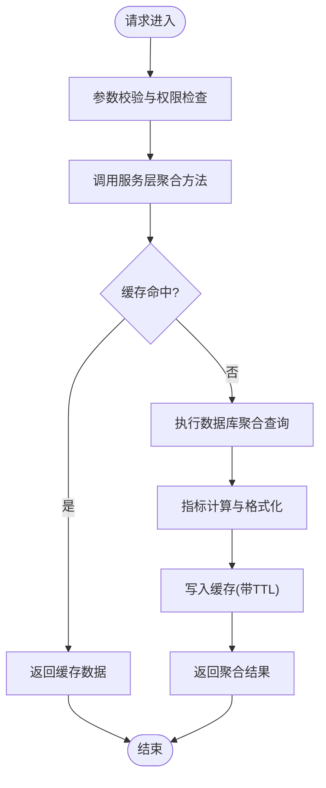
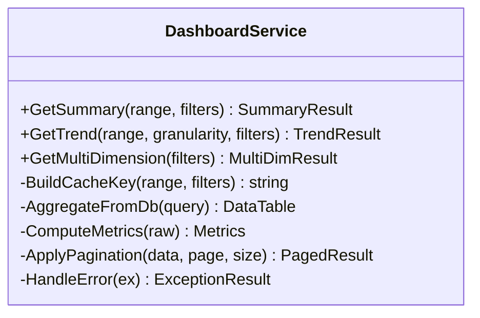
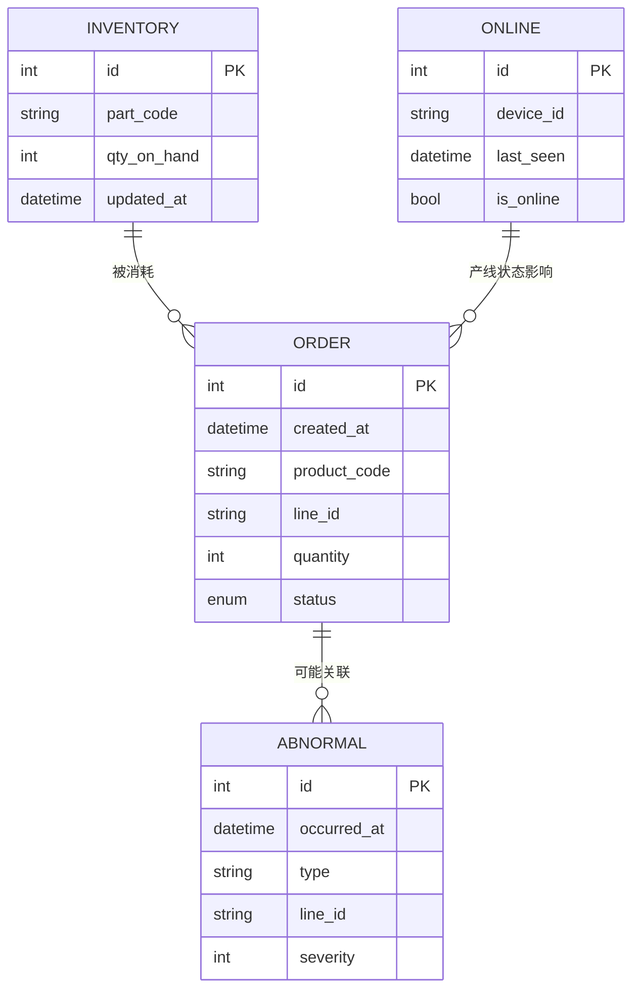
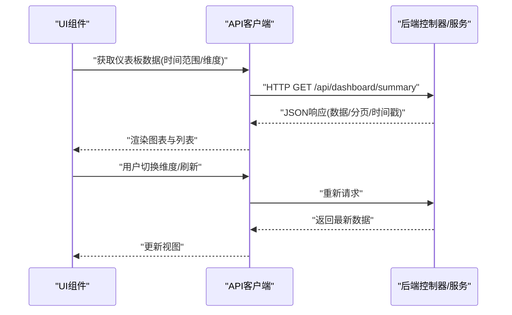
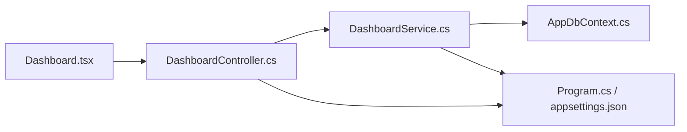

# 仪表板控制器

<cite>
**本文引用的文件**   
- [DashboardController.cs](file://dip-system/api/Controllers/DashboardController.cs)
- [DashboardService.cs](file://dip-system/api/Services/DashboardService.cs)
- [AppDbContext.cs](file://dip-system/api/Data/AppDbContext.cs)
- [Program.cs](file://dip-system/api/Program.cs)
- [appsettings.json](file://dip-system/api/appsettings.json)
- [Dashboard.tsx](file://dip-system/frontend-web/src/pages/Dashboard.tsx)
</cite>

## 目录
1. [简介](#简介)
2. [项目结构](#项目结构)
3. [核心组件](#核心组件)
4. [架构总览](#架构总览)
5. [详细组件分析](#详细组件分析)
6. [依赖关系分析](#依赖关系分析)
7. [性能考虑](#性能考虑)
8. [故障排查指南](#故障排查指南)
9. [结论](#结论)
10. [附录](#附录)

## 简介
本文件面向DIP系统的“仪表板控制器”能力，围绕DashboardController与DashboardService展开，系统说明其数据聚合接口、实时统计查询、业务指标计算等核心功能；并给出数据缓存策略、性能优化方案、大数据量处理技巧；文档化统计图表的数据格式、时间范围过滤、多维度分析能力；同时覆盖异常数据处理、数据一致性保证、监控告警集成等高级特性。读者可据此快速理解仪表板后端实现与前后端协作方式，并在生产环境中进行调优与排障。

## 项目结构
DIP系统采用前后端分离架构：前端位于frontend-web，后端API位于dip-system/api。仪表板相关代码主要分布在以下位置：
- API层：Controllers/DashboardController.cs 暴露HTTP接口
- 服务层：Services/DashboardService.cs 实现数据聚合与指标计算
- 数据访问：Data/AppDbContext.cs 提供EF Core上下文
- 配置与启动：Program.cs、appsettings.json 负责依赖注入、中间件与配置加载
- 前端页面：frontend-web/src/pages/Dashboard.tsx 调用仪表板接口并渲染图表

**图示来源** 
- [DashboardController.cs](file://dip-system/api/Controllers/DashboardController.cs)
- [DashboardService.cs](file://dip-system/api/Services/DashboardService.cs)
- [AppDbContext.cs](file://dip-system/api/Data/AppDbContext.cs)
- [Program.cs](file://dip-system/api/Program.cs)
- [appsettings.json](file://dip-system/api/appsettings.json)
- [Dashboard.tsx](file://dip-system/frontend-web/src/pages/Dashboard.tsx)

**章节来源**
- [DashboardController.cs](file://dip-system/api/Controllers/DashboardController.cs)
- [DashboardService.cs](file://dip-system/api/Services/DashboardService.cs)
- [AppDbContext.cs](file://dip-system/api/Data/AppDbContext.cs)
- [Program.cs](file://dip-system/api/Program.cs)
- [appsettings.json](file://dip-system/api/appsettings.json)
- [Dashboard.tsx](file://dip-system/frontend-web/src/pages/Dashboard.tsx)

## 核心组件
- DashboardController：对外暴露RESTful接口，统一接收请求参数（如时间范围、维度筛选），调用服务层完成数据聚合，返回标准化响应体。
- DashboardService：封装业务逻辑，包括实时统计查询、指标计算、多源数据聚合、缓存读写、分页与排序、错误处理与降级。
- AppDbContext：基于EF Core的数据库上下文，提供实体映射与查询入口，支持复杂SQL或LINQ聚合。
- Program与appsettings.json：注册服务、配置内存缓存、日志与监控开关、连接字符串等。
- 前端Dashboard.tsx：发起异步请求、处理分页与刷新、渲染折线/柱状/饼图等图表。

**章节来源**
- [DashboardController.cs](file://dip-system/api/Controllers/DashboardController.cs)
- [DashboardService.cs](file://dip-system/api/Services/DashboardService.cs)
- [AppDbContext.cs](file://dip-system/api/Data/AppDbContext.cs)
- [Program.cs](file://dip-system/api/Program.cs)
- [appsettings.json](file://dip-system/api/appsettings.json)
- [Dashboard.tsx](file://dip-system/frontend-web/src/pages/Dashboard.tsx)

## 架构总览
仪表板数据流从前端发起，经控制器路由到服务层，服务层通过DbContext访问数据库，必要时读取/写入缓存，最终将聚合结果返回给前端渲染。

**图示来源** 
- [DashboardController.cs](file://dip-system/api/Controllers/DashboardController.cs)
- [DashboardService.cs](file://dip-system/api/Services/DashboardService.cs)
- [AppDbContext.cs](file://dip-system/api/Data/AppDbContext.cs)
- [Program.cs](file://dip-system/api/Program.cs)
- [appsettings.json](file://dip-system/api/appsettings.json)
- [Dashboard.tsx](file://dip-system/frontend-web/src/pages/Dashboard.tsx)

## 详细组件分析

### DashboardController 接口设计
- 职责：接收请求参数校验、鉴权（如有）、调用服务层、统一响应包装与错误转换。
- 典型接口：
  - 汇总概览：按时间范围与维度聚合关键指标（如订单量、库存周转、异常率）。
  - 趋势明细：按小时/天/周粒度返回时序数据点。
  - 多维分析：按产品、产线、仓库等维度分组统计。
  - 导出与快照：生成报表快照或导出CSV/Excel（可选）。
- 输入参数：时间范围（开始/结束）、维度筛选（工厂/产线/产品类别）、分页与排序、是否使用缓存。
- 输出格式：统一的ApiResponse包裹，包含数据对象、分页信息、时间戳与追踪ID。

**图示来源** 
- [DashboardController.cs](file://dip-system/api/Controllers/DashboardController.cs)
- [DashboardService.cs](file://dip-system/api/Services/DashboardService.cs)

**章节来源**
- [DashboardController.cs](file://dip-system/api/Controllers/DashboardController.cs)

### DashboardService 业务逻辑
- 职责：实现数据聚合、指标计算、缓存策略、分页与排序、异常降级、并发控制。
- 关键能力：
  - 实时统计查询：基于时间窗口与维度条件，对订单、库存、异常、在线状态等进行聚合。
  - 指标计算：如达成率、不良率、周转天数、在制数量、缺料率等。
  - 缓存策略：键由时间范围+维度哈希生成，设置合理TTL，支持失效与预热。
  - 大数据处理：分批查询、流式聚合、避免一次性加载全表，必要时回退到近似算法。
  - 错误处理：捕获数据库超时、连接失败、空结果集等，返回友好错误码与降级数据。
  - 一致性保证：读路径优先缓存，写路径更新后主动失效相关缓存键；必要时加分布式锁（若扩展）。

**图示来源** 
- [DashboardService.cs](file://dip-system/api/Services/DashboardService.cs)

**章节来源**
- [DashboardService.cs](file://dip-system/api/Services/DashboardService.cs)

### AppDbContext 数据访问
- 职责：定义实体模型、关系映射、查询入口；支持复杂聚合与视图查询。
- 关键点：
  - 实体映射：订单、库存、异常、在线、换线等实体。
  - 查询优化：索引建议、投影只取必要字段、避免N+1。
  - 事务与隔离：聚合查询通常使用ReadCommitted或Snapshot隔离级别。
  - 连接池：合理配置最大连接数与超时时间。

**图示来源** 
- [AppDbContext.cs](file://dip-system/api/Data/AppDbContext.cs)

**章节来源**
- [AppDbContext.cs](file://dip-system/api/Data/AppDbContext.cs)

### 前端 Dashboard.tsx 交互
- 职责：发起聚合请求、处理分页与刷新、渲染图表、展示异常提示。
- 关键点：
  - 请求参数：时间范围、维度筛选、分页大小、是否强制刷新。
  - 响应处理：解析统一响应体，提取数据与分页信息。
  - 图表渲染：折线图（趋势）、柱状图（分类对比）、饼图（占比）。
  - 错误处理：网络异常、超时、服务端错误提示与重试。

**图示来源** 
- [Dashboard.tsx](file://dip-system/frontend-web/src/pages/Dashboard.tsx)
- [DashboardController.cs](file://dip-system/api/Controllers/DashboardController.cs)
- [DashboardService.cs](file://dip-system/api/Services/DashboardService.cs)

**章节来源**
- [Dashboard.tsx](file://dip-system/frontend-web/src/pages/Dashboard.tsx)

## 依赖关系分析
- 控制器依赖服务层，服务层依赖DbContext与缓存。
- 配置项（连接串、缓存TTL、日志级别）来自appsettings.json，由Program.cs注入。
- 前端依赖后端API契约（请求/响应结构），需保持版本兼容。

**图示来源** 
- [DashboardController.cs](file://dip-system/api/Controllers/DashboardController.cs)
- [DashboardService.cs](file://dip-system/api/Services/DashboardService.cs)
- [AppDbContext.cs](file://dip-system/api/Data/AppDbContext.cs)
- [Program.cs](file://dip-system/api/Program.cs)
- [appsettings.json](file://dip-system/api/appsettings.json)
- [Dashboard.tsx](file://dip-system/frontend-web/src/pages/Dashboard.tsx)

**章节来源**
- [Program.cs](file://dip-system/api/Program.cs)
- [appsettings.json](file://dip-system/api/appsettings.json)

## 性能考虑
- 缓存策略
  - 键设计：时间范围+维度哈希，避免碰撞。
  - TTL设置：根据数据更新频率设定（如分钟级/小时级）。
  - 预热：应用启动时预加载热点指标。
  - 失效：写操作后主动失效相关键。
- 查询优化
  - 投影最小化：仅选择必要字段。
  - 索引建议：时间字段、维度字段建立复合索引。
  - 分批与游标：大数据量时使用分页或流式处理。
- 并发与限流
  - 限制并发请求数，避免雪崩。
  - 超时与重试：对慢查询设置超时，指数退避重试。
- 前端优化
  - 防抖与节流：减少重复请求。
  - 增量更新：仅刷新变化部分。
  - 本地缓存：短期缓存最近一次结果。

[本节为通用指导，不直接分析具体文件]

## 故障排查指南
- 常见问题
  - 缓存未命中导致延迟：检查键生成逻辑与TTL设置。
  - 数据库超时：查看慢查询日志，优化索引与SQL。
  - 数据不一致：确认写路径是否失效缓存，必要时引入一致性校验。
  - 前端渲染异常：检查响应结构与字段类型。
- 诊断步骤
  - 启用详细日志与追踪ID，定位请求链路。
  - 监控缓存命中率与数据库连接池使用率。
  - 压测验证高并发下的稳定性。
- 恢复策略
  - 自动重试与熔断。
  - 降级返回近似值或历史快照。
  - 人工干预：清理缓存、重启服务、扩容数据库。

**章节来源**
- [DashboardService.cs](file://dip-system/api/Services/DashboardService.cs)
- [DashboardController.cs](file://dip-system/api/Controllers/DashboardController.cs)

## 结论
仪表板控制器与服务层共同实现了高效、稳定的数据聚合与指标计算能力。通过合理的缓存策略、查询优化与前端交互设计，能够在大数据量场景下保持良好性能与用户体验。建议在持续迭代中完善监控告警、数据质量校验与一致性保障机制，进一步提升系统可靠性与可观测性。

[本节为总结性内容，不直接分析具体文件]

## 附录
- 接口契约示例（描述性）
  - 汇总概览：返回关键指标数值、同比环比、更新时间。
  - 趋势明细：返回时间序列点（时间戳、指标值、单位）。
  - 多维分析：返回分组维度与对应指标值，支持排序与分页。
- 数据格式约定
  - 统一响应体：包含状态码、消息、数据对象、分页信息、追踪ID。
  - 时间格式：ISO 8601，UTC或指定时区。
  - 数值精度：保留两位小数，单位明确标注。
- 监控与告警
  - 指标：接口延迟、错误率、缓存命中率、数据库连接池使用率。
  - 告警规则：阈值触发、通知渠道（邮件/短信/IM）。

[本节为补充信息，不直接分析具体文件]