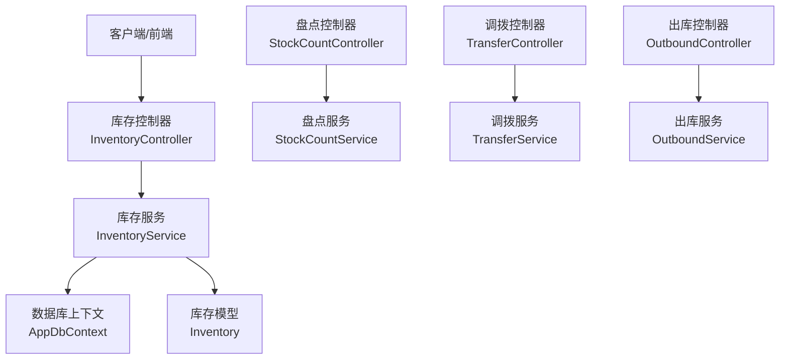
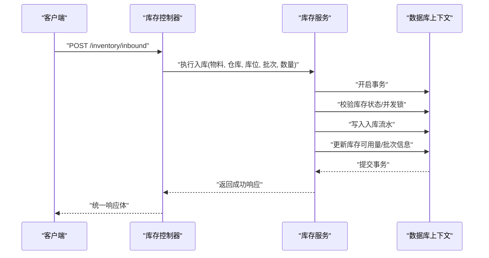
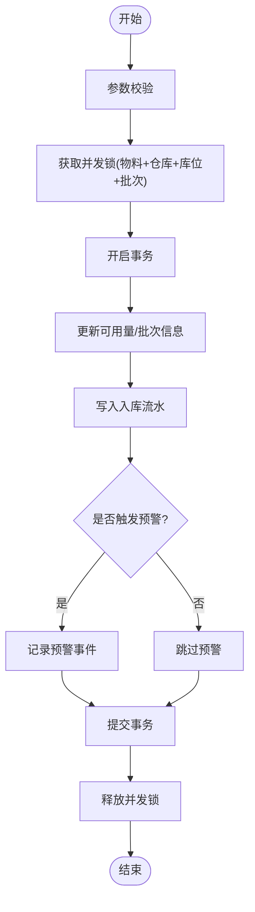
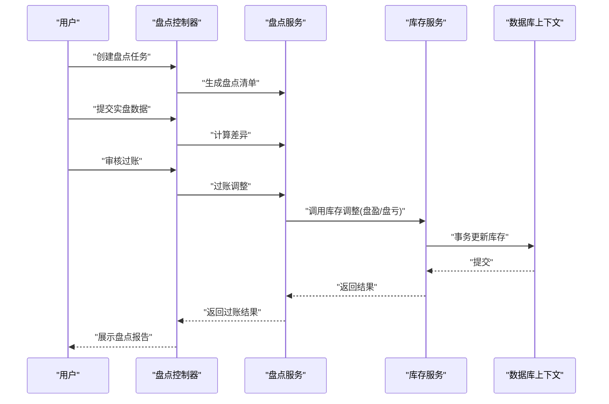
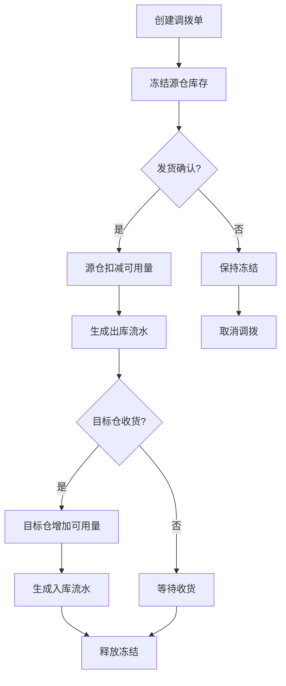
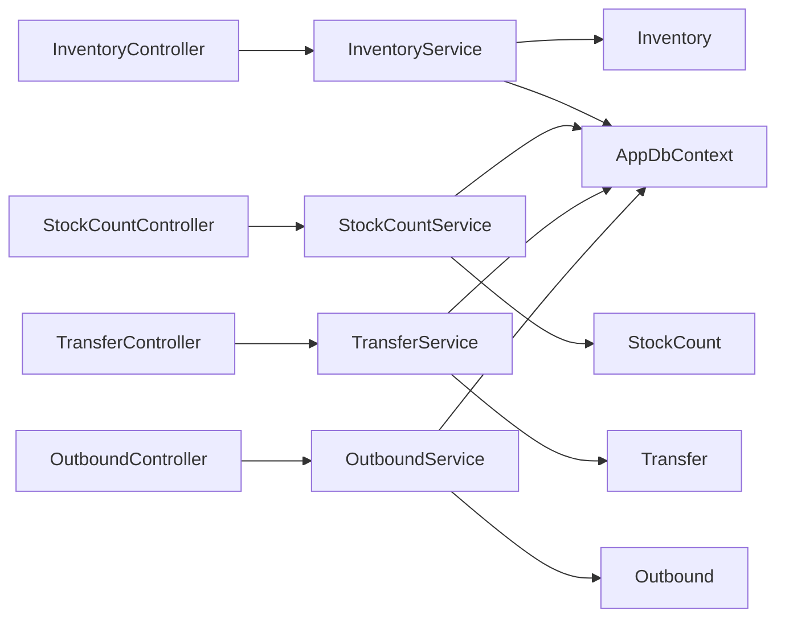

# 库存控制器

<cite>
**本文引用的文件**   
- [InventoryController.cs](file://dip-system/api/Controllers/InventoryController.cs)
- [InventoryService.cs](file://dip-system/api/Services/InventoryService.cs)
- [Inventory.cs](file://dip-system/api/Models/Inventory.cs)
- [StockCountController.cs](file://dip-system/api/Controllers/StockCountController.cs)
- [StockCountService.cs](file://dip-system/api/Services/StockCountService.cs)
- [StockCount.cs](file://dip-system/api/Models/StockCount.cs)
- [TransferController.cs](file://dip-system/api/Controllers/TransferController.cs)
- [TransferService.cs](file://dip-system/api/Services/TransferService.cs)
- [Transfer.cs](file://dip-system/api/Models/Transfer.cs)
- [OutboundController.cs](file://dip-system/api/Controllers/OutboundController.cs)
- [OutboundService.cs](file://dip-system/api/Services/OutboundService.cs)
- [Outbound.cs](file://dip-system/api/Models/Outbound.cs)
- [ApiResponse.cs](file://dip-system/api/Models/ApiResponse.cs)
- [AppDbContext.cs](file://dip-system/api/Data/AppDbContext.cs)
</cite>

## 目录
1. [简介](#简介)
2. [项目结构](#项目结构)
3. [核心组件](#核心组件)
4. [架构总览](#架构总览)
5. [详细组件分析](#详细组件分析)
6. [依赖关系分析](#依赖关系分析)
7. [性能考虑](#性能考虑)
8. [故障排查指南](#故障排查指南)
9. [结论](#结论)
10. [附录：API调用示例与错误处理](#附录api调用示例与错误处理)

## 简介
本文件面向DIP系统的库存控制器，围绕库存查询、入库出库、库存调整、批次管理、状态管理、数量同步、并发控制、预警与盘点、调拨等核心能力进行系统化说明。文档同时覆盖批量操作、事务处理与数据一致性保障，并提供API调用示例与错误处理指引，帮助开发者快速集成与排障。

## 项目结构
库存相关功能采用典型的分层架构：
- 控制器层（Controllers）：接收HTTP请求，参数校验，调用服务层，返回统一响应。
- 服务层（Services）：封装业务逻辑，协调领域模型与仓储访问，负责事务与并发控制。
- 模型层（Models）：定义实体与DTO，如库存、出入库、盘点、调拨等。
- 数据访问（Data）：通过EF Core上下文进行持久化。

图表来源
- [InventoryController.cs](file://dip-system/api/Controllers/InventoryController.cs)
- [InventoryService.cs](file://dip-system/api/Services/InventoryService.cs)
- [AppDbContext.cs](file://dip-system/api/Data/AppDbContext.cs)
- [StockCountController.cs](file://dip-system/api/Controllers/StockCountController.cs)
- [TransferController.cs](file://dip-system/api/Controllers/TransferController.cs)
- [OutboundController.cs](file://dip-system/api/Controllers/OutboundController.cs)

章节来源
- [InventoryController.cs](file://dip-system/api/Controllers/InventoryController.cs)
- [InventoryService.cs](file://dip-system/api/Services/InventoryService.cs)
- [AppDbContext.cs](file://dip-system/api/Data/AppDbContext.cs)

## 核心组件
- 库存控制器（InventoryController）：提供库存查询、入库、出库、调整、批次管理等接口。
- 库存服务（InventoryService）：实现库存状态机、数量同步、并发锁、事务边界、预警触发。
- 库存模型（Inventory）：描述物料、仓库、库位、批次、可用量、锁定量、在途量等字段。
- 盘点模块（StockCountController/Service/Model）：支持创建盘点任务、差异调整、审核过账。
- 调拨模块（TransferController/Service/Model）：支持源仓到目标仓的调拨单与库存扣减/增加。
- 出库模块（OutboundController/Service/Model）：支持按订单或工单扣减库存并生成出库记录。
- 统一响应（ApiResponse）：标准化成功/失败响应结构，便于前端处理。

章节来源
- [InventoryController.cs](file://dip-system/api/Controllers/InventoryController.cs)
- [InventoryService.cs](file://dip-system/api/Services/InventoryService.cs)
- [Inventory.cs](file://dip-system/api/Models/Inventory.cs)
- [StockCountController.cs](file://dip-system/api/Controllers/StockCountController.cs)
- [StockCountService.cs](file://dip-system/api/Services/StockCountService.cs)
- [StockCount.cs](file://dip-system/api/Models/StockCount.cs)
- [TransferController.cs](file://dip-system/api/Controllers/TransferController.cs)
- [TransferService.cs](file://dip-system/api/Services/TransferService.cs)
- [Transfer.cs](file://dip-system/api/Models/Transfer.cs)
- [OutboundController.cs](file://dip-system/api/Controllers/OutboundController.cs)
- [OutboundService.cs](file://dip-system/api/Services/OutboundService.cs)
- [Outbound.cs](file://dip-system/api/Models/Outbound.cs)
- [ApiResponse.cs](file://dip-system/api/Models/ApiResponse.cs)

## 架构总览
库存子系统遵循“控制器→服务→仓储”的分层模式，关键流程包括：
- 查询：控制器接收过滤条件，服务层聚合查询，返回分页结果。
- 入库/出库/调整：服务层执行状态校验、并发锁、事务写入，更新库存主记录与流水。
- 盘点：创建盘点任务→扫码录入→差异计算→审核过账→自动调整库存。
- 调拨：创建调拨单→冻结源仓库存→目标仓收货→释放冻结并增加目标仓库存。
- 预警：基于安全库存阈值、批号有效期、呆滞期等规则触发告警。

图表来源
- [InventoryController.cs](file://dip-system/api/Controllers/InventoryController.cs)
- [InventoryService.cs](file://dip-system/api/Services/InventoryService.cs)
- [AppDbContext.cs](file://dip-system/api/Data/AppDbContext.cs)

## 详细组件分析

### 库存控制器（InventoryController）
职责与能力
- 库存查询：支持多条件筛选（物料、仓库、库位、批次、状态）、分页排序。
- 入库操作：支持按批次入库，更新可用量与批次明细。
- 出库操作：按批次先进先出或指定批次扣减，生成出库流水。
- 库存调整：支持盘盈盘亏、损耗、报废等调整类型，需审计留痕。
- 批次管理：维护批次属性（生产日期、有效期、供应商、序列号段）。
- 并发控制：对同一物料+仓库+库位+批次的写操作加锁，避免超卖。
- 事务处理：所有写操作在事务中完成，保证一致性与可回滚。
- 预警触发：当可用量低于安全库存或批次临期时，记录预警事件。

典型流程（以入库为例）

图表来源
- [InventoryController.cs](file://dip-system/api/Controllers/InventoryController.cs)
- [InventoryService.cs](file://dip-system/api/Services/InventoryService.cs)

章节来源
- [InventoryController.cs](file://dip-system/api/Controllers/InventoryController.cs)
- [InventoryService.cs](file://dip-system/api/Services/InventoryService.cs)

### 库存服务（InventoryService）
设计要点
- 状态管理：维护库存状态（可用、锁定、在途、冻结、报废），状态转换受约束。
- 数量同步：确保可用量=物理量-锁定量-冻结量；在途量独立跟踪。
- 并发控制：使用分布式锁或行级锁保护热点库存记录，防止竞态。
- 事务边界：入库、出库、调整、盘点过账均在单一事务内完成。
- 预警引擎：基于阈值与规则计算，输出预警级别与处置建议。
- 审计追踪：所有变更写入审计表，包含操作人、时间、前后值。

章节来源
- [InventoryService.cs](file://dip-system/api/Services/InventoryService.cs)
- [Inventory.cs](file://dip-system/api/Models/Inventory.cs)

### 盘点模块（StockCountController/Service/Model）
业务流程
- 创建盘点任务：选择仓库/库位范围，生成盘点清单。
- 数据采集：扫码或手工录入实盘数量，支持分批提交。
- 差异计算：对比系统账面与实盘数量，生成差异明细。
- 审核过账：经授权后过账，自动调整库存并记录盘点流水。
- 报表统计：产出盘点准确率、差异原因分析。

图表来源
- [StockCountController.cs](file://dip-system/api/Controllers/StockCountController.cs)
- [StockCountService.cs](file://dip-system/api/Services/StockCountService.cs)
- [StockCount.cs](file://dip-system/api/Models/StockCount.cs)
- [InventoryService.cs](file://dip-system/api/Services/InventoryService.cs)

章节来源
- [StockCountController.cs](file://dip-system/api/Controllers/StockCountController.cs)
- [StockCountService.cs](file://dip-system/api/Services/StockCountService.cs)
- [StockCount.cs](file://dip-system/api/Models/StockCount.cs)

### 调拨模块（TransferController/Service/Model）
业务流程
- 创建调拨单：指定源仓、目标仓、物料、批次、数量。
- 冻结源仓：调拨确认后冻结源仓对应库存。
- 发货出库：源仓扣减可用量，生成出库流水。
- 收货入库：目标仓增加可用量，生成入库流水。
- 异常处理：部分收货、退货、取消调拨等场景。

图表来源
- [TransferController.cs](file://dip-system/api/Controllers/TransferController.cs)
- [TransferService.cs](file://dip-system/api/Services/TransferService.cs)
- [Transfer.cs](file://dip-system/api/Models/Transfer.cs)

章节来源
- [TransferController.cs](file://dip-system/api/Controllers/TransferController.cs)
- [TransferService.cs](file://dip-system/api/Services/TransferService.cs)
- [Transfer.cs](file://dip-system/api/Models/Transfer.cs)

### 出库模块（OutboundController/Service/Model）
业务流程
- 出库申请：关联订单/工单，指定物料、批次、数量。
- 库存校验：检查可用量与批次有效性。
- 扣减库存：按策略（FIFO/指定批次）扣减，生成出库流水。
- 过账确认：出库完成后更新单据状态，释放占用。

章节来源
- [OutboundController.cs](file://dip-system/api/Controllers/OutboundController.cs)
- [OutboundService.cs](file://dip-system/api/Services/OutboundService.cs)
- [Outbound.cs](file://dip-system/api/Models/Outbound.cs)

### 库存模型（Inventory）
关键字段
- 物料编码、仓库编码、库位编码、批次号
- 可用量、锁定量、在途量、冻结量、报废量
- 状态（可用、锁定、在途、冻结、报废）
- 批次属性（生产日期、有效期、供应商、序列号段）
- 审计字段（创建人、创建时间、修改人、修改时间）

章节来源
- [Inventory.cs](file://dip-system/api/Models/Inventory.cs)

## 依赖关系分析
- 控制器依赖服务：InventoryController → InventoryService；StockCountController → StockCountService；TransferController → TransferService；OutboundController → OutboundService。
- 服务依赖模型与上下文：各服务通过AppDbContext访问数据库，读写实体模型。
- 统一响应：所有控制器返回ApiResponse，便于前端统一处理。

图表来源
- [InventoryController.cs](file://dip-system/api/Controllers/InventoryController.cs)
- [InventoryService.cs](file://dip-system/api/Services/InventoryService.cs)
- [StockCountController.cs](file://dip-system/api/Controllers/StockCountController.cs)
- [StockCountService.cs](file://dip-system/api/Services/StockCountService.cs)
- [TransferController.cs](file://dip-system/api/Controllers/TransferController.cs)
- [TransferService.cs](file://dip-system/api/Services/TransferService.cs)
- [OutboundController.cs](file://dip-system/api/Controllers/OutboundController.cs)
- [OutboundService.cs](file://dip-system/api/Services/OutboundService.cs)
- [AppDbContext.cs](file://dip-system/api/Data/AppDbContext.cs)

章节来源
- [InventoryController.cs](file://dip-system/api/Controllers/InventoryController.cs)
- [InventoryService.cs](file://dip-system/api/Services/InventoryService.cs)
- [StockCountController.cs](file://dip-system/api/Controllers/StockCountController.cs)
- [StockCountService.cs](file://dip-system/api/Services/StockCountService.cs)
- [TransferController.cs](file://dip-system/api/Controllers/TransferController.cs)
- [TransferService.cs](file://dip-system/api/Services/TransferService.cs)
- [OutboundController.cs](file://dip-system/api/Controllers/OutboundController.cs)
- [OutboundService.cs](file://dip-system/api/Services/OutboundService.cs)
- [AppDbContext.cs](file://dip-system/api/Data/AppDbContext.cs)

## 性能考虑
- 查询优化：为常用筛选字段建立索引（物料、仓库、库位、批次、状态），分页查询限制返回条数。
- 并发控制：热点库存记录使用细粒度锁（物料+仓库+库位+批次），减少锁竞争。
- 批量操作：入库/出库/调整支持批量提交，合并事务，降低IO开销。
- 异步处理：预警通知、报表生成等非关键路径异步执行，缩短响应时间。
- 缓存策略：对静态字典（仓库、库位、物料分类）使用内存缓存，减少重复查询。

[本节为通用指导，不直接分析具体文件]

## 故障排查指南
常见问题与定位方法
- 库存不一致：检查事务是否完整提交，核对入库/出库/调整流水与库存主记录的一致性。
- 并发冲突：查看并发锁日志，确认是否存在未释放锁或锁超时配置不当。
- 预警误报：核对安全库存阈值、批次有效期规则与数据准确性。
- 盘点差异大：复核数据采集流程，确认扫码/手工录入是否正确，差异过账是否经过授权。
- 调拨异常：检查源仓冻结与目标仓收货状态，确认部分收货与退货逻辑。

章节来源
- [InventoryService.cs](file://dip-system/api/Services/InventoryService.cs)
- [StockCountService.cs](file://dip-system/api/Services/StockCountService.cs)
- [TransferService.cs](file://dip-system/api/Services/TransferService.cs)
- [OutboundService.cs](file://dip-system/api/Services/OutboundService.cs)

## 结论
库存控制器及其配套服务构成了DIP系统的核心业务能力，涵盖查询、入库出库、调整、批次管理、盘点、调拨等关键环节。通过严格的状态管理、并发控制与事务保障，系统在复杂业务场景下仍能保持数据一致性与高可用性。建议在生产环境启用监控与审计，持续优化性能与稳定性。

[本节为总结性内容，不直接分析具体文件]

## 附录：API调用示例与错误处理
- 统一响应格式：所有接口返回ApiResponse，包含状态码、消息与数据体。
- 常见错误码：参数错误、库存不足、并发冲突、权限不足、数据不存在等。
- 调用示例（概念性）：
  - 入库：POST /inventory/inbound，请求体包含物料、仓库、库位、批次、数量。
  - 出库：POST /inventory/outbound，请求体包含物料、仓库、库位、批次、数量、出库类型。
  - 调整：POST /inventory/adjustment，请求体包含调整类型、数量、原因。
  - 盘点：POST /stockcount/create，POST /stockcount/submit，POST /stockcount/posting。
  - 调拨：POST /transfer/create，POST /transfer/shipping，POST /transfer/receiving。

章节来源
- [ApiResponse.cs](file://dip-system/api/Models/ApiResponse.cs)
- [InventoryController.cs](file://dip-system/api/Controllers/InventoryController.cs)
- [StockCountController.cs](file://dip-system/api/Controllers/StockCountController.cs)
- [TransferController.cs](file://dip-system/api/Controllers/TransferController.cs)
- [OutboundController.cs](file://dip-system/api/Controllers/OutboundController.cs)