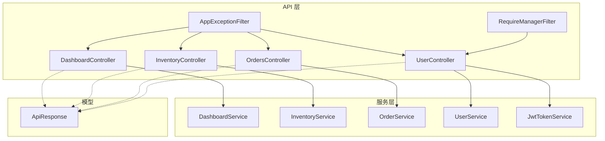
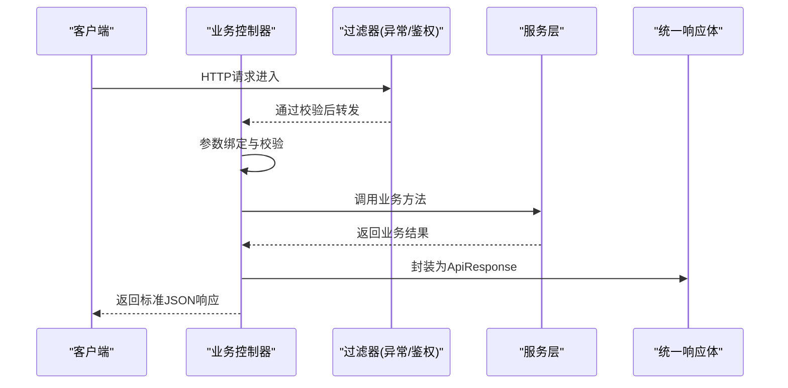
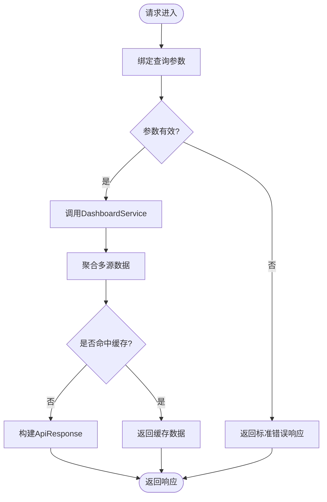
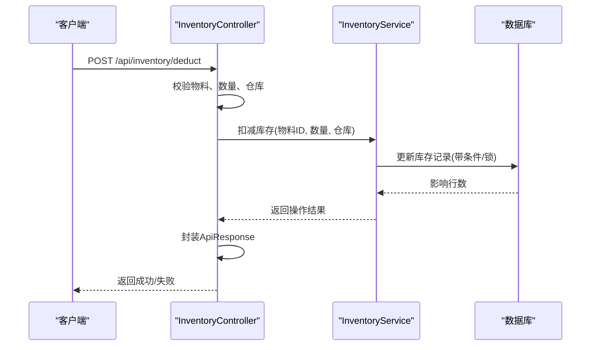
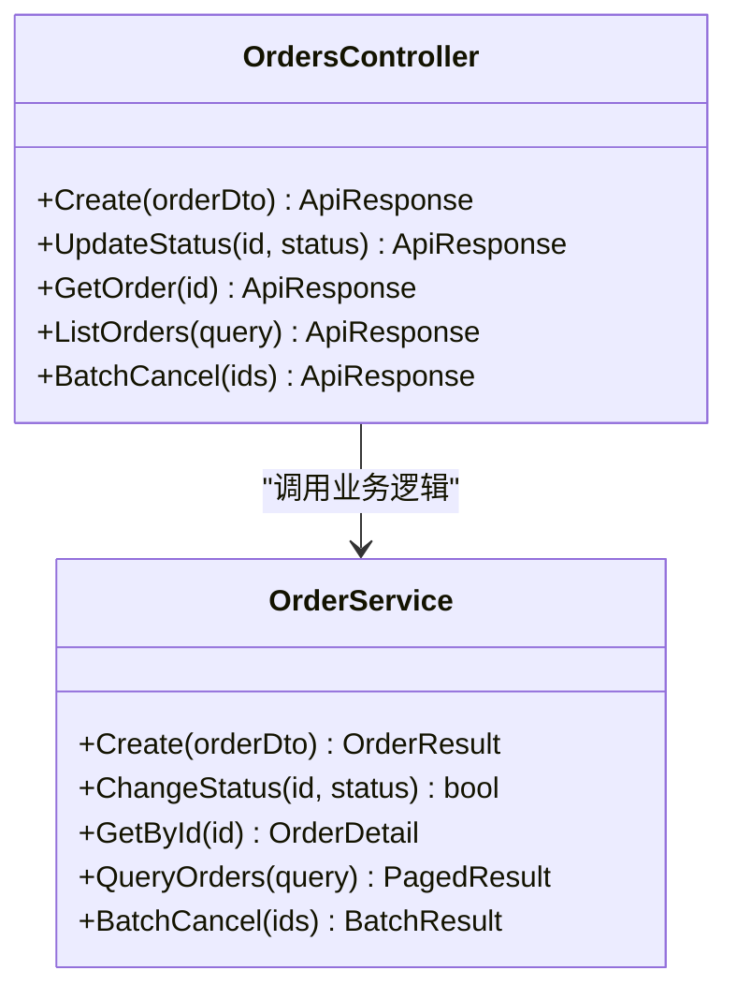
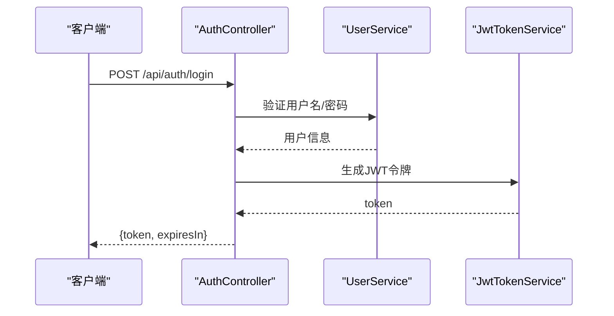
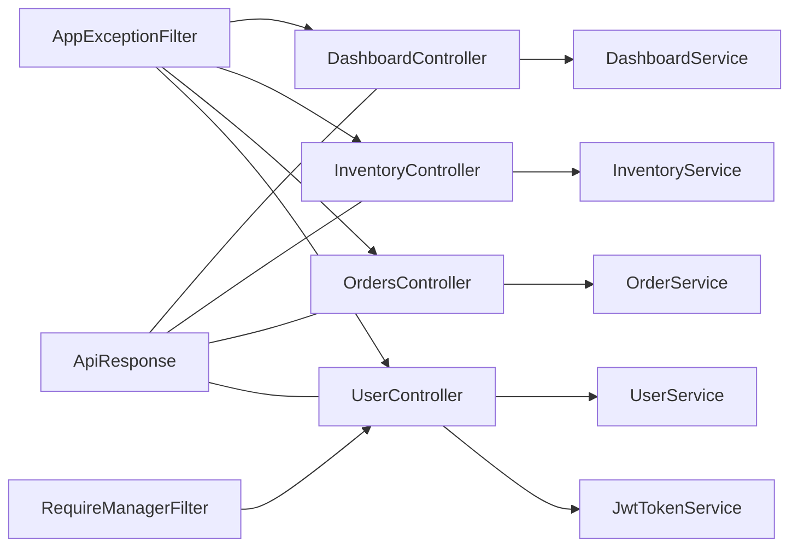

# 控制器层

<cite>
**本文引用的文件**   
- [Program.cs](file://dip-system/api/Program.cs)
- [AppExceptionFilter.cs](file://dip-system/api/Controllers/AppExceptionFilter.cs)
- [RequireManagerFilter.cs](file://dip-system/api/Controllers/RequireManagerFilter.cs)
- [DashboardController.cs](file://dip-system/api/Controllers/DashboardController.cs)
- [InventoryController.cs](file://dip-system/api/Controllers/InventoryController.cs)
- [OrdersController.cs](file://dip-system/api/Controllers/OrdersController.cs)
- [UserController.cs](file://dip-system/api/Controllers/UserController.cs)
- [DashboardService.cs](file://dip-system/api/Services/DashboardService.cs)
- [InventoryService.cs](file://dip-system/api/Services/InventoryService.cs)
- [OrderService.cs](file://dip-system/api/Services/OrderService.cs)
- [UserService.cs](file://dip-system/api/Services/UserService.cs)
- [ApiResponse.cs](file://dip-system/api/Models/ApiResponse.cs)
- [AuthController.cs](file://dip-system/api/Controllers/AuthController.cs)
- [JwtTokenService.cs](file://dip-system/api/Services/JwtTokenService.cs)
</cite>

## 目录
1. [简介](#简介)
2. [项目结构](#项目结构)
3. [核心组件](#核心组件)
4. [架构总览](#架构总览)
5. [详细组件分析](#详细组件分析)
6. [依赖关系分析](#依赖关系分析)
7. [性能考虑](#性能考虑)
8. [故障排查指南](#故障排查指南)
9. [结论](#结论)
10. [附录](#附录)

## 简介
本章节面向DIP系统控制器层的文档，聚焦于各业务控制器的职责划分、HTTP端点设计、请求响应格式标准化，以及控制器与服务层的交互模式。重点覆盖以下控制器：
- DashboardController：仪表板数据聚合与展示
- InventoryController：库存管理（查询、调整、盘点等）
- OrdersController：订单处理（创建、变更、状态流转）
- UserController：用户管理（增删改查、权限相关）

同时文档化通用能力：参数验证、错误处理、分页查询、批量操作；介绍数据传输对象（DTO）的使用与API版本控制策略；并提供性能优化建议与调试技巧。

## 项目结构
DIP系统的Web API位于dip-system/api目录，采用ASP.NET Core MVC/Web API组织方式：
- Controllers：HTTP控制器，负责路由、参数绑定、校验、调用服务层、返回统一响应
- Services：业务服务层，封装领域逻辑、事务、跨域协调
- Models：数据模型与统一响应体定义
- Program.cs：应用启动、中间件注册、依赖注入配置
- Filters：全局异常过滤器、鉴权/授权过滤器

图表来源
- [Program.cs](file://dip-system/api/Program.cs)
- [AppExceptionFilter.cs](file://dip-system/api/Controllers/AppExceptionFilter.cs)
- [RequireManagerFilter.cs](file://dip-system/api/Controllers/RequireManagerFilter.cs)
- [DashboardController.cs](file://dip-system/api/Controllers/DashboardController.cs)
- [InventoryController.cs](file://dip-system/api/Controllers/InventoryController.cs)
- [OrdersController.cs](file://dip-system/api/Controllers/OrdersController.cs)
- [UserController.cs](file://dip-system/api/Controllers/UserController.cs)
- [DashboardService.cs](file://dip-system/api/Services/DashboardService.cs)
- [InventoryService.cs](file://dip-system/api/Services/InventoryService.cs)
- [OrderService.cs](file://dip-system/api/Services/OrderService.cs)
- [UserService.cs](file://dip-system/api/Services/UserService.cs)
- [ApiResponse.cs](file://dip-system/api/Models/ApiResponse.cs)

章节来源
- [Program.cs](file://dip-system/api/Program.cs)
- [AppExceptionFilter.cs](file://dip-system/api/Controllers/AppExceptionFilter.cs)
- [RequireManagerFilter.cs](file://dip-system/api/Controllers/RequireManagerFilter.cs)

## 核心组件
本节概述控制器层的核心职责与通用机制：
- 控制器职责：接收HTTP请求、参数绑定与校验、调用服务层、构造统一响应体
- 统一响应体：通过ApiResponse封装成功/失败结果，包含状态码、消息、数据载荷
- 全局异常过滤：AppExceptionFilter捕获未处理异常，转换为标准错误响应
- 鉴权与授权：RequireManagerFilter用于角色/权限校验；AuthController与JwtTokenService配合完成认证流程
- 分页与搜索：控制器通常将分页参数（页码、每页大小、排序字段）传递给服务层，由服务层或仓储层实现高效查询
- 批量操作：控制器接收集合参数，交由服务层进行事务性批量处理

章节来源
- [ApiResponse.cs](file://dip-system/api/Models/ApiResponse.cs)
- [AppExceptionFilter.cs](file://dip-system/api/Controllers/AppExceptionFilter.cs)
- [RequireManagerFilter.cs](file://dip-system/api/Controllers/RequireManagerFilter.cs)
- [AuthController.cs](file://dip-system/api/Controllers/AuthController.cs)
- [JwtTokenService.cs](file://dip-system/api/Services/JwtTokenService.cs)

## 架构总览
控制器层作为HTTP入口，遵循“薄控制器、厚服务”的设计原则：
- 控制器仅做参数校验、调用服务、组装响应
- 服务层承载业务规则、事务边界、跨模块协作
- 模型层提供统一的响应结构与实体定义
- 过滤器贯穿请求生命周期，提供横切关注点（异常、鉴权）

图表来源
- [AppExceptionFilter.cs](file://dip-system/api/Controllers/AppExceptionFilter.cs)
- [RequireManagerFilter.cs](file://dip-system/api/Controllers/RequireManagerFilter.cs)
- [DashboardController.cs](file://dip-system/api/Controllers/DashboardController.cs)
- [InventoryController.cs](file://dip-system/api/Controllers/InventoryController.cs)
- [OrdersController.cs](file://dip-system/api/Controllers/OrdersController.cs)
- [UserController.cs](file://dip-system/api/Controllers/UserController.cs)
- [DashboardService.cs](file://dip-system/api/Services/DashboardService.cs)
- [InventoryService.cs](file://dip-system/api/Services/InventoryService.cs)
- [OrderService.cs](file://dip-system/api/Services/OrderService.cs)
- [UserService.cs](file://dip-system/api/Services/UserService.cs)
- [ApiResponse.cs](file://dip-system/api/Models/ApiResponse.cs)

## 详细组件分析

### DashboardController 仪表板数据聚合
- 职责：聚合多源数据（库存、订单、在线设备、报表等），提供仪表板概览指标
- 典型端点：
  - GET /api/dashboard/overview：获取关键指标汇总
  - GET /api/dashboard/trends：获取趋势数据（时间序列）
  - GET /api/dashboard/alerts：获取告警列表
- 参数与校验：支持时间范围、分组维度、阈值等查询参数；对非法值进行校验并返回标准错误
- 响应格式：统一使用ApiResponse包装，数据字段按业务语义命名
- 服务交互：调用DashboardService聚合数据，必要时并发调用多个子服务以提升性能
- 缓存策略：对热点指标可引入内存缓存（如IMemoryCache）减少数据库压力

图表来源
- [DashboardController.cs](file://dip-system/api/Controllers/DashboardController.cs)
- [DashboardService.cs](file://dip-system/api/Services/DashboardService.cs)
- [ApiResponse.cs](file://dip-system/api/Models/ApiResponse.cs)

章节来源
- [DashboardController.cs](file://dip-system/api/Controllers/DashboardController.cs)
- [DashboardService.cs](file://dip-system/api/Services/DashboardService.cs)

### InventoryController 库存管理
- 职责：管理物料库存的查询、入库、出库、调整、盘点、批次追踪等
- 典型端点：
  - GET /api/inventory/list：分页查询库存
  - POST /api/inventory/add：入库登记
  - POST /api/inventory/deduct：扣减库存
  - PUT /api/inventory/adjust：库存调整
  - POST /api/inventory/count：盘点提交
  - POST /api/inventory/batch-update：批量更新
- 参数与校验：严格校验物料编码、数量、批次号、仓库位置等；负数、零值、越界等场景需明确错误提示
- 响应格式：统一ApiResponse，分页结果包含总数、页码、每页大小、数据列表
- 服务交互：InventoryService处理库存一致性、并发控制、事务边界
- 并发与锁：高并发扣减场景建议使用乐观锁或分布式锁避免超卖

图表来源
- [InventoryController.cs](file://dip-system/api/Controllers/InventoryController.cs)
- [InventoryService.cs](file://dip-system/api/Services/InventoryService.cs)
- [ApiResponse.cs](file://dip-system/api/Models/ApiResponse.cs)

章节来源
- [InventoryController.cs](file://dip-system/api/Controllers/InventoryController.cs)
- [InventoryService.cs](file://dip-system/api/Services/InventoryService.cs)

### OrdersController 订单处理
- 职责：订单生命周期管理（创建、修改、取消、发货、收货、结算）
- 典型端点：
  - POST /api/orders/create：创建订单
  - PUT /api/orders/{id}/status：更新订单状态
  - GET /api/orders/{id}：查询订单详情
  - GET /api/orders/list：分页查询订单列表
  - POST /api/orders/batch-cancel：批量取消
- 参数与校验：订单号、SKU、数量、价格、收货地址等必填项校验；金额精度、枚举值合法性校验
- 响应格式：统一ApiResponse，订单详情包含明细、状态历史、操作日志
- 服务交互：OrderService负责订单状态机、事务、补偿逻辑（如库存预留释放）
- 幂等性：创建接口应支持幂等键，防止重复提交

图表来源
- [OrdersController.cs](file://dip-system/api/Controllers/OrdersController.cs)
- [OrderService.cs](file://dip-system/api/Services/OrderService.cs)
- [ApiResponse.cs](file://dip-system/api/Models/ApiResponse.cs)

章节来源
- [OrdersController.cs](file://dip-system/api/Controllers/OrdersController.cs)
- [OrderService.cs](file://dip-system/api/Services/OrderService.cs)

### UserController 用户管理
- 职责：用户账户管理、角色权限、登录认证
- 典型端点：
  - POST /api/auth/login：用户登录，返回JWT令牌
  - GET /api/users/me：获取当前用户信息
  - GET /api/users/list：分页查询用户列表
  - POST /api/users/create：创建用户
  - PUT /api/users/{id}：更新用户信息
  - DELETE /api/users/{id}：删除用户
- 参数与校验：用户名、密码、邮箱、角色等字段校验；密码加密存储；敏感信息脱敏返回
- 响应格式：统一ApiResponse，认证接口额外返回token与过期时间
- 服务交互：UserService处理用户CRUD；JwtTokenService生成/验证令牌；RequireManagerFilter进行角色校验
- 安全建议：启用HTTPS、密码强度策略、登录失败锁定、审计日志

图表来源
- [AuthController.cs](file://dip-system/api/Controllers/AuthController.cs)
- [UserService.cs](file://dip-system/api/Services/UserService.cs)
- [JwtTokenService.cs](file://dip-system/api/Services/JwtTokenService.cs)
- [RequireManagerFilter.cs](file://dip-system/api/Controllers/RequireManagerFilter.cs)

章节来源
- [UserController.cs](file://dip-system/api/Controllers/UserController.cs)
- [AuthController.cs](file://dip-system/api/Controllers/AuthController.cs)
- [UserService.cs](file://dip-system/api/Services/UserService.cs)
- [JwtTokenService.cs](file://dip-system/api/Services/JwtTokenService.cs)
- [RequireManagerFilter.cs](file://dip-system/api/Controllers/RequireManagerFilter.cs)

### 通用功能实现
- 参数验证：使用模型注解或自定义验证器，对必填、格式、范围进行校验；无效参数返回标准错误响应
- 错误处理：AppExceptionFilter捕获未处理异常，记录日志并返回统一错误结构
- 分页查询：支持page、pageSize、sortField、sortOrder等参数；服务端进行SQL分页或内存分页
- 批量操作：接收数组参数，服务层进行事务批量处理，返回成功/失败统计
- DTO使用：控制器输入输出使用DTO，隔离领域模型与API契约，便于版本演进

章节来源
- [AppExceptionFilter.cs](file://dip-system/api/Controllers/AppExceptionFilter.cs)
- [ApiResponse.cs](file://dip-system/api/Models/ApiResponse.cs)

## 依赖关系分析
控制器与服务层之间松耦合，通过接口或抽象类解耦；过滤器横切关注点独立；统一响应体贯穿全链路。

图表来源
- [DashboardController.cs](file://dip-system/api/Controllers/DashboardController.cs)
- [InventoryController.cs](file://dip-system/api/Controllers/InventoryController.cs)
- [OrdersController.cs](file://dip-system/api/Controllers/OrdersController.cs)
- [UserController.cs](file://dip-system/api/Controllers/UserController.cs)
- [DashboardService.cs](file://dip-system/api/Services/DashboardService.cs)
- [InventoryService.cs](file://dip-system/api/Services/InventoryService.cs)
- [OrderService.cs](file://dip-system/api/Services/OrderService.cs)
- [UserService.cs](file://dip-system/api/Services/UserService.cs)
- [JwtTokenService.cs](file://dip-system/api/Services/JwtTokenService.cs)
- [AppExceptionFilter.cs](file://dip-system/api/Controllers/AppExceptionFilter.cs)
- [RequireManagerFilter.cs](file://dip-system/api/Controllers/RequireManagerFilter.cs)
- [ApiResponse.cs](file://dip-system/api/Models/ApiResponse.cs)

章节来源
- [Program.cs](file://dip-system/api/Program.cs)

## 性能考虑
- 缓存热点数据：仪表板指标、字典数据、用户会话可使用IMemoryCache或Redis
- 异步I/O：控制器与服务层尽量使用异步方法，提升吞吐
- 分页与投影：只查询必要字段，避免N+1查询；使用数据库索引优化
- 批量操作：合并多次小事务为大事务，减少IO开销
- 连接池与超时：合理配置数据库连接池、HTTP客户端超时
- 限流与熔断：对高频接口实施限流，对下游服务熔断降级

[本节为通用指导，不直接分析具体文件]

## 故障排查指南
- 查看全局异常日志：AppExceptionFilter会记录异常堆栈与请求上下文
- 检查参数校验失败：确认请求体结构与校验规则一致
- 调试鉴权问题：检查JWT令牌有效性、角色权限配置
- 监控服务调用：在控制器或服务层添加结构化日志，跟踪关键路径
- 性能瓶颈定位：使用APM工具（如Application Insights）分析慢查询

章节来源
- [AppExceptionFilter.cs](file://dip-system/api/Controllers/AppExceptionFilter.cs)
- [RequireManagerFilter.cs](file://dip-system/api/Controllers/RequireManagerFilter.cs)

## 结论
DIP系统控制器层采用清晰的职责分离与统一响应规范，结合过滤器实现横切关注点，服务层承载核心业务逻辑。通过DTO、分页、批量操作、缓存与异步I/O等手段，系统在可扩展性与性能方面具备良好基础。建议在后续迭代中持续完善API版本控制、错误码体系与监控告警。

[本节为总结性内容，不直接分析具体文件]

## 附录
- API版本控制策略建议：
  - URL版本：/api/v1/...
  - Header版本：X-API-Version
  - 向后兼容：新增字段不破坏旧客户端
- 调试技巧：
  - 启用详细日志与TraceId
  - 使用Swagger/OpenAPI文档辅助联调
  - 本地模拟下游服务Mock

[本节为补充说明，不直接分析具体文件]