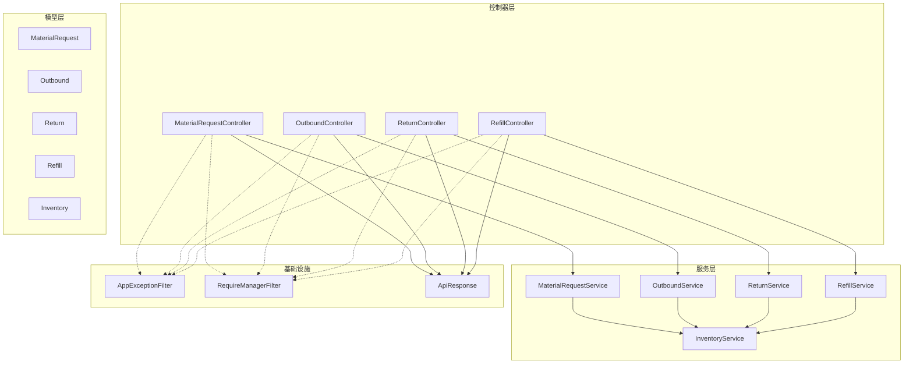
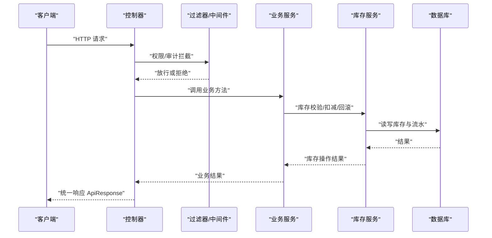
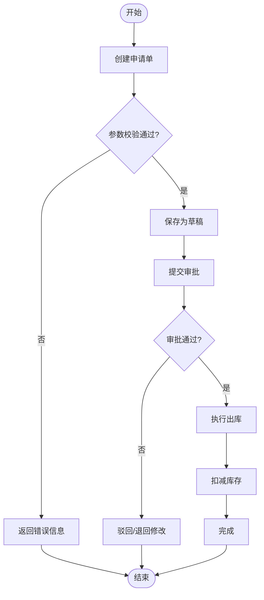
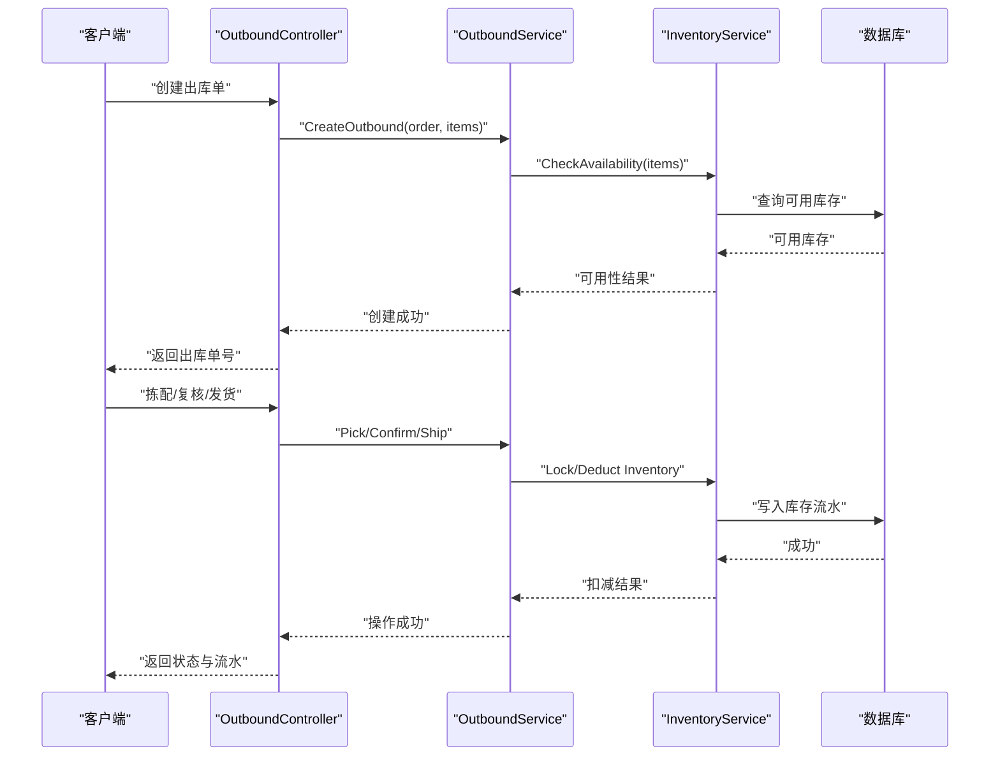
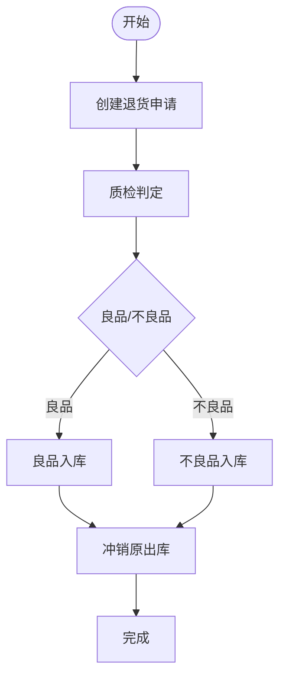
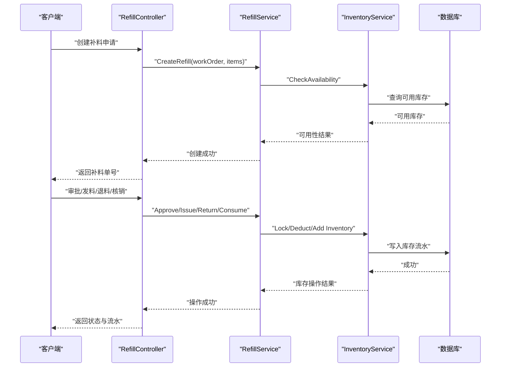
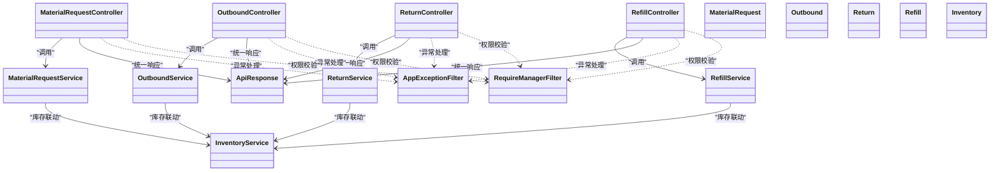

# 物料控制控制器

<cite>
**本文引用的文件**   
- [MaterialRequestController.cs](file://dip-system/api/Controllers/MaterialRequestController.cs)
- [OutboundController.cs](file://dip-system/api/Controllers/OutboundController.cs)
- [ReturnController.cs](file://dip-system/api/Controllers/ReturnController.cs)
- [RefillController.cs](file://dip-system/api/Controllers/RefillController.cs)
- [MaterialRequestService.cs](file://dip-system/api/Services/MaterialRequestService.cs)
- [OutboundService.cs](file://dip-system/api/Services/OutboundService.cs)
- [ReturnService.cs](file://dip-system/api/Services/ReturnService.cs)
- [RefillService.cs](file://dip-system/api/Services/RefillService.cs)
- [InventoryService.cs](file://dip-system/api/Services/InventoryService.cs)
- [MaterialRequest.cs](file://dip-system/api/Models/MaterialRequest.cs)
- [Outbound.cs](file://dip-system/api/Models/Outbound.cs)
- [Return.cs](file://dip-system/api/Models/Return.cs)
- [Refill.cs](file://dip-system/api/Models/Refill.cs)
- [Inventory.cs](file://dip-system/api/Models/Inventory.cs)
- [AppExceptionFilter.cs](file://dip-system/api/Controllers/AppExceptionFilter.cs)
- [RequireManagerFilter.cs](file://dip-system/api/Controllers/RequireManagerFilter.cs)
- [ApiResponse.cs](file://dip-system/api/Models/ApiResponse.cs)
</cite>

## 目录
1. [简介](#简介)
2. [项目结构](#项目结构)
3. [核心组件](#核心组件)
4. [架构总览](#架构总览)
5. [详细组件分析](#详细组件分析)
6. [依赖关系分析](#依赖关系分析)
7. [性能考量](#性能考量)
8. [故障排查指南](#故障排查指南)
9. [结论](#结论)
10. [附录](#附录)

## 简介
本文件面向DIP系统的物料控制相关控制器，聚焦以下四个关键API域：
- 物料申请（MaterialRequestController）
- 出库管理（OutboundController）
- 退货处理（ReturnController）
- 补料操作（RefillController）

文档将系统阐述：
- 各控制器的API职责与调用流程
- 物料流转状态管理与审批流程
- 库存联动更新机制
- 物料追溯、批次管理与有效期控制等业务逻辑
- 批量处理、异常处理、数据验证等实现细节
- 完整API示例与最佳实践

## 项目结构
DIP系统采用典型的分层架构：
- Controllers层：对外暴露REST API，负责参数校验、权限拦截、统一响应封装
- Services层：承载业务编排、事务边界、状态机推进、库存联动
- Models层：领域实体与DTO定义
- 中间件与过滤器：全局异常处理、角色权限校验
- 前端与移动端：通过HTTP调用后端API完成业务操作

图表来源
- [MaterialRequestController.cs:1-200](file://dip-system/api/Controllers/MaterialRequestController.cs#L1-L200)
- [OutboundController.cs:1-200](file://dip-system/api/Controllers/OutboundController.cs#L1-L200)
- [ReturnController.cs:1-200](file://dip-system/api/Controllers/ReturnController.cs#L1-L200)
- [RefillController.cs:1-200](file://dip-system/api/Controllers/RefillController.cs#L1-L200)
- [MaterialRequestService.cs:1-200](file://dip-system/api/Services/MaterialRequestService.cs#L1-L200)
- [OutboundService.cs:1-200](file://dip-system/api/Services/OutboundService.cs#L1-L200)
- [ReturnService.cs:1-200](file://dip-system/api/Services/ReturnService.cs#L1-L200)
- [RefillService.cs:1-200](file://dip-system/api/Services/RefillService.cs#L1-L200)
- [InventoryService.cs:1-200](file://dip-system/api/Services/InventoryService.cs#L1-L200)
- [AppExceptionFilter.cs:1-200](file://dip-system/api/Controllers/AppExceptionFilter.cs#L1-L200)
- [RequireManagerFilter.cs:1-200](file://dip-system/api/Controllers/RequireManagerFilter.cs#L1-L200)
- [ApiResponse.cs:1-200](file://dip-system/api/Models/ApiResponse.cs#L1-L200)

章节来源
- [MaterialRequestController.cs:1-200](file://dip-system/api/Controllers/MaterialRequestController.cs#L1-L200)
- [OutboundController.cs:1-200](file://dip-system/api/Controllers/OutboundController.cs#L1-L200)
- [ReturnController.cs:1-200](file://dip-system/api/Controllers/ReturnController.cs#L1-L200)
- [RefillController.cs:1-200](file://dip-system/api/Controllers/RefillController.cs#L1-L200)
- [MaterialRequestService.cs:1-200](file://dip-system/api/Services/MaterialRequestService.cs#L1-L200)
- [OutboundService.cs:1-200](file://dip-system/api/Services/OutboundService.cs#L1-L200)
- [ReturnService.cs:1-200](file://dip-system/api/Services/ReturnService.cs#L1-L200)
- [RefillService.cs:1-200](file://dip-system/api/Services/RefillService.cs#L1-L200)
- [InventoryService.cs:1-200](file://dip-system/api/Services/InventoryService.cs#L1-L200)
- [AppExceptionFilter.cs:1-200](file://dip-system/api/Controllers/AppExceptionFilter.cs#L1-L200)
- [RequireManagerFilter.cs:1-200](file://dip-system/api/Controllers/RequireManagerFilter.cs#L1-L200)
- [ApiResponse.cs:1-200](file://dip-system/api/Models/ApiResponse.cs#L1-L200)

## 核心组件
本节概述四大控制器与其对应服务的职责边界与协作方式。

- MaterialRequestController
  - 职责：物料申请单的创建、查询、提交、审批、撤回、作废、批量导入导出
  - 关键交互：调用MaterialRequestService进行单据生命周期管理；必要时联动InventoryService预占或释放库存
  - 典型状态：草稿、待审批、已批准、已执行、已撤回、已作废

- OutboundController
  - 职责：出库单创建、拣配、复核、发货、部分出库、取消出库
  - 关键交互：调用OutboundService执行出库策略（FIFO/FEFO）、批次与效期校验；联动InventoryService扣减库存并生成出库流水
  - 典型状态：草稿、待拣配、拣配中、已复核、已发货、已关闭、已取消

- ReturnController
  - 职责：退货申请、质检、入库、冲销原出库、退货结算
  - 关键交互：调用ReturnService处理退货策略（良品/不良品分流）、批次回滚与效期检查；联动InventoryService增加库存并记录退货流水
  - 典型状态：草稿、待质检、质检中、已入库、已冲销、已完成、已取消

- RefillController
  - 职责：产线/工位补料申请、审批、发料、退料、补料核销
  - 关键交互：调用RefillService计算补料需求、校验可用库存与批次效期；联动InventoryService扣减/回补库存并生成补料流水
  - 典型状态：草稿、待审批、已批准、已发料、已核销、已取消

章节来源
- [MaterialRequestController.cs:1-200](file://dip-system/api/Controllers/MaterialRequestController.cs#L1-L200)
- [OutboundController.cs:1-200](file://dip-system/api/Controllers/OutboundController.cs#L1-L200)
- [ReturnController.cs:1-200](file://dip-system/api/Controllers/ReturnController.cs#L1-L200)
- [RefillController.cs:1-200](file://dip-system/api/Controllers/RefillController.cs#L1-L200)
- [MaterialRequestService.cs:1-200](file://dip-system/api/Services/MaterialRequestService.cs#L1-L200)
- [OutboundService.cs:1-200](file://dip-system/api/Services/OutboundService.cs#L1-L200)
- [ReturnService.cs:1-200](file://dip-system/api/Services/ReturnService.cs#L1-L200)
- [RefillService.cs:1-200](file://dip-system/api/Services/RefillService.cs#L1-L200)

## 架构总览
下图展示从请求到响应的端到端流程，包括权限校验、异常处理、业务编排与库存联动。

图表来源
- [MaterialRequestController.cs:1-200](file://dip-system/api/Controllers/MaterialRequestController.cs#L1-L200)
- [OutboundController.cs:1-200](file://dip-system/api/Controllers/OutboundController.cs#L1-L200)
- [ReturnController.cs:1-200](file://dip-system/api/Controllers/ReturnController.cs#L1-L200)
- [RefillController.cs:1-200](file://dip-system/api/Controllers/RefillController.cs#L1-L200)
- [MaterialRequestService.cs:1-200](file://dip-system/api/Services/MaterialRequestService.cs#L1-L200)
- [OutboundService.cs:1-200](file://dip-system/api/Services/OutboundService.cs#L1-L200)
- [ReturnService.cs:1-200](file://dip-system/api/Services/ReturnService.cs#L1-L200)
- [RefillService.cs:1-200](file://dip-system/api/Services/RefillService.cs#L1-L200)
- [InventoryService.cs:1-200](file://dip-system/api/Services/InventoryService.cs#L1-L200)
- [AppExceptionFilter.cs:1-200](file://dip-system/api/Controllers/AppExceptionFilter.cs#L1-L200)
- [RequireManagerFilter.cs:1-200](file://dip-system/api/Controllers/RequireManagerFilter.cs#L1-L200)
- [ApiResponse.cs:1-200](file://dip-system/api/Models/ApiResponse.cs#L1-L200)

## 详细组件分析

### 物料申请（MaterialRequestController）
- API能力
  - 创建申请单：支持多行明细、必填字段校验、重复性检查
  - 提交审批：状态由“草稿”转为“待审批”，触发审批流
  - 审批通过：状态转为“已批准”，可进入执行阶段
  - 执行出库：根据申请单生成出库任务，联动库存扣减
  - 撤回/作废：在允许状态下撤销单据，释放预占库存
  - 批量导入：Excel/CSV批量创建申请单，返回失败明细
- 状态机
  - 草稿 → 待审批 → 已批准 → 已执行 → 已撤回/已作废
- 库存联动
  - 审批通过后预占库存（可选），执行时正式扣减
- 追溯与批次
  - 记录申请人、时间戳、关联工单/订单号
  - 支持按物料编码、批次号、有效期范围筛选

图表来源
- [MaterialRequestController.cs:1-200](file://dip-system/api/Controllers/MaterialRequestController.cs#L1-L200)
- [MaterialRequestService.cs:1-200](file://dip-system/api/Services/MaterialRequestService.cs#L1-L200)
- [MaterialRequest.cs:1-200](file://dip-system/api/Models/MaterialRequest.cs#L1-L200)

章节来源
- [MaterialRequestController.cs:1-200](file://dip-system/api/Controllers/MaterialRequestController.cs#L1-L200)
- [MaterialRequestService.cs:1-200](file://dip-system/api/Services/MaterialRequestService.cs#L1-L200)
- [MaterialRequest.cs:1-200](file://dip-system/api/Models/MaterialRequest.cs#L1-L200)

### 出库管理（OutboundController）
- API能力
  - 创建出库单：关联申请单/生产工单，选择出库策略（FIFO/FEFO）
  - 拣配作业：按批次与效期规则分配库存，支持部分拣配
  - 复核确认：校验实物与系统一致后确认出库
  - 发货出库：正式扣减库存，生成出库流水
  - 取消出库：在允许状态下取消，恢复库存
- 状态机
  - 草稿 → 待拣配 → 拣配中 → 已复核 → 已发货 → 已关闭/已取消
- 库存联动
  - 拣配阶段锁定批次数量，复核确认后扣减
  - 支持批次级扣减与效期优先（FEFO）
- 追溯与批次
  - 记录批次号、生产日期、有效期至、库位、操作人
  - 支持按批次号、有效期范围、出库单号追踪

图表来源
- [OutboundController.cs:1-200](file://dip-system/api/Controllers/OutboundController.cs#L1-L200)
- [OutboundService.cs:1-200](file://dip-system/api/Services/OutboundService.cs#L1-L200)
- [InventoryService.cs:1-200](file://dip-system/api/Services/InventoryService.cs#L1-L200)
- [Outbound.cs:1-200](file://dip-system/api/Models/Outbound.cs#L1-L200)

章节来源
- [OutboundController.cs:1-200](file://dip-system/api/Controllers/OutboundController.cs#L1-L200)
- [OutboundService.cs:1-200](file://dip-system/api/Services/OutboundService.cs#L1-L200)
- [InventoryService.cs:1-200](file://dip-system/api/Services/InventoryService.cs#L1-L200)
- [Outbound.cs:1-200](file://dip-system/api/Models/Outbound.cs#L1-L200)

### 退货处理（ReturnController）
- API能力
  - 创建退货申请：关联原出库单，填写退货原因、数量、质量判定
  - 质检处理：区分良品/不良品，决定入库路径
  - 退货入库：良品入良品仓，不良品入不良品仓，支持批次回滚
  - 冲销原出库：对原出库单进行冲销，生成退货流水
  - 取消退货：在允许状态下取消，释放预占库存
- 状态机
  - 草稿 → 待质检 → 质检中 → 已入库 → 已冲销 → 已完成/已取消
- 库存联动
  - 良品增加库存，不良品进入隔离库或报废流程
  - 支持批次级回滚与效期校验
- 追溯与批次
  - 记录原出库单号、批次号、效期、质检结果、责任人

图表来源
- [ReturnController.cs:1-200](file://dip-system/api/Controllers/ReturnController.cs#L1-L200)
- [ReturnService.cs:1-200](file://dip-system/api/Services/ReturnService.cs#L1-L200)
- [Return.cs:1-200](file://dip-system/api/Models/Return.cs#L1-L200)

章节来源
- [ReturnController.cs:1-200](file://dip-system/api/Controllers/ReturnController.cs#L1-L200)
- [ReturnService.cs:1-200](file://dip-system/api/Services/ReturnService.cs#L1-L200)
- [Return.cs:1-200](file://dip-system/api/Models/Return.cs#L1-L200)

### 补料操作（RefillController）
- API能力
  - 补料申请：按工单/工位需求计算补料量，支持紧急补料
  - 审批与发料：审批通过后发料至指定工位，支持部分发料
  - 退料与核销：未使用物料退库，核销实际消耗
  - 取消补料：在允许状态下取消，释放预占库存
- 状态机
  - 草稿 → 待审批 → 已批准 → 已发料 → 已核销 → 已取消
- 库存联动
  - 发料扣减库存，退料增加库存，核销生成补料流水
- 追溯与批次
  - 记录工单号、工位、批次号、效期、操作人、时间戳

图表来源
- [RefillController.cs:1-200](file://dip-system/api/Controllers/RefillController.cs#L1-L200)
- [RefillService.cs:1-200](file://dip-system/api/Services/RefillService.cs#L1-L200)
- [InventoryService.cs:1-200](file://dip-system/api/Services/InventoryService.cs#L1-L200)
- [Refill.cs:1-200](file://dip-system/api/Models/Refill.cs#L1-L200)

章节来源
- [RefillController.cs:1-200](file://dip-system/api/Controllers/RefillController.cs#L1-L200)
- [RefillService.cs:1-200](file://dip-system/api/Services/RefillService.cs#L1-L200)
- [InventoryService.cs:1-200](file://dip-system/api/Services/InventoryService.cs#L1-L200)
- [Refill.cs:1-200](file://dip-system/api/Models/Refill.cs#L1-L200)

## 依赖关系分析
- 控制器与服务
  - 每个控制器仅负责参数校验、权限拦截、统一响应封装，业务逻辑下沉至服务层
- 服务与库存
  - 所有涉及库存变动的操作均通过InventoryService统一处理，确保一致性
- 异常与权限
  - AppExceptionFilter统一捕获异常并返回标准错误格式
  - RequireManagerFilter用于角色/权限校验，如“物料管理员”、“仓库主管”等

图表来源
- [MaterialRequestController.cs:1-200](file://dip-system/api/Controllers/MaterialRequestController.cs#L1-L200)
- [OutboundController.cs:1-200](file://dip-system/api/Controllers/OutboundController.cs#L1-L200)
- [ReturnController.cs:1-200](file://dip-system/api/Controllers/ReturnController.cs#L1-L200)
- [RefillController.cs:1-200](file://dip-system/api/Controllers/RefillController.cs#L1-L200)
- [MaterialRequestService.cs:1-200](file://dip-system/api/Services/MaterialRequestService.cs#L1-L200)
- [OutboundService.cs:1-200](file://dip-system/api/Services/OutboundService.cs#L1-L200)
- [ReturnService.cs:1-200](file://dip-system/api/Services/ReturnService.cs#L1-L200)
- [RefillService.cs:1-200](file://dip-system/api/Services/RefillService.cs#L1-L200)
- [InventoryService.cs:1-200](file://dip-system/api/Services/InventoryService.cs#L1-L200)
- [MaterialRequest.cs:1-200](file://dip-system/api/Models/MaterialRequest.cs#L1-L200)
- [Outbound.cs:1-200](file://dip-system/api/Models/Outbound.cs#L1-L200)
- [Return.cs:1-200](file://dip-system/api/Models/Return.cs#L1-L200)
- [Refill.cs:1-200](file://dip-system/api/Models/Refill.cs#L1-L200)
- [Inventory.cs:1-200](file://dip-system/api/Models/Inventory.cs#L1-L200)
- [AppExceptionFilter.cs:1-200](file://dip-system/api/Controllers/AppExceptionFilter.cs#L1-L200)
- [RequireManagerFilter.cs:1-200](file://dip-system/api/Controllers/RequireManagerFilter.cs#L1-L200)
- [ApiResponse.cs:1-200](file://dip-system/api/Models/ApiResponse.cs#L1-L200)

章节来源
- [MaterialRequestController.cs:1-200](file://dip-system/api/Controllers/MaterialRequestController.cs#L1-L200)
- [OutboundController.cs:1-200](file://dip-system/api/Controllers/OutboundController.cs#L1-L200)
- [ReturnController.cs:1-200](file://dip-system/api/Controllers/ReturnController.cs#L1-L200)
- [RefillController.cs:1-200](file://dip-system/api/Controllers/RefillController.cs#L1-L200)
- [MaterialRequestService.cs:1-200](file://dip-system/api/Services/MaterialRequestService.cs#L1-L200)
- [OutboundService.cs:1-200](file://dip-system/api/Services/OutboundService.cs#L1-L200)
- [ReturnService.cs:1-200](file://dip-system/api/Services/ReturnService.cs#L1-L200)
- [RefillService.cs:1-200](file://dip-system/api/Services/RefillService.cs#L1-L200)
- [InventoryService.cs:1-200](file://dip-system/api/Services/InventoryService.cs#L1-L200)
- [MaterialRequest.cs:1-200](file://dip-system/api/Models/MaterialRequest.cs#L1-L200)
- [Outbound.cs:1-200](file://dip-system/api/Models/Outbound.cs#L1-L200)
- [Return.cs:1-200](file://dip-system/api/Models/Return.cs#L1-L200)
- [Refill.cs:1-200](file://dip-system/api/Models/Refill.cs#L1-L200)
- [Inventory.cs:1-200](file://dip-system/api/Models/Inventory.cs#L1-L200)
- [AppExceptionFilter.cs:1-200](file://dip-system/api/Controllers/AppExceptionFilter.cs#L1-L200)
- [RequireManagerFilter.cs:1-200](file://dip-system/api/Controllers/RequireManagerFilter.cs#L1-L200)
- [ApiResponse.cs:1-200](file://dip-system/api/Models/ApiResponse.cs#L1-L200)

## 性能考量
- 批量操作优化
  - 建议分批提交（每批50-200条），避免单次请求过大导致超时
  - 使用异步接口或消息队列处理大批量导入导出
- 库存并发控制
  - 高并发场景下使用分布式锁或乐观锁防止超卖
  - 对热点物料设置缓存预热与读多写少策略
- 查询优化
  - 对常用过滤条件（物料编码、批次号、有效期范围、单号）建立索引
  - 分页查询限制最大页大小，避免全表扫描
- 事务边界
  - 将库存扣减与流水记录置于同一事务，保证一致性
  - 长事务拆分为短事务，减少锁持有时间

[本节为通用指导，不直接分析具体文件]

## 故障排查指南
- 常见异常类型
  - 参数校验失败：必填字段缺失、格式错误、数值越界
  - 权限不足：缺少“物料管理员”、“仓库主管”等角色
  - 库存不足：可用库存小于申请/出库/补料数量
  - 批次/效期无效：批次不存在、已过期、不符合FEFO/FIFO策略
  - 状态非法：当前单据状态不允许执行该操作
- 定位步骤
  - 查看统一响应体中的错误码与消息
  - 检查过滤器日志（权限拦截）与异常过滤器日志（全局异常）
  - 核对库存流水与单据流水是否一致
  - 复现最小用例，逐步缩小问题范围
- 修复建议
  - 修正请求参数或补充必要字段
  - 调整用户角色或授权配置
  - 补充库存或调整出库策略
  - 更换有效批次或延长有效期
  - 在允许的状态下重试或先执行前置操作

章节来源
- [AppExceptionFilter.cs:1-200](file://dip-system/api/Controllers/AppExceptionFilter.cs#L1-L200)
- [RequireManagerFilter.cs:1-200](file://dip-system/api/Controllers/RequireManagerFilter.cs#L1-L200)
- [ApiResponse.cs:1-200](file://dip-system/api/Models/ApiResponse.cs#L1-L200)

## 结论
DIP系统的物料控制控制器围绕申请、出库、退货、补料四大核心场景，构建了清晰的分层架构与严谨的状态机管理。通过统一的库存服务与异常处理机制，确保了业务一致性与可追溯性。建议在实施中遵循批量优化、并发控制、查询优化与事务边界等最佳实践，以提升系统稳定性与性能。

[本节为总结性内容，不直接分析具体文件]

## 附录
- API示例与最佳实践
  - 物料申请
    - 创建申请单：提交物料编码、数量、工单号、期望到货日期
    - 提交审批：确保必填字段完整，避免重复申请
    - 执行出库：仅在审批通过后执行，注意批次与效期校验
  - 出库管理
    - 创建出库单：选择FIFO/FEFO策略，确保批次有效
    - 拣配与复核：逐行核对数量与批次，避免差异
    - 发货出库：确认无误后扣减库存，生成流水
  - 退货处理
    - 创建退货申请：明确退货原因与质量判定
    - 质检入库：良品与不良品分流，避免混放
    - 冲销原出库：确保与原出库单号匹配
  - 补料操作
    - 补料申请：按工单需求计算补料量，避免过量
    - 发料与核销：记录实际消耗，及时退库未用物料
  - 通用规范
    - 统一使用ApiResponse作为响应格式
    - 所有库存变动必须伴随流水记录
    - 敏感操作需具备相应角色权限
    - 批量操作建议分批次提交并处理失败明细

[本节为通用指导，不直接分析具体文件]